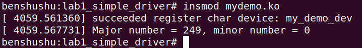

# 实验 6-1：从一个简单的字符设备开始

## 1．实验目的

​		1）编写一个简单的字符设备驱动，实现基本的 open、read 和 write 方法。

​		2）编写相应的用户空间测试程序，要求测试程序调用 read()函数，并能看到对应

的驱动程序执行了相应的 read 方法。

## 2．实验详解

在详细介绍字符设备驱动架构之前，我们先用一个简单的设备驱动来“热身”。

```C
<一个简单的字符设备驱动例子 simple_char.c>
#include <linux/module.h>
#include <linux/fs.h>
#include <linux/uaccess.h>
#include <linux/init.h>
#include <linux/cdev.h>

#define DEMO_NAME "my_demo_dev"
static dev_t dev;
static struct cdev *demo_cdev;
static signed count = 1;

static int demodrv_open(struct inode *inode, struct file *file)
{
    int major = MAJOR(inode->i_rdev);
    int minor = MINOR(inode->i_rdev);

    printk("%s: major=%d, minor=%d\n", __func__, major, minor);

    return 0;
}

static int demodrv_release(struct inode *inode, struct file *file)
{
    return 0;
}

static ssize_t demodrv_read(struct file *file, char __user *buf, size_t lbuf, loff_t *ppos)
{
    printk("%s enter\n", __func__);
    return 0;
}

static ssize_t demodrv_write(struct file *file, const char __user *buf, size_t count, loff_t *f_pos)
{
    printk("%s enter\n", __func__);
    return 0;
}

static const struct file_operations demodrv_fops = {
    .owner = THIS_MODULE,
    .open = demodrv_open,
    .release = demodrv_release,
    .read = demodrv_read,
    .write = demodrv_write
};

static int __init simple_char_init(void)
{
    int ret;

    ret = alloc_chrdev_region(&dev, 0, count, DEMO_NAME);
    if (ret) {
        printk("failed to allocate char device region");
        return ret;
    }

    demo_cdev = cdev_alloc();
    if (!demo_cdev) {
        printk("cdev_alloc failed\n");
        goto unregister_chrdev;
    }

    cdev_init(demo_cdev, &demodrv_fops);

    ret = cdev_add(demo_cdev, dev, count);
    if (ret) {
        printk("cdev_add failed\n");
        goto cdev_fail;
    }

    printk("succeeded register char device: %s\n", DEMO_NAME);
    printk("Major number = %d, minor number = %d\n", MAJOR(dev), MINOR(dev));

    return 0;

cdev_fail:
    cdev_del(demo_cdev);
unregister_chrdev:
    unregister_chrdev_region(dev, count);

    return ret;
}

static void __exit simple_char_exit(void)
{
    printk("removing device\n");

    if (demo_cdev)
        cdev_del(demo_cdev);

    unregister_chrdev_region(dev, count);
}

module_init(simple_char_init);
module_exit(simple_char_exit);

MODULE_AUTHOR("Benshushu");
MODULE_LICENSE("GPL v2");
MODULE_DESCRIPTION("simple character device");

```

------

### 代码整体说明：

​		这段代码实现了一个简单的 Linux 字符设备驱动模块。该驱动定义了设备的打开、释放、读取和写入操作，并且通过 `cdev` 结构在内核中注册了设备。模块初始化时，驱动会注册字符设备并分配主设备号和次设备号，退出时会注销设备并释放资源。

#### 代码及注释：

```C
#include <linux/module.h>   // 模块相关的宏和函数
#include <linux/fs.h>       // 文件操作相关的定义
#include <linux/uaccess.h>  // 用户空间和内核空间之间的数据传输
#include <linux/init.h>     // 模块初始化和退出宏
#include <linux/cdev.h>     // 字符设备的创建和操作

// 设备名称定义
#define DEMO_NAME "my_demo_dev"

// 全局变量
static dev_t dev;                   // 保存设备号 (主设备号 + 次设备号)
static struct cdev *demo_cdev;      // 字符设备结构体
static signed count = 1;            // 设备的数量，设为1表示只有一个设备

/**
 * demodrv_open - 设备打开函数
 * @inode: 设备对应的 inode 节点
 * @file: 文件结构指针，代表打开的文件
 *
 * 该函数在用户进程打开设备时被调用，主要用于打印设备的主设备号和次设备号。
 */
static int demodrv_open(struct inode *inode, struct file *file)
{
    int major = MAJOR(inode->i_rdev);  // 获取主设备号
    int minor = MINOR(inode->i_rdev);  // 获取次设备号

    printk("%s: major=%d, minor=%d\n", __func__, major, minor);

    return 0;  // 打开成功返回 0
}

/**
 * demodrv_release - 设备释放函数
 * @inode: 设备对应的 inode 节点
 * @file: 文件结构指针
 *
 * 该函数在用户进程关闭设备时被调用，这里没有特殊操作，直接返回 0。
 */
static int demodrv_release(struct inode *inode, struct file *file)
{
    return 0;  // 设备关闭成功
}

/**
 * demodrv_read - 设备读取函数
 * @file: 文件结构指针
 * @buf: 用户空间缓冲区，用于存储读取的数据
 * @lbuf: 要读取的数据长度
 * @ppos: 文件指针位置
 *
 * 该函数在用户读取设备时被调用，演示用的驱动只打印调试信息，并不实际返回数据。
 */
static ssize_t demodrv_read(struct file *file, char __user *buf, size_t lbuf, loff_t *ppos)
{
    printk("%s enter\n", __func__);  // 打印读取操作的调试信息
    return 0;  // 返回 0 表示读取结束（没有数据）
}

/**
 * demodrv_write - 设备写入函数
 * @file: 文件结构指针
 * @buf: 用户空间缓冲区，包含要写入的数据
 * @count: 要写入的数据长度
 * @f_pos: 文件指针位置
 *
 * 该函数在用户向设备写入数据时被调用，演示用的驱动只打印调试信息，不实际处理数据。
 */
static ssize_t demodrv_write(struct file *file, const char __user *buf, size_t count, loff_t *f_pos)
{
    printk("%s enter\n", __func__);  // 打印写入操作的调试信息
    return 0;  // 返回 0 表示写入成功（不处理数据）
}

// 定义文件操作结构体，包含了设备的打开、关闭、读和写的操作函数
static const struct file_operations demodrv_fops = {
    .owner = THIS_MODULE,       // 设备所有者，指向当前模块
    .open = demodrv_open,       // 打开设备时调用的函数
    .release = demodrv_release, // 关闭设备时调用的函数
    .read = demodrv_read,       // 读取设备时调用的函数
    .write = demodrv_write      // 写入设备时调用的函数
};

/**
 * simple_char_init - 模块初始化函数
 *
 * 该函数在模块加载时调用，用于注册字符设备并分配主设备号和次设备号。
 */
static int __init simple_char_init(void)
{
    int ret;

    // 分配字符设备区域，动态获取主设备号
    ret = alloc_chrdev_region(&dev, 0, count, DEMO_NAME);
    if (ret) {
        printk("failed to allocate char device region");
        return ret;
    }

    // 分配 cdev 结构体
    demo_cdev = cdev_alloc();
    if (!demo_cdev) {
        printk("cdev_alloc failed\n");
        goto unregister_chrdev;
    }

    // 初始化 cdev 结构体，并将操作函数与其关联
    cdev_init(demo_cdev, &demodrv_fops);

    // 添加字符设备到系统中
    ret = cdev_add(demo_cdev, dev, count);
    if (ret) {
        printk("cdev_add failed\n");
        goto cdev_fail;
    }

    // 打印成功注册的信息
    printk("succeeded register char device: %s\n", DEMO_NAME);
    printk("Major number = %d, minor number = %d\n", MAJOR(dev), MINOR(dev));

    return 0;  // 模块初始化成功

cdev_fail:
    cdev_del(demo_cdev);  // 删除 cdev
unregister_chrdev:
    unregister_chrdev_region(dev, count);  // 释放设备号

    return ret;
}

/**
 * simple_char_exit - 模块退出函数
 *
 * 该函数在模块卸载时调用，用于注销字符设备并释放资源。
 */
static void __exit simple_char_exit(void)
{
    printk("removing device\n");

    // 如果 cdev 存在，删除它
    if (demo_cdev)
        cdev_del(demo_cdev);

    // 注销字符设备区域，释放主设备号和次设备号
    unregister_chrdev_region(dev, count);
}

// 指定模块的初始化和退出函数
module_init(simple_char_init);
module_exit(simple_char_exit);

MODULE_AUTHOR("Benshushu");      // 模块作者
MODULE_LICENSE("GPL v2");        // 模块许可证
MODULE_DESCRIPTION("simple character device");  // 模块描述
```

#### 分析过程：

1. **设备的注册与分配：**
   - `alloc_chrdev_region()` 动态分配字符设备的主设备号和次设备号。`dev` 保存了分配的设备号，`count` 表示要注册的设备数量（这里为1）。
   - `cdev_alloc()` 分配 `cdev` 结构体，这是 Linux 中用于表示字符设备的内核对象。
   - `cdev_init()` 初始化 `cdev` 结构体，并将文件操作函数集 (`demodrv_fops`) 与字符设备绑定。
   - `cdev_add()` 将字符设备添加到内核中，注册设备并使其对用户空间可见。
2. **设备的操作函数：**
   - `open()` 函数在用户进程打开设备时被调用，主要用于打印设备的主设备号和次设备号。
   - `release()` 函数在用户关闭设备时调用，这里没有特别的释放操作。
   - `read()` 和 `write()` 函数分别在读取和写入设备时调用。代码中它们只打印调试信息，并不实际操作数据。
3. **模块的初始化与退出：**
   - `module_init()` 和 `module_exit()` 宏分别指定模块的初始化函数和退出函数。
   - 在 `simple_char_init()` 中完成了字符设备的注册、设备号的分配和设备的添加。
   - 在 `simple_char_exit()` 中，卸载模块时会注销字符设备并释放分配的资源。

#### 关键点：

- **字符设备注册**：通过 `alloc_chrdev_region()` 动态分配设备号，并通过 `cdev_add()` 将设备注册到内核。
- **文件操作接口**：定义了基本的文件操作接口，如 `open`、`release`、`read` 和 `write`，这些接口定义了用户空间与设备的交互方式。
- **模块初始化与退出**：字符设备驱动的模块初始化和退出必须清理资源，防止内存泄漏或设备号冲突。

​		

------

上述内容是一个简单的字符设备驱动的例子，它只有字符设备驱动的框架，并没有什么实际的意义。但是对于刚入门的读者来说，这确实是一个很好的学习例子，因为字符设备驱动中绝大多数的 API 接口都呈现在了这个例子中。

​		下面先看如何编译它。

```makefile
<Makefile文件>
BASEINCLUDE ?= /lib/modules/`uname -r`/build
mydemo-objs := simple_char.o
obj-m := mydemo.o

all:
	$(MAKE) -C $(BASEINCLUDE) M=$(PWD) modules;

clean:
	$(MAKE) -C $(BASEINCLUDE) M=$(PWD) clean;
	rm -f *.ko;
```

------

### 代码注释及分析：

#### 代码内容及注释：

```makefile
# 定义内核的构建目录路径，使用 uname -r 获取当前内核版本
BASEINCLUDE ?= /lib/modules/`uname -r`/build

# 指定 mydemo 模块的编译对象文件，将 simple_char.o 作为构建对象
mydemo-objs := simple_char.o

# 定义最终要生成的模块对象（mydemo.o）
obj-m := mydemo.o

# 定义 all 目标，该目标负责编译模块
all:
	# 使用内核构建系统来编译模块，-C 表示切换到 BASEINCLUDE 目录，
	# M=$(PWD) 表示让内核构建系统使用当前目录作为模块源代码目录
	$(MAKE) -C $(BASEINCLUDE) M=$(PWD) modules;

# 定义 clean 目标，该目标用于清理构建生成的文件
clean:
	# 调用内核构建系统的 clean 目标来清理构建目录中的中间文件
	$(MAKE) -C $(BASEINCLUDE) M=$(PWD) clean;
	# 删除所有生成的内核模块文件（.ko 文件）
	rm -f *.ko;
```

#### 分析过程：

1. **`BASEINCLUDE` 的定义：**
   - `BASEINCLUDE` 用于指定内核的构建目录，`uname -r` 命令会返回当前正在运行的内核版本号，`/lib/modules/` 路径包含了与该内核版本对应的构建文件。
   - `/build` 是指向内核源代码的符号链接，通常用于构建外部模块。
2. **`mydemo-objs` 和 `obj-m`：**
   - `mydemo-objs` 定义了构建模块 `mydemo` 需要的对象文件。在这个例子中，`simple_char.o` 是模块的源文件编译后的对象文件。
   - `obj-m := mydemo.o` 表示将要生成一个名为 `mydemo.o` 的模块（最终生成的内核模块文件名将是 `mydemo.ko`）。
3. **`all` 目标：**
   - `all` 是构建模块的目标。该目标会调用内核的构建系统来编译外部模块。
   - `$(MAKE)` 是 Makefile 的伪目标，它调用内核的 Makefile。`-C $(BASEINCLUDE)` 表示在内核构建目录下执行编译命令，而 `M=$(PWD)` 指定当前目录（即模块源代码所在的目录）作为模块的源代码目录。
   - `modules` 命令会告诉内核构建系统构建指定的外部模块。
4. **`clean` 目标：**
   - `clean` 目标用于清理构建过程中生成的临时文件和目标文件。
   - 通过调用 `$(MAKE)` 并指定 `clean` 目标，内核构建系统会自动删除与模块构建相关的临时文件。
   - 最后一行的 `rm -f *.ko;` 手动删除当前目录下生成的 `.ko` 文件（即内核模块文件）。

#### 总结：

- 这个 Makefile 用于构建一个 Linux 内核模块，并且提供了一个清理目标来删除构建生成的文件。
- 它通过调用内核的构建系统，确保模块在与内核相同的版本和配置下进行编译，避免了内核版本不匹配的情况。

​		

------

本实验的参考代码是在

```shell
/home/rlk/rlk/runninglinuxkernel_5.0/kmodules/rlk_lab/rlk_basic/chapter_6_dev
ice_driver/lab1_simple_driver
```

## 下面是本实验的实验步骤。

### 启动 QEMU+runninglinuxkernel。

```shell
$ ./run_rlk_arm64.sh run
```


### 进入本实验的参考代码。

```shell
# cd /mnt/rlk_lab/rlk_basic/ chapter_6_device_driver/lab1_simple_driver
```


### 然后在 QEMU 系统里直接编译内核模块。

```shell
# make
```


### 使用 insmod 命令来加载 mydemo.ko 内核模块。

```shell
/mnt # insmod mydemo.ko 
succeeded register char device: my_demo_dev
Major number = 252, minor number = 0
```



**PS：我这里会报前2个错误，暂时忽略**


​		可以看到，==内核模块在初始化时输出了两行结果语句，这正是上述字符设备驱动例子中第 74~76 行的代码语句所要输出的。系统为这个设备分配了主设备号为 249，以及次设备号为 0。==查看/proc/devices 这个 proc 虚拟文件系统中的 devices 节点信息，看到生成了名称为“my_demo_dev”的设备，主设备号为 249。

```
cat /proc/devices
```


```
benshushu:lab1_simple_driver# cat /proc/devices 
Character devices:
 1 mem
 4 /dev/vc/0
 4 tty
 4 ttyS
 5 /dev/tty
 5 /dev/console
 5 /dev/ptmx
 5 ttyprintk
 7 vcs
10 misc
13 input
29 fb
128 ptm
136 pts
204 ttyAMA
249 my_demo_dev
250 bsg
251 watchdog
252 rtc
253 dax
254 gpiochip
Block devices:
254 virtblk
259 blkext
```

### 接下来，设计一个用户空间的测试程序，实现操控这个字符设备驱动。

```C
<简单测试程序 test.c>
#include <stdio.h>
#include <fcntl.h>
#include <unistd.h>

#define DEMO_DEV_NAME "/dev/demo_drv"

int main()
{
    char buffer[64];
    int fd;

    fd = open(DEMO_DEV_NAME, O_RDONLY);
    if (fd < 0) {
        printf("open device %s failed\n", DEMO_DEV_NAME);
        return -1;
    }

    read(fd, buffer, 64);
    close(fd);

    return 0;
}

```

------

### 代码注释及分析：

#### 代码内容及注释：

```
#include <stdio.h>    // 标准输入输出库，包含 printf 函数
#include <fcntl.h>    // 文件控制库，包含 open 函数的定义
#include <unistd.h>   // Unix 标准库，包含 read、close 函数的定义

// 定义设备文件的路径
#define DEMO_DEV_NAME "/dev/demo_drv"

int main()
{
    char buffer[64];  // 用于存储从设备读取的数据
    int fd;           // 文件描述符，用于操作设备文件

    // 打开设备文件，以只读模式 (O_RDONLY) 打开
    fd = open(DEMO_DEV_NAME, O_RDONLY);
    if (fd < 0) {  // 如果打开失败，返回负值，打印错误信息并退出程序
        printf("open device %s failed\n", DEMO_DEV_NAME);
        return -1;  // 返回 -1 表示打开设备失败
    }

    // 读取设备文件中的数据，最多读取 64 字节的数据到 buffer 中
    read(fd, buffer, 64);

    // 关闭设备文件，释放资源
    close(fd);

    return 0;  // 返回 0 表示程序执行成功
}
```

#### 分析过程：

1. **头文件的包含：**
   - `#include <stdio.h>`：引入标准输入输出库，用于 `printf` 函数的调用，打印信息到控制台。
   - `#include <fcntl.h>`：引入文件控制库，提供了 `open` 函数的定义，该函数用于打开文件或设备。
   - `#include <unistd.h>`：引入 Unix 标准库，提供了 `read` 和 `close` 函数的定义，这些函数用于读取文件和关闭文件。
2. **设备文件的路径定义：**
   - `#define DEMO_DEV_NAME "/dev/demo_drv"`：定义了一个常量 `DEMO_DEV_NAME`，其值为 `/dev/demo_drv`，代表要操作的设备文件的路径。
3. **打开设备文件：**
   - `fd = open(DEMO_DEV_NAME, O_RDONLY)`：调用 `open` 函数，以只读模式打开设备文件 `/dev/demo_drv`。`O_RDONLY` 表示只读模式。
   - 如果打开失败，`open` 函数会返回负值。程序通过检查 `fd` 是否小于 0 来判断打开是否成功。如果失败，程序会打印错误信息并退出，返回 `-1` 表示错误。
4. **读取设备文件：**
   - `read(fd, buffer, 64)`：调用 `read` 函数，从设备文件中读取最多 64 字节的数据到 `buffer` 中。
   - `buffer` 是一个 64 字节的数组，存储从设备读取到的数据。`read` 的第三个参数指定了要读取的最大字节数。
5. **关闭设备文件：**
   - `close(fd)`：调用 `close` 函数，关闭设备文件，释放文件描述符 `fd` 关联的资源。
6. **返回结果：**
   - `return 0`：程序正常执行完成，返回 0 表示程序成功退出。

#### 代码总结：

这段代码展示了如何打开、读取和关闭 Linux 下的字符设备文件。主要流程为：

1. 打开设备文件。
2. 读取数据。
3. 关闭文件，释放资源。

该程序并没有处理读取数据后的逻辑，只是简单地展示了读取流程。在实际使用中，可能还需要处理读取的数据内容并进行进一步的操作。

​		

------

test 测试程序很简单，**打开这个“/dev/demo_drv”设备，调用一次读函数 read()，然后就关闭了设备。**

​		编译 test 测试程序，也和编译内核模块类似，有两种方式：

### 		1.在 Ubuntu 主机上使用交叉编译的方式来编译。

​		可以使用 Ubuntu 主机自带的 aarch64-linux-gnu-gcc 编译器来编译成 ARM64架构的应用程序。

**注意，这里使用“--static”把程序进行静态编译和链接。**

```
rlk@rlk:lab1_simple_driver$ aarch64-linux-gnu-gcc test.c -o test --static
```

### 		2.在 QEMU+Runninglinuxkernel 系统里，采用本地编译的方法。在 QEMU 模拟的 ARM64 系统里，本地 gcc 的编译器已经是 arm64 版本了。


​		因此，可以直接使用 gcc 来编译。这种情况下，==可以不使用“--static”编译选项，因为这时候默认链接了 ARM64 系统自带的 libc 的库。==

```shell
benshushu:lab1_simple_driver# gcc test.c -o test
```


​		这时候我们该可以运行这个 test 程序了吧。我们来运行一下。


​		这时候我们发现 test 程序运行发生了错误。打印“open device /dev/demo_drv failed”的错误，这句话是从 test.c 文件打印的。我们查看源代码发现，是调用 open 函数没成功，那是为什么呢？难道我们的驱动写的不对？通过 cat /proc/devices 看到我们的设备的主设备号是 249 号，名称为 my_demo_dev，我们先到/dev 目录看看有没有？

```
ls -l /dev
```


PS:这里我的主设备号是247，也没有


​		我们发现的确没有。

### 		生成的设备需要在/dev/目录下面生成对应的节点，这只能手动生成了。

​		注意，我们是在 QEMU 模拟的 ARM64 系统里手动生成一个节点，而不是在 ubuntu 主机。

```
benshushu:lab1_simple_driver# mknod /dev/demo_drv c 249 0
```

```
#gubin本机
lab1_simple_driver# mknod /dev/demo_drv c 247 0
```

生成之后可以通过“ls -l”命令查看/dev/目录的情况。

```
/dev # ls -l
total 0
crw-rw---- 1 0 0 14, 4 May 18 11:34 audio
crw-rw---- 1 0 0 5, 1 May 18 11:34 console
crw-rw---- 1 0 0 10, 63 May 18 11:34 cpu_dma_latency
crw-r--r-- 1 0 0 249, 0 May 18 14:14 demo_drv
crw-rw---- 1 0 0 14, 3 May 18 11:34 dsp
crw-rw---- 1 0 0 29, 0 May 18 11:34 fb0
crw-rw---- 1 0 0 29, 1 May 18 11:34 fb1
crw-rw---- 1 0 0 1, 7 May 18 11:34 full
```


上述内容已经完成了和内核相关的事情。

```
benshushu:lab1_simple_driver# ./test
[ 4763.604634] demodrv_open: major=249, minor=0
[ 4763.612432] demodrv_read enter
```


​		可以看到，日志里有 demodrv_open()和 demodrv_read()函数的输出语句，和驱动源代码里预期的是一样的，说明 test 应用程序已经成功操控了 mydemo 驱动程序，并完成了一次成功的交互。


### 实验结束清理

```
rmmod mydemo
```


```
make clean
```


------

### 删除设备节点

`mknod` 命令用于创建设备节点，反向操作即是**删除该设备节点**。你可以使用 `rm` 命令来删除设备节点。例如，针对你创建的 `/dev/demo_drv`，删除操作为：

```
rm /dev/demo_drv
```


#### 具体步骤：

1. 执行 `mknod /dev/demo_drv c 247 0` 后，会在 `/dev` 目录下创建一个名为 `demo_drv` 的字符设备节点。
2. 当你不再需要该设备节点时，可以使用 `rm` 命令删除它。

**注意**：`rm /dev/demo_drv` 仅删除设备节点，并不会影响实际加载的驱动模块。如果你还想**卸载内核模块**，可以使用 `rmmod` 命令来卸载与该设备关联的内核模块。例如：

```
rmmod demo_drv
```

这将从内核中卸载该模块，确保驱动程序不再运行。

------

