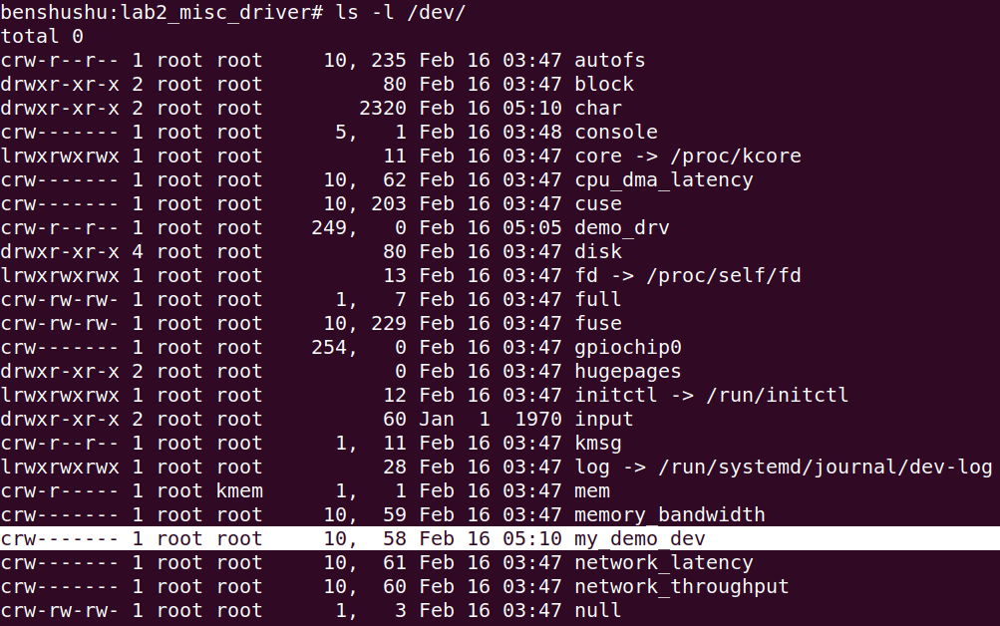

# 实验 6-2：使用 misc 机制来创建设备

## 1．实验目的

​		学会使用 misc 机制创建设备驱动。

## 2．实验详解

​		misc device 称为杂项设备，Linux 内核把一些不符合预先确定的字符设备划分为杂项设备，这类设备的主设备号是 10。Linux 内核使用 struct miscdevice 数据结构描述这类设备。

```C
#include <linux/miscdevice.h>

struct miscdevice {
    int minor;
    const char *name;
    const struct file_operations *fops;
    struct list_head list;
    struct device *parent;
    struct device *this_device;
    const char *nodename;
    umode_t mode;
};

```

------

### 代码注释及分析：

#### 代码内容及注释：

```
#include <linux/miscdevice.h>  // 引入 Linux misc 设备的头文件

// 定义 misc 设备的结构体
struct miscdevice {
    int minor;                  // 次设备号，唯一标识设备
    const char *name;           // 设备名称，用于注册时创建设备节点
    const struct file_operations *fops;  // 指向设备操作函数集的指针
    struct list_head list;      // 链表头，用于将设备加入内核的设备链表
    struct device *parent;      // 父设备指针，指向父设备（如果有）
    struct device *this_device; // 指向注册后的设备结构体，表示该设备本身
    const char *nodename;       // 设备节点的名称（可选），可以自定义设备节点名
    umode_t mode;               // 设备节点的权限模式（如读写权限）
};
```

#### 分析过程：

1. **`#include <linux/miscdevice.h>`：**
   - 该头文件定义了 Linux 内核中的 **misc（杂项）设备** 相关的数据结构和函数。**misc 设备** 是一种特殊类型的字符设备，用于实现简单的设备驱动程序。杂项设备的主要特性是它们共享次设备号空间，并通过 `misc_register()` 和 `misc_deregister()` 进行注册和注销。
2. **`struct miscdevice`：**
   - `miscdevice` 结构体用于描述杂项设备，每个字段表示设备的不同属性。
3. **结构体字段分析：**
   - **`int minor`**：
     - 表示设备的次设备号。次设备号用来唯一标识系统中的设备。使用 `MISC_DYNAMIC_MINOR` 可以动态分配次设备号。
   - **`const char \*name`**：
     - 设备的名称。该名称会用于创建 `/dev/` 下的设备节点（文件），用户可以通过设备节点访问该设备。
   - **`const struct file_operations \*fops`**：
     - 指向设备操作函数集的指针。这是设备驱动程序中用于处理用户空间请求的函数集，如 `open()`、`read()`、`write()` 等。通过此字段，内核知道如何处理对该设备的读写操作。
   - **`struct list_head list`**：
     - 设备链表头。Linux 内核使用链表来管理设备，该字段用于将杂项设备挂接到内核设备链表中。
   - **`struct device \*parent`**：
     - 父设备指针。如果该设备有父设备，则该字段指向其父设备。父设备通常是更高层次的物理设备。
   - **`struct device \*this_device`**：
     - 该字段指向杂项设备的 `struct device` 结构，用于代表设备本身。注册设备后，内核会通过该字段存储设备的相关信息。
   - **`const char \*nodename`**：
     - 设备节点名称。如果该字段被设置，内核会使用此名称创建设备节点，而不是使用 `name` 字段。
   - **`umode_t mode`**：
     - 设备文件的权限模式，如读、写、执行权限。这个字段定义了用户和内核对设备节点的访问权限。

#### 代码总结：

`miscdevice` 结构体是杂项设备的核心结构，定义了设备的基本信息和操作方式。该结构体通常配合 `misc_register()` 函数来注册设备，驱动程序通过它来向内核描述设备的名称、操作函数和设备权限等信息。

------

​		内核提供了注册杂项设备的两个接口函数，驱动程序采用 misc_register()函数来注册。它会自动创建设备节点，不需要使用 mknod 命令手工创建设备节点，因此使用misc 机制来创建字符设备驱动是比较方便、简捷的。

```C
int misc_register(struct miscdevice *misc);
int misc_deregister(struct miscdevice *misc);
```

接下来把 6.1 节中实验 1 的代码修改成采用 misc 机制注册字符驱动。

```C
#include <linux/miscdevice.h>

#define DEMO_NAME "my_demo_dev"

static struct device *mydemodrv_device;

static struct miscdevice mydemodrv_misc_device = {
    .minor = MISC_DYNAMIC_MINOR,
    .name = DEMO_NAME,
    .fops = &demodrv_fops,
};

static int __init simple_char_init(void)
{
    int ret;

    ret = misc_register(&mydemodrv_misc_device);
    if (ret) {
        printk("failed register misc device\n");
        return ret;
    }

    mydemodrv_device = mydemodrv_misc_device.this_device;
    printk("succeeded register char device: %s\n", DEMO_NAME);

    return 0;
}

static void __exit simple_char_exit(void)
{
    printk("removing device\n");
    misc_deregister(&mydemodrv_misc_device);
}

```

------

### 代码注释及分析：

#### 代码内容及注释：

```C
#include <linux/miscdevice.h>  // 包含杂项设备相关的头文件

// 定义设备名称
#define DEMO_NAME "my_demo_dev"

// 保存设备的指针
static struct device *mydemodrv_device;

// 定义并初始化一个杂项设备结构体
static struct miscdevice mydemodrv_misc_device = {
    .minor = MISC_DYNAMIC_MINOR,  // 动态分配次设备号
    .name = DEMO_NAME,            // 设备名称
    .fops = &demodrv_fops,        // 指向设备操作函数集的指针
};

// 模块初始化函数
static int __init simple_char_init(void)
{
    int ret;

    // 注册杂项设备到内核中
    ret = misc_register(&mydemodrv_misc_device);
    if (ret) {  // 如果注册失败，打印错误信息并返回错误码
        printk("failed register misc device\n");
        return ret;
    }

    // 保存注册后的设备指针
    mydemodrv_device = mydemodrv_misc_device.this_device;

    // 打印成功注册的调试信息
    printk("succeeded register char device: %s\n", DEMO_NAME);

    return 0;  // 初始化成功返回 0
}

// 模块退出函数
static void __exit simple_char_exit(void)
{
    // 打印设备卸载信息
    printk("removing device\n");

    // 注销杂项设备，释放资源
    misc_deregister(&mydemodrv_misc_device);
}
```

#### 分析过程：

1. **`#include <linux/miscdevice.h>`：**
   - 该头文件包含了 Linux 内核中与杂项设备相关的数据结构和函数定义。
2. **`#define DEMO_NAME "my_demo_dev"`：**
   - 定义了设备的名称，字符串 `DEMO_NAME` 用于标识设备。注册后，该名称会用于创建设备节点 `/dev/my_demo_dev`。
3. **`static struct device \*mydemodrv_device;`：**
   - 这是一个指向设备结构体的指针，在初始化过程中用于保存注册后的设备对象。
4. **`struct miscdevice mydemodrv_misc_device`：**
   - 这是定义并初始化的杂项设备结构体。
   - `minor = MISC_DYNAMIC_MINOR`：次设备号采用动态分配，表示内核会自动为设备分配一个空闲的次设备号。
   - `name = DEMO_NAME`：设备的名称，用于创建设备文件，如 `/dev/my_demo_dev`。
   - `fops = &demodrv_fops`：指向设备操作函数集的指针 `demodrv_fops`，这些操作函数用于处理设备的打开、读取、写入等操作。
5. **`simple_char_init(void)`：**
   - 这是模块的初始化函数，使用 `__init` 表示它在模块加载时调用。
   - `misc_register()`：该函数用于将 `mydemodrv_misc_device` 注册为一个杂项设备，设备会自动出现在 `/dev/` 目录中。
   - 如果注册失败，函数会返回一个负值，并且打印错误信息。
   - `mydemodrv_device = mydemodrv_misc_device.this_device;`：保存注册成功后返回的设备对象指针，用于后续操作。
   - 打印信息 `succeeded register char device: %s`，告知设备成功注册并提供设备名称。
6. **`simple_char_exit(void)`：**
   - 这是模块的退出函数，使用 `__exit` 表示它在模块卸载时调用。
   - `misc_deregister()`：调用该函数注销杂项设备，释放资源，并将设备从 `/dev/` 中移除。
   - 打印信息 `removing device`，提示设备正在被移除。

#### 代码总结：

这段代码实现了一个 Linux 杂项设备的简单驱动程序，主要的功能包括：

1. **注册杂项设备**：通过 `misc_register()` 注册设备到内核中，并动态分配次设备号。
2. **初始化设备操作函数**：设备操作函数集通过 `fops` 进行绑定，用于处理设备的 I/O 操作。
3. **注销设备**：当模块卸载时，通过 `misc_deregister()` 注销设备，释放系统资源。

这种杂项设备的驱动程序非常简洁，适用于轻量级的字符设备操作。

------

## 下面是本实验的实验步骤。

### 启动 QEMU+runninglinuxkernel。

```shell
$ ./run_rlk_arm64.sh run
```

### 进入本实验的参考代码。

```shell
# cd /mnt/rlk_lab/rlk_basic/ chapter_6_device_driver/lab2_misc_driver#
```


### 然后在 QEMU 系统里直接编译内核模块。

```shell
# make
```


### 使用 insmod 命令来加载内核模块。

```shell
benshushu:lab2_misc_driver# insmod mydemo_misc.ko 

[ 4992.553622] succeeded register char device: my_demo_dev
```


### 查看/dev 目录，发现设备节点已经创建好了，其中主设备号是 10，次设备号是动态分配的。

```
/mnt # ls -l /dev/
total 0
crw-rw---- 1 0 0 14, 4 May 19 06:48 audio
crw-rw---- 1 0 0 10, 58 May 19 06:48 my_demo_dev
```




接下来编写一个简单 test 测试程序。

```
#include <stdio.h>
#include <fcntl.h>
#include <unistd.h>

#define DEMO_DEV_NAME "/dev/my_demo_dev"

int main()
{
    char buffer[64];
    int fd;

    fd = open(DEMO_DEV_NAME, O_RDONLY);
    if (fd < 0) {
        printf("open device %s failed\n", DEMO_DEV_NAME);
        return -1;
    }

    read(fd, buffer, 64);
    close(fd);

    return 0;
}

```

上 述 test 程序程序比较简单 ， 首先使用 open 函数打开设备文件

“/dev/my_demo_dev”，然后调用 read 函数读 64 个字节到 buffer 中，最后关闭设备文件。

------

### 代码注释及分析：

#### 代码内容及注释：

```C
#include <stdio.h>    // 标准输入输出库，包含 printf 函数
#include <fcntl.h>    // 文件控制库，包含 open 函数的定义
#include <unistd.h>   // Unix 标准库，包含 read 和 close 函数的定义

// 定义设备文件路径
#define DEMO_DEV_NAME "/dev/my_demo_dev"

int main()
{
    char buffer[64];  // 定义一个字符缓冲区，用于存储从设备读取的数据
    int fd;           // 文件描述符，用于操作设备文件

    // 打开设备文件，以只读模式 (O_RDONLY) 打开
    fd = open(DEMO_DEV_NAME, O_RDONLY);
    if (fd < 0) {  // 如果打开失败，返回负值
        printf("open device %s failed\n", DEMO_DEV_NAME);  // 打印错误信息
        return -1;  // 返回 -1 表示打开设备失败
    }

    // 从设备文件中读取 64 字节数据到 buffer 中
    read(fd, buffer, 64);

    // 关闭设备文件，释放资源
    close(fd);

    return 0;  // 程序执行成功，返回 0
}
```

#### 分析过程：

1. **头文件包含：**
   - `#include <stdio.h>`：提供了标准输入输出功能，例如 `printf`，用于打印调试信息。
   - `#include <fcntl.h>`：提供了文件控制相关的函数和宏定义，如 `open` 函数，用于打开文件或设备。
   - `#include <unistd.h>`：提供了常见的 Unix 系统调用，如 `read` 和 `close`，用于操作文件和设备。
2. **定义设备文件路径：**
   - `#define DEMO_DEV_NAME "/dev/my_demo_dev"`：定义了一个设备文件的路径，这个设备文件是在 `/dev/` 目录下的 `my_demo_dev`。程序将会与这个设备文件进行交互。
3. **打开设备文件：**
   - `fd = open(DEMO_DEV_NAME, O_RDONLY)`：以只读模式打开设备文件，`O_RDONLY` 表示只读打开。`fd` 是返回的文件描述符，供后续操作使用。
   - 如果设备文件打开失败，`fd` 会返回一个负值。程序检查 `fd` 是否小于 0 来确定是否成功打开设备，如果打开失败，打印错误信息并退出程序。
4. **读取设备文件：**
   - `read(fd, buffer, 64)`：使用 `read` 函数从设备文件中读取最多 64 字节的数据，并存储到缓冲区 `buffer` 中。程序没有处理读取到的数据，只是简单地演示了读取操作。
5. **关闭设备文件：**
   - `close(fd)`：调用 `close` 函数关闭设备文件，释放文件描述符，防止资源泄漏。每次打开文件后，都需要显式关闭文件。
6. **返回程序执行结果：**
   - `return 0`：程序成功执行时返回 0，表示程序顺利结束。

#### 代码总结：

这段代码实现了一个简单的设备文件读取程序，展示了如何打开、读取和关闭设备文件。它主要涉及以下系统调用：

1. **`open`**：用于打开设备文件或普通文件。
2. **`read`**：从设备文件中读取数据。
3. **`close`**：关闭设备文件，释放文件描述符。

程序打开设备文件后，尝试读取数据，读取成功后会关闭文件。

------


在 QEMU+ARM64 系统里编译这个 test 程序。

```
benshushu:lab2_misc_driver# gcc test.c -o test
```


这时候我们该可以运行这个 test 程序了吧。

```
benshushu:lab2_misc_driver# ./test

[ 5153.754025] demodrv_open: major=10, minor=58
[ 5153.760125] demodrv_read enter
```


### 实验结束清理

```
rmmod mydemo_misc
```


```
make clean 
```


```shell
rm /dev/my_demo_drv #不需要，卸载内核模块后，自动卸载设备
```


## 3 进阶思考

1. 大家可以思考一下，为什么 misc 机制会自动创建设备节点，而实验 1 使用的方法就不行？

PS:实验一insmod后，我是通过mknod /dev/demo_drv c 247 0手动生成的，而实验二insmod后自动生成（由于名称一样，需要我们手动删除之前的。）

2. 请阅读内核代码，看看有哪些你熟悉的设备驱动是使用 misc 机制来创建的？