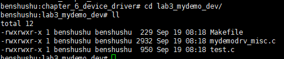
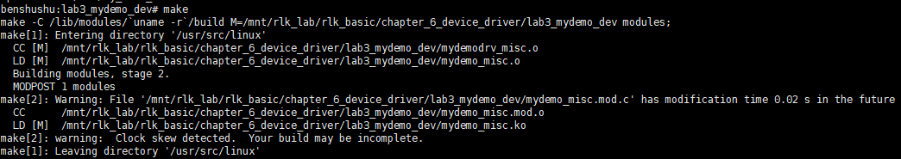
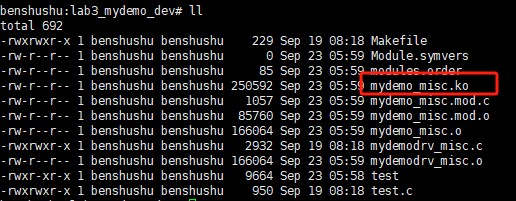
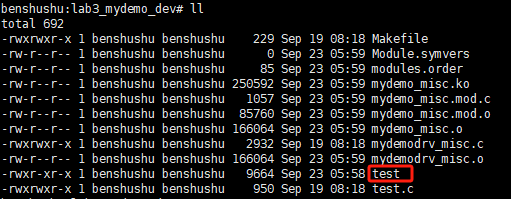
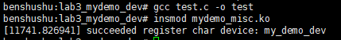
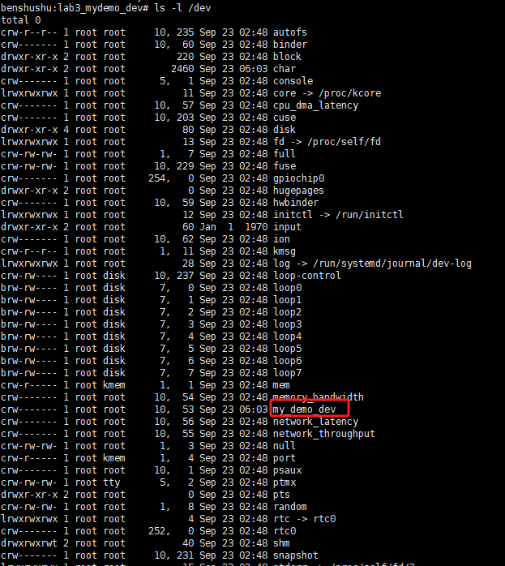
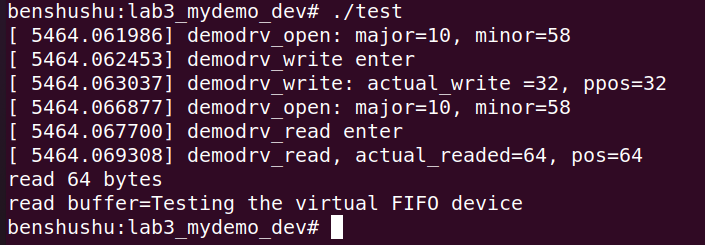
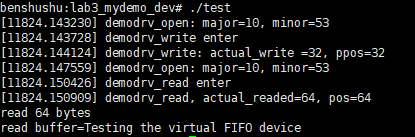
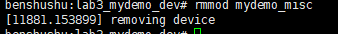
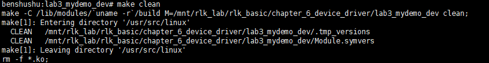

# 实验 6-3：为虚拟设备编写驱动

## 1．实验目的

1）通过一个虚拟设备，学习如何实现一个字符设备驱动程序的读写函数。

2）在用户空间编写测试程序来检验读写函数是否成功。

## 2．实验详解

根据这个虚拟设备的需求，给实验 2 的代码添加 read()和 write()函数的实现，代码片段如下。

```C
虚拟FIFO设备的缓冲区 */
static char *device_buffer;
#define MAX_DEVICE_BUFFER_SIZE 64

static ssize_t demodrv_read(struct file *file, char __user *buf, size_t count, loff_t *ppos)
{
    int actual_readed;
    int max_free;
    int need_read;
    int ret;

    max_free = MAX_DEVICE_BUFFER_SIZE - *ppos;
    need_read = max_free > count ? count : max_free; 

    if (need_read == 0)
        dev_warn(mydemodrv_device, "no space for read");

    ret = copy_to_user(buf, device_buffer + *ppos, need_read);
    if (ret == need_read)
        return -EFAULT;

    actual_readed = need_read - ret;
    *ppos += actual_readed;

    printk("%s, actual_readed=%d, pos=%d\n", __func__, actual_readed, *ppos);
    return actual_readed;
}

static ssize_t demodrv_write(struct file *file, const char __user *buf, size_t count, loff_t *ppos)
{
    int actual_write;
    int free;
    int need_write;
    int ret;

    free = MAX_DEVICE_BUFFER_SIZE - *ppos;
    need_write = free > count ? count : free;

    if (need_write == 0)
        dev_warn(mydemodrv_device, "no space for write");

    ret = copy_from_user(device_buffer + *ppos, buf, need_write);
    if (ret == need_write)
        return -EFAULT;

    actual_write = need_write - ret;
    *ppos += actual_write;

    printk("%s: actual_write = %d, ppos = %d\n", __func__, actual_write, *ppos);
    return actual_write;
}

```

------

### 代码分析：

这段代码实现了 Linux 字符设备驱动中常见的 `read` 和 `write` 操作函数。`demodrv_read` 用于从设备中读取数据，`demodrv_write` 用于向设备写入数据。设备的缓冲区大小被定义为 64 字节，使用内核中的 `copy_to_user` 和 `copy_from_user` 函数进行用户空间和内核空间之间的数据传输。

```C
// 设备缓冲区，保存数据的内存
static char *device_buffer;

// 定义设备缓冲区的最大大小为 64 字节
#define MAX_DEVICE_BUFFER_SIZE 64

/**
 * demodrv_read - 从设备读取数据
 * @file: 文件结构指针
 * @buf: 用户空间指针，读取的数据将被复制到该地址
 * @count: 用户请求读取的字节数
 * @ppos: 文件偏移量，指示读取的起始位置
 * 
 * 返回实际读取的字节数，或者错误代码
 */
static ssize_t demodrv_read(struct file *file, char __user *buf, size_t count, loff_t *ppos)
{
    int actual_readed;  // 实际读取的字节数
    int max_free;       // 可读取的最大字节数
    int need_read;      // 实际需要读取的字节数
    int ret;            // 返回值，用于检测错误
    
    // 计算从当前偏移量最多可以读取的字节数
    max_free = MAX_DEVICE_BUFFER_SIZE - *ppos;
    
    // 确定需要读取的字节数：如果剩余空间比请求的字节数多，则按请求的字节数读取
    need_read = max_free > count ? count : max_free; 

    // 如果没有可读取的字节，发出警告
    if (need_read == 0)
        dev_warn(mydemodrv_device, "no space for read");

    // 将数据从设备缓冲区复制到用户空间
    ret = copy_to_user(buf, device_buffer + *ppos, need_read);

    // 如果复制失败，返回错误代码
    if (ret == need_read)
        return -EFAULT;

    // 计算实际读取的字节数（需要读取的字节数减去失败的字节数）
    actual_readed = need_read - ret;

    // 更新文件偏移量，表示已经读取了这些字节
    *ppos += actual_readed;

    // 打印调试信息，显示实际读取的字节数和新的偏移量
    printk("%s, actual_readed=%d, pos=%d\n", __func__, actual_readed, *ppos);
    
    // 返回实际读取的字节数
    return actual_readed;
}

/**
 * demodrv_write - 向设备写入数据
 * @file: 文件结构指针
 * @buf: 用户空间指针，写入的数据从该地址读取
 * @count: 用户请求写入的字节数
 * @ppos: 文件偏移量，指示写入的起始位置
 * 
 * 返回实际写入的字节数，或者错误代码
 */
static ssize_t demodrv_write(struct file *file, const char __user *buf, size_t count, loff_t *ppos)
{
    int actual_write;  // 实际写入的字节数
    int free;          // 剩余可写的空间
    int need_write;    // 实际需要写入的字节数
    int ret;           // 返回值，用于检测错误

    // 计算从当前偏移量开始可以写入的最大字节数
    free = MAX_DEVICE_BUFFER_SIZE - *ppos;

    // 确定需要写入的字节数：如果剩余空间比请求的字节数多，则按请求的字节数写入
    need_write = free > count ? count : free;

    // 如果没有可写入的字节，发出警告
    if (need_write == 0)
        dev_warn(mydemodrv_device, "no space for write");

    // 将数据从用户空间复制到设备缓冲区
    ret = copy_from_user(device_buffer + *ppos, buf, need_write);

    // 如果复制失败，返回错误代码
    if (ret == need_write)
        return -EFAULT;

    // 计算实际写入的字节数（需要写入的字节数减去失败的字节数）
    actual_write = need_write - ret;

    // 更新文件偏移量，表示已经写入了这些字节
    *ppos += actual_write;

    // 打印调试信息，显示实际写入的字节数和新的偏移量
    printk("%s: actual_write = %d, ppos = %d\n", __func__, actual_write, *ppos);
    
    // 返回实际写入的字节数
    return actual_write;
}
```

### 分析过程：

1. **读操作 (`demodrv_read`)：**
   - `ppos` 是文件偏移量，表示从哪个位置开始读取数据。偏移量从 0 开始，随着每次读取操作更新。
   - 通过 `MAX_DEVICE_BUFFER_SIZE - *ppos` 计算设备缓冲区内剩余可读取的字节数，确保不会超出缓冲区大小。
   - 使用 `copy_to_user()` 函数将数据从内核空间的 `device_buffer` 复制到用户空间的 `buf`。
   - 处理完成后，更新文件的偏移量 `ppos`，返回实际读取的字节数。
2. **写操作 (`demodrv_write`)：**
   - 类似于读操作，`demodrv_write` 中 `ppos` 表示从哪个位置开始写入数据。
   - 通过 `MAX_DEVICE_BUFFER_SIZE - *ppos` 计算设备缓冲区内剩余可写入的空间。
   - 使用 `copy_from_user()` 函数将数据从用户空间的 `buf` 复制到内核空间的 `device_buffer`。
   - 同样，在写入操作结束后，更新文件的偏移量 `ppos`，返回实际写入的字节数。

### 关键点：

- **边界检查**：确保在读取或写入时不会超出设备缓冲区的范围。
- **用户空间和内核空间的交互**：通过 `copy_to_user` 和 `copy_from_user` 实现内核和用户空间数据的安全传输。这是防止内存错误的必要步骤。
- **文件偏移量的更新**：每次读取或写入后，`ppos` 都会更新，以保证后续操作从正确的位置开始。

​	

------

​		demodrv_read()函数有 4 个参数。file 表示打开的设备文件；buf 表示用户空间的内存起始地址，注意这里使用__user 来提醒驱动开发者这个地址空间是属于用户空间的；count 表示用户想读取多少字节的数据；ppos 表示文件的位置指针。

​		max_free表示当前设备的 FIFO还剩下多少空间，need_read 根据 max_free和 count两个值做判断，防止数据溢出。接下来，通过 copy_to_user()函数把设备 FIFO 的内容复制到用户进程的缓冲区中，注意这里是从设备 FIFO（device_buffer）的 ppos 开始的地方复制数据的。copy_to_user()函数返回 0 表示复制成功，返回 need_read 表示复制失败。最后，需要更新 ppos 指针，然后返回实际复制的字节数到用户空间。

​		demodrv_write()函数实现写功能，原理和上述 demodrv_read()函数类似，只不过其中使用了 copy_from_user()函数。

下面是本实验的实验步骤。

启动QEMU+runninglinuxkernel。

```shell
$./run_rlk_arm64.sh run
```

进入本实验的参考代码。

```shell
#cd/mnt/rlk_lab/rlk_basic/chapter_6_device_driver/lab3_mydemo_dev
```

然后在QEMU系统里直接编译内核模块。

```shell
#make
```

使用insmod命令来加载内核模块。

```
benshushu:lab3_mydemo_dev# insmod mydemo_misc.ko 
[ 5378.780466] succeeded register char device: my_demo_dev
```

接下来写一个测试程序来检验上述驱动程序是否工作正常。

```C
#include <stdio.h>
#include <fcntl.h>
#include <unistd.h>

#define DEMO_DEV_NAME "/dev/my_demo_dev"

int main()
{
    char buffer[64];
    int fd;
    int ret;
    size_t len;
    char message[] = "Testing the virtual FIFO device";
    char *read_buffer;

    len = sizeof(message);

    fd = open(DEMO_DEV_NAME, O_RDWR);
    if (fd < 0) {
        printf("open device %s failed\n", DEMO_DEV_NAME);
        return -1;
    }

    /* 1. write the message to device */
    ret = write(fd, message, len);
    if (ret != len) {
        printf("cannot write on device %d, ret=%d", fd, ret);
        return -1;
    }

    read_buffer = malloc(2 * len);
    memset(read_buffer, 0, 2 * len);

    /* close the fd, and reopen it */
    close(fd);

    fd = open(DEMO_DEV_NAME, O_RDWR);
    if (fd < 0) {
        printf("open device %s failed\n", DEMO_DEV_NAME);
        return -1;
    }

    ret = read(fd, read_buffer, 2 * len);
    printf("read %d bytes\n", ret);
    printf("read buffer=%s\n", read_buffer);

    close(fd);

    return 0;
}

```

------

### 代码整体说明：

​		这段代码是一个简单的用户态程序，演示了如何通过字符设备驱动进行读写操作。程序首先将一段消息写入设备，然后关闭设备文件，重新打开它，再从设备中读取数据并打印出来。这个过程展示了设备文件操作的典型流程，包括打开、关闭、读写等系统调用。

```C
#include <stdio.h>
#include <fcntl.h>
#include <unistd.h>

// 定义设备文件路径
#define DEMO_DEV_NAME "/dev/my_demo_dev"

int main()
{
    char buffer[64]; // 缓冲区，用于存放从设备读取的数据
    int fd;          // 文件描述符，用于打开和操作设备文件
    int ret;         // 用于存储返回值和错误码
    size_t len;      // 数据长度
    char message[] = "Testing the virtual FIFO device"; // 要写入设备的消息
    char *read_buffer; // 用于存储从设备读取的数据

    // 获取要写入设备的数据长度
    len = sizeof(message);

    // 打开设备文件，O_RDWR 表示可读可写
    fd = open(DEMO_DEV_NAME, O_RDWR);
    if (fd < 0) {  // 如果打开失败，打印错误信息并退出程序
        printf("open device %s failed\n", DEMO_DEV_NAME);
        return -1;
    }

    /* 1. 将消息写入设备 */
    ret = write(fd, message, len);  // 将 `message` 写入设备
    if (ret != len) {  // 检查是否成功写入所有字节
        printf("cannot write on device %d, ret=%d", fd, ret);  // 打印错误信息
        return -1;
    }

    // 分配空间存储读取的数据，这里分配两倍长度是为了演示读取更多数据
    read_buffer = malloc(2 * len);
    memset(read_buffer, 0, 2 * len); // 将读取缓冲区清零

    /* 关闭设备文件并重新打开它 */
    close(fd);  // 关闭设备文件

    fd = open(DEMO_DEV_NAME, O_RDWR);  // 重新打开设备文件
    if (fd < 0) {  // 如果重新打开失败，打印错误信息并退出程序
        printf("open device %s failed\n", DEMO_DEV_NAME);
        return -1;
    }

    // 从设备中读取数据，尝试读取两倍于写入的数据长度
    ret = read(fd, read_buffer, 2 * len);
    printf("read %d bytes\n", ret);    // 打印读取到的字节数
    printf("read buffer=%s\n", read_buffer); // 打印读取到的数据

    // 关闭设备文件
    close(fd);

    return 0;
}
```

### 代码分析：

1. **设备文件的打开 (`open`)：**
   - 程序首先通过 `open()` 系统调用打开设备文件 `/dev/my_demo_dev`。`O_RDWR` 标志表示文件以可读可写模式打开。打开设备后，内核会返回一个文件描述符 `fd`，用于后续的读写操作。
2. **写操作 (`write`)：**
   - 程序接着通过 `write()` 系统调用将 `message` 写入设备。这里写入的数据是 `"Testing the virtual FIFO device"`，并且 `len` 是该字符串的长度。
   - 如果 `write()` 的返回值与预期要写入的数据长度 `len` 不一致，说明写入操作失败，程序会打印错误信息并退出。
3. **关闭设备文件 (`close`)：**
   - 完成写操作后，程序调用 `close()` 关闭设备文件，以便后续模拟设备重新被打开的情况。
4. **重新打开设备文件 (`open`)：**
   - 为了演示关闭和重新打开设备文件的过程，程序再次调用 `open()` 以相同的方式重新打开设备。
5. **读操作 (`read`)：**
   - 打开设备文件后，程序通过 `read()` 系统调用从设备中读取数据。`read()` 会将从设备读取的数据存储在 `read_buffer` 中。
   - 为了演示从设备读取数据的过程，程序分配了两倍长度的缓冲区 `read_buffer`，并尝试读取两倍于原始消息长度的数据。
6. **打印读取结果：**
   - 读取完成后，程序会打印读取到的字节数和实际读取的数据内容。
7. **程序结束：**
   - 最后，程序再次调用 `close()` 关闭设备文件，并返回 0 表示程序执行成功。

### 关键点：

- **设备文件的打开与关闭**：`open()` 和 `close()` 系统调用用于打开和关闭设备文件，这是操作字符设备的基本流程。
- **读写操作**：`write()` 用于将数据写入设备，而 `read()` 用于从设备读取数据。它们分别负责用户空间和内核空间之间的数据传输。
- **错误处理**：代码检查了每个系统调用的返回值。如果调用失败，程序会打印错误信息并退出。

​		

------

测试程序逻辑很简单。==首先使用 open 方法打开这个设备驱动，向设备里写入message 字符串，然后关闭这个设备并重新打开这个设备，最后通过 read()函数把message 字符串读出来。==

## 实验步骤

### 在 QEMU+ARM64 系统里，编译 mydemodrv_misc程序。



```
make
```

```makefile
BASEINCLUDE ?= /lib/modules/`uname -r`/build

mydemo_misc-objs := mydemodrv_misc.o 

obj-m	:=   mydemo_misc.o
all : 
	$(MAKE) -C $(BASEINCLUDE) M=$(PWD) modules;

clean:
	$(MAKE) -C $(BASEINCLUDE) M=$(PWD) clean;
	rm -f *.ko;
```





### 编译test

```
benshushu:lab3_mydemo_dev# gcc test.c -o test
```



### 加载内核驱动模块

```
insmod mydemo_misc.ko
```



```
#查看设备是否自动添加
benshushu:lab3_mydemo_dev# ls -l /dev
```



### 运行 test 程序。

```
benshushu:lab3_mydemo_dev# ./test
[ 5464.061986] demodrv_open: major=10, minor=58
[ 5464.062453] demodrv_write enter
[ 5464.063037] demodrv_write: actual_write =32, ppos=32
[ 5464.066877] demodrv_open: major=10, minor=58
[ 5464.067700] demodrv_read enter
[ 5464.069308] demodrv_read, actual_readed=64, pos=64
read 64 bytes
read buffer=Testing the virtual FIFO device
```





​		==读者可以思考一下，为什么这里需要关闭设备后重新打开一次设备？如果不进行这样的操作，是否可以呢？==

### 实验结束清理

```
rmmod mydemo_misc
```



/dev中my_demo_dev中也自动删除了

```
make clean
```



## 3 进阶思考

-  读者可以思考一下，为什么这里需要关闭设备后重新打开一次设备？如果不进行这样的操作，是否可以呢？

- 这个 lab，是最经典的字符设备读写操作的示例了，读者可以查阅现有的内核代码drivers 目录，看看有哪些现成的字符设备驱动，学习一下，他们是如何实现读写函数的？