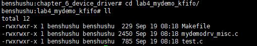
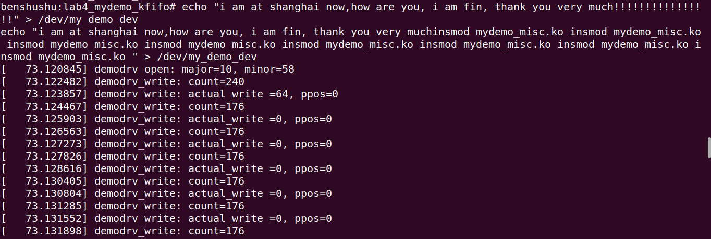

# 实验 6-4：使用 KFIFO 改进设备驱动

## 1．实验目的

​		学会使用内核的 KFIFO 的环形缓冲区实现虚拟字符设备的读写函数。

## 2．实验详解

​		==我们在 6.4.1 节中实验 3 中的驱动代码里只是简单地把用户数据复制到设备的缓冲区中，并没有考虑到读和写的并行管理问题。==因此在对应的测试程序中，==需要重启设备后才能正确地将数据读出来。==

​		这实际上是一个典型的“生产者和消费者”的问题，我们可以设计和实现一个环形缓冲区来解决这个问题。==环形缓冲区通常有一个读指针和一个写指针，读指针指向环形缓冲区可读的数据，写指针指向环形缓冲区可写的数据。通过移动读指针和写指针来实现缓冲区的数据读取和写入。==

​		Linux 内核实现了一个称为 KFIFO 的环形缓冲区的机制，它可以在一个读者线程和一个写者线程并发执行的场景下，无须使用额外的加锁来保证环形缓冲区的数据安全。KFIFO 提供的接口函数定义在 include/linux/kfifo.h 文件中。

```
#define DEFINE_KFIFO(fifo, type, size)
#define kfifo_from_user(fifo, from, len, copied)
#define kfifo_to_user(fifo, to, len, copied)
```

​		==DEFINE_KFIFO()宏用来初始化一个环形缓冲区，其中参数 fifo 表示环形缓冲区的名字；type 表示缓冲区中数据的类型；size 表示缓冲区有多少个元素，元素的个数必须是 2 的整数次幂。==

​		==kfifo_from_user()宏用来将用户空间的数据写入环形缓冲区中，其中参数 fifo 表示使用哪个环形缓冲区；from 表示用户空间缓冲区的起始地址；len 表示要复制多少个元素；copied 保存了成功复制元素的数量，通常用作返回值。==

​		kfifo_to_user()宏用来读出环形缓冲区的数据并且复制到用户空间中，参数作用和kfifo_from_user()宏类似。

​		下面是使用 KFIFO 机制实现该字符设备驱动的 read 和 write 函数的代码片段。

```C
#include <linux/kfifo.h>

DEFINE_KFIFO(mydemo_fifo, char, 64);

static ssize_t demodrv_read(struct file *file, char __user *buf, size_t count, loff_t *ppos)
{
    int actual_readed;
    int ret;

    ret = kfifo_to_user(&mydemo_fifo, buf, count, &actual_readed);
    if (ret)
        return -EIO;

    printk("%s, actual_readed=%d, pos=%lld\n", __func__, actual_readed, *ppos);
    return actual_readed;
}

static ssize_t demodrv_write(struct file *file, const char __user *buf, size_t count, loff_t *ppos)
{
    unsigned int actual_write;
    int ret;

    ret = kfifo_from_user(&mydemo_fifo, buf, count, &actual_write);
    if (ret)
        return -EIO;

    printk("%s: actual_write =%d, ppos=%lld\n", __func__, actual_write, *ppos);
    return actual_write;
}

```

------

### 代码注释及分析：

#### 代码内容及注释：

```C
#include <linux/kfifo.h>  // 引入 kfifo API，提供 FIFO 缓冲区管理功能

// 定义一个 64 字节的 FIFO 缓冲区，数据类型为 char
DEFINE_KFIFO(mydemo_fifo, char, 64);

/**
 * demodrv_read - 从 FIFO 缓冲区中读取数据到用户空间
 * @file: 文件结构指针
 * @buf: 用户空间指针，读取的数据将被复制到该地址
 * @count: 请求读取的字节数
 * @ppos: 文件偏移量指针
 *
 * 返回实际读取的字节数，或者错误代码
 */
static ssize_t demodrv_read(struct file *file, char __user *buf, size_t count, loff_t *ppos)
{
    int actual_readed;  // 实际读取的字节数
    int ret;            // 返回值，用于判断是否出错

    // 从 FIFO 中读取数据并复制到用户空间
    ret = kfifo_to_user(&mydemo_fifo, buf, count, &actual_readed);
    if (ret)  // 如果读取出错，返回错误代码
        return -EIO;

    // 打印调试信息，包括实际读取的字节数和文件偏移量
    printk("%s, actual_readed=%d, pos=%lld\n", __func__, actual_readed, *ppos);

    return actual_readed;  // 返回实际读取的字节数
}

/**
 * demodrv_write - 向 FIFO 缓冲区中写入来自用户空间的数据
 * @file: 文件结构指针
 * @buf: 用户空间缓冲区指针，包含要写入的数据
 * @count: 要写入的字节数
 * @ppos: 文件偏移量指针
 *
 * 返回实际写入的字节数，或者错误代码
 */
static ssize_t demodrv_write(struct file *file, const char __user *buf, size_t count, loff_t *ppos)
{
    unsigned int actual_write;  // 实际写入的字节数
    int ret;                    // 返回值，用于判断是否出错

    // 从用户空间复制数据并写入 FIFO 缓冲区
    ret = kfifo_from_user(&mydemo_fifo, buf, count, &actual_write);
    if (ret)  // 如果写入出错，返回错误代码
        return -EIO;

    // 打印调试信息，包括实际写入的字节数和文件偏移量
    printk("%s: actual_write =%d, ppos=%lld\n", __func__, actual_write, *ppos);

    return actual_write;  // 返回实际写入的字节数
}
```

#### 分析过程：

1. **FIFO 的初始化：**
   - `DEFINE_KFIFO(mydemo_fifo, char, 64)` 使用宏 `DEFINE_KFIFO` 定义了一个 `char` 类型的 FIFO 队列，大小为 64 字节。FIFO 是先进先出的缓冲区，适用于在内核和用户空间之间进行数据流的管理。
2. **`demodrv_read` 函数：**
   - 该函数用于从内核的 FIFO 缓冲区读取数据到用户空间中，使用的是 `kfifo_to_user()` 函数，该函数将 FIFO 中的数据复制到用户空间的 `buf` 缓冲区中。
   - `count` 表示用户请求读取的数据大小，`actual_readed` 表示实际读取的数据字节数。
   - 如果读取过程中出现错误，`kfifo_to_user()` 会返回错误码，函数返回 `-EIO`（I/O 错误）。
   - 成功读取后，函数返回实际读取的字节数，同时打印调试信息，包括读取的数据量和文件指针偏移量（虽然这里 `ppos` 未作实际用途）。
3. **`demodrv_write` 函数：**
   - 该函数用于将用户空间的数据写入内核的 FIFO 缓冲区，使用 `kfifo_from_user()` 函数从用户的 `buf` 缓冲区中获取数据，并将其写入 `mydemo_fifo` 中。
   - `count` 表示用户请求写入的数据字节数，`actual_write` 表示实际写入的数据字节数。
   - 如果在写入过程中发生错误，`kfifo_from_user()` 会返回错误码，函数返回 `-EIO`。
   - 成功写入后，函数返回实际写入的字节数，并打印调试信息。

#### 关键点：

- **kfifo API**：Linux 内核提供的 `kfifo` 是一个方便的循环缓冲区实现，适用于存储固定大小的数据流，如字符、字节等。
- **`kfifo_to_user()` 和 `kfifo_from_user()`**：这两个函数是内核中用于将数据从 FIFO 缓冲区传递给用户空间，或者从用户空间写入数据到 FIFO 的 API，简化了用户与内核数据交换的实现。

#### 总结：

这段代码演示了如何使用 `kfifo` 实现一个简单的字符设备的读写操作。它将数据通过内核中的 FIFO 缓冲区进行管理，并通过 `read` 和 `write` 系统调用接口实现用户空间与内核空间的数据交互。


------

## 下面是本实验的实验步骤。

### 启动 QEMU+runninglinuxkernel。

```
 ./run_rlk_arm64.sh run
```

### 进入本实验的参考代码。

```
# cd /mnt/rlk_lab/rlk_basic/chapter_6_device_driver/lab4_mydemo_kfifo
```



### 然后在 QEMU 系统里直接编译内核模块。

```
# make
```

```makefile
BASEINCLUDE ?= /lib/modules/`uname -r`/build

mydemo_misc-objs := mydemodrv_misc.o 

obj-m	:=   mydemo_misc.o
all : 
	$(MAKE) -C $(BASEINCLUDE) M=$(PWD) modules;

clean:
	$(MAKE) -C $(BASEINCLUDE) M=$(PWD) clean;
	rm -f *.ko;
```


### 使用 insmod 命令来加载内核模块。

```shell
benshushu:lab4_mydemo_kfifo# insmod mydemo_misc.ko
[ 5767.447204] succeeded register char device: my_demo_dev
```


### 测试test

测试示例和 6.4.1 节中的实验 3 类似，只不过这里不需要关闭和重新打开设备。

```C
#include <stdio.h>
#include <fcntl.h>
#include <unistd.h>

#define DEMO_DEV_NAME "/dev/my_demo_dev"

int main()
{
    char buffer[64];
    int fd;
    int ret;
    size_t len;
    char message[] = "Testing the virtual FIFO device";
    char *read_buffer;

    len = sizeof(message);

    fd = open(DEMO_DEV_NAME, O_RDWR);
    if (fd < 0) {
        printf("open device %s failed\n", DEMO_DEV_NAME);
        return -1;
    }

    /* 1. write the message to device */
    ret = write(fd, message, len);
    if (ret != len) {
        printf("cannot write on device %d, ret=%d", fd, ret);
        return -1;
    }

    read_buffer = malloc(2 * len);
    memset(read_buffer, 0, 2 * len);

    ret = read(fd, read_buffer, 2 * len);
    printf("read %d bytes\n", ret);
    printf("read buffer=%s\n", read_buffer);

    close(fd);

    return 0;
}

```

------

### 代码注释及分析：

#### 代码内容及注释：

```
c复制代码#include <stdio.h>    // 标准输入输出库，包含 printf 等函数
#include <fcntl.h>    // 文件控制库，包含 open 函数
#include <unistd.h>   // Unix 标准库，包含 read、write、close 函数

// 定义设备文件路径
#define DEMO_DEV_NAME "/dev/my_demo_dev"

int main()
{
    char buffer[64];  // 定义一个 64 字节的缓冲区，用于存储数据
    int fd;           // 文件描述符，用于打开和操作设备文件
    int ret;          // 用于存储函数返回值
    size_t len;       // 用于存储要写入的消息长度
    char message[] = "Testing the virtual FIFO device";  // 要写入设备的消息
    char *read_buffer;  // 动态分配的读取缓冲区

    // 获取 message 的长度
    len = sizeof(message);

    // 打开设备文件，O_RDWR 表示可读可写模式
    fd = open(DEMO_DEV_NAME, O_RDWR);
    if (fd < 0) {  // 如果打开失败，打印错误信息并退出
        printf("open device %s failed\n", DEMO_DEV_NAME);
        return -1;
    }

    /* 1. 向设备写入 message */
    ret = write(fd, message, len);  // 将 message 写入设备
    if (ret != len) {  // 检查写入是否成功
        printf("cannot write on device %d, ret=%d", fd, ret);
        return -1;
    }

    // 动态分配读取缓冲区，分配两倍 message 的长度
    read_buffer = malloc(2 * len);
    memset(read_buffer, 0, 2 * len);  // 初始化读取缓冲区为 0

    // 从设备中读取数据，最多读取 2 倍 message 的长度
    ret = read(fd, read_buffer, 2 * len);
    printf("read %d bytes\n", ret);  // 打印实际读取的字节数
    printf("read buffer=%s\n", read_buffer);  // 打印读取到的数据

    // 关闭设备文件，释放文件描述符
    close(fd);

    return 0;  // 程序执行成功
}
```

#### 分析过程：

1. **打开设备文件 (`open`)：**
   - 使用 `open()` 函数打开 `/dev/my_demo_dev` 设备文件。使用 `O_RDWR` 以读写模式打开设备文件。
   - 如果设备文件打开失败，`open()` 会返回一个负值，程序会打印错误信息并返回 `-1` 退出。
2. **写入设备 (`write`)：**
   - 程序通过 `write()` 系统调用将 `message` 写入设备文件。`len` 表示要写入的数据字节数。
   - `write()` 的返回值 `ret` 应等于 `len`，表示写入成功。如果写入的字节数不等于 `len`，则表示写入失败，程序打印错误并返回 `-1`。
3. **分配读取缓冲区 (`malloc` 和 `memset`)：**
   - 程序使用 `malloc()` 分配了两倍 `message` 长度的内存来存储读取到的数据。使用 `memset()` 将缓冲区初始化为 0，以确保读取的数据不会受到之前内存数据的影响。
4. **从设备读取数据 (`read`)：**
   - 程序使用 `read()` 系统调用从设备文件中读取数据。程序尝试读取的长度是 `2 * len`，即两倍于写入的 `message` 长度，以确保能够读取到足够的数据。
   - `ret` 是实际读取的字节数，程序将其打印出来，并显示读取到的字符串内容。
5. **关闭设备 (`close`)：**
   - `close()` 函数用于关闭设备文件，释放文件描述符。打开设备后必须显式关闭，否则可能导致资源泄漏。
6. **返回结果：**
   - `return 0;`：程序正常结束时返回 0，表示执行成功。

### 代码总结：

- **功能**：程序演示了如何打开、写入、读取并关闭 Linux 下的字符设备文件。它通过 `write()` 向设备写入一段消息，然后通过 `read()` 从设备读取数据，并打印结果。
- **内存管理**：通过 `malloc()` 动态分配读取缓冲区，并通过 `memset()` 初始化该缓冲区。
- **设备交互**：使用了 `open()`, `write()`, `read()`, `close()` 等系统调用与设备文件进行交互。

------


​		这个程序是一个典型的字符设备文件操作示例，展示了如何在用户空间与内核空间交互。

​		在 QEMU+ARM64 系统里编译 test 程序。

```shell
benshushu:lab4_mydemo_kfifo# gcc test.c -o test
```

​		然后运行 test 程序。

```
benshushu:lab4_mydemo_kfifo# ./test
[ 6010.117781] demodrv_open: major=10, minor=58
[ 6010.118351] demodrv_write: count=32
[ 6010.118709] demodrv_write: actual_write =32, ppos=0
[ 6010.123325] demodrv_read, actual_readed=32, pos=0
read 32 bytes
read buffer=Testing the virtual FIFO device
```


​		从上面可以看到，我们的 test 程序已经通过 read 函数从这个虚拟设备到读取到数据了，该数据就是“Testing the virtual FIFO device”这个字符串。

​		“demodrv_open: major=10, minor=58”这句日志是驱动打印的，说明 test 程序已经打开了这个设备。

​		“demodrv_write: actual_write =32, ppos=0”，这句日志也是驱动打印的，说明 test程序已经成功的往虚拟设备 FIFO 中写入了数据。见驱动代码的 demodrv_write()函数。

​		“demodrv_read, actual_readed=32, pos=0”这句日志也是驱动打印的，说明 test 程序已经成功地从虚拟设备 FIFO 中读取了数据，见驱动代码中 demodrv_read()函数。

​		“read 32 bytes”这句日志是 test 程序打印的，说明 test 程序成功从虚拟设备 FIFO中读取了 32 个字节。

​		“read buffer=Testing the virtual FIFO device”这句是 test 程序打印的，把读取到的32 个字节的内容打印出来。

### 另一种方式测试 echo

​		还有一种更简便的方法来测试，即使用 echo 和 cat 命令直接操作设备文件。首先我们可以使用 echo 命令来写一个字符串到设备到中。

```
echo "i am at shanghai now" > /dev/my_demo_dev
```


​		接下来，使用 cat 命令来读取设备文件。

```
cat /dev/my_demo_dev
```


​		我们发现我们测试也成功了，而且测试很方便。另外读者可能发现了，==echo 和cat 命令都会打开和关闭我们的设备文件/dev/my_demo_dev。==

## 3 进阶思考

​		细心的读者可能会发现，这个设备驱动的 KFIFO 环形缓存区的大小为 64 字节。如果使用 echo 命令发送一个长度大于 64 字节的字符串到这个设备，我们会发现终端中一直输出如下语句。

```
[ 82.363803] demodrv_write: actual_write =0, ppos=0
[ 82.364878] demodrv_write: count=176
[ 82.367342] demodrv_write: actual_write =0, ppos=0
[ 82.367597] demodrv_write: count=176
[ 82.367926] demodrv_write: actual_write =0, ppos=0
[ 82.368512] demodrv_write: count=176
```



请读者思考一下如何解决这个问题。