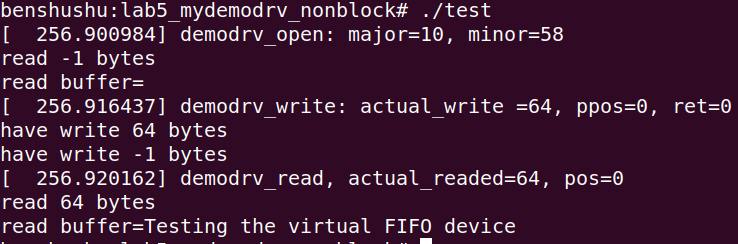

## 实验 6-5：把虚拟设备驱动改成非阻塞模式

## 1．实验目的

​		学习如何在字符设备驱动中添加非阻塞 I/O 操作。

## 2．实验详解

​		open()函数有一个 flags 参数，这些标志位通常用来表示文件打开的属性。

-  O_RDONLY：只读打开。


-  O_WRONLY：只写打开。


-  O_RDWR：读写打开。


-  O_CREAT：若文件不存在，则创建它。


​		除此之外，还有一个称为 O_NONBLOCK 的标志位，用来设置访问文件的方式为非阻塞模式。

​		下面把 5.4.2 节中的实验 4 修改为非阻塞模式。

```C
static ssize_t demodrv_read(struct file *file, char __user *buf, size_t count, loff_t *ppos)
{
    int actual_readed;
    int ret;

    if (kfifo_is_empty(&mydemo_fifo)) {
        if (file->f_flags & O_NONBLOCK)
            return -EAGAIN;
    }

    ret = kfifo_to_user(&mydemo_fifo, buf, count, &actual_readed);
    if (ret)
        return -EIO;

    printk("%s, actual_readed=%d, pos=%lld\n", __func__, actual_readed, *ppos);
    return actual_readed;
}

static ssize_t demodrv_write(struct file *file, const char __user *buf, size_t count, loff_t *ppos)
{
    unsigned int actual_write;
    int ret;

    if (kfifo_is_full(&mydemo_fifo)) {
        if (file->f_flags & O_NONBLOCK)
            return -EAGAIN;
    }

    ret = kfifo_from_user(&mydemo_fifo, buf, count, &actual_write);
    if (ret)
        return -EIO;

    printk("%s: actual_write =%d, ppos=%lld, ret=%d\n", __func__, actual_write, *ppos, ret);
    return actual_write;
}

```

------

### 代码注释及分析：

#### 代码内容及注释：

```C
/**
 * demodrv_read - 从 FIFO 缓冲区读取数据到用户空间
 * @file: 文件结构指针
 * @buf: 用户空间的缓冲区指针，存储读取的数据
 * @count: 用户请求读取的数据大小
 * @ppos: 文件偏移量指针
 *
 * 返回实际读取的字节数，或者错误代码
 */
static ssize_t demodrv_read(struct file *file, char __user *buf, size_t count, loff_t *ppos)
{
    int actual_readed;  // 实际读取的字节数
    int ret;            // 返回值，用于判断操作是否成功

    // 如果 FIFO 缓冲区为空，且文件描述符的标志是非阻塞模式，返回 -EAGAIN 错误
    if (kfifo_is_empty(&mydemo_fifo)) {
        if (file->f_flags & O_NONBLOCK)
            return -EAGAIN;  // 没有数据可读取，返回重试信号
    }

    // 从 FIFO 复制数据到用户空间
    ret = kfifo_to_user(&mydemo_fifo, buf, count, &actual_readed);
    if (ret)  // 如果读取过程中发生错误，返回 -EIO（I/O 错误）
        return -EIO;

    // 打印调试信息，显示实际读取的字节数和文件偏移量
    printk("%s, actual_readed=%d, pos=%lld\n", __func__, actual_readed, *ppos);

    return actual_readed;  // 返回实际读取的字节数
}

/**
 * demodrv_write - 从用户空间向 FIFO 缓冲区写入数据
 * @file: 文件结构指针
 * @buf: 用户空间的缓冲区指针，包含要写入的数据
 * @count: 要写入的数据字节数
 * @ppos: 文件偏移量指针
 *
 * 返回实际写入的字节数，或者错误代码
 */
static ssize_t demodrv_write(struct file *file, const char __user *buf, size_t count, loff_t *ppos)
{
    unsigned int actual_write;  // 实际写入的字节数
    int ret;                    // 返回值，用于判断操作是否成功

    // 如果 FIFO 缓冲区已满，且文件描述符的标志是非阻塞模式，返回 -EAGAIN 错误
    if (kfifo_is_full(&mydemo_fifo)) {
        if (file->f_flags & O_NONBLOCK)
            return -EAGAIN;  // 缓冲区已满，无法写入，返回重试信号
    }

    // 从用户空间复制数据到 FIFO 缓冲区
    ret = kfifo_from_user(&mydemo_fifo, buf, count, &actual_write);
    if (ret)  // 如果写入过程中发生错误，返回 -EIO（I/O 错误）
        return -EIO;

    // 打印调试信息，显示实际写入的字节数、文件偏移量以及返回值
    printk("%s: actual_write =%d, ppos=%lld, ret=%d\n", __func__, actual_write, *ppos, ret);

    return actual_write;  // 返回实际写入的字节数
}
```

#### 分析过程：

1. **读取操作 (`demodrv_read`)：**
   - 该函数用于从内核中的 FIFO 缓冲区中读取数据到用户空间的缓冲区 `buf` 中。
   - 在读取操作中首先检查 FIFO 缓冲区是否为空，使用 `kfifo_is_empty()` 函数。如果 FIFO 为空且文件是以非阻塞模式 (`O_NONBLOCK`) 打开的，函数返回 `-EAGAIN`，提示用户稍后再试。
   - 如果 FIFO 中有数据，`kfifo_to_user()` 函数将 FIFO 中的数据复制到用户空间，并返回实际读取的字节数。如果读取过程中发生错误，返回 `-EIO` 表示 I/O 错误。
   - 读取完成后，打印调试信息，显示读取的字节数和文件偏移量 `ppos`。
2. **写入操作 (`demodrv_write`)：**
   - 该函数用于从用户空间的缓冲区 `buf` 中读取数据并写入内核中的 FIFO 缓冲区。
   - 写入操作首先检查 FIFO 是否已满，使用 `kfifo_is_full()` 函数。如果 FIFO 已满且文件是以非阻塞模式 (`O_NONBLOCK`) 打开的，函数返回 `-EAGAIN`，提示用户稍后再试。
   - 如果 FIFO 有空间，`kfifo_from_user()` 函数将用户空间的数据写入 FIFO，并返回实际写入的字节数。如果写入过程中发生错误，返回 `-EIO`。
   - 写入完成后，打印调试信息，显示写入的字节数、文件偏移量 `ppos` 以及返回值。

#### 关键点：

- **`kfifo_is_empty()` 和 `kfifo_is_full()`**：这些函数分别用于检查 FIFO 缓冲区是否为空或已满，确保在正确的状态下执行读写操作。
- **非阻塞模式**：文件标志 `O_NONBLOCK` 用于控制是否需要等待资源的可用性。如果设置了非阻塞标志，系统调用会立即返回，而不会等待数据的可用性。
- **`kfifo_to_user()` 和 `kfifo_from_user()`**：这些函数用于在内核 FIFO 和用户空间之间传递数据，简化了用户与内核之间的缓冲区管理。

#### 代码总结：

这段代码实现了一个基于 FIFO 缓冲区的字符设备驱动程序，提供了对设备的读写功能。在读写过程中，程序处理了 FIFO 缓冲区的空满状态，支持非阻塞模式。如果缓冲区满或空，程序会适当返回错误或提示用户稍后再试。这些设计使得程序在管理数据流时更加灵活和高效。

------

## 下面是本实验的实验步骤。

### 启动 QEMU+runninglinuxkernel。

```shell
$ ./run_rlk_arm64.sh run
```

### 进入本实验的参考代码。

```
# cd /mnt/rlk_lab/rlk_basic/chapter_6_device_driver/lab5_mydemodrv_nonblock
```


### 然后在 QEMU 系统里直接编译内核模块。

```
# make
```

```makefile
BASEINCLUDE ?= /lib/modules/`uname -r`/build

mydemo_misc-objs := mydemodrv_misc.o 

obj-m	:=   mydemo_misc.o
all : 
	$(MAKE) -C $(BASEINCLUDE) M=$(PWD) modules;

clean:
	$(MAKE) -C $(BASEINCLUDE) M=$(PWD) clean;
	rm -f *.ko;
```


### 使用 insmod 命令来加载内核模块。

```
benshushu:lab5_mydemodrv_nonblock# insmod mydemo_misc.ko 
[ 146.888646] succeeded register char device: my_demo_dev
```


### 下面是对应的测试程序。

```C
#include <stdio.h>
#include <fcntl.h>
#include <unistd.h>

#define DEMO_DEV_NAME "/dev/my_demo_dev"

int main()
{
    int fd;
    int ret;
    size_t len;
    char message[80] = "Testing the virtual FIFO device";
    char *read_buffer;
    len = sizeof(message);

    read_buffer = malloc(2 * len);
    memset(read_buffer, 0, 2 * len);

    fd = open(DEMO_DEV_NAME, O_RDWR | O_NONBLOCK);
    if (fd < 0) {
        printf("open device %s failed\n", DEMO_DEV_NAME);
        return -1;
    }

    /* 1. 先读取数据 */
    ret = read(fd, read_buffer, 2 * len);
    printf("read %d bytes\n", ret);
    printf("read buffer=%s\n", read_buffer);

    /* 2. 将信息写入设备 */
    ret = write(fd, message, len);
    if (ret != len)
        printf("have written %d bytes\n", ret);

    /* 3. 再写入 */
    ret = write(fd, message, len);
    if (ret != len)
        printf("have written %d bytes\n", ret);

    /* 4. 最后读取 */
    ret = read(fd, read_buffer, 2 * len);
    printf("read %d bytes\n", ret);
    printf("read buffer=%s\n", read_buffer);

    close(fd);
    return 0;
}
```

------

### 代码注释及分析：

#### 代码内容及注释：

```C
#include <stdio.h>    // 标准输入输出库，包含 printf 等函数
#include <fcntl.h>    // 文件控制库，包含 open 函数的定义
#include <unistd.h>   // Unix 标准库，包含 read、write、close 函数的定义

// 定义设备文件路径
#define DEMO_DEV_NAME "/dev/my_demo_dev"

int main()
{
    int fd;           // 文件描述符，用于打开和操作设备文件
    int ret;          // 函数返回值，用于判断读写操作的结果
    size_t len;       // 消息的长度
    char message[80] = "Testing the virtual FIFO device";  // 要写入设备的消息
    char *read_buffer;  // 读取缓冲区，用于存放从设备读取的数据
    len = sizeof(message);  // 获取消息的长度

    // 动态分配读取缓冲区，分配两倍消息长度的空间
    read_buffer = malloc(2 * len);
    // 将读取缓冲区初始化为 0
    memset(read_buffer, 0, 2 * len);

    // 以读写和非阻塞模式打开设备文件
    fd = open(DEMO_DEV_NAME, O_RDWR | O_NONBLOCK);
    if (fd < 0) {  // 如果打开失败，打印错误信息并退出
        printf("open device %s failed\n", DEMO_DEV_NAME);
        return -1;
    }

    /* 1. 先读取数据 */
    ret = read(fd, read_buffer, 2 * len);  // 尝试从设备读取数据
    printf("read %d bytes\n", ret);  // 打印实际读取的字节数
    printf("read buffer=%s\n", read_buffer);  // 打印读取到的数据

    /* 2. 将信息写入设备 */
    ret = write(fd, message, len);  // 向设备写入消息
    if (ret != len)  // 如果写入的字节数不等于消息长度，打印警告信息
        printf("have written %d bytes\n", ret);

    /* 3. 再写入 */
    ret = write(fd, message, len);  // 再次向设备写入消息
    if (ret != len)  // 如果写入的字节数不等于消息长度，打印警告信息
        printf("have written %d bytes\n", ret);

    /* 4. 最后读取 */
    ret = read(fd, read_buffer, 2 * len);  // 再次从设备读取数据
    printf("read %d bytes\n", ret);  // 打印实际读取的字节数
    printf("read buffer=%s\n", read_buffer);  // 打印读取到的数据

    // 关闭设备文件，释放文件描述符
    close(fd);
    return 0;
}
```

#### 分析过程：

1. **设备文件的打开 (`open`)：**
   - 程序使用 `open()` 函数以读写和非阻塞模式 (`O_RDWR | O_NONBLOCK`) 打开 `/dev/my_demo_dev` 设备文件。`O_NONBLOCK` 意味着如果读取或写入无法立即完成，程序不会阻塞，而是返回相应的错误码。
   - 如果设备文件无法打开，`open()` 会返回一个负值，程序通过检查 `fd` 是否小于 0 来判断，并打印错误信息后退出程序。
2. **从设备读取数据 (`read`)：**
   - 程序首先尝试从设备读取两倍于 `message` 长度的数据。调用 `read()` 函数将最多 `2 * len` 字节的数据从设备复制到 `read_buffer` 中。
   - `read()` 的返回值 `ret` 是实际读取的字节数，程序会将这个值打印出来，并显示读取到的字符串内容。如果设备没有数据可读取且处于非阻塞模式，`read()` 会立即返回 `-EAGAIN`，表明读取操作需要稍后重试。
3. **写入设备 (`write`)：**
   - 程序通过 `write()` 向设备写入 `message`。写入的长度为 `len` 字节。
   - `write()` 的返回值表示实际写入的字节数，程序检查这个值是否等于 `len`，如果不相等，则说明未完全写入数据，程序会打印警告信息。
4. **再次写入设备：**
   - 程序再一次调用 `write()` 向设备写入同样的 `message`，并重复检查写入操作是否成功。
5. **再次读取数据 (`read`)：**
   - 程序最后一次调用 `read()` 从设备读取数据，读取的数据量为 `2 * len` 字节，并打印实际读取到的数据。
6. **关闭设备 (`close`)：**
   - 程序使用 `close()` 函数关闭设备文件，释放文件描述符。每次打开文件后都需要显式关闭，以防资源泄漏。

#### 非阻塞模式 (`O_NONBLOCK`)：

- 在程序中，设备文件以非阻塞模式打开（`O_NONBLOCK`），这意味着如果设备的缓冲区中没有数据可读取或空间不足以写入，程序不会等待资源变得可用，而是立即返回。这在某些情况下很有用，例如你希望程序继续执行其他任务，而不是等待资源。

#### 总结：

- 这段代码展示了如何以非阻塞模式打开设备文件，进行两次读取和写入操作。非阻塞模式确保了程序在设备资源不足时不会被阻塞，而是返回错误码，提示调用者稍后重试。
- 程序通过多次写入和读取操作展示了与设备交互的过程，主要使用了系统调用 `open()`, `read()`, `write()` 和 `close()`。

------

### 编译 test 程序。

```shell
benshushu:lab5_mydemodrv_nonblock# gcc test.c -o test
```


这次测试程序有如下的不同之处。

- **在打开设备之后，马上进行读操作，请读者想想结果如何？**

- **message 的大小设置为 80，比设备驱动里的环形缓冲区的大小要大，写操作会发生什么事情？**

- **再写一次会发生什么情况**

下面是测试程序的运行结果。

```
benshushu:lab5_mydemodrv_nonblock# ./test
[ 256.900984] demodrv_open: major=10, minor=58
read -1 bytes
read buffer=
[ 256.916437] demodrv_write: actual_write =64, ppos=0, ret=0
have write 64 bytes
have write -1 bytes
[ 256.920162] demodrv_read, actual_readed=64, pos=0
read 64 bytes
read buffer=Testing the virtual FIFO device
```




​		==从运行结果可以看出，打开设备后马上进行读操作，结果是什么也读不到，read()函数返回-1，说明读操作发生了错误。当第二次进行写操作时，write()函数返回-1，说明写操作发生了错误。==

​		“demodrv_open: major=10, minor=58”，==这句 log 是驱动打印的，说明 test 程序已经成功打开了我们的设备驱动。==

​		“read -1 bytes”这句是 test 程序打印的，==说明 test 程序调用 read 函数，没有成功读到数据，返回值为-1==

​		“read buffer=”这句是 test 程序打印的，==test 程序没有成功读到数据，所以打印buffer 的字符串就是空的。==

​		“demodrv_write: actual_write =64, ppos=0, ret=0”这句是驱动打印的，说明 test 程序成功调用 write 函数往虚拟设备 FIFO 中写入了数据。

​		“have write 64 bytes”这句是 test 程序打印的，说明刚才成功写入了 64 个字节。

​		“have write -1 bytes”，这句也是 test 程序打印的。我们在成功写入了 64 个字节之后，再尝试去写，这时候写不进去了。因为驱动中的 FIFO buffer 已经满了。

​		“demodrv_read, actual_readed=64, pos=0”，这句是驱动打印的，说明 test 程序执行了一个 read 操作。

​		“read 64 bytes”这句是 test 程序打印的，test 程序成功地把驱动中的 FIFO 数据读取到用户空间。

​		“read buffer=Testing the virtual FIFO device”这句是 test 程序打印的，把刚才读取到用户空间的数据打印出来。


### 实验结束清理

```
rmmod mydemo_misc
```


```
make clean
```

