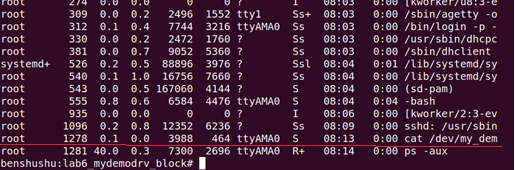
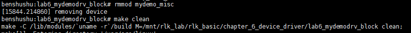

# 实验 6-6：把虚拟设备驱动改成阻塞模式

## 1．实验目的

​		学习如何在字符设备驱动中添加阻塞 I/O 操作。

## 2．实验详解

​		当用户进程通过 read()或者 write()函数去读写设备时，如果驱动程序无法立刻满足请求的资源，那么应该怎么响应呢？==在 5.5.1 节中的实验 5 中，驱动程序返回-EAGAIN，这是非阻塞模式的行为。==

​		但是，非阻塞模式对于大部分应用场景来说不太合适，因此大部分用户进程通过read()或者 write()函数进行 I/O 操作时希望能返回有效数据或者把数据写入设备中，而不是返回一个错误值。这该怎么办？

​		1）**在非阻塞模式下，采用轮询的方式来不断读写数据。**

​		2）==采用阻塞模式，当请求数据无法立刻满足时，让该进程睡眠直到数据准备好为止。==

​		上面提到的进程睡眠是什么意思呢？进程在运行生命周期里有不同的状态。

-  TASK_RUNNING（可运行态或者就绪态）。


-  TASK_INTERRUPTIBLE（可中断睡眠态）。


-  TASK_UNINTERRUPTIBLE（不可中断睡眠态）。


-  __TASK_STOPPED（终止态）。


-  EXIT_ZOMBIE（“僵尸”态）。


​		==把一个进程设置成睡眠状态，那么就是把这个进程从 TASK_RUNNING 状态设置为 TASK_INTERRUPTIBLE 或者 TASK_UNINTERRUPTIBLE 状态，并且从进程调度器的运行队列中移走，我们称这个点为“睡眠点”。当请求的资源或者数据到达时，进程会被唤醒，然后从睡眠点重新执行。==

​		==在 Linux 内核中，采用一个称为**等待队列（wait queue）的机制来实现进程阻塞操作**。==

（1）等待队列头

​		等待队列定义了一个被称为等待队列头（wait_queue_head_t）的数据结构，定义在<linux/wait.h>中。

```C
struct __wait_queue_head {
    spinlock_t lock;
    struct list_head task_list;
};
typedef struct __wait_queue_head wait_queue_head_t;
```

​		可以通过如下方法静态定义并初始化一个等待队列头。

```C
DECLARE_WAIT_QUEUE_HEAD(name)
```

​		或者使用动态的方式来初始化。

```C
wait_queue_head_t my_queue;
init_waitqueue_head(&my_queue);
```

（2）等待队列元素 wait_queue_t

```C
struct __wait_queue {
    unsigned int flags;
 	void *private;
 	wait_queue_func_t func;
 	struct list_head task_list;
};
typedef struct __wait_queue wait_queue_t;
```

​		等待队列元素使用 wait_queue_t 数据结构来描述。

（3）睡眠等待

​		==Linux 内核提供了简单的睡眠方式，并封装成 wait_event()的宏以及其他几个扩展宏，主要功能是在让进程睡眠时也检查进程的唤醒条件。==

```C
wait_event(wq, condition)
wait_event_interruptible(wq, condition)
wait_event_timeout(wq, condition, timeout)
wait_event_interruptible_timeout(wq, condition, timeout)
```

​		==wq 表示等待队列头。condition 是一个布尔表达式，在 condition 变为真之前，进程会保持睡眠状态。timeout 表示当 timeout 时间到达之后，进程会被唤醒，因此它只会等待限定的时间。**当给定的时间到了之后， wait_event_timeout() 和wait_event_interruptible_timeout()这两个宏无论 condition 是否为真，都会返回 0**。==

​		**wait_event_interruptible()会让进程进入可中断睡眠状态**，==而 wait_event()会让进程进入不可中断睡眠态，也就是说不受干扰，对信号不做任何反应，不可能发送 SIGKILL信号使它停止，因为它们不响应信号。因此，一般**驱动程序不会采用这个睡眠模式**。==

（4）唤醒

wake_up(x)

wake_up_interruptible(x)

​		==wake_up()会唤醒等待队列中所有的进程。wake_up()应该和 wait_event()或者wait_event_timeout() 配对使用，而 wake_up_interruptible() 应该和wait_event_interruptible()和 wait_event_interruptible_timeout()配对使用。==

​		本实验运用等待队列来完善虚拟设备的读写函数。

```C
struct mydemo_device {
    const char *name;
    struct device *dev;
    struct miscdevice *miscdev;
    wait_queue_head_t read_queue;
    wait_queue_head_t write_queue;
};

static int __init simple_char_init(void)
{
    int ret;

    …
    init_waitqueue_head(&device->read_queue);
    init_waitqueue_head(&device->write_queue);
    return 0;
}

static ssize_t demodrv_read(struct file *file, char __user *buf, size_t count, loff_t *ppos)
{
    struct mydemo_private_data *data = file->private_data;
    struct mydemo_device *device = data->device;
    int actual_readed;
    int ret;

    if (kfifo_is_empty(&mydemo_fifo)) {
        if (file->f_flags & O_NONBLOCK)
            return -EAGAIN;
        
        printk("%s: pid=%d, going to sleep\n", __func__, current->pid);
        ret = wait_event_interruptible(device->read_queue, !kfifo_is_empty(&mydemo_fifo));
        if (ret)
            return ret;
    }

    ret = kfifo_to_user(&mydemo_fifo, buf, count, &actual_readed);
    if (ret)
        return -EIO;

    if (!kfifo_is_full(&mydemo_fifo))
        wake_up_interruptible(&device->write_queue);

    printk("%s, pid=%d, actual_readed=%d, pos=%lld\n", __func__, current->pid, actual_readed, *ppos);
    return actual_readed;
}

static ssize_t demodrv_write(struct file *file, const char __user *buf, size_t count, loff_t *ppos)
{
    struct mydemo_private_data *data = file->private_data;
    struct mydemo_device *device = data->device;
    unsigned int actual_write;
    int ret;

    if (kfifo_is_full(&mydemo_fifo)) {
        if (file->f_flags & O_NONBLOCK)
            return -EAGAIN;

        printk("%s: pid=%d, going to sleep\n", __func__, current->pid);
        ret = wait_event_interruptible(device->write_queue, !kfifo_is_full(&mydemo_fifo));
        if (ret)
            return ret;
    }

    ret = kfifo_from_user(&mydemo_fifo, buf, count, &actual_write);
    if (ret)
        return -EIO;

    if (!kfifo_is_empty(&mydemo_fifo))
        wake_up_interruptible(&device->read_queue);

    printk("%s: pid=%d, actual_write=%d, ppos=%lld, ret=%d\n", __func__, current->pid, actual_write, *ppos, ret);
    return actual_write;
}

```

​		主要的改动见上面代码加粗字体部分。

​		1）定义两个等待队列，其中 read_queue 为读操作的等待队列，write_queue 为写操作的等待队列。

​		2）在 demodrv_read()读函数中，当 KFIFO 环形缓冲区为空时，说明没有数据可以读，调用 wait_event_interruptible()函数让用户进程进入睡眠状态，因此这个位置就是所谓的“睡眠点”了。那什么时候进程会被唤醒呢？当 KFIFO 环形缓冲区有数据可读时就会被唤醒。

​		3）在 demodrv_read()读函数中，当把数据从设备驱动的 KFIFO 读到用户空间的缓冲区之后，KFIFO 有剩余的空间可以让写者进程写数据到 KFIFO，因此调用wake_up_interruptible()去唤醒 write_queue 中所有睡眠等待的写者进程。

​		4）写函数和读函数很类似，只是判断进程是否进入睡眠的条件不一样。对于读操作，当 KFIFO 没有数据时，进入睡眠；对于写操作，当 KFIFO 满了，则进入睡眠。

------

### 代码注释及分析

#### 代码内容及注释：

```C
// 设备结构体，包含设备名称、设备结构体指针、杂项设备结构体指针、读写等待队列
struct mydemo_device {
    const char *name;                  // 设备名称
    struct device *dev;                // 设备结构体指针
    struct miscdevice *miscdev;        // 杂项设备结构体指针
    wait_queue_head_t read_queue;      // 读等待队列
    wait_queue_head_t write_queue;     // 写等待队列
};

// 模块初始化函数，设置等待队列
static int __init simple_char_init(void)
{
    int ret;

    // 初始化读写等待队列
    init_waitqueue_head(&device->read_queue);
    init_waitqueue_head(&device->write_queue);
    
    return 0;
}

/**
 * demodrv_read - 从设备读取数据
 * @file: 文件结构指针
 * @buf: 用户空间缓冲区指针，数据将复制到该地址
 * @count: 请求读取的字节数
 * @ppos: 文件指针的偏移量
 *
 * 返回实际读取的字节数，或者错误代码
 */
static ssize_t demodrv_read(struct file *file, char __user *buf, size_t count, loff_t *ppos)
{
    struct mydemo_private_data *data = file->private_data;   // 获取设备私有数据
    struct mydemo_device *device = data->device;             // 获取设备指针
    int actual_readed;                                       // 实际读取的字节数
    int ret;

    // 如果 FIFO 为空，且是非阻塞模式，立即返回 -EAGAIN
    if (kfifo_is_empty(&mydemo_fifo)) {
        if (file->f_flags & O_NONBLOCK)
            return -EAGAIN;  // 非阻塞模式下没有数据可读，立即返回

        // 阻塞模式，打印调试信息并进入等待队列
        printk("%s: pid=%d, going to sleep\n", __func__, current->pid);
        // 进入睡眠等待，直到 FIFO 中有数据
        ret = wait_event_interruptible(device->read_queue, !kfifo_is_empty(&mydemo_fifo));
        if (ret)  // 如果被信号中断，返回错误
            return ret;
    }

    // 从 FIFO 中读取数据到用户空间缓冲区
    ret = kfifo_to_user(&mydemo_fifo, buf, count, &actual_readed);
    if (ret)  // 如果读取失败，返回 I/O 错误
        return -EIO;

    // 如果 FIFO 非满，唤醒等待写入的进程
    if (!kfifo_is_full(&mydemo_fifo))
        wake_up_interruptible(&device->write_queue);

    // 打印调试信息
    printk("%s, pid=%d, actual_readed=%d, pos=%lld\n", __func__, current->pid, actual_readed, *ppos);

    return actual_readed;  // 返回实际读取的字节数
}

/**
 * demodrv_write - 向设备写入数据
 * @file: 文件结构指针
 * @buf: 用户空间缓冲区指针，数据将从该地址写入设备
 * @count: 请求写入的字节数
 * @ppos: 文件指针的偏移量
 *
 * 返回实际写入的字节数，或者错误代码
 */
static ssize_t demodrv_write(struct file *file, const char __user *buf, size_t count, loff_t *ppos)
{
    struct mydemo_private_data *data = file->private_data;   // 获取设备私有数据
    struct mydemo_device *device = data->device;             // 获取设备指针
    unsigned int actual_write;                               // 实际写入的字节数
    int ret;

    // 如果 FIFO 已满，且是非阻塞模式，立即返回 -EAGAIN
    if (kfifo_is_full(&mydemo_fifo)) {
        if (file->f_flags & O_NONBLOCK)
            return -EAGAIN;  // 非阻塞模式下 FIFO 满，立即返回

        // 阻塞模式，打印调试信息并进入等待队列
        printk("%s: pid=%d, going to sleep\n", __func__, current->pid);
        // 进入睡眠等待，直到 FIFO 中有空间
        ret = wait_event_interruptible(device->write_queue, !kfifo_is_full(&mydemo_fifo));
        if (ret)  // 如果被信号中断，返回错误
            return ret;
    }

    // 将用户空间的数据写入 FIFO
    ret = kfifo_from_user(&mydemo_fifo, buf, count, &actual_write);
    if (ret)  // 如果写入失败，返回 I/O 错误
        return -EIO;

    // 如果 FIFO 非空，唤醒等待读取的进程
    if (!kfifo_is_empty(&mydemo_fifo))
        wake_up_interruptible(&device->read_queue);

    // 打印调试信息
    printk("%s: pid=%d, actual_write=%d, ppos=%lld, ret=%d\n", __func__, current->pid, actual_write, *ppos, ret);

    return actual_write;  // 返回实际写入的字节数
}
```

#### 分析过程：

1. **设备结构体 (`struct mydemo_device`)**：
   - 包含设备的基础信息，如设备名称、指针以及两个等待队列（`read_queue` 和 `write_queue`），用于实现同步机制，使多个进程在设备读写操作时能协调工作。
   - 通过 `init_waitqueue_head()` 函数初始化读写等待队列。
2. **读取操作 (`demodrv_read`)**：
   - 检查 `mydemo_fifo` 是否为空。如果 FIFO 为空并且文件是以非阻塞模式打开，则返回 `-EAGAIN` 表示资源暂时不可用。
   - 在阻塞模式下，如果 FIFO 为空，当前进程进入 `read_queue` 等待队列，并在 FIFO 有数据后被唤醒。
   - 调用 `kfifo_to_user()` 从 FIFO 读取数据到用户空间缓冲区。
   - 如果 FIFO 已从空变为非满状态，唤醒 `write_queue` 中等待的进程。
   - 返回实际读取的字节数。
3. **写入操作 (`demodrv_write`)**：
   - 检查 `mydemo_fifo` 是否已满。如果已满并且文件是以非阻塞模式打开，则返回 `-EAGAIN`。
   - 在阻塞模式下，如果 FIFO 已满，当前进程进入 `write_queue` 等待队列，并在 FIFO 有空间后被唤醒。
   - 调用 `kfifo_from_user()` 从用户空间缓冲区将数据写入 FIFO。
   - 如果 FIFO 已从满变为非空状态，唤醒 `read_queue` 中等待的进程。
   - 返回实际写入的字节数。
4. **同步机制**：
   - `wait_event_interruptible()`：当缓冲区为空（读操作）或满（写操作）时，进程会进入相应的等待队列。只有在条件满足后（FIFO 非空或有空间），进程才会被唤醒进行读写操作。这避免了忙等待，提高了系统效率。
   - `wake_up_interruptible()`：在读写操作完成后，如果状态变化（如缓冲区从空变为非空），唤醒相应等待队列中的进程。

#### 代码总结：

- 这段代码展示了如何通过等待队列和 FIFO 缓冲区实现设备的同步读写操作。在读或写时，进程可以根据 FIFO 的状态（是否为空或已满）进行阻塞或立即返回。
- 同步机制通过等待队列和 `wait_event_interruptible` 使得进程在读写设备时能够安全有效地等待资源的可用性，而不会占用 CPU。


------

## 下面是本实验的实验步骤。

### 启动 QEMU+runninglinuxkernel。

```
$ ./run_rlk_arm64.sh run
```

### 进入本实验的参考代码。

```
# cd /mnt/rlk_lab/rlk_basic/chapter_6_device_driver/lab4_mydemo_kfifo
```


### 然后在 QEMU 系统里直接编译内核模块。

```shell
# make
```

```makefile
BASEINCLUDE ?= /lib/modules/`uname -r`/build

mydemo_misc-objs := mydemodrv_misc.o 

obj-m	:=   mydemo_misc.o
all : 
	$(MAKE) -C $(BASEINCLUDE) M=$(PWD) modules;

clean:
	$(MAKE) -C $(BASEINCLUDE) M=$(PWD) clean;
	rm -f *.ko;
```


### 先检查上一次实验的内核模块是否已经卸载。 然后再使用 insmod 命令来加载内核模块。

```shell
benshushu:lab4_mydemo_kfifo# insmod mydemo_misc.ko
[ 5767.447204] succeeded register char device: my_demo_dev
```


### 下面使用 echo 和 cat 命令来验证驱动程序。

​		==首先用 cat 命令打开这个设备，然后让其在后台运行，“&”符号表示让其在后台运行。==

```
cat /dev/my_demo_dev &
```


**注意：“&”符号表示让其在后台运行**


​		从日志中，“demodrv_read: pid=1278, going to sleep”这句 log 可以看到出，cat 命令会先打开设备，然后进入 demodrv_read()函数，因为这时 KFIFO 里面没有可读数据，所以读者进程（pid 为 1278）进入睡眠状态。

​		使用 top 命令或者“ps -aux”来查看一下。



```
top
```


```
ps -aux | grep 3869
#或者直接
ps -p 3869
```

		

​		我们发现刚才的“cat /dev/my_demo_dev”这个条命令显示在 top 中，而且进程PID 为 1278。大家注意看进程的状态为“S”，说明进程处于睡眠状态。

​		我们在这里列出 Linux 进程的几种状态。

（1）R 运行状态（Running）：并不意味着进程一定在运行中，也可以在运行队列

里；

==（2）S 睡眠状态（Sleeping）：进程在等待事件完成；（浅度睡眠，可以被唤醒）==

（3）D 不可中断的睡眠状态（Uninterruptsleep）:不可中断睡眠（深度睡眠，不可

以被唤醒，通常在磁盘写入时发生）

（4）T 停止状态（Stopped）：可以通过发送 SIGSTOP 信号给进程来停止进程，可

以发送 SIGCONT 信号让进程继续运行

（5）X 死亡状态（Dead）:该状态是返回状态，在任务列表中看不到；

（6）Z 僵尸状态（Zombie）:子进程退出，父进程还在运行，但是父进程没有读到

子进程的退出状态，子进程进入僵尸状态；

​		使用 echo 命令进行写数据到设备文件中。

```
benshushu:lab6_mydemodrv_block# echo "i am study runninglinuxkernel now!" > /dev/my_demo_dev
```


​		从日志中可以看出，当输出一个字符串到设备时，首先执行打开函数，然后执行写入操作，写入了 35 字节，写者进程的 pid 是 555。然后，写者进程马上唤醒了读者进程，读者进程（pid 号是 1278）把刚才写入的数据读到用户空间，==也就是把 KFIFO的数据读空了，导致读者进程又进入了睡眠状态。==

### 实验结束清理

```
kill -9 3869
```


```
rmmod mydemo_misc
```



```
make clean
```


## 3．进阶思考

​		这个字符设备最经典的操作了，怎么进入睡眠，怎么被唤醒，希望大家好好体会一下。

1. 当 wake_up（）函数唤醒一个等待队列，它是唤醒所有进程还是一个进程？

2. 阅读现有内核代码的设备驱动，找一个现成的驱动，研究他们是怎么进行睡眠等待和唤醒的？
