# 实验 6-7：向虚拟设备中添加 I/O 多路复用支持

## 1．实验目的

​		1）对虚拟设备的字符驱动添加 I/O 多路复用的支持。

​		2）编写应用程序对 I/O 多路复用进行测试。

## 2．实验详解

​		我们对虚拟设备驱动做了修改，让这个驱动可以支持多个设备。

```C
struct mydemo_device {
	char name[64];
 	struct device *dev;
 	wait_queue_head_t read_queue;
	wait_queue_head_t write_queue; 
 	struct kfifo mydemo_fifo;
};
struct mydemo_private_data {
 	struct mydemo_device *device;
 	char name[64]; 
};
```

​		我们对这个虚拟设备采用 mydemo_device 数据结构进行抽象，这个结构体里包含了 KFIFO 的环形缓冲区，还包含读和写的等待队列头。

​		另外，我们还抽象了一个 mydemo_private_data 的数据结构，这个数据结构主要包含一些驱动的私有数据。在这个简单的设备驱动程序里暂时只包含了 name 名字和指向 struct mydemo_device 的指针，等以后这个驱动程序实现功能变多之后，再添加很多其他的成员，如锁、设备打开计数器等。

​		接下来看驱动的初始化函数是如何支持多个设备的。

```C
#define MYDEMO_MAX_DEVICES 8

static struct mydemo_device *mydemo_device[MYDEMO_MAX_DEVICES];

static int __init simple_char_init(void)
{
    int ret;
    int i;
    struct mydemo_device *device;

    ret = alloc_chrdev_region(&dev, 0, MYDEMO_MAX_DEVICES, DEMO_NAME);
    if (ret) {
        printk("failed to allocate char device region");
        return ret;
    }

    demo_cdev = cdev_alloc();
    if (!demo_cdev) {
        printk("cdev_alloc failed\n");
        goto unregister_chrdev;
    }

    cdev_init(demo_cdev, &demodrv_fops);

    ret = cdev_add(demo_cdev, dev, MYDEMO_MAX_DEVICES);
    if (ret) {
        printk("cdev_add failed\n");
        goto cdev_fail;
    }

    for (i = 0; i < MYDEMO_MAX_DEVICES; i++) {
        device = kmalloc(sizeof(struct mydemo_device), GFP_KERNEL);
        if (!device) {
            ret = -ENOMEM;
            goto free_device;
        }

        sprintf(device->name, "%s%d", DEMO_NAME, i);
        mydemo_device[i] = device;
        init_waitqueue_head(&device->read_queue);
        init_waitqueue_head(&device->write_queue);

        ret = kfifo_alloc(&device->mydemo_fifo, MYDEMO_FIFO_SIZE, GFP_KERNEL);
        if (ret) {
            ret = -ENOMEM;
            goto free_kfifo;
        }

        printk("mydemo_fifo=%p\n", &device->mydemo_fifo);
    }

    printk("succeeded register char device: %s\n", DEMO_NAME);
    return 0;

free_kfifo:
    for (i = 0; i < MYDEMO_MAX_DEVICES; i++) {
        if (&device->mydemo_fifo)
            kfifo_free(&device->mydemo_fifo);
    }

free_device:
    for (i = 0; i < MYDEMO_MAX_DEVICES; i++) {
        if (mydemo_device[i])
            kfree(mydemo_device[i]);
    }

cdev_fail:
    cdev_del(demo_cdev);

unregister_chrdev:
    unregister_chrdev_region(dev, MYDEMO_MAX_DEVICES);

    return ret;
}

```

​		MYDEMO_MAX_DEVICES 表示设备驱动最多支持 8 个设备。在模块加载函数simple_char_init()里使用 alloc_chrdev_region()函数去申请 8 个次设备号，然后通过cdev_add()函数把这 8 个次设备都注册到系统里。

​		然后为每一个设备都分配一个 mydemo_device 数据结构，并且初始化其等待队列头和 KFIFO 环形缓冲区。

------

### 代码注释及分析：

#### 代码内容及注释：

```C
#define MYDEMO_MAX_DEVICES 8  // 定义支持的最大设备数为8个

// 全局数组，存储每个设备的指针
static struct mydemo_device *mydemo_device[MYDEMO_MAX_DEVICES];

/**
 * simple_char_init - 模块初始化函数
 *
 * 该函数负责分配设备号、初始化设备，并注册字符设备
 */
static int __init simple_char_init(void)
{
    int ret;  // 存储函数返回值
    int i;  // 循环计数器
    struct mydemo_device *device;  // 每个设备的指针

    // 分配一组连续的字符设备号，最多支持 MYDEMO_MAX_DEVICES 个设备
    ret = alloc_chrdev_region(&dev, 0, MYDEMO_MAX_DEVICES, DEMO_NAME);
    if (ret) {
        printk("failed to allocate char device region");
        return ret;  // 如果分配失败，返回错误码
    }

    // 分配字符设备结构体
    demo_cdev = cdev_alloc();
    if (!demo_cdev) {
        printk("cdev_alloc failed\n");
        goto unregister_chrdev;  // 如果分配失败，跳转到注销设备号
    }

    // 初始化字符设备结构体，绑定文件操作集
    cdev_init(demo_cdev, &demodrv_fops);

    // 注册字符设备到系统中
    ret = cdev_add(demo_cdev, dev, MYDEMO_MAX_DEVICES);
    if (ret) {
        printk("cdev_add failed\n");
        goto cdev_fail;  // 如果注册失败，跳转到删除字符设备
    }

    // 循环初始化每个设备
    for (i = 0; i < MYDEMO_MAX_DEVICES; i++) {
        // 动态分配设备结构体内存
        device = kmalloc(sizeof(struct mydemo_device), GFP_KERNEL);
        if (!device) {
            ret = -ENOMEM;  // 内存分配失败，返回错误码
            goto free_device;  // 跳转到释放已分配的设备
        }

        // 设置设备名称，如 my_demo_dev0, my_demo_dev1 ...
        sprintf(device->name, "%s%d", DEMO_NAME, i);

        // 将设备指针保存到全局数组
        mydemo_device[i] = device;

        // 初始化设备的读写等待队列
        init_waitqueue_head(&device->read_queue);
        init_waitqueue_head(&device->write_queue);

        // 为设备分配一个 FIFO 缓冲区，用于存储数据
        ret = kfifo_alloc(&device->mydemo_fifo, MYDEMO_FIFO_SIZE, GFP_KERNEL);
        if (ret) {
            ret = -ENOMEM;  // FIFO 分配失败，返回错误码
            goto free_kfifo;  // 跳转到释放已分配的 FIFO
        }

        // 打印 FIFO 缓冲区的地址
        printk("mydemo_fifo=%p\n", &device->mydemo_fifo);
    }

    // 注册设备成功，打印信息并返回 0
    printk("succeeded register char device: %s\n", DEMO_NAME);
    return 0;

    // 错误处理部分：
free_kfifo:
    // 释放已分配的 FIFO 缓冲区
    for (i = 0; i < MYDEMO_MAX_DEVICES; i++) {
        if (&device->mydemo_fifo)
            kfifo_free(&device->mydemo_fifo);
    }

free_device:
    // 释放已分配的设备结构体
    for (i = 0; i < MYDEMO_MAX_DEVICES; i++) {
        if (mydemo_device[i])
            kfree(mydemo_device[i]);
    }

cdev_fail:
    // 删除字符设备
    cdev_del(demo_cdev);

unregister_chrdev:
    // 注销字符设备号
    unregister_chrdev_region(dev, MYDEMO_MAX_DEVICES);

    return ret;  // 返回错误码
}
```

#### 分析过程：

1. **设备号分配 (`alloc_chrdev_region`)：**
   - 调用 `alloc_chrdev_region` 函数分配一组连续的字符设备号，支持 `MYDEMO_MAX_DEVICES` 个设备（最多8个设备）。设备号是内核与用户空间进行设备交互的重要标识符。
   - 如果分配设备号失败，函数会直接返回错误码，并打印错误信息。
2. **字符设备结构体分配 (`cdev_alloc`)：**
   - 使用 `cdev_alloc()` 动态分配字符设备结构体，`cdev` 是用于表示字符设备的核心数据结构。
   - 如果分配失败，程序会跳转到 `unregister_chrdev` 标签，执行错误处理逻辑。
3. **初始化字符设备 (`cdev_init`) 和注册字符设备 (`cdev_add`)：**
   - `cdev_init()` 函数将字符设备与文件操作函数集绑定，这个函数集定义了设备如何响应读写操作。
   - `cdev_add()` 函数将设备注册到内核，使得用户可以通过 `/dev` 访问它。
4. **初始化设备：**
   - 通过循环为每个设备分配内存并进行初始化，主要包括：
     - 动态分配设备结构体内存。
     - 设置设备名称。
     - 初始化读写等待队列。
     - 分配 `FIFO` 缓冲区，用于设备的数据传输。
5. **FIFO 缓冲区分配 (`kfifo_alloc`)：**
   - `kfifo_alloc()` 分配一个先进先出（FIFO）缓冲区，`MYDEMO_FIFO_SIZE` 指定了缓冲区大小。FIFO 用于存储设备读写的数据。
6. **错误处理：**
   - 如果初始化过程中任意一步出错（如内存分配失败），程序会跳转到相应的错误处理块，释放已分配的资源。
   - 这确保了在失败情况下不会造成内存泄漏或资源泄漏。
7. **成功路径：**
   - 如果所有设备初始化成功，程序会打印一条信息，并返回 0 表示成功。

#### 总结：

- 这段代码展示了一个 Linux 内核模块的初始化过程，主要涉及字符设备的分配、注册和设备内存的管理。
- 代码通过多个设备支持、FIFO 缓冲区和等待队列来实现设备的同步读写操作。
- 为了防止资源泄漏，代码包含了详细的错误处理逻辑，在任何初始化失败的情况下都会释放已分配的资源。

------

​		接下来看 open 方法的实现和之前有何不同。

```C
static int demodrv_open(struct inode *inode, struct file *file)
{
    unsigned int minor = iminor(inode);  // 获取次设备号
    struct mydemo_private_data *data;  // 设备私有数据指针
    struct mydemo_device *device = mydemo_device[minor];  // 获取设备指针
    int ret;

    // 打印调试信息，包括主设备号、次设备号和设备名称
    printk("%s: major=%d, minor=%d, device=%s\n", __func__,
           MAJOR(inode->i_rdev), MINOR(inode->i_rdev), device->name);

    // 分配私有数据结构的内存
    data = kmalloc(sizeof(struct mydemo_private_data), GFP_KERNEL);
    if (!data)
        return -ENOMEM;  // 如果分配失败，返回内存不足错误

    // 设置私有数据的名称并关联设备
    sprintf(data->name, "private_data_%d", minor);
    data->device = device;

    // 将私有数据保存到文件结构的 private_data 字段中
    file->private_data = data;

    return 0;  // 打开设备成功，返回 0
}

```

​		加粗部分就是和之前 open 方法的不同之处。这里首先会通过次设备号找到对应的 mydemo_device数据结构，然后分配一个私有的 mydemo_private_data的数据结构，最后把这个私有数据的地址存放在 file->private_data 指针里。

------

### 代码注释及分析：

#### 代码内容及注释：

```C
/**
 * demodrv_open - 打开设备时的回调函数
 * @inode: 设备的 inode 结构体指针，包含设备的元数据
 * @file: 文件结构体指针，表示打开的文件
 *
 * 该函数在用户进程打开设备时被调用，主要负责初始化设备的私有数据结构，并将其与文件相关联。
 *
 * 返回 0 表示成功，否则返回错误码。
 */
static int demodrv_open(struct inode *inode, struct file *file)
{
    unsigned int minor = iminor(inode);  // 获取次设备号
    struct mydemo_private_data *data;  // 定义私有数据指针
    struct mydemo_device *device = mydemo_device[minor];  // 通过次设备号获取对应设备
    int ret;

    // 打印调试信息，包括主设备号、次设备号和设备名称
    printk("%s: major=%d, minor=%d, device=%s\n", __func__,
           MAJOR(inode->i_rdev), MINOR(inode->i_rdev), device->name);

    // 为私有数据结构分配内存
    data = kmalloc(sizeof(struct mydemo_private_data), GFP_KERNEL);
    if (!data)
        return -ENOMEM;  // 如果内存分配失败，返回内存不足错误码

    // 将私有数据的名称设置为 "private_data_x"，x 是次设备号
    sprintf(data->name, "private_data_%d", minor);

    // 将对应的设备指针关联到私有数据结构中
    data->device = device;

    // 将私有数据保存到文件结构的 private_data 字段中
    file->private_data = data;

    return 0;  // 成功打开设备，返回 0
}
```

#### 分析过程：

1. **次设备号获取 (`iminor`)：**
   - `iminor(inode)` 用于从 `inode` 结构体中提取次设备号。次设备号可以唯一标识设备实例，对于多设备驱动而言，它决定了访问的是哪一个设备。
2. **设备指针获取：**
   - 通过 `minor` 访问全局数组 `mydemo_device[minor]` 获取对应的设备指针。设备指针指向一个 `mydemo_device` 结构体，这个结构体包含了设备的相关信息。
3. **调试信息 (`printk`)：**
   - `printk` 函数用于打印调试信息，输出内容包括设备的主设备号、次设备号以及设备的名称。它帮助开发人员调试设备打开过程。
4. **内存分配 (`kmalloc`)：**
   - 调用 `kmalloc` 为设备的私有数据结构 `mydemo_private_data` 分配内存。私有数据结构用于在文件和设备之间传递设备相关的信息。
   - 如果内存分配失败，函数立即返回 `-ENOMEM`，表示内存不足错误。
5. **私有数据的初始化：**
   - 使用 `sprintf` 设置私有数据的名称，格式为 `"private_data_x"`，其中 `x` 是次设备号。
   - 将设备指针 (`device`) 存储在私有数据结构中，以便后续操作中可以访问设备。
6. **关联文件与私有数据：**
   - 将分配并初始化好的 `mydemo_private_data` 结构体的指针保存到 `file->private_data` 中。这个字段是 Linux 内核 `file` 结构的一部分，用于在文件的操作期间保存与文件关联的私有数据。
7. **返回 0 表示成功：**
   - 如果整个过程顺利完成，函数返回 `0`，表示设备已成功打开。

#### 关键点：

- **设备与文件的关联**：通过 `file->private_data` 保存设备的私有数据，这确保了每个打开的文件都能访问到正确的设备上下文。
- **内存管理**：使用 `kmalloc` 为每个设备的私有数据分配内存，并在必要时处理内存不足的情况。
- **次设备号的重要性**：通过次设备号（`minor`）实现对多个设备的区分，使得一个驱动可以同时管理多个设备。

#### 总结：

该代码展示了设备驱动中的 `open` 操作函数的典型实现方式。通过次设备号获取设备指针，分配私有数据并与文件结构关联，使得后续文件操作（如读写）能够正确访问到设备的上下文信息。这是多设备管理中常见的模式。

------

​		接下来看 poll 方法的实现。

```C
static const struct file_operations demodrv_fops = {
    .owner = THIS_MODULE,
    .open = demodrv_open,
    .release = demodrv_release,
    .read = demodrv_read,
    .write = demodrv_write,
    .poll = demodrv_poll,
};

static unsigned int demodrv_poll(struct file *file, poll_table *wait)
{
    int mask = 0;
    struct mydemo_private_data *data = file->private_data;
    struct mydemo_device *device = data->device;

    poll_wait(file, &device->read_queue, wait);
    poll_wait(file, &device->write_queue, wait);

    if (!kfifo_is_empty(&device->mydemo_fifo))
        mask |= POLLIN | POLLRDNORM;
    if (!kfifo_is_full(&device->mydemo_fifo))
        mask |= POLLOUT | POLLWRNORM;

    return mask;
}

```

------

### 代码注释及分析

#### 代码内容及注释：

```C
// 文件操作结构体，将设备操作函数与文件系统关联
static const struct file_operations demodrv_fops = {
    .owner = THIS_MODULE,       // 指定模块的所有者为当前模块，避免模块在使用中被卸载
    .open = demodrv_open,       // 打开设备的回调函数
    .release = demodrv_release, // 关闭设备的回调函数
    .read = demodrv_read,       // 读取设备的回调函数
    .write = demodrv_write,     // 写入设备的回调函数
    .poll = demodrv_poll,       // 轮询操作的回调函数
};

/**
 * demodrv_poll - 设备轮询操作的回调函数，用于支持 select/poll 系统调用
 * @file: 文件结构指针
 * @wait: 等待队列表，用于记录进程等待的事件
 *
 * 该函数根据设备当前的状态判断是否可以进行读写操作，并返回相应的事件掩码。
 *
 * 返回值：掩码，表示设备是否可读（POLLIN/POLLRDNORM）或可写（POLLOUT/POLLWRNORM）。
 */
static unsigned int demodrv_poll(struct file *file, poll_table *wait)
{
    int mask = 0;  // 用于保存返回的事件掩码
    struct mydemo_private_data *data = file->private_data; // 获取设备的私有数据
    struct mydemo_device *device = data->device;           // 获取设备指针

    // 将设备的读写等待队列添加到轮询表中
    poll_wait(file, &device->read_queue, wait);  // 添加读等待队列
    poll_wait(file, &device->write_queue, wait); // 添加写等待队列

    // 如果 FIFO 中有数据，则设置可读标志
    if (!kfifo_is_empty(&device->mydemo_fifo))
        mask |= POLLIN | POLLRDNORM;  // 设置 POLLIN（可读）和 POLLRDNORM（普通可读）事件

    // 如果 FIFO 中有可用空间，则设置可写标志
    if (!kfifo_is_full(&device->mydemo_fifo))
        mask |= POLLOUT | POLLWRNORM; // 设置 POLLOUT（可写）和 POLLWRNORM（普通可写）事件

    return mask;  // 返回事件掩码
}
```

#### 分析过程：

1. **文件操作结构体 (`file_operations`)**：
   - `struct file_operations` 是 Linux 字符设备驱动的核心结构，用于将用户态程序的文件操作（如打开、读取、写入、关闭等）映射到内核中设备驱动的回调函数。
   - 在这个结构体中，定义了 `demodrv_open`、`demodrv_release`、`demodrv_read`、`demodrv_write` 和 `demodrv_poll` 等回调函数，用于处理设备的各种操作。
   - `.poll = demodrv_poll` 表示设备支持轮询操作，通过 `poll()` 系统调用可以查询设备是否可读写。
2. **轮询操作 (`demodrv_poll`)**：
   - 该函数是设备驱动的轮询操作处理函数，当用户调用 `select()` 或 `poll()` 系统调用时，内核会调用这个函数来检查设备的状态。
   - **`poll_wait()`**：该函数将设备的读写等待队列添加到轮询表中。如果当前设备的 FIFO 缓冲区为空或已满，进程会被挂起，等待缓冲区的状态改变后被唤醒。
3. **设备状态检查**：
   - **可读状态**：通过 `kfifo_is_empty()` 检查设备的 FIFO 缓冲区中是否有数据。如果有数据，则设置 `POLLIN | POLLRDNORM` 事件，表示设备可读。
   - **可写状态**：通过 `kfifo_is_full()` 检查设备的 FIFO 缓冲区中是否有足够的空间可以写入数据。如果有空间，则设置 `POLLOUT | POLLWRNORM` 事件，表示设备可写。
4. **事件掩码返回**：
   - 根据 FIFO 缓冲区的状态，函数返回合适的事件掩码。掩码包括以下几种：
     - `POLLIN`：表示设备有数据可读取。
     - `POLLRDNORM`：表示普通数据可读取。
     - `POLLOUT`：表示设备可以写入数据。
     - `POLLWRNORM`：表示普通数据可以写入。
   - 这些事件掩码会告知用户进程设备的当前状态，进程可以根据返回的掩码决定接下来的操作（读取或写入）。

#### 关键点：

- **poll_wait**：用于将进程挂起，等待设备的读写状态发生变化。当设备状态改变时，内核会唤醒进程。
- **事件掩码**：通过设置不同的掩码（`POLLIN`, `POLLOUT`, `POLLRDNORM`, `POLLWRNORM`），通知用户进程设备的当前状态。
- **FIFO 缓冲区检查**：通过 `kfifo_is_empty` 和 `kfifo_is_full` 检查设备的缓冲区状态，判断设备是否可读或可写。

#### 总结：

这段代码实现了设备驱动中的 `poll()` 系统调用支持，它允许用户进程通过 `select()` 或 `poll()` 来查询设备是否可以进行读写操作。通过等待队列和事件掩码，驱动程序可以高效地管理用户进程对设备的访问，避免忙等待，提升系统性能。

------

## 下面是本实验的实验步骤。

### 启动 QEMU+runninglinuxkernel。

```
$ ./run_rlk_arm64.sh run
```

### 进入本实验的参考代码。

```
# cd /mnt/rlk_lab/rlk_basic/chapter_6_device_driver/lab7
```

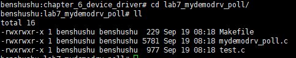

### 然后在 QEMU 系统里直接编译内核模块。

```shell
# make
```

```makefile
BASEINCLUDE ?= /lib/modules/`uname -r`/build

mydemo_poll-objs := mydemodrv_poll.o 

obj-m	:=   mydemo_poll.o
all : 
	$(MAKE) -C $(BASEINCLUDE) M=$(PWD) modules;

clean:
	$(MAKE) -C $(BASEINCLUDE) M=$(PWD) clean;
	rm -f *.ko;
```

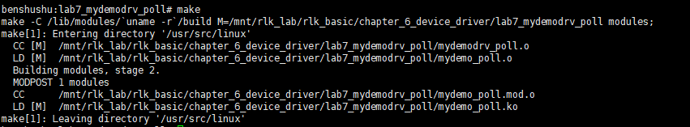

------

### 补充：这里不指定删除什么文件，系统就知道删除.o等文件中间文件，为什么

在你提供的 `Makefile` 中的 `clean` 目标如下：

```
clean:
	$(MAKE) -C $(BASEINCLUDE) M=$(PWD) clean;
```

尽管在 `Makefile` 中没有明确指定要删除哪些文件（如 `.o` 文件、可执行文件等），系统仍然能够正确地删除编译过程中生成的中间文件，这是因为它利用了 Linux 内核构建系统的**默认行为**。以下是详细的解释：

#### 1. **Linux 内核构建系统的自动清理机制**

在 Linux 内核模块开发中，内核构建系统（Kbuild）提供了默认的编译和清理规则。`make` 的 `clean` 目标会自动删除与内核模块构建相关的中间文件。典型的文件包括：

- **`.o` 文件**：目标文件（object files），是源代码编译的中间产物。
- **`.ko` 文件**：内核模块的可加载文件（kernel object）。
- **`.mod.c` 文件**：内核模块的依赖文件。
- **`.order` 和 `.symvers` 文件**：用于内核模块链接的辅助文件。
- 其他编译过程中生成的临时文件。

这些文件都是由内核构建系统自动生成和管理的。因此，当你执行 `make clean` 时，内核构建系统知道要删除这些文件，即使在你的 `Makefile` 中没有明确指定这些文件。

#### 2. **`-C $(BASEINCLUDE)` 和 `M=$(PWD)` 的作用**

- **`-C $(BASEINCLUDE)`**：这个选项将 `make` 切换到指定的内核构建目录（通常是 `/lib/modules/$(uname -r)/build`）。在这个目录中，内核的 `Makefile` 定义了通用的编译和清理规则。
- **`M=$(PWD)`**：这是告诉内核构建系统，当前的模块源代码位于 `$(PWD)`（即当前工作目录）下。内核构建系统会在该目录中查找需要清理的文件。

当你执行 `make clean` 时，内核构建系统会使用这些信息查找模块的中间文件和生成文件，并执行删除操作。

#### 3. **内核构建系统中的 `clean` 规则**

Linux 内核的 `Makefile`（通常位于内核源代码的根目录中）包含一套通用的编译和清理规则。当你使用 `make clean` 时，内核构建系统会自动调用这些规则来清理中间文件和临时文件。具体来说，内核的 `Makefile` 提供了一些标准的目标，包括：

- **`clean`**：删除编译过程中生成的中间文件（如 `.o`、`.ko` 等）。
- **`mrproper`**：删除 `clean` 之外的更多文件，如配置文件和编译生成的 `*.config`。
- **`distclean`**：在 `mrproper` 的基础上，进一步清理源代码树中可能存在的所有临时文件。

这些目标是内核构建系统的一部分，因此，当你调用 `make clean` 时，它会遵循这些定义来自动删除与模块相关的文件。

#### 4. **为什么不需要指定具体的文件**

在 Linux 内核模块开发中，`make` 系统不仅负责编译代码，还负责生成模块依赖信息和各种中间文件。为了方便开发者，内核构建系统已经预定义了如何处理这些文件。因此，你不需要在每个 `Makefile` 中手动指定要删除哪些文件，`make clean` 会根据内核构建系统的默认规则，自动找到并删除相应的文件。

#### 5. **内核构建系统的智能化**

内核构建系统非常智能，它知道哪些文件是中间文件或目标文件，并会在编译完成后跟踪这些文件。因此，执行 `make clean` 时，它能清楚哪些文件是需要删除的，而不会删除源文件或其他必要文件。

#### 结论

​		你不需要在 `Makefile` 中显式指定要删除哪些文件，因为 Linux 内核构建系统已经定义了通用的清理规则。通过使用 `$(MAKE) -C $(BASEINCLUDE) M=$(PWD) clean;`，`make` 会调用内核的清理规则，自动删除所有编译过程中生成的中间文件和目标文件，如 `.o`、`.ko` 等。这种自动化机制简化了内核模块开发中的清理工作。

在 Linux 内核模块的 `Makefile` 中，标准的 `clean` 目标写法依赖于内核的构建系统（Kbuild）提供的默认清理规则。该清理规则会自动删除内核模块编译过程中生成的中间文件和目标文件，如 `.o`、`.ko`、`.mod.c` 等。

### 补充：标准的 `Makefile` 写法

以下是一个标准的 Linux 内核模块 `Makefile`，包括正确的 `clean` 目标写法：

```
# 指定要编译的模块文件
obj-m := mymodule.o

# 指定内核源代码的路径
KDIR := /lib/modules/$(shell uname -r)/build

# 默认目标，编译模块
all:
	$(MAKE) -C $(KDIR) M=$(PWD) modules

# clean 目标，删除生成的文件
clean:
	$(MAKE) -C $(KDIR) M=$(PWD) clean
```

#### 各个部分的解释：

1. **`obj-m := mymodule.o`**：

   - 这是告诉内核构建系统要编译的模块名称。`mymodule.o` 是模块的目标文件，内核构建系统会自动将它编译为 `.ko` 文件（即内核模块文件）。

2. **`KDIR := /lib/modules/$(shell uname -r)/build`**：

   - `KDIR` 是内核构建目录的路径，通常位于 `/lib/modules/$(uname -r)/build`，这里 `$(shell uname -r)` 动态获取当前运行的内核版本。内核模块的编译需要依赖这个目录。

3. **`all` 目标**：

   - 该目标执行编译操作。

     ```
     $(MAKE) -C $(KDIR) M=$(PWD) modules
     ```

     ：

     - `-C $(KDIR)` 切换到内核构建目录（`KDIR`）执行 `make`。
     - `M=$(PWD)` 告诉内核构建系统，模块的源代码位于当前目录（`$(PWD)`）。
     - `modules` 是内核提供的标准目标，用于构建模块。

4. **`clean` 目标**：

   - `clean` 目标用于清理编译过程中生成的中间文件和目标文件。
   - 通过执行 `$(MAKE) -C $(KDIR) M=$(PWD) clean`，调用内核的清理规则，自动删除与模块编译相关的文件。
   - 内核构建系统会删除 `.o` 文件、`.ko` 文件、`.mod.c` 文件、`.order` 文件等。

#### 为什么这种写法是标准的？

- **内核构建系统提供了强大的模块构建和清理规则**：通过依赖内核的 `Makefile`，你不需要手动指定要删除的所有文件类型。`make clean` 会自动清理与模块相关的所有中间文件和临时文件。
- **内核模块的构建路径是动态的**：通过指定 `M=$(PWD)`，你告知内核构建系统，当前目录是模块的源代码目录。内核构建系统会在当前目录下生成和管理中间文件，而 `make clean` 也会在该目录下执行清理。
- **跨平台与版本兼容**：这种标准写法依赖于内核的 `Kbuild` 系统，不需要对不同的内核版本或平台进行特殊调整。`Kbuild` 系统会根据当前的内核版本自动选择正确的构建和清理规则。

#### 内核 `Makefile` 清理的文件

当你执行 `make clean` 时，内核构建系统会删除以下类型的文件：

- `.o` 文件：编译生成的目标文件。
- `.ko` 文件：可加载的内核模块文件。
- `.mod.c` 文件：模块依赖文件。
- `.symvers` 文件：符号版本文件。
- `.order` 文件：模块链接顺序文件。
- 其他编译生成的临时文件或符号文件。

#### 扩展的清理目标

在一些更大的项目中，你可能还会看到 `distclean` 或 `mrproper` 等清理目标。这些目标会进一步清理构建目录，包括删除配置文件和更多临时文件：

```
mrproper:
	$(MAKE) -C $(KDIR) M=$(PWD) mrproper
```

- **`mrproper`**：清理更加彻底，会删除所有的编译生成的文件以及临时配置文件（如 `.config`）。

#### 总结

- **`make clean`**：清理与模块编译相关的中间文件，如 `.o`、`.ko`、`.mod.c` 文件。
- **`make mrproper`**：更彻底的清理，适合在需要完全重构项目时使用。

标准的内核模块 `Makefile` 的 `clean` 目标依赖于内核构建系统的默认清理规则，这种写法可以确保模块的中间文件被正确清理，保持开发环境的整洁。


------

### 先检查上一次实验的内核模块是否已经卸载。 然后再使用 insmod 命令来加载内核模块。

```shell
benshushu:lab7_mydemodrv_poll# insmod mydemo_poll.ko 
[ 1150.361287] mydemo_fifo=00000000ccb5f99f
[ 1150.370166] mydemo_fifo=00000000af14fbef
[ 1150.373519] mydemo_fifo=00000000280ab9da
[ 1150.374415] mydemo_fifo=00000000bea74ef4
[ 1150.378052] mydemo_fifo=000000002acbd035
[ 1150.379297] mydemo_fifo=00000000e83b8b8d
[ 1150.385853] mydemo_fifo=0000000062de7ec3
[ 1150.387333] mydemo_fifo=00000000339f4a5f
[ 1150.388410] succeeded register char device: mydemo_dev
```

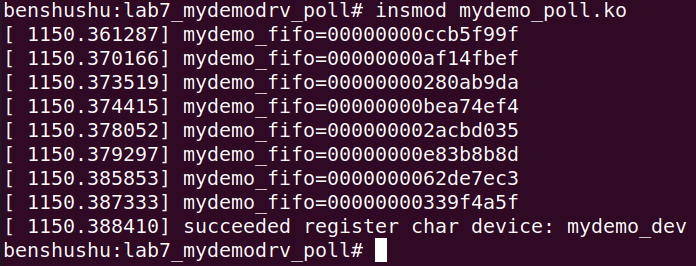

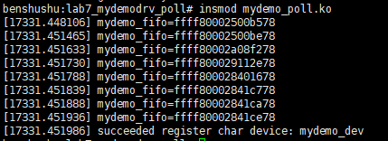

​		从上面 log 可以看到驱动在初始化时候创建了 8 个设备。==读者可以认真阅读驱动代码中的 simple_char_init 函数。==

​		注意：本次实验，我们的参考代码采用传统的注册字符设备的方法，==而没有使用 misc 机制，所以需要手工来创建设备节点。==

​		首先通过“/proc/devices”来查看设备主设备号。

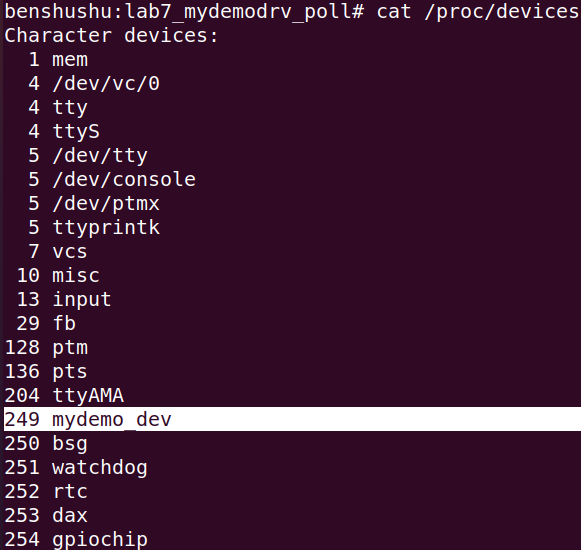

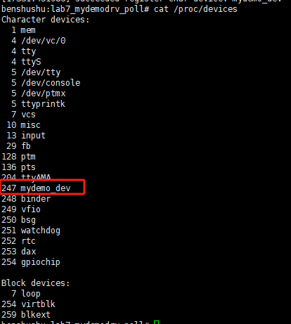

从上图可知，mydemo_dev 设备的主设备号为 249

```
benshushu:lab7_mydemodrv_poll# mknod /dev/mydemo0 c 249 0
benshushu:lab7_mydemodrv_poll# mknod /dev/mydemo1 c 249 1
```

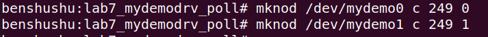

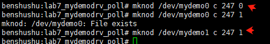

如上图所示，我们手工创建了两个设备节点，分别是 mydemo0 和 mydemo1。

本实验需要写一个应用程序来测试这个 poll 方法是否工作。

```C
#include <stdio.h>
#include <stdlib.h>
#include <string.h>
#include <sys/types.h>
#include <sys/stat.h>
#include <sys/ioctl.h>
#include <fcntl.h>
#include <errno.h>
#include <poll.h>
#include <linux/input.h>

int main(int argc, char *argv[])
{
    int ret;
    struct pollfd fds[2];
    char buffer0[64];
    char buffer1[64];

    fds[0].fd = open("/dev/mydemo0", O_RDWR);
    if (fds[0].fd == -1)
        goto fail;

    fds[0].events = POLLIN;
    fds[0].revents = 0;

    fds[1].fd = open("/dev/mydemo1", O_RDWR);
    if (fds[1].fd == -1)
        goto fail;

    fds[1].events = POLLIN;
    fds[1].revents = 0;

    while (1) {
        ret = poll(fds, 2, -1);
        if (ret == -1)
            goto fail;

        if (fds[0].revents & POLLIN) {
            ret = read(fds[0].fd, buffer0, 64);
            if (ret < 0)
                goto fail;
            printf("%s\n", buffer0);
        }

        if (fds[1].revents & POLLIN) {
            ret = read(fds[1].fd, buffer1, 64);
            if (ret < 0)
                goto fail;
            printf("%s\n", buffer1);
        }
    }

fail:
    perror("poll test");
    exit(EXIT_FAILURE);
}

```

​		在这个测试程序中，我们打开两个设备，然后分别进行监听。如果其中一个设备的 KFIFO 有数据，就把它读出来，并且输出。

​		这个 test 程序我们使用了 Linux 编程中常用的接口 poll 函数对多个设备文件进行监听。

------

### 代码注释及分析

#### 代码内容及注释：

```C
#include <stdio.h>
#include <stdlib.h>
#include <string.h>
#include <sys/types.h>
#include <sys/stat.h>
#include <sys/ioctl.h>
#include <fcntl.h>
#include <errno.h>
#include <poll.h>
#include <linux/input.h>

/**
 * main - 主函数
 * @argc: 参数数量
 * @argv: 参数数组
 *
 * 该函数使用 `poll()` 同时监控两个设备 `/dev/mydemo0` 和 `/dev/mydemo1` 的可读状态，
 * 并在有数据可读取时从设备中读取数据。
 */
int main(int argc, char *argv[])
{
    int ret;                    // 函数返回值
    struct pollfd fds[2];       // pollfd 结构体数组，用于监控多个文件描述符
    char buffer0[64];           // 用于存储从 /dev/mydemo0 读取的数据
    char buffer1[64];           // 用于存储从 /dev/mydemo1 读取的数据

    // 打开第一个设备文件 /dev/mydemo0
    fds[0].fd = open("/dev/mydemo0", O_RDWR);  // 以读写模式打开设备
    if (fds[0].fd == -1)         // 如果打开失败，跳转到错误处理
        goto fail;

    fds[0].events = POLLIN;      // 监控设备的可读状态
    fds[0].revents = 0;          // 初始化返回事件为 0

    // 打开第二个设备文件 /dev/mydemo1
    fds[1].fd = open("/dev/mydemo1", O_RDWR);  // 以读写模式打开设备
    if (fds[1].fd == -1)         // 如果打开失败，跳转到错误处理
        goto fail;

    fds[1].events = POLLIN;      // 监控设备的可读状态
    fds[1].revents = 0;          // 初始化返回事件为 0

    // 无限循环，通过 poll 同时监控两个设备的状态
    while (1) {
        ret = poll(fds, 2, -1);  // 等待设备事件，poll 同时监控两个文件描述符
        if (ret == -1)           // 如果 poll 调用失败，跳转到错误处理
            goto fail;

        // 检查第一个设备是否可读
        if (fds[0].revents & POLLIN) {  // 如果设备可读
            ret = read(fds[0].fd, buffer0, 64);  // 读取设备中的数据
            if (ret < 0)              // 如果读取失败，跳转到错误处理
                goto fail;
            printf("%s\n", buffer0);  // 打印读取到的数据
        }

        // 检查第二个设备是否可读
        if (fds[1].revents & POLLIN) {  // 如果设备可读
            ret = read(fds[1].fd, buffer1, 64);  // 读取设备中的数据
            if (ret < 0)              // 如果读取失败，跳转到错误处理
                goto fail;
            printf("%s\n", buffer1);  // 打印读取到的数据
        }
    }

fail:
    // 错误处理，打印错误信息并退出程序
    perror("poll test");
    exit(EXIT_FAILURE);
}
```

#### 分析过程：

1. **设备文件的打开 (`open`)：**
   - 程序首先打开两个设备文件 `/dev/mydemo0` 和 `/dev/mydemo1`，使用 `open()` 函数以读写模式（`O_RDWR`）打开设备文件。
   - 如果任意设备文件打开失败，程序会跳转到错误处理部分（`goto fail`），打印错误信息并退出。
2. **`pollfd` 结构体的初始化：**
   - `fds` 是一个包含两个 `pollfd` 结构体的数组，每个结构体监控一个设备的状态。
   - `events` 字段设置为 `POLLIN`，表示我们对设备的可读状态感兴趣。当设备有数据可以读取时，`poll()` 函数会返回，允许我们读取设备数据。
   - `revents` 字段初始化为 0，用于存储 `poll()` 返回的事件类型。
3. **`poll()` 调用：**
   - `poll(fds, 2, -1)`：该调用会阻塞进程，直到有设备发生了可读事件。`fds` 指定了要监控的文件描述符，`2` 表示我们监控两个设备，`-1` 表示无限等待，直到有事件发生。
   - 如果 `poll()` 调用失败，程序会跳转到错误处理部分。
4. **设备的可读状态检查：**
   - `poll()` 返回后，程序会检查每个设备的 `revents` 字段，判断设备是否可读。
   - 如果 `revents & POLLIN` 为真，表示设备有数据可读取，程序使用 `read()` 读取设备中的数据，并将其打印到控制台。
5. **无限循环与实时响应：**
   - 程序运行在一个无限循环中，持续监控设备的状态。当设备变得可读时，程序立即读取数据并输出。这是一个典型的异步 I/O 处理模式，通过 `poll()` 实现了对多个设备的同时监控和响应。
6. **错误处理：**
   - 如果在任意阶段（设备打开、读取、`poll()` 调用）发生错误，程序会跳转到 `fail` 标签，调用 `perror()` 打印错误信息，并通过 `exit(EXIT_FAILURE)` 退出程序。

#### 关键点：

- **`poll()` 系统调用**：用于同时监控多个文件描述符的状态。在该程序中，我们监控两个设备的可读状态。
- **`pollfd` 结构体**：包含了要监控的文件描述符和我们感兴趣的事件类型（`POLLIN` 表示可读）。
- **事件驱动式 I/O**：通过 `poll()` 实现非阻塞的事件驱动式 I/O，当设备有数据可读取时，程序才进行读取操作。

#### 总结：

- 该程序通过 `poll()` 实现了对两个设备的并发监控。它通过 `pollfd` 结构体数组同时监控两个设备的可读状态，当设备有数据可读时，程序立即读取并打印数据。
- 这种模式广泛应用于异步 I/O 操作，允许程序同时监控多个输入源的状态，适用于网络编程、设备驱动和系统编程等场景。

------

### 		编译 test 程序。

```
benshushu:lab7_mydemodrv_poll# gcc test.c -o test
```

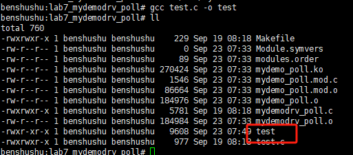

​		运行 test 程序，注意我们想让 test 程序在后台运行，所以添加了“&”，目的是让test 进程来监听。

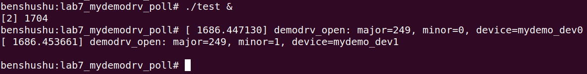

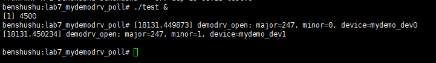

​		我们可以看到 test 程序打开了两个设备文件，一个是 mydemo_dev0，另外一个是mydemo_dev1。

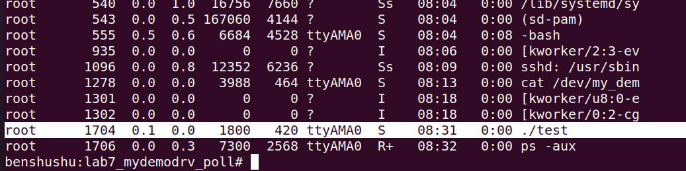

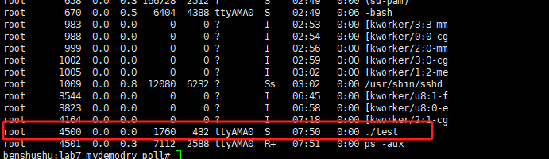

​		从“ps -aux”命令中看到，test 进程处于睡眠等待状态(S)。

### 接下来使用 echo 来写，我们可以往设备 0 里写入字符串。

```
benshushu:lab7_mydemodrv_poll# echo "i am at shanghai now" > /dev/mydemo0
```

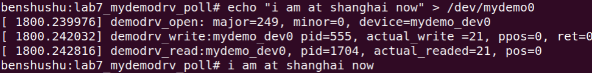

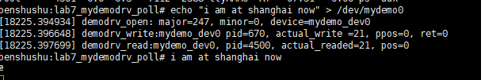

​		从 log 中我们可以看到， ==首先打开了 mydemo_dev0 设备，然后调用 write 函数往里面写数据，然后调用 read 函数从设备到读取到数据，最后打印出字符串。==

​		接下来我们继续使用 echo 命令来写设备 1.

```
benshushu:lab7_mydemodrv_poll# echo "hello, i am benshushu" > /dev/mydemo1
```

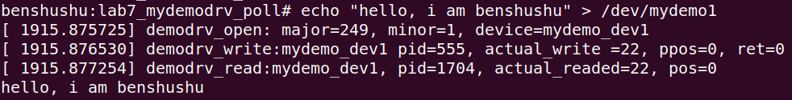

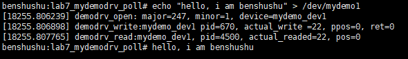

​		==从 log 中，我们同样可以看到，我们打开了设备 1，然后往设备里写入数据，最后从设备中读取数据到用户空间，并且把数据打印出来。==

​		==**说明我们的 test 程序，可以同时处理多个设备，这就是 I/O 多路复用最简单的模型了**。==

​		另外，可以在设备驱动程序的 poll 方法中添加输出信息，看看有什么变化。

### 实验结束清理

```
kill -9 4500
```

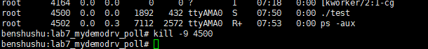

```
rmmod mydemo_poll #也帮助清理了一次后台test进程
```

并且设备其实删除模块后也会自己清理

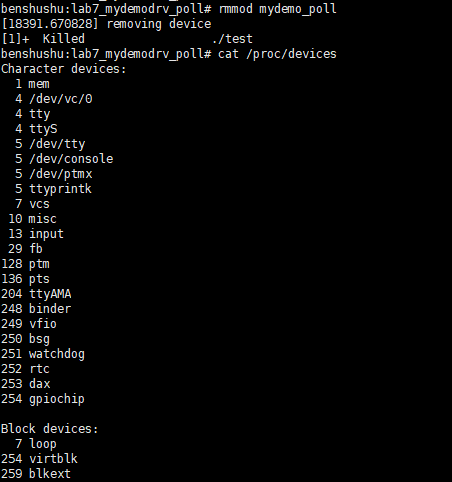

但是手动增加的dev需要手动删除

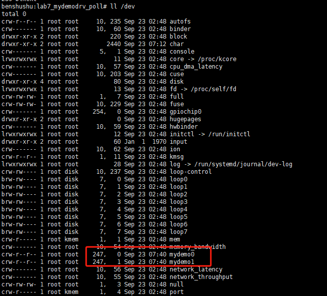

```
rm /dev/mydemo0 /dev/mydemo1
```

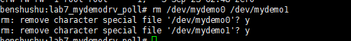

```
make clean
```

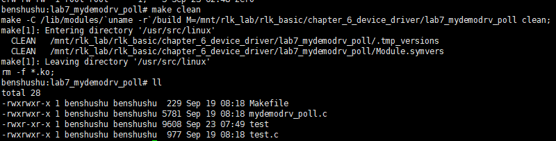

## 3 进阶思考

字符设备的 polling 的方法是字符设备里高级的技巧和技能。

1. 大家可以去内核代码里看看，有哪些字符设备驱动使用了 polling 的方法？

2. 这个 test 程序，如果修改成 select 方法，如何修改？