# 实验 6-8：为什么不能唤醒读写进程

## 1．实验目的

​		本实验是在 6.6.2 节实验 7 中故意设置的一个错误。希望读者通过发现问题和深入调试来解决问题，找到问题的根本原因，对字符设备驱动有一个深刻的认识。

## 2．实验详解

​		本实验在 6.6.2 节实验 7 设备驱动程序中修改了部分代码，并故意制造了一个错误。

​		主要的修改是把环形缓冲区 KFIFO 以及读写等待队列头 read_queue 和write_queue 都放入 struct mydemo_private_data 数据结构中。

```C
struct mydemo_private_data {
	struct mydemo_device *device;
 	char name[64];
 	struct kfifo mydemo_fifo;
 	wait_queue_head_t read_queue;
 	wait_queue_head_t write_queue; 
};
```

​		在 demodrv_open()函数中分配 kfifo，并初始化等待队列头 read_queue 和write_queue。

```c
static int demodrv_open(struct inode *inode, struct file *file)
{
    unsigned int minor = iminor(inode);
    struct mydemo_private_data *data;
    struct mydemo_device *device = mydemo_device[minor];
    int ret;

    printk("%s: major=%d, minor=%d, device=%s\n", __func__, 
           MAJOR(inode->i_rdev), MINOR(inode->i_rdev), device->name);

    data = kmalloc(sizeof(struct mydemo_private_data), GFP_KERNEL);
    if (!data)
        return -ENOMEM;

    sprintf(data->name, "private_data_%d", minor);

    ret = kfifo_alloc(&data->mydemo_fifo, MYDEMO_FIFO_SIZE, GFP_KERNEL);
    if (ret) {
        kfree(data);
        return -ENOMEM;
    }

    init_waitqueue_head(&data->read_queue);
    init_waitqueue_head(&data->write_queue);

    data->device = device;
    file->private_data = data;

    return 0;
}

```

------

### 代码注释及分析

#### 代码内容及注释：

```C
/**
 * demodrv_open - 设备打开回调函数
 * @inode: 设备的 inode 结构体指针
 * @file: 文件结构体指针
 *
 * 该函数在用户进程打开设备时被调用，负责初始化设备的私有数据结构，并与文件结构体关联。
 *
 * 返回 0 表示成功，否则返回负值的错误码。
 */
static int demodrv_open(struct inode *inode, struct file *file)
{
    unsigned int minor = iminor(inode);  // 获取次设备号，用于区分不同的设备实例
    struct mydemo_private_data *data;    // 私有数据结构体指针
    struct mydemo_device *device = mydemo_device[minor];  // 根据次设备号获取设备指针
    int ret;  // 存储函数返回值

    // 打印调试信息，包括主设备号、次设备号和设备名称
    printk("%s: major=%d, minor=%d, device=%s\n", __func__, 
           MAJOR(inode->i_rdev), MINOR(inode->i_rdev), device->name);

    // 为私有数据结构分配内存
    data = kmalloc(sizeof(struct mydemo_private_data), GFP_KERNEL);
    if (!data)
        return -ENOMEM;  // 内存分配失败，返回内存不足错误

    // 设置私有数据名称，名称格式为 "private_data_x"（x 是次设备号）
    sprintf(data->name, "private_data_%d", minor);

    // 分配一个 FIFO 缓冲区，用于存储设备数据
    ret = kfifo_alloc(&data->mydemo_fifo, MYDEMO_FIFO_SIZE, GFP_KERNEL);
    if (ret) {
        kfree(data);  // 如果 FIFO 分配失败，释放分配的内存
        return -ENOMEM;  // 返回内存不足错误
    }

    // 初始化读写等待队列，确保多进程读写时同步
    init_waitqueue_head(&data->read_queue);
    init_waitqueue_head(&data->write_queue);

    // 将设备指针保存到私有数据结构中
    data->device = device;

    // 将私有数据与文件结构体关联，通过 file->private_data 访问
    file->private_data = data;

    return 0;  // 成功返回 0
}
```

#### 分析过程：

1. **获取次设备号 (`iminor`)**：
   - 通过调用 `iminor(inode)` 获取设备的次设备号（`minor`），用于区分多个设备实例。每个次设备号对应不同的设备实例。次设备号从 `inode` 中提取出来，表明用户打开的是哪个设备。
2. **分配私有数据结构 (`kmalloc`)**：
   - `kmalloc` 用于动态分配内存空间，这里分配的是 `mydemo_private_data` 结构体。这个结构体包含与设备相关的私有数据，只有在该进程访问设备时才会使用。
   - 如果内存分配失败，函数返回 `-ENOMEM`，表示内存不足。
3. **私有数据的初始化**：
   - 通过 `sprintf` 将次设备号和字符串组合为 `"private_data_x"`，并赋值给私有数据的 `name` 字段。这样可以为每个次设备创建一个唯一标识，方便调试和管理。
4. **FIFO 缓冲区分配 (`kfifo_alloc`)**：
   - 使用 `kfifo_alloc` 分配一个大小为 `MYDEMO_FIFO_SIZE` 的 FIFO 缓冲区。FIFO 用于在设备和用户空间之间传输数据。
   - 如果 FIFO 分配失败，释放已分配的私有数据内存并返回错误。
5. **等待队列初始化 (`init_waitqueue_head`)**：
   - `init_waitqueue_head` 用于初始化读写等待队列。这些队列允许多个进程安全地等待设备读写操作完成，实现同步机制。
   - 等待队列用于处理设备的并发访问。当设备资源不可用时，进程会被挂起并放入队列，直到资源可用时再被唤醒。
6. **文件结构与私有数据的关联 (`file->private_data`)**：
   - `file->private_data` 是 Linux 文件结构中的一个字段，允许我们在文件打开时存储设备的私有数据。在后续的文件操作（如读写操作）中，我们可以通过 `file->private_data` 访问私有数据。
7. **返回成功 (`return 0`)**：
   - 如果所有初始化操作成功，函数返回 `0`，表示设备已成功打开。

#### 关键点：

- **设备实例化**：通过次设备号（`minor`）区分不同的设备实例，每个设备实例有自己独立的私有数据结构。
- **动态内存分配**：使用 `kmalloc` 动态分配内存，用于存储设备的私有数据。内核驱动中，动态内存分配常用于分配设备的运行时数据。
- **FIFO 缓冲区**：`kfifo_alloc` 用于分配设备的 FIFO 缓冲区，用来缓冲设备和用户之间的数据传输。
- **等待队列**：通过初始化读写等待队列，确保多进程同时访问设备时的同步操作。

#### 总结：

这段代码实现了设备驱动中的 `open` 操作，完成了设备的初始化工作，包括私有数据结构的分配、FIFO 缓冲区的分配、等待队列的初始化等。通过将私有数据与文件结构关联，后续的读写操作可以访问到这些私有数据。这种设计在多进程、多设备实例的驱动程序中非常常见，可以确保每个设备实例有独立的资源和状态管理。

------

另外，还需要相应修改的 demodrv_read()和 demodrv_write()函数。

## 下面是本实验的实验步骤。

### 启动 QEMU+runninglinuxkernel。

```
$ ./run_rlk_arm64.sh run
```

### 进入本实验的参考代码。

```
# cd /mnt/rlk_lab/rlk_basic/chapter_6_device_driver/lab4_mydemo_kfifo
```

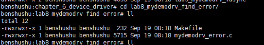

### 然后在 QEMU 系统里直接编译内核模块。

```
# make
```

```makefile
BASEINCLUDE ?= /lib/modules/`uname -r`/build

mydemo_error-objs := mydemodrv_error.o 

obj-m	:=   mydemo_error.o
all : 
	$(MAKE) -C $(BASEINCLUDE) M=$(PWD) modules;

clean:
	$(MAKE) -C $(BASEINCLUDE) M=$(PWD) clean;
	rm -f *.ko;
```

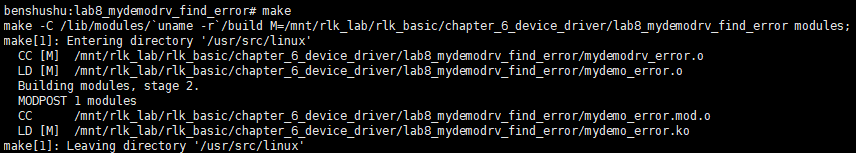

### 先检查上一次实验的内核模块是否已经卸载。 然后再使用 insmod 命令来加载内核模块。

```
benshushu:lab8_mydemodrv_find_error# insmod mydemo_error.ko 
[ 2101.215431] succeeded register char device: my_demo_dev
```

​		==注意：本次实验，我们的参考代码没有采用传统的注册字符设备的方法，而没有使用 misc 机制，所以需要手工来创建设备节点。==

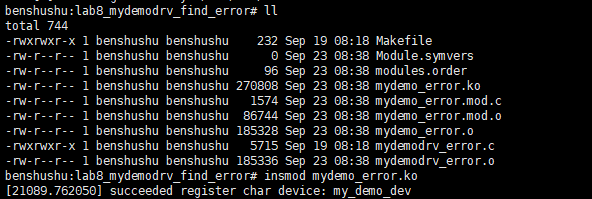

​		首先通过“/proc/devices”来查看设备主设备号。

```
cat /proc/devices
```

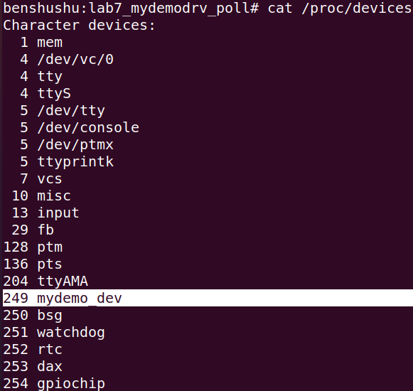

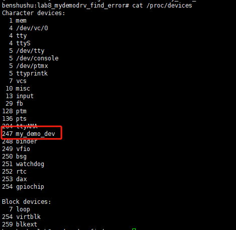

### 从上图可知，mydemo_dev 设备的主设备号为 249

```
benshushu# mknod /dev/mydemo0 c 249 0
```

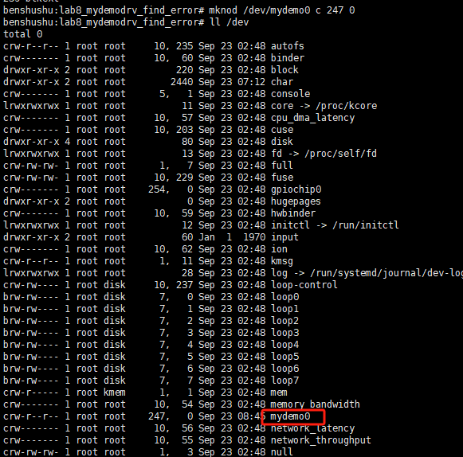

### 如上图所示，我们手工创建了一个节点：mydemo0

首先，在后台使用 cat 命令打开/dev/mydemo0 设备。

```
benshushu:lab8_mydemodrv_find_error# cat /dev/mydemo0 &
[1] 2079
[ 2259.231497] demodrv_open: major=249, minor=0, device=my_demo_dev0
[ 2259.233090] demodrv_read:my_demo_dev0 pid=2079, going to sleep, 
private_data_0
```

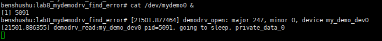

### 然后，使用 echo 命令向/dev/mydemo0 设备中写入字符串。

```
benshushu:lab8_mydemodrv_find_error# echo "i am benshushu" > /dev/mydemo0
[ 2330.598489] demodrv_open: major=249, minor=0, device=my_demo_dev0
[ 2330.600073] wait up read queue, private_data_0
[ 2330.601402] demodrv_write:my_demo_dev0 pid=555, actual_write =15, ppos=0, 
ret=0
```

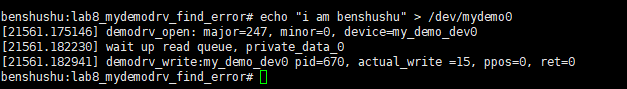

​		==最后，我们发现字符串虽然被写入设备中，而且也调用了 wake_up_interruptible(&data->read_queue)，但为什么没有唤醒 pid 为 2079 的读者进程呢？==

​		**注：读者可以认真思考一下这个问题。若不看答案能把这个问题弄明白，一定对Linux 内核的理解上一个台阶。**==本题的提示见教材（《奔跑吧 Linux 内核入门篇 第二版》）的第 6.8 章。==


## 实验结束清理

```
kill -9 5091 #pid号为5091 #可以不手动kill
```

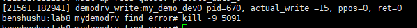

```
rmmod mydemo_error#会自动kill进程，因为查看了内核模块
```

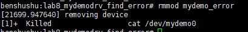

```
#手动删除/dev/mydemo0
rm /dev/mydemo0
```


```
make clean
```

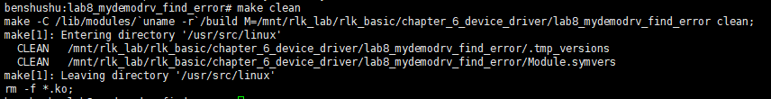