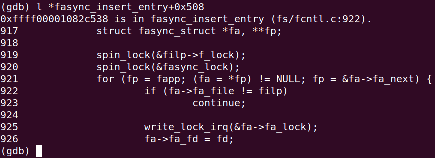

# 实验 5-9：向虚拟设备中添加异步通知

​		异步通知有点类似中断，当请求的设备资源可以获取时，由驱动程序主动通知应用程序，应用程序调用 read()或 write()函数来发起 I/O 操作。异步通知不像我们之前介绍的阻塞操作，它不会造成阻塞，只有设备驱动满足条件之后才通过信号机制通知应用程序去发起 I/O 操作。

​		异步通知使用了系统调用的 signal 函数和 sigcation 函数。signal 函数让一个信号和一个函数对应，每当接收到这个信号时会调用相应的函数来处理。

## 1．实验目的

​		学会如何给一个字符设备驱动程序添加异步通知功能。

## 2．实验详解

在字符设备中添加异步通知，需要完成如下几步。

1）在 mydemo_device 数据结构中添加一个 struct fasync_struct 数据结构指针，该指针会构造一个 struct fasync_struct 的链表头。

```C
struct mydemo_device {
	char name[64];
 	struct device *dev;
 	wait_queue_head_t read_queue;
 	wait_queue_head_t write_queue; 
 	struct kfifo mydemo_fifo;
 	struct fasync_struct *fasync;
};
```

2）异步通知在内核中使用 struct fasync_struct 数据结构来描述。

```C
<include/linux/fs.h>
struct fasync_struct {
	spinlock_t fa_lock;
 	int magic;
 	int fa_fd;
 	struct fasync_struct *fa_next; /* 单链表 */
 	struct file *fa_file;
 	struct rcu_head fa_rcu;
};
```

3）设备驱动的 file_operations 的操作方法集中有一个 fasync 的方法，我们需要实现它。

```C
static const struct file_operations demodrv_fops = {
	.owner = THIS_MODULE,
…
 	.fasync = demodrv_fasync,
};
static int demodrv_fasync(int fd, struct file *file, int on)
{
 	struct mydemo_private_data *data = file->private_data;
 	struct mydemo_device *device = data->device;
 	return fasync_helper(fd, file, on, &device->fasync);
}
```

这里直接使用 fasync_helper()函数来构造 struct fasync_struct 类型的节点，并添加到系统的链表中。

4）修改 demodrv_read()函数和 demodrv_write()函数，当请求的资源可用时，调用kill_fasync()接口函数来发送信号。

```C
static ssize_t demodrv_write(struct file *file, const char __user *buf, size_t count, loff_t *ppos)
{
    if (kfifo_is_full(&device->mydemo_fifo)) {
        if (file->f_flags & O_NONBLOCK)
            return -EAGAIN;

        ret = wait_event_interruptible(device->write_queue, !kfifo_is_full(&device->mydemo_fifo));
        if (ret)
            return ret;
    }

    ret = kfifo_from_user(&device->mydemo_fifo, buf, count, &actual_write);
    if (ret)
        return -EIO;

    if (!kfifo_is_empty(&device->mydemo_fifo)) {
        wake_up_interruptible(&device->read_queue);
        kill_fasync(&device->fasync, SIGIO, POLL_IN);
    }

    return actual_write;
}

```

------

### 代码注释及分析

#### 代码内容及注释：

```C
/**
 * demodrv_write - 设备的写操作回调函数
 * @file: 文件结构指针，表示用户打开的文件
 * @buf: 用户空间的缓冲区，存放要写入设备的数据
 * @count: 要写入的数据长度
 * @ppos: 文件偏移量指针
 *
 * 该函数将用户空间的数据写入设备的 FIFO 缓冲区，并处理非阻塞写入、等待队列等。
 * 返回成功写入的字节数，或者错误码。
 */
static ssize_t demodrv_write(struct file *file, const char __user *buf, size_t count, loff_t *ppos)
{
    // 如果 FIFO 已满，处理阻塞与非阻塞模式
    if (kfifo_is_full(&device->mydemo_fifo)) {
        // 如果是非阻塞模式，返回 -EAGAIN 错误，表示资源暂时不可用
        if (file->f_flags & O_NONBLOCK)
            return -EAGAIN;

        // 如果是阻塞模式，当前进程进入写等待队列，直到 FIFO 变为非满
        ret = wait_event_interruptible(device->write_queue, !kfifo_is_full(&device->mydemo_fifo));
        if (ret)  // 如果等待期间发生中断，返回中断信号错误码
            return ret;
    }

    // 将用户空间的数据写入 FIFO 缓冲区
    ret = kfifo_from_user(&device->mydemo_fifo, buf, count, &actual_write);
    if (ret)  // 如果写入过程中发生错误，返回 I/O 错误
        return -EIO;

    // 如果 FIFO 缓冲区中有数据，唤醒等待读取数据的进程
    if (!kfifo_is_empty(&device->mydemo_fifo)) {
        wake_up_interruptible(&device->read_queue);  // 唤醒读等待队列中的进程

        // 发送异步信号，通知等待此设备的进程可以进行 I/O 操作
        kill_fasync(&device->fasync, SIGIO, POLL_IN);
    }

    return actual_write;  // 返回实际写入的字节数
}
```

#### 分析过程：

1. **处理 FIFO 满的情况**：
   - **`kfifo_is_full(&device->mydemo_fifo)`**：首先检查设备的 FIFO 缓冲区是否已满。如果 FIFO 已满，写操作无法立即完成。
   - **非阻塞模式**：如果文件是以非阻塞模式打开的（`O_NONBLOCK` 标志），当缓冲区已满时，函数立即返回 `-EAGAIN` 错误，表示资源暂时不可用，用户进程可以稍后再试。
   - **阻塞模式**：如果是阻塞模式，进程会进入 `write_queue` 等待队列，等待 FIFO 缓冲区有空闲空间。当缓冲区变为非满时，进程被唤醒并继续写操作。如果等待过程中被中断（如收到信号），函数返回中断错误。
2. **写入数据到 FIFO 缓冲区**：
   - **`kfifo_from_user`**：将用户空间的缓冲区 `buf` 中的数据写入到设备的 FIFO 缓冲区。`count` 是要写入的字节数，`actual_write` 保存实际写入的字节数。
   - 如果写入失败（如发生了内存错误或 I/O 错误），返回 `-EIO`。
3. **唤醒等待读取的进程**：
   - **`kfifo_is_empty`**：在成功写入数据后，如果 FIFO 缓冲区中有数据（即非空），唤醒等待读取数据的进程。
   - **`wake_up_interruptible(&device->read_queue)`**：唤醒 `read_queue` 中等待的进程，这些进程之前因没有数据可读而被挂起。
   - **`kill_fasync(&device->fasync, SIGIO, POLL_IN)`**：向等待该设备的进程发送异步信号（`SIGIO`），通知它们设备有新的数据可以读取，常用于异步 I/O 操作。
4. **返回实际写入的字节数**：
   - 函数返回实际写入的字节数（`actual_write`），这允许用户进程知道成功写入了多少数据。

#### 关键点：

1. **阻塞与非阻塞模式**：
   - 如果设备的 FIFO 缓冲区满了，在非阻塞模式下函数立即返回，而在阻塞模式下，进程会挂起等待 FIFO 有空闲空间。
2. **FIFO 缓冲区操作**：
   - 使用 `kfifo_from_user` 将用户空间的数据写入内核的 FIFO 缓冲区。FIFO 是先进先出队列，用于管理设备数据的写入和读取。
3. **同步与异步通知**：
   - 通过 `wake_up_interruptible` 机制唤醒等待读取的进程，通过 `kill_fasync` 发送异步信号通知其他进程可以执行 I/O 操作，提供了同步与异步的 I/O 支持。
4. **多进程并发访问**：
   - 通过等待队列和 FIFO 缓冲区，驱动程序可以处理多个进程同时访问设备时的同步问题，确保数据读写的顺序和完整性。

#### 总结：

这段代码实现了设备驱动的 `write` 操作，支持阻塞和非阻塞模式下的写入操作。通过 FIFO 缓冲区管理数据传输，确保进程可以安全地写入数据。当缓冲区满时，阻塞模式的进程会进入等待队列，直到缓冲区有空闲空间。通过唤醒读进程和发送异步信号，提供了对读写操作的同步与异步支持。

​		

------

在 demodrv_write()函数中，当从用户空间复制数据到 KFIFO 中时，KFIFO 不为空，并通过 kill_fasync()接口函数发送 SIGIO 信号给用户程序。

## 下面是本实验的实验步骤。

### 启动 QEMU+runninglinuxkernel。

```sh
$ ./run_rlk_arm64.sh run
```

### 进入本实验的参考代码。

```sh
# cd /mnt/rlk_lab/rlk_basic/chapter_6_device_driver/lab9_mydemodrv_fasync
```


### 然后在 QEMU 系统里直接编译内核模块。

```sh
# make
```

```C
BASEINCLUDE ?= /lib/modules/`uname -r`/build

mydemo_fasync-objs := mydemodrv_fasync.o 

obj-m	:=   mydemo_fasync.o
all : 
	$(MAKE) -C $(BASEINCLUDE) M=$(PWD) modules;

clean:
	$(MAKE) -C $(BASEINCLUDE) M=$(PWD) clean;
	rm -f *.ko;
```


### 先检查上一次实验的内核模块是否已经卸载。 然后再使用 insmod 命令来加载内核模块。

```sh
benshushu:lab9_mydemodrv_fasync# insmod mydemo_fasync.ko 
[ 2601.935961] mydemo_fifo=0000000057bf2c8d
[ 2601.943704] mydemo_fifo=000000004b139f9e
[ 2601.944069] mydemo_fifo=00000000a8c1aa86
[ 2601.944290] mydemo_fifo=00000000fd52e93d
[ 2601.944540] mydemo_fifo=000000002b504a83
[ 2601.944817] mydemo_fifo=00000000665ac96d
[ 2601.945202] mydemo_fifo=0000000089a25ac7
[ 2601.945485] mydemo_fifo=000000007897ffa0
[ 2601.945811] succeeded register char device: mydemo_dev
```

​		从上面 log 可以看到驱动在初始化时候创建了 8 个设备。读者可以认真阅读驱动代码中的 simple_char_init 函数。

​		注意：本次实验，我们的参考代码没有采用传统的注册字符设备的方法，而没有使用 misc 机制，所以需要手工来创建设备节点。

​		首先通过“/proc/devices”来查看设备主设备号。


从上图可知，mydemo_dev 设备的主设备号为 249

```
benshushu:lab7_mydemodrv_poll# mknod /dev/mydemo0 c 249 0
benshushu:lab7_mydemodrv_poll# mknod /dev/mydemo1 c 249 1
```

我们手工创建了两个设备节点，分别是 mydemo0 和 mydemo1。

下面来看如何编写测试程序。

```
#define _GNU_SOURCE
#include <stdio.h>
#include <stdlib.h>
#include <string.h>
#include <unistd.h>
#include <sys/types.h>
#include <sys/stat.h>
#include <sys/ioctl.h>
#include <fcntl.h>
#include <errno.h>
#include <poll.h>
#include <signal.h>
static int fd;
void my_signal_fun(int signum, siginfo_t *siginfo, void *act)
{
 int ret;
 char buf[64];
 if (signum == SIGIO) {
 if (siginfo->si_band & POLLIN) {
 printf("FIFO is not empty\n");
 if ((ret = read(fd, buf, sizeof(buf))) != -1) {
 buf[ret] = '\0';
 puts(buf);
 }
 }
 if (siginfo->si_band & POLLOUT)
 printf("FIFO is not full\n");
 }
}
int main(int argc, char *argv[])
{
 int ret;
 int flag;
 struct sigaction act, oldact;
 sigemptyset(&act.sa_mask);
 sigaddset(&act.sa_mask, SIGIO);
 act.sa_flags = SA_SIGINFO;
 act.sa_sigaction = my_signal_fun;
 if (sigaction(SIGIO, &act, &oldact) == -1)
 goto fail;
 fd = open("/dev/mydemo0", O_RDWR);
 if (fd < 0) 
 goto fail;
 /*设置异步I/O所有权*/
 if (fcntl(fd, F_SETOWN, getpid()) == -1)
 goto fail;
 
 /*设置SIGIO信号*/
 if (fcntl(fd, F_SETSIG, SIGIO) == -1)
 goto fail;
 
 /*获取文件flags*/
 if ((flag = fcntl(fd, F_GETFL)) == -1)
 goto fail;
 
 /*设置文件flags, 设置FASYNC,支持异步通知*/
 if (fcntl(fd, F_SETFL, flag | FASYNC) == -1)
 goto fail;
 while (1)
 sleep(1);
fail:
 perror("fasync test");
 exit(EXIT_FAILURE);
}
```

​		首先，通过 sigaction()函数设置进程接收指定的信号，以及接收信号之后的动作，这里指定接收 SIGIO 信号，信号处理函数是 my_signal_fun()。接下来，就是打开设备驱动文件，并使用 fcntl()函数来设置打开设备文件支持 FASYNC 功能。当测试程序接收到 SIGIO 信号之后，会执行 my_signal_fun()函数，然后判断事件类型是否为 POLLIN。如果事件类型是 POLLIN，那么可以主动调用 read()函数并把数据读出来。

​		编译 test 程序。

```
benshushu:lab9_mydemodrv_fasync# gcc test.c -o test
```

​		在后台运行 test 程序。

```
benshushu:lab9_mydemodrv_fasync# ./test &
[1] 1199
[ 844.497368] demodrv_open: major=249, minor=0, device=mydemo_dev0
[ 844.499753] demodrv_fasync send SIGIO
```

接着使用 echo 命令往设备里写入字符串。

```
benshushu:lab9_mydemodrv_fasync# echo "i am linuxer" > /dev/mydemo0 
[ 881.553940] demodrv_open: major=249, minor=0, device=mydemo_dev0
[ 881.558981] demodrv_write kill fasync
[ 881.559480] demodrv_write:mydemo_dev0 pid=583, actual_write =13, ppos=0, 
ret=0
FIFO is not empty
[ 881.568783] demodrv_read:mydemo_dev0, pid=1199, actual_readed=13, pos=0
i am linuxer
FIFO is not full
```


​		从日志中可以看出，结果符合我们的预期，echo 命令向设备中写入字符串，通过kill_fasync()接口函数给测试程序发生 SIGIO 信号。测试程序接收到该信号之后，主动调用一次 read()函数去读，最后把刚才写入的字符串读到了用户空间。

## 3 进阶思考

​		在这个实验里，小明和小李同时做这个实验，小李得到了正确的结果，而小明却没有，他运行 test 程序之后，发生了 Oops 错误。


```
benshushu:lab9_mydemodrv_fasync# ./test &
[1] 2449
benshushu:lab9_mydemodrv_fasync# [ 2766.106337] demodrv_open: major=249, 
minor=0, device=mydemo_dev0
[ 2766.113649] demodrv_fasync send SIGIO
[ 2766.114965] Unable to handle kernel paging request at virtual address 
000000006f7eb181
[ 2766.116791] Mem abort info:
[ 2766.117387] ESR = 0x96000004
[ 2766.119180] Exception class = DABT (current EL), IL = 32 bits
[ 2766.119954] SET = 0, FnV = 0
[ 2766.120264] EA = 0, S1PTW = 0
[ 2766.120489] Data abort info:
[ 2766.120653] ISV = 0, ISS = 0x00000004
[ 2766.120852] CM = 0, WnR = 0
[ 2766.122649] user pgtable: 4k pages, 48-bit VAs, pgdp = 0000000098ed48b8
[ 2766.124512] [000000006f7eb181] pgd=0000000000000000
[ 2766.126336] Internal error: Oops: 96000004 [#1] SMP
[ 2766.127675] Modules linked in: mydemo_fasync(OE) [last unloaded: 
mydemo_error]
[ 2766.130744] CPU: 0 PID: 2449 Comm: test Kdump: loaded Tainted: G 
OE 5.0.0+ #3
[ 2766.132584] Hardware name: linux,dummy-virt (DT)
[ 2766.133673] pstate: 20000005 (nzCv daif -PAN -UAO)
[ 2766.135179] pc : fasync_insert_entry+0x508/0x918
[ 2766.135543] lr : fasync_insert_entry+0x420/0x918
[ 2766.135884] sp : ffff80002029f540
[ 2766.136251] x29: ffff80002029f540 x28: ffff800020052a00 
[ 2766.136933] x27: 0000000000000000 x26: 0000000000000000 
[ 2766.137846] x25: 0000000056000000 x24: 0000000000000015 
[ 2766.138823] x23: 0000000080001000 x22: 0000ffffaff82e44 
[ 2766.139542] x21: 0000000000000000 x20: ffff800026252600 
[ 2766.141351] x19: 0000000000000000 x18: 0000000000000000 
[ 2766.142250] x17: 0000000000000000 x16: 0000000000000000 
[ 2766.143220] x15: 0000000000000000 x14: 0720072007200720 
[ 2766.144754] x13: 0720072007200720 x12: 0720072007200720 
[ 2766.145408] x11: 0720072007200720 x10: 0720072007200720 
[ 2766.146364] x9 : ffff00001082c98c x8 : ffff80002fd8d040 
[ 2766.147101] x7 : ffff80002fd8d040 x6 : 0000000000000046 
[ 2766.148431] x5 : ffff8000286d88d0 x4 : ffff000012172e70 
[ 2766.149091] x3 : ffff000012172e70 x2 : 0000000000000001 
[ 2766.149748] x1 : 0000000000000000 x0 : 000000006f7eb169 
[ 2766.150566] Process test (pid: 2449, stack limit = 0x00000000451302a2)
[ 2766.151928] Call trace:
[ 2766.152406] fasync_insert_entry+0x508/0x918
[ 2766.152744] fasync_add_entry+0x4c/0x70
[ 2766.153128] fasync_helper+0x4c/0x54
[ 2766.154641] demodrv_fasync+0x64/0x6c [mydemo_fasync]
[ 2766.156184] setfl+0x1d8/0x510
[ 2766.156651] do_fcntl+0x2e8/0xb48
[ 2766.157434] __se_sys_fcntl+0x110/0x16c
[ 2766.157787] __arm64_sys_fcntl+0x40/0x48
[ 2766.158092] __invoke_syscall+0x24/0x2c
[ 2766.158425] invoke_syscall+0xa4/0xd8
[ 2766.159262] el0_svc_common+0x100/0x1e4
[ 2766.159615] el0_svc_handler+0x418/0x444
[ 2766.159928] el0_svc+0x8/0xc
[ 2766.161071] Code: f9400fe0 f9004fe0 140000ad f94053e0 (f9400c00) 
[ 2766.163985] SMP: stopping secondary CPUs
[ 2766.165779] Starting crashdump kernel...
[ 2766.166534] Bye!
```

​		这是为什么呢？请您帮小明解决一下这个问题，分析这个问题产生的原因和给出解决办法。

**下面是解决该问题的思路。**

​		首先我们要观察和分析这个日志。

​		明确这是一个OOPS 错误的 log。从这句日志“Unable to handle kernel paging request at virtual address 5c558162”我们可以看出内核发生了引用空指针的错误。

​		日志里显示了当前 PC 指针指向哪个函数。

```
[ 2766.135179] pc : fasync_insert_entry+0x508/0x918
[ 2766.135543] lr : fasync_insert_entry+0x420/0x918
```

​		我们可以看到 PC 指针指向 fasync_insert_entry 函数中的第 0x508 个字节的地方，0x918 表示 fasync_insert_entry 函数编译成二进制文件一共有 0x918 个字节，而出错的地方就是在 0x508 个字节的地方。

​		接下来打印出错时候通用寄存器的值。

```
[ 2766.135884] sp : ffff80002029f540
[ 2766.136251] x29: ffff80002029f540 x28: ffff800020052a00 
[ 2766.136933] x27: 0000000000000000 x26: 0000000000000000 
[ 2766.137846] x25: 0000000056000000 x24: 0000000000000015 
[ 2766.138823] x23: 0000000080001000 x22: 0000ffffaff82e44 
[ 2766.139542] x21: 0000000000000000 x20: ffff800026252600 
[ 2766.141351] x19: 0000000000000000 x18: 0000000000000000 
[ 2766.142250] x17: 0000000000000000 x16: 0000000000000000 
[ 2766.143220] x15: 0000000000000000 x14: 0720072007200720 
[ 2766.144754] x13: 0720072007200720 x12: 0720072007200720 
[ 2766.145408] x11: 0720072007200720 x10: 0720072007200720 
[ 2766.146364] x9 : ffff00001082c98c x8 : ffff80002fd8d040 
[ 2766.147101] x7 : ffff80002fd8d040 x6 : 0000000000000046 
[ 2766.148431] x5 : ffff8000286d88d0 x4 : ffff000012172e70 
[ 2766.149091] x3 : ffff000012172e70 x2 : 0000000000000001 
[ 2766.149748] x1 : 0000000000000000 x0 : 000000006f7eb169
```

接着是打印函数调用关系 calltrace。

```
[ 2766.151928] Call trace:
[ 2766.152406] fasync_insert_entry+0x508/0x918
[ 2766.152744] fasync_add_entry+0x4c/0x70
[ 2766.153128] fasync_helper+0x4c/0x54
[ 2766.154641] demodrv_fasync+0x64/0x6c [mydemo_fasync]
[ 2766.156184] setfl+0x1d8/0x510
[ 2766.156651] do_fcntl+0x2e8/0xb48
[ 2766.157434] __se_sys_fcntl+0x110/0x16c
[ 2766.157787] __arm64_sys_fcntl+0x40/0x48
[ 2766.158092] __invoke_syscall+0x24/0x2c
[ 2766.158425] invoke_syscall+0xa4/0xd8
[ 2766.159262] el0_svc_common+0x100/0x1e4
[ 2766.159615] el0_svc_handler+0x418/0x444
[ 2766.159928] el0_svc+0x8/0xc
```

从函数调用关系可以看到，函数的调用关系图是这样：

```
el0_svc ->__arm64_sys_fcntl ->__se_sys_fcntl -> do_fcntl-> setfl->
demodrv_fasync-> fasync_helper-> fasync_add_entry-> fasync_insert_entry
```

​		test 程序在用户空间调用了 fcntl()函数，然后在内核空间里，一直调用到我们驱动的 demodrv_fasync()函数里。在 demodrv_fasync()函数里，我们调用内核的 API 接口函数 fasync_helper()函数。最后在 fasync_helper()函数内部的 fasync_insert_entry()函数就结束了函数调用关系图，说明极有可能出错在 fasyncinsert_entry()函数里。

​		看明白了日志信息之后，我们可以开始动手解决问题了。

​		首先使用 gdb 来分析 PC 指针的指向的函数，它可以帮助我们查看出错是在哪一句代码里。这里使用 gdb-multiarch 程序。我们在 Ubuntu 主机上输入如下命令。

```
rlk@rlk:runninglinuxkernel_5.0$ /home/rlk/rlk/runninglinuxkernel_5.0
rlk@rlk:runninglinuxkernel_5.0$ gdb-multiarch vmlinux
```




​		使用“l * fasync_insert_entry+0x508”命令，我们可以看到 gdb 显示出错的时候是在 fs/fcntl.c 的第 922 行代码里。

​		接下来就要去分析为什么会在第 922 行中出错。第 922 行，只是判断 fa->fa_file是否等于 filp，为什么这里会出现空指针访问呢？即 log 中的：Unable to handle kernel paging request at virtual address。有一种可能性就是 fa 是一个空指针或者是一个非法指针。


​		从第 921 行分析，fa 是从参数 fapp 过来的，fapp 是一个二级指针，那么 fa 就是*fapp 的值。而这个 fapp 的参数是从我们的驱动程序 demodrv_fasync()函数传递过来的。


我们先看一下 device 数据结构的定义。


​		fasync 是 struct fasync_struct 数据结构的一个指针。在 demodrv_fasync()函数把这个数据结构指针的地址作为 fasync_helper()函数的参数。

​		而 struct fasync_struct 数据结构的初始化是在 simple_char_init()函数中。


​		在第 199 行，使用 kmalloc()函数来为 struct fasync_struct 数据结构分配内存。按

照我们的设想，这个 struct fasync_struct 数据结构里所有的成员都应该是全新的，也

就是全部初始化为 0，也就是 device->fasync 也是指向空指针。

​		那么在 fs/fcntl.c 的第 922 行的这条判断语句“(fa = *fp) != NULL”，理应判断为

假（false），因此不会执行到第 922 行的语句中。

​		那什么原因让判断语句“(fa = *fp) != NULL”为真呢？

​		小明经过很多天思考，发现 kmalloc()有可能导致这个问题。为什么呢？kmalloc分配的内存不能保证内存都是初始化为 0，也就是说有可能是乱的数据。这样就可能导致“(fa = *fp) != NULL”语句判断为真，而执行第 922 行时候出现了空指针访问。

​		修改办法也很简单，打开 mydemodrv_fasync.c 文件，把第 199 行的 kmalloc()函数改成 kzalloc()函数即可。

​		kzalloc()函数会在 kmalloc()函数基础上，把分配得到的内存全部初始化为 0。

​		这个例子非常接近我们实际工作中遇到的驱动和内核 bug，了解其接近问题的思路非常重要，这可能对初学者来说比较难，但是我们可以先了解，然后在细细体会。