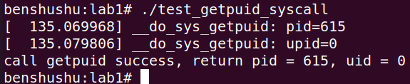

# 实验 7-1：在 ARM64 机器上新增一个系统调用

## 1．实验目的

通过新增一个系统调用，理解系统调用的实现过程。

## 2．实验详解

​		1）在 ARM 64 Virt 平台上新增一个系统调用，该系统调用不用传递任何参数，在该系统调用里输出当前进程的 PID 和 UID 值。

​		2）编写一个应用程序来调用这个新增的系统调用。==实验要求添加的系统调用不传递任何参数，一般将 pid 和 uid 直接通过 printk 输出到 dmesg 中，==但是这样非常的不优雅。该参考代码添加了一个系统调用。

```C
long getpuid(pid_t *pid, uid_t *uid);
```

​		pid 和 uid 通过参数返回到用户空间。

## 3．实验详解

​		对于 ARM64 处理器来说，系统调用号的定义是实现在 include/uapi/asm-generic/unistd.h 头文件中。


​		系统默认最大的系统调用个数为 295，那我们可以在系统调用最后的地方，增加一个我们新的系统调用，新的系统调用为 getpuid，号码为第 295 号。


​		接着我们在 arch/arm64/kernel/sys.c 文件里实现这个系统调用的回调函数。


​		这里的一个难点是：SYSCALL_DEFINE2 宏。读者可以看《奔跑吧 Linux 内核入门篇》第二版第 7.1.2 章相关内容。

​		接下来，我们可以写一个简单的测试程序。

```C
#include <stdio.h>
#include <stdlib.h>
#include <unistd.h>
#include <errno.h>

int main(int argc, char **argv)
{
    long pid, uid;
    int ret;

    ret = (int)syscall(295, &pid, &uid);
    if (ret != 0) {
        printf("call getpuid failed\n");
        return 1;
    }

    printf("call getpuid success, return pid = %d, uid = %d\n", pid, uid);
    return 0;
}

```

我们的 test 测试程序也很简单，直接使用 libc 中 syscall 函数来调用我们新加的系统调用号，即第 295 号的系统调用。

------

### 代码注释及分析

#### 代码内容及注释：

```C
#include <stdio.h>
#include <stdlib.h>
#include <unistd.h>
#include <errno.h>

/**
 * main - 主函数
 * @argc: 命令行参数的个数
 * @argv: 命令行参数的数组
 *
 * 通过 `syscall` 函数调用系统调用号 295，获取当前进程的 PID 和 UID。
 * 
 * 返回 0 表示成功，返回 1 表示调用失败。
 */
int main(int argc, char **argv)
{
    long pid, uid;  // 定义用于存储进程 ID 和用户 ID 的变量
    int ret;        // 保存系统调用的返回值

    // 调用系统调用 295，传递指针以获取 PID 和 UID
    ret = (int)syscall(295, &pid, &uid);
    if (ret != 0) {
        // 如果返回值不为 0，表示系统调用失败，打印错误信息并返回错误码 1
        printf("call getpuid failed\n");
        return 1;
    }

    // 成功调用系统调用后，打印进程 ID 和用户 ID
    printf("call getpuid success, return pid = %d, uid = %d\n", pid, uid);
    return 0;  // 返回 0 表示程序执行成功
}
```

#### 分析过程：

1. **系统调用 `syscall`**：
   - `syscall` 函数用于在用户空间显式调用系统调用。在 Linux 系统中，每个系统调用都有一个唯一的编号，在这里调用的是编号为 **295** 的系统调用。
   - 该编号表示具体的系统调用功能（比如 `getpuid`，假设为获取进程 ID 和用户 ID）。
   - 系统调用通过传递指针参数 `&pid` 和 `&uid`，由内核将当前进程的 PID 和 UID 写入这些变量。
2. **返回值检查**：
   - 系统调用的返回值通过变量 `ret` 存储。
   - 如果 `ret` 不为 `0`，表示系统调用执行失败，通常错误信息保存在 `errno` 中。此时程序打印错误信息 "call getpuid failed"，并返回 1，表示失败。
   - 如果 `ret` 为 `0`，表示系统调用成功，程序打印获取到的 `pid` 和 `uid`，并继续执行。
3. **输出 PID 和 UID**：
   - 调用成功后，程序从 `syscall` 返回的值中获得进程 ID（`pid`）和用户 ID（`uid`），并将这些值打印出来。
4. **`syscall` 的使用**：
   - 在实际开发中，使用 `syscall` 是为了直接调用内核提供的系统功能，通常系统提供的库函数（如 `getpid()` 和 `getuid()`）会封装这些系统调用。但在某些场景下，开发人员需要直接调用 `syscall` 来完成特定功能。

#### 关键点：

1. **`syscall` 函数**：
   - `syscall` 是 Linux 系统中用于直接调用系统调用的函数。它接受一个编号（如 `295`）和一系列参数，参数会被传递给内核执行特定操作。
2. **错误处理**：
   - 系统调用失败时会返回非零值，因此需要检查 `ret` 来判断是否调用成功。如果失败，程序通过 `printf` 打印错误信息并返回 `1` 以指示失败。
3. **PID 和 UID 的获取**：
   - `pid` 和 `uid` 是 Linux 系统中常见的两个标识符：`pid` 是进程 ID，`uid` 是用户 ID。它们通常用于进程管理和权限控制。

#### 进一步扩展：

- 系统调用号：
  - 系统调用号 **295** 在不同的系统架构或内核版本中可能代表不同的功能。你可以通过查看内核的系统调用表来确认特定编号对应的功能。
- 错误码：
  - 当系统调用失败时，通常会设置 `errno`，你可以通过 `perror` 或 `strerror(errno)` 来获取更详细的错误信息。

#### 总结：

这段代码通过 `syscall` 函数直接调用系统调用号 295，获取当前进程的 PID 和 UID。程序中通过检查系统调用的返回值来判断调用是否成功，并在成功时输出相关信息。系统调用是一种非常底层的操作，通常用于需要直接访问内核功能的场景。

------

## 4．实验步骤

本实验的参考补丁是在：kmodules/rlk_lab/rlk_basic/chapter_7_systemcall/lab1 目录

### 打补丁

在启动qemu之前修改代码，通过打补丁的形式，下面这个git am没有指定工作目录，所以我们需要进入到当前目录/runninglinuxkernel_5.0/

```shell
$ cd /home/rlk/rlk/runninglinuxkernel_5.0
$ git am kmodules/rlk_lab/rlk_basic/chapter_7_systemcall/lab1/0001-add-new-syscall.patch
```

先设置好git


打补丁


查看修改，好像并不是这些，因为git am是直接commit的，所以查看commit id修改了什么


```
git show  cf0353be085033bb2254cc3fdf1fa316223c2201
```


### 编译内核

修改过代码之后，重新编译内核

```shell
$ ./run_rlk_arm64.sh build_kernel
```


### 启动 runninglinuxkernel

```shel
$ ./run_rlk_arm64.sh run
```


### 编译和运行测试程序

```shell
benshushu:# cd /mnt/rlk_lab/rlk_basic/chapter_7_systemcall/lab1/
benshushu:lab1# gcc test_getpuid_syscall.c -o test_getpuid_syscall
benshushu:lab1# ./test_getpuid_syscall
```



