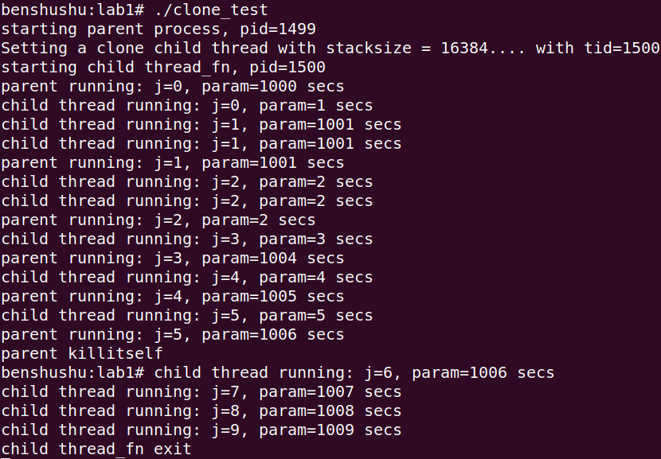

# 实验 8-1：fork 和 clone 

## 1．实验目的

了解和熟悉 Linux 中 fork 系统调用和 clone 系统调用的用法。

## 2．实验要求

1）使用 fork()函数创建一个子进程，然后在父进程和子进程中分别使用 printf 语

句来判断谁是父进程和子进程。

2）使用 clone()函数创建一个子进程。如果父进程和子进程共同访问一个全局变

量，结果会如何？如果父进程比子进程先消亡，结果会如何？

3）请思考，如下代码中会打印几个“_”？

```
int main(void)
{
int i;
for(i=0; i<2; i++){
fork();
printf("_\n");
}
wait(NULL);
wait(NULL);
return 0;
}
```

3．实验步骤

（1）fork 例子

（2）clone 例子

下面是本实验的实验步骤。

启动 QEMU+runninglinuxkernel。

```
$ ./run_rlk_arm64.sh run
```

进入本实验的参考代码。

```
# /mnt/rlk_lab/rlk_basic/chapter_8_process/lab1
```

编译测试程序。

```
benshushu:lab1# gcc clone_test.c -o clone_test
```

运行 clone_test 程序。

```
benshushu:lab1# ./clone_test 
starting parent process, pid=1499
Setting a clone child thread with stacksize = 16384.... with tid=1500
starting child thread_fn, pid=1500
parent running: j=0, param=1000 secs
child thread running: j=0, param=1 secs
child thread running: j=1, param=1001 secs
child thread running: j=1, param=1001 secs
parent running: j=1, param=1001 secs
child thread running: j=2, param=2 secs
child thread running: j=2, param=2 secs
parent running: j=2, param=2 secs
child thread running: j=3, param=3 secs
parent running: j=3, param=1004 secs
child thread running: j=4, param=4 secs
parent running: j=4, param=1005 secs
child thread running: j=5, param=5 secs
parent running: j=5, param=1006 secs
parent killitself
benshushu:lab1# child thread running: j=6, param=1006 secs
child thread running: j=7, param=1007 secs
child thread running: j=8, param=1008 secs
child thread running: j=9, param=1009 secs
child thread_fn exit
```



（3）打印几个“_”