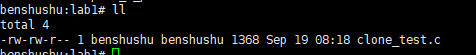
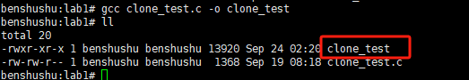
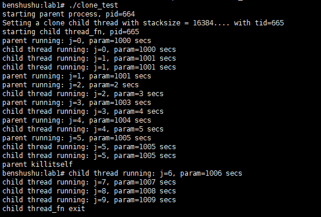

# 实验 8-1：fork 和 clone 

## 1．实验目的

​		了解和熟悉 Linux 中 fork 系统调用和 clone 系统调用的用法。

## 2．实验要求

​		1）使用 fork()函数创建一个子进程，然后在父进程和子进程中分别使用 printf 语句来判断谁是父进程和子进程。

​		2）使用 clone()函数创建一个子进程。如果父进程和子进程共同访问一个全局变量，结果会如何？如果父进程比子进程先消亡，结果会如何？

​		3）请思考，如下代码中会打印几个“_”？

```
int main(void)
{
    int i;
    for (i = 0; i < 2; i++) {
        fork();
        printf("_\n");
    }
    wait(NULL);
    wait(NULL);
    return 0;
}

```

------

### 代码注释及分析

#### 代码内容及注释：

```C
#include <stdio.h>
#include <unistd.h>
#include <sys/wait.h>

/**
 * main - 主函数，创建子进程并输出字符
 *
 * 通过调用 `fork()` 创建多个子进程，并在每个进程中输出下划线 `_`。
 * 最后使用 `wait()` 等待所有子进程结束。
 */
int main(void)
{
    int i;
    
    // 循环两次，每次创建一个新进程
    for (i = 0; i < 2; i++) {
        fork();  // 创建子进程
        printf("_\n");  // 每个进程（父进程和子进程）都会输出一行 '_'
    }

    // 等待子进程结束，确保父进程不会在子进程结束之前退出
    wait(NULL);
    wait(NULL);

    return 0;
}
```

#### 分析过程：

1. **`fork()` 函数**：

   - ```
     fork()
     ```

      用于创建一个新的子进程。新创建的子进程几乎与父进程完全相同，除了返回值不同：

     - 在父进程中，`fork()` 返回子进程的 PID。
     - 在子进程中，`fork()` 返回 0。

   - 在这个程序中，`fork()` 被调用了两次，因此会创建多个子进程，形成进程树。

2. **循环中的 `fork()` 调用**：

   - 第一次进入循环时，调用 `fork()`，产生一个子进程，因此共有两个进程（父进程和子进程）。每个进程都会执行 `printf("_\n")`。
   - 第二次进入循环时，父进程和子进程都再次调用 `fork()`，每个进程再次创建一个新的子进程。这时，系统中有 4 个进程，每个进程再次输出一行 `_`。

   **最终输出结果：**

   - 每次 `fork()` 都会增加当前的进程数量。第一次 `fork()` 后有 2 个进程，第二次 `fork()` 后有 4 个进程。每个进程都会执行 `printf("_\n")`，因此总共输出 4 行 `_`。

3. **`wait(NULL)`**：

   - `wait()` 函数用于等待子进程结束。由于程序中创建了多个子进程，`wait(NULL)` 会阻塞父进程，直到某个子进程结束。这里调用了两次 `wait()`，分别等待两个子进程结束。

4. **进程树**：

   - 第一次 `fork()`：父进程（PID 1）创建一个子进程（PID 2）。
   - 第二次 `fork()`：父进程（PID 1）和第一个子进程（PID 2）都会创建各自的子进程，因此形成 4 个进程。

   具体的进程结构如下：

   ```
   父进程（PID 1）
   ├── 子进程（PID 2）
   ├── 父进程再次 fork 子进程（PID 3）
   └── 子进程再次 fork 子进程（PID 4）
   ```

   每个进程执行 `printf("_\n")` 后，程序调用 `wait()`，确保父进程等待所有子进程结束后才退出。

#### 关键点：

- **`fork()` 的使用**：`fork()` 每次调用都会创建一个新的进程。每个进程都会执行 `printf("_\n")`，因此创建的进程越多，输出的行数越多。
- **`wait()` 的使用**：`wait()` 确保父进程等待所有子进程结束后才会继续执行，避免出现“僵尸进程”。
- **进程创建**：两次 `fork()` 导致了 4 个进程，每个进程都会输出一行 `_`。

#### 输出分析：

- 每个进程都会执行 `printf("_\n")`，因为每次 `fork()` 后，父进程和子进程都会执行后面的代码。
- 总共会有 4 行 `_` 被输出，因为共有 4 个进程。

#### 总结：

这段代码展示了 `fork()` 如何创建多个进程以及每个进程如何独立地执行代码。通过调用 `fork()` 两次，程序创建了 4 个进程，每个进程输出一行 `_`。`wait()` 函数用于确保父进程等待所有子进程结束，避免产生僵尸进程。

------

## 3．实验步骤

### （1）fork 例子

### （2）clone 例子

## 下面是本实验的实验步骤。

### 启动 QEMU+runninglinuxkernel。

```shell
$ ./run_rlk_arm64.sh run
```

### 进入本实验的参考代码。

```shell
# /mnt/rlk_lab/rlk_basic/chapter_8_process/lab1
```



### 编译测试程序。

```shell
benshushu:lab1# gcc clone_test.c -o clone_test
```



```C
#include <unistd.h>
#include <malloc.h>
#include <sys/types.h>
#include <sys/wait.h>

int param = 0;

int thread_fn(void *data)
{
	int j;
	printf("starting child thread_fn, pid=%d\n", getpid());
	for (j = 0; j < 10; j++) {
		param = j + 1000;
		sleep(1);
		printf("child thread running: j=%d, param=%d secs\n", j,
		       param);
	}
	printf("child thread_fn exit\n");
	return 0;
}

int main(int argc, char **argv)
{
	int j, tid, pagesize, stacksize;
	void *stack;

	printf("starting parent process, pid=%d\n", getpid());

	pagesize = getpagesize();
	stacksize = 4 * pagesize;

	/* could probably just use malloc(), but this is safer */
	/* stack = (char *)memalign (pagesize, stacksize); */
	posix_memalign(&stack, pagesize, stacksize);

	printf("Setting a clone child thread with stacksize = %d....", stacksize);
	tid = clone(thread_fn, (char *)stack + stacksize, CLONE_VM | SIGCHLD, 0);
	printf(" with tid=%d\n", tid);
	if (tid < 0)
		exit(EXIT_FAILURE);

	/* could do a  wait (&status) here if required */
	for (j = 0; j < 6; j++) {
		param = j;
		sleep(1);
		printf("parent running: j=%d, param=%d secs\n", j,
		       param);
	}
	printf("parent killitself\n");
	/* We shouldn't free(stack) here since the child using it is still running */
	exit(EXIT_SUCCESS);
}

```

------

### 代码注释及分析

#### 代码内容及注释：

```C
#include <unistd.h>
#include <malloc.h>
#include <sys/types.h>
#include <sys/wait.h>

int param = 0;  // 全局变量，父子进程共享

/**
 * thread_fn - 子进程执行的函数
 * @data: 传递给子进程的数据，这里未使用
 *
 * 该函数是子进程的入口函数。在函数中，子进程循环执行，修改全局变量并输出日志。
 * 子进程会持续运行一段时间，并每秒输出当前的 `j` 值和 `param` 值。
 */
int thread_fn(void *data)
{
    int j;
    printf("starting child thread_fn, pid=%d\n", getpid());  // 输出子进程的 PID

    // 子进程的循环执行
    for (j = 0; j < 10; j++) {
        param = j + 1000;  // 修改全局变量 param
        sleep(1);  // 每次循环暂停 1 秒
        printf("child thread running: j=%d, param=%d secs\n", j, param);
    }

    printf("child thread_fn exit\n");  // 子进程执行完毕，输出退出日志
    return 0;
}

/**
 * main - 主函数，创建子进程并执行父进程任务
 * @argc: 命令行参数数量
 * @argv: 命令行参数数组
 *
 * 该函数创建一个新的子进程并与其共享虚拟内存（通过 `clone()`）。父进程和子进程
 * 会并行运行，分别修改和输出 `param` 变量的值。
 */
int main(int argc, char **argv)
{
    int j, tid, pagesize, stacksize;
    void *stack;  // 子进程的栈内存指针

    printf("starting parent process, pid=%d\n", getpid());  // 输出父进程的 PID

    pagesize = getpagesize();  // 获取系统的页面大小
    stacksize = 4 * pagesize;  // 设置子进程的栈大小为 4 页

    // 为子进程分配栈内存，使用 posix_memalign 进行内存对齐
    posix_memalign(&stack, pagesize, stacksize);

    // 使用 clone() 系统调用创建子进程，并共享虚拟内存空间（CLONE_VM 标志）
    printf("Setting a clone child thread with stacksize = %d....", stacksize);
    tid = clone(thread_fn, (char *)stack + stacksize, CLONE_VM | SIGCHLD, 0);
    printf(" with tid=%d\n", tid);  // 输出创建的子进程的 TID

    if (tid < 0)
        exit(EXIT_FAILURE);  // 如果创建子进程失败，退出程序

    // 父进程的循环执行
    for (j = 0; j < 6; j++) {
        param = j;  // 修改全局变量 param
        sleep(1);  // 每次循环暂停 1 秒
        printf("parent running: j=%d, param=%d secs\n", j, param);
    }

    printf("parent killitself\n");
    // 不要在这里释放 stack，因为子进程还在使用该栈内存
    exit(EXIT_SUCCESS);
}
```

#### 分析过程：

1. **全局变量 `param`**：
   - `param` 是一个全局变量，父进程和子进程共享。在不同进程中修改它时，由于父子进程共享虚拟内存空间（通过 `CLONE_VM` 标志），两者都会修改同一个内存位置，导致 `param` 的值被相互覆盖。
2. **子进程的入口函数 `thread_fn`**：
   - ==`thread_fn` 是子进程在调用 `clone()` 时指定的函数。子进程会执行这个函数，并在 10 次循环中每秒修改 `param` 的值并输出日志。==
   - 子进程的 PID 使用 `getpid()` 获取并输出，显示子进程与父进程是不同的进程。
3. **栈内存的分配**：
   - 使用 `posix_memalign` 分配内存，并且将栈大小设置为系统页面大小的 4 倍。这样分配的内存对齐到页面大小，确保栈的分配是安全的。
   - ==栈内存的分配对于 `clone()` 系统调用至关重要，因为每个子进程需要独立的栈空间。==
4. **`clone()` 系统调用**：
   - ==`clone()` 是一个强大的系统调用，允许创建与父进程共享内存的子进程。这里使用的标志 `CLONE_VM | SIGCHLD` 意味着子进程和父进程共享虚拟内存（即全局变量 `param` 是共享的），并且当子进程退出时，会向父进程发送 `SIGCHLD` 信号。==
   - `clone()` 的返回值是新创建的子进程的 TID（线程 ID）。
5. **父进程的执行**：
   - 父进程在子进程创建之后，开始执行自己的任务。父进程同样每秒修改 `param` 并输出日志，但父进程的循环只运行 6 次。
   - 父进程和子进程同时修改共享的 `param`，因此父子进程之间的 `param` 值会相互覆盖。
6. **`wait()` 和内存管理**：
   - 父进程并没有使用 `wait()` 去等待子进程结束，而是直接退出程序。尽管如此，父进程仍会接收到子进程的 `SIGCHLD` 信号，表明子进程已经结束。
   - 栈内存分配给子进程后，父进程不应该在子进程运行时释放这块内存，因此在程序退出时没有显式释放栈内存。

#### 关键点：

1. **`clone()` 的使用**：
   - `clone()` 系统调用用于创建共享虚拟地址空间的子进程，这种共享允许父子进程在同一个内存区域中修改数据。`CLONE_VM` 标志使得父子进程共享全局变量 `param`，因此两者会相互覆盖彼此对 `param` 的修改。
2. **全局变量的共享**：
   - 由于使用了 `CLONE_VM`，父进程和子进程共享相同的虚拟内存空间，因此对 `param` 的修改会在父子进程之间同步。这也导致了父进程和子进程之间的相互干扰。
3. **并发问题**：
   - 由于父子进程都在修改同一个全局变量 `param`，可能会出现并发访问问题，导致 `param` 的值不可预测。这是共享内存并发编程中的常见现象。
4. **栈内存管理**：
   - 栈内存是为子进程分配的，虽然父进程没有释放它，但是子进程仍然在使用该栈。因此，在子进程运行期间不应该释放这块内存。

#### 输出分析：

1. 父进程和子进程的输出交错：
   - 父进程和子进程在不同的时间段内修改并输出 `param`，因此父进程和子进程的输出会交错在一起，具体顺序可能不固定，取决于调度。

#### 总结：

​		这段代码使用了 `clone()` 系统调用来创建一个与父进程共享虚拟内存的子进程，展示了如何通过共享内存实现进程间通信。父进程和子进程在执行过程中修改同一个全局变量 `param`，但由于共享内存的特性，父子进程的修改会相互影响。同时，程序通过栈内存管理确保子进程有独立的栈空间，但没有释放这块内存，因为子进程仍在使用它。

------

### 运行 clone_test 程序。

```shell
benshushu:lab1# ./clone_test 
starting parent process, pid=1499
Setting a clone child thread with stacksize = 16384.... with tid=1500
starting child thread_fn, pid=1500
parent running: j=0, param=1000 secs
child thread running: j=0, param=1 secs
child thread running: j=1, param=1001 secs
child thread running: j=1, param=1001 secs
parent running: j=1, param=1001 secs
child thread running: j=2, param=2 secs
child thread running: j=2, param=2 secs
parent running: j=2, param=2 secs
child thread running: j=3, param=3 secs
parent running: j=3, param=1004 secs
child thread running: j=4, param=4 secs
parent running: j=4, param=1005 secs
child thread running: j=5, param=5 secs
parent running: j=5, param=1006 secs
parent killitself
benshushu:lab1# child thread running: j=6, param=1006 secs
child thread running: j=7, param=1007 secs
child thread running: j=8, param=1008 secs
child thread running: j=9, param=1009 secs
child thread_fn exit
```




------

### 运行结果分析

在这段程序中，父进程和子进程并发执行，它们共享相同的虚拟内存空间。具体地说，两个进程共享全局变量 `param`，因此两者对 `param` 的修改会互相影响。以下是对运行结果的详细分析。

### 1. **进程启动**

- 父进程：程序首先启动了父进程，并输出以下内容：

  ```
  starting parent process, pid=1499
  Setting a clone child thread with stacksize = 16384.... with tid=1500
  ```

  - 父进程的 PID 是 `1499`，它使用 `clone()` 创建了一个子进程，子进程的 TID（线程 ID）是 `1500`。

- 子进程：子进程随后开始执行，并输出以下内容：

  ```
  starting child thread_fn, pid=1500
  ```

  - 子进程的 PID 是 `1500`，它和父进程并发运行。

### 2. **父进程和子进程的并发执行**

父进程和子进程都在修改共享的全局变量 `param`，并在各自的循环中输出 `j` 和 `param` 的值。由于父子进程共享虚拟内存，它们对 `param` 的修改会互相影响。

#### 具体输出分析：

- **第一轮循环**：

  ```
  parent running: j=0, param=1000 secs
  child thread running: j=0, param=1 secs
  ```

  - 父进程首先将 `param` 设置为 `0`，然后子进程将 `param` 设置为 `1000`。这表明父子进程在并发修改 `param`，并且修改的顺序不固定。

- **第二轮循环**：

  ```
  child thread running: j=1, param=1001 secs
  child thread running: j=1, param=1001 secs
  parent running: j=1, param=1001 secs
  ```

  - 子进程在第二轮循环中将 `param` 设置为 `1001`，并连续输出了两次（这可能是因为子进程的循环运行得更快）。
  - 父进程也尝试将 `param` 修改为 `1`，但由于共享内存的原因，它输出时 `param` 已被子进程修改为 `1001`。

- **接下来的循环**：

  ```
  child thread running: j=2, param=2 secs
  parent running: j=2, param=2 secs
  child thread running: j=3, param=3 secs
  parent running: j=3, param=1004 secs
  ```

  - 在第 `2` 和 `3` 轮循环中，子进程和父进程继续修改 `param`，但由于它们共享内存，父进程的 `param` 值被子进程的修改覆盖，导致它在 `j=3` 时输出的 `param=1004`，而不是 `3`。

- **最后几轮循环**：

  ```
  child thread running: j=4, param=4 secs
  parent running: j=4, param=1005 secs
  child thread running: j=5, param=5 secs
  parent running: j=5, param=1006 secs
  parent killitself
  ```

  - 父进程在 `j=5` 轮之后结束自己的执行，输出 "parent killitself" 并退出。
  - 然而，子进程仍在继续执行，接着输出：

  ```
  arduino复制代码child thread running: j=6, param=1006 secs
  child thread running: j=7, param=1007 secs
  child thread running: j=8, param=1008 secs
  child thread running: j=9, param=1009 secs
  child thread_fn exit
  ```

  - 子进程在父进程退出后继续执行，修改 `param` 并输出直到 `j=9`，然后退出。

#### 3. **并发和共享内存的影响**

- **`param` 的竞争修改**：父进程和子进程共享同一个全局变量 `param`，因此两者对 `param` 的修改互相影响，造成输出中 `param` 值的“竞争”。例如，当父进程将 `param` 设置为 `2` 时，子进程可能已经将它修改为 `1002`，导致父进程的输出显示的是子进程的值。
- **输出顺序的不确定性**：由于父子进程是并发运行的，因此输出的顺序是不确定的。具体的输出顺序取决于操作系统如何调度这两个进程。

#### 4. **父进程和子进程的退出**

- 父进程在执行完自己的循环后退出，但没有 `wait()` 子进程，这意味着父进程不会等待子进程结束。子进程在父进程退出后继续运行，直到完成所有循环。

#### 结论：

1. **共享内存的影响**：由于父进程和子进程共享内存空间，`param` 变量被父子进程并发修改，导致输出中的值可能会被覆盖和竞争。
2. **并发执行和不确定性**：父进程和子进程是并发执行的，因此它们的输出顺序不固定。每次运行程序时，输出可能会有所不同。
3. **进程生命周期**：父进程在自己的任务完成后立即退出，而子进程在父进程退出后继续执行，直到完成自己的任务。

------

（3）打印几个“_”