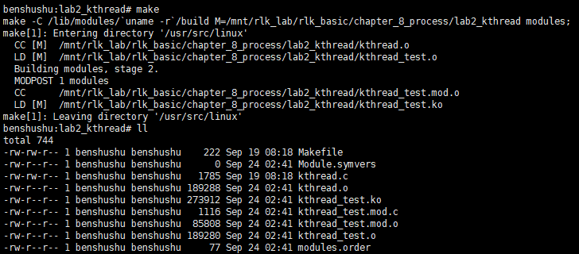
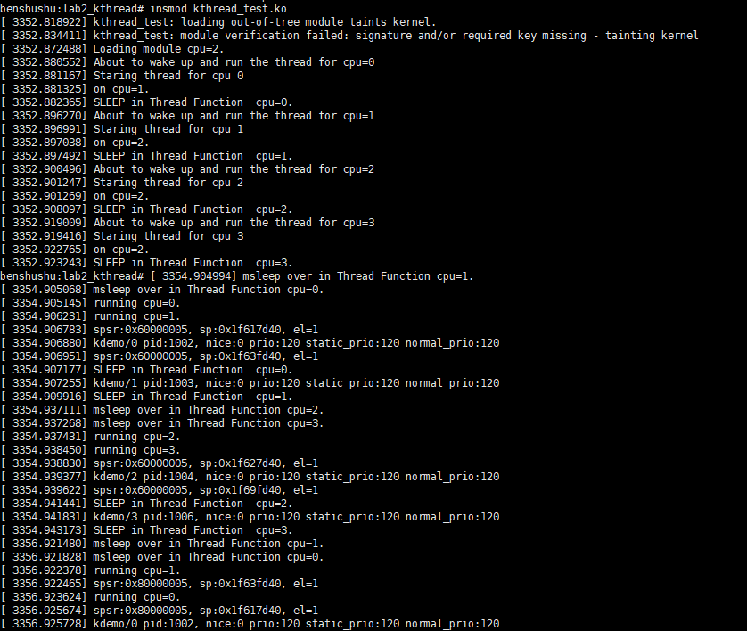

# 实验 8-2：内核线程

## 1．实验目的

​		了解和熟悉 Linux 内核中是如何创建内核线程的。

## 2．实验要求

​		==1）写一个内核模块，创建一组内核线程，每个 CPU 一个内核线程。==

​		==2）在每个内核线程中，打印当前 CPU 的状态，比如 ARM64 通用寄存器的值。==

​		==3）在每个内核线程中，打印当前进程的优先级等信息。==

### 3．实验步骤

## 下面是本实验的实验步骤。

### 启动 QEMU+runninglinuxkernel。

```shell
$ ./run_rlk_arm64.sh run
```

### 进入本实验的参考代码。

```shell
# cd /mnt/rlk_lab/rlk_basic/chapter_8_process/lab2
```

### 编译内核模块。

```shell
benshushu:lab2# make
make -C /lib/modules/`uname -r`/build 
M=/mnt/rlk_lab/rlk_basic/chapter_8_process/lab2_kthread modules;
make[1]: Entering directory '/usr/src/linux'
 CC [M] /mnt/rlk_lab/rlk_basic/chapter_8_process/lab2_kthread/kthread.o
 LD [M] 
/mnt/rlk_lab/rlk_basic/chapter_8_process/lab2_kthread/kthread_test.o
 Building modules, stage 2.
 MODPOST 1 modules
 CC 
/mnt/rlk_lab/rlk_basic/chapter_8_process/lab2_kthread/kthread_test.mod.o
 LD [M] 
/mnt/rlk_lab/rlk_basic/chapter_8_process/lab2_kthread/kthread_test.ko
make[1]: Leaving directory '/usr/src/linux'
```

```makefile
BASEINCLUDE ?= /lib/modules/`uname -r`/build

kthread_test-objs := kthread.o

obj-m	:=   kthread_test.o
all :
	$(MAKE) -C $(BASEINCLUDE) M=$(PWD) modules;

clean:
	$(MAKE) -C $(BASEINCLUDE) M=$(PWD) clean;
	rm -f *.ko;
```



------

### Makefile 详细解释

该 `Makefile` 主要用于编译 Linux 内核模块。它基于内核构建系统，使用 `kthread.c` 文件生成一个内核模块 `kthread_test.ko`。现在详细解释 Makefile 的每个部分，并分析 `make` 之后会生成哪些文件以及如何生成它们。

#### Makefile 结构分析

```makefile
# 设置内核源代码路径，使用当前系统的内核版本路径
BASEINCLUDE ?= /lib/modules/`uname -r`/build

# 指定kthread_test模块所依赖的目标文件
kthread_test-objs := kthread.o

# 定义最终的模块目标
obj-m := kthread_test.o

# 'all' 目标：编译模块
all :
	$(MAKE) -C $(BASEINCLUDE) M=$(PWD) modules;

# 'clean' 目标：清理编译生成的文件
clean:
	$(MAKE) -C $(BASEINCLUDE) M=$(PWD) clean;
	rm -f *.ko;
```

#### 解释每个部分

1. **`BASEINCLUDE ?= /lib/modules/$(uname -r)/build`**：

   - 这行用于指定内核的构建目录。`/lib/modules/$(uname -r)/build` 是系统内核源代码的符号链接路径，指向当前正在运行的内核的源码树。`uname -r` 命令会动态获取当前系统的内核版本，确保模块针对当前内核版本编译。

2. **`kthread_test-objs := kthread.o`**：

   - 这里指定了 `kthread_test` 内核模块依赖于 `kthread.o`，也就是由 `kthread.c` 编译生成的目标文件。模块最终由多个目标文件链接在一起。

3. **`obj-m := kthread_test.o`**：

   - `obj-m` 变量告诉内核构建系统，要生成的模块名称为 `kthread_test.o`。这个文件实际上是内核模块的目标文件，在经过链接后会生成 `.ko` 文件（内核模块文件）。

4. **`all:`**：

   - 这是 `make` 执行时的默认目标。该行中的命令通过 `$(MAKE)` 调用了内核构建系统。`-C $(BASEINCLUDE)` 参数告诉 `make` 切换到 `BASEINCLUDE` 指定的内核源代码路径，然后通过 `M=$(PWD)` 表示将当前目录（通过 `$(PWD)` 获取当前路径）作为模块构建的目标目录。最终，`modules` 目标会在当前目录下生成内核模块。
   - 该命令会：
     1. 切换到内核源代码目录。
     2. 使用当前目录中的源文件（`kthread.c`）编译模块。
     3. 最终在当前目录下生成 `kthread_test.ko`。

5. **`clean:`**：

   - ```shell
     clean
     ```

      目标用于清理构建时生成的临时文件。命令执行了两个操作：

     1. `$(MAKE) -C $(BASEINCLUDE) M=$(PWD) clean;`：调用内核的构建系统，清理当前目录下的构建文件。
     2. `rm -f *.ko;`：删除当前目录下生成的 `kthread_test.ko` 文件。

#### 编译过程及生成的文件

执行 `make` 后会生成多个文件，以下是具体的过程和文件解释：

1. **调用内核构建系统**：
   - `$(MAKE) -C $(BASEINCLUDE) M=$(PWD) modules;` 会调用内核构建系统来编译当前目录下的模块文件。
   - `BASEINCLUDE` 定义了内核源代码目录，`M=$(PWD)` 告诉内核构建系统使用当前目录下的文件。
2. **生成的文件**： 编译内核模块时，`make` 会生成以下几个文件：
   - **`kthread_test.ko`**：最终的内核模块文件，这是 `.o` 目标文件和其他依赖项链接后生成的内核模块，可以使用 `insmod` 加载到内核中。
   - **`kthread.o`**：由 `kthread.c` 编译得到的目标文件，它是 `kthread_test.ko` 的一部分。
   - **`.kthread_test.o.cmd`**：用于跟踪依赖关系的文件，包含构建模块时所用的命令和依赖信息。`make` 在后续编译中会使用此文件来避免重复编译。
   - **`kthread_test.mod.o`**：用于链接 `.ko` 文件的中间文件，包含模块的符号信息。
   - **`kthread_test.mod.c`**：包含模块信息的 C 文件，描述模块的初始化和卸载函数、许可证信息等。它由内核构建系统自动生成，用于跟踪模块信息。
   - **`Module.symvers`**：包含模块导出的符号信息，供其他模块引用。
   - **`modules.order`**：列出编译模块的顺序。内核编译系统用它来确定构建多个模块时的顺序。

#### `make` 命令执行后生成文件示例：

- `kthread.o`: `kthread.c` 编译生成的目标文件。
- `kthread_test.ko`: 最终的内核模块文件。
- `kthread_test.mod.o`: 模块链接的中间文件。
- `kthread_test.mod.c`: 自动生成的模块描述文件。
- `.kthread_test.o.cmd`: 跟踪依赖关系的文件。
- `Module.symvers`: 包含导出符号信息。

#### 清理目标的作用

当你执行 `make clean` 时，它会执行以下操作：

1. 调用 `$(MAKE) -C $(BASEINCLUDE) M=$(PWD) clean;`，它会调用内核构建系统中的 `clean` 目标，删除编译生成的中间文件和依赖文件。
2. 执行 `rm -f *.ko;` 删除最终生成的 `kthread_test.ko` 模块文件。

这可以清除所有编译生成的文件，恢复到未编译状态。

------

### 安装本实验的内核模块。

```shell
benshushu:lab2_kthread# insmod kthread_test.ko 
[13427.799305] Loading module cpu=0.
[13427.817282] About to wake up and run the thread for cpu=0
[13427.820939] Staring thread for cpu 0
[13427.821134] on cpu=2.
[13427.824743] SLEEP in Thread Function cpu=0.
[13427.831980] About to wake up and run the thread for cpu=1
[13427.834020] Staring thread for cpu 1
[13427.834056] on cpu=2.
[13427.838384] SLEEP in Thread Function cpu=1.
[13427.848019] About to wake up and run the thread for cpu=2
[13427.848956] Staring thread for cpu 2
[13427.848988] on cpu=3.
[13427.849403] SLEEP in Thread Function cpu=2.
[13427.856697] About to wake up and run the thread for cpu=3
[13427.858520] Staring thread for cpu 3
[13427.858551] on cpu=3.
[13427.867324] SLEEP in Thread Function cpu=3.
benshushu:lab2_kthread# [13429.851394] msleep over in Thread Function cpu=1.
[13429.851434] msleep over in Thread Function cpu=0.
[13429.851520] running cpu=0.
[13429.851823] running cpu=1.
[13429.864449] spsr:0x20000005, sp:0x20b07d40, el=1
[13429.864563] kdemo/0 pid:1820, nice:0 prio:120 static_prio:120 
normal_prio:120
[13429.864613] SLEEP in Thread Function cpu=0.
[13429.869668] spsr:0x60000005, sp:0x250d7d40, e
```

PS：停止不了，一直运行



------

### 补充：停止的方法

要退出并停止这个内核模块代码中的线程，你需要执行以下步骤。这个模块创建的每个线程都是通过 `kthread_create()` 创建的，并且这些线程会一直运行直到模块被卸载。为了正确地退出这些线程，你可以通过卸载内核模块来停止线程。卸载模块时，`my_exit()` 函数会被调用，它将使用 `kthread_stop()` 停止所有线程。

#### 退出模块的步骤

1. **使用 `rmmod` 卸载模块**：

   - 你可以使用 `rmmod` 命令来卸载模块，停止所有线程并清理资源。

   **命令**：

   ```
   sudo rmmod kthread_test
   ```

   这个命令将触发 `my_exit()` 函数，调用 `kthread_stop()`，逐个停止所有在线 CPU 上的线程。

2. **如果模块无法卸载**：

   - 如果由于某种原因 `rmmod` 失败，可以使用强制卸载模块的方法。

   **强制卸载命令**：

   ```
   sudo rmmod --force kthread_test
   ```

#### 代码退出的流程

当你运行 `sudo rmmod kthread_test` 时，以下过程会发生：

- `my_exit()` 函数被调用。
- 在 `my_exit()` 中，`for_each_online_cpu(i)` 遍历所有在线 CPU，调用 `kthread_stop(tsk[i])` 停止每个线程。
- `kthread_stop()` 会发送一个信号，让对应的线程退出循环。线程检测到 `kthread_should_stop()` 返回 `true`，从而退出 `thread_fun()` 函数。

#### `my_exit()` 的工作原理：

- `kthread_stop()` 是内核线程的终止机制，确保线程安全地退出。调用它会使 `kthread_should_stop()` 返回 `true`，从而停止线程。

```
static void __exit my_exit(void)
{
    int i;
    // 遍历每个在线的 CPU，停止绑定在每个 CPU 上的线程
    for_each_online_cpu(i) {
        pr_info("Kill Thread %d", i);
        kthread_stop(tsk[i]);  // 停止线程
        print_cpu("Kill was done on");
    }
}
```

#### 通过卸载模块退出的日志输出：

在卸载模块时，你应该会看到类似以下的日志输出，表示每个线程都被停止：

```
[xxxx.xx] Kill Thread 0
[xxxx.xx] Kill was done on cpu=0.
[xxxx.xx] Kill Thread 1
[xxxx.xx] Kill was done on cpu=1.
...
```

#### 额外提示

如果你想要控制线程在模块卸载时自动停止，可以引入超时机制或条件变量来使线程在一定时间后自动退出。然而，当前代码通过 `rmmod` 进行手动控制是一种常见的做法。

总结：执行 `sudo rmmod kthread_test` 卸载模块，可以安全地停止线程并退出当前运行的模块。

### 补充：我是在qemu中运行的怎么再起另一个终端

在 QEMU 中运行 Linux 虚拟机时，默认情况下，你只会有一个终端（即 QEMU 的控制台窗口）。要在 QEMU 环境中启动另一个终端或使用多窗口环境，可以尝试以下方法：

#### 方法 1: 使用 SSH 或 `serial console` 访问

如果你已经配置了网络，可以通过 SSH 或 `serial console` 的方式访问虚拟机，来实现多终端操作。

##### 1.1 使用网络配置和 SSH

如果 QEMU 中的虚拟机已经配置了网络，并且虚拟机上运行了 `sshd` 服务，你可以通过宿主机使用 SSH 连接到 QEMU 虚拟机。

**步骤**：

1. 在虚拟机中确认网络已配置，并获取 IP 地址：

   ```
   ifconfig
   ```

2. 确保虚拟机中已经安装并启动了 SSH 服务。

   ```
   sudo systemctl start sshd
   ```

3. 在宿主机上（运行 QEMU 的机器），通过 SSH 连接到虚拟机：

   ```
   ssh username@<virtual_machine_ip>
   ```

4. 这样你就可以打开另一个终端，通过 SSH 控制虚拟机。

##### 1.2 使用 `serial console`

你可以在启动 QEMU 时配置 `serial console` 访问，允许你通过不同的串口会话来连接虚拟机。

**启动 QEMU 时添加串口参数**：

```
qemu-system-x86_64 -serial mon:stdio -serial pty -kernel <your_kernel_image>
```

启动后，QEMU 会生成一个虚拟串口终端设备，你可以使用宿主机上的终端模拟器连接该设备。

#### 方法 2: 使用 `tmux` 或 `screen` 工具

如果你在 QEMU 中没有网络支持，你可以使用虚拟机内的多终端管理工具，比如 `tmux` 或 `screen`。这些工具允许你在同一个终端窗口中创建多个虚拟终端。

##### 2.1 使用 `tmux`

`tmux` 是一个终端复用器，允许你在同一个窗口内创建多个会话并在会话间切换。

**步骤**：

1. 安装 `tmux`：

   ```
   sudo apt-get install tmux
   ```

2. 启动 `tmux`：

   ```
   tmux
   ```

3. 你现在可以在 `tmux` 中创建新的窗口或分屏：

   - 新建窗口：`Ctrl + b` 然后按 `c`
   - 切换窗口：`Ctrl + b` 然后按 `n` 或 `p`
   - 分割屏幕：`Ctrl + b` 然后按 `%`（垂直分割）或 `"`（水平分割）

4. 退出 `tmux`：`Ctrl + b`，然后按 `d`（只是分离当前会话，并不会终止会话）。

##### 2.2 使用 `screen`

`screen` 是另一个终端复用器，类似于 `tmux`，也可以用于管理多个终端。

**步骤**：

1. 安装 `screen`：

   ```
   sudo apt-get install screen
   ```

2. 启动 `screen`：

   ```
   screen
   ```

3. 创建新的窗口：`Ctrl + a`，然后按 `c`

4. 在窗口间切换：`Ctrl + a`，然后按 `n`（下一个窗口）或 `p`（上一个窗口）

5. 退出 `screen`：`Ctrl + a`，然后按 `d`

#### 方法 3: 使用 `Alt+F` 切换虚拟控制台

如果 QEMU 中的虚拟机有多个虚拟终端（tty），你可以通过 `Alt + F1` 到 `Alt + F6` 键在不同的控制台之间切换。

**步骤**：

1. 在 QEMU 虚拟机中按下 `Alt + F2` 切换到另一个 TTY 控制台。
2. 使用 `Alt + F1` 切换回主控制台。

你可以在这些虚拟控制台中启动不同的终端会话，这样就可以在不同的控制台中运行不同的命令。

#### 总结

- 如果你有网络支持，可以通过 SSH 连接 QEMU 虚拟机来获得多个终端。
- 如果没有网络支持，可以在虚拟机内部使用 `tmux` 或 `screen` 来管理多个终端。
- 你还可以通过 QEMU 启动多个串行控制台或使用 `Alt + F` 来切换虚拟终端。

------

## 4．实验代码

```C
#include <linux/module.h>
#include <linux/init.h>
#include <linux/module.h>
#include <linux/kthread.h>
#include <linux/delay.h>

static struct task_struct *tsk[NR_CPUS];

static void show_reg(void)
{
    unsigned int spsr, sp, el;
    asm("mrs %0, spsr_el1" : "=r"(spsr) : : "cc");
    asm("mov %0, sp" : "=r"(sp) : : "cc");
    asm("mrs %0, CurrentEL" : "=r"(el) : : "cc");
    printk("spsr:0x%x, sp:0x%x, el=%d\n", spsr, sp, el >> 2);
}

static void show_prio(void)
{
    struct task_struct *task = current;
    printk("%s pid:%d, nice:%d prio:%d static_prio:%d normal_prio:%d\n",
           task->comm, task->pid,
           PRIO_TO_NICE(task->static_prio),
           task->prio, task->static_prio,
           task->normal_prio);
}

static void print_cpu(char *s)
{
    preempt_disable();
    pr_info("%s cpu=%d.\n", s, smp_processor_id());
    preempt_enable();
}

static int thread_fun(void *t)
{
    do {
        print_cpu("SLEEP in Thread Function");
        msleep_interruptible(2000);
        print_cpu("msleep over in Thread Function");
        print_cpu("running");
        show_reg();
        show_prio();
    } while (!kthread_should_stop());

    return 0;
}

static int __init my_init(void)
{
    int i;
    print_cpu("Loading module");

    for_each_online_cpu(i) {
        tsk[i] = kthread_create(thread_fun, NULL, "kdemo/%d", i);
        if (!tsk[i]) {
            pr_info("Failed to generate a kernel thread\n");
            return -1;
        }
        kthread_bind(tsk[i], i);
        pr_info("About to wake up and run the thread for cpu=%d\n", i);
        wake_up_process(tsk[i]);
        pr_info("Starting thread for cpu %d", i);
        print_cpu("on");
    }

    return 0;
}

static void __exit my_exit(void)
{
    int i;
    for_each_online_cpu(i) {
        pr_info("Kill Thread %d", i);
        kthread_stop(tsk[i]);
        print_cpu("Kill was done on");
    }
}

module_init(my_init);
module_exit(my_exit);

MODULE_AUTHOR("Ben ShuShu");
MODULE_LICENSE("GPL v2");

```

------

### 代码注释及分析

#### 代码内容及注释：

```C
#include <linux/module.h>
#include <linux/init.h>
#include <linux/module.h>
#include <linux/kthread.h>
#include <linux/delay.h>

static struct task_struct *tsk[NR_CPUS];  // 用于存储每个 CPU 上创建的线程结构体指针

/**
 * show_reg - 显示当前处理器的寄存器状态
 *
 * 该函数通过内联汇编读取并打印 `spsr`（程序状态寄存器），`sp`（堆栈指针）和 `el`（当前异常级别）。
 */
static void show_reg(void)
{
    unsigned int spsr, sp, el;
    asm("mrs %0, spsr_el1" : "=r"(spsr) : : "cc");
    asm("mov %0, sp" : "=r"(sp) : : "cc");
    asm("mrs %0, CurrentEL" : "=r"(el) : : "cc");
    printk("spsr:0x%x, sp:0x%x, el=%d\n", spsr, sp, el >> 2);
}

/**
 * show_prio - 显示当前进程的优先级信息
 *
 * 该函数打印当前任务的调度相关信息，如进程名、PID、优先级等。
 */
static void show_prio(void)
{
    struct task_struct *task = current;  // 获取当前进程的 `task_struct`
    printk("%s pid:%d, nice:%d prio:%d static_prio:%d normal_prio:%d\n",
           task->comm, task->pid,
           PRIO_TO_NICE(task->static_prio),  // 获取 nice 值
           task->prio, task->static_prio,
           task->normal_prio);
}

/**
 * print_cpu - 打印当前正在运行的 CPU ID
 * @s: 字符串，用于指明日志来源
 *
 * 该函数在禁用抢占的情况下，打印当前进程运行的 CPU ID。
 */
static void print_cpu(char *s)
{
    preempt_disable();  // 禁止抢占，以避免在输出时发生调度切换
    pr_info("%s cpu=%d.\n", s, smp_processor_id());  // 打印当前 CPU ID
    preempt_enable();  // 恢复抢占
}

/**
 * thread_fun - 线程函数，每个 CPU 的线程执行的函数
 * @t: 未使用参数
 *
 * 该函数通过 `kthread_should_stop()` 来判断线程是否应停止，并在执行过程中每 2 秒输出一次线程状态、CPU ID、寄存器信息和进程优先级。
 */
static int thread_fun(void *t)
{
    do {
        print_cpu("SLEEP in Thread Function");  // 打印线程进入休眠状态前所在的 CPU
        msleep_interruptible(2000);  // 让线程休眠 2 秒
        print_cpu("msleep over in Thread Function");  // 打印线程休眠结束后的 CPU ID
        print_cpu("running");  // 打印当前线程正在运行的 CPU
        show_reg();  // 打印寄存器状态
        show_prio();  // 打印当前线程的优先级信息
    } while (!kthread_should_stop());  // 当线程需要停止时，退出循环

    return 0;  // 线程函数返回 0
}

/**
 * my_init - 模块初始化函数
 *
 * 该函数在模块加载时执行，遍历每个 CPU，在线程上创建一个与之绑定的内核线程，并启动这些线程。
 */
static int __init my_init(void)
{
    int i;
    print_cpu("Loading module");

    // 为系统中的每个在线 CPU 创建并启动一个线程
    for_each_online_cpu(i) {
        // 创建线程，绑定到对应 CPU，并使用 thread_fun 作为执行函数
        tsk[i] = kthread_create(thread_fun, NULL, "kdemo/%d", i);
        if (!tsk[i]) {
            pr_info("Failed to generate a kernel thread\n");
            return -1;  // 如果线程创建失败，返回错误
        }
        kthread_bind(tsk[i], i);  // 将线程绑定到 CPU i
        pr_info("About to wake up and run the thread for cpu=%d\n", i);
        wake_up_process(tsk[i]);  // 唤醒线程并开始执行
        pr_info("Starting thread for cpu %d", i);
        print_cpu("on");  // 打印当前 CPU 信息
    }

    return 0;  // 返回 0 表示模块初始化成功
}

/**
 * my_exit - 模块卸载函数
 *
 * 该函数在模块卸载时执行，停止所有在线 CPU 上创建的内核线程。
 */
static void __exit my_exit(void)
{
    int i;

    // 停止每个在线 CPU 上创建的线程
    for_each_online_cpu(i) {
        pr_info("Kill Thread %d", i);
        kthread_stop(tsk[i]);  // 停止线程
        print_cpu("Kill was done on");  // 打印哪个 CPU 上的线程被停止
    }
}

module_init(my_init);  // 指定初始化函数
module_exit(my_exit);  // 指定卸载函数

MODULE_AUTHOR("Ben ShuShu");
MODULE_LICENSE("GPL v2");
```

#### 代码分析：

1. **模块的初始化与线程创建**：
   - 在模块初始化函数 `my_init()` 中，程序通过 `for_each_online_cpu(i)` 遍历系统中每个在线的 CPU，然后为每个 CPU 创建一个内核线程。`kthread_create()` 用于创建线程，`kthread_bind()` 将线程绑定到特定的 CPU。
   - 创建的线程会执行 `thread_fun()` 函数，该函数在内核空间中运行，使用 `msleep_interruptible()` 让线程休眠 2 秒，同时在每次循环中输出寄存器状态和线程的优先级信息。
2. **线程的运行逻辑**：
   - 每个线程在自己的 CPU 上运行，通过 `print_cpu()` 打印出它所在的 CPU ID。
   - `show_reg()` 函数使用内联汇编读取并打印处理器的寄存器信息，如程序状态寄存器 (`spsr`) 和堆栈指针 (`sp`)。
   - `show_prio()` 函数则显示当前线程的优先级、nice 值等调度信息。
   - 线程会一直运行，直到 `kthread_should_stop()` 返回 `true`，表示需要停止线程。
3. **线程停止与模块卸载**：
   - 当模块被卸载时，`my_exit()` 函数会被调用，它遍历每个在线的 CPU，使用 `kthread_stop()` 停止所有之前创建的线程。
4. **同步与抢占保护**：
   - 在 `print_cpu()` 函数中，通过 `preempt_disable()` 禁止抢占，以确保在获取 CPU ID 时，进程不会被抢占，防止输出错误的 CPU 信息。

#### 关键点：

1. **内核线程的创建与管理**：
   - 使用 `kthread_create()` 和 `kthread_bind()` 在每个 CPU 上创建内核线程，并将线程与特定的 CPU 绑定，确保线程只在特定的 CPU 上运行。
2. **多核 CPU 的并发执行**：
   - 通过遍历每个在线 CPU，程序在每个 CPU 上创建线程，使得这些线程能够并行运行，展示多核系统下的并发执行。
3. **寄存器状态与优先级显示**：
   - 通过 `show_reg()` 和 `show_prio()` 函数，程序展示了如何在内核空间读取当前 CPU 的寄存器状态和调度相关信息。
4. **内存管理**：
   - 线程被绑定到特定的 CPU，并且通过 `kthread_stop()` 在模块卸载时安全停止，防止内核资源泄露。

#### 输出分析：

在模块加载和运行期间，每个在线 CPU 上的线程都会定期输出以下信息：

- 当前线程运行在哪个 CPU 上（通过 `print_cpu()` 打印）。
- 当前 CPU 的寄存器状态（`spsr`、`sp` 和 `el`）。
- 线程的调度优先级和 `nice` 值。

当模块被卸载时，所有在线 CPU 上的线程会被停止，并且输出每个线程的停止信息。

------

