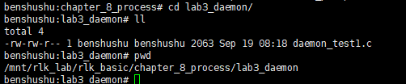
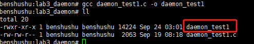
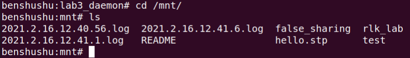
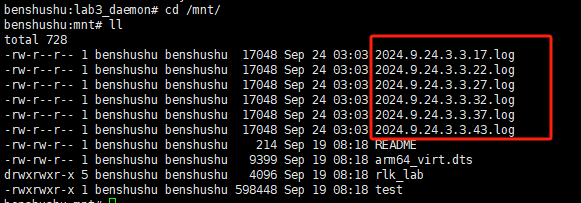
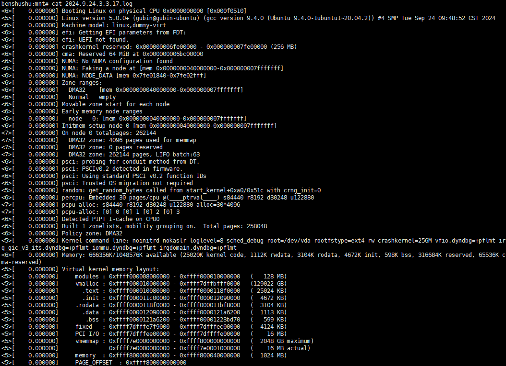
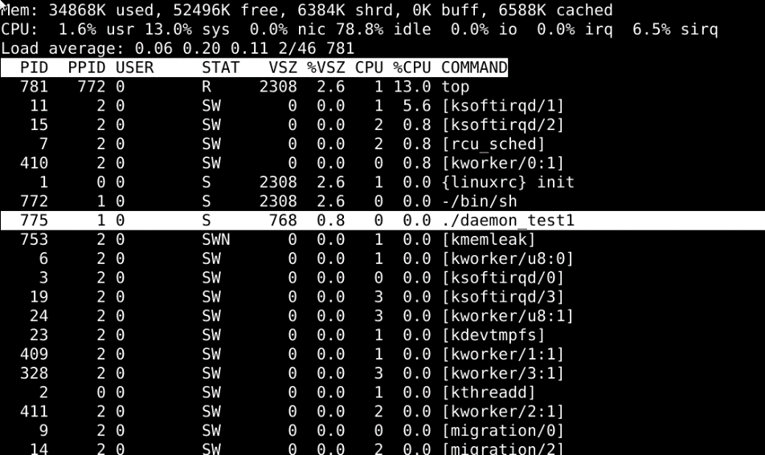
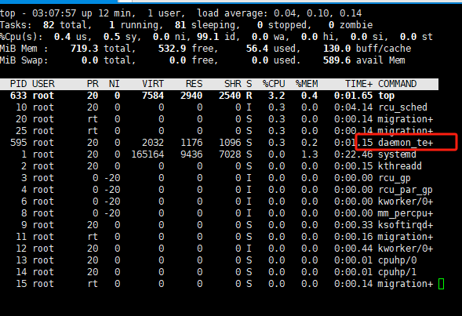
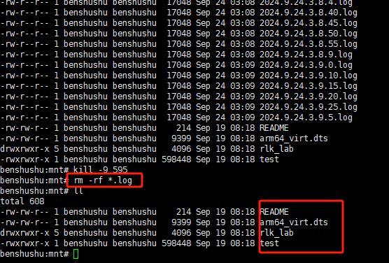
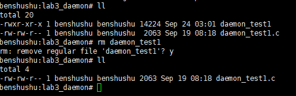

# 实验 8-3：后台守护进程

## 1．实验目的

​		通过本实验了解和熟悉 Linux 是如何创建和使用后台守护进程的。

## 2．实验要求

​		1）写一个用户程序，创建一个守护进程。

​		2）该守护进程每隔 5 秒去查看当前内核的日志中是否有 oops 错误。

## 3．实验步骤

## 下面是本实验的实验步骤。

### 启动 QEMU+runninglinuxkernel。

```shell
$ ./run_rlk_arm64.sh run
```

### 进入本实验的参考代码。

```shell
# cd /mnt/rlk_lab/rlk_basic/chapter_8_process/lab3_daemon
```



### 编译测试程序。

```
benshushu:lab3_daemon# gcc daemon_test1.c -o daemon_test1
```



### 运行 daemon_test1 程序。

```
# ./daemon_test1
```

```
cd /mnt/
```





​		在 mnt 目录可以看到“2021.2.16*.log”文件。打开这些 log 文件，可以看到的内容是内核的 dmesg 的日志。



​		另外我们通过 top 命令可以看到 daemon_test1 进程，进程 PID 为 775。





## 4．实验代码

```C
#include <stdio.h>
#include <unistd.h>
#include <stdlib.h>
#include <time.h>
#include <fcntl.h>
#include <string.h>
#include <sys/stat.h>
#include <sys/klog.h>

#define FALLBACK_KLOG_BUF_SHIFT 17 /* CONFIG_LOG_BUF_SHIFT in kernel */
#define FALLBACK_KLOG_BUF_LEN (1 << FALLBACK_KLOG_BUF_SHIFT)

#define KLOG_CLOSE 0
#define KLOG_OPEN 1
#define KLOG_READ 2
#define KLOG_READ_ALL 3
#define KLOG_READ_CLEAR 4
#define KLOG_CLEAR 5
#define KLOG_CONSOLE_OFF 6
#define KLOG_CONSOLE_ON 7
#define KLOG_CONSOLE_LEVEL 8
#define KLOG_SIZE_UNREAD 9
#define KLOG_SIZE_BUFFER 10

/* we use 'Linux version' string instead of Oops in this lab */
// #define OOPS_LOG "Oops"
#define OOPS_LOG "Linux version"

int save_kernel_log(char *buffer)
{
    char path[128];
    time_t t;
    struct tm *tm;
    int fd;

    t = time(0);
    tm = localtime(&t);

    snprintf(path, 128, "/mnt/%d.%d.%d.%d.%d.%d.log", tm->tm_year + 1900,
             tm->tm_mon + 1, tm->tm_mday, tm->tm_hour,
             tm->tm_min, tm->tm_sec);
    printf("%s\n", path);

    fd = open(path, O_WRONLY | O_CREAT, 0644);
    if (fd == -1) {
        printf("open error\n");
        return -1;
    }
    write(fd, buffer, strlen(buffer));
    close(fd);

    return 0;
}

int check_kernel_log()
{
    char *buffer;
    char *p;
    ssize_t klog_size;
    int ret = -1;
    int size;

    printf("start kernel log\n");

    klog_size = klogctl(KLOG_SIZE_BUFFER, 0, 0);
    if (klog_size <= 0) {
        klog_size = FALLBACK_KLOG_BUF_LEN;
    }

    printf("kernel log size: %d\n", klog_size);

    buffer = malloc(klog_size + 1);
    if (!buffer)
        return -1;

    size = klogctl(KLOG_READ_ALL, buffer, klog_size);
    if (size < 0) {
        printf("klogctl read error\n");
        goto done;
    }

    buffer[size] = '\0';

    /* check if oops in klog */
    p = strstr(buffer, OOPS_LOG);
    if (p) {
        printf("we found '%s' on kernel log\n", OOPS_LOG);
        save_kernel_log(buffer);
        ret = 0;
    }
done:
    free(buffer);
    return ret;
}

int main(void)
{
    if (daemon(0, 0) == -1) {
        printf("daemon error");
        return 0;
    }

    while (1) {
        check_kernel_log();
        sleep(5);
    }

    return 0;
}

```

------

### 代码注释及分析

​		该程序用于以守护进程的方式持续检查内核日志中的关键字（如 "Linux version"），并在检测到该关键字时将内核日志保存到一个文件中。日志文件以时间戳命名，保存在 `/mnt/` 目录下。以下是详细的代码注释和分析。

#### 代码内容及注释：

```C
#include <stdio.h>
#include <unistd.h>
#include <stdlib.h>
#include <time.h>
#include <fcntl.h>
#include <string.h>
#include <sys/stat.h>
#include <sys/klog.h>

#define FALLBACK_KLOG_BUF_SHIFT 17   /* 配置日志缓冲区大小的移位值 */
#define FALLBACK_KLOG_BUF_LEN (1 << FALLBACK_KLOG_BUF_SHIFT)  /* 日志缓冲区的默认大小 */

/* klogctl 系统调用的不同操作选项 */
#define KLOG_CLOSE 0
#define KLOG_OPEN 1
#define KLOG_READ 2
#define KLOG_READ_ALL 3
#define KLOG_READ_CLEAR 4
#define KLOG_CLEAR 5
#define KLOG_CONSOLE_OFF 6
#define KLOG_CONSOLE_ON 7
#define KLOG_CONSOLE_LEVEL 8
#define KLOG_SIZE_UNREAD 9
#define KLOG_SIZE_BUFFER 10

/* 我们在该实验中使用 'Linux version' 作为日志检查关键字 */
#define OOPS_LOG "Linux version"  

/**
 * save_kernel_log - 保存内核日志到文件
 * @buffer: 要保存的日志内容
 *
 * 该函数将当前时间作为文件名，生成一个文件并将日志内容保存到该文件中。
 * 文件保存在 `/mnt/` 目录下，文件名格式为 `年.月.日.时.分.秒.log`。
 */
int save_kernel_log(char *buffer)
{
    char path[128];  // 用于存储文件路径
    time_t t;
    struct tm *tm;
    int fd;

    // 获取当前时间，并将其格式化为本地时间
    t = time(0);
    tm = localtime(&t);

    // 生成日志文件路径和名称
    snprintf(path, 128, "/mnt/%d.%d.%d.%d.%d.%d.log", tm->tm_year + 1900,
             tm->tm_mon + 1, tm->tm_mday, tm->tm_hour,
             tm->tm_min, tm->tm_sec);
    printf("%s\n", path);

    // 打开文件，如果文件不存在则创建它
    fd = open(path, O_WRONLY | O_CREAT, 0644);
    if (fd == -1) {
        printf("open error\n");  // 文件打开失败
        return -1;
    }

    // 将内核日志写入文件
    write(fd, buffer, strlen(buffer));
    close(fd);  // 关闭文件

    return 0;  // 返回 0 表示成功
}

/**
 * check_kernel_log - 检查内核日志中是否有指定的关键字
 *
 * 该函数通过 `klogctl` 获取内核日志缓冲区的大小，并读取所有日志内容。
 * 它会检查日志中是否包含指定的关键字（OOPS_LOG），如果找到该关键字，
 * 它将调用 `save_kernel_log` 将日志保存到文件中。
 */
int check_kernel_log()
{
    char *buffer;  // 用于存储日志内容
    char *p;       // 用于指向日志中的关键字位置
    ssize_t klog_size;  // 日志缓冲区的大小
    int ret = -1;
    int size;

    printf("start kernel log\n");

    // 获取内核日志缓冲区的大小
    klog_size = klogctl(KLOG_SIZE_BUFFER, 0, 0);
    if (klog_size <= 0) {
        klog_size = FALLBACK_KLOG_BUF_LEN;  // 使用默认大小作为回退
    }

    printf("kernel log size: %d\n", klog_size);

    // 为日志内容分配内存
    buffer = malloc(klog_size + 1);
    if (!buffer)
        return -1;

    // 读取内核日志的所有内容
    size = klogctl(KLOG_READ_ALL, buffer, klog_size);
    if (size < 0) {
        printf("klogctl read error\n");
        goto done;  // 读取失败，跳转到清理部分
    }

    buffer[size] = '\0';  // 确保读取的数据是以空字符结尾的字符串

    // 检查日志中是否包含指定的关键字
    p = strstr(buffer, OOPS_LOG);
    if (p) {
        printf("we found '%s' on kernel log\n", OOPS_LOG);
        save_kernel_log(buffer);  // 找到关键字，保存日志
        ret = 0;
    }
done:
    free(buffer);  // 释放分配的内存
    return ret;    // 返回结果
}

/**
 * main - 程序的主入口
 *
 * 该函数通过调用 `daemon` 将程序转换为守护进程，
 * 然后进入一个无限循环，每隔 5 秒调用 `check_kernel_log` 检查内核日志。
 */
int main(void)
{
    // 将程序转换为守护进程，关闭所有标准输入输出
    if (daemon(0, 0) == -1) {
        printf("daemon error");
        return 0;
    }

    // 守护进程的主循环，每 5 秒检查一次内核日志
    while (1) {
        check_kernel_log();  // 检查内核日志
        sleep(5);            // 休眠 5 秒
    }

    return 0;
}
```

#### 分析过程：

1. **日志缓冲区大小的获取**：
   - 函数 `check_kernel_log()` 使用 `klogctl(KLOG_SIZE_BUFFER, 0, 0)` 获取当前内核日志缓冲区的大小。如果获取失败或返回的大小小于等于 0，程序使用默认的日志缓冲区大小（`FALLBACK_KLOG_BUF_LEN`），即 128KB。
2. **日志读取**：
   - 一旦获得了日志缓冲区的大小，程序会分配相应的内存，并使用 `klogctl(KLOG_READ_ALL, buffer, klog_size)` 读取日志缓冲区的全部内容。
3. **关键字检查**：
   - 读取日志后，程序会检查日志中是否包含关键字 `OOPS_LOG`（在该代码中，关键字是 "Linux version"）。如果找到该关键字，程序会调用 `save_kernel_log(buffer)` 将日志保存到 `/mnt/` 目录下的文件中。
4. **保存日志**：
   - 在 `save_kernel_log()` 函数中，程序使用当前时间生成文件名，并将日志写入该文件。日志文件的路径格式为 `/mnt/YYYY.MM.DD.HH.MM.SS.log`，其中包含年、月、日、小时、分钟和秒的信息。
5. **守护进程模式**：
   - 主函数 `main()` 中，通过 `daemon(0, 0)` 将程序转换为守护进程，脱离控制终端，后台持续运行。
   - 守护进程进入一个无限循环，每隔 5 秒调用一次 `check_kernel_log()` 检查内核日志。
6. **内核日志获取方式**：
   - `klogctl()` 是一个系统调用，用于与内核日志交互。它可以读取、清除日志缓冲区等操作。程序使用 `KLOG_READ_ALL` 选项来读取所有日志。

#### 运行流程：

1. 守护进程模式启动后，程序每隔 5 秒检查内核日志。
2. 一旦在日志中发现 `OOPS_LOG`（例如 "Linux version"），程序会将整个日志缓冲区保存到 `/mnt/` 目录下。
3. 日志文件的名称是基于当前时间生成的，以避免覆盖旧日志。

### 改进建议：

1. **日志的路径配置**：当前日志路径是硬编码的 `/mnt/`，可以考虑通过配置或命令行参数来灵活指定日志保存的路径。
2. **日志文件大小控制**：当日志非常大时，保存整个日志缓冲区可能会导致文件过大，可以考虑截取关键日志部分。
3. **日志的周期检查**：可以根据需要调整检查日志的间隔时间，当前设置为每 5 秒检查一次日志。


### 实验结束清理

杀死守护进程

```
kill -9 595
```

清理生成的log文件

```
benshushu:mnt# rm -rf *.log
```



清理

```
cd /mnt/rlk_lab/rlk_basic/chapter_8_process/lab3_daemon
rm daemon_test1
```


