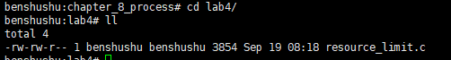
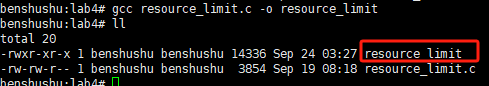
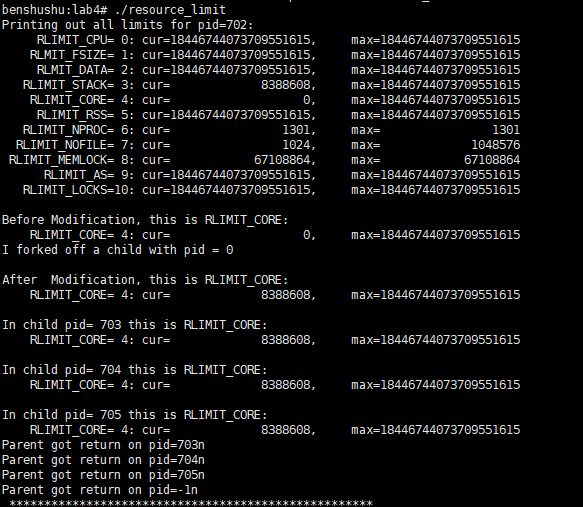
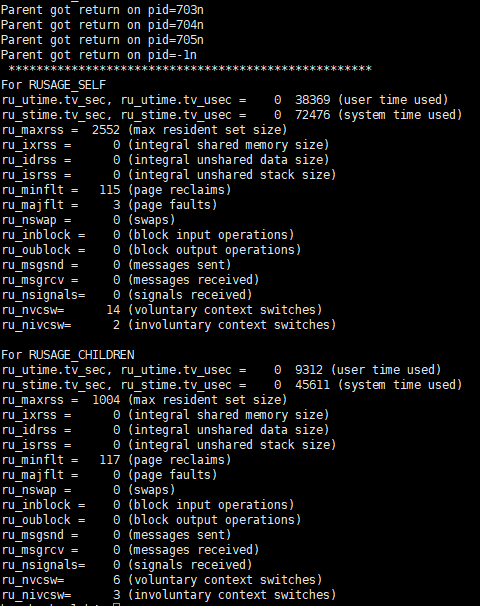

# 实验 8-4：进程权限

## 1．实验目的

了解和熟悉 Linux 是如何进行进程的权限管理的。

## 2．实验要求

写一个用户程序，限制该程序的一些资源，比如进程的最大虚拟内存空间等。

## 3．实验步骤

下面是本实验的实验步骤。

启动 QEMU+runninglinuxkernel。

```shell
$ ./run_rlk_arm64.sh run
```

进入本实验的参考代码。

```shell
cd /mnt/rlk_lab/rlk_basic/chapter_8_process/lab4/
```



编译测试程序。

```shell
benshushu:lab4# gcc resource_limit.c -o resource_limit
```



运行测试程序。

```
benshushu:lab4# ./resource_limit
```






### 运行结果分析

该程序的运行结果展示了系统资源限制的获取、修改以及资源使用统计。以下是对每个输出部分的详细分析。

------

#### 1. **打印系统资源限制**

```
Printing out all limits for pid=702:
     RLIMIT_CPU= 0: cur=18446744073709551615,     max=18446744073709551615
    RLMIT_FSIZE= 1: cur=18446744073709551615,     max=18446744073709551615
     RLMIT_DATA= 2: cur=18446744073709551615,     max=18446744073709551615
   RLIMIT_STACK= 3: cur=             8388608,     max=18446744073709551615
    RLIMIT_CORE= 4: cur=                   0,     max=18446744073709551615
     RLIMIT_RSS= 5: cur=18446744073709551615,     max=18446744073709551615
   RLIMIT_NPROC= 6: cur=                1301,     max=                1301
  RLIMIT_NOFILE= 7: cur=                1024,     max=             1048576
 RLIMIT_MEMLOCK= 8: cur=            67108864,     max=            67108864
      RLIMIT_AS= 9: cur=18446744073709551615,     max=18446744073709551615
   RLIMIT_LOCKS=10: cur=18446744073709551615,     max=18446744073709551615
```

- 该部分输出打印了当前进程（PID 702）的资源限制：
  - **RLIMIT_CPU**: CPU 时间限制为无穷大，表示没有限制。
  - **RLIMIT_FSIZE**: 文件大小限制为无穷大。
  - **RLIMIT_DATA**: 数据段大小限制为无穷大。
  - **RLIMIT_STACK**: 堆栈大小限制为 8388608 字节（8MB）。
  - **RLIMIT_CORE**: 核心转储文件大小限制为 0，表示核心转储被禁用。
  - **RLIMIT_RSS**: 常驻集大小限制为无穷大。
  - **RLIMIT_NPROC**: 最大进程数为 1301。
  - **RLIMIT_NOFILE**: 打开文件数限制为 1024，最大为 1048576。
  - **RLIMIT_MEMLOCK**: 锁定内存大小限制为 67108864 字节（64MB）。
  - **RLIMIT_AS**: 地址空间限制为无穷大。
  - **RLIMIT_LOCKS**: 文件锁定限制为无穷大。

------

#### 2. **修改核心转储文件大小限制**

```
Before Modification, this is RLIMIT_CORE:
    RLIMIT_CORE= 4: cur=                   0,     max=18446744073709551615
I forked off a child with pid = 0

After  Modification, this is RLIMIT_CORE:
    RLIMIT_CORE= 4: cur=             8388608,     max=18446744073709551615
```

- **修改前**：
  - **RLIMIT_CORE**: 核心转储文件的大小限制为 0，表示不生成核心转储文件。
- **修改后**：
  - **RLIMIT_CORE**: 核心转储文件的大小限制被修改为 8388608 字节（8MB）。

------

#### 3. **子进程打印核心转储文件限制**

```
In child pid= 703 this is RLIMIT_CORE:
    RLIMIT_CORE= 4: cur=             8388608,     max=18446744073709551615

In child pid= 704 this is RLIMIT_CORE:
    RLIMIT_CORE= 4: cur=             8388608,     max=18446744073709551615

In child pid= 705 this is RLIMIT_CORE:
    RLIMIT_CORE= 4: cur=             8388608,     max=18446744073709551615
```

- 每个子进程继承了父进程的资源限制，所以它们的 **RLIMIT_CORE** 限制均被设置为 8MB。每个子进程（PID 703、704、705）都打印了相同的核心转储文件限制。

------

#### 4. **父进程等待子进程结束**

```
Parent got return on pid=703n
Parent got return on pid=704n
Parent got return on pid=705n
Parent got return on pid=-1n
```

- 父进程通过 `wait()` 函数等待每个子进程结束，并打印每个子进程的 PID。当所有子进程都结束后，`wait()` 返回 -1 表示没有更多的子进程可等待。

------

#### 5. **父进程的资源使用情况**

```
For RUSAGE_SELF
ru_utime.tv_sec, ru_utime.tv_usec =    0  38369 (user time used)
ru_stime.tv_sec, ru_stime.tv_usec =    0  72476 (system time used)
ru_maxrss =  2552 (max resident set size)
ru_ixrss =      0 (integral shared memory size)
ru_idrss =      0 (integral unshared data size)
ru_isrss =      0 (integral unshared stack size)
ru_minflt =   115 (page reclaims)
ru_majflt =     3 (page faults)
ru_nswap =      0 (swaps)
ru_inblock =    0 (block input operations)
ru_oublock =    0 (block output operations)
ru_msgsnd =     0 (messages sent)
ru_msgrcv =     0 (messages received)
ru_nsignals=    0 (signals received)
ru_nvcsw=      14 (voluntary context switches)
ru_nivcsw=      2 (involuntary context switches)
```

- 父进程的资源使用情况：
  - **用户时间**: 38369 微秒的用户态 CPU 时间。
  - **系统时间**: 72476 微秒的内核态 CPU 时间。
  - **最大常驻集大小**: 父进程最大内存使用量为 2552 KB。
  - 页面错误:
    - **115** 次次级页面错误（page reclaims），即没有导致磁盘 I/O 的页面错误。
    - **3** 次主页面错误（page faults），即导致了磁盘 I/O 的页面错误。
  - **自愿上下文切换**: 14 次。
  - **非自愿上下文切换**: 2 次。

------

#### 6. **子进程的资源使用情况**

```
For RUSAGE_CHILDREN
ru_utime.tv_sec, ru_utime.tv_usec =    0  9312 (user time used)
ru_stime.tv_sec, ru_stime.tv_usec =    0  45611 (system time used)
ru_maxrss =  1004 (max resident set size)
ru_ixrss =      0 (integral shared memory size)
ru_idrss =      0 (integral unshared data size)
ru_isrss =      0 (integral unshared stack size)
ru_minflt =   117 (page reclaims)
ru_majflt =     0 (page faults)
ru_nswap =      0 (swaps)
ru_inblock =    0 (block input operations)
ru_oublock =    0 (block output operations)
ru_msgsnd =     0 (messages sent)
ru_msgrcv =     0 (messages received)
ru_nsignals=    0 (signals received)
ru_nvcsw=       6 (voluntary context switches)
ru_nivcsw=      3 (involuntary context switches)
```

- 子进程的资源使用情况

  （所有子进程的总和）：

  - **用户时间**: 9312 微秒的用户态 CPU 时间。
  - **系统时间**: 45611 微秒的内核态 CPU 时间。
  - **最大常驻集大小**: 1004 KB。
  - **页面错误**: 117 次次级页面错误，0 次主页面错误。
  - **自愿上下文切换**: 6 次。
  - **非自愿上下文切换**: 3 次。

------

#### 结论

- 该程序演示了如何使用 `getrlimit` 和 `setrlimit` 获取和修改系统资源限制。
- 修改了核心转储文件大小的限制（`RLIMIT_CORE`）为 8MB，并在子进程中继承该限制。
- 父进程通过 `wait()` 等待所有子进程结束，并使用 `getrusage()` 获取并打印父进程及子进程的资源使用情况。

## 4．实验参考代码

```C
#include <sys/time.h>
#include <sys/resource.h>
#include <unistd.h>
#include <stdlib.h>
#include <stdio.h>
#include <sys/wait.h>
#include <errno.h>

#define DEATH(mess) { perror(mess); exit(errno); }

void do_limit(int limit, const char *limit_string, struct rlimit *rlim)
{
    if (getrlimit(limit, rlim))
        fprintf(stderr, "Failed in getrlimit\n");
    printf("%15s=%2d: cur=%20lu, max=%20lu\n", limit_string,
           limit, rlim->rlim_cur, rlim->rlim_max);
}

void print_limits(void)
{
    struct rlimit rlim;
    do_limit(RLIMIT_CPU, "RLIMIT_CPU", &rlim);
    do_limit(RLIMIT_FSIZE, "RLMIT_FSIZE", &rlim);
    do_limit(RLIMIT_DATA, "RLMIT_DATA", &rlim);
    do_limit(RLIMIT_STACK, "RLIMIT_STACK", &rlim);
    do_limit(RLIMIT_CORE, "RLIMIT_CORE", &rlim);
    do_limit(RLIMIT_RSS, "RLIMIT_RSS", &rlim);
    do_limit(RLIMIT_NPROC, "RLIMIT_NPROC", &rlim);
    do_limit(RLIMIT_NOFILE, "RLIMIT_NOFILE", &rlim);
    do_limit(RLIMIT_MEMLOCK, "RLIMIT_MEMLOCK", &rlim);
    do_limit(RLIMIT_AS, "RLIMIT_AS", &rlim);
    do_limit(RLIMIT_LOCKS, "RLIMIT_LOCKS", &rlim);
}

void print_rusage(int who)
{
    struct rusage usage;
    if (getrusage(who, &usage))
        DEATH("getrusage failed");

    if (who == RUSAGE_SELF)
        printf("For RUSAGE_SELF\n");
    if (who == RUSAGE_CHILDREN)
        printf("\nFor RUSAGE_CHILDREN\n");

    printf("ru_utime.tv_sec, ru_utime.tv_usec = %4d %4d (user time used)\n",
           (int)usage.ru_utime.tv_sec, (int)usage.ru_utime.tv_usec);
    printf("ru_stime.tv_sec, ru_stime.tv_usec = %4d %4d (system time used)\n",
           (int)usage.ru_stime.tv_sec, (int)usage.ru_stime.tv_usec);
    printf("ru_maxrss = %4ld (max resident set size)\n", usage.ru_maxrss);
    printf("ru_ixrss = %4ld (integral shared memory size)\n", usage.ru_ixrss);
    printf("ru_idrss = %4ld (integral unshared data size)\n", usage.ru_idrss);
    printf("ru_isrss = %4ld (integral unshared stack size)\n", usage.ru_isrss);
    printf("ru_minflt = %4ld (page reclaims)\n", usage.ru_minflt);
    printf("ru_majflt = %4ld (page faults)\n", usage.ru_majflt);
    printf("ru_nswap = %4ld (swaps)\n", usage.ru_nswap);
    printf("ru_inblock = %4ld (block input operations)\n", usage.ru_inblock);
    printf("ru_oublock = %4ld (block output operations)\n", usage.ru_oublock);
    printf("ru_msgsnd = %4ld (messages sent)\n", usage.ru_msgsnd);
    printf("ru_msgrcv = %4ld (messages received)\n", usage.ru_msgrcv);
    printf("ru_nsignals= %4ld (signals received)\n", usage.ru_nsignals);
    printf("ru_nvcsw= %4ld (voluntary context switches)\n", usage.ru_nvcsw);
    printf("ru_nivcsw= %4ld (involuntary context switches)\n", usage.ru_nivcsw);
}

int main(int argc, char *argv[])
{
    struct rlimit rlim;
    pid_t pid = 0;
    int status = 0, nchildren = 3, i;

    /* Print out all limits */
    printf("Printing out all limits for pid=%d:\n", getpid());
    print_limits();

    /* change and printout the limit for core file size */
    printf("\nBefore Modification, this is RLIMIT_CORE:\n");
    do_limit(RLIMIT_CORE, "RLIMIT_CORE", &rlim);
    rlim.rlim_cur = 8 * 1024 * 1024;
    printf("I forked off a child with pid = %d\n", (int)pid);

    setrlimit(RLIMIT_CORE, &rlim);
    printf("\nAfter Modification, this is RLIMIT_CORE:\n");
    do_limit(RLIMIT_CORE, "RLIMIT_CORE", &rlim);

    /* fork off the nchildren */
    fflush(stdout);
    for (i = 0; i < nchildren; i++) {
        pid = fork();
        if (pid < 0)
            DEATH("Failed in fork");
        if (pid == 0) { /* any child */
            printf("\nIn child pid= %d this is RLIMIT_CORE:\n", (int)getpid());
            do_limit(RLIMIT_CORE, "RLIMIT_CORE", &rlim);
            fflush(stdout);
            sleep(3);
            exit(EXIT_SUCCESS);
        }
    }

    while (pid > 0) { /* parent */
        pid = wait(&status);
        printf("Parent got return on pid=%dn\n", (int)pid);
    }

    printf(" **************************************************** \n");
    print_rusage(RUSAGE_SELF);
    print_rusage(RUSAGE_CHILDREN);

    exit(EXIT_SUCCESS);
}

```

------

### 代码分析及详细注释

该程序主要演示了如何使用 `getrlimit` 和 `setrlimit` 系统调用来获取和设置系统资源限制，并通过 `getrusage` 获取资源使用情况。该程序首先打印出当前进程的各种系统资源限制，然后创建多个子进程，并在子进程中修改和打印资源限制。最后，父进程会等待所有子进程结束并打印出它们的资源使用情况。

#### 代码功能

1. **获取和打印系统资源限制**： 使用 `getrlimit` 函数获取进程的资源限制，比如 CPU 时间、文件大小、堆栈大小等，并通过 `print_limits` 和 `do_limit` 函数打印出来。
2. **修改核心转储文件大小限制**： 修改核心文件大小的限制 (`RLIMIT_CORE`)，并再次打印该限制。
3. **创建子进程**： 使用 `fork()` 创建多个子进程，并在子进程中打印修改后的资源限制。
4. **等待子进程结束**： 父进程使用 `wait()` 等待子进程结束，并打印子进程的资源使用情况。

#### 代码注释

```C
#include <sys/time.h>
#include <sys/resource.h>
#include <unistd.h>
#include <stdlib.h>
#include <stdio.h>
#include <sys/wait.h>
#include <errno.h>

#define DEATH(mess) { perror(mess); exit(errno); }  // 错误处理宏：输出错误信息并退出程序

/**
 * do_limit - 获取并打印指定系统资源的限制
 * @limit: 要查询的资源限制标识符 (如 RLIMIT_CPU)
 * @limit_string: 资源的名称字符串 (如 "RLIMIT_CPU")
 * @rlim: 存储资源限制信息的结构体指针
 *
 * 该函数调用 getrlimit 获取当前进程的资源限制并打印出来。
 */
void do_limit(int limit, const char *limit_string, struct rlimit *rlim)
{
    if (getrlimit(limit, rlim))  // 获取资源限制
        fprintf(stderr, "Failed in getrlimit\n");
    printf("%15s=%2d: cur=%20lu, max=%20lu\n", limit_string,
           limit, rlim->rlim_cur, rlim->rlim_max);  // 打印当前和最大限制值
}

/**
 * print_limits - 打印当前进程的所有主要资源限制
 *
 * 该函数调用 do_limit 打印所有感兴趣的资源限制。
 */
void print_limits(void)
{
    struct rlimit rlim;
    do_limit(RLIMIT_CPU, "RLIMIT_CPU", &rlim);
    do_limit(RLIMIT_FSIZE, "RLMIT_FSIZE", &rlim);
    do_limit(RLIMIT_DATA, "RLMIT_DATA", &rlim);
    do_limit(RLIMIT_STACK, "RLIMIT_STACK", &rlim);
    do_limit(RLIMIT_CORE, "RLIMIT_CORE", &rlim);
    do_limit(RLIMIT_RSS, "RLIMIT_RSS", &rlim);
    do_limit(RLIMIT_NPROC, "RLIMIT_NPROC", &rlim);
    do_limit(RLIMIT_NOFILE, "RLIMIT_NOFILE", &rlim);
    do_limit(RLIMIT_MEMLOCK, "RLIMIT_MEMLOCK", &rlim);
    do_limit(RLIMIT_AS, "RLIMIT_AS", &rlim);
    do_limit(RLIMIT_LOCKS, "RLIMIT_LOCKS", &rlim);
}

/**
 * print_rusage - 打印资源使用信息
 * @who: 要获取资源使用信息的进程标识符 (RUSAGE_SELF 或 RUSAGE_CHILDREN)
 *
 * 该函数调用 getrusage 获取当前进程或其子进程的资源使用信息，并打印出来。
 */
void print_rusage(int who)
{
    struct rusage usage;
    if (getrusage(who, &usage))  // 获取资源使用信息
        DEATH("getrusage failed");

    if (who == RUSAGE_SELF)
        printf("For RUSAGE_SELF\n");
    if (who == RUSAGE_CHILDREN)
        printf("\nFor RUSAGE_CHILDREN\n");

    // 打印资源使用的详细信息
    printf("ru_utime.tv_sec, ru_utime.tv_usec = %4d %4d (user time used)\n",
           (int)usage.ru_utime.tv_sec, (int)usage.ru_utime.tv_usec);
    printf("ru_stime.tv_sec, ru_stime.tv_usec = %4d %4d (system time used)\n",
           (int)usage.ru_stime.tv_sec, (int)usage.ru_stime.tv_usec);
    printf("ru_maxrss = %4ld (max resident set size)\n", usage.ru_maxrss);
    printf("ru_ixrss = %4ld (integral shared memory size)\n", usage.ru_ixrss);
    printf("ru_idrss = %4ld (integral unshared data size)\n", usage.ru_idrss);
    printf("ru_isrss = %4ld (integral unshared stack size)\n", usage.ru_isrss);
    printf("ru_minflt = %4ld (page reclaims)\n", usage.ru_minflt);
    printf("ru_majflt = %4ld (page faults)\n", usage.ru_majflt);
    printf("ru_nswap = %4ld (swaps)\n", usage.ru_nswap);
    printf("ru_inblock = %4ld (block input operations)\n", usage.ru_inblock);
    printf("ru_oublock = %4ld (block output operations)\n", usage.ru_oublock);
    printf("ru_msgsnd = %4ld (messages sent)\n", usage.ru_msgsnd);
    printf("ru_msgrcv = %4ld (messages received)\n", usage.ru_msgrcv);
    printf("ru_nsignals= %4ld (signals received)\n", usage.ru_nsignals);
    printf("ru_nvcsw= %4ld (voluntary context switches)\n", usage.ru_nvcsw);
    printf("ru_nivcsw= %4ld (involuntary context switches)\n", usage.ru_nivcsw);
}

/**
 * main - 程序主入口
 *
 * 该函数首先打印当前进程的系统资源限制，然后修改核心文件大小限制，之后创建多个子进程，子进程会继承并打印修改后的限制。最后，父进程等待所有子进程结束并打印出其资源使用情况。
 */
int main(int argc, char *argv[])
{
    struct rlimit rlim;
    pid_t pid = 0;
    int status = 0, nchildren = 3, i;

    /* 打印当前进程的所有资源限制 */
    printf("Printing out all limits for pid=%d:\n", getpid());
    print_limits();

    /* 修改核心转储文件的大小限制并打印修改前后的值 */
    printf("\nBefore Modification, this is RLIMIT_CORE:\n");
    do_limit(RLIMIT_CORE, "RLIMIT_CORE", &rlim);
    rlim.rlim_cur = 8 * 1024 * 1024;  // 将核心转储文件的限制设置为 8MB
    setrlimit(RLIMIT_CORE, &rlim);    // 应用新的限制
    printf("\nAfter Modification, this is RLIMIT_CORE:\n");
    do_limit(RLIMIT_CORE, "RLIMIT_CORE", &rlim);

    /* 创建多个子进程 */
    fflush(stdout);
    for (i = 0; i < nchildren; i++) {
        pid = fork();  // 创建子进程
        if (pid < 0)
            DEATH("Failed in fork");
        if (pid == 0) { /* 子进程代码 */
            printf("\nIn child pid= %d this is RLIMIT_CORE:\n", (int)getpid());
            do_limit(RLIMIT_CORE, "RLIMIT_CORE", &rlim);  // 打印子进程中的 RLIMIT_CORE
            fflush(stdout);
            sleep(3);
            exit(EXIT_SUCCESS);  // 子进程退出
        }
    }

    /* 父进程等待所有子进程结束 */
    while (pid > 0) {
        pid = wait(&status);  // 等待子进程结束
        printf("Parent got return on pid=%dn\n", (int)pid);
    }

    /* 打印父进程和子进程的资源使用情况 */
    printf(" **************************************************** \n");
    print_rusage(RUSAGE_SELF);       // 打印父进程的资源使用情况
    print_rusage(RUSAGE_CHILDREN);   // 打印子进程的资源使用情况

    exit(EXIT_SUCCESS);
}
```

#### 代码分析

1. **`do_limit()` 函数**：
   - 这个函数调用 `getrlimit()` 来获取指定资源的当前限制值 (`cur`) 和最大限制值 (`max`)。并且会将这些限制打印出来。资源的标识符如 `RLIMIT_CPU` 或 `RLIMIT_CORE` 被传递给函数。
2. **`print_limits()` 函数**：
   - 该函数调用 `do_limit()` 来打印所有感兴趣的系统资源限制。这些资源限制包括 CPU 时间、文件大小、数据段大小、堆栈大小、核心文件大小等。
3. **`print_rusage()` 函数**：
   - 这个函数使用 `getrusage()` 获取资源使用情况，如用户时间、系统时间、页面错误、内存使用等。它支持获取当前进程的资源使用情况 (`RUSAGE_SELF`) 或子进程的资源使用情况 (`RUSAGE_CHILDREN`)。
4. **核心文件大小限制的修改**：
   - 在主进程中，修改了核心转储文件的大小限制（`RLIMIT_CORE`）为 8MB。修改之前和之后的限制值都会打印出来。
5. **创建子进程**：
   - 使用 `fork()` 创建多个子进程。每个子进程都会继承父进程的资源限制，并打印出修改后的核心转储文件大小限制。子进程在睡眠 3 秒后退出。
6. **等待子进程结束**：
   - 父进程使用 `wait()` 等待所有子进程结束，并在每个子进程退出后打印子进程的 PID。
7. **资源使用统计**：
   - 最后，程序会打印出父进程和所有子进程的资源使用情况，包括用户时间、系统时间、页面错误等信息。

#### 运行结果

1. 程序会先打印当前进程的各种资源限制。
2. 修改核心转储文件大小的限制为 8MB，并显示修改前后的值。
3. 创建多个子进程，每个子进程都会继承并打印出修改后的核心文件大小限制。
4. 父进程等待所有子进程结束，并打印出父进程和子进程的资源使用情况。

#### 改进建议

1. **动态配置限制值**：可以通过命令行参数传递需要修改的资源限制，而不是硬编码。
2. **更多的资源监控**：程序可以扩展以监控更多类型的资源限制或资源使用情况。

------

