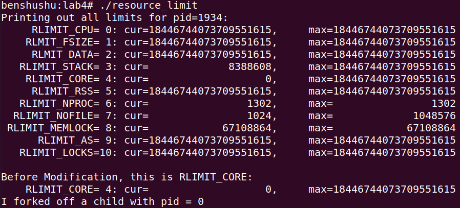

# 实验 8-4：进程权限

## 1．实验目的

了解和熟悉 Linux 是如何进行进程的权限管理的。

## 2．实验要求

写一个用户程序，限制该程序的一些资源，比如进程的最大虚拟内存空间等。

## 3．实验步骤

下面是本实验的实验步骤。

启动 QEMU+runninglinuxkernel。

```
$ ./run_rlk_arm64.sh run
```

进入本实验的参考代码。

```
# /mnt/rlk_lab/rlk_basic/chapter_8_process/lab4
```

编译测试程序。

```
benshushu:lab4# gcc resource_limit.c -o resource_limit
```

运行测试程序。

```
benshushu:lab4# ./resource_limit
```



## 4．实验参考代码

```
1 #include <sys/time.h>
2 #include <sys/resource.h>
3 #include <unistd.h>
4 #include <stdlib.h>
5 #include <stdio.h>
6 #include <sys/wait.h>
7 #include <errno.h>
8 
9 #define DEATH(mess) { perror(mess); exit(errno); }
10 
11 void do_limit(int limit, const char *limit_string, struct rlimit *rlim)
12 {
13 if (getrlimit(limit, rlim))
14 fprintf(stderr, "Failed in getrlimit\n");
15 printf("%15s=%2d: cur=%20lu, max=%20lu\n", limit_string,
16 limit, rlim->rlim_cur, rlim->rlim_max);
17 }
18 
19 void print_limits(void)
20 {
21 struct rlimit rlim;
22 do_limit(RLIMIT_CPU, "RLIMIT_CPU", &rlim);
23 do_limit(RLIMIT_FSIZE, "RLMIT_FSIZE", &rlim);
24 do_limit(RLIMIT_DATA, "RLMIT_DATA", &rlim);
25 do_limit(RLIMIT_STACK, "RLIMIT_STACK", &rlim);
26 do_limit(RLIMIT_CORE, "RLIMIT_CORE", &rlim);
27 do_limit(RLIMIT_RSS, "RLIMIT_RSS", &rlim);
28 do_limit(RLIMIT_NPROC, "RLIMIT_NPROC", &rlim);
29 do_limit(RLIMIT_NOFILE, "RLIMIT_NOFILE", &rlim);
30 do_limit(RLIMIT_MEMLOCK, "RLIMIT_MEMLOCK", &rlim);
31 do_limit(RLIMIT_AS, "RLIMIT_AS", &rlim);
32 do_limit(RLIMIT_LOCKS, "RLIMIT_LOCKS", &rlim);
33 }
34 
35 void print_rusage(int who)
36 {
37 struct rusage usage;
38 if (getrusage(who, &usage))
39 DEATH("getrusage failed");
40 
41 if (who == RUSAGE_SELF)
42 printf("For RUSAGE_SELF\n");
43 if (who == RUSAGE_CHILDREN)
44 printf("\nFor RUSAGE_CHILDREN\n");
45 
46 printf
47 ("ru_utime.tv_sec, ru_utime.tv_usec = %4d %4d (user time used)\n",
48 (int)usage.ru_utime.tv_sec, (int)usage.ru_utime.tv_usec);
49 printf
50 ("ru_stime.tv_sec, ru_stime.tv_usec = %4d %4d (system time 
used)\n",
51 (int)usage.ru_stime.tv_sec, (int)usage.ru_stime.tv_usec);
52 printf("ru_maxrss = %4ld (max resident set size)\n", usage.ru_maxrss);
53 printf("ru_ixrss = %4ld (integral shared memory size)\n",
54 usage.ru_ixrss);
55 printf("ru_idrss = %4ld (integral unshared data size)\n",
56 usage.ru_idrss);
57 printf("ru_isrss = %4ld (integral unshared stack size)\n",
58 usage.ru_isrss);
59 printf("ru_minflt = %4ld (page reclaims)\n", usage.ru_minflt);
60 printf("ru_majflt = %4ld (page faults)\n", usage.ru_majflt);
61 printf("ru_nswap = %4ld (swaps)\n", usage.ru_nswap);
62 printf("ru_inblock = %4ld (block input operations)\n",
63 usage.ru_inblock);
64 printf("ru_oublock = %4ld (block output operations)\n",
65 usage.ru_oublock);
66 printf("ru_msgsnd = %4ld (messages sent)\n", usage.ru_msgsnd);
67 printf("ru_msgrcv = %4ld (messages received)\n", usage.ru_msgrcv);
68 printf("ru_nsignals= %4ld (signals received)\n", usage.ru_nsignals);
69 printf("ru_nvcsw= %4ld (voluntary context switches)\n",
70 usage.ru_nvcsw);
71 printf("ru_nivcsw= %4ld (involuntary context switches)\n",
72 usage.ru_nivcsw);
73 }
74 
75 int main(int argc, char *argv[])
76 {
77 struct rlimit rlim;
78 pid_t pid = 0;
79 int status = 0, nchildren = 3, i;
80 
81 /* Print out all limits */
82 
83 printf("Printing out all limits for pid=%d:\n", getpid());
84 print_limits();
85 
86 /* change and printout the limit for core file size */
87 
88 printf("\nBefore Modification, this is RLIMIT_CORE:\n");
89 do_limit(RLIMIT_CORE, "RLIMIT_CORE", &rlim);
90 rlim.rlim_cur = 8 * 1024 * 1024;
91 printf("I forked off a child with pid = %d\n", (int)pid);
92 
93 setrlimit(RLIMIT_CORE, &rlim);
94 printf("\nAfter Modification, this is RLIMIT_CORE:\n");
95 do_limit(RLIMIT_CORE, "RLIMIT_CORE", &rlim);
96 
97 /* fork off the nchildren */
98 
99 fflush(stdout);
100 for (i = 0; i < nchildren; i++) {
101 pid = fork();
102 if (pid < 0)
103 DEATH("Failed in fork");
104 if (pid == 0) { /* any child */
105 printf("\nIn child pid= %d this is RLIMIT_CORE:\n",
106 (int)getpid());
107 do_limit(RLIMIT_CORE, "RLIMIT_CORE", &rlim);
108 fflush(stdout);
109 sleep(3);
110 exit(EXIT_SUCCESS);
111 }
112 }
113
114 while (pid > 0) { /* parent */
115 pid = wait(&status);
116 printf("Parent got return on pid=%dn\n", (int)pid);
117 }
118
119 printf(" **************************************************** \n");
120 print_rusage(RUSAGE_SELF);
121 print_rusage(RUSAGE_CHILDREN);
122
123 exit(EXIT_SUCCESS);
124}
```

