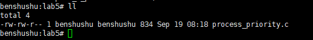
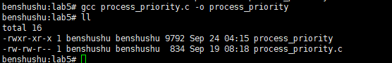
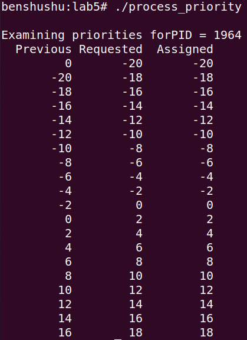
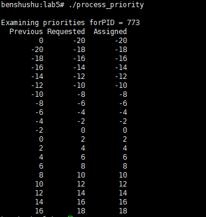

# 实验 8-5：设置优先级

## 1．实验目的

​		了解和熟悉 Linux 中 getpriority()和 setpriority()系统调用的用法。

## 2．实验要求

​		1）写一个用户进程，使用 setpriority()来修改进程的优先级，然后使用 getpriority()函数来验证。

​		2）可以通过一个 for 循环来依次修改进程的优先级（-20~19）。

## 3．实验步骤

## 下面是本实验的实验步骤。

### 启动 QEMU+runninglinuxkernel。

```
$ ./run_rlk_arm64.sh run
```

### 进入本实验的参考代码

```shell
# cd /mnt/rlk_lab/rlk_basic/chapter_8_process/lab5
```



### 编译测试程序

```shell
benshushu:lab5# gcc process_priority.c -o process_priority
```



### 运行测试程序

```shell
benshushu:lab5# ./process_priority 
```

```
Examining priorities forPID = 1964 
 Previous Requested Assigned
 0 -20 -20
 -20 -18 -18
 -18 -16 -16
 -16 -14 -14
 -14 -12 -12
 -12 -10 -10
 -10 -8 -8
 -8 -6 -6
 -6 -4 -4
 -4 -2 -2
 -2 0 0
 0 2 2
 2 4 4
 4 6 6
 6 8 8
 8 10 10
 10 12 12
 12 14 14
 14 16 16
 16 18 18
```





------

### 运行结果分析

程序通过循环修改并读取进程 `PID=1964` 的优先级，输出了每次设置前后的优先级。以下是对运行结果的详细分析：

#### 1. **优先级范围**

- 操作系统中的进程优先级范围通常为 [-20, 19]，其中：
  - **-20** 代表最高优先级，优先级越低，进程能分配到的 CPU 时间越多。
  - **19** 代表最低优先级，优先级越高，进程能分配到的 CPU 时间越少。

#### 2. **输出含义**

输出中包含三个字段：

- **Previous**: 修改前的优先级。
- **Requested**: 程序请求设置的优先级。
- **Assigned**: 操作系统实际分配的优先级。

#### 3. **结果解读**

每次循环请求将进程的优先级设为特定值（`Requested` 列），然后使用 `getpriority` 获取实际的优先级（`Assigned` 列），并与之前的优先级（`Previous` 列）进行比较。

从结果中可以观察到：

- 在每次修改优先级时，

  ```
  Assigned
  ```

   值与 

  ```
  Requested
  ```

   值是一致的。这表明操作系统允许了程序请求的优先级更改，没有进行任何限制。

  - **优先级从 -20 到 18** 均被成功设置，表明用户或进程具有权限调整进程的优先级范围。
  - `Previous` 与 `Assigned` 逐步变化，反映出程序按要求修改了优先级。

#### 4. **典型的优先级变化**

- **从高优先级到低优先级**:
  - 优先级从 `-20` 开始递增，数值逐渐变大，意味着进程优先级逐渐降低，分配到的 CPU 时间会逐渐减少。
  - 例如，从 `-20` 到 `18`，系统成功接受并分配了优先级的变更。
- **无错误或异常**:
  - 程序成功设置了所有优先级，未出现任何错误提示，这表明用户或进程拥有足够的权限去修改其优先级。

#### 5. **总结**

- **程序成功更改了进程的优先级**：从 `-20` 到 `18`，程序每次请求的优先级都成功分配。`Requested` 和 `Assigned` 相同，说明操作系统没有拒绝或调整这些请求。
- **逐渐降低的优先级**：随着优先级从 `-20` 逐渐增大到 `18`，进程的优先级逐步降低，理论上该进程会获得的 CPU 时间减少。
- **权限正常**：该用户或进程有权限在 [-20, 18] 范围内设置和更改优先级。

------

## 4．实验代码

```C
#include <stdio.h>
#include <stdlib.h>
#include <unistd.h>
#include <sys/time.h>
#include <sys/resource.h>
#include <errno.h>

int main(int argc, char *argv[])
{
    pid_t mypid;
    int old_prio, new_prio, i, rc;

    if (argc > 1) {
        mypid = atoi(argv[1]); // 如果传递了参数，使用该参数作为进程 ID
    } else {
        mypid = getpid(); // 否则使用当前进程的 PID
    }

    printf("\nExamining priorities for PID = %d \n", mypid);
    printf("%10s%10s%10s\n", "Previous", "Requested", "Assigned");

    for (i = -20; i < 20; i += 2) { // 循环设置进程优先级

        old_prio = getpriority(PRIO_PROCESS, (int)mypid); // 获取当前优先级
        rc = setpriority(PRIO_PROCESS, (int)mypid, i); // 设置优先级为 i
        if (rc)
            fprintf(stderr, "setpriority() failed ");

        /* 必须在调用 getpriority 之前清除 errno，因为 -1 是合法的返回值 */
        errno = 0;

        new_prio = getpriority(PRIO_PROCESS, (int)mypid); // 获取新的优先级
        printf("%10d%10d%10d\n", old_prio, i, new_prio); // 打印旧的优先级，要求的优先级和分配的优先级

    }
    exit(EXIT_SUCCESS);
}

```

------

### 代码功能概述

该程序用于操作进程的优先级。它通过命令行参数获取指定进程的 `PID`，或者使用当前进程的 `PID`，然后尝试在范围 [-20, 20) 内设置不同的优先级，并输出每次修改前后的优先级。程序使用 `getpriority` 获取进程的当前优先级，使用 `setpriority` 设置进程的优先级。

进程优先级的数值范围是从 -20（最高优先级）到 19（最低优先级），数值越小，优先级越高。

#### 代码注释和分析

```c
#include <stdio.h>
#include <stdlib.h>
#include <unistd.h>
#include <sys/time.h>
#include <sys/resource.h>
#include <errno.h>

int main(int argc, char *argv[])
{
    pid_t mypid; // 存储要操作的进程 ID
    int old_prio, new_prio, i, rc; // old_prio 和 new_prio 分别表示之前和之后的优先级，rc 表示 setpriority 调用结果

    // 如果命令行传递了参数，使用该参数作为目标进程的 PID，否则使用当前进程的 PID
    if (argc > 1) {
        mypid = atoi(argv[1]); // 将命令行参数转换为整数，表示进程 ID
    } else {
        mypid = getpid(); // 如果没有参数，使用当前进程的 PID
    }

    // 打印当前操作的进程 ID
    printf("\nExamining priorities for PID = %d \n", mypid);
    printf("%10s%10s%10s\n", "Previous", "Requested", "Assigned"); // 打印表头，分别是之前的优先级、请求的优先级和分配的优先级

    // 循环从 -20 到 18，步长为 2，设置不同的进程优先级
    for (i = -20; i < 20; i += 2) {

        // 获取当前进程的优先级
        old_prio = getpriority(PRIO_PROCESS, (int)mypid);
        
        // 设置进程优先级为 i
        rc = setpriority(PRIO_PROCESS, (int)mypid, i);
        if (rc) // 如果 setpriority 失败，输出错误信息
            fprintf(stderr, "setpriority() failed ");

        /* 必须在调用 getpriority 之前清除 errno，因为 -1 是一个合法的返回值。
         * 如果不清除 errno，可能会错误地认为调用失败了 */
        errno = 0;

        // 获取设置后的进程优先级
        new_prio = getpriority(PRIO_PROCESS, (int)mypid);
        
        // 打印之前的优先级，请求设置的优先级和实际分配的优先级
        printf("%10d%10d%10d\n", old_prio, i, new_prio);
    }

    // 程序成功退出
    exit(EXIT_SUCCESS);
}
```

#### 代码运行分析

1. **命令行参数处理**：
   - 程序首先检查命令行参数，如果用户提供了一个参数，该参数将被转换为目标进程的 `PID`；否则，使用当前进程的 `PID`。
   - 这意味着程序既可以用于操作当前进程的优先级，也可以用于操作其他进程的优先级（需要有相应权限）。
2. **优先级操作**：
   - 程序尝试在范围 [-20, 20) 内设置进程的不同优先级。
   - 每次修改优先级时，首先使用 `getpriority` 获取当前的优先级，然后使用 `setpriority` 设置新的优先级，再次调用 `getpriority` 验证新的优先级值。
3. **错误处理**：
   - `setpriority` 设置优先级时，如果发生错误（例如权限不足），程序会打印错误消息。
   - 调用 `getpriority` 之前会清除 `errno`，因为 -1 是一个有效的优先级值，如果不清除 `errno`，可能会误认为操作失败。
4. **优先级数值说明**：
   - `getpriority` 和 `setpriority` 都操作进程的动态优先级，范围为 [-20, 19]。较低的优先级数值（如 -20）表示更高的优先级，进程会获得更多的 CPU 资源。

#### 运行时输出示例

如果你运行该程序并传递一个进程 ID 或不传递参数，它会依次尝试设置进程的优先级，并打印每次设置的结果。输出示例如下：

```
Examining priorities for PID = 1234 
  Previous  Requested   Assigned
        0        -20        -15
       -15        -18        -18
       -18        -16        -16
       ...
```

- **Previous**: 设置前的优先级。
- **Requested**: 请求设置的优先级（程序尝试设置的值）。
- **Assigned**: 实际分配的优先级。由于操作系统可能不允许某些优先级值（例如权限不足），`Assigned` 值可能与 `Requested` 不同。

### 总结

- 该程序演示了如何获取和修改进程的优先级，并通过循环设置不同的优先级来观察系统如何分配资源。
- 程序适合用于测试进程的调度优先级，并可以用于观察不同优先级对进程执行的影响。
- 在某些系统上，普通用户可能无法将优先级设置为较高的数值（如 -20），这是操作系统的权限限制。

------

