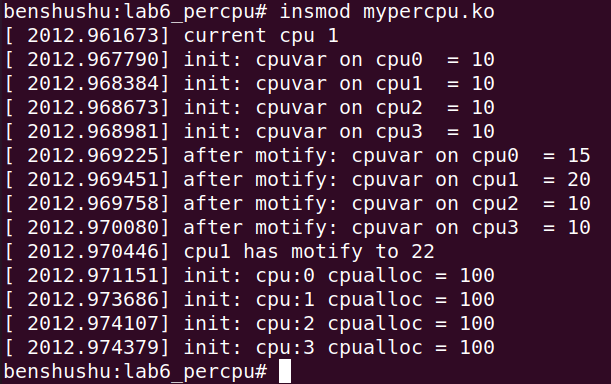
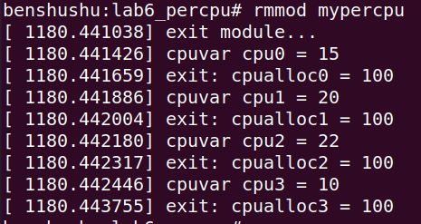

# 实验 8-6：per-cpu 变量

## 1．实验目的

学会 Linux 内核中 per-cpu 变量的用法。

## 2．实验要求

1）写一个简单的内核模块，创建一个 per-cpu 变量，并且初始化该 per-cpu 变量，

修改 per-cpu 变量的值，然后输出这些值。

## 3．实验步骤

下面是本实验的实验步骤。

启动 QEMU+runninglinuxkernel。

```
$ ./run_rlk_arm64.sh run
```

进入本实验的参考代码。

```
# cd /mnt/rlk_lab/rlk_basic/chapter_8_process/lab6
```

编译内核模块。

```
benshushu:lab6_percpu# make
make -C /lib/modules/`uname -r`/build 
M=/mnt/rlk_lab/rlk_basic/chapter_8_process/lab6_percpu modules;
make[1]: Entering directory '/usr/src/linux'
 CC [M] /mnt/rlk_lab/rlk_basic/chapter_8_process/lab6_percpu/my-percpu.o
 LD [M] /mnt/rlk_lab/rlk_basic/chapter_8_process/lab6_percpu/mypercpu.o
 Building modules, stage 2.
 MODPOST 1 modules
 CC /mnt/rlk_lab/rlk_basic/chapter_8_process/lab6_percpu/mypercpu.mod.o
 LD [M] /mnt/rlk_lab/rlk_basic/chapter_8_process/lab6_percpu/mypercpu.ko
make[1]: Leaving directory '/usr/src/linux'
```

安装本实验的内核模块。



​		看到“current cpu 2”说明执行该内核模块的 CPU 为 CPU2，发现 CPU2 对应的cpuvar 变量变成了 22，说明实验成功。

​		卸载内核模块。



4．实验代码

```
#include <linux/module.h>
#include <linux/init.h>
#include <linux/percpu.h>
#include <linux/cpumask.h>
static DEFINE_PER_CPU(long, cpuvar) = 10;
static long __percpu *cpualloc;
static int __init my_init(void)
{
int cpu;
int cur_cpu = raw_smp_processor_id();
pr_info("current cpu %d\n", cur_cpu);
/* print the init value of cpuvar*/
for_each_possible_cpu(cpu){
pr_info("init: cpuvar on cpu%d = %ld\n", cpu, per_cpu(cpuvar, 
cpu));
}
/* set cpu0 value */
per_cpu(cpuvar, 0) = 15;
per_cpu(cpuvar, 1) = 20;
for_each_possible_cpu(cpu){
pr_info("after motify: cpuvar on cpu%d = %ld\n", cpu, 
per_cpu(cpuvar, cpu));
}
__this_cpu_write(cpuvar, 22);
pr_info("cpu%d has motify to %ld\n", cur_cpu, get_cpu_var(cpuvar));
put_cpu_var(cpuvar);
/* alloc a percpu value */
cpualloc = alloc_percpu(long);
/* set all cpu for this value */
for_each_possible_cpu(cpu){
*per_cpu_ptr(cpualloc, cpu) = 100;
pr_info("init: cpu:%d cpualloc = %ld\n",
cpu, *per_cpu_ptr(cpualloc, cpu));
}
return 0;
}
static void __exit my_exit(void)
{
int cpu;
pr_info("exit module...\n");
for_each_possible_cpu(cpu) {
pr_info("cpuvar cpu%d = %ld\n", cpu, per_cpu(cpuvar, cpu));
pr_info("exit: cpualloc%d = %ld\n", cpu, *per_cpu_ptr(cpualloc, 
cpu));
}
free_percpu(cpualloc);
pr_info("Bye: module unloaded from 0x%p\n", my_exit);
}
module_init(my_init);
module_exit(my_exit);
MODULE_AUTHOR("Ben ShuShu");
MODULE_LICENSE("GPL v2");
```

​		per-cpu 变量是 Linux 内核中同步机制的一种。当系统中所有的 CPU 都访问共享的一个变量 *v* 时，CPU0 修改了变量 *v* 的值时，CPU1 也在同时修改变量 *v* 的值，那么就会导致变量 *v* 值不正确。一个可行的办法就是 CPU0 访问变量 *v* 时使用原子加锁指令，CPU1 访问变量 *v* 时只能等待了，可是这会有两个比较明显的缺点。

-  原子操作是比较耗时的。

-  现代处理器中，每个 CPU 都有 L1 缓存，那么多 CPU 同时访问同一个变量时会导致缓存一致性问题。当某个 CPU 对共享数据变量 *v* 修改后，其他 CPU上对应的缓存行需要做无效操作，这对性能是有所损耗的。

​		per-cpu 变量为了解决上述问题出现一种有趣的特性，它为系统中每个处理器都分配该变量的副本。这样在多处理器系统中，当处理器只能访问属于它自己的那个变量副本，不需要考虑与其他处理器的竞争问题，还能充分利用处理器本地的硬件缓存来提升性能。

​		3）声明 per-cpu 变量。per-cpu 变量的定义和声明有两种方式：一个是静态声明，另一个是动态分配。

​		静态 per-cpu 变量通过 DEFINE_PER_CPU 和 DECLARE_PER_CPU 宏定义和声明一个 per-cpu 变量。这些变量与普通变量的主要区别是放在一个特殊的段中。

```
#define DECLARE_PER_CPU(type, name) \
 DECLARE_PER_CPU_SECTION(type, name, "")
#define DEFINE_PER_CPU(type, name) \
DEFINE_PER_CPU_SECTION(type, name, "")
```

动态分配和释放 per-cpu 变量的 API 函数如下。

```
#define alloc_percpu(type) \
 (typeof(type) __percpu *)__alloc_percpu(sizeof(type), \
 __alignof__(type))
void free_percpu(void __percpu *ptr)
```

4）使用 per-cpu 变量。对于静态定义的 per-cpu 变量，可以通过 get_cpu_var()和

put_cpu_var()函数来访问和修改 per-cpu 变量，这两个函数内置了关闭和打开内核抢

占的功能。另外需要注意的是，这两个函数需要配对使用。

```
#define get_cpu_var(var) \
(*({ \
 preempt_disable(); \
 this_cpu_ptr(&var); \
}))
#define put_cpu_var(var) \
do { \
 (void)&(var); \
 preempt_enable(); \
} while (0)
```

访问动态分配的 per-cpu 变量需要通过下面的接口函数来访问。

```
#define put_cpu_ptr(var) \
do { \
 (void)(var); \
 preempt_enable(); \
} while (0)
#define get_cpu_ptr(var) \
({
preempt_disable(); \
 this_cpu_ptr(var); \
})
```

