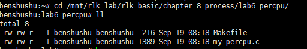
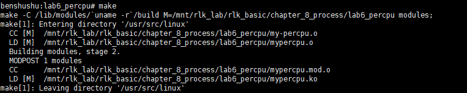
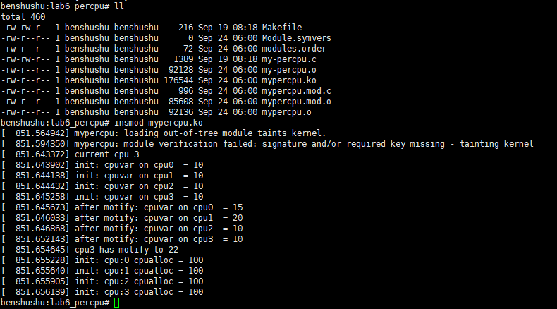
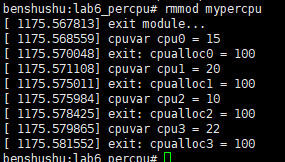

# 实验 8-6：per-cpu 变量

## 1．实验目的

​		学会 Linux 内核中 per-cpu 变量的用法。

## 2．实验要求

​		1）写一个简单的内核模块，创建一个 per-cpu 变量，并且初始化该 per-cpu 变量，修改 per-cpu 变量的值，然后输出这些值。

## 3．实验步骤

## 下面是本实验的实验步骤。

### 启动 QEMU+runninglinuxkernel。

```shell
$ ./run_rlk_arm64.sh run
```

### 进入本实验的参考代码。

```shell
# cd /mnt/rlk_lab/rlk_basic/chapter_8_process/lab6_percpu/
```



### 编译内核模块。

```shell
benshushu:lab6_percpu# make
make -C /lib/modules/`uname -r`/build 
M=/mnt/rlk_lab/rlk_basic/chapter_8_process/lab6_percpu modules;
make[1]: Entering directory '/usr/src/linux'
 CC [M] /mnt/rlk_lab/rlk_basic/chapter_8_process/lab6_percpu/my-percpu.o
 LD [M] /mnt/rlk_lab/rlk_basic/chapter_8_process/lab6_percpu/mypercpu.o
 Building modules, stage 2.
 MODPOST 1 modules
 CC /mnt/rlk_lab/rlk_basic/chapter_8_process/lab6_percpu/mypercpu.mod.o
 LD [M] /mnt/rlk_lab/rlk_basic/chapter_8_process/lab6_percpu/mypercpu.ko
make[1]: Leaving directory '/usr/src/linux'
```

```shell
BASEINCLUDE ?= /lib/modules/`uname -r`/build

mypercpu-objs := my-percpu.o

obj-m	:=   mypercpu.o
all :
	$(MAKE) -C $(BASEINCLUDE) M=$(PWD) modules;

clean:
	$(MAKE) -C $(BASEINCLUDE) M=$(PWD) clean;
	rm -f *.ko;
```



### 安装本实验的内核模块。

```shell
insmod mypercpu.ko
```


​		看到“current cpu 2”说明执行该内核模块的 CPU 为 CPU2，发现 CPU2 对应的cpuvar 变量变成了 22，说明实验成功。



------

### 结果分析

在这段内核模块加载的日志输出中，展示了使用 `per_cpu` 机制对每个 CPU 独立变量的操作和修改。以下是对输出结果的详细分析：

1. **模块加载时的警告信息**：

   ```
   mypercpu: loading out-of-tree module taints kernel.
   mypercpu: module verification failed: signature and/or required key missing - tainting kernel
   ```

   - 这些信息表明，你加载的是一个“外部模块”（即非官方内核模块），并且未通过模块签名验证。因此，内核将标记为“受污染”状态。这不会影响模块的功能，但表明该模块并非官方签名认证的模块。

2. **当前 CPU 信息**：

   ```
   current cpu 3
   ```

   - 使用 `raw_smp_processor_id()` 获取当前执行代码的 CPU，输出表明当前操作的 CPU 是 **CPU 3**。

3. **`cpuvar` 初始化值**：

   ```
   init: cpuvar on cpu0  = 10
   init: cpuvar on cpu1  = 10
   init: cpuvar on cpu2  = 10
   init: cpuvar on cpu3  = 10
   ```

   - 在模块初始化时，`cpuvar` 被定义为每个 CPU 独立的变量，初始值为 `10`。因此，系统中每个 CPU 的 `cpuvar` 值一开始均为 `10`。

4. **修改后的 `cpuvar` 值**：

   ```
   after motify: cpuvar on cpu0  = 15
   after motify: cpuvar on cpu1  = 20
   after motify: cpuvar on cpu2  = 10
   after motify: cpuvar on cpu3  = 10
   ```

   - 模块中手动设置了 **CPU 0** 上的 `cpuvar` 值为 `15`，**CPU 1** 上的 `cpuvar` 值为 `20`，其余 CPU 依然保持初始值 `10`。
   - **CPU 2 和 CPU 3** 上的 `cpuvar` 值没有被显式修改，依然保持为初始值 `10`。

5. **当前 CPU 的修改**：

   ```
   cpu3 has motify to 22
   ```

   - 使用 `__this_cpu_write()` 修改当前 CPU（CPU 3）上的 `cpuvar` 值为 `22`。该操作仅影响当前 CPU 上的 `cpuvar`，不影响其他 CPU。

6. **`cpualloc` 的初始化值**：

   ```
   init: cpu:0 cpualloc = 100
   init: cpu:1 cpualloc = 100
   init: cpu:2 cpualloc = 100
   init: cpu:3 cpualloc = 100
   ```

   - 模块使用 `alloc_percpu()` 分配了一个新的每 CPU 变量 `cpualloc`，并为每个 CPU 的 `cpualloc` 值设置为 `100`。
   - 输出显示每个 CPU（CPU 0、1、2、3）上分配的 `cpualloc` 变量都被初始化为 `100`。

### 总结

1. **每 CPU 变量的独立性**：每个 CPU 都拥有自己独立的 `cpuvar` 副本，初始值为 `10`。CPU 0 和 CPU 1 的 `cpuvar` 被显式修改，而 CPU 3 的 `cpuvar` 通过 `__this_cpu_write()` 修改为 `22`，CPU 2 保持初始值不变。
2. **`alloc_percpu` 的使用**：为每个 CPU 动态分配了 `cpualloc` 变量，并且为每个 CPU 初始化值为 `100`。
3. **多核并发优化**：这种每 CPU 独立变量的使用方式避免了 CPU 之间的竞争，减少了锁的开销，特别适合高并发或多核系统中的性能优化场景

------

### 卸载内核模块

```shell
rmmod mypercpu
```




------

### 结果分析

从 `rmmod mypercpu` 的输出可以看到模块卸载时打印的信息，展示了每个 CPU 上的 `cpuvar` 和 `cpualloc` 变量的值。以下是对该输出和对应代码的分析：

#### 1. **模块退出时的打印信息**

```
[ 1175.567813] exit module...
[ 1175.568559] cpuvar cpu0 = 15
[ 1175.570048] exit: cpualloc0 = 100
[ 1175.571108] cpuvar cpu1 = 20
[ 1175.575011] exit: cpualloc1 = 100
[ 1175.575984] cpuvar cpu2 = 10
[ 1175.578425] exit: cpualloc2 = 100
[ 1175.579865] cpuvar cpu3 = 22
[ 1175.581552] exit: cpualloc3 = 100
```

#### 2. **`cpuvar` 的值**

- **CPU 0**：`cpuvar` 被手动设置为 `15`。
- **CPU 1**：`cpuvar` 被手动设置为 `20`。
- **CPU 2**：`cpuvar` 保持了初始化值 `10`，没有被显式修改。
- **CPU 3**：当前执行代码的 CPU，通过 `__this_cpu_write` 修改 `cpuvar` 为 `22`。

这些值对应于 `my_init` 函数中的操作：

- 使用 `per_cpu(cpuvar, 0) = 15;` 和 `per_cpu(cpuvar, 1) = 20;` 分别修改了 CPU 0 和 CPU 1 的 `cpuvar` 值。
- 当前 CPU（在该例中是 CPU 3）的 `cpuvar` 被修改为 `22`，其他 CPU 的 `cpuvar` 未被修改，保持初始值 `10`。

#### 3. **`cpualloc` 的值**

- 对于 **CPU 0、1、2、3**，`cpualloc` 的值均为 `100`。这反映了在 `my_init` 函数中，使用 `alloc_percpu()` 分配的每个 CPU 的 `cpualloc` 变量，并将其初始值设置为 `100`。

这些值对应于代码中的这段逻辑：

```C
cpualloc = alloc_percpu(long);
for_each_possible_cpu(cpu) {
    *per_cpu_ptr(cpualloc, cpu) = 100;
    pr_info("init: cpu:%d cpualloc = %ld\n", cpu, *per_cpu_ptr(cpualloc, cpu));
}
```

在每个可能的 CPU 上，`cpualloc` 被初始化为 `100`，并且在模块退出时保持不变。

#### 总结

- **每 CPU 独立变量 (`cpuvar`)**：每个 CPU 上的 `cpuvar` 是独立的，程序中显式修改了 CPU 0 和 CPU 1 的值，并通过 `__this_cpu_write()` 修改了当前 CPU（CPU 3）的值，而 CPU 2 的 `cpuvar` 维持初始值 `10`。
- **动态分配的 `cpualloc`**：`cpualloc` 使用 `alloc_percpu()` 进行动态分配，并为每个 CPU 初始化为 `100`。退出时每个 CPU 的 `cpualloc` 值也保持为 `100`。

通过这些操作，程序展示了如何使用 `per_cpu` 和 `alloc_percpu` 机制为每个 CPU 分配独立的变量，从而避免 CPU 之间的竞争和同步问题，有效地提高了并发性能。

------

## 4．实验代码

```C
#include <linux/module.h>
#include <linux/init.h>
#include <linux/percpu.h>
#include <linux/cpumask.h>

static DEFINE_PER_CPU(long, cpuvar) = 10;
static long __percpu *cpualloc;

static int __init my_init(void)
{
    int cpu;
    int cur_cpu = raw_smp_processor_id();
    pr_info("current cpu %d\n", cur_cpu);

    /* print the init value of cpuvar */
    for_each_possible_cpu(cpu) {
        pr_info("init: cpuvar on cpu%d = %ld\n", cpu, per_cpu(cpuvar, cpu));
    }

    /* set cpu0 value */
    per_cpu(cpuvar, 0) = 15;
    per_cpu(cpuvar, 1) = 20;

    for_each_possible_cpu(cpu) {
        pr_info("after modify: cpuvar on cpu%d = %ld\n", cpu, per_cpu(cpuvar, cpu));
    }

    __this_cpu_write(cpuvar, 22);
    pr_info("cpu%d has modified to %ld\n", cur_cpu, get_cpu_var(cpuvar));
    put_cpu_var(cpuvar);

    /* alloc a percpu value */
    cpualloc = alloc_percpu(long);

    /* set all cpu for this value */
    for_each_possible_cpu(cpu) {
        *per_cpu_ptr(cpualloc, cpu) = 100;
        pr_info("init: cpu:%d cpualloc = %ld\n", cpu, *per_cpu_ptr(cpualloc, cpu));
    }

    return 0;
}

static void __exit my_exit(void)
{
    int cpu;
    pr_info("exit module...\n");

    for_each_possible_cpu(cpu) {
        pr_info("cpuvar cpu%d = %ld\n", cpu, per_cpu(cpuvar, cpu));
        pr_info("exit: cpualloc%d = %ld\n", cpu, *per_cpu_ptr(cpualloc, cpu));
    }

    free_percpu(cpualloc);
    pr_info("Bye: module unloaded from 0x%p\n", my_exit);
}

module_init(my_init);
module_exit(my_exit);

MODULE_AUTHOR("Ben ShuShu");
MODULE_LICENSE("GPL v2");

```

​		per-cpu 变量是 Linux 内核中同步机制的一种。当系统中所有的 CPU 都访问共享的一个变量 *v* 时，CPU0 修改了变量 *v* 的值时，CPU1 也在同时修改变量 *v* 的值，那么就会导致变量 *v* 值不正确。一个可行的办法就是 CPU0 访问变量 *v* 时使用原子加锁指令，CPU1 访问变量 *v* 时只能等待了，可是这会有两个比较明显的缺点。

-  原子操作是比较耗时的。

-  现代处理器中，每个 CPU 都有 L1 缓存，那么多 CPU 同时访问同一个变量时会导致缓存一致性问题。当某个 CPU 对共享数据变量 *v* 修改后，其他 CPU上对应的缓存行需要做无效操作，这对性能是有所损耗的。

​		per-cpu 变量为了解决上述问题出现一种有趣的特性，它为系统中每个处理器都分配该变量的副本。这样在多处理器系统中，当处理器只能访问属于它自己的那个变量副本，不需要考虑与其他处理器的竞争问题，还能充分利用处理器本地的硬件缓存来提升性能。

​		3）声明 per-cpu 变量。per-cpu 变量的定义和声明有两种方式：一个是静态声明，另一个是动态分配。

​		静态 per-cpu 变量通过 DEFINE_PER_CPU 和 DECLARE_PER_CPU 宏定义和声明一个 per-cpu 变量。这些变量与普通变量的主要区别是放在一个特殊的段中。

```
#define DECLARE_PER_CPU(type, name) \
 DECLARE_PER_CPU_SECTION(type, name, "")
#define DEFINE_PER_CPU(type, name) \
DEFINE_PER_CPU_SECTION(type, name, "")
```

动态分配和释放 per-cpu 变量的 API 函数如下。

```
#define alloc_percpu(type) \
 (typeof(type) __percpu *)__alloc_percpu(sizeof(type), \
 __alignof__(type))
void free_percpu(void __percpu *ptr)
```

4）使用 per-cpu 变量。对于静态定义的 per-cpu 变量，可以通过 get_cpu_var()和

put_cpu_var()函数来访问和修改 per-cpu 变量，这两个函数内置了关闭和打开内核抢

占的功能。另外需要注意的是，这两个函数需要配对使用。

```
#define get_cpu_var(var) \
    (*({ \
        preempt_disable(); \
        this_cpu_ptr(&var); \
    }))

#define put_cpu_var(var) \
do { \
    (void)&(var); \
    preempt_enable(); \
} while (0)
```

访问动态分配的 per-cpu 变量需要通过下面的接口函数来访问。

```
#define put_cpu_ptr(var) \
do { \
    (void)(var); \
    preempt_enable(); \
} while (0)

#define get_cpu_ptr(var) \
({ \
    preempt_disable(); \
    this_cpu_ptr(var); \
})

```


------

### 代码功能概述

该内核模块演示了如何使用 Linux 内核中的 `per_cpu` 机制，该机制允许每个 CPU 拥有自己的变量副本，以避免 CPU 之间的竞争和缓存同步问题。代码展示了以下功能：

1. 定义和初始化每 CPU 变量。
2. 设置和修改不同 CPU 上的 `per_cpu` 变量值。
3. 分配、使用和释放 `alloc_percpu` 分配的每 CPU 变量。

#### 详细注释及代码分析

```C
#include <linux/module.h>
#include <linux/init.h>
#include <linux/percpu.h>
#include <linux/cpumask.h>

// 定义一个每个 CPU 都有独立副本的变量 `cpuvar`，初始化值为 10
static DEFINE_PER_CPU(long, cpuvar) = 10;

// 定义指向 percpu 变量的指针，用于动态分配每 CPU 数据
static long __percpu *cpualloc;

static int __init my_init(void)
{
    int cpu;
    // 获取当前 CPU 的 ID
    int cur_cpu = raw_smp_processor_id();
    pr_info("current cpu %d\n", cur_cpu);

    // 打印每个 CPU 上初始的 `cpuvar` 值
    for_each_possible_cpu(cpu) {
        pr_info("init: cpuvar on cpu%d = %ld\n", cpu, per_cpu(cpuvar, cpu));
    }

    // 修改 CPU 0 和 CPU 1 上的 `cpuvar` 值
    per_cpu(cpuvar, 0) = 15;  // 设置 CPU 0 上的值为 15
    per_cpu(cpuvar, 1) = 20;  // 设置 CPU 1 上的值为 20

    // 打印修改后的每个 CPU 的 `cpuvar` 值
    for_each_possible_cpu(cpu) {
        pr_info("after modify: cpuvar on cpu%d = %ld\n", cpu, per_cpu(cpuvar, cpu));
    }

    // 使用 `__this_cpu_write` 直接修改当前 CPU 上的 `cpuvar` 值为 22
    __this_cpu_write(cpuvar, 22);
    pr_info("cpu%d has modified to %ld\n", cur_cpu, get_cpu_var(cpuvar));

    // 释放对当前 CPU 的变量引用
    put_cpu_var(cpuvar);

    // 动态分配每个 CPU 独立的 `cpualloc` 空间
    cpualloc = alloc_percpu(long);

    // 为每个 CPU 的 `cpualloc` 变量设置初始值 100，并打印这些值
    for_each_possible_cpu(cpu) {
        *per_cpu_ptr(cpualloc, cpu) = 100;
        pr_info("init: cpu:%d cpualloc = %ld\n", cpu, *per_cpu_ptr(cpualloc, cpu));
    }

    return 0;
}

static void __exit my_exit(void)
{
    int cpu;
    pr_info("exit module...\n");

    // 打印每个 CPU 上的 `cpuvar` 和 `cpualloc` 值，退出时做清理工作
    for_each_possible_cpu(cpu) {
        pr_info("cpuvar cpu%d = %ld\n", cpu, per_cpu(cpuvar, cpu));
        pr_info("exit: cpualloc%d = %ld\n", cpu, *per_cpu_ptr(cpualloc, cpu));
    }

    // 释放为 `cpualloc` 分配的每个 CPU 独立的数据
    free_percpu(cpualloc);
    pr_info("Bye: module unloaded from 0x%p\n", my_exit);
}

// 指定模块的初始化函数和退出函数
module_init(my_init);
module_exit(my_exit);

// 模块元数据
MODULE_AUTHOR("Ben ShuShu");
MODULE_LICENSE("GPL v2");
```

#### 代码运行步骤分析

1. **初始化阶段 (`my_init`)**：
   - **`DEFINE_PER_CPU` 定义每 CPU 变量**：`cpuvar` 是一个每个 CPU 都有自己副本的变量，并且每个 CPU 的初始值为 `10`。
   - **打印当前 CPU ID**：使用 `raw_smp_processor_id()` 获取当前正在执行代码的 CPU ID。
   - **遍历所有 CPU 并打印 `cpuvar` 的初始值**：`for_each_possible_cpu(cpu)` 遍历系统中所有可能的 CPU（包括当前禁用的），并通过 `per_cpu()` 访问每个 CPU 上的 `cpuvar` 值。
   - **修改 CPU 0 和 CPU 1 的 `cpuvar` 值**：分别将 CPU 0 和 CPU 1 的 `cpuvar` 值设置为 `15` 和 `20`，这不会影响其他 CPU。
   - **修改当前 CPU 的 `cpuvar` 值**：使用 `__this_cpu_write()` 修改当前 CPU 的 `cpuvar` 值为 `22`，并使用 `get_cpu_var()` 获取值进行打印。
   - **动态分配每个 CPU 独立的 `cpualloc` 变量**：使用 `alloc_percpu()` 分配每个 CPU 的独立 `cpualloc` 内存空间，并初始化为 `100`。
   - **打印每个 CPU 的 `cpualloc` 值**：通过 `per_cpu_ptr()` 访问并打印每个 CPU 上的 `cpualloc` 值。
2. **退出阶段 (`my_exit`)**：
   - **打印退出时每个 CPU 的变量值**：在模块卸载时，遍历所有可能的 CPU，打印每个 CPU 的 `cpuvar` 和 `cpualloc` 值。
   - **释放动态分配的 `cpualloc` 空间**：通过 `free_percpu()` 释放为每个 CPU 分配的 `cpualloc` 内存。
   - **打印卸载模块的信息**：确认模块被卸载并打印退出地址。

#### 代码作用总结

- **`per_cpu` 的使用**：该模块展示了如何使用 `per_cpu` 和 `alloc_percpu` 在每个 CPU 上创建和管理独立的变量，避免 CPU 之间的资源竞争和缓存同步问题。这对于高性能的多核系统来说非常重要，因为它能够减少锁争用和上下文切换开销。
- **数据隔离**：每个 CPU 拥有自己独立的 `cpuvar` 和 `cpualloc` 副本，因此每个 CPU 上对这些变量的修改不会影响其他 CPU 上的变量值。
- **CPU 亲和性**：通过 `__this_cpu_write()` 和 `per_cpu_ptr()`，可以很方便地操作每个 CPU 上的变量，确保每个 CPU 处理自己的数据。

这段代码演示了如何利用 Linux 的 `per_cpu` 机制实现每个 CPU 独立的数据存储，适用于多核并行计算和性能优化的场景。

------

