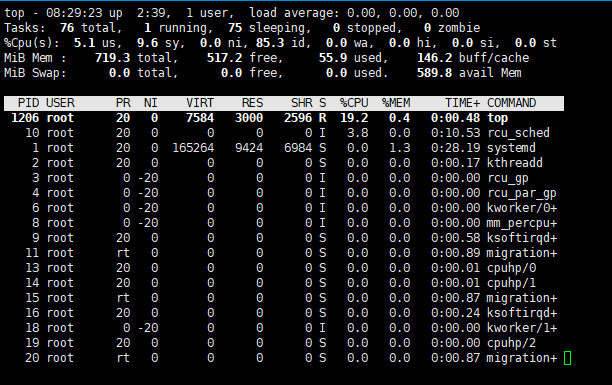
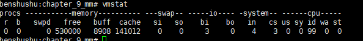
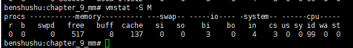

# 实验 9-1：查看系统内存信息

## 1．实验目的

​		1）通过熟悉 Linux 系统中常用的内存监测工具来感性地认识和了解内存管理。

​		2）在 Ubuntu Linux 下查看系统内存信息。

## 2．实验详解

### （1）Top 工具

​		Top 命令是最常用的查看 Linux 系统信息的命令之一，它可以实时显示系统中各个进程的资源占用情况。

```
Tasks: 585 total, 1 running, 285 sleeping, 298 stopped, 1 zombie
%Cpu(s): 0.3 us, 0.1 sy, 0.0 ni, 99.5 id, 0.0 wa, 0.0 hi, 0.0 si, 0.0 st
KiB Mem : 7949596 total, 640464 free, 5042036 used, 2267096 buff/cache
KiB Swap: 16586748 total, 13447420 free, 3139328 used. 2226976 avail Mem 
 PID USER PR NI VIRT RES SHR S %CPU %MEM TIME+ COMMAND 
3958 figo 20 0 453988 117044 77620 S 3.0 1.5 20:27.13 Xvnc4
4052 figo 20 0 668728 44504 11264 S 2.3 0.6 11:13.86 gnometerminal-server 
 8 root 20 0 0 0 0 S 0.3 0.0 15:07.14 [rcu_sched] 
2850 figo 20 0 1508396 288632 32944 S 0.3 3.6 404:23.96 compiz 
6851 figo 20 0 44116 4156 3004 R 0.3 0.1 0:00.32 top 
 2 root 20 0 0 0 0 S 0.0 0.0 0:00.89 [kthreadd] 
 4 root 0 -20 0 0 0 S 0.0 0.0 0:00.00 [kworker/0:0H] 
 6 root 0 -20 0 0 0 S 0.0 0.0 0:00.00 [mm_percpu_wq] 
 7 root 20 0 0 0 0 S 0.0 0.0 0:07.72 [ksoftirqd/0] 
 9 root 20 0 0 0 0 S 0.0 0.0 0:00.00 [rcu_bh] 
 10 root rt 0 0 0 0 S 0.0 0.0 0:00.31 
[migration/0] 
 11 root rt 0 0 0 0 S 0.0 0.0 0:11.32 [watchdog/0]
```



​		第 3 行和第 4 行显示了主存（Mem）和交换分区（Swap）的总量、空闲量以及使用量。另外还显示了缓冲区以及页缓存大小（buff/cache）。

​		第 5 行显示了进程信息区的统计数据，常用的如下所示。

-  PID：进程的 ID。

-  USER：进程所有者的用户名。

-  PR：进程优先级。

-  NI：进程的 nice 值。

-  VIRT：进程使用的虚拟内存总量，单位是 KB。

-  RES：进程使用的并且未被换出的物理内存大小，单位是 KB。

-  SHR：共享内存大小，单位是 KB。

-  S：进程的状态。（D=不可中断的睡眠状态，R=运行，S=睡眠，T=跟踪/停止，z=僵尸进程）。

-  %CPU：上一次更新到现在的 CPU 时间占用百分比。

-  %MEM：进程使用物理内存的百分比。

-  TIME+：进程使用的 CPU 时间总计，单位是 10ms。

-  COMMAND：命令名或命令行。

​		上面列出了常用的统计信息，还有一些隐藏的统计信息，比如 CODE（可执行代码大小）、SWAP（交换出去的内存大小）、nMaj/nMin（产生缺页异常的次数）等，可以通过 f 键来选择要显示的内容。

​		除此之外，top 命令还可以在执行过程中使用一些交互命令，比如“M”可以根据进程使用内存的大小来排序。

### 		（2）vmstat 命令

​		vmstat 命令也是常见的 Linux 系统的监控小工具，它可以显示系统的 CPU、内存以及 IO 的使用情况。

​		vmstat 命令通常带有两个参数，==第一个参数采用时间间隔，单位是 s，第二个参数采用采样次数。==比如“vmstat 2 5”表示每 2s 采样一次数据，并且连续采样 5 次。

```
figo@figo-OptiPlex-9020:~$ vmstat 
procs -----------memory---------- ---swap-- -----io---- -system-- ------cpu--
---
r b swpd free buff cache si so bi bo in cs us sy id wa st
0 0 3139328 645744 1242708 1016716 0 0 4 2 0 1 0 0 99 0 0
```



​		vmstat 命令显示的单位是 KB。在大型的服务器中，可以使用-S 选项来按照 MB或者 GB 来显示。

```
figo@figo-OptiPlex-9020:~$ vmstat -S M
procs -----------memory---------- ---swap-- -----io---- -system-- ------cpu--
---
r b swpd free buff cache si so bi bo in cs us sy id wa st
0 0 3065 630 1213 992 0 0 4 2 0 1 0 0 99 0 0
```



下面简单介绍 vmstat 命令显示的各个参数的含义。

-  r：表示在运行队列中正在执行和等待的进程数。

-  b：表示阻塞的进程。

-  swap：表示交换到交换分区的内存大小。

-  free：空闲的物理内存大小。

-  buff：用作磁盘缓存的大小。

-  cache：用于页面缓存的内存大小。

-  si：每秒从交换分区读回到内存的大小。

-  so: 每秒写入交换分区的大小。

-  bi：每秒读取磁盘（块设备）的块数量。

-  bo：每秒写入磁盘（块设备）的块数量。

-  in：每秒中断数，包括时钟中断。

-  cs：每秒上下文切换数量。

-  us: 用户进程执行时间百分比。

-  sy：内核系统进程执行时间百分比。

-  wa：I/O 等待时间百分比。

-  id：空闲时间百分比。