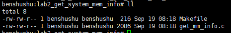
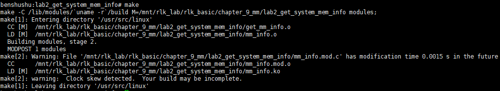
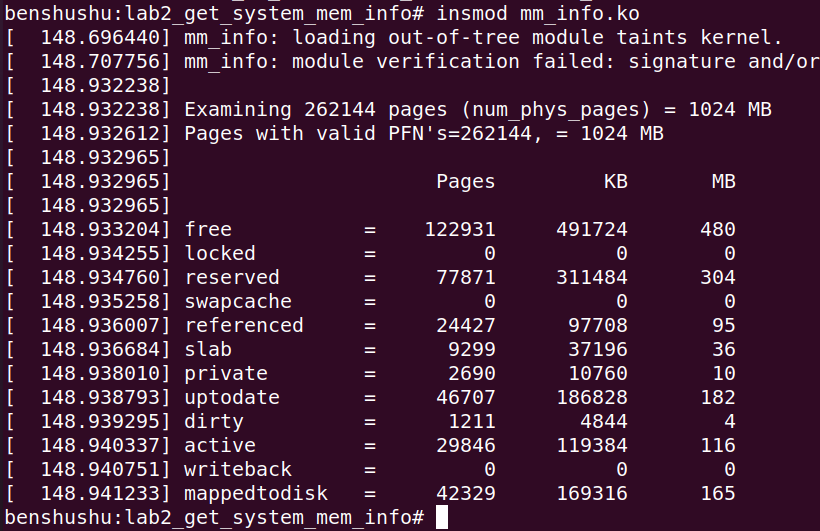
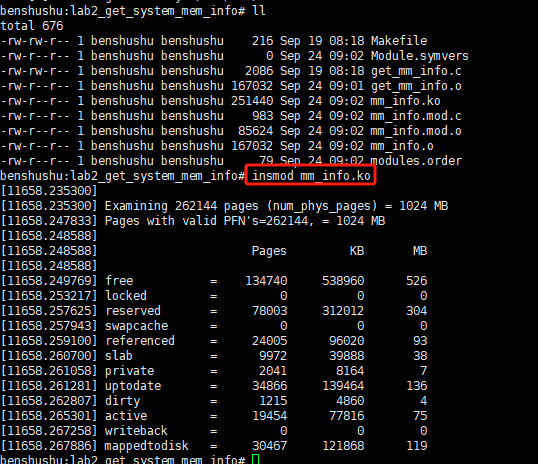
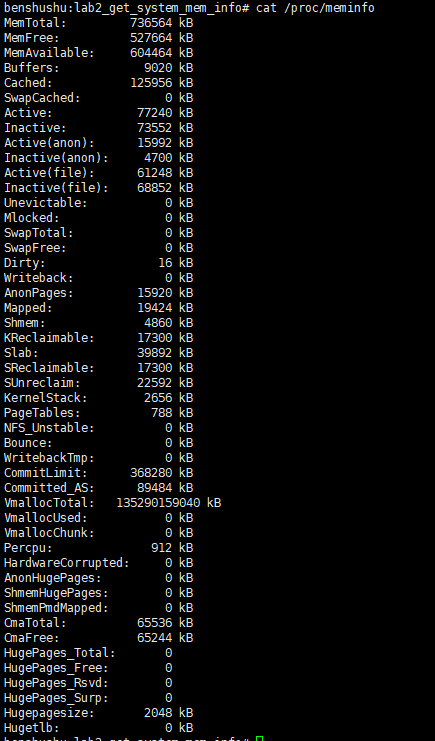

# 实验 9-2：获取系统的物理内存信息

## 1．实验目的

​		了解和熟悉Linux内核的物理内存管理的方法。比如struct page数据结构的使用，特别是 struct page 的 flags 标志位的使用。

## 2．实验要求

​		Linux 内核对每个物理页面都采用 struct page 数据结构来描述，内核为每一个物理页面都分配了这样一个 struct page 数据结构，并且存储到一个全局的数组mem_map[]中。它们之间的对应关系是 1:1 的线性映射，即 mem_map[]数组的第 0 个元素指向页帧号为 0 的物理页面的 struct page 数据结构。请写一个简单的内核模块程序，通过遍历这个 mem_map[]数组来统计当前系统有多少个空闲页面、保留页面、swapcache 页面、slab 页面、脏页面、活跃页面、正在回写的页面等。

## 3．实验步骤

## 下面是本实验的实验步骤。

### 启动 QEMU+runninglinuxkernel。

```shell
./run_rlk_arm64.sh run
```

### 进入本实验的参考代码。

```shell
# cd /mnt/rlk_lab/rlk_basic/chapter_9_mm/lab2_get_system_mem_info
```



### 编译内核模块。

```shell
benshushu:lab2_get_system_mem_info# make
make -C /lib/modules/`uname -r`/build 
M=/mnt/rlk_lab/rlk_basic/chapter_9_mm/lab2_get_system_mem_info modules;
make[1]: Entering directory '/usr/src/linux'
 CC [M] 
/mnt/rlk_lab/rlk_basic/chapter_9_mm/lab2_get_system_mem_info/get_mm_info.o
 LD [M] 
/mnt/rlk_lab/rlk_basic/chapter_9_mm/lab2_get_system_mem_info/mm_info.o
 Building modules, stage 2.
 MODPOST 1 modules
make[2]: Warning: File 
'/mnt/rlk_lab/rlk_basic/chapter_9_mm/lab2_get_system_mem_info/mm_info.mod.c' 
has modification time 0.00044 s in the future
 CC 
/mnt/rlk_lab/rlk_basic/chapter_9_mm/lab2_get_system_mem_info/mm_info.mod.o
 LD [M] 
/mnt/rlk_lab/rlk_basic/chapter_9_mm/lab2_get_system_mem_info/mm_info.ko
make[2]: warning: Clock skew detected. Your build may be incomplete.
make[1]: Leaving directory '/usr/src/linux'
```

```makefile
BASEINCLUDE ?= /lib/modules/`uname -r`/build

mm_info-objs := get_mm_info.o

obj-m	:=   mm_info.o
all :
	$(MAKE) -C $(BASEINCLUDE) M=$(PWD) modules;

clean:
	$(MAKE) -C $(BASEINCLUDE) M=$(PWD) clean;
	rm -f *.ko;
```



### 加载内核模块

```
benshushu:lab2_get_system_mem_info# insmod mm_info.ko
```





​		从上面 log 可以看到，我们一共检查了 262144个页面，对应内存大小是1024MB。每个页面对应一个页幁，同时我们也检查这些页面对应的页幁号是否有效的。因此有效的页幁号总数是 25600 个。

​		接下来，统计各种类型页面的数量：

-  空闲页面 free：一共 122931 个

-  加了 pagelock 的页面：0

-  保留的页面：77871

-  swapcache 的页面：0

-  referenced 页面：24427

-  slab 页面：9299

-  private 页面：2690

-  uptodate：46707

-  dirty 页面：1211

-  活跃页面：29846

-  writeback 页面：0

-  mappedtodisk 页面：42329

​		读者可以对应/proc/meminfo 打印出来的数值进行比较，需要注意的是，因为内存是动态变化的，可能它们之间会有细微变化。

```shell
cat /proc/meminfo
```



## 4．参考代码分析

获取系统的物理内存信息的参考代码如下。

```C
#include <linux/version.h>
#include <linux/module.h>
#include <linux/init.h>
#include <linux/mm.h>

#define PRT(a, b) pr_info("%-15s=%10d %10ld %8ld\n", \
                          a, b, (PAGE_SIZE * b) / 1024, (PAGE_SIZE * b) / 1024 / 1024)

static int __init my_init(void)
{
    struct page *p;
    unsigned long i, pfn, valid = 0;
    int free = 0, locked = 0, reserved = 0, swapcache = 0, referenced = 0,
        slab = 0, private = 0, uptodate = 0, dirty = 0, active = 0,
        writeback = 0, mappedtodisk = 0;

    unsigned long num_physpages;

    num_physpages = get_num_physpages();
    for (i = 0; i < num_physpages; i++) {

        /* Most of ARM systems have ARCH_PFN_OFFSET */
        pfn = i + ARCH_PFN_OFFSET;
        /* may be holes due to remapping */
        if (!pfn_valid(pfn))
            continue;

        valid++;
        p = pfn_to_page(pfn);
        if (!p)
            continue;
        /* page_count(page) == 0 is a free page. */
        if (!page_count(p)) {
            free++;
            continue;
        }
        if (PageLocked(p))
            locked++;
        if (PageReserved(p))
            reserved++;
        if (PageSwapCache(p))
            swapcache++;
        if (PageReferenced(p))
            referenced++;
        if (PageSlab(p))
            slab++;
        if (PagePrivate(p))
            private++;
        if (PageUptodate(p))
            uptodate++;
        if (PageDirty(p))
            dirty++;
        if (PageActive(p))
            active++;
        if (PageWriteback(p))
            writeback++;
        if (PageMappedToDisk(p))
            mappedtodisk++;
    }

    pr_info("\nExamining %ld pages (num_phys_pages) = %ld MB\n",
            num_physpages, num_physpages * PAGE_SIZE / 1024 / 1024);
    pr_info("Pages with valid PFN's=%ld, = %ld MB\n", valid,
            valid * PAGE_SIZE / 1024 / 1024);
    pr_info("\n Pages       KB         MB\n\n");

    PRT("free", free);
    PRT("locked", locked);
    PRT("reserved", reserved);
    PRT("swapcache", swapcache);
    PRT("referenced", referenced);
    PRT("slab", slab);
    PRT("private", private);
    PRT("uptodate", uptodate);
    PRT("dirty", dirty);
    PRT("active", active);
    PRT("writeback", writeback);
    PRT("mappedtodisk", mappedtodisk);

    return 0;
}

static void __exit my_exit(void)
{
    pr_info("Module exit\n");
}

module_init(my_init);
module_exit(my_exit);

MODULE_AUTHOR("Ben Shushu");
MODULE_LICENSE("GPL v2");

```

​		第 19 行，get_num_physpages()函数获取系统所有内存的大小，返回物理内存的页面数量。

​		第 20~59 行，for 循环遍历系统中所有内存的物理页面，然后进行各种统计。

​		第 23 行，对于 ARM 处理器来说，ARCH_PFN_OFFSET 宏表示物理内存在地址空间的起始地址对应的页幁号。

​		第 25 行，pfn_valid()函数检查页幁号 pfn 是否有效。

​		第 29 行，pfn_to_page()函数表示从页幁号 pfn 转换到 struct page 数据结构 p。

​		第 33 行，page_count()等于 0 的话，说明这个页面是空闲页面。

​		第 37 行，PageLocked()表示该页面已经上锁。

​		第 39 行，PageReserved()表示该页不可被换出。

​		第 41 行，PageSwapCache()表示这是交换页面。

​		第 43 行，PageReferenced()表示该页来实现 LRU 算法中的第二次机会法。

​		第 45 行，PageSlab()表示该页属于由 slab 分配器创建的 slab。

​		第 47 行，PagePrivate()表示该页是有效的，当 page->private 包含有效值时会设置该标志位。如果页面是 pagecache，那么包含一些文件系统相关的数据信息。

​		第 49 行，PageUptodate()表示页面内容是有效的，当该页面上的读操作完成后，设置该标志位。

​		第 51 行，PageDirty()表示页面内容被修改过，为脏页。

​		第 53 行，PageActive()表示该页在活跃 LRU 链表中。

​		第 55 行，PageWriteback()表示该页页面正在回写。

​		第 57 行，PageMappedToDisk()表示在磁盘中分配了 blocks。

------

### 代码功能概述

该代码是一个 Linux 内核模块，用于统计并打印系统中物理页面的各种状态信息。通过遍历系统中所有物理页面，模块统计了页面是否被使用、锁定、交换缓存、已引用、位于 slab 缓存、已更新、是否脏页、是否处于活动状态等信息，并在内核日志中输出这些统计数据。模块在加载时打印页面状态，在卸载时打印退出信息。

#### 代码详细注释及分析

```C
#include <linux/version.h>
#include <linux/module.h>
#include <linux/init.h>
#include <linux/mm.h>

#define PRT(a, b) pr_info("%-15s=%10d %10ld %8ld\n", \
                          a, b, (PAGE_SIZE * b) / 1024, (PAGE_SIZE * b) / 1024 / 1024)

/* 模块初始化函数 */
static int __init my_init(void)
{
    struct page *p;  // 用于存储当前页面的指针
    unsigned long i, pfn, valid = 0; // i 用于遍历页面，pfn 表示页面帧号，valid 表示有效页面数量
    int free = 0, locked = 0, reserved = 0, swapcache = 0, referenced = 0,
        slab = 0, private = 0, uptodate = 0, dirty = 0, active = 0,
        writeback = 0, mappedtodisk = 0;  // 各种页面状态的计数变量

    unsigned long num_physpages;  // 用于存储物理页面的数量

    /* 获取系统中物理页面的总数 */
    num_physpages = get_num_physpages();

    /* 遍历系统中所有的物理页面 */
    for (i = 0; i < num_physpages; i++) {

        /* ARM 系统通常有 ARCH_PFN_OFFSET，用于处理物理地址偏移 */
        pfn = i + ARCH_PFN_OFFSET;
        
        /* 检查该页面帧号是否有效（即物理内存中是否存在该页面） */
        if (!pfn_valid(pfn))
            continue;

        valid++;  // 记录有效页面的数量
        p = pfn_to_page(pfn);  // 将页面帧号转换为页面指针
        if (!p)  // 如果页面指针为空，则跳过
            continue;
        
        /* 如果页面的引用计数为 0，则表示该页面是空闲的 */
        if (!page_count(p)) {
            free++;
            continue;
        }
        
        /* 以下是对页面状态的各种检查，并更新相应的计数器 */
        if (PageLocked(p))
            locked++;  // 页面是否被锁定
        if (PageReserved(p))
            reserved++;  // 页面是否被保留
        if (PageSwapCache(p))
            swapcache++;  // 页面是否在交换缓存中
        if (PageReferenced(p))
            referenced++;  // 页面是否被引用
        if (PageSlab(p))
            slab++;  // 页面是否位于 slab 缓存中
        if (PagePrivate(p))
            private++;  // 页面是否有私有数据
        if (PageUptodate(p))
            uptodate++;  // 页面数据是否已更新
        if (PageDirty(p))
            dirty++;  // 页面是否为脏页
        if (PageActive(p))
            active++;  // 页面是否为活动页
        if (PageWriteback(p))
            writeback++;  // 页面是否处于回写状态
        if (PageMappedToDisk(p))
            mappedtodisk++;  // 页面是否映射到磁盘
    }

    /* 打印总物理页面数和有效页面数 */
    pr_info("\nExamining %ld pages (num_phys_pages) = %ld MB\n",
            num_physpages, num_physpages * PAGE_SIZE / 1024 / 1024);
    pr_info("Pages with valid PFN's=%ld, = %ld MB\n", valid,
            valid * PAGE_SIZE / 1024 / 1024);
    
    pr_info("\n Pages       KB         MB\n\n");

    /* 依次打印每种页面状态的计数结果 */
    PRT("free", free);
    PRT("locked", locked);
    PRT("reserved", reserved);
    PRT("swapcache", swapcache);
    PRT("referenced", referenced);
    PRT("slab", slab);
    PRT("private", private);
    PRT("uptodate", uptodate);
    PRT("dirty", dirty);
    PRT("active", active);
    PRT("writeback", writeback);
    PRT("mappedtodisk", mappedtodisk);

    return 0;
}

/* 模块卸载函数 */
static void __exit my_exit(void)
{
    pr_info("Module exit\n");  // 模块卸载时输出信息
}

module_init(my_init);  // 指定模块的初始化函数
module_exit(my_exit);  // 指定模块的退出函数

MODULE_AUTHOR("Ben Shushu");
MODULE_LICENSE("GPL v2");
```

#### 代码分析

##### 1. **模块的初始化过程 (`my_init`)**

- 模块加载时会遍历系统中所有的物理页面，使用 `for_each_possible_cpu` 进行遍历，并根据每个页面的状态（是否空闲、锁定、被引用等）更新计数器。
- `pfn_valid(pfn)` 用来检查页面帧号是否有效，跳过无效的物理页面。
- 如果页面的引用计数 (`page_count(p)`) 为 0，则说明该页面是空闲的。
- 模块还检测页面的其他属性，比如是否被锁定、是否在交换缓存中、是否脏页等，并记录这些状态的页面数量。
- 输出总的物理页面数、有效页面数，并按页面状态分类输出每类页面的数量。

##### 2. **页面状态检查**

- **空闲页面**：`if (!page_count(p))` 判断页面是否为空闲。如果引用计数为 0，该页面未被使用。
- **锁定页面**：通过 `PageLocked(p)` 检查页面是否被锁定。
- **保留页面**：`PageReserved(p)` 判断页面是否为内核保留页。
- **交换缓存**：`PageSwapCache(p)` 检查页面是否位于交换缓存中。
- **引用页面**：`PageReferenced(p)` 判断页面是否曾被访问。
- **脏页**：通过 `PageDirty(p)` 检查页面是否为脏页（即页面修改过但尚未写回磁盘）。
- **活动页面**：`PageActive(p)` 判断页面是否是活动页面。

##### 3. **模块的卸载过程 (`my_exit`)**

- 模块卸载时打印简单的卸载信息，表示模块成功卸载。

##### 4. **宏 `PRT` 的使用**

- 宏 `PRT` 用来格式化输出每种页面状态的计数结果。它会计算出页面数对应的 KB 和 MB，并打印相应的结果。

#### 总结

- 该内核模块提供了一个非常有用的工具，可以统计系统中不同状态的物理页面的数量。
- 通过 `pfn_valid`、`page_count` 和其他页面状态检查函数，模块能够准确地检测系统中各种类型的页面。
- 输出结果对于内核开发人员和调试人员非常有用，可以帮助分析内存使用情况和页面状态。

------

