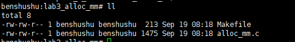
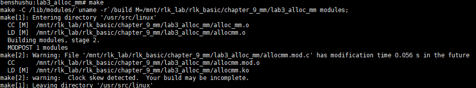
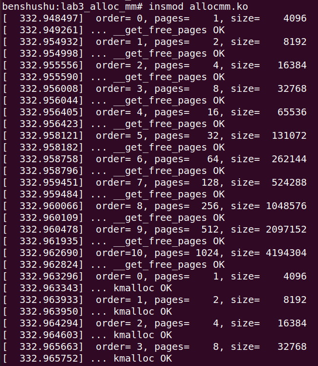
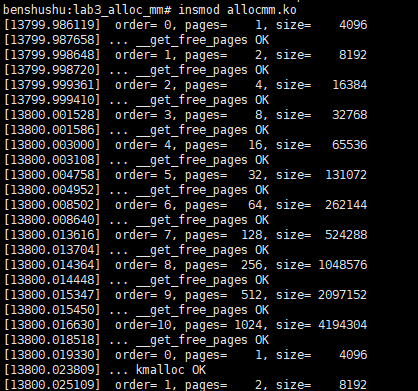
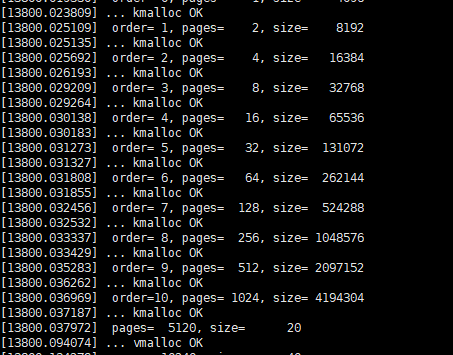
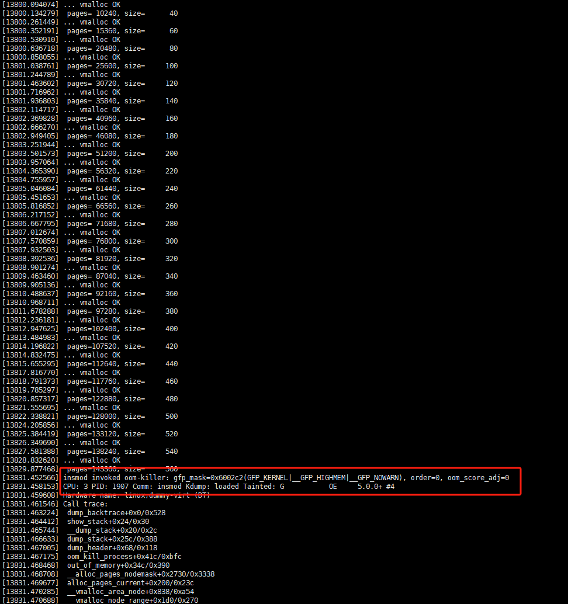
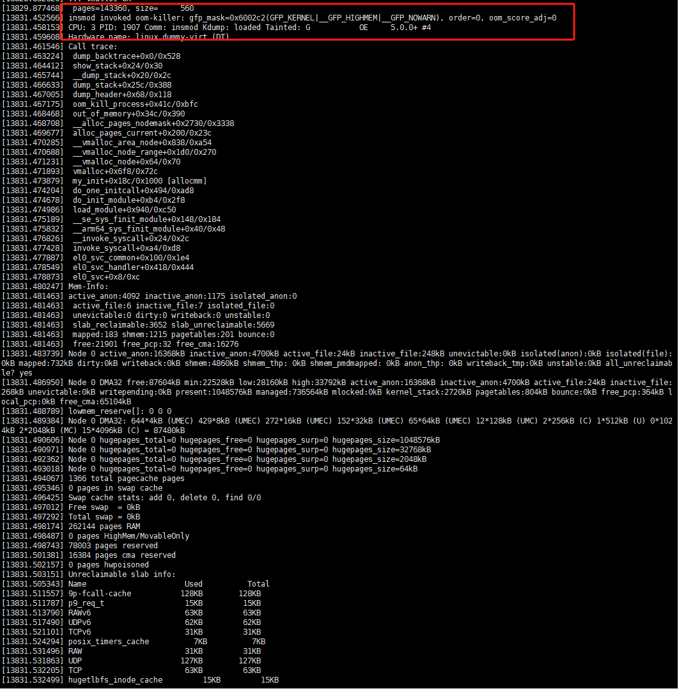
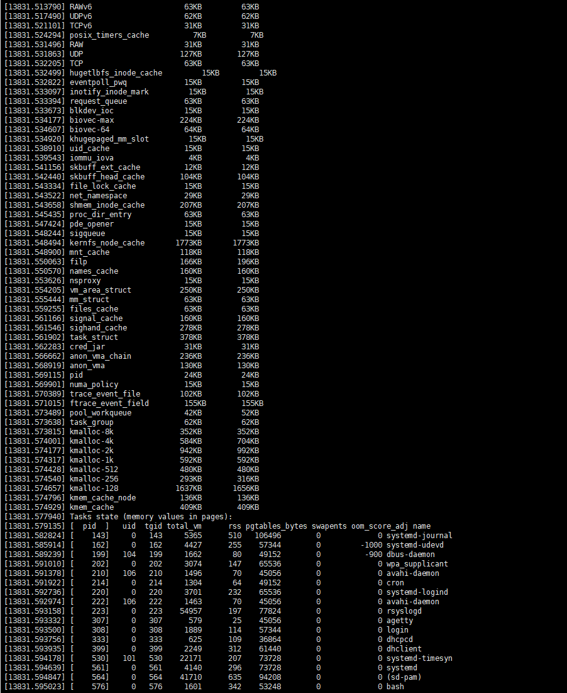
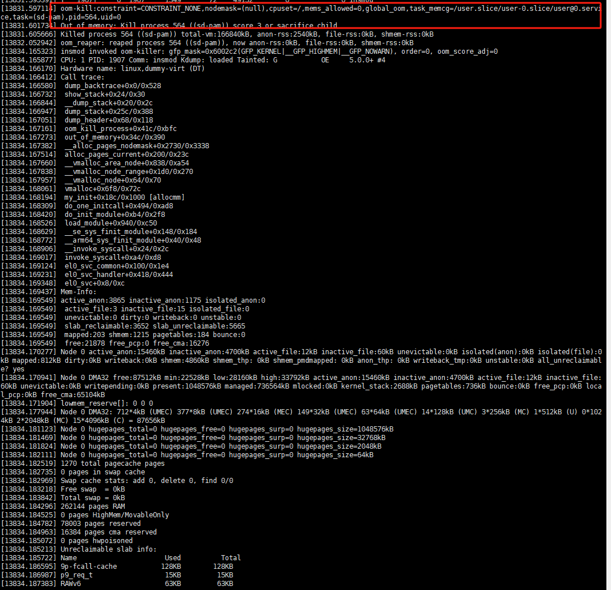
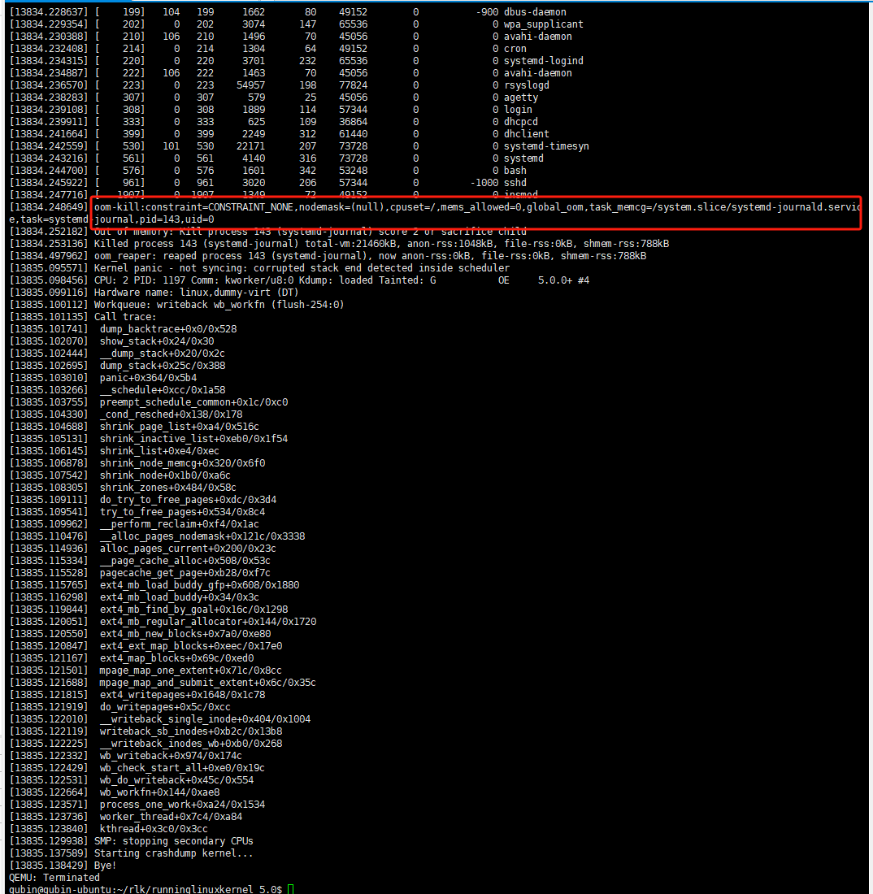

# 实验 9-3：分配内存

## 1．实验目的

​		理解 Linux 内核中分配内存常用的接口函数的使用方法和实现原理等。

## 2．实验要求

​		（1）分配页面

​		写一个内核模块，然后在 QEMU 上运行 ARM Cortex-A9 的机器上实验。使用alloc_page()函数分配一个物理页面，然后输出该物理页面的物理地址，并输出该物理页面在内核空间的虚拟地址，然后把这个物理页面全部填充为 0x55。思考一下，如果使用 GFP_KERNEL 或者 GFP_HIGHUSER_MOVABLE 为分配掩码，会有什么不一样？

​		（2）尝试分配最大的内存

​		写一个内核模块，然后在 QEMU 上运行 ARM Cortex-A9 的机器上实验。测试可以动态分配多大的物理内存块，使用__get_free_pages()函数去分配。可以从分配一个物理页面开始，一直加大分配页面的数量，然后看看当前系统最大可以分配多少个连续的物理页面。

​		注意，使用 GFP_ATOMIC 分配掩码，并思考如何使用该分配掩码。同样使用 kmalloc()函数去测试可以分配多大的内存。

## 3. 实验步骤

## 下面是本实验的实验步骤。

### 启动 QEMU+runninglinuxkernel。

```shell
$ ./run_rlk_arm64.sh run
```

### 进入本实验的参考代码。

```shell
# cd /mnt/rlk_lab/rlk_basic/chapter_9_mm/lab3_alloc_mm
```



### 编译内核模块。

```shell
benshushu:lab3_alloc_mm# make
make -C /lib/modules/`uname -r`/build 
M=/mnt/rlk_lab/rlk_basic/chapter_9_mm/lab3_alloc_mm modules;
make[1]: Entering directory '/usr/src/linux'
 CC [M] /mnt/rlk_lab/rlk_basic/chapter_9_mm/lab3_alloc_mm/alloc_mm.o
 LD [M] /mnt/rlk_lab/rlk_basic/chapter_9_mm/lab3_alloc_mm/allocmm.o
 Building modules, stage 2.
 MODPOST 1 modules
 CC /mnt/rlk_lab/rlk_basic/chapter_9_mm/lab3_alloc_mm/allocmm.mod.o
 LD [M] /mnt/rlk_lab/rlk_basic/chapter_9_mm/lab3_alloc_mm/allocmm.ko
make[1]: Leaving directory '/usr/src/linux'
```

```makefile
BASEINCLUDE ?= /lib/modules/`uname -r`/build

allocmm-objs := alloc_mm.o

obj-m	:=   allocmm.o
all :
	$(MAKE) -C $(BASEINCLUDE) M=$(PWD) modules;

clean:
	$(MAKE) -C $(BASEINCLUDE) M=$(PWD) clean;
	rm -f *.ko;
```



### 加载内核模块。

```
insmod allocmm.ko
```



​		本实验的 log 比较长，我们可以分成三部分。

​		第一部分是测试__get_free_pages()函数的分配，下面是这部分的 log。我们可以看到，最大分配的 order 为 10。

```
/mnt # insmod allocmm.ko 
[ 54.913328] order= 0, pages= 1, size= 4096 
[ 54.923242] ... __get_free_pages OK
[ 54.926839] order= 1, pages= 2, size= 8192 
[ 54.928285] ... __get_free_pages OK
[ 54.930036] order= 2, pages= 4, size= 16384 
[ 54.930579] ... __get_free_pages OK
[ 54.931095] order= 3, pages= 8, size= 32768 
[ 54.931468] ... __get_free_pages OK
[ 54.931809] order= 4, pages= 16, size= 65536 
[ 54.932342] ... __get_free_pages OK
[ 54.932602] order= 5, pages= 32, size= 131072 
[ 54.932829] ... __get_free_pages OK
[ 54.933077] order= 6, pages= 64, size= 262144 
[ 54.934381] ... __get_free_pages OK
[ 54.934900] order= 7, pages= 128, size= 524288 
[ 54.935659] ... __get_free_pages OK
[ 54.936268] order= 8, pages= 256, size= 1048576
[ 54.938194] ... __get_free_pages OK
[ 54.938983] order= 9, pages= 512, size= 2097152 
[ 54.939837] ... __get_free_pages OK
[ 54.941130] order=10, pages= 1024, size= 4194304 
[ 54.942075] ... __get_free_pages OK
```



​		第二部分是测试 kmalloc，下面是这部分的 log。我们可以看到，最大分配的 order为 10。

```
[ 54.942782] order= 0, pages= 1, size= 4096 
[ 54.945105] ... kmalloc OK
[ 54.945596] order= 1, pages= 2, size= 8192 
[ 54.946225] ... kmalloc OK
[ 54.947163] order= 2, pages= 4, size= 16384 
[ 54.949112] ... kmalloc OK
[ 54.950433] order= 3, pages= 8, size= 32768 
[ 54.952561] ... kmalloc OK
[ 54.953062] order= 4, pages= 16, size= 65536 
[ 54.954482] ... kmalloc OK
[ 54.955007] order= 5, pages= 32, size= 131072 
[ 54.956295] ... kmalloc OK
[ 54.957333] order= 6, pages= 64, size= 262144 
[ 54.959559] ... kmalloc OK
[ 54.960676] order= 7, pages= 128, size= 524288 
[ 54.962489] ... kmalloc OK
[ 54.962868] order= 8, pages= 256, size= 1048576 
[ 54.963540] ... kmalloc OK
[ 54.964164] order= 9, pages= 512, size= 2097152 
[ 54.965170] ... kmalloc OK
[ 54.965779] order=10, pages= 1024, size= 4194304
[ 54.967066] ... kmalloc OK
```



​		第三部分是测试 vmalloc，下面这部分的 log。

```
…
[ 714.941429] pages=128000, size= 500 
[ 715.635447] ... vmalloc OK
[ 716.235754] pages=133120, size= 520 
[ 717.070537] ... vmalloc OK
[ 717.714868] pages=138240, size= 540 
[ 718.764947] ... vmalloc OK
[ 719.412041] pages=143360, size= 560
…
```



下面的log显示，发生了内存短缺情况，触发了OOM

```
[ 730.384006] insmod invoked oom-killer: 
gfp_mask=0x6002c2(GFP_KERNEL|__GFP_HIGHMEM|__GFP_NOWARN), order=0, 
oom_score_adj=0
[ 730.386053] CPU: 0 PID: 1900 Comm: insmod Kdump: loaded Tainted: G 
O 5.0.0+ #4
[ 730.387219] Hardware name: linux,dummy-virt (DT)
[ 730.388382] Call trace:
[ 730.389492] dump_backtrace+0x0/0x528
[ 730.390254] show_stack+0x24/0x30
[ 730.390912] __dump_stack+0x20/0x2c
[ 730.391989] dump_stack+0x25c/0x388
[ 730.392277] dump_header+0x68/0x118
[ 730.392550] oom_kill_process+0x41c/0xbfc
[ 730.392888] out_of_memory+0x34c/0x390
[ 730.393314] __alloc_pages_nodemask+0x2730/0x3338
[ 730.394237] alloc_pages_current+0x200/0x23c
[ 730.394732] __vmalloc_area_node+0x838/0xa54
[ 730.395003] __vmalloc_node_range+0x1d0/0x270
[ 730.396126] __vmalloc_node+0x64/0x70
[ 730.396699] vmalloc+0x6ec/0x720
[ 730.397467] my_init+0x18c/0x1000 [allocmm]
[ 730.398425] do_one_initcall+0x494/0xad8
[ 730.399073] do_init_module+0xb4/0x2f8
[ 730.399434] load_module+0x7fc/0xb0c
[ 730.399713] __se_sys_finit_module+0x148/0x184
[ 730.399993] __arm64_sys_finit_module+0x40/0x48
[ 730.400248] __invoke_syscall+0x24/0x2c
[ 730.400458] invoke_syscall+0xa4/0xd8
[ 730.400660] el0_svc_common+0x100/0x1e4
[ 730.400888] el0_svc_handler+0x418/0x444
[ 730.401105] el0_svc+0x8/0xc
[ 730.402098] Mem-Info:
[ 730.402626] active_anon:3652 inactive_anon:2327 isolated_anon:0
[ 730.402626] active_file:262 inactive_file:226 isolated_file:15
[ 730.402626] unevictable:0 dirty:0 writeback:0 unstable:0
[ 730.402626] slab_reclaimable:3482 slab_unreclaimable:5066
[ 730.402626] mapped:376 shmem:2362 pagetables:173 bounce:0
[ 730.402626] free:18065 free_pcp:125 free_cma:15783
[ 730.406750] Node 0 active_anon:14608kB inactive_anon:9308kB 
active_file:1048kB inactive_file:904kB unevictable:0kB isolated(anon):0kB 
isolated(file):
60kB mapped:1504kB dirty:0kB writeback:0kB shmem:9448kB shmem_thp: 0kB 
shmem_pmdmapped: 0kB anon_thp: 0kB writeback_tmp:0kB unstable:0kB 
all_unreclaimab
le? no
[ 730.409042] Node 0 DMA32 free:72260kB min:22528kB low:28160kB high:33792kB 
active_anon:14608kB inactive_anon:9308kB active_file:1400kB inactive_file:
1452kB unevictable:0kB writepending:0kB present:1048576kB managed:737092kB 
mlocked:0kB kernel_stack:2656kB pagetables:692kB bounce:0kB free_pcp:576kB lo
cal_pcp:24kB free_cma:63132kB
[ 730.411653] lowmem_reserve[]: 0 0 0
[ 730.412062] Node 0 DMA32: 234*4kB (UMEC) 174*8kB (MEC) 165*16kB (UMEC) 
88*32kB (UMEC) 38*64kB (UMEC) 4*128kB (UC) 1*256kB (C) 0*512kB 0*1024kB 
2*2048
kB (C) 14*4096kB (C) = 72424kB
[ 730.413465] Node 0 hugepages_total=0 hugepages_free=0 hugepages_surp=0
hugepages_size=1048576kB
[ 730.413961] Node 0 hugepages_total=0 hugepages_free=0 hugepages_surp=0 
hugepages_size=32768kB
[ 730.415286] Node 0 hugepages_total=0 hugepages_free=0 hugepages_surp=0 
hugepages_size=2048kB
[ 730.416123] Node 0 hugepages_total=0 hugepages_free=0 hugepages_surp=0 
hugepages_size=64kB
[ 730.416863] 2792 total pagecache pages
[ 730.417134] 0 pages in swap cache
[ 730.417254] Swap cache stats: add 0, delete 0, find 0/0
[ 730.417380] Free swap = 0kB
[ 730.417457] Total swap = 0kB
[ 730.417608] 262144 pages RAM
[ 730.417798] 0 pages HighMem/MovableOnly
[ 730.418151] 77871 pages reserved
[ 730.419934] 16384 pages cma reserved
[ 730.420286] 0 pages hwpoisoned
[ 730.420490] Tasks state (memory values in pages):
[ 730.420752] [ pid ] uid tgid total_vm rss pgtables_bytes swapents 
oom_score_adj name
[ 730.421322] [ 160] 0 160 4473 258 57344 0 -
1000 systemd-udevd
[ 730.421831] [ 197] 0 197 1385 51 49152 0 
0 cron
[ 730.422949] [ 204] 0 204 54969 210 73728 0 
0 rsyslogd
[ 730.423924] [ 205] 106 205 1508 70 53248 0 
0 avahi-daemon
[ 730.425015] [ 210] 0 210 3753 294 69632 0 
0 systemd-logind
[ 730.425468] [ 213] 104 213 1707 170 53248 0 -
900 dbus-daemon
[ 730.426094] [ 216] 106 216 1475 70 53248 0 
0 avahi-daemon
[ 730.429489] [ 218] 0 218 3087 156 57344 0 
0 wpa_supplicant
[ 730.430006] [ 324] 0 324 618 95 49152 0 
0 dhcpcd
[ 730.431408] [ 340] 0 340 1936 116 57344 0 
0 login
[ 730.432178] [ 342] 0 342 624 26 45056 0 
0 agetty
[ 730.432610] [ 352] 0 352 2263 313 61440 0 
0 dhclient
[ 730.433386] [ 533] 101 533 22224 230 73728 0 
0 systemd-timesyn
[ 730.433918] [ 543] 0 543 4190 313 73728 0 
0 systemd
[ 730.435241] [ 558] 0 558 1646 348 49152 0 
0 bash
[ 730.436663] [ 1011] 0 1011 3088 212 65536 0 -
1000 sshd
[ 730.437244] [ 1900] 0 1900 1361 0 45056 0 
0 insmod
[ 730.437704] [ 1905] 0 1905 515 17 45056 0 
0 dhcpcd-run-hook
[ 730.438602] [ 1906] 0 1906 515 17 40960 0 
0 resolvconf
[ 730.439284] oom-kill:constraint=CONSTRAINT_NONE,nodemask=(null),cpuset=/,mems_allowed=0,globa
l_oom,task_memcg=/system.slice/systemd-logind.service,ta
sk=systemd-logind,pid=210,uid=0
[ 730.440306] Out of memory: Kill process 210 (systemd-logind) score 1 or 
sacrifice child
[ 730.440936] Killed process 210 (systemd-logind) total-vm:15012kB, anonrss:940kB, file-rss:176kB, shmem-rss:0kB
[ 730.441892] insmod: vmalloc: allocation failure, allocated 595034112 of 
608178176 bytes, mode:0x6000c0(GFP_KERNEL), nodemask=(null),cpuset=/,mems_all
owed=0
```


​		==在测试 vmalloc 时，使用 vmalloc 函数进行分配，每次分配内存的大小增加 4MB，直到分配失败为止。当我们发现当要分配 52MB 大小内存时候，发生了内存短缺情况，也就是 OOM，并且调用 oom-killer 内核模块。==

​		读者要分析上述的 OOM 日志，可以参考《奔跑吧 linux 内核》第二版卷 1 的**第6.3.3 章。**









------

上述日志中的错误提示发生在模块使用 `vmalloc` 函数进行大块内存分配时，由于内存不足，系统触发了 OOM（Out of Memory）杀手来释放内存资源。

### 具体分析

1. **错误发生在 `vmalloc` 调用时**：
   - 当代码使用 `vmalloc` 函数分配内存时，系统试图为内核分配一块大小约为 608MB 的虚拟地址空间（日志中的 `allocated 595034112 of 608178176 bytes`）。
   - `vmalloc` 分配的是虚拟地址空间，在虚拟地址空间上是连续的，但在物理内存上并不一定是连续的。这种分配对系统的虚拟内存资源有一定压力，尤其是当请求分配的大块内存时。
2. **OOM 触发**：
   - 在尝试分配大块内存时，系统内存不足，无法满足内存分配的请求。为了防止系统崩溃，内核启用了 `oom-killer` 来终止某些进程，以释放内存。
   - 日志中提到的进程 `systemd-logind` 被 OOM 杀手终止，以便为其他进程腾出内存。
3. **内存信息概览**：
   - 日志中的内存统计信息显示，系统的内存已经处于高度使用状态：
     - `free:18065 free_pcp:125 free_cma:15783`：空闲页面数量有限，尤其是在非 `CMA` 内存区域。
     - `Swap cache stats: add 0, delete 0, find 0/0`：系统没有启用 swap 空间（交换分区），因此无法通过交换将部分内存内容移出物理内存来缓解压力。
   - 虽然系统中有一些可用内存（`free`），但是并不足以满足 `vmalloc` 大块内存的需求。

#### 原因

- 发生 OOM 的主要原因是：
  1. **大块内存分配**：你的代码中尝试使用 `vmalloc` 来分配较大块的内存。在系统内存不足时，`vmalloc` 会失败，因为它要求分配足够的虚拟地址空间，并且需要找到合适的物理页面映射。
  2. **系统内存不足**：日志显示系统中已经有大量的内存被使用，空闲内存不足以满足如此大块的内存分配请求。
  3. **没有使用 swap 分区**：系统没有启用 swap 空间，无法将一部分内存内容交换到磁盘上，从而进一步增加了内存压力。

#### 解决方法

1. **减少 `vmalloc` 请求的内存大小**：
   - 在代码中，可以减少 `vmalloc` 分配的块大小。例如，不要一次性分配超过系统可用内存的大块内存，或者设置更小的增量步长来逐步增加分配的内存。
2. **使用更合适的内存分配策略**：
   - 对于需要大块连续内存的情况，可以考虑使用 `__get_free_pages()` 或 `kmalloc` 代替 `vmalloc`，尤其是在物理内存充足的情况下，`__get_free_pages()` 可以分配连续的物理内存。
   - 如果仅需要虚拟地址连续且物理地址不连续的内存块，可以继续使用 `vmalloc`，但要控制分配的大小。
3. **启用 swap 空间**：
   - 通过启用 swap，可以将部分内存内容移到硬盘的 swap 分区中，以释放更多物理内存，从而降低 OOM 发生的可能性。
4. **优化内存使用**：
   - 优化系统中其他进程的内存使用，释放不必要占用的内存资源。

------

## 4．参考代码

尝试最大内存分配的参考代码如下。

```C
#include <linux/module.h>
#include <linux/slab.h>
#include <linux/init.h>
#include <linux/vmalloc.h>

static int mem = 1024;

#define MB (1024*1024)

static int __init my_init(void)
{
    char *kbuf;
    unsigned long order;
    unsigned long size;
    char *vm_buff;

    /* try __get_free_pages__ */
    for (size = PAGE_SIZE, order = 0; order < MAX_ORDER; order++, size *= 2) {
        pr_info(" order=%2lu, pages=%5lu, size=%8lu ", order, size / PAGE_SIZE, size);
        kbuf = (char *)__get_free_pages(GFP_ATOMIC, order);
        if (!kbuf) {
            pr_err("... __get_free_pages failed\n");
            break;
        }
        pr_info("... __get_free_pages OK\n");
        free_pages((unsigned long)kbuf, order);
    }

    /* try kmalloc */
    for (size = PAGE_SIZE, order = 0; order < MAX_ORDER; order++, size *= 2) {
        pr_info(" order=%2lu, pages=%5lu, size=%8lu ", order, size / PAGE_SIZE, size);
        kbuf = kmalloc((size_t)size, GFP_ATOMIC);
        if (!kbuf) {
            pr_err("... kmalloc failed\n");
            break;
        }
        pr_info("... kmalloc OK\n");
        kfree(kbuf);
    }

    /* try vmalloc */
    for (size = 20 * MB; size <= mem * MB; size += 20 * MB) {
        pr_info(" pages=%6lu, size=%8lu ", size / PAGE_SIZE, size / MB);
        vm_buff = vmalloc(size);
        if (!vm_buff) {
            pr_err("... vmalloc failed\n");
            break;
        }
        pr_info("... vmalloc OK\n");
        vfree(vm_buff);
    }

    return 0;
}

static void __exit my_exit(void)
{
    pr_info("Module exit\n");
}

module_init(my_init);
module_exit(my_exit);

MODULE_AUTHOR("Ben ShuShu");
MODULE_LICENSE("GPL v2");

```

​		第 18~29 行，通过 for 循环让 order 从 0 一直到 MAX_ORDER 不断的加大，测试__get_free_pages()函数最大能分配的内存数。

​		第 32~43 行，通过 for 循环让 order 从 0 一直到 MAX_ORDER 不断的加大，测试kmalloc()函数最大能分配的内存数。

​		第 46~55 行，测试当前系统，vmlloc 能分配的最大内存，从 4MB 开始，每次增大 4MB，直到 64MB 为止。

------

### 代码功能概述

该内核模块演示了三种不同的内存分配方法在 Linux 内核中的使用：

1. **`__get_free_pages()`**：用于分配物理内存页的连续块。
2. **`kmalloc()`**：用于分配较小的内核内存块（可能不连续）。
3. **`vmalloc()`**：用于分配虚拟地址空间中的较大块内存（物理上不连续）。

模块加载时会尝试分配不同大小的内存，并在分配成功后释放内存。通过内核日志打印每种分配方法的结果。

#### 详细注释及代码分析

```c
#include <linux/module.h>
#include <linux/slab.h>
#include <linux/init.h>
#include <linux/vmalloc.h>

static int mem = 1024;  // 设定最大要分配的内存大小，单位为 MB

#define MB (1024*1024)  // 定义 1 MB 的大小，用于后续内存分配计算

/* 模块初始化函数 */
static int __init my_init(void)
{
    char *kbuf;  // 用于存储分配的内存指针
    unsigned long order;  // 表示页框大小的阶数，分配内存时使用
    unsigned long size;  // 表示要分配的内存大小
    char *vm_buff;  // 用于存储 `vmalloc` 分配的内存指针

    /* 尝试使用 __get_free_pages__ 分配连续的物理内存 */
    for (size = PAGE_SIZE, order = 0; order < MAX_ORDER; order++, size *= 2) {
        pr_info(" order=%2lu, pages=%5lu, size=%8lu ", order, size / PAGE_SIZE, size);
        // 分配 2^order 个连续页框
        kbuf = (char *)__get_free_pages(GFP_ATOMIC, order);
        if (!kbuf) {  // 如果分配失败，打印错误并跳出循环
            pr_err("... __get_free_pages failed\n");
            break;
        }
        pr_info("... __get_free_pages OK\n");
        // 成功分配后，释放分配的页面
        free_pages((unsigned long)kbuf, order);
    }

    /* 尝试使用 kmalloc 分配内核内存 */
    for (size = PAGE_SIZE, order = 0; order < MAX_ORDER; order++, size *= 2) {
        pr_info(" order=%2lu, pages=%5lu, size=%8lu ", order, size / PAGE_SIZE, size);
        // 使用 kmalloc 分配指定大小的内存
        kbuf = kmalloc((size_t)size, GFP_ATOMIC);
        if (!kbuf) {  // 如果分配失败，打印错误并跳出循环
            pr_err("... kmalloc failed\n");
            break;
        }
        pr_info("... kmalloc OK\n");
        // 成功分配后，释放分配的内存
        kfree(kbuf);
    }

    /* 尝试使用 vmalloc 分配虚拟内存 */
    for (size = 20 * MB; size <= mem * MB; size += 20 * MB) {
        pr_info(" pages=%6lu, size=%8lu ", size / PAGE_SIZE, size / MB);
        // 使用 vmalloc 分配大块内存
        vm_buff = vmalloc(size);
        if (!vm_buff) {  // 如果分配失败，打印错误并跳出循环
            pr_err("... vmalloc failed\n");
            break;
        }
        pr_info("... vmalloc OK\n");
        // 成功分配后，释放分配的内存
        vfree(vm_buff);
    }

    return 0;
}

/* 模块卸载函数 */
static void __exit my_exit(void)
{
    pr_info("Module exit\n");  // 打印模块卸载信息
}

module_init(my_init);  // 指定模块初始化函数
module_exit(my_exit);  // 指定模块退出函数

MODULE_AUTHOR("Ben ShuShu");
MODULE_LICENSE("GPL v2");
```

#### 代码分析

#### 1. **内存分配方法**

- **`__get_free_pages()`**：
  - 此函数用于分配连续的物理页面内存。函数接收一个 `order` 参数，表示需要分配的页面数量是 `2^order` 个。函数返回分配内存的物理地址。
  - 每次分配成功后，使用 `free_pages()` 释放内存。
- **`kmalloc()`**：
  - `kmalloc()` 是用于分配较小的内存块（通常为内核空间）。内存可能是物理不连续的，但保证虚拟地址是连续的。用于内核的常规内存分配。
  - 内存分配成功后，使用 `kfree()` 释放内存。
- **`vmalloc()`**：
  - `vmalloc()` 用于分配大块的内存，它在虚拟地址空间上是连续的，但在物理内存中可能是不连续的，适合大块内存分配。
  - 每次分配成功后，使用 `vfree()` 释放内存。

#### 2. **`__get_free_pages()` 与 `kmalloc()` 的差异**

- **`__get_free_pages()`** 分配的是连续的物理内存，适合需要直接物理地址的场景，如 DMA 操作等。
- **`kmalloc()`** 分配的是虚拟地址空间连续的内存，内核将负责映射和处理物理内存的分散问题，更适合普通内核模块的内存分配需求。

#### 3. **模块初始化流程**

- **`__get_free_pages()`**：从 `1` 个页面开始，递增分配大小，直到最大支持的页面数量 `MAX_ORDER`。如果分配成功，则释放该内存。
- **`kmalloc()`**：以同样的顺序递增分配内存，直到无法分配为止。
- **`vmalloc()`**：从 `20 MB` 开始，逐步增加分配的内存大小，直到达到 `mem` 设置的最大值（`1024 MB`）。

#### 4. **模块卸载**

- 当模块被卸载时，`my_exit()` 函数只打印一条退出信息，并不需要额外的内存释放操作，因为在分配时已经完成了内存的释放。

#### 总结

- **目的**：演示不同的内存分配方法，并观察每种方法的成功与失败情况。
  - `__get_free_pages()` 用于分配连续的物理页，适用于需要连续物理地址的情况。
  - `kmalloc()` 用于分配较小的内存块，适用于内核中对连续虚拟地址的需求。
  - `vmalloc()` 用于分配较大块的内存，但物理上可能不连续，适用于内核中需要大量虚拟地址空间的情况。
- **日志输出**：通过内核日志 (`pr_info`) 打印每种方法的分配结果，包括每次尝试分配的内存大小以及是否成功。

------

