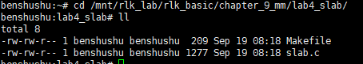
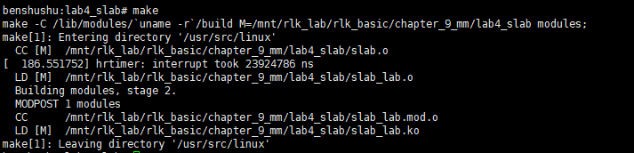
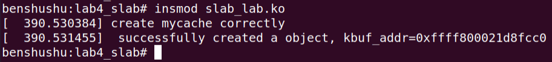
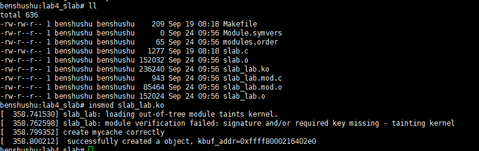
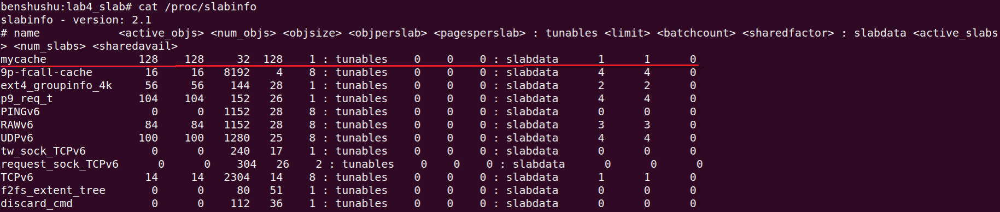
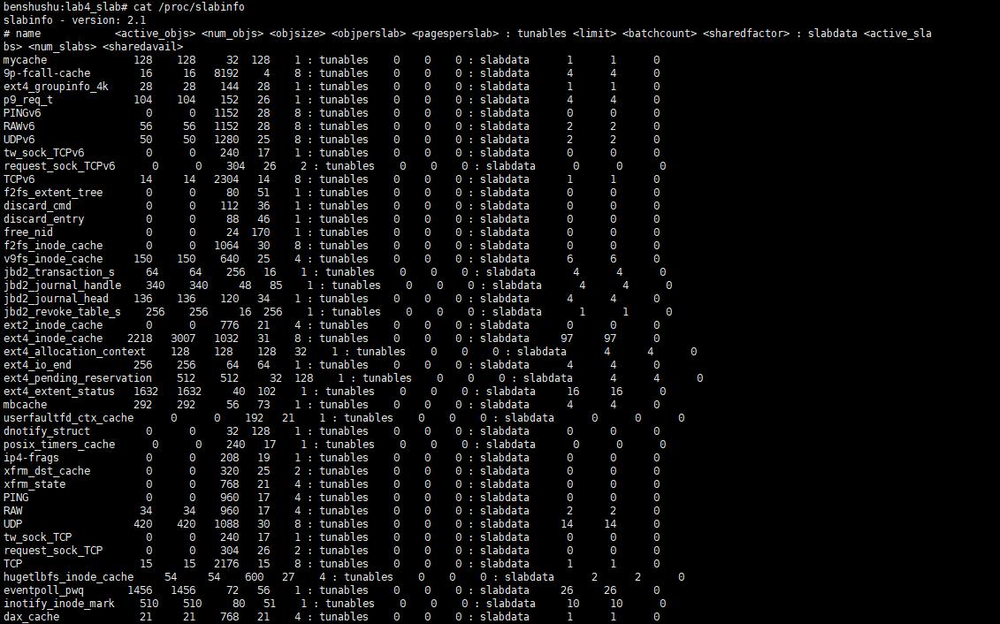
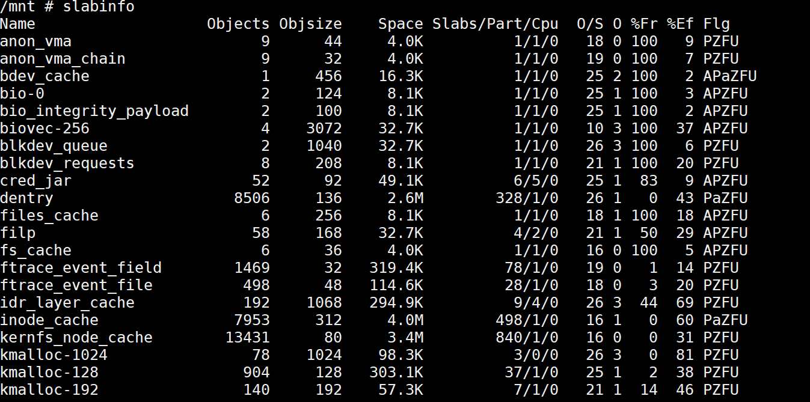
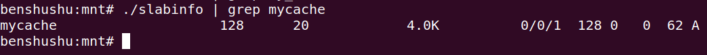
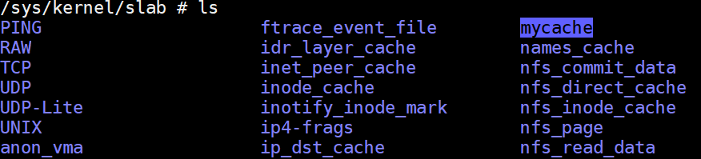
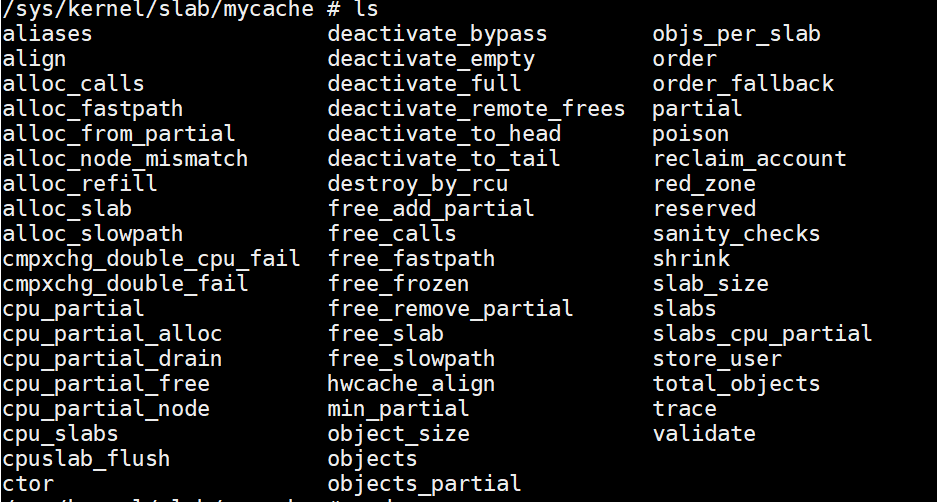

# 实验 9-4：slab

## 1．实验目的

了解和熟悉使用 slab 机制分配内存，并理解 slab 机制的原理。

## 2．实验要求

​		（1）编写一个内核模块

​		创建名为“mycache”的 slab 描述符，大小为 20 字节，align 为 8 字节，flags 为0。然后从这个 slab 描述符中分配一个空闲对象。

​		（2）查看系统当前的所有的 slab

## 3．实验步骤

## 下面是本实验的实验步骤。

### 启动 QEMU+runninglinuxkernel。

```shell
$ ./run_rlk_arm64.sh run
```

### 进入本实验的参考代码。

```shell
# cd /mnt/rlk_lab/rlk_basic/chapter_9_mm/lab4_slab/
```



### 编译内核模块。

```shell
benshushu:lab4_slab# make
make -C /lib/modules/`uname -r`/build 
M=/mnt/rlk_lab/rlk_basic/chapter_9_mm/lab4_slab modules;
make[1]: Entering directory '/usr/src/linux'
 CC [M] /mnt/rlk_lab/rlk_basic/chapter_9_mm/lab4_slab/slab.o
 LD [M] /mnt/rlk_lab/rlk_basic/chapter_9_mm/lab4_slab/slab_lab.o
 Building modules, stage 2.
 MODPOST 1 modules
 CC /mnt/rlk_lab/rlk_basic/chapter_9_mm/lab4_slab/slab_lab.mod.o
 LD [M] /mnt/rlk_lab/rlk_basic/chapter_9_mm/lab4_slab/slab_lab.ko
make[1]: Leaving directory '/usr/src/linux'
```

```makefile
BASEINCLUDE ?= /lib/modules/`uname -r`/build

slab_lab-objs := slab.o

obj-m	:= slab_lab.o
all :
	$(MAKE) -C $(BASEINCLUDE) M=$(PWD) modules;

clean:
	$(MAKE) -C $(BASEINCLUDE) M=$(PWD) clean;
	rm -f *.ko;
```



### 加载内核模块。

```
insmod slab_lab.ko
```





### 查看/proc/slabinfo 信息

```
cat /proc/slabinfo
```





其中：

-  name：表示该 slab 对象的名称


-  active_objs：活跃对象的个数


-  num_objs：对象的个数


-  objsize：对象的大小


-  objperslab：表示一个 slab 中有多少个对象


-  pagesperslab：表示一个 slab 占用有多少个物理页面。


-  tunables：表示可调参数。对于使用 slab 分配器，我们可以设置这些可调参数，对于 slub 分配器，这些参数不可调。


### 另外也使用 slabinfo 命令来查看。读者需要重新编译一下 slabinfo 这个程序。

​		在 ubuntu 主机上，先把 slabinfo.c 文件拷贝到 QEMU 虚拟机里。

```
$ cd /home/rlk/rlk/runninglinuxkernel_5.0
$ cp tools/vm/slabinfo.c kmodules
```

​		然后在 QEMU 虚拟机中编译 slabinfo。

```
benshushu:mnt# cd /mnt/
benshushu:mnt# gcc slabinfo.c -o slabinfo
benshushu:mnt# ./slabinfo 
Name Objects Objsize Space Slabs/Part/Cpu O/S 
O %Fr %Ef Flg
9p-fcall-cache 16 8192 131.0K 0/0/4 4 3 0 100
mm_struct 68 920 65.5K 0/0/4 17 2 0 95 
A
mnt_cache 273 384 106.4K 5/0/8 21 1 0 98 
A
mycache 128 20 4.0K 0/0/1 128 0 0 62 A
names_cache 32 4096 131.0K 0/0/4 8 3 0 100
A
```



​		读者可以使用 grep 命令来快速查找。



​		==slabinfo 命令显示了当前系统所有 slab 的信息。该 slabinfo 命令的源代码是在：==

​		/home/rlk/rlk/runninglinuxkernel_5.0/tools/vm/slabinfo.c 文件。

- 第 1 列：name 显示 slab 的名称


- 第 2 列：Objects 表示对象的个数。


- 第 3 列：Objsize 表示对象的大小


- 第 4 列：Space 表示一个 slab 占用的内存大小。


- 第 5 列：Slabs/Part/Cpu，其中 slabs 表示有多少个 slab，part 表示


- 第 6 列：O/S 表示一个 slab 中有多少个对象。


​		新创建 slab 缓存时会在 sysfs 虚拟文件系统（/sys/kernel/slab）中新建一个对应的目录。



​		进入/sys/kernel/slab/mycache 目录，我们可以查看该 slab 缓存中众多的参数。



这里给读者留两个问题：

1. 本实验的驱动代码中分配的 slab 对象大小为 20 字节，为啥/proc/slabinfo 中显示 objsize 为 192 字节，而 slabinfo 命令显示的 Objsize 为 20 字节？

2. 为什么有的同学在 slabinfo 中找不到新创建的 slab？使用“slabinfo | grep mycache”找不到，而且在/proc/slabinfo 中也找不到。

## 4．参考代码

创建 slab 的代码如下。

```
#include <linux/module.h>
#include <linux/mm.h>
#include <linux/slab.h>
#include <linux/init.h>

static char *kbuf;
static int size = 20;
static struct kmem_cache *my_cache;
module_param(size, int, 0644);

static int __init my_init(void)
{
    /* 创建一个内存缓存 */
    if (size > KMALLOC_MAX_SIZE) {
        pr_err("size=%d is too large; you can't have more than %lu!\n",
               size, KMALLOC_MAX_SIZE);
        return -1;
    }

    my_cache = kmem_cache_create("mycache", size, 0, SLAB_HWCACHE_ALIGN, NULL);
    if (!my_cache) {
        pr_err("kmem_cache_create failed\n");
        return -ENOMEM;
    }
    pr_info("create mycache correctly\n");

    /* 分配一个内存缓存对象 */
    kbuf = kmem_cache_alloc(my_cache, GFP_ATOMIC);
    if (!kbuf) {
        pr_err("failed to create a cache object\n");
        (void)kmem_cache_destroy(my_cache);
        return -1;
    }
    pr_info("successfully created an object, kbuf_addr=0x%p\n", kbuf);

    return 0;
}

static void __exit my_exit(void)
{
    /* 销毁内存缓存对象 */
    kmem_cache_free(my_cache, kbuf);
    pr_info("destroyed a cache object\n");

    /* 销毁内存缓存 */
    kmem_cache_destroy(my_cache);
    pr_info("destroyed mycache\n");
}

module_init(my_init);
module_exit(my_exit);

MODULE_LICENSE("GPL v2");
MODULE_AUTHOR("Ben ShuShu");

```

​		第 25 行，kmem_cache_create()用来创建一个 slab 缓存。读者需要注意该函数每个形参的作用。kmem_cache_create()函数的原型实现在 mm/slab_common.c 文件中

```
struct kmem_cache *
kmem_cache_create(const char *name, size_t size, size_t align,
 unsigned long flags, void (*ctor)(void *))
```

​		其 中 flags 参数表示创建 slab 缓存的一些行为 ， 这些标志位定义在include/linux/slab.h 头文件中。其中 SLAB_HWCACHE_ALIGN 表示 slab 对象的大小要和硬件高速缓存大小对齐。

```
/*
* Flags to pass to kmem_cache_create().
* The ones marked DEBUG are only valid if CONFIG_SLAB_DEBUG is set.
*/
#define SLAB_DEBUG_FREE 0x00000100UL /* DEBUG: Perform (expensive) checks 
on free */
#define SLAB_RED_ZONE 0x00000400UL /* DEBUG: Red zone objs in a cache 
*/
#define SLAB_POISON 0x00000800UL /* DEBUG: Poison objects */
#define SLAB_HWCACHE_ALIGN 0x00002000UL /* Align objs on cache lines */
#define SLAB_CACHE_DMA 0x00004000UL /* Use GFP_DMA memory */
#define SLAB_STORE_USER 0x00010000UL /* DEBUG: Store the last owner for 
bug hunting */
#define SLAB_PANIC 0x00040000UL /* Panic if kmem_cache_create() fails */
```

​		第 30 行，kmem_cache_alloc()函数从刚才创建的 slab 缓存中分配一个对象。kmem_cache_alloc()函数的实现定义在 mm/slub.c 文件中。

```
void *kmem_cache_alloc(struct kmem_cache *s, gfp_t gfpflags)
```

​		读者需要注意这里的gfpflags和kmem_cache_create()函数中的flags是不一样的。这个 gfpflags 是用来控制 slab 机制中分配物理页面的分配掩码。这些分配掩码定义在include/linux/gfp.h 头文件中。

```
/* This equals 0, but use constants in case they ever change */
#define GFP_NOWAIT (GFP_ATOMIC & ~__GFP_HIGH)
/* GFP_ATOMIC means both !wait (__GFP_WAIT not set) and use emergency pool */
#define GFP_ATOMIC (__GFP_HIGH)
#define GFP_NOIO (__GFP_WAIT)
#define GFP_NOFS (__GFP_WAIT | __GFP_IO)
#define GFP_KERNEL (__GFP_WAIT | __GFP_IO | __GFP_FS)
#define GFP_TEMPORARY (__GFP_WAIT | __GFP_IO | __GFP_FS | \
__GFP_RECLAIMABLE)
#define GFP_USER (__GFP_WAIT | __GFP_IO | __GFP_FS | __GFP_HARDWALL)
#define GFP_HIGHUSER (GFP_USER | __GFP_HIGHMEM)
#define GFP_HIGHUSER_MOVABLE (GFP_HIGHUSER | __GFP_MOVABLE)
#define GFP_IOFS (__GFP_IO | __GFP_FS)
#define GFP_TRANSHUGE (GFP_HIGHUSER_MOVABLE | __GFP_COMP | \
__GFP_NOMEMALLOC | __GFP_NORETRY | __GFP_NOWARN | \
__GFP_NO_KSWAPD)
```

​		我们最后来研究一下在实验步骤中留下来的两个问题。

1. 本实验的驱动代码中分配的 slab 对象大小为 20 字节，为啥/proc/slabinfo 中显示 objsize 为 192 字节，而 slabinfo 命令显示的 Objsize 为 20 字节？

​		提示：读者需要注意在 struct kmem_cache 数据结构中有两个成员，一个是object_size，表示对象原本的大小，另外一个是 size，表示 slab 分配器最终为每一个对象实际分配的大小。

```
<mm/slab.h>
struct kmem_cache {
unsigned int object_size;/* The original size of the object */
unsigned int size; /* The aligned/padded/added on size */
unsigned int align; /* Alignment as calculated */
unsigned long flags; /* Active flags on the slab */
const char *name; /* Slab name for sysfs */
int refcount; /* Use counter */
void (*ctor)(void *); /* Called on object slot creation */
struct list_head list; /* List of all slab caches on the system */
};
```

​		通常 size 要大于或者等于 object_size。为什么呢？

​		我们看 kmem_cache_create()函数就会发现，有很多情况下需要把对象的大小设置更大一点。比如，SLAB_HWCACHE_ALIGN 标志位，需要和高速缓存对齐，见calculate_alignment()函数。

```
unsigned long calculate_alignment(unsigned long flags,
unsigned long align, unsigned long size)
{
if (flags & SLAB_HWCACHE_ALIGN) {
unsigned long ralign = cache_line_size();
while (size <= ralign / 2)
ralign /= 2;
align = max(align, ralign);
}
if (align < ARCH_SLAB_MINALIGN)
align = ARCH_SLAB_MINALIGN;
return ALIGN(align, sizeof(void *));
}
```

​		另外，在__kmem_cache_create()函数里，当创建 slab 缓存的 flags 里设置了SLAB_RED_ZONE 时候，size 会变大。

```
if (flags & SLAB_RED_ZONE) {
ralign = REDZONE_ALIGN;
/* If redzoning, ensure that the second redzone is suitably
* aligned, by adjusting the object size accordingly. */
size += REDZONE_ALIGN - 1;
size &= ~(REDZONE_ALIGN - 1);
}
```

2. 为什么有的同学在 slabinfo 中找不到新创建的 slab？使用“slabinfo | grep mycache”找不到，而且在/proc/slabinfo 中也找不到。

​		提示：使用 kmem_cache_create ()函数创建 slab 缓存时会去检查要创建的这个 slab缓存是否可以复用现有的 slab 缓存。如果可以复用的话，那么就不会新创建 slab 缓存，见__kmem_cache_alias()函数。

------

### 代码功能概述

该内核模块展示了如何创建、分配、使用并销毁一个 **slab 缓存**，它利用了 `kmem_cache_create`、`kmem_cache_alloc` 和 `kmem_cache_destroy` 等函数来管理内存。

- **slab 分配器** 是一种高效的内存管理方法，适合频繁分配和释放固定大小的对象。通过这种方法可以减少内存碎片，提高内存分配效率。

模块加载时，会创建一个指定大小的内存缓存，然后从该缓存中分配一个内存块。卸载时，模块会释放该内存块并销毁缓存。

#### 详细注释及代码分析

```C
c复制代码#include <linux/module.h>
#include <linux/mm.h>
#include <linux/slab.h>
#include <linux/init.h>

// 定义全局变量
static char *kbuf;  // 保存分配的缓存对象的指针
static int size = 20;  // 默认缓存大小（可以通过模块参数调整）
static struct kmem_cache *my_cache;  // kmem_cache 指针，用于管理内存缓存
module_param(size, int, 0644);  // 允许通过模块参数调整 size

/* 模块初始化函数 */
static int __init my_init(void)
{
    /* 创建一个内存缓存 */
    if (size > KMALLOC_MAX_SIZE) {  // 判断所需大小是否超出最大限制
        pr_err("size=%d is too large; you can't have more than %lu!\n",
               size, KMALLOC_MAX_SIZE);  // 如果过大，输出错误并返回
        return -1;
    }

    // 创建缓存，指定对象大小为 size 字节，对象对齐方式为 SLAB_HWCACHE_ALIGN
    my_cache = kmem_cache_create("mycache", size, 0, SLAB_HWCACHE_ALIGN, NULL);
    if (!my_cache) {  // 如果创建失败，输出错误信息并返回内存不足错误
        pr_err("kmem_cache_create failed\n");
        return -ENOMEM;
    }
    pr_info("create mycache correctly\n");  // 创建成功，输出提示信息

    /* 分配一个缓存对象 */
    kbuf = kmem_cache_alloc(my_cache, GFP_ATOMIC);  // 从缓存中分配一个对象
    if (!kbuf) {  // 如果分配失败，输出错误信息，销毁缓存并返回错误
        pr_err("failed to create a cache object\n");
        (void)kmem_cache_destroy(my_cache);  // 销毁缓存
        return -1;
    }
    pr_info("successfully created an object, kbuf_addr=0x%p\n", kbuf);  // 分配成功，输出分配对象的地址

    return 0;
}

/* 模块卸载函数 */
static void __exit my_exit(void)
{
    /* 销毁内存缓存对象 */
    kmem_cache_free(my_cache, kbuf);  // 释放先前分配的缓存对象
    pr_info("destroyed a cache object\n");

    /* 销毁内存缓存 */
    kmem_cache_destroy(my_cache);  // 销毁缓存
    pr_info("destroyed mycache\n");
}

module_init(my_init);  // 指定模块初始化函数
module_exit(my_exit);  // 指定模块退出函数

MODULE_LICENSE("GPL v2");  // 定义许可证
MODULE_AUTHOR("Ben ShuShu");  // 模块作者信息
```

#### 代码分析

1. **slab 缓存的创建**：
   - 使用 `kmem_cache_create` 函数来创建缓存，它用于分配对象大小为 `size` 字节的缓存对象。
   - 参数说明：
     - `"mycache"`：缓存的名字，出现在 `/proc/slabinfo` 中。
     - `size`：每个缓存对象的大小。
     - `0`：对象的偏移对齐大小，通常为 `0` 表示无特殊对齐要求。
     - `SLAB_HWCACHE_ALIGN`：缓存对象按照硬件缓存行对齐，提高访问效率。
     - `NULL`：构造函数，用于初始化每个缓存对象，这里不需要。
2. **内存对象的分配**：
   - 使用 `kmem_cache_alloc` 分配缓存中的一个对象，分配时传递 `GFP_ATOMIC` 标志，表示该分配在中断上下文中调用，不会引发睡眠。
   - 如果分配失败，则会输出错误信息并销毁缓存。
3. **缓存对象和缓存的释放**：
   - 在模块卸载时，使用 `kmem_cache_free` 释放先前分配的缓存对象，然后使用 `kmem_cache_destroy` 销毁缓存。
4. **模块参数控制**：
   - 使用 `module_param` 宏允许用户在加载模块时通过命令行参数调整 `size` 变量的值。例如，可以使用 `insmod mymodule.ko size=100` 来改变缓存的大小。
   - 参数权限设置为 `0644`，表示用户可以读取和修改该参数。

#### 内存管理分析

1. **kmem_cache_create**：
   - `kmem_cache_create` 是一种高级的内核内存分配方式，它为固定大小的对象提供了一种高效的分配方式。与 `kmalloc` 不同，它可以减少碎片化并提供更高的内存分配性能，尤其适合频繁分配和释放的情况。
2. **GFP_ATOMIC**：
   - 在 `kmem_cache_alloc` 中使用 `GFP_ATOMIC`，表示该分配不允许睡眠，因此适合在中断上下文或其他不能阻塞的环境中使用。
   - 如果内存不足，`GFP_ATOMIC` 分配将直接返回失败，而不会等待内存释放。
3. **内存释放**：
   - 在卸载模块时，确保已经释放了之前分配的对象，然后销毁缓存。这是内存管理中的重要步骤，以防止内存泄漏。

#### 总结

- 该模块展示了如何使用 `slab` 分配器进行内存管理。`kmem_cache_create` 提供了更高效的内存分配，特别是当需要频繁分配和释放相同大小的对象时。
- 通过这种方式，可以优化内存的使用，减少内存碎片，提高系统性能。

------

