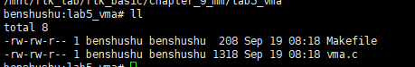
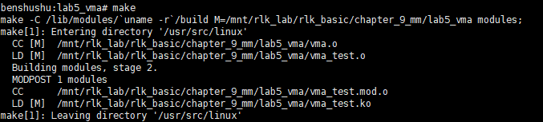
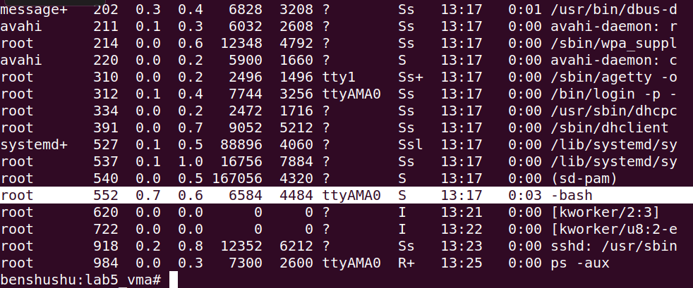
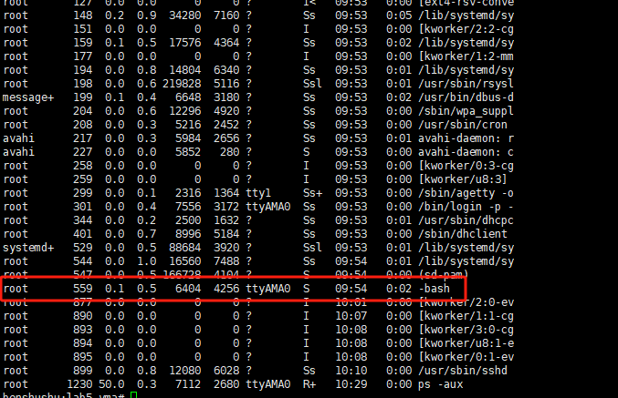
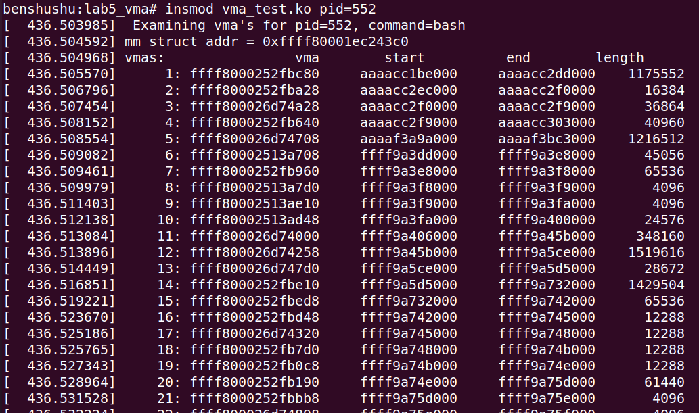
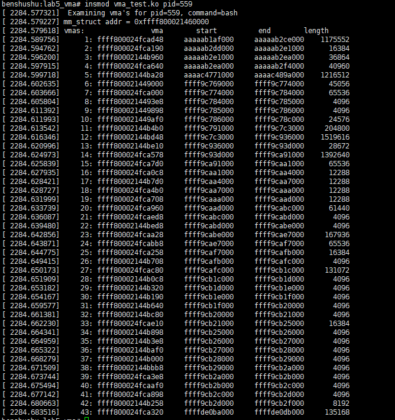

# 实验 9-5：VMA

## 1．实验目的

理解进程地址空间的管理，特别是理解 VMA 的相关操作。

## 2．实验要求

编写一个内核模块。遍历一个用户进程中所有的 VMA，并且打印这些 VMA 的

属性信息，比如 VMA 的大小，起始地址等。

然后通过比较/proc/pid/maps 中显示的信息看看编写的内核模块是否正确。

## 3． 实验步骤

## 下面是本实验的实验步骤。

### 启动 QEMU+runninglinuxkernel。

```
$ ./run_rlk_arm64.sh run
```

### 进入本实验的参考代码。

```shell
# cd /mnt/rlk_lab/rlk_basic/chapter_9_mm/lab5_vma
```



### 编译内核模块。

```
benshushu:lab5_vma# make
make -C /lib/modules/`uname -r`/build 
M=/mnt/rlk_lab/rlk_basic/chapter_9_mm/lab5_vma modules;
make[1]: Entering directory '/usr/src/linux'
 CC [M] /mnt/rlk_lab/rlk_basic/chapter_9_mm/lab5_vma/vma.o
 LD [M] /mnt/rlk_lab/rlk_basic/chapter_9_mm/lab5_vma/vma_test.o
 Building modules, stage 2.
 MODPOST 1 modules
 LD [M] /mnt/rlk_lab/rlk_basic/chapter_9_mm/lab5_vma/vma_test.ko
make[1]: Leaving directory '/usr/src/linux'
```

```makefile
BASEINCLUDE ?= /lib/modules/`uname -r`/build

vma_test-objs := vma.o

obj-m	:= vma_test.o
all :
	$(MAKE) -C $(BASEINCLUDE) M=$(PWD) modules;

clean:
	$(MAKE) -C $(BASEINCLUDE) M=$(PWD) clean;
	rm -f *.ko;
```



### 加载内核模块

```
ps -aux
```

​		这个 vma_test.ko 内核模块可以设置内核参数，pid。使用“ps -aux”命令来查看系统中所有的进程。





​		我们选择使用“/bin/sh”进程，它的 PID 号为 552。

```
insmod vma_test.ko pid=559
```





​		加载 vma_test.ko 内核模块之后，打印这个进程所有的 VMA 区域。从上图可以看到，这个进程包含了 n 个 VMA 区域。

-  第 1 个 vma 区域，VMA 区域的 struct vm_area_struct 数据结构 vma 的地址。

VMA 区域的起始地址为 0xaaaacc1be000，结束地址 0xaaaacc2dd000，长度

为 1175552 字节。

-  第 2 个 vma 区域，VMA 区域的 struct vm_area_struct 数据结构 vma 的地址。

VMA 区域的起始地址为 0x aaaacc2ec000，结束地址 0xaaaacc2f0000，长度

为 16384 字节。

-  …

​		Linux 系统的“proc”虚拟文件系统有记录每一个进程的各种信息。其中“/proc/pid/smaps”记录了进程地址空间的 VMA 区域的情况。使用 cat 命令来查看，并且和我们编写的驱动模块打印的信息进行对比和相互印证。

```
benshushu:lab5_vma# cat /proc/552/smaps
aaaacc1be000-aaaacc2dd000 r-xp 00000000 fe:10 131177 
/bin/bash
Size: 1148 kB
KernelPageSize: 4 kB
MMUPageSize: 4 kB
Rss: 1020 kB
Pss: 1020 kB
Shared_Clean: 0 kB
Shared_Dirty: 0 kB
Private_Clean: 1020 kB
Private_Dirty: 0 kB
Referenced: 1020 kB
Anonymous: 0 kB
LazyFree: 0 kB
AnonHugePages: 0 kB
ShmemPmdMapped: 0 kB
Shared_Hugetlb: 0 kB
Private_Hugetlb: 0 kB
Swap: 0 kB
SwapPss: 0 kB
Locked: 0 kB
THPeligible: 0
VmFlags: rd ex mr mw me dw 
aaaacc2ec000-aaaacc2f0000 r--p 0011e000 fe:10 131177 
/bin/bash
Size: 16 kB
KernelPageSize: 4 kB
MMUPageSize: 4 kB
Rss: 16 kB
Pss: 16 kB
Shared_Clean: 0 kB
Shared_Dirty: 0 kB
Private_Clean: 0 kB
Private_Dirty: 16 kB
Referenced: 16 kB
Anonymous: 16 kB
LazyFree: 0 kB
AnonHugePages: 0 kB
ShmemPmdMapped: 0 kB
Shared_Hugetlb: 0 kB
Private_Hugetlb: 0 kB
Swap: 0 kB
SwapPss: 0 kB
Locked: 0 kB
THPeligible: 0
VmFlags: rd mr mw me dw ac 
aaaacc2f0000-aaaacc2f9000 rw-p 00122000 fe:10 131177 
/bin/bash
Size: 36 kB
KernelPageSize: 4 kB
MMUPageSize: 4 kB
Rss: 36 kB
Pss: 36 kB
Shared_Clean: 0 kB
Shared_Dirty: 0 kB
Private_Clean: 0 kB
Private_Dirty: 36 kB
Referenced: 36 kB
Anonymous: 36 kB
LazyFree: 0 kB
AnonHugePages: 0 kB
ShmemPmdMapped: 0 kB
Shared_Hugetlb: 0 kB
Private_Hugetlb: 0 kB
Swap: 0 kB
SwapPss: 0 kB
Locked: 0 kB
THPeligible: 0
VmFlags: rd wr mr mw me dw ac 
aaaacc2f9000-aaaacc303000 rw-p 00000000 00:00 0 
Size: 40 kB
KernelPageSize: 4 kB
MMUPageSize: 4 kB
Rss: 28 kB
Pss: 28 kB
Shared_Clean: 0 kB
Shared_Dirty: 0 kB
Private_Clean: 0 kB
Private_Dirty: 28 kB
Referenced: 28 kB
Anonymous: 28 kB
LazyFree: 0 kB
AnonHugePages: 0 kB
ShmemPmdMapped: 0 kB
Shared_Hugetlb: 0 kB
Private_Hugetlb: 0 kB
Swap: 0 kB
SwapPss: 0 kB
Locked: 0 kB
THPeligible: 1
VmFlags: rd wr mr mw me ac 
aaaaf3a9a000-aaaaf3bc3000 rw-p 00000000 00:00 0 [heap]
Size: 1188 kB
KernelPageSize: 4 kB
MMUPageSize: 4 kB
Rss: 1152 kB
Pss: 1152 kB
Shared_Clean: 0 kB
Shared_Dirty: 0 kB
Private_Clean: 0 kB
Private_Dirty: 1152 kB
Referenced: 1152 kB
Anonymous: 1152 kB
LazyFree: 0 kB
AnonHugePages: 0 kB
ShmemPmdMapped: 0 kB
Shared_Hugetlb: 0 kB
Private_Hugetlb: 0 kB
Swap: 0 kB
SwapPss: 0 kB
Locked: 0 kB
THPeligible: 1
VmFlags: rd wr mr mw me ac
```


## 4．参考代码

VMA 实验的参考代码如下。

```C
#include <linux/module.h>
#include <linux/init.h>
#include <linux/mm.h>
#include <linux/sched.h>

static int pid;
module_param(pid, int, S_IRUGO);

static void printit(struct task_struct *tsk)
{
    struct mm_struct *mm;
    struct vm_area_struct *vma;
    int j = 0;
    unsigned long start, end, length;

    mm = tsk->mm;
    pr_info("mm = %p\n", mm);
    vma = mm->mmap;

    /* 使用 mmap_sem 读写信号量进行保护 */
    down_read(&mm->mmap_sem);
    pr_info("vmas: vma start end length\n");

    while (vma) {
        j++;
        start = vma->vm_start;
        end = vma->vm_end;
        length = end - start;
        pr_info("%6d: %16p %12lx %12lx %8lx=%8ld\n",
                j, vma, start, end, length, length);
        vma = vma->vm_next;
    }
    up_read(&mm->mmap_sem);
}

static int __init my_init(void)
{
    struct task_struct *tsk;
    if (pid == 0) {
        tsk = current;
        pid = current->pid;
    } else {
        tsk = pid_task(find_vpid(pid), PIDTYPE_PID);
    }
    if (!tsk)
        return -1;
    pr_info("Examining vma's for pid=%d, command=%s\n", pid, tsk->comm);
    printit(tsk);
    return 0;
}

static void __exit my_exit(void)
{
    pr_info("Module Unloading\n");
}

module_init(my_init);
module_exit(my_exit);

MODULE_LICENSE("GPL v2");
MODULE_AUTHOR("Ben ShuShu");

```

​		第 38~52 行是内核模块的初始化函数 my_init。

​		第 41~46 行，pid 是内核模块的参数，用户在加载内核模块时可传递参数（某个进程的 pid）进来。如果没有传递 pid 参数，那么会使用当前进程。在本实验中，当前进程就是 insmod 这个命令执行时的进程。

​		第 45 行，从 pid 可以获取到进程的描述符 struct task_struct 数据结构。

​		第 49 行，打印接下来我们要查看哪个进程的 vma。

​		第 50 行，调用 printit 函数。

​		第 9~36 行，就是本实验的核心函数。

​		第 16 行，获取待检查进程的内存描述符 struct mm_struct 数据结构 mm。

​		第 18 行，mm 数据结构中有一个 VMA 链表的头，mm->mmap。

​		第 22 行，接下来我们需要遍历 VMA 链表了，所以我们需要使用 down_read()函数来申请一个读者信号量。注意，我们这这里只是读取 VMA 链表，不会修改这个链表，所以申请读者类型的信号量就够了。若需要对 VMA 链表进行修改的话，我们就需要申请写者类型的信号量。

​		第 26~34 行，遍历 VMA 链表，并对每个 VMA 打印其起始地址，结束地址和长度等信息。

​		第 35 行，释放读者信号量。

------

### 代码功能概述

该代码实现了一个内核模块，用于打印特定进程的虚拟内存区域 (VMA)。它通过读取给定进程的虚拟内存区域来展示内存映射的范围，并输出与 VMA 相关的信息，如起始地址、结束地址和区域的长度。可以通过模块参数传递进程的 PID，如果不传递，默认使用当前进程的 PID。

#### 详细注释及代码分析

```C
#include <linux/module.h>
#include <linux/init.h>
#include <linux/mm.h>
#include <linux/sched.h>

static int pid;  // 用于存储传递进来的进程 ID（PID）
module_param(pid, int, S_IRUGO);  // 允许从模块加载命令行传递 PID 作为参数

// 函数 printit 打印任务结构（task_struct）中与虚拟内存区域 (VMA) 相关的信息
static void printit(struct task_struct *tsk)
{
    struct mm_struct *mm;  // 进程的内存描述符
    struct vm_area_struct *vma;  // 进程的虚拟内存区域
    int j = 0;  // 计数器
    unsigned long start, end, length;  // VMA 起始地址、结束地址及区域长度

    mm = tsk->mm;  // 获取进程的内存描述符
    pr_info("mm = %p\n", mm);  // 打印内存描述符的地址
    vma = mm->mmap;  // 获取进程的虚拟内存区域链表的头

    // 使用 mmap_sem 信号量对虚拟内存区域的访问进行保护
    down_read(&mm->mmap_sem);  // 获取 mmap 读信号量（防止写操作）

    pr_info("vmas: vma start end length\n");

    // 遍历进程的所有虚拟内存区域 (VMA)
    while (vma) {
        j++;  // 增加区域计数器
        start = vma->vm_start;  // VMA 起始地址
        end = vma->vm_end;  // VMA 结束地址
        length = end - start;  // VMA 区域长度

        // 打印当前 VMA 的相关信息
        pr_info("%6d: %16p %12lx %12lx %8lx=%8ld\n",
                j, vma, start, end, length, length);

        vma = vma->vm_next;  // 获取下一个 VMA
    }

    up_read(&mm->mmap_sem);  // 释放 mmap 读信号量
}

// 模块初始化函数，用于检查并打印进程的 VMA 信息
static int __init my_init(void)
{
    struct task_struct *tsk;

    // 如果没有传递 PID 参数，则默认使用当前进程
    if (pid == 0) {
        tsk = current;  // 获取当前进程的 task_struct
        pid = current->pid;  // 获取当前进程的 PID
    } else {
        // 查找指定 PID 对应的 task_struct 结构
        tsk = pid_task(find_vpid(pid), PIDTYPE_PID);
    }

    if (!tsk)  // 如果没有找到对应的进程，返回错误
        return -1;

    // 打印找到的进程信息，包括 PID 和命令名
    pr_info("Examining vma's for pid=%d, command=%s\n", pid, tsk->comm);

    // 调用 printit 函数打印虚拟内存区域信息
    printit(tsk);

    return 0;
}

// 模块退出函数，表示模块即将卸载
static void __exit my_exit(void)
{
    pr_info("Module Unloading\n");  // 打印卸载信息
}

module_init(my_init);  // 指定模块加载时调用的初始化函数
module_exit(my_exit);  // 指定模块卸载时调用的函数

MODULE_LICENSE("GPL v2");  // 定义模块的许可证
MODULE_AUTHOR("Ben ShuShu");  // 定义模块的作者
```

#### 代码分析

1. **`module_param(pid, int, S_IRUGO)`**：
   - 通过该宏，模块可以在加载时接收一个整数类型的 `pid` 参数，用于指定要分析的进程。如果不传递 `pid`，则默认为当前进程。
2. **`struct mm_struct \*mm;`**：
   - `mm_struct` 是内核中的结构体，用于描述进程的内存管理信息，包括进程的地址空间、虚拟内存区域 (VMA) 链表等。
   - 每个进程都有一个 `mm_struct` 结构，用来管理该进程的虚拟内存布局。
3. **使用 `mmap_sem` 进行并发保护**：
   - `mmap_sem` 是进程的虚拟内存访问控制信号量。在访问进程的内存映射（VMA）时，需要获取该信号量来确保内存区域的安全访问。`down_read` 用于获取读锁，防止其他写操作修改内存映射。
4. **虚拟内存区域 (VMA)**：
   - 进程的虚拟地址空间分为不同的区域，这些区域由 `vm_area_struct` 链表管理。每个区域可能对应不同的内存对象，例如堆、栈、代码段等。
   - `vma` 是 `vm_area_struct` 的实例，代表进程的一个虚拟内存区域。
   - 代码通过 `tsk->mm->mmap` 获取进程的第一个 `vma`，并使用 `vm_next` 遍历该进程的所有虚拟内存区域。
5. **打印 VMA 信息**：
   - `start = vma->vm_start;` 和 `end = vma->vm_end;` 分别表示 VMA 的起始地址和结束地址，`length = end - start;` 则表示该 VMA 的大小。
   - 循环中，逐一遍历该进程的每个虚拟内存区域，并打印出相关信息。
6. **模块初始化和退出**：
   - `my_init` 是模块加载时的初始化函数。如果指定了 `pid` 参数，则会查找对应的进程并打印其 VMA 信息。如果未指定 `pid`，则默认打印当前进程的 VMA 信息。
   - `my_exit` 在模块卸载时被调用，表示模块被成功卸载。

#### 运行流程

1. 模块加载时：
   - 用户可以通过 `insmod mymodule.ko pid=<PID>` 的方式传递一个进程 ID。如果未指定 PID，模块默认获取当前进程的 PID。
   - 然后，模块会根据 PID 查找对应进程，并通过遍历该进程的虚拟内存区域 (VMA) 链表，打印每个区域的起始地址、结束地址、区域大小等信息。
2. 模块卸载时：
   - 模块打印 "Module Unloading" 消息，表示模块已成功从内核中卸载。

#### 使用示例

假设要分析 PID 为 1234 的进程：

```shell
sudo insmod mymodule.ko pid=1234
```

输出将包含该进程的虚拟内存区域信息，例如：

```
Examining vma's for pid=1234, command=bash
vmas: vma start end length
1:  ffffabcdf 7f000 7f000 1000=1000
...
Module Unloading
```

通过这些信息，可以了解指定进程的内存布局情况。

### 总结

该模块展示了如何使用内核 API 获取并打印进程的虚拟内存区域信息。通过遍历 `task_struct` 中的 `mm_struct`，可以输出进程的内存映射，展示进程的地址空间布局。这对于调试进程的内存使用情况、分析内存泄漏等问题非常有帮助。

------

