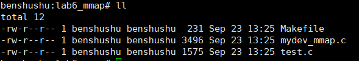
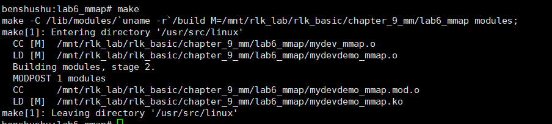
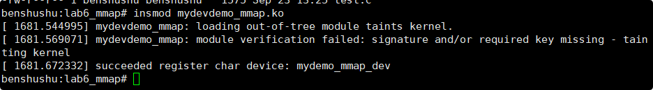
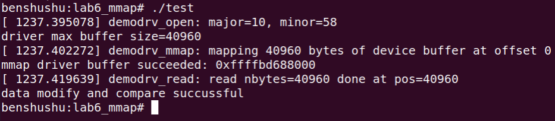
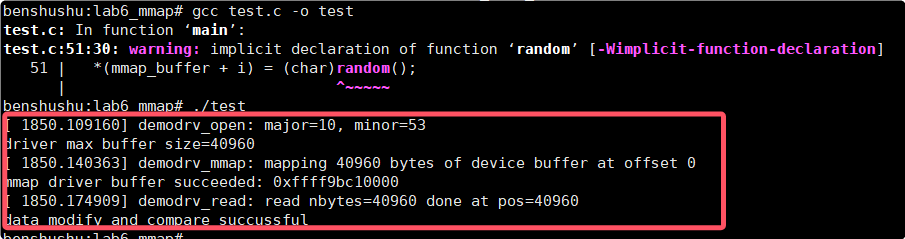

# 实验 9-6：mmap

## 1．实验目的

理解 mmap 系统调用的使用方法以及实现原理。

## 2．实验要求

1）编写一个简单的字符设备程序。分配一段物理内存，然后使用 mmap 方法把

这段物理内存映射到进程地址空间中，用户进程打开这个驱动程序之后就可以读写这

段物理内存了。需要实现 mmap、read 和 write 方法。

2）写一个简单的用户空间的测试程序，来测试这个字符设备驱动，比如测试 open、

mmap、read 和 write 方法。

## 3．实验步骤

下面是本实验的实验步骤。

启动 QEMU+runninglinuxkernel。

```
$ ./run_rlk_arm64.sh run
```

进入本实验的参考代码。

```
# cd /mnt/rlk_lab/rlk_basic/chapter_9_mm/lab6_mmap/
```



编译内核模块

```
benshushu:lab6_mmap# make
make -C /lib/modules/`uname -r`/build 
M=/mnt/rlk_lab/rlk_basic/chapter_9_mm/lab6_mmap modules;
make[1]: Entering directory '/usr/src/linux'
 CC [M] /mnt/rlk_lab/rlk_basic/chapter_9_mm/lab6_mmap/mydev_mmap.o
 LD [M] /mnt/rlk_lab/rlk_basic/chapter_9_mm/lab6_mmap/mydevdemo_mmap.o
 Building modules, stage 2.
 MODPOST 1 modules
make[2]: Warning: File 
'/mnt/rlk_lab/rlk_basic/chapter_9_mm/lab6_mmap/mydevdemo_mmap.mod.c' has 
modification time 0.13 s in the future
 CC /mnt/rlk_lab/rlk_basic/chapter_9_mm/lab6_mmap/mydevdemo_mmap.mod.o
 LD [M] /mnt/rlk_lab/rlk_basic/chapter_9_mm/lab6_mmap/mydevdemo_mmap.ko
make[2]: warning: Clock skew detected. Your build may be incomplete.
make[1]: Leaving directory '/usr/src/linux'
```

```makefile
BASEINCLUDE ?= /lib/modules/`uname -r`/build

mydevdemo_mmap-objs := mydev_mmap.o 

obj-m	:=   mydevdemo_mmap.o
all : 
	$(MAKE) -C $(BASEINCLUDE) M=$(PWD) modules;

clean:
	$(MAKE) -C $(BASEINCLUDE) M=$(PWD) clean;
	rm -f *.ko;
```


### 安装内核模块

```
benshushu:lab6_mmap# insmod mydevdemo_mmap.ko 
[ 1191.122203] succeeded register char device: mydemo_mmap_dev
benshushu:lab6_mmap#
```





### 编译和运行测试程序

```
benshushu:lab6_mmap# gcc test.c -o test
benshushu:lab6_mmap# ./test 
[ 1237.395078] demodrv_open: major=10, minor=58
driver max buffer size=40960
[ 1237.402272] demodrv_mmap: mapping 40960 bytes of device buffer at offset 0
mmap driver buffer succeeded: 0xffffbd688000
[ 1237.419639] demodrv_read: read nbytes=40960 done at pos=40960
data modify and compare succussful
benshushu:lab6_mmap#
```





## 4．参考代码

驱动程序的参考代码如下。

```
#include <linux/module.h>
#include <linux/fs.h>
#include <linux/uaccess.h>
#include <linux/init.h>
#include <linux/miscdevice.h>
#include <linux/device.h>
#include <linux/slab.h>
#include <linux/kfifo.h>

#define DEMO_NAME "my_demo_dev"
static struct device *mydemodrv_device;

/* virtual FIFO device's buffer */
static char *device_buffer;
#define MAX_DEVICE_BUFFER_SIZE (10 * PAGE_SIZE)

#define MYDEV_CMD_GET_BUFSIZE 1 /* defines our IOCTL cmd */

static int demodrv_open(struct inode *inode, struct file *file)
{
    int major = MAJOR(inode->i_rdev);
    int minor = MINOR(inode->i_rdev);

    printk("%s: major=%d, minor=%d\n", __func__, major, minor);

    return 0;
}

static int demodrv_release(struct inode *inode, struct file *file)
{
    return 0;
}

static ssize_t demodrv_read(struct file *file, char __user *buf, size_t count, loff_t *ppos)
{
    int nbytes = simple_read_from_buffer(buf, count, ppos, device_buffer, MAX_DEVICE_BUFFER_SIZE);

    printk("%s: read nbytes=%d done at pos=%d\n", __func__, nbytes, (int)*ppos);

    return nbytes;
}

static ssize_t demodrv_write(struct file *file, const char __user *buf, size_t count, loff_t *ppos)
{
    int nbytes = simple_write_to_buffer(device_buffer, MAX_DEVICE_BUFFER_SIZE, ppos, buf, count);

    printk("%s: write nbytes=%d done at pos=%d\n", __func__, nbytes, (int)*ppos);

    return nbytes;
}

static int demodrv_mmap(struct file *filp, struct vm_area_struct *vma)
{
    unsigned long pfn;
    unsigned long offset = vma->vm_pgoff << PAGE_SHIFT;
    unsigned long len = vma->vm_end - vma->vm_start;

    if (offset >= MAX_DEVICE_BUFFER_SIZE)
        return -EINVAL;
    if (len > (MAX_DEVICE_BUFFER_SIZE - offset))
        return -EINVAL;

    printk("%s: mapping %ld bytes of device buffer at offset %ld\n", __func__, len, offset);

    /* pfn = page_to_pfn(virt_to_page(ramdisk + offset)); */
    pfn = virt_to_phys(device_buffer + offset) >> PAGE_SHIFT;
    vma->vm_page_prot = pgprot_noncached(vma->vm_page_prot);
    if (remap_pfn_range(vma, vma->vm_start, pfn, len, vma->vm_page_prot))
        return -EAGAIN;

    return 0;
}

static long demodrv_unlocked_ioctl(struct file *filp, unsigned int cmd, unsigned long arg)
{
    unsigned long tbs = MAX_DEVICE_BUFFER_SIZE;
    void __user *ioargp = (void __user *)arg;

    switch (cmd) {
    default:
        return -EINVAL;

    case MYDEV_CMD_GET_BUFSIZE:
        if (copy_to_user(ioargp, &tbs, sizeof(tbs)))
            return -EFAULT;
        return 0;
    }
}

static const struct file_operations demodrv_fops = {
    .owner = THIS_MODULE,
    .open = demodrv_open,
    .release = demodrv_release,
    .read = demodrv_read,
    .write = demodrv_write,
    .mmap = demodrv_mmap,
    .unlocked_ioctl = demodrv_unlocked_ioctl,
};

static struct miscdevice mydemodrv_misc_device = {
    .minor = MISC_DYNAMIC_MINOR,
    .name = DEMO_NAME,
    .fops = &demodrv_fops,
};

static int __init simple_char_init(void)
{
    int ret;

    device_buffer = kmalloc(MAX_DEVICE_BUFFER_SIZE, GFP_KERNEL);
    if (!device_buffer)
        return -ENOMEM;

    ret = misc_register(&mydemodrv_misc_device);
    if (ret) {
        printk("failed register misc device\n");
        kfree(device_buffer);
        return ret;
    }

    mydemodrv_device = mydemodrv_misc_device.this_device;

    printk("succeeded register char device: %s\n", DEMO_NAME);

    return 0;
}

static void __exit simple_char_exit(void)
{
    printk("removing device\n");

   

```

​		本实验是基于第 5 章的实验代码修改过来的，接下来我们只看和 mmap 相关的部分。

​		第 99 行，每个字符设备驱动都需要实现一个设备文件操作方法集 struct file_operations。我们这个实验也不例外。本实验需要实现 mmap 方法集，因此在第 105行，添加了读 mmap 方法的实现。 

```
.mmap = demodrv_mmap,
```

​		实现 mmap 方法的函数是 demodrv_mmap，实现在第 59 行。

​		第 59 行。demodrv_mmap()函数有两个参数，一个是 filp，设备文件操作符，另外一个是 vma，表示要映射的用户空间的区间。vma 这个概念在本章实验 5 中已经有说明了。

​		**读者可能会问，第一个参数** **filp** **好理解，那第二个参数** **vma** **是从哪里来的呢？**

​		要弄明白这个问题，需要读懂 Linux 内核的缺页异常和 mmap 机制的实现。有精力的读者可以阅读蓝色版本《奔跑吧 Linux 内核》一书，第 2 章相关内容。

​		第 62 行，vma->vm_pgoff 表示在 VMA 区域中的偏移，通常这个值为 0。

​		第 63 行，len 表示 VMA 区域的长度。

​		第 65~68 行，做一些必要的检查。

​		第 74 行，本实验中 FIFO 设备的内存是 device_buffer，它在 init 时候通过 kmalloc来分配的。kmalloc 分配的内存是物理内存，并且是线性映射的内存，而且是物理上连续的内存。那么我们可以通过 virt_to_phys()来查找到该物理内存的起始的页幁号。

​		**读者需要注意，若 device_buffer 的大小不是以页对齐的话，那么 mmap 做映射的时候需要考虑起始地址对齐的问题，以及 buffer 大小和页对齐的问题。本实验设置的 buffer 大小是 10 \* PAGE_SIZE，而在实际开发过程中，需要考虑对齐的问题。读者需要注意，若 device_buffer 的大小不是以页对齐的话，那么 mmap 做映射的时候需要考虑起始地址对齐的问题，以及 buffer 大小和页对齐的问题。本实验设置的 buffer 大小是 10 \* PAGE_SIZE，而在实际开发过程中，需要考虑对齐的问题。**

​		第 75 行，pgprot_noncached()函数用来关闭 cache。cache 的属性设置是在 PTE 页表中，该函数根据体系结构不的同，来设置硬件 PTE 页表中关于 cache 的相关属性。在 ARM32 和 ARM64 中，它们的 PTE 页表就不相同，该函数的实现也有差异。

​		第 76 行，调用 remap_pfn_range()函数来完成用户空间虚拟内存和物理内存的映射关系。

```
int remap_pfn_range(struct vm_area_struct *vma, unsigned long addr,
 unsigned long pfn, unsigned long size, pgprot_t prot)
```

remap_pfn_range()函数实现在 mm/memory.c 文件中，它的主要功能是把内核态的

物理内存映射到用户空间。它一共有 5 个参数。

-  vma：描述用户空间的虚拟内存

-  addr：要映射的用户空间虚拟内存的起始地址，这个地址必须在 vma 区域里。

-  pfn：物理内存的起始页幁号

-  size：映射的大小

-  prot：映射的属性

------

### 代码功能概述

​		该代码实现了一个简单的字符设备驱动，提供了读取、写入、内存映射和 IOCTL 操作。设备通过内核的 `miscdevice` 注册，主要模拟了一个 FIFO 缓冲区，提供字符设备接口与用户空间程序交互。可以通过 `ioctl` 命令获取设备缓冲区的大小，并支持映射内存到用户空间。

#### 详细注释及代码分析

```C
#include <linux/module.h>
#include <linux/fs.h>
#include <linux/uaccess.h>
#include <linux/init.h>
#include <linux/miscdevice.h>
#include <linux/device.h>
#include <linux/slab.h>
#include <linux/kfifo.h>

#define DEMO_NAME "my_demo_dev"  // 定义设备名
static struct device *mydemodrv_device;  // 保存设备的 device 结构体

/* virtual FIFO device's buffer */
static char *device_buffer;  // 虚拟设备的缓冲区
#define MAX_DEVICE_BUFFER_SIZE (10 * PAGE_SIZE)  // 缓冲区大小定义为10个页面大小

#define MYDEV_CMD_GET_BUFSIZE 1  // 定义用于 IOCTL 的命令，表示获取缓冲区大小

// 打开设备文件时调用
static int demodrv_open(struct inode *inode, struct file *file)
{
    int major = MAJOR(inode->i_rdev);  // 获取设备的主设备号
    int minor = MINOR(inode->i_rdev);  // 获取设备的次设备号

    printk("%s: major=%d, minor=%d\n", __func__, major, minor);

    return 0;  // 打开操作成功
}

// 释放设备文件时调用
static int demodrv_release(struct inode *inode, struct file *file)
{
    return 0;  // 释放操作成功
}

// 设备文件的读操作
static ssize_t demodrv_read(struct file *file, char __user *buf, size_t count, loff_t *ppos)
{
    // 从缓冲区读取数据并传递到用户空间
    int nbytes = simple_read_from_buffer(buf, count, ppos, device_buffer, MAX_DEVICE_BUFFER_SIZE);

    printk("%s: read nbytes=%d done at pos=%d\n", __func__, nbytes, (int)*ppos);

    return nbytes;  // 返回实际读取的字节数
}

// 设备文件的写操作
static ssize_t demodrv_write(struct file *file, const char __user *buf, size_t count, loff_t *ppos)
{
    // 从用户空间写入数据到设备缓冲区
    int nbytes = simple_write_to_buffer(device_buffer, MAX_DEVICE_BUFFER_SIZE, ppos, buf, count);

    printk("%s: write nbytes=%d done at pos=%d\n", __func__, nbytes, (int)*ppos);

    return nbytes;  // 返回实际写入的字节数
}

// 设备的内存映射操作 (mmap)
static int demodrv_mmap(struct file *filp, struct vm_area_struct *vma)
{
    unsigned long pfn;
    unsigned long offset = vma->vm_pgoff << PAGE_SHIFT;  // 获取内存映射的偏移量
    unsigned long len = vma->vm_end - vma->vm_start;  // 获取映射的内存区域长度

    if (offset >= MAX_DEVICE_BUFFER_SIZE)  // 检查偏移是否超出设备缓冲区
        return -EINVAL;
    if (len > (MAX_DEVICE_BUFFER_SIZE - offset))  // 检查映射的内存是否超出缓冲区大小
        return -EINVAL;

    printk("%s: mapping %ld bytes of device buffer at offset %ld\n", __func__, len, offset);

    pfn = virt_to_phys(device_buffer + offset) >> PAGE_SHIFT;  // 将设备缓冲区的虚拟地址转换为物理页帧号
    vma->vm_page_prot = pgprot_noncached(vma->vm_page_prot);  // 将页面保护标志设为非缓存模式
    if (remap_pfn_range(vma, vma->vm_start, pfn, len, vma->vm_page_prot))  // 将物理内存映射到用户空间
        return -EAGAIN;

    return 0;  // 映射成功
}

// IOCTL 操作处理函数
static long demodrv_unlocked_ioctl(struct file *filp, unsigned int cmd, unsigned long arg)
{
    unsigned long tbs = MAX_DEVICE_BUFFER_SIZE;  // 缓冲区大小
    void __user *ioargp = (void __user *)arg;

    switch (cmd) {
    default:
        return -EINVAL;  // 不支持的命令

    case MYDEV_CMD_GET_BUFSIZE:
        if (copy_to_user(ioargp, &tbs, sizeof(tbs)))  // 将缓冲区大小传递给用户空间
            return -EFAULT;
        return 0;
    }
}

// 文件操作结构体定义
static const struct file_operations demodrv_fops = {
    .owner = THIS_MODULE,
    .open = demodrv_open,
    .release = demodrv_release,
    .read = demodrv_read,
    .write = demodrv_write,
    .mmap = demodrv_mmap,
    .unlocked_ioctl = demodrv_unlocked_ioctl,
};

// 定义 miscdevice 结构体，注册为 misc 设备
static struct miscdevice mydemodrv_misc_device = {
    .minor = MISC_DYNAMIC_MINOR,  // 动态分配次设备号
    .name = DEMO_NAME,  // 设备名称
    .fops = &demodrv_fops,  // 文件操作函数指针
};

// 模块初始化函数
static int __init simple_char_init(void)
{
    int ret;

    // 分配设备缓冲区
    device_buffer = kmalloc(MAX_DEVICE_BUFFER_SIZE, GFP_KERNEL);
    if (!device_buffer)
        return -ENOMEM;

    // 注册 misc 设备
    ret = misc_register(&mydemodrv_misc_device);
    if (ret) {
        printk("failed register misc device\n");
        kfree(device_buffer);  // 注册失败时释放分配的内存
        return ret;
    }

    mydemodrv_device = mydemodrv_misc_device.this_device;  // 保存设备指针

    printk("succeeded register char device: %s\n", DEMO_NAME);

    return 0;
}

// 模块卸载函数
static void __exit simple_char_exit(void)
{
    printk("removing device\n");

    kfree(device_buffer);  // 释放设备缓冲区
    misc_deregister(&mydemodrv_misc_device);  // 注销 misc 设备
}

module_init(simple_char_init);  // 注册模块初始化函数
module_exit(simple_char_exit);  // 注册模块卸载函数

MODULE_AUTHOR("Benshushu");
MODULE_LICENSE("GPL v2");
MODULE_DESCRIPTION("simple character device");
```

#### 代码分析

1. **设备初始化与缓冲区分配**：
   - 在模块初始化函数 `simple_char_init()` 中，使用 `kmalloc` 分配了 10 页大小的内存作为设备缓冲区（`device_buffer`）。
   - 成功分配内存后，调用 `misc_register` 注册为一个 misc 设备，misc 设备是一种简单的字符设备，通常用于小型设备的实现。
2. **设备读写操作**：
   - `demodrv_read()` 和 `demodrv_write()` 分别处理读写操作，分别调用 `simple_read_from_buffer()` 和 `simple_write_to_buffer()` 来处理数据缓冲区和用户空间之间的数据传输。
3. **内存映射**：
   - 通过 `demodrv_mmap()` 函数，支持将设备缓冲区映射到用户空间，用户进程可以通过内存映射的方式访问设备缓冲区。使用 `remap_pfn_range()` 完成虚拟内存到物理内存的映射。
4. **IOCTL 支持**：
   - 使用 `demodrv_unlocked_ioctl()` 处理来自用户空间的 IOCTL 请求。该函数目前支持一个命令 `MYDEV_CMD_GET_BUFSIZE`，用于获取设备缓冲区的大小，并将结果通过 `copy_to_user()` 返回给用户。
5. **模块卸载**：
   - 在模块卸载时，通过 `simple_char_exit()` 函数释放分配的缓冲区，并注销设备。保证模块的资源正确释放。

#### 代码运行流程

1. 加载模块时，会初始化设备缓冲区并注册为 misc 设备。该设备的读、写、内存映射和 IOCTL 都可以通过用户空间程序访问。
2. 当用户进程打开设备文件时，会调用 `open` 函数。可以使用标准的 `read` 和 `write` 函数从设备中读取数据或写入数据，数据存储在 `device_buffer` 中。
3. 用户可以通过 `mmap` 将设备缓冲区映射到用户空间，通过访问内存来与设备交互。
4. 模块支持通过 `ioctl` 获取设备缓冲区的大小，返回值通过用户空间缓冲区获取。

#### 总结

该代码展示了一个字符设备驱动的基本功能：读写、内存映射和 IOCTL 操作。

------

### 测试程序的参考代码如下

```
#include <stdio.h>
#include <fcntl.h>
#include <unistd.h>
#include <sys/mman.h>
#include <string.h>
#include <errno.h>
#include <sys/ioctl.h>
#include <malloc.h>

#define DEMO_DEV_NAME "/dev/my_demo_dev"
#define MYDEV_CMD_GET_BUFSIZE 1 /* defines our IOCTL cmd */

int main()
{
    int fd;
    int i;
    size_t len;
    char message[] = "Testing the virtual FIFO device";
    char *read_buffer, *mmap_buffer;

    len = sizeof(message);

    fd = open(DEMO_DEV_NAME, O_RDWR);
    if (fd < 0) {
        printf("open device %s failed\n", DEMO_DEV_NAME);
        return -1;
    }

    if (ioctl(fd, MYDEV_CMD_GET_BUFSIZE, &len) < 0) {
        printf("ioctl failed\n");
        goto open_fail;
    }

    printf("driver max buffer size=%d\n", len);

    read_buffer = malloc(len);
    if (!read_buffer)
        goto open_fail;

    mmap_buffer = mmap(NULL, len, PROT_READ | PROT_WRITE, MAP_SHARED, fd, 0);
    if (mmap_buffer == (char *)MAP_FAILED) {
        printf("mmap driver buffer failed\n");
        goto map_fail;
    }

    printf("mmap driver buffer succeeded: %p\n", mmap_buffer);

    /* modify the mmaped buffer */
    for (i = 0; i < len; i++)
        *(mmap_buffer + i) = (char)random();

    /* read the buffer back and compare with the mmap buffer*/
    if (read(fd, read_buffer, len) != len) {
        printf("read failed\n");
        goto read_fail;
    }

    if (memcmp(read_buffer, mmap_buffer, len)) {
        printf("buffer compare failed\n");
        goto read_fail;
    }

    printf("data modify and compare successful\n");

    munmap(mmap_buffer, len);
    free(read_buffer);
    close(fd);

    return 0;

read_fail:
    munmap(mmap_buffer, len);
map_fail:
    free(read_buffer);
open_fail:
    close(fd);
    return -1;
}

```

​		第 25 行，打开设备文件。

​		第 31 行，获取 buffer 的大小。

​		第 38 行，分配一个读 buffer。

​		第 42 行，通过 mmap 函数来把设备驱动的 buffer 映射到用户空间 mmap_buffer。

​		第 51~52 行，修改设备驱动 buffer 的内容。

​		第 55 行，通过 read 方法，把设备 buffer 读到用户空间的读 buffer 中。

​		第 60 行，比较读 buffer 和 mmap_buffer 的数据是否完全相同。

以下是带有注释的代码，以及对整个过程的分析：

------

### 带有注释的代码：

```C
#include <stdio.h>        // 包含标准输入输出库
#include <fcntl.h>        // 包含文件控制操作的库
#include <unistd.h>       // 包含系统调用的库（如 read, write, close 等）
#include <sys/mman.h>     // 包含内存映射相关操作的库
#include <string.h>       // 包含字符串处理函数库
#include <errno.h>        // 包含错误处理函数库
#include <sys/ioctl.h>    // 包含设备控制操作的库（如 ioctl）
#include <malloc.h>       // 包含动态内存分配相关的库

#define DEMO_DEV_NAME "/dev/my_demo_dev"     // 定义设备文件名
#define MYDEV_CMD_GET_BUFSIZE 1              // 定义 ioctl 命令，用于获取设备缓冲区大小

int main()
{
    int fd;                      // 文件描述符
    int i;                       // 循环变量
    size_t len;                  // 缓冲区长度
    char message[] = "Testing the virtual FIFO device";  // 要写入的消息
    char *read_buffer, *mmap_buffer;       // 读缓冲区和内存映射缓冲区

    len = sizeof(message);      // 设置消息的长度

    // 打开设备文件
    fd = open(DEMO_DEV_NAME, O_RDWR);
    if (fd < 0) {
        // 如果打开设备失败，打印错误信息并退出
        printf("open device %s failed\n", DEMO_DEV_NAME);
        return -1;
    }

    // 通过 ioctl 获取设备的最大缓冲区大小
    if (ioctl(fd, MYDEV_CMD_GET_BUFSIZE, &len) < 0) {
        printf("ioctl failed\n");
        goto open_fail;
    }

    printf("driver max buffer size=%d\n", len);  // 输出设备支持的最大缓冲区大小

    // 动态分配读缓冲区
    read_buffer = malloc(len);
    if (!read_buffer)
        goto open_fail;          // 如果内存分配失败，跳转到错误处理

    // 将设备的缓冲区映射到内存
    mmap_buffer = mmap(NULL, len, PROT_READ | PROT_WRITE, MAP_SHARED, fd, 0);
    if (mmap_buffer == (char *)MAP_FAILED) {
        printf("mmap driver buffer failed\n");
        goto map_fail;           // 如果内存映射失败，跳转到错误处理
    }

    printf("mmap driver buffer succeeded: %p\n", mmap_buffer);  // 打印内存映射成功的地址

    // 修改映射的缓冲区内容
    for (i = 0; i < len; i++)
        *(mmap_buffer + i) = (char)random();  // 用随机数填充 mmap 缓冲区

    // 读取设备缓冲区内容到 read_buffer 中，并与 mmap_buffer 进行比较
    if (read(fd, read_buffer, len) != len) {
        printf("read failed\n");
        goto read_fail;          // 如果读取失败，跳转到错误处理
    }

    // 比较 read_buffer 和 mmap_buffer 的内容，确保一致性
    if (memcmp(read_buffer, mmap_buffer, len)) {
        printf("buffer compare failed\n");
        goto read_fail;          // 如果比较失败，跳转到错误处理
    }

    printf("data modify and compare successful\n");  // 如果修改和比较成功，打印成功信息

    // 释放资源，解除内存映射，释放缓冲区，关闭设备
    munmap(mmap_buffer, len);
    free(read_buffer);
    close(fd);

    return 0;

read_fail:
    munmap(mmap_buffer, len);    // 读取失败时解除内存映射
map_fail:
    free(read_buffer);           // 内存映射失败时释放读缓冲区
open_fail:
    close(fd);                   // 打开设备失败时关闭文件描述符
    return -1;                   // 返回错误
}
```

### 代码分析：

1. **设备文件的打开与控制**：
   - 程序首先使用 `open()` 系统调用打开设备文件 `/dev/my_demo_dev`，该文件表示一个虚拟 FIFO 设备。设备文件的打开方式为读写（`O_RDWR`）。
   - 如果打开失败，程序会打印错误信息并退出。
2. **获取设备的缓冲区大小**：
   - 使用 `ioctl()` 系统调用向设备发送自定义命令 `MYDEV_CMD_GET_BUFSIZE`，该命令用于获取设备的最大缓冲区大小，并将结果存储在 `len` 变量中。
   - 如果 `ioctl()` 调用失败，程序会跳转到错误处理部分。
3. **内存分配与内存映射**：
   - 程序使用 `malloc()` 动态分配了一个缓冲区 `read_buffer` 用于存储从设备读取的数据。
   - 通过 `mmap()` 系统调用，将设备的缓冲区映射到进程的虚拟内存空间中，结果存储在 `mmap_buffer` 中。这允许程序直接访问设备的内存区域。
   - 如果映射失败，程序会进行相应的错误处理。
4. **修改映射的缓冲区**：
   - 程序接下来通过循环，向映射的缓冲区 `mmap_buffer` 中写入随机数，模拟数据的修改操作。
5. **读取与比较数据**：
   - 使用 `read()` 从设备读取数据到 `read_buffer` 中。
   - 然后通过 `memcmp()` 比较 `read_buffer` 和 `mmap_buffer` 的数据是否一致，确保内存映射和读取操作的正确性。
6. **资源释放**：
   - 如果数据修改和比较成功，程序会调用 `munmap()` 解除内存映射，调用 `free()` 释放动态分配的缓冲区，并关闭设备文件。
   - 如果在任何阶段出错，程序会相应地释放资源，并返回错误状态。

### 总结：

这个程序展示了如何通过 `mmap()` 函数将设备的缓冲区映射到进程的虚拟内存中，并对其进行读写操作。通过这种方式，程序可以直接操作设备的内存区域，而无需反复进行设备读取或写入操作。程序的关键流程包括设备的打开、内存映射、数据修改、读取和比较，最后释放资源。

## 5．进阶思考

​		本实验在内核空间申请一个 buffer，然后把这个 buffer 映射到用户空间中。那么用户空间就可以读写这个内核空间申请的 buffer 的数据了。

读者可以深入思考两个问题：

1. 先来考察内核空间申请的 buffer。在本实验中使用 kmalloc()函数来分配内存。

-  站在 CPU 角度来看，CPU 访问这个 buffer，这个 buffer 中的页（page）

对应的物理内存和对应的虚拟内存分别指向哪里？它对应的 PTE 页表又在哪里？

-  它的 cache 是打开还是关闭的？

-  若这时候有一个硬件设备也需要来访问这个 buffer，比如硬件设备想通过 DMA 来访问我们这个 buffer，我们是否考虑 cache 的问题？CPU 和DMA 同时访问这个 buffer，怎么办？如何关闭这个 buffer 的 cache。

-  内核中有哪些接口函数可以分配关闭 cache 的 buffer？

2. 我们来考察通过 mmap 映射到用户空间的这个 user buffer。

-  这个 user buffer 的物理内存是在哪里？对应的虚拟内存是在哪里？

-  对应的 PTE 页表项是在哪里？

-  CPU 访问这个 user buffer，它对应的 cache 是关闭还是打开的？