# 实验 9-7：映射用户内存

## 1．实验目的

​		映射用户内存用于把用户空间的虚拟内存空间传到内核空间。内核空间为其分配物理内存并建立相应的映射关系，并且锁住（pin）这些物理内存。这种方法在很多驱动程序中非常常见，比如在 camera 驱动的 V4L2 核心架构中可以使用用户空间内存类型（V4L2_MEMORY_ USERPTR）来分配物理内存，其驱动的实现使用的是 get_user_pages()函数。

​		本实验尝试使用 get_user_pages()函数来分配和锁住物理内存。

## 2．实验要求

​		1）编写一个简单的字符设备程序。使用 get_user_pages()函数为用户空间传递下来的虚拟地址空间分配和锁住物理内存。

​		2）写一个简单的用户空间的测试程序，来测试这个字符设备驱动。

## 3．实验步骤

## 下面是本实验的实验步骤。

### 启动 QEMU+runninglinuxkernel。

```
$ ./run_rlk_arm64.sh run
```

### 进入本实验的参考代码。

```
# cd /mnt/rlk_lab/rlk_basic/chapter_9_mm/lab7_pin_page/
```

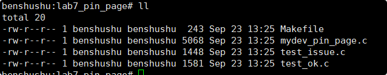

### 编译内核模块。

```
benshushu:lab7_pin_page# make
make -C /lib/modules/`uname -r`/build 
M=/mnt/rlk_lab/rlk_basic/chapter_9_mm/lab7_pin_page modules;
make[1]: Entering directory '/usr/src/linux'
 CC [M] /mnt/rlk_lab/rlk_basic/chapter_9_mm/lab7_pin_page/mydev_pin_page.o
 LD [M] /mnt/rlk_lab/rlk_basic/chapter_9_mm/lab7_pin_page/mydevdemo-pinpage.o
 Building modules, stage 2.
 MODPOST 1 modules
 CC /mnt/rlk_lab/rlk_basic/chapter_9_mm/lab7_pin_page/mydevdemo-pinpage.mod.o
 LD [M] /mnt/rlk_lab/rlk_basic/chapter_9_mm/lab7_pin_page/mydevdemo-pinpage.ko
make[1]: Leaving directory '/usr/src/linux'
```

```C
BASEINCLUDE ?= /lib/modules/`uname -r`/build

mydevdemo-pin-page-objs := mydev_pin_page.o 

obj-m	:=   mydevdemo-pin-page.o
all : 
	$(MAKE) -C $(BASEINCLUDE) M=$(PWD) modules;

clean:
	$(MAKE) -C $(BASEINCLUDE) M=$(PWD) clean;
	rm -f *.ko;

```

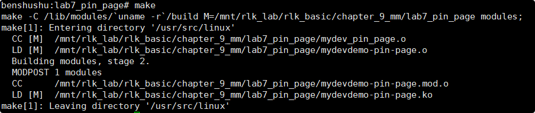

### 安装内核模块。

```
benshushu:lab7_pin_page# insmod mydevdemo-pin-page.ko 
[ 1548.416556] succeeded register char device: my_demo_dev
benshushu:lab7_pin_page#
```

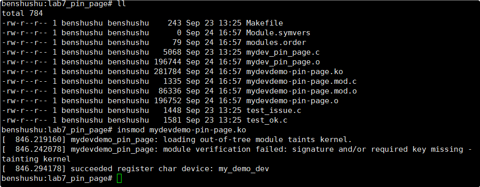

### 编译和运行 test_issue 程序。

```
benshushu:lab7_pin_page# gcc test_issue.c -o test_issue
benshushu:lab7_pin_page# ./test_issue 
[ 1591.642809] demodrv_open: major=10, minor=58
driver max buffer size=4096
[ 1591.650557] demodrv_read_write: len=4096, npage=1
[ 1591.651127] pin 1 pages from user done
[ 1591.651636] demodrv_read_write: write user buffer 4096 bytes done
[ 1591.651920] demodrv_write: write nbytes=4096 done at pos=0
[ 1591.652291] demodrv_read_write: len=4096, npage=1
[ 1591.652564] pin 1 pages from user done
[ 1591.652825] demodrv_read_write: read user buffer 4096 bytes done
[ 1591.653088] demodrv_read: read nbytes=4096 done at pos=0
buffer compare fail
free(): invalid pointer
Aborted
```

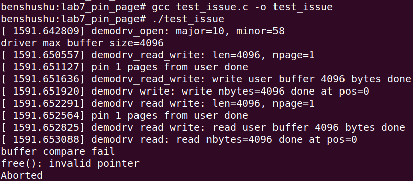

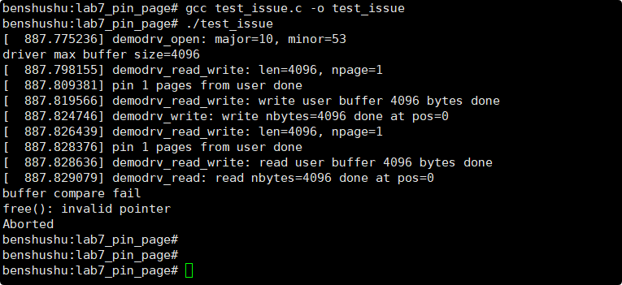

​		发现跑出错误了。“buffer compare fail”说明 buffer 读回来的数据和原始值不一样。这是为什么呢？难道是我们驱动代码有问题吗？

#### 		==见思考题提示==

### 	我们再运行 test_ok 测试程序

​		发现跑通了，log 里显示：data modify and compare succussful。

```
benshushu:lab7_pin_page# gcc test_ok.c -o test_ok
benshushu:lab7_pin_page# ./test_ok 
[ 1670.322993] demodrv_open: major=10, minor=58
driver max buffer size=4096
[ 1670.345312] demodrv_read_write: len=4096, npage=1
[ 1670.345715] pin 1 pages from user done
[ 1670.345911] demodrv_read_write: write user buffer 4096 bytes done
[ 1670.346247] demodrv_write: write nbytes=4096 done at pos=0
[ 1670.346608] demodrv_read_write: len=4096, npage=1
[ 1670.347133] pin 1 pages from user done
[ 1670.347385] demodrv_read_write: read user buffer 4096 bytes done
[ 1670.347670] demodrv_read: read nbytes=4096 done at pos=0
data modify and compare succussful
```

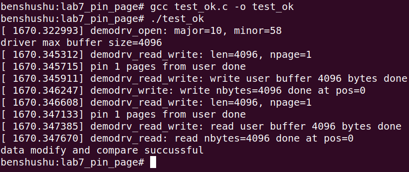

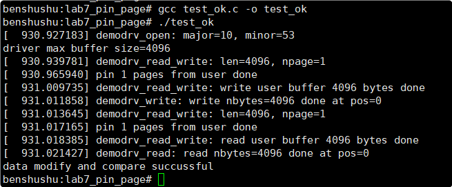

​		==请读者思考，为什么跑 test_issue 程序会出现错误？==

### 实验清理

```
rmmod mydevdemo-pin-page
make clean
rm -f test_issue test_ok
```

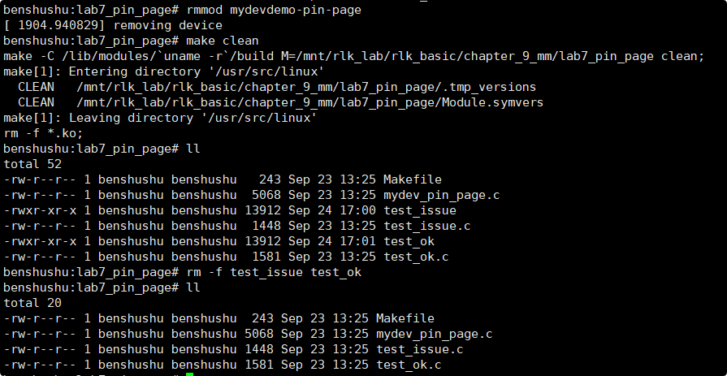


## 4．实验参考代码

### 驱动的参考代码如下

```C
#include <linux/module.h>
#include <linux/fs.h>
#include <linux/uaccess.h>
#include <linux/init.h>
#include <linux/miscdevice.h>
#include <linux/device.h>
#include <linux/slab.h>
#include <linux/kfifo.h>
#include <linux/highmem.h>

#define DEMO_NAME "my_demo_dev"
static struct device *mydemodrv_device;

#define MYDEMO_READ 0
#define MYDEMO_WRITE 1

/* Virtual FIFO device's buffer */
static char *device_buffer;
#define MAX_DEVICE_BUFFER_SIZE (1 * PAGE_SIZE)

#define MYDEV_CMD_GET_BUFSIZE 1 /* Defines our IOCTL cmd */

static size_t demodrv_read_write(void *buf, size_t len, int rw)
{
    int ret, npages, i;
    struct page **pages;
    struct mm_struct *mm = current->mm;
    char *kmap_addr, *dev_buf;
    size_t size = 0;
    size_t count = 0;

    dev_buf = device_buffer;

    /* How many pages? */
    npages = DIV_ROUND_UP(len, PAGE_SIZE);

    printk("%s: len=%d, npage=%d\n", __func__, len, npages);

    pages = kmalloc(npages * sizeof(pages), GFP_KERNEL);
    if (!pages) {
        printk("alloc pages fail\n");
        return -ENOMEM;
    }

    down_read(&mm->mmap_sem);

    ret = get_user_pages_fast((unsigned long)buf, npages, 1, pages);
    if (ret < npages) {
        printk("pin page fail\n");
        goto fail_pin_pages;
    }

    up_read(&mm->mmap_sem);

    printk("pin %d pages from user done\n", npages);

    for (i = 0; i < npages; i++) {
        kmap_addr = kmap(pages[i]);
        size = min_t(size_t, PAGE_SIZE, len);
        switch (rw) {
        case MYDEMO_READ:
            memcpy(kmap_addr, dev_buf + PAGE_SIZE * i, size);
            break;
        case MYDEMO_WRITE:
            memcpy(dev_buf + PAGE_SIZE * i, kmap_addr, size);
            break;
        default:
            break;
        }
        put_page(pages[i]);
        kunmap(pages[i]);
        len -= size;
        count += size;
    }

    kfree(pages);

    printk("%s: %s user buffer %d bytes done\n", __func__, rw ? "write" : "read", count);

    return count;

fail_pin_pages:
    up_read(&mm->mmap_sem);
    for (i = 0; i < ret; i++)
        put_page(pages[i]);
    kfree(pages);

    return -EFAULT;
}

static int demodrv_open(struct inode *inode, struct file *file)
{
    int major = MAJOR(inode->i_rdev);
    int minor = MINOR(inode->i_rdev);

    printk("%s: major=%d, minor=%d\n", __func__, major, minor);

    return 0;
}

static int demodrv_release(struct inode *inode, struct file *file)
{
    return 0;
}

static ssize_t demodrv_read(struct file *file, char __user *buf, size_t count, loff_t *ppos)
{
    size_t nbytes = demodrv_read_write(buf, count, MYDEMO_READ);

    printk("%s: read nbytes=%d done at pos=%d\n", __func__, nbytes, (int)*ppos);

    return nbytes;
}

static ssize_t demodrv_write(struct file *file, const char __user *buf, size_t count, loff_t *ppos)
{
    size_t nbytes = demodrv_read_write((void *)buf, count, MYDEMO_WRITE);

    printk("%s: write nbytes=%d done at pos=%d\n", __func__, nbytes, (int)*pp
#include <linux/module.h>
#include <linux/fs.h>
#include <linux/uaccess.h>
#include <linux/init.h>
#include <linux/miscdevice.h>
#include <linux/device.h>
#include <linux/slab.h>
#include <linux/kfifo.h>
#include <linux/highmem.h>

#define DEMO_NAME "my_demo_dev"
static struct device *mydemodrv_device;

#define MYDEMO_READ 0
#define MYDEMO_WRITE 1

/* Virtual FIFO device's buffer */
static char *device_buffer;
#define MAX_DEVICE_BUFFER_SIZE (1 * PAGE_SIZE)

#define MYDEV_CMD_GET_BUFSIZE 1 /* Defines our IOCTL cmd */

static size_t demodrv_read_write(void *buf, size_t len, int rw)
{
    int ret, npages, i;
    struct page **pages;
    struct mm_struct *mm = current->mm;
    char *kmap_addr, *dev_buf;
    size_t size = 0;
    size_t count = 0;

    dev_buf = device_buffer;

    /* How many pages? */
    npages = DIV_ROUND_UP(len, PAGE_SIZE);

    printk("%s: len=%d, npage=%d\n", __func__, len, npages);

    pages = kmalloc(npages * sizeof(pages), GFP_KERNEL);
    if (!pages) {
        printk("alloc pages fail\n");
        return -ENOMEM;
    }

    down_read(&mm->mmap_sem);

    ret = get_user_pages_fast((unsigned long)buf, npages, 1, pages);
    if (ret < npages) {
        printk("pin page fail\n");
        goto fail_pin_pages;
    }

    up_read(&mm->mmap_sem);

    printk("pin %d pages from user done\n", npages);

    for (i = 0; i < npages; i++) {
        kmap_addr = kmap(pages[i]);
        size = min_t(size_t, PAGE_SIZE, len);
        switch (rw) {
        case MYDEMO_READ:
            memcpy(kmap_addr, dev_buf + PAGE_SIZE * i, size);
            break;
        case MYDEMO_WRITE:
            memcpy(dev_buf + PAGE_SIZE * i, kmap_addr, size);
            break;
        default:
            break;
        }
        put_page(pages[i]);
        kunmap(pages[i]);
        len -= size;
        count += size;
    }

    kfree(pages);

    printk("%s: %s user buffer %d bytes done\n", __func__, rw ? "write" : "read", count);

    return count;

fail_pin_pages:
    up_read(&mm->mmap_sem);
    for (i = 0; i < ret; i++)
        put_page(pages[i]);
    kfree(pages);

    return -EFAULT;
}

static int demodrv_open(struct inode *inode, struct file *file)
{
    int major = MAJOR(inode->i_rdev);
    int minor = MINOR(inode->i_rdev);

    printk("%s: major=%d, minor=%d\n", __func__, major, minor);

    return 0;
}

static int demodrv_release(struct inode *inode, struct file *file)
{
    return 0;
}

static ssize_t demodrv_read(struct file *file, char __user *buf, size_t count, loff_t *ppos)
{
    size_t nbytes = demodrv_read_write(buf, count, MYDEMO_READ);

    printk("%s: read nbytes=%d done at pos=%d\n", __func__, nbytes, (int)*ppos);

    return nbytes;
}

static ssize_t demodrv_write(struct file *file, const char __user *buf, size_t count, loff_t *ppos)
{
    size_t nbytes = demodrv_read_write((void *)buf, count, MYDEMO_WRITE);

    printk("%s: write nbytes=%d done at pos=%d\n", __func__, nbytes, (int)*pp

```

​		本实验是在上一个实验基础上实现锁定（pin）用户内存，也就是另外一个方式来映射用户内存。实现锁定用户内存的主要函数就是 get_user_pages()函数。

​		get_user_pages()函数

​		用于把用户空间的虚拟内存空间传到内核空间，内核空间为其分配物理内存并建立相应的映射关系，实现过程如图所示。例如，在 camera 驱动的 V4L2 核心架构中可以使用用户空间内存类型（V4L2_MEMORY_USERPTR）来分配物理内存，其驱动的实现使用的是 get_user_pages()函数。

```
long get_user_pages(struct task_struct *tsk, struct mm_struct *mm, unsigned long start, unsigned long nr_pages, int write, int force, struct page **pages, struct vm_area_struct **vmas)
```

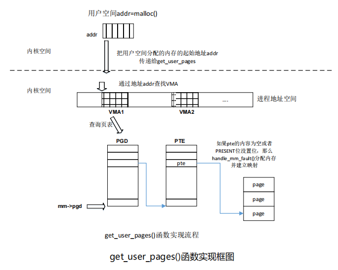

​		在本实验中，我们把 read 和 write 方法中的用户空间的 buffer 进行锁定（pin），然后重新分配物理内存，并且映射到用户空间的 buffer 中，整个过程有点类似 mmap方法。

​		我们来看本实验的 read 和 write 方法，分别调用了内部函数 demodrv_read_write()，该函数实现在第 24 行。

​		第 34 行，dev_buf 指向设备 buffer。

​		第 37 行，计算用户空间的 buffer 一共有多少页。

​		第 41 行，分配页数据结构 struct page，每一个页有一个页数据结构 struct page，这里 pages 可以看做是页数据结构 struct page 的数组，数组的成员就是页数据结构struct page 指针。

​		第 47 行，申请一个 mm->mmap_sem 的读者类型的信号量。

​		第 49 行，调用 get_user_pages_fast()函数来实现锁定任务，即 pin 住用户空间 buffer对应在内核态的物理内存，同时也完成新分配的物理内存和设备 buffer 之间的映射关系。

```
int get_user_pages_fast(unsigned long start, int nr_pages, int write,
struct page **pages)
```

get_user_pages_fast()函数有 4 个参数：

-  start：用户空间 buffer 的起始地址

-  nr_pages：需要锁定的页面的数量

-  write：这些页面是否需要可写

-  pages：当锁定完成之后，pages 指向已经锁定完成的物理页面。

​		第 55 行，释放读者类型的信号量。

​		第 59 行，对已经锁定的页面进行进一步处理。

​		第 60 行，kmap 函数是把物理页面 pages[i]进行一个临时的映射，从而得到一个内核态的虚拟地址 kmap_addr。

​		第 64 行，对于读操作，把设备 buffer 的内容拷贝到我们已经锁定好的物理页面。

​		第 69 行，对于写操作，把锁定好的物理页面的内容写入到设备 buffer 定义的页面。

​		第 77 行，这个步骤很重要，因为 get_user_pages_fast()函数之所以锁定，是因为

对物理页面进行了增加了页引用计数（get_page()），这里要释放页索引（put_page）。

关于页引用计数，读者可以阅读蓝色《奔跑吧 Linux 内核》第 2 章相关内容。

​		第 78 行，取消刚才建立的临时映射。

------

### 代码注释与分析

```C
#include <linux/module.h>
#include <linux/fs.h>
#include <linux/uaccess.h>
#include <linux/init.h>
#include <linux/miscdevice.h>
#include <linux/device.h>
#include <linux/slab.h>
#include <linux/kfifo.h>
#include <linux/highmem.h>

#define DEMO_NAME "my_demo_dev"  // 定义设备名称
static struct device *mydemodrv_device;

#define MYDEMO_READ 0   // 定义读操作的标志
#define MYDEMO_WRITE 1  // 定义写操作的标志

/* 虚拟 FIFO 设备的缓冲区 */
static char *device_buffer;
#define MAX_DEVICE_BUFFER_SIZE (1 * PAGE_SIZE)  // 定义最大设备缓冲区大小为一页大小

#define MYDEV_CMD_GET_BUFSIZE 1  // 定义 IOCTL 命令，用于获取设备缓冲区大小

/**
 * @brief 读写设备缓冲区
 * @param buf 用户空间缓冲区地址
 * @param len 读写的数据长度
 * @param rw 操作标识（读或写）
 * @return 返回实际读写的字节数
 */
static size_t demodrv_read_write(void *buf, size_t len, int rw)
{
    int ret, npages, i;
    struct page **pages;
    struct mm_struct *mm = current->mm;
    char *kmap_addr, *dev_buf;
    size_t size = 0;
    size_t count = 0;

    dev_buf = device_buffer;  // 设备缓冲区指针

    /* 计算需要多少页来存储用户空间数据 */
    npages = DIV_ROUND_UP(len, PAGE_SIZE);

    printk("%s: len=%zu, npage=%d\n", __func__, len, npages);

    // 分配页面指针数组来保存页面信息
    pages = kmalloc(npages * sizeof(pages), GFP_KERNEL);
    if (!pages) {
        printk("alloc pages fail\n");
        return -ENOMEM;
    }

    down_read(&mm->mmap_sem);  // 获取 mmap 信号量进行读写保护

    // 获取用户空间页面
    ret = get_user_pages_fast((unsigned long)buf, npages, 1, pages);
    if (ret < npages) {
        printk("pin page fail\n");
        goto fail_pin_pages;
    }

    up_read(&mm->mmap_sem);  // 释放 mmap 信号量

    printk("pin %d pages from user done\n", npages);

    for (i = 0; i < npages; i++) {
        kmap_addr = kmap(pages[i]);  // 映射物理页面到内核空间

        size = min_t(size_t, PAGE_SIZE, len);  // 计算当前页面需要处理的大小
        switch(rw) {
        case MYDEMO_READ:
            // 从设备缓冲区拷贝数据到用户缓冲区
            memcpy(kmap_addr, dev_buf + PAGE_SIZE * i, size);
            break;
        case MYDEMO_WRITE:
            // 从用户缓冲区拷贝数据到设备缓冲区
            memcpy(dev_buf + PAGE_SIZE * i, kmap_addr, size);
            break;
        default:
            break;
        }

        // 释放页面并取消映射
        put_page(pages[i]);
        kunmap(pages[i]);

        len -= size;
        count += size;
    }

    kfree(pages);  // 释放页面数组

    printk("%s: %s user buffer %zu bytes done\n", __func__, rw ? "write" : "read", count);

    return count;

fail_pin_pages:
    up_read(&mm->mmap_sem);
    for (i = 0; i < ret; i++)
        put_page(pages[i]);
    kfree(pages);

    return -EFAULT;
}

/**
 * @brief 打开设备
 */
static int demodrv_open(struct inode *inode, struct file *file)
{
    int major = MAJOR(inode->i_rdev);
    int minor = MINOR(inode->i_rdev);

    printk("%s: major=%d, minor=%d\n", __func__, major, minor);

    return 0;
}

/**
 * @brief 释放设备
 */
static int demodrv_release(struct inode *inode, struct file *file)
{
    return 0;
}

/**
 * @brief 设备的读操作
 */
static ssize_t demodrv_read(struct file *file, char __user *buf, size_t count, loff_t *ppos)
{
    size_t nbytes = demodrv_read_write(buf, count, MYDEMO_READ);  // 调用通用读写函数执行读操作

    printk("%s: read nbytes=%zu done at pos=%lld\n", __func__, nbytes, *ppos);

    return nbytes;
}

/**
 * @brief 设备的写操作
 */
static ssize_t demodrv_write(struct file *file, const char __user *buf, size_t count, loff_t *ppos)
{
    size_t nbytes = demodrv_read_write((void *)buf, count, MYDEMO_WRITE);  // 调用通用读写函数执行写操作

    printk("%s: write nbytes=%zu done at pos=%lld\n", __func__, nbytes, *ppos);

    return nbytes;
}

/**
 * @brief 内存映射操作
 */
static int demodrv_mmap(struct file *filp, struct vm_area_struct *vma)
{
    unsigned long pfn;
    unsigned long offset = vma->vm_pgoff << PAGE_SHIFT;
    unsigned long len = vma->vm_end - vma->vm_start;

    if (offset >= MAX_DEVICE_BUFFER_SIZE)
        return -EINVAL;
    if (len > (MAX_DEVICE_BUFFER_SIZE - offset))
        return -EINVAL;

    printk("%s: mapping %lu bytes of device buffer at offset %lu\n", __func__, len, offset);

    pfn = virt_to_phys(device_buffer + offset) >> PAGE_SHIFT;

    if (remap_pfn_range(vma, vma->vm_start, pfn, len, vma->vm_page_prot))
        return -EAGAIN;

    return 0;
}

/**
 * @brief 设备的 IOCTL 操作
 */
static long demodrv_unlocked_ioctl(struct file *filp, unsigned int cmd, unsigned long arg)
{
    unsigned long tbs = MAX_DEVICE_BUFFER_SIZE;
    void __user *ioargp = (void __user *)arg;

    switch (cmd) {
    default:
        return -EINVAL;

    case MYDEV_CMD_GET_BUFSIZE:
        if (copy_to_user(ioargp, &tbs, sizeof(tbs)))
            return -EFAULT;
        return 0;
    }
}

/* 文件操作结构 */
static const struct file_operations demodrv_fops = {
    .owner = THIS_MODULE,
    .open = demodrv_open,
    .release = demodrv_release,
    .read = demodrv_read,
    .write = demodrv_write,
    .mmap = demodrv_mmap,
    .unlocked_ioctl = demodrv_unlocked_ioctl,
};

/* 定义并注册 misc 设备 */
static struct miscdevice mydemodrv_misc_device = {
    .minor = MISC_DYNAMIC_MINOR,
    .name = DEMO_NAME,
    .fops = &demodrv_fops,
};

/**
 * @brief 模块初始化
 */
static int __init simple_char_init(void)
{
    int ret;

    device_buffer = kmalloc(MAX_DEVICE_BUFFER_SIZE, GFP_KERNEL);
    if (!device_buffer)
        return -ENOMEM;

    ret = misc_register(&mydemodrv_misc_device);
    if (ret) {
        printk("failed register misc device\n");
        kfree(device_buffer);
        return ret;
    }

    mydemodrv_device = mydemodrv_misc_device.this_device;

    printk("succeeded register char device: %s\n", DEMO_NAME);

    return 0;
}

/**
 * @brief 模块卸载
 */
static void __exit simple_char_exit(void)
{
    printk("removing device\n");

    kfree(device_buffer);
    misc_deregister(&mydemodrv_misc_device);
}

module_init(simple_char_init);
module_exit(simple_char_exit);

MODULE_AUTHOR("Benshushu");
MODULE_LICENSE("GPL v2");
MODULE_DESCRIPTION("Simple character device");
```

### 代码分析

该代码实现了一个 Linux 字符设备驱动，提供了基本的读写、内存映射（mmap）和 ioctl 操作。

- **设备缓冲区**：使用内核分配的页大小缓冲区 `device_buffer`，用于存储从用户空间写入的数据或读取数据到用户空间。
- **读写操作**：通过 `demodrv_read_write` 函数，支持从用户空间缓冲区读取数据到设备缓冲区或者将设备缓冲区数据写入到用户缓冲区。
- **内存映射**：允许用户空间进程通过 `mmap` 系统调用将设备内存映射到用户空间地址。
- **IOCTL**：提供一个 IOCTL 命令 `MYDEV_CMD_GET_BUFSIZE`，允许用户获取设备缓冲区的大小。

该驱动展示了如何实现用户空间和内核空间的数据交互，内存映射和 IO 控制功能。

------

### test_issue 测试代码如下。

```C
#include <stdio.h>
#include <fcntl.h>
#include <unistd.h>
#include <sys/mman.h>
#include <string.h>
#include <errno.h>
#include <fcntl.h>
#include <sys/ioctl.h>
#include <malloc.h>

#define DEMO_DEV_NAME "/dev/my_demo_dev"

#define MYDEV_CMD_GET_BUFSIZE 1 /* defines our IOCTL cmd */

int main()
{
    int fd;
    int i;
    size_t len;
    char *read_buffer, *write_buffer;

    fd = open(DEMO_DEV_NAME, O_RDWR);
    if (fd < 0) {
        printf("open device %s failded\n", DEMO_DEV_NAME);
        return -1;
    }

    if (ioctl(fd, MYDEV_CMD_GET_BUFSIZE, &len) < 0) {
        printf("ioctl fail\n");
        goto open_fail;
    }

    printf("driver max buffer size=%zu\n", len);

    read_buffer = malloc(len);
    if (!read_buffer)
        goto open_fail;

    write_buffer = malloc(len);
    if (!write_buffer)
        goto buffer_fail;

    /* modify the write buffer */
    for (i = 0; i < len; i++)
        *(write_buffer + i) = 0x55;

    if (write(fd, write_buffer, len) != len) {
        printf("write fail\n");
        goto rw_fail;
    }

    /* read the buffer back and compare with the mmap buffer */
    if (read(fd, read_buffer, len) != len) {
        printf("read fail\n");
        goto rw_fail;
    }

    if (memcmp(write_buffer, read_buffer, len)) {
        printf("buffer compare fail\n");
        goto rw_fail;
    }

    printf("data modify and compare successful\n");

    free(write_buffer);
    free(read_buffer);
    close(fd);

    return 0;

rw_fail:
    if (write_buffer)
        free(write_buffer);
buffer_fail:
    if (read_buffer)
        free(read_buffer);
open_fail:
    close(fd);
    return 0;
}

```

​		本实验的测试代码不复杂，就是通过 write 函数把设备 buffer 进行改写，然后通过 read 函数把设备 buffer 又读回来，看看内容是否一致。

### 代码分析和注释：

```C
#include <stdio.h>
#include <fcntl.h>
#include <unistd.h>
#include <sys/mman.h>
#include <string.h>
#include <errno.h>
#include <fcntl.h>
#include <sys/ioctl.h>
#include <malloc.h>

#define DEMO_DEV_NAME "/dev/my_demo_dev" // 设备文件名称

#define MYDEV_CMD_GET_BUFSIZE 1 // IOCTL命令，用于获取设备缓冲区大小

int main()
{
    int fd; // 文件描述符
    int i;
    size_t len; // 缓冲区长度
    char *read_buffer, *write_buffer; // 读写缓冲区指针

    // 打开设备文件，获取文件描述符
    fd = open(DEMO_DEV_NAME, O_RDWR);
    if (fd < 0) {
        printf("open device %s failded\n", DEMO_DEV_NAME);
        return -1; // 打开失败，返回错误
    }

    // 使用 ioctl 获取设备缓冲区大小
    if (ioctl(fd, MYDEV_CMD_GET_BUFSIZE, &len) < 0) {
        printf("ioctl fail\n");
        goto open_fail; // IOCTL 调用失败，跳转到错误处理
    }

    printf("driver max buffer size=%zu\n", len); // 打印缓冲区大小

    // 为读缓冲区分配内存
    read_buffer = malloc(len);
    if (!read_buffer)
        goto open_fail; // 内存分配失败

    // 为写缓冲区分配内存
    write_buffer = malloc(len);
    if (!write_buffer)
        goto buffer_fail; // 内存分配失败

    /* 初始化写缓冲区内容 */
    for (i = 0; i < len; i++)
        *(write_buffer + i) = 0x55; // 将写缓冲区的每个字节初始化为 0x55

    // 将写缓冲区内容写入设备
    if (write(fd, write_buffer, len) != len) {
        printf("write fail\n");
        goto rw_fail; // 写操作失败，跳转到错误处理
    }

    /* 从设备中读取数据到读缓冲区并与写缓冲区内容进行比较 */
    if (read(fd, read_buffer, len) != len) {
        printf("read fail\n");
        goto rw_fail; // 读取操作失败
    }

    // 比较写缓冲区和读缓冲区内容
    if (memcmp(write_buffer, read_buffer, len)) {
        printf("buffer compare fail\n");
        goto rw_fail; // 如果内容不匹配，跳转到错误处理
    }

    printf("data modify and compare successful\n"); // 如果数据匹配，打印成功信息

    // 释放内存并关闭设备文件
    free(write_buffer);
    free(read_buffer);
    close(fd);

    return 0; // 成功退出

rw_fail:
    if (write_buffer)
        free(write_buffer); // 如果写入失败，释放写缓冲区内存
buffer_fail:
    if (read_buffer)
        free(read_buffer); // 如果读取失败，释放读缓冲区内存
open_fail:
    close(fd); // 关闭文件描述符
    return 0; // 错误退出
}
```

### 代码功能：

1. **打开设备文件：**
   程序通过 `open()` 系统调用打开 `/dev/my_demo_dev` 设备文件，并返回一个文件描述符 `fd`。如果打开失败，则输出错误信息并退出。
2. **获取设备缓冲区大小：**
   通过 `ioctl()` 调用，获取设备缓冲区的大小。这里通过 `MYDEV_CMD_GET_BUFSIZE` 命令获取该大小，并存储在 `len` 变量中。
3. **内存分配：**
   程序为读缓冲区 `read_buffer` 和写缓冲区 `write_buffer` 分配内存，大小为 `len`。若内存分配失败，会释放已分配的内存并跳转到错误处理部分。
4. **初始化写缓冲区：**
   将写缓冲区的每个字节都设置为 `0x55`，这代表要向设备写入的内容。
5. **写入设备：**
   调用 `write()` 将写缓冲区内容写入设备。如果写入操作失败，会释放资源并退出。
6. **读取设备数据：**
   调用 `read()` 从设备读取数据到读缓冲区，并检查与写入的数据是否一致。如果内容不一致，则认为失败并进行错误处理。
7. **内存释放和资源清理：**
   如果操作成功，释放读写缓冲区并关闭设备文件。如果失败，也会在对应的错误处理部分释放资源并退出。

### 程序过程解析：

- 程序通过 IOCTL 获取设备的缓冲区大小，并通过读写设备测试数据的正确性。
- 主要通过 `ioctl` 获取缓冲区大小，`write` 向设备写入数据，`read` 读取设备数据，然后使用 `memcmp` 进行数据比较。

------


## 5．思考题提示

​		小明同学跑 test_issue 程序发现跑出错误了。“buffer compare fail”说明 buffer 读回来的数据和原始值不一样。而跑 test_ok 程序却是正确的。这是为什么呢？

​		==小明同学对比了 test_issue 和 test_ok，最大的不同就是使用 malloc 来分配 userbuffer，而不是通过 mmap 来分配的匿名页面，那究竟是什么原因导致的呢？==

​		这问题其实是笨叔在实际项目开发中遇到的，因此抽象出来把它变成一个实验。这个思考题对初学者来说有不小的难度。若对该问题的来龙去脉想明白，那么对 Linux的内存管理的理解会上一个台阶。

​		遇到这种问题，我们最简单最粗暴也是最有效的调试办法就是把 buffer 打印出来看看。在内核里，可以使用 print_hex_dump_bytes()函数。比如在 demodrv_read_write()函数的第 61,67,72 行添加打印语句。

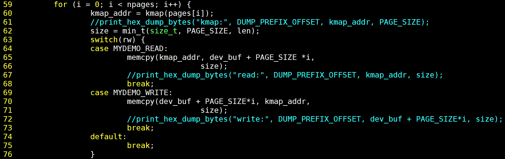

运行 test_issue 程序，打印结果如下：

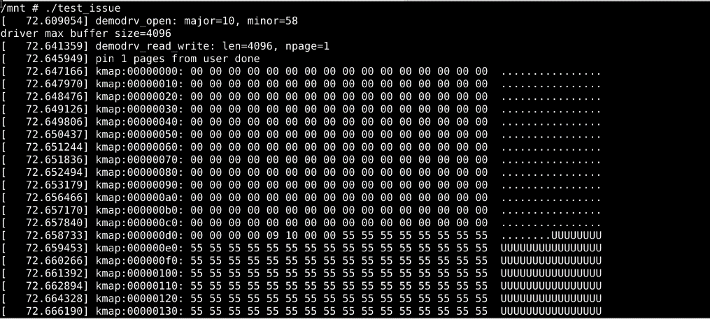

​		发现 pin 的 page，开头的数据都是 0，而不是 0x55，这是为什么呢? 理论上这个page 应该全部都是 0x55 才对。

​		我们在运行 test_ok 程序，发现 pin 的 page 的数据，从开头到介绍都是 0x55，这就奇怪了?

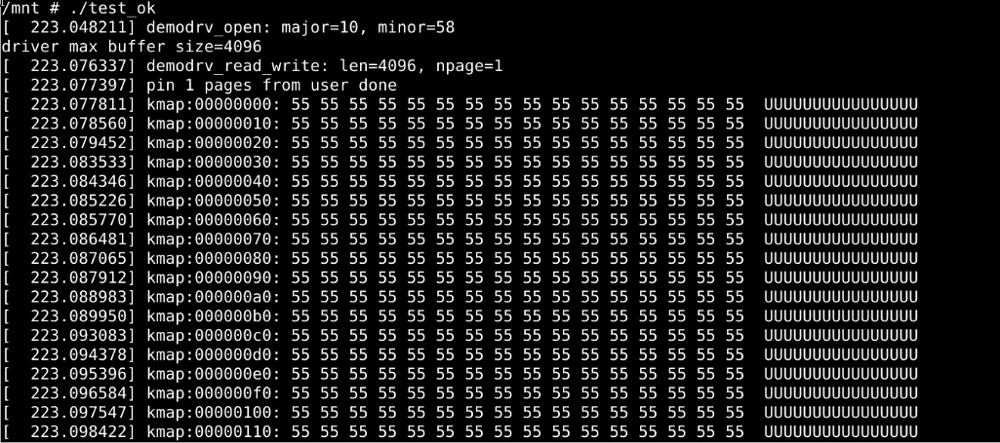

​		我们需要进一步思考 malloc 和 mmap 来分配虚拟内存，究竟有什么不一样。

​		我们继续在 demodrv_read_write()函数里添加打印，这次我们把用户空间 buffer 的起始地址打印出来。

​		运行 test_issue 程序，打印的用户空间 buffer 起始地址为 buf=0x0008c0d8。

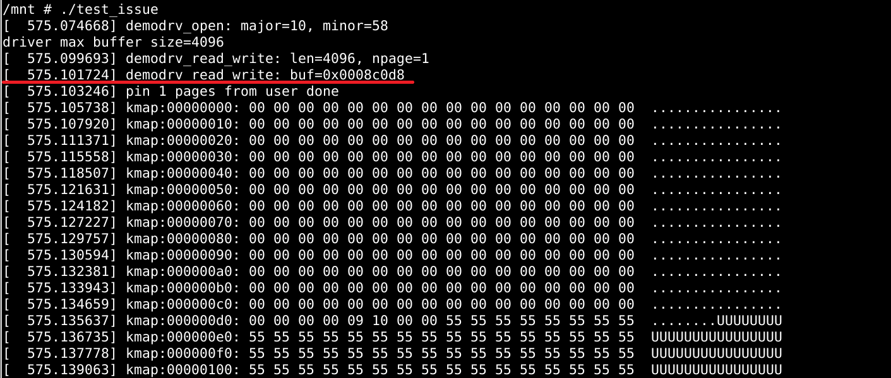

​		运行 test_ok 程序，打印的用户空间 buffer 起始地址为 0xb6f99000。

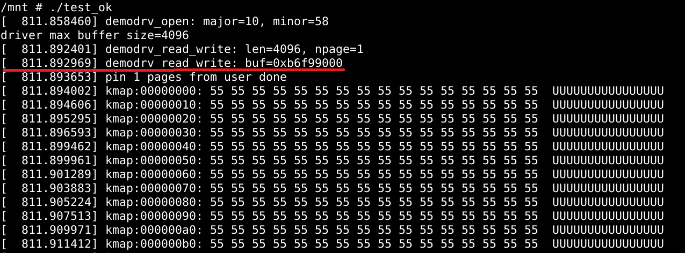

​		我们发现问题，使用 malloc 分配 4KB 的虚拟内存，起始地址为 0x0008c0d8，而使用 mmap 分配的 4KB 虚拟内存，起始地址是 0xb6f99000。前者的起始地址没有页面对齐（4KB），后者以 4KB 页面对齐。

​		这就是为什么使用 malloc 分配内存的 test_issue 程序，在内核空间中看到 pin 住的物理页面有一部分地址的内容是 0x0，而另外一部分地址的内容是 0x55。