# 实验 9-8：OOM

## 1．实验目的

​		了解 OOM 机制实现的原理。

## 2．实验要求

​		1）编写一个简单的应用程序，这个应用程序只分配内存，不释放内存。然后不断地重复执行这个程序，直到系统的 OOM Killer 机制起作用。

​		2）分析 OOM Killer 打印的日志信息。

​		3）编写一个简单的内核模块，使用 alloc_pages()函数来不断分配内存直到触发系统的 OOM Killer 机制。

## 3．实验步骤

​		本实验有两个方案，一个是使用 test 应用程序来触发 OOM Killer，另外一个是使用内核驱动的方式。

## （1） test 应用程序方法

### 下面是本实验的实验步骤。

### 启动 QEMU+runninglinuxkernel。

```
$ ./run_rlk_arm64.sh run
```

### 进入本实验的参考代码

```
# cd /mnt/rlk_lab/rlk_basic/chapter_9_mm/lab8_oom/oom_user_app
```

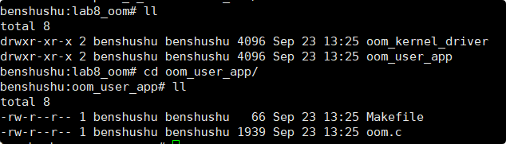

### 编译测试程序

```
benshushu:oom_user_app# make
cc -o oom oom.c -lpthread --static
```

```makefile
all:
	$(CC) -o oom oom.c -lpthread --static
clean:
	$(RM) oom *.o
```

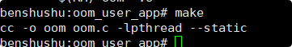

### 运行 oom 程序。

```
benshushu:oom_user_app# ./oom
thread(ffff9b8935f0), allocating 10485760 bytes.
thread(ffff9b8935f0), allocating 10485760 bytes.
thread(ffff9b8935f0), allocating 10485760 bytes.
[ 1839.132019] oom invoked oom-killer: 
gfp_mask=0x6080c0(GFP_KERNEL|__GFP_ZERO), order=0, oom_score_adj=0
[ 1839.139817] CPU: 3 PID: 1743 Comm: oom Kdump: loaded Tainted: G O 
5.0.0+ #4
[ 1839.140313] Hardware name: linux,dummy-virt (DT)
[ 1839.141021] Call trace:
[ 1839.142942] dump_backtrace+0x0/0x528
[ 1839.143552] show_stack+0x24/0x30
[ 1839.143744] __dump_stack+0x20/0x2c
[ 1839.143916] dump_stack+0x25c/0x388
[ 1839.144081] dump_header+0x68/0x118
[ 1839.144357] oom_kill_process+0x41c/0xbfc
[ 1839.144623] out_of_memory+0x34c/0x390
[ 1839.144886] __alloc_pages_nodemask+0x2730/0x3338
[ 1839.145178] alloc_pages_current+0x200/0x23c
[ 1839.145573] __pte_alloc+0x54/0x6d0
[ 1839.146079] do_anonymous_page+0x98/0x189c
[ 1839.146678] handle_pte_fault+0x210/0xb80
[ 1839.146922] __handle_mm_fault+0xadc/0xb0c
[ 1839.147499] handle_mm_fault+0x734/0x830
[ 1839.148316] __do_page_fault+0xc4/0x110
[ 1839.148953] do_page_fault+0x700/0xda0
[ 1839.150888] do_translation_fault+0xd8/0xf8
[ 1839.151302] do_mem_abort+0x68/0xf0
[ 1839.151518] el0_da+0x20/0x24
[ 1839.152793] Mem-Info:
[ 1839.154442] active_anon:161605 inactive_anon:2328 isolated_anon:0
[ 1839.154442] active_file:24 inactive_file:52 isolated_file:0
[ 1839.154442] unevictable:0 dirty:0 writeback:0 unstable:0
[ 1839.154442] slab_reclaimable:3547 slab_unreclaimable:5209
[ 1839.154442] mapped:235 shmem:2361 pagetables:517 bounce:0
[ 1839.154442] free:6010 free_pcp:4 free_cma:439
[ 1839.157725] Node 0 active_anon:646420kB inactive_anon:9312kB 
active_file:96kB inactive_file:408kB unevictable:0kB isolated(anon):0kB 
isolated(file):0
kB mapped:940kB dirty:0kB writeback:0kB shmem:9444kB shmem_thp: 0kB 
shmem_pmdmapped: 0kB anon_thp: 468992kB writeback_tmp:0kB unstable:0kB 
all_unreclaim
able? no
[ 1839.160573] Node 0 DMA32 free:24040kB min:22528kB low:28160kB high:33792kB 
active_anon:646020kB inactive_anon:9312kB active_file:352kB inactive_file:
564kB unevictable:0kB writepending:0kB present:1048576kB managed:737092kB 
mlocked:0kB kernel_stack:2848kB pagetables:2068kB bounce:0kB free_pcp:288kB 
lo
cal_pcp:0kB free_cma:1756kB
[ 1839.168216] lowmem_reserve[]: 0 0 0
[ 1839.169694] Node 0 DMA32: 136*4kB (UEC) 36*8kB (UMEC) 66*16kB (UMEC) 
53*32kB (UME) 25*64kB (UMEC) 6*128kB (UMEC) 3*256kB (ME) 16*512kB (UMC) 
8*1024kB
(UMC) 0*2048kB 0*4096kB = 23104kB
[ 1839.172795] Node 0 hugepages_total=0 hugepages_free=0 hugepages_surp=0 
hugepages_size=1048576kB
[ 1839.174331] Node 0 hugepages_total=0 hugepages_free=0 hugepages_surp=0 
hugepages_size=32768kB
[ 1839.175271] Node 0 hugepages_total=0 hugepages_free=0 hugepages_surp=0 
hugepages_size=2048kB
[ 1839.176390] Node 0 hugepages_total=0 hugepages_free=0 hugepages_surp=0 
hugepages_size=64kB
[ 1839.178296] 2626 total pagecache pages
[ 1839.179135] 0 pages in swap cache
[ 1839.179830] Swap cache stats: add 0, delete 0, find 0/0
[ 1839.181189] Free swap = 0kB
[ 1839.182309] Total swap = 0kB
[ 1839.183096] 262144 pages RAM
[ 1839.183505] 0 pages HighMem/MovableOnly
[ 1839.183932] 77871 pages reserved
[ 1839.184327] 16384 pages cma reserved
[ 1839.184576] 0 pages hwpoisoned
[ 1839.186508] Tasks state (memory values in pages):
[ 1839.187246] [ pid ] uid tgid total_vm rss pgtables_bytes swapents 
oom_score_adj name
[ 1839.191613] [ 144] 0 144 8619 457 122880 0 
0 systemd-journal
[ 1839.192430] [ 158] 0 158 4473 254 61440 0 -
1000 systemd-udevd
[ 1839.193940] [ 194] 0 194 1385 53 53248 0 
0 cron
[ 1839.194609] [ 195] 0 195 54969 111 69632 0 
0 rsyslogd
[ 1839.195925] [ 201] 0 201 3753 234 73728 0 
0 systemd-logind
[ 1839.197958] [ 202] 104 202 1707 80 53248 0 -
900 dbus-daemon
[ 1839.199683] [ 211] 106 211 1508 70 53248 0 
0 avahi-daemon
[ 1839.201697] [ 214] 0 214 3087 147 65536 0 
0 wpa_supplicant
[ 1839.203853] [ 220] 106 220 1475 70 53248 0 
0 avahi-daemon
[ 1839.206194] [ 310] 0 310 624 26 45056 0 
0 agetty
[ 1839.208357] [ 312] 0 312 1936 116 57344 0 
0 login
[ 1839.210827] [ 334] 0 334 618 96 40960 0 
0 dhcpcd
[ 1839.213209] [ 391] 0 391 2263 314 53248 0 
0 dhclient
[ 1839.214602] [ 527] 101 527 22224 208 73728 0 
0 systemd-timesyn
[ 1839.217588] [ 537] 0 537 4189 297 69632 0 
0 systemd
[ 1839.218245] [ 540] 0 540 41764 650 90112 0 
0 (sd-pam)
[ 1839.219216] [ 552] 0 552 1672 358 49152 0 
0 bash
[ 1839.220070] [ 918] 0 918 3088 212 65536 0 -
1000 sshd
[ 1839.221064] [ 1739] 0 1739 217 11 36864 0 
0 oom
[ 1839.223343] [ 1740] 0 1740 186077 157517 1323008 0 
0 oom
[ 1839.227461] oom-kill:constraint=CONSTRAINT_NONE,nodemask=(null),cpuset=/,mems_allowed=0,globa
l_oom,task_memcg=/user.slice/user-0.slice/session-c1.sco
pe,task=oom,pid=1740,uid=0
[ 1839.235762] Out of memory: Kill process 1740 (oom) score 856 or sacrifice 
child
[ 1839.246233] Killed process 1740 (oom) total-vm:744308kB, anonrss:630068kB, file-rss:0kB, shmem-rss:0kB
[ 1839.578099] oom_reaper: reaped process 1740 (oom), now anon-rss:0kB, filerss:0kB, shmem-rss:0kB
victim signalled: 9
```

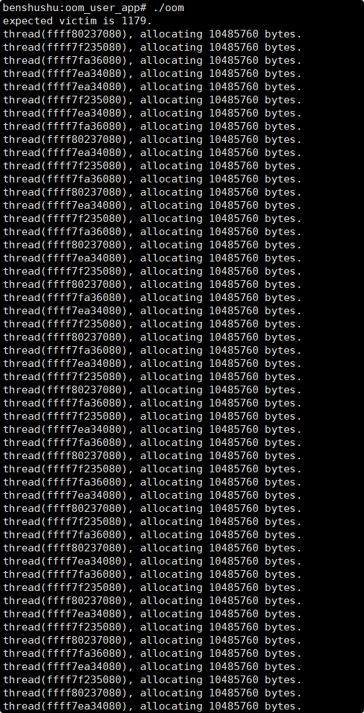

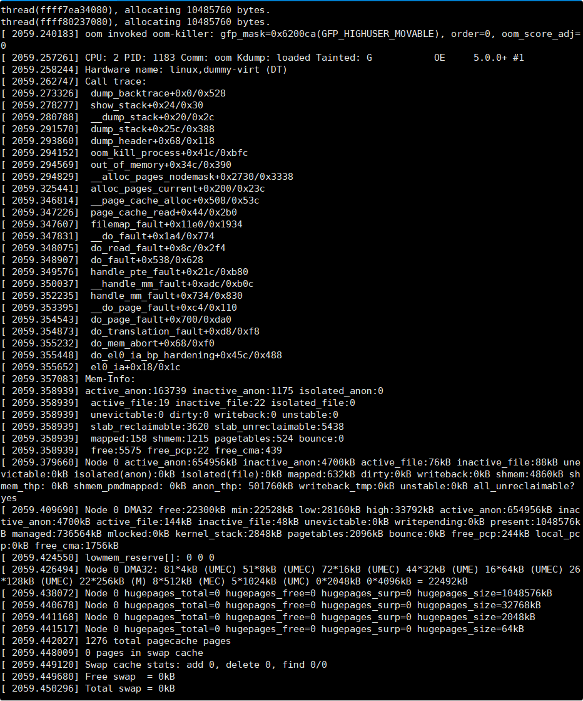

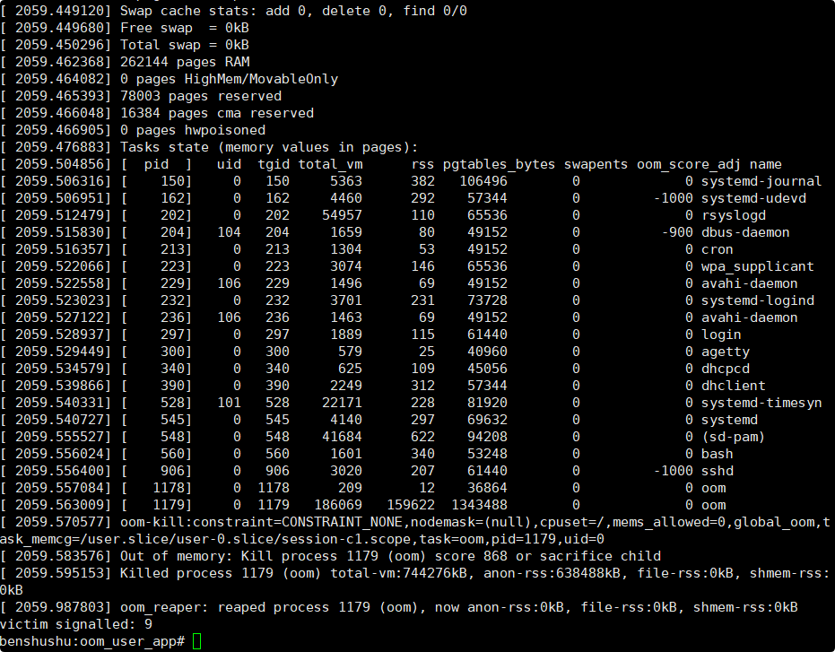

​		上面 log 显示已经触发了 OOM。从下面这句话：

```
[ 1839.132019] oom invoked oom-killer: 

gfp_mask=0x6080c0(GFP_KERNEL|__GFP_ZERO), order=0, oom_score_adj=0
```

​		从“order=0”可以看出，系统想分配一个页面的时候就触发了 OOM，分配的掩码为：GFP_KERNEL|__GFP_ZERO。

​		读者要分析上述的 OOM 日志，可以参考《奔跑吧 linux 内核》第二版卷 1 的第6.3.3 章。

### 实验清理

```
make clean
```

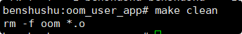

## （2） 内核驱动方式

### 下面是本实验的实验步骤。

### 启动 QEMU+runninglinuxkernel。

```shell
$ ./run_rlk_arm64.sh run
```

### 进入本实验的参考代码。

```
 cd /mnt/rlk_lab/rlk_basic/chapter_9_mm/lab8_oom/oom_kernel_driver/
```

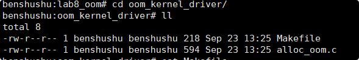

### 编译内核模块。

```shell
benshushu:oom_kernel_driver# make
make -C /lib/modules/`uname -r`/build 
M=/mnt/rlk_lab/rlk_basic/chapter_9_mm/lab8_oom/oom_kernel_driver modules;
make[1]: Entering directory '/usr/src/linux'
 CC [M] 
/mnt/rlk_lab/rlk_basic/chapter_9_mm/lab8_oom/oom_kernel_driver/alloc_oom.o
 LD [M] 
/mnt/rlk_lab/rlk_basic/chapter_9_mm/lab8_oom/oom_kernel_driver/alloc-oom.o
 Building modules, stage 2.
 MODPOST 1 modules
make[2]: Warning: File 
'/mnt/rlk_lab/rlk_basic/chapter_9_mm/lab8_oom/oom_kernel_driver/allocoom.mod.c' has modification time 0.0036 s in the future
 CC 
/mnt/rlk_lab/rlk_basic/chapter_9_mm/lab8_oom/oom_kernel_driver/allocoom.mod.o
 LD [M] 
/mnt/rlk_lab/rlk_basic/chapter_9_mm/lab8_oom/oom_kernel_driver/alloc-oom.ko
make[2]: warning: Clock skew detected. Your build may be incomplete.
make[1]: Leaving directory '/usr/src/linux'
```

```makefile
BASEINCLUDE ?= /lib/modules/`uname -r`/build

alloc-oom-objs := alloc_oom.o

obj-m	:=   alloc-oom.o
all :
	$(MAKE) -C $(BASEINCLUDE) M=$(PWD) modules;

clean:
	$(MAKE) -C $(BASEINCLUDE) M=$(PWD) clean;
	rm -f *.ko;
```

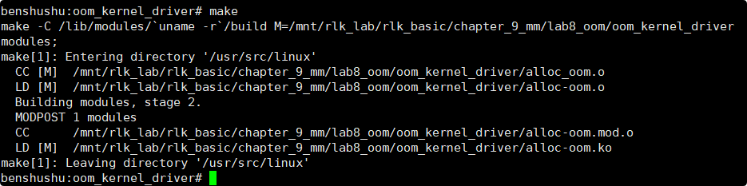

### 安装内核模块。

```
benshushu:oom_kernel_driver# insmod alloc-oom.ko 
[ 2370.141158] insmod invoked oom-killer: gfp_mask=0x6000c0(GFP_KERNEL), 
order=0, oom_score_adj=0
[ 2370.149294] CPU: 0 PID: 2081 Comm: insmod Kdump: loaded Tainted: G 
O 5.0.0+ #4
[ 2370.150601] Hardware name: linux,dummy-virt (DT)
[ 2370.151585] Call trace:
[ 2370.152965] dump_backtrace+0x0/0x528
[ 2370.153513] show_stack+0x24/0x30
[ 2370.153684] __dump_stack+0x20/0x2c
[ 2370.153842] dump_stack+0x25c/0x388
[ 2370.154002] dump_header+0x68/0x118
[ 2370.154198] oom_kill_process+0x41c/0xbfc
[ 2370.154403] out_of_memory+0x34c/0x390
[ 2370.154571] __alloc_pages_nodemask+0x2730/0x3338
[ 2370.154772] alloc_pages_current+0x200/0x23c
[ 2370.155940] my_init+0x3c/0x1000 [alloc_oom]
[ 2370.156322] do_one_initcall+0x494/0xad8
[ 2370.156577] do_init_module+0xb4/0x2f8
[ 2370.156816] load_module+0x7fc/0xb0c
[ 2370.157347] __se_sys_finit_module+0x148/0x184
[ 2370.157565] __arm64_sys_finit_module+0x40/0x48
[ 2370.157805] __invoke_syscall+0x24/0x2c
[ 2370.158088] invoke_syscall+0xa4/0xd8
[ 2370.158291] el0_svc_common+0x100/0x1e4
[ 2370.158515] el0_svc_handler+0x418/0x444
[ 2370.158759] el0_svc+0x8/0xc
[ 2370.160864] Mem-Info:
[ 2370.162473] active_anon:4130 inactive_anon:2328 isolated_anon:22
[ 2370.162473] active_file:12 inactive_file:20 isolated_file:0
[ 2370.162473] unevictable:0 dirty:0 writeback:0 unstable:0
[ 2370.162473] slab_reclaimable:3545 slab_unreclaimable:5235
[ 2370.162473] mapped:205 shmem:2361 pagetables:210 bounce:0
[ 2370.162473] free:21800 free_pcp:422 free_cma:16215
[ 2370.167791] Node 0 active_anon:16520kB inactive_anon:9312kB 
active_file:48kB inactive_file:180kB unevictable:0kB isolated(anon):88kB 
isolated(file):0
kB mapped:820kB dirty:0kB writeback:0kB shmem:9444kB shmem_thp: 0kB 
shmem_pmdmapped: 0kB anon_thp: 0kB writeback_tmp:0kB unstable:0kB 
all_unreclaimable?
no
[ 2370.172651] Node 0 DMA32 free:87200kB min:22528kB low:28160kB high:33792kB 
active_anon:16520kB inactive_anon:9312kB active_file:48kB inactive_file:80
kB unevictable:0kB writepending:0kB present:1048576kB managed:737092kB 
mlocked:0kB kernel_stack:2624kB pagetables:840kB bounce:0kB free_pcp:1764kB 
local
_pcp:512kB free_cma:64860kB
[ 2370.179365] lowmem_reserve[]: 0 0 0
[ 2370.181324] Node 0 DMA32: 696*4kB (UMEC) 430*8kB (UMEC) 261*16kB (UMEC) 
131*32kB (UMEC) 49*64kB (MEC) 15*128kB (MC) 5*256kB (M) 4*512kB (UM) 0*1024kB
1*2048kB (C) 15*4096kB (C) = 86464kB
[ 2370.184769] Node 0 hugepages_total=0 hugepages_free=0 hugepages_surp=0 
hugepages_size=1048576kB
[ 2370.186408] Node 0 hugepages_total=0 hugepages_free=0 hugepages_surp=0 
hugepages_size=32768kB
[ 2370.187431] Node 0 hugepages_total=0 hugepages_free=0 hugepages_surp=0 
hugepages_size=2048kB
[ 2370.187855] Node 0 hugepages_total=0 hugepages_free=0 hugepages_surp=0 
hugepages_size=64kB
[ 2370.189774] 2442 total pagecache pages
[ 2370.190499] 0 pages in swap cache
[ 2370.190712] Swap cache stats: add 0, delete 0, find 0/0
[ 2370.191002] Free swap = 0kB
[ 2370.191228] Total swap = 0kB
[ 2370.191881] 262144 pages RAM
[ 2370.193029] 0 pages HighMem/MovableOnly
[ 2370.194026] 77871 pages reserved
[ 2370.194724] 16384 pages cma reserved
[ 2370.194966] 0 pages hwpoisoned
[ 2370.195636] Tasks state (memory values in pages):
[ 2370.195873] [ pid ] uid tgid total_vm rss pgtables_bytes swapents 
oom_score_adj name
[ 2370.198173] [ 144] 0 144 8619 455 122880 0 
0 systemd-journal
[ 2370.199158] [ 158] 0 158 4473 251 61440 0 -
1000 systemd-udevd
[ 2370.199594] [ 194] 0 194 1385 51 53248 0 
0 cron
[ 2370.200608] [ 195] 0 195 54969 153 69632 0 
0 rsyslogd
[ 2370.202048] [ 201] 0 201 3753 231 73728 0 
0 systemd-logind
[ 2370.203196] [ 202] 104 202 1707 134 53248 0 -
900 dbus-daemon
[ 2370.203749] [ 211] 106 211 1508 70 53248 0 
0 avahi-daemon
[ 2370.205218] [ 214] 0 214 3087 147 65536 0 
0 wpa_supplicant
[ 2370.206368] [ 220] 106 220 1475 70 53248 0 
0 avahi-daemon
[ 2370.207548] [ 310] 0 310 624 26 45056 0 
0 agetty
[ 2370.208947] [ 312] 0 312 1936 116 57344 0 
0 login
[ 2370.210704] [ 334] 0 334 618 95 40960 0 
0 dhcpcd
[ 2370.211333] [ 391] 0 391 2263 313 53248 0 
0 dhclient
[ 2370.211911] [ 527] 101 527 22224 231 73728 0 
0 systemd-timesyn
[ 2370.213520] [ 537] 0 537 4189 297 69632 0 
0 systemd
[ 2370.214447] [ 540] 0 540 41764 650 90112 0 
0 (sd-pam)
[ 2370.215018] [ 552] 0 552 1671 359 49152 0 
0 bash
[ 2370.215731] [ 918] 0 918 3088 212 65536 0 -
1000 sshd
[ 2370.216119] [ 2081] 0 2081 1361 71 45056 0 
0 insmod
[ 2370.217320] [ 2082] 0 2082 4473 253 61440 0 
0 systemd-udevd
[ 2370.218254] oom-kill:constraint=CONSTRAINT_NONE,nodemask=(null),cpuset=/,mems_allowed=0,globa
l_oom,task_memcg=/user.slice/user-0.slice/user@0.service
,task=(sd-pam),pid=540,uid=0
[ 2370.220529] Out of memory: Kill process 540 ((sd-pam)) score 3 or 
sacrifice child
[ 2370.223740] Killed process 540 ((sd-pam)) total-vm:167056kB, anonrss:2600kB, file-rss:0kB, shmem-rss:0kB
[ 2370.399077] oom_reaper: reaped process 540 ((sd-pam)), now anon-rss:0kB, 
file-rss:0kB, shmem-rss:0kB
```

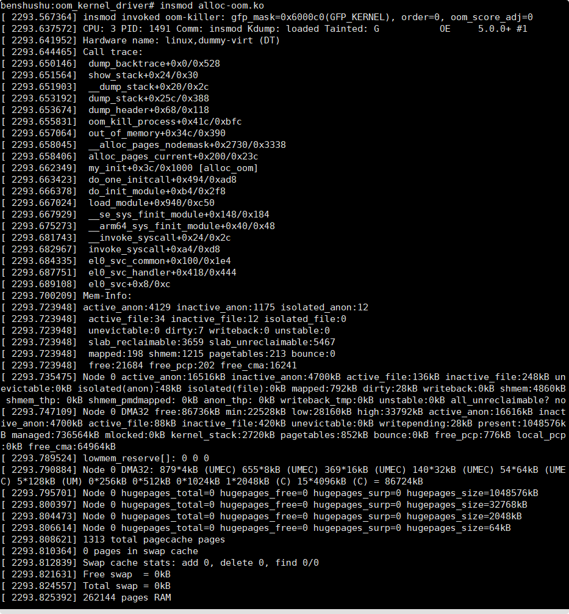

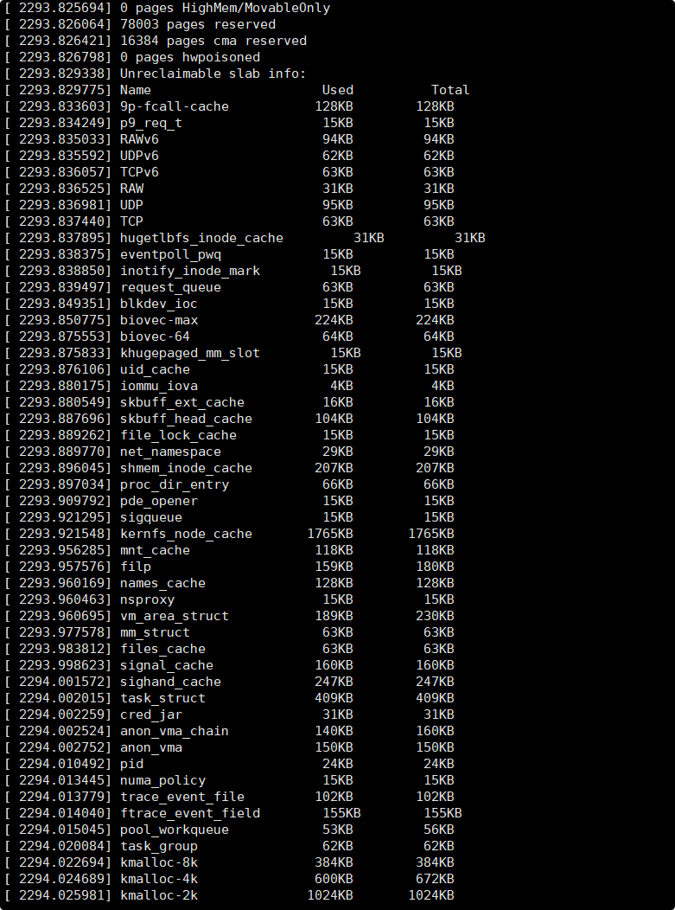

报错

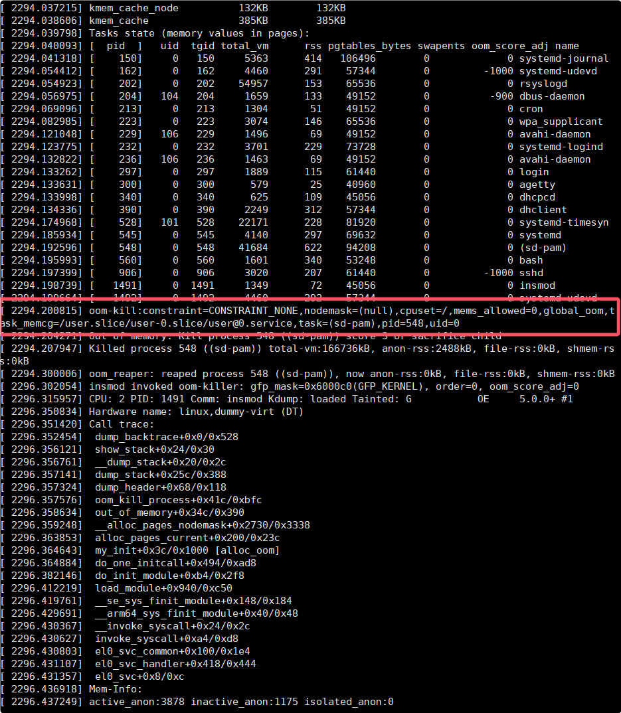

```
benshushu:oom_kernel_driver# insmod alloc-oom.ko 
[ 2293.567364] insmod invoked oom-killer: gfp_mask=0x6000c0(GFP_KERNEL), order=0, oom_score_adj=0
[ 2293.637572] CPU: 3 PID: 1491 Comm: insmod Kdump: loaded Tainted: G           OE     5.0.0+ #1
[ 2293.641952] Hardware name: linux,dummy-virt (DT)
[ 2293.644465] Call trace:
[ 2293.650146]  dump_backtrace+0x0/0x528
[ 2293.651564]  show_stack+0x24/0x30
[ 2293.651903]  __dump_stack+0x20/0x2c
[ 2293.653192]  dump_stack+0x25c/0x388
[ 2293.653674]  dump_header+0x68/0x118
[ 2293.655831]  oom_kill_process+0x41c/0xbfc
[ 2293.657064]  out_of_memory+0x34c/0x390
[ 2293.658045]  __alloc_pages_nodemask+0x2730/0x3338
[ 2293.658406]  alloc_pages_current+0x200/0x23c
[ 2293.662349]  my_init+0x3c/0x1000 [alloc_oom]
[ 2293.663423]  do_one_initcall+0x494/0xad8
[ 2293.666378]  do_init_module+0xb4/0x2f8
[ 2293.667024]  load_module+0x940/0xc50
[ 2293.667929]  __se_sys_finit_module+0x148/0x184
[ 2293.675273]  __arm64_sys_finit_module+0x40/0x48
[ 2293.681743]  __invoke_syscall+0x24/0x2c
[ 2293.682967]  invoke_syscall+0xa4/0xd8
[ 2293.684335]  el0_svc_common+0x100/0x1e4
[ 2293.687751]  el0_svc_handler+0x418/0x444
[ 2293.689108]  el0_svc+0x8/0xc
[ 2293.700209] Mem-Info:
[ 2293.723948] active_anon:4129 inactive_anon:1175 isolated_anon:12
[ 2293.723948]  active_file:34 inactive_file:12 isolated_file:0
[ 2293.723948]  unevictable:0 dirty:7 writeback:0 unstable:0
[ 2293.723948]  slab_reclaimable:3659 slab_unreclaimable:5467
[ 2293.723948]  mapped:198 shmem:1215 pagetables:213 bounce:0
[ 2293.723948]  free:21684 free_pcp:202 free_cma:16241
[ 2293.735475] Node 0 active_anon:16516kB inactive_anon:4700kB active_file:136kB inactive_file:248kB unevictable:0kB isolated(anon):48kB isolated(file):0kB mapped:792kB dirty:28kB writeback:0kB shmem:4860kB shmem_thp: 0kB shmem_pmdmapped: 0kB anon_thp: 0kB writeback_tmp:0kB unstable:0kB all_unreclaimable? no
[ 2293.747109] Node 0 DMA32 free:86736kB min:22528kB low:28160kB high:33792kB active_anon:16616kB inactive_anon:4700kB active_file:88kB inactive_file:420kB unevictable:0kB writepending:28kB present:1048576kB managed:736564kB mlocked:0kB kernel_stack:2720kB pagetables:852kB bounce:0kB free_pcp:776kB local_pcp:0kB free_cma:64964kB
[ 2293.789524] lowmem_reserve[]: 0 0 0
[ 2293.790884] Node 0 DMA32: 879*4kB (UMEC) 655*8kB (UMEC) 369*16kB (UMEC) 140*32kB (UMEC) 54*64kB (UMEC) 5*128kB (UM) 0*256kB 0*512kB 0*1024kB 1*2048kB (C) 15*4096kB (C) = 86724kB
[ 2293.795701] Node 0 hugepages_total=0 hugepages_free=0 hugepages_surp=0 hugepages_size=1048576kB
[ 2293.800397] Node 0 hugepages_total=0 hugepages_free=0 hugepages_surp=0 hugepages_size=32768kB
[ 2293.804473] Node 0 hugepages_total=0 hugepages_free=0 hugepages_surp=0 hugepages_size=2048kB
[ 2293.806614] Node 0 hugepages_total=0 hugepages_free=0 hugepages_surp=0 hugepages_size=64kB
[ 2293.808621] 1313 total pagecache pages
[ 2293.810364] 0 pages in swap cache
[ 2293.812839] Swap cache stats: add 0, delete 0, find 0/0
[ 2293.821631] Free swap  = 0kB
[ 2293.824557] Total swap = 0kB
[ 2293.825392] 262144 pages RAM
[ 2293.825694] 0 pages HighMem/MovableOnly
[ 2293.826064] 78003 pages reserved
[ 2293.826421] 16384 pages cma reserved
[ 2293.826798] 0 pages hwpoisoned
[ 2293.829338] Unreclaimable slab info:
[ 2293.829775] Name                      Used          Total
[ 2293.833603] 9p-fcall-cache           128KB        128KB
[ 2293.834249] p9_req_t                  15KB         15KB
[ 2293.835033] RAWv6                     94KB         94KB
[ 2293.835592] UDPv6                     62KB         62KB
[ 2293.836057] TCPv6                     63KB         63KB
[ 2293.836525] RAW                       31KB         31KB
[ 2293.836981] UDP                       95KB         95KB
[ 2293.837440] TCP                       63KB         63KB
[ 2293.837895] hugetlbfs_inode_cache         31KB         31KB
[ 2293.838375] eventpoll_pwq             15KB         15KB
[ 2293.838850] inotify_inode_mark         15KB         15KB
[ 2293.839497] request_queue             63KB         63KB
[ 2293.849351] blkdev_ioc                15KB         15KB
[ 2293.850775] biovec-max               224KB        224KB
[ 2293.875553] biovec-64                 64KB         64KB
[ 2293.875833] khugepaged_mm_slot         15KB         15KB
[ 2293.876106] uid_cache                 15KB         15KB
[ 2293.880175] iommu_iova                 4KB          4KB
[ 2293.880549] skbuff_ext_cache          16KB         16KB
[ 2293.887696] skbuff_head_cache        104KB        104KB
[ 2293.889262] file_lock_cache           15KB         15KB
[ 2293.889770] net_namespace             29KB         29KB
[ 2293.896045] shmem_inode_cache        207KB        207KB
[ 2293.897034] proc_dir_entry            66KB         66KB
[ 2293.909792] pde_opener                15KB         15KB
[ 2293.921295] sigqueue                  15KB         15KB
[ 2293.921548] kernfs_node_cache       1765KB       1765KB
[ 2293.956285] mnt_cache                118KB        118KB
[ 2293.957576] filp                     159KB        180KB
[ 2293.960169] names_cache              128KB        128KB
[ 2293.960463] nsproxy                   15KB         15KB
[ 2293.960695] vm_area_struct           189KB        230KB
[ 2293.977578] mm_struct                 63KB         63KB
[ 2293.983812] files_cache               63KB         63KB
[ 2293.998623] signal_cache             160KB        160KB
[ 2294.001572] sighand_cache            247KB        247KB
[ 2294.002015] task_struct              409KB        409KB
[ 2294.002259] cred_jar                  31KB         31KB
[ 2294.002524] anon_vma_chain           140KB        160KB
[ 2294.002752] anon_vma                 150KB        150KB
[ 2294.010492] pid                       24KB         24KB
[ 2294.013445] numa_policy               15KB         15KB
[ 2294.013779] trace_event_file         102KB        102KB
[ 2294.014040] ftrace_event_field        155KB        155KB
[ 2294.015045] pool_workqueue            53KB         56KB
[ 2294.020084] task_group                62KB         62KB
[ 2294.022694] kmalloc-8k               384KB        384KB
[ 2294.024689] kmalloc-4k               600KB        672KB
[ 2294.025981] kmalloc-2k              1024KB       1024KB
[ 2294.026375] kmalloc-1k               576KB        576KB
[ 2294.031001] kmalloc-512              488KB        488KB
[ 2294.033345] kmalloc-256              344KB        344KB
[ 2294.036844] kmalloc-128             1612KB       1644KB
[ 2294.037215] kmem_cache_node          132KB        132KB
[ 2294.038606] kmem_cache               385KB        385KB
[ 2294.039798] Tasks state (memory values in pages):
[ 2294.040093] [  pid  ]   uid  tgid total_vm      rss pgtables_bytes swapents oom_score_adj name
[ 2294.041318] [    150]     0   150     5363      414   106496        0             0 systemd-journal
[ 2294.054412] [    162]     0   162     4460      291    57344        0         -1000 systemd-udevd
[ 2294.054923] [    202]     0   202    54957      153    65536        0             0 rsyslogd
[ 2294.056975] [    204]   104   204     1659      133    49152        0          -900 dbus-daemon
[ 2294.069096] [    213]     0   213     1304       51    49152        0             0 cron
[ 2294.082985] [    223]     0   223     3074      146    65536        0             0 wpa_supplicant
[ 2294.121048] [    229]   106   229     1496       69    49152        0             0 avahi-daemon
[ 2294.123775] [    232]     0   232     3701      229    73728        0             0 systemd-logind
[ 2294.132822] [    236]   106   236     1463       69    49152        0             0 avahi-daemon
[ 2294.133262] [    297]     0   297     1889      115    61440        0             0 login
[ 2294.133631] [    300]     0   300      579       25    40960        0             0 agetty
[ 2294.133998] [    340]     0   340      625      109    45056        0             0 dhcpcd
[ 2294.134336] [    390]     0   390     2249      312    57344        0             0 dhclient
[ 2294.174968] [    528]   101   528    22171      228    81920        0             0 systemd-timesyn
[ 2294.185934] [    545]     0   545     4140      297    69632        0             0 systemd
[ 2294.192596] [    548]     0   548    41684      622    94208        0             0 (sd-pam)
[ 2294.195993] [    560]     0   560     1601      340    53248        0             0 bash
[ 2294.197399] [    906]     0   906     3020      207    61440        0         -1000 sshd
[ 2294.198739] [   1491]     0  1491     1349       72    45056        0             0 insmod
[ 2294.199664] [   1492]     0  1492     4460      292    57344        0             0 systemd-udevd
[ 2294.200815] oom-kill:constraint=CONSTRAINT_NONE,nodemask=(null),cpuset=/,mems_allowed=0,global_oom,task_memcg=/user.slice/user-0.slice/user@0.service,task=(sd-pam),pid=548,uid=0
[ 2294.204271] Out of memory: Kill process 548 ((sd-pam)) score 3 or sacrifice child
[ 2294.207947] Killed process 548 ((sd-pam)) total-vm:166736kB, anon-rss:2488kB, file-rss:0kB, shmem-rss:0kB
[ 2294.300006] oom_reaper: reaped process 548 ((sd-pam)), now anon-rss:0kB, file-rss:0kB, shmem-rss:0kB
[ 2296.302054] insmod invoked oom-killer: gfp_mask=0x6000c0(GFP_KERNEL), order=0, oom_score_adj=0
[ 2296.315957] CPU: 2 PID: 1491 Comm: insmod Kdump: loaded Tainted: G           OE     5.0.0+ #1
[ 2296.350834] Hardware name: linux,dummy-virt (DT)
[ 2296.351420] Call trace:
[ 2296.352454]  dump_backtrace+0x0/0x528
[ 2296.356121]  show_stack+0x24/0x30
[ 2296.356761]  __dump_stack+0x20/0x2c
[ 2296.357141]  dump_stack+0x25c/0x388
[ 2296.357324]  dump_header+0x68/0x118
[ 2296.357576]  oom_kill_process+0x41c/0xbfc
[ 2296.358634]  out_of_memory+0x34c/0x390
[ 2296.359248]  __alloc_pages_nodemask+0x2730/0x3338
[ 2296.363853]  alloc_pages_current+0x200/0x23c
[ 2296.364643]  my_init+0x3c/0x1000 [alloc_oom]
[ 2296.364884]  do_one_initcall+0x494/0xad8
[ 2296.382146]  do_init_module+0xb4/0x2f8
[ 2296.412219]  load_module+0x940/0xc50
[ 2296.419761]  __se_sys_finit_module+0x148/0x184
[ 2296.429691]  __arm64_sys_finit_module+0x40/0x48
[ 2296.430367]  __invoke_syscall+0x24/0x2c
[ 2296.430627]  invoke_syscall+0xa4/0xd8
[ 2296.430803]  el0_svc_common+0x100/0x1e4
[ 2296.431107]  el0_svc_handler+0x418/0x444
[ 2296.431357]  el0_svc+0x8/0xc
[ 2296.436918] Mem-Info:
[ 2296.437249] active_anon:3878 inactive_anon:1175 isolated_anon:0
[ 2296.437249]  active_file:19 inactive_file:29 isolated_file:1
[ 2296.437249]  unevictable:0 dirty:0 writeback:0 unstable:0
[ 2296.437249]  slab_reclaimable:3660 slab_unreclaimable:5468
[ 2296.437249]  mapped:171 shmem:1215 pagetables:187 bounce:0
[ 2296.437249]  free:21838 free_pcp:97 free_cma:16250
[ 2296.441930] Node 0 active_anon:15512kB inactive_anon:4700kB active_file:76kB inactive_file:96kB unevictable:0kB isolated(anon):0kB isolated(file):128kB mapped:684kB dirty:0kB writeback:0kB shmem:4860kB shmem_thp: 0kB shmem_pmdmapped: 0kB anon_thp: 0kB writeback_tmp:0kB unstable:0kB all_unreclaimable? no
[ 2296.447394] Node 0 DMA32 free:87352kB min:22528kB low:28160kB high:33792kB active_anon:15512kB inactive_anon:4700kB active_file:76kB inactive_file:120kB unevictable:0kB writepending:0kB present:1048576kB managed:736564kB mlocked:0kB kernel_stack:2656kB pagetables:748kB bounce:0kB free_pcp:368kB local_pcp:120kB free_cma:65000kB
[ 2296.456385] lowmem_reserve[]: 0 0 0
[ 2296.465380] Node 0 DMA32: 810*4kB (UMEC) 573*8kB (UMEC) 321*16kB (UMEC) 127*32kB (MEC) 43*64kB (MEC) 4*128kB (M) 1*256kB (U) 0*512kB 1*1024kB (U) 2*2048kB (MC) 15*4096kB (C) = 87104kB
[ 2296.486232] Node 0 hugepages_total=0 hugepages_free=0 hugepages_surp=0 hugepages_size=1048576kB
[ 2296.487255] Node 0 hugepages_total=0 hugepages_free=0 hugepages_surp=0 hugepages_size=32768kB
[ 2296.490101] Node 0 hugepages_total=0 hugepages_free=0 hugepages_surp=0 hugepages_size=2048kB
[ 2296.490693] Node 0 hugepages_total=0 hugepages_free=0 hugepages_surp=0 hugepages_size=64kB
[ 2296.491709] 1323 total pagecache pages
[ 2296.494452] 0 pages in swap cache
[ 2296.494665] Swap cache stats: add 0, delete 0, find 0/0
[ 2296.503438] Free swap  = 0kB
[ 2296.504033] Total swap = 0kB
[ 2296.504183] 262144 pages RAM
[ 2296.514428] 0 pages HighMem/MovableOnly
[ 2296.526480] 78003 pages reserved
[ 2296.526782] 16384 pages cma reserved
[ 2296.526948] 0 pages hwpoisoned
[ 2296.546887] Unreclaimable slab info:
[ 2296.554492] Name                      Used          Total
[ 2296.555049] 9p-fcall-cache           128KB        128KB
[ 2296.572327] p9_req_t                  15KB         15KB
[ 2296.575125] RAWv6                     94KB         94KB
[ 2296.577841] UDPv6                     62KB         62KB
[ 2296.578175] TCPv6                     63KB         63KB
[ 2296.578546] RAW                       31KB         31KB
[ 2296.578839] UDP                       95KB         95KB
[ 2296.583559] TCP                       63KB         63KB
[ 2296.585490] hugetlbfs_inode_cache         31KB         31KB
[ 2296.586960] eventpoll_pwq             15KB         15KB
[ 2296.589310] inotify_inode_mark         15KB         15KB
[ 2296.593721] request_queue             63KB         63KB
[ 2296.594206] blkdev_ioc                15KB         15KB
[ 2296.594530] biovec-max               224KB        224KB
[ 2296.627936] biovec-64                 64KB         64KB
[ 2296.628377] khugepaged_mm_slot         15KB         15KB
[ 2296.629150] uid_cache                 15KB         15KB
[ 2296.629454] iommu_iova                 4KB          4KB
[ 2296.629688] skbuff_ext_cache          16KB         16KB
[ 2296.629946] skbuff_head_cache        104KB        104KB
[ 2296.630171] file_lock_cache           15KB         15KB
[ 2296.638563] net_namespace             29KB         29KB
[ 2296.639627] shmem_inode_cache        207KB        207KB
[ 2296.642600] proc_dir_entry            66KB         66KB
[ 2296.643314] pde_opener                15KB         15KB
[ 2296.645718] sigqueue                  15KB         15KB
[ 2296.646300] kernfs_node_cache       1765KB       1765KB
[ 2296.646801] mnt_cache                118KB        118KB
[ 2296.652179] filp                     159KB        180KB
[ 2296.653073] names_cache              128KB        128KB
[ 2296.653795] nsproxy                   15KB         15KB
[ 2296.654859] vm_area_struct           189KB        230KB
[ 2296.655718] mm_struct                 63KB         63KB
[ 2296.656335] files_cache               63KB         63KB
[ 2296.657774] signal_cache             160KB        160KB
[ 2296.658729] sighand_cache            247KB        247KB
[ 2296.676856] task_struct              409KB        409KB
[ 2296.682330] cred_jar                  31KB         31KB
[ 2296.722925] anon_vma_chain           140KB        160KB
[ 2296.726719] anon_vma                 150KB        150KB
[ 2296.765890] pid                       24KB         24KB
[ 2296.777970] numa_policy               15KB         15KB
[ 2296.808781] trace_event_file         102KB        102KB
[ 2296.809192] ftrace_event_field        155KB        155KB
[ 2296.809469] pool_workqueue            56KB         56KB
[ 2296.809697] task_group                62KB         62KB
[ 2296.809950] kmalloc-8k               384KB        384KB
[ 2296.823455] kmalloc-4k               600KB        672KB
[ 2296.830776] kmalloc-2k              1024KB       1024KB
[ 2296.838665] kmalloc-1k               576KB        576KB
[ 2296.838976] kmalloc-512              488KB        488KB
[ 2296.839286] kmalloc-256              344KB        344KB
[ 2296.839525] kmalloc-128             1612KB       1644KB
[ 2296.852533] kmem_cache_node          132KB        132KB
[ 2296.852916] kmem_cache               385KB        385KB
[ 2296.853240] Tasks state (memory values in pages):
[ 2296.853450] [  pid  ]   uid  tgid total_vm      rss pgtables_bytes swapents oom_score_adj name
[ 2296.853898] [    150]     0   150     5363      603   106496        0             0 systemd-journal
[ 2296.854382] [    162]     0   162     4460      290    57344        0         -1000 systemd-udevd
[ 2296.854811] [    202]     0   202    54957      207    65536        0             0 rsyslogd
[ 2296.855216] [    204]   104   204     1659      133    49152        0          -900 dbus-daemon
[ 2296.855599] [    213]     0   213     1304       51    49152        0             0 cron
[ 2296.855935] [    223]     0   223     3074      146    65536        0             0 wpa_supplicant
[ 2296.856322] [    229]   106   229     1496       69    49152        0             0 avahi-daemon
[ 2296.873932] [    232]     0   232     3701      229    73728        0             0 systemd-logind
[ 2296.893260] [    236]   106   236     1463       69    49152        0             0 avahi-daemon
[ 2296.908071] [    297]     0   297     1889      115    61440        0             0 login
[ 2296.914646] [    300]     0   300      579       25    40960        0             0 agetty
[ 2296.920801] [    340]     0   340      625      109    45056        0             0 dhcpcd
[ 2296.921252] [    390]     0   390     2249      312    57344        0             0 dhclient
[ 2296.921696] [    528]   101   528    22171      228    81920        0             0 systemd-timesyn
[ 2296.922097] [    545]     0   545     4140      313    69632        0             0 systemd
[ 2296.922671] [    560]     0   560     1601      340    53248        0             0 bash
[ 2296.923082] [    906]     0   906     3020      207    61440        0         -1000 sshd
[ 2296.923515] [   1491]     0  1491     1349       72    45056        0             0 insmod
[ 2296.959269] oom-kill:constraint=CONSTRAINT_NONE,nodemask=(null),cpuset=/,mems_allowed=0,global_oom,task_memcg=/system.slice/systemd-journald.service,task=systemd-journal,pid=150,uid=0
[ 2296.965231] Out of memory: Kill process 150 (systemd-journal) score 2 or sacrifice child
[ 2296.979752] Killed process 150 (systemd-journal) total-vm:21452kB, anon-rss:1032kB, file-rss:700kB, shmem-rss:680kB
[ 2297.650625] oom_reaper: reaped process 150 (systemd-journal), now anon-rss:0kB, file-rss:0kB, shmem-rss:680kB
[ 2301.204989] systemd[1]: systemd-journald.service: Service has no hold-off time (RestartSec=0), scheduling restart.
[ 2301.399519] systemd[1]: systemd-journald.service: Scheduled restart job, restart counter is at 1.
[ 2302.641521] systemd[1]: systemd-journal-flush.service: Succeeded.
[ 2302.792258] systemd[1]: Stopped Flush Journal to Persistent Storage.
[ 2302.833667] systemd[1]: Stopping Flush Journal to Persistent Storage...
[ 2302.892998] systemd[1]: Stopped Journal Service.
[ 2303.083737] systemd[1]: Condition check resulted in Journal Audit Socket being skipped.
[ 2303.423844] systemd invoked oom-killer: gfp_mask=0x6040c0(GFP_KERNEL|__GFP_COMP), order=0, oom_score_adj=0
[ 2303.438153] CPU: 1 PID: 545 Comm: systemd Kdump: loaded Tainted: G           OE     5.0.0+ #1
[ 2303.442886] Hardware name: linux,dummy-virt (DT)
[ 2303.443537] Call trace:
[ 2303.443750]  dump_backtrace+0x0/0x528
[ 2303.445018]  show_stack+0x24/0x30
[ 2303.446220]  __dump_stack+0x20/0x2c
[ 2303.446463]  dump_stack+0x25c/0x388
[ 2303.446652]  dump_header+0x68/0x118
[ 2303.446823]  oom_kill_process+0x41c/0xbfc
[ 2303.447102]  out_of_memory+0x34c/0x390
[ 2303.447284]  __alloc_pages_nodemask+0x2730/0x3338
[ 2303.447530]  alloc_pages_current+0x200/0x23c
[ 2303.447730]  allocate_slab+0x404/0x1638
[ 2303.450736]  new_slab+0xd0/0x100
[ 2303.452928]  ___slab_alloc+0xcac/0x1118
[ 2303.453270]  __slab_alloc+0x64/0xb0
[ 2303.453486]  __kmalloc_node+0x8e0/0x11b0
[ 2303.458481]  kvmalloc_node+0xd4/0x124
[ 2303.461338]  seq_buf_alloc+0x38/0x40
[ 2303.466228]  seq_read+0x134/0xa58
[ 2303.466617]  __vfs_read+0x54/0x90
[ 2303.475537]  vfs_read+0x11c/0x258
[ 2303.478984]  ksys_read+0xb4/0x164
[ 2303.485385]  __se_sys_read+0x48/0x58
[ 2303.517613]  __arm64_sys_read+0x40/0x48
[ 2303.518103]  __invoke_syscall+0x24/0x2c
[ 2303.519746]  invoke_syscall+0xa4/0xd8
[ 2303.533154]  el0_svc_common+0x100/0x1e4
[ 2303.533478]  el0_svc_handler+0x418/0x444
[ 2303.533671]  el0_svc+0x8/0xc
[ 2303.548750] Mem-Info:
[ 2303.549506] active_anon:3621 inactive_anon:1174 isolated_anon:0
[ 2303.549506]  active_file:315 inactive_file:271 isolated_file:60
[ 2303.549506]  unevictable:0 dirty:0 writeback:0 unstable:0
[ 2303.549506]  slab_reclaimable:3614 slab_unreclaimable:5363
[ 2303.549506]  mapped:550 shmem:1215 pagetables:166 bounce:0
[ 2303.549506]  free:21161 free_pcp:127 free_cma:16250
[ 2303.556322] Node 0 active_anon:14484kB inactive_anon:4696kB active_file:1260kB inactive_file:1184kB unevictable:0kB isolated(anon):0kB isolated(file):112kB mapped:2200kB dirty:0kB writeback:0kB shmem:4860kB shmem_thp: 0kB shmem_pmdmapped: 0kB anon_thp: 0kB writeback_tmp:0kB unstable:0kB all_unreclaimable? no
[ 2303.559922] Node 0 DMA32 free:84644kB min:22528kB low:28160kB high:33792kB active_anon:14484kB inactive_anon:4696kB active_file:1604kB inactive_file:1244kB unevictable:0kB writepending:0kB present:1048576kB managed:736564kB mlocked:0kB kernel_stack:2624kB pagetables:664kB bounce:0kB free_pcp:496kB local_pcp:120kB free_cma:65000kB
[ 2303.575994] lowmem_reserve[]: 0 0 0
[ 2303.593891] Node 0 DMA32: 206*4kB (UMEC) 538*8kB (UMEC) 338*16kB (MEC) 143*32kB (MEC) 50*64kB (UMEC) 4*128kB (M) 0*256kB 1*512kB (U) 0*1024kB 2*2048kB (MC) 15*4096kB (C) = 84872kB
[ 2303.610367] Node 0 hugepages_total=0 hugepages_free=0 hugepages_surp=0 hugepages_size=1048576kB
[ 2303.621441] Node 0 hugepages_total=0 hugepages_free=0 hugepages_surp=0 hugepages_size=32768kB
[ 2303.635408] Node 0 hugepages_total=0 hugepages_free=0 hugepages_surp=0 hugepages_size=2048kB
[ 2303.638499] Node 0 hugepages_total=0 hugepages_free=0 hugepages_surp=0 hugepages_size=64kB
[ 2303.643472] 1969 total pagecache pages
[ 2303.644076] 0 pages in swap cache
[ 2303.644527] Swap cache stats: add 0, delete 0, find 0/0
[ 2303.645003] Free swap  = 0kB
[ 2303.645261] Total swap = 0kB
[ 2303.645651] 262144 pages RAM
[ 2303.652086] 0 pages HighMem/MovableOnly
[ 2303.652565] 78003 pages reserved
[ 2303.652883] 16384 pages cma reserved
[ 2303.653199] 0 pages hwpoisoned
[ 2303.653511] Tasks state (memory values in pages):
[ 2303.653932] [  pid  ]   uid  tgid total_vm      rss pgtables_bytes swapents oom_score_adj name
[ 2303.654761] [    162]     0   162     4460      290    57344        0         -1000 systemd-udevd
[ 2303.656534] [    202]     0   202    54957      208    65536        0             0 rsyslogd
[ 2303.658364] [    204]   104   204     1659      219    49152        0          -900 dbus-daemon
[ 2303.659234] [    213]     0   213     1304       51    49152        0             0 cron
[ 2303.664304] [    223]     0   223     3074      146    65536        0             0 wpa_supplicant
[ 2303.665982] [    229]   106   229     1496       69    49152        0             0 avahi-daemon
[ 2303.669398] [    232]     0   232     3701      416    73728        0             0 systemd-logind
[ 2303.685937] [    236]   106   236     1463       69    49152        0             0 avahi-daemon
[ 2303.709256] [    297]     0   297     1889      115    61440        0             0 login
[ 2303.711319] [    300]     0   300      579       25    40960        0             0 agetty
[ 2303.711697] [    340]     0   340      625      109    45056        0             0 dhcpcd
[ 2303.712072] [    390]     0   390     2249      312    57344        0             0 dhclient
[ 2303.724021] [    528]   101   528    22171      228    81920        0             0 systemd-timesyn
[ 2303.726589] [    545]     0   545     4140      313    69632        0             0 systemd
[ 2303.729629] [    560]     0   560     1601      340    53248        0             0 bash
[ 2303.736039] [    906]     0   906     3020      207    61440        0         -1000 sshd
[ 2303.736488] [   1491]     0  1491     1349       72    45056        0             0 insmod
[ 2303.736853] oom-kill:constraint=CONSTRAINT_NONE,nodemask=(null),cpuset=/,mems_allowed=0,global_oom,task_memcg=/system.slice/systemd-logind.service,task=systemd-logind,pid=232,uid=0
[ 2303.754779] Out of memory: Kill process 232 (systemd-logind) score 2 or sacrifice child
[ 2303.768731] Killed process 232 (systemd-logind) total-vm:14804kB, anon-rss:940kB, file-rss:712kB, shmem-rss:0kB
[ 2304.109584] oom_reaper: reaped process 232 (systemd-logind), now anon-rss:0kB, file-rss:0kB, shmem-rss:0kB
[ 2305.013250] systemd invoked oom-killer: gfp_mask=0x6040c0(GFP_KERNEL|__GFP_COMP), order=0, oom_score_adj=0
[ 2305.013947] CPU: 0 PID: 545 Comm: systemd Kdump: loaded Tainted: G           OE     5.0.0+ #1
[ 2305.014925] Hardware name: linux,dummy-virt (DT)
[ 2305.015372] Call trace:
[ 2305.015648]  dump_backtrace+0x0/0x528
[ 2305.016103]  show_stack+0x24/0x30
[ 2305.016457]  __dump_stack+0x20/0x2c
[ 2305.016797]  dump_stack+0x25c/0x388
[ 2305.017123]  dump_header+0x68/0x118
[ 2305.017466]  oom_kill_process+0x41c/0xbfc
[ 2305.017848]  out_of_memory+0x34c/0x390
[ 2305.018183]  __alloc_pages_nodemask+0x2730/0x3338
[ 2305.018624]  alloc_pages_current+0x200/0x23c
[ 2305.019042]  allocate_slab+0x404/0x1638
[ 2305.019411]  new_slab+0xd0/0x100
[ 2305.019708]  ___slab_alloc+0xcac/0x1118
[ 2305.020073]  __slab_alloc+0x64/0xb0
[ 2305.020421]  __kmalloc_node+0x8e0/0x11b0
[ 2305.020790]  kvmalloc_node+0xd4/0x124
[ 2305.021123]  seq_buf_alloc+0x38/0x40
[ 2305.021471]  seq_read+0x134/0xa58
[ 2305.022549]  __vfs_read+0x54/0x90
[ 2305.022950]  vfs_read+0x11c/0x258
[ 2305.024010]  ksys_read+0xb4/0x164
[ 2305.082502]  __se_sys_read+0x48/0x58
[ 2305.082703]  __arm64_sys_read+0x40/0x48
[ 2305.083513]  __invoke_syscall+0x24/0x2c
[ 2305.084003]  invoke_syscall+0xa4/0xd8
[ 2305.084445]  el0_svc_common+0x100/0x1e4
[ 2305.085950]  el0_svc_handler+0x418/0x444
[ 2305.088775]  el0_svc+0x8/0xc
[ 2305.089708] Mem-Info:
[ 2305.093479] active_anon:3387 inactive_anon:1174 isolated_anon:0
[ 2305.093479]  active_file:26 inactive_file:0 isolated_file:0
[ 2305.093479]  unevictable:0 dirty:2 writeback:7 unstable:0
[ 2305.093479]  slab_reclaimable:3613 slab_unreclaimable:5363
[ 2305.093479]  mapped:1 shmem:1215 pagetables:154 bounce:0
[ 2305.093479]  free:21870 free_pcp:0 free_cma:16250
[ 2305.112438] Node 0 active_anon:13548kB inactive_anon:4696kB active_file:104kB inactive_file:0kB unevictable:0kB isolated(anon):0kB isolated(file):0kB mapped:4kB dirty:8kB writeback:28kB shmem:4860kB shmem_thp: 0kB shmem_pmdmapped: 0kB anon_thp: 0kB writeback_tmp:0kB unstable:0kB all_unreclaimable? yes
[ 2305.118707] Node 0 DMA32 free:87480kB min:22528kB low:28160kB high:33792kB active_anon:13548kB inactive_anon:4696kB active_file:208kB inactive_file:0kB unevictable:0kB writepending:36kB present:1048576kB managed:736564kB mlocked:0kB kernel_stack:2592kB pagetables:616kB bounce:0kB free_pcp:0kB local_pcp:0kB free_cma:65000kB
[ 2305.141555] lowmem_reserve[]: 0 0 0
[ 2305.150777] Node 0 DMA32: 743*4kB (UMEC) 571*8kB (UMEC) 341*16kB (UMEC) 159*32kB (MEC) 55*64kB (MEC) 5*128kB (UM) 0*256kB 0*512kB 0*1024kB 2*2048kB (MC) 15*4096kB (C) = 87780kB
[ 2305.152933] Node 0 hugepages_total=0 hugepages_free=0 hugepages_surp=0 hugepages_size=1048576kB
[ 2305.160401] Node 0 hugepages_total=0 hugepages_free=0 hugepages_surp=0 hugepages_size=32768kB
[ 2305.162439] Node 0 hugepages_total=0 hugepages_free=0 hugepages_surp=0 hugepages_size=2048kB
[ 2305.164032] Node 0 hugepages_total=0 hugepages_free=0 hugepages_surp=0 hugepages_size=64kB
[ 2305.167147] 1266 total pagecache pages
[ 2305.168253] 0 pages in swap cache
[ 2305.168596] Swap cache stats: add 0, delete 0, find 0/0
[ 2305.169110] Free swap  = 0kB
[ 2305.169385] Total swap = 0kB
[ 2305.169682] 262144 pages RAM
[ 2305.169936] 0 pages HighMem/MovableOnly
[ 2305.170327] 78003 pages reserved
[ 2305.170868] 16384 pages cma reserved
[ 2305.171236] 0 pages hwpoisoned
[ 2305.171564] Unreclaimable slab info:
[ 2305.171901] Name                      Used          Total
[ 2305.172493] 9p-fcall-cache           128KB        128KB
[ 2305.173070] p9_req_t                  15KB         15KB
[ 2305.175348] RAWv6                     94KB         94KB
[ 2305.207581] UDPv6                     62KB         62KB
[ 2305.227588] TCPv6                     63KB         63KB
[ 2305.228415] RAW                       31KB         31KB
[ 2305.229398] UDP                       95KB         95KB
[ 2305.231001] TCP                       63KB         63KB
[ 2305.232841] hugetlbfs_inode_cache         31KB         31KB
[ 2305.233413] eventpoll_pwq             15KB         15KB
[ 2305.235080] inotify_inode_mark         15KB         15KB
[ 2305.235610] request_queue             63KB         63KB
[ 2305.237140] blkdev_ioc                15KB         15KB
[ 2305.240019] biovec-max               224KB        224KB
[ 2305.241853] biovec-64                 64KB         64KB
[ 2305.242547] khugepaged_mm_slot         15KB         15KB
[ 2305.245148] uid_cache                 15KB         15KB
[ 2305.253484] iommu_iova                 4KB          4KB
[ 2305.256633] skbuff_ext_cache          16KB         16KB
[ 2305.257357] skbuff_head_cache        104KB        104KB
[ 2305.261419] file_lock_cache           15KB         15KB
[ 2305.262169] net_namespace             29KB         29KB
[ 2305.272849] shmem_inode_cache        207KB        207KB
[ 2305.273715] proc_dir_entry            66KB         66KB
[ 2305.279810] pde_opener                15KB         15KB
[ 2305.281587] sigqueue                  15KB         15KB
[ 2305.303648] kernfs_node_cache       1765KB       1765KB
[ 2305.304224] mnt_cache                118KB        118KB
[ 2305.304716] filp                     158KB        180KB
[ 2305.305183] names_cache              128KB        128KB
[ 2305.305649] nsproxy                   15KB         15KB
[ 2305.306138] vm_area_struct           189KB        230KB
[ 2305.306623] mm_struct                 63KB         63KB
[ 2305.314603] files_cache               63KB         63KB
[ 2305.315147] signal_cache             160KB        160KB
[ 2305.322432] sighand_cache            247KB        247KB
[ 2305.323314] task_struct              409KB        409KB
[ 2305.327767] cred_jar                  31KB         31KB
[ 2305.329027] anon_vma_chain           140KB        160KB
[ 2305.330403] anon_vma                 150KB        150KB
[ 2305.341214] pid                       24KB         24KB
[ 2305.344936] numa_policy               15KB         15KB
[ 2305.348330] trace_event_file         102KB        102KB
[ 2305.353220] ftrace_event_field        155KB        155KB
[ 2305.353493] pool_workqueue            56KB         56KB
[ 2305.359899] task_group                62KB         62KB
[ 2305.361444] kmalloc-8k               384KB        384KB
[ 2305.362032] kmalloc-4k               600KB        672KB
[ 2305.362278] kmalloc-2k              1024KB       1024KB
[ 2305.362520] kmalloc-1k               576KB        576KB
[ 2305.362745] kmalloc-512              488KB        488KB
[ 2305.363108] kmalloc-256              344KB        344KB
[ 2305.377241] kmalloc-128             1575KB       1632KB
[ 2305.377685] kmem_cache_node          132KB        132KB
[ 2305.377954] kmem_cache               385KB        385KB
[ 2305.378180] Tasks state (memory values in pages):
[ 2305.378400] [  pid  ]   uid  tgid total_vm      rss pgtables_bytes swapents oom_score_adj name
[ 2305.378809] [    162]     0   162     4460      290    57344        0         -1000 systemd-udevd
[ 2305.381221] [    202]     0   202    54957      209    65536        0             0 rsyslogd
[ 2305.382689] [    204]   104   204     1659      133    49152        0          -900 dbus-daemon
[ 2305.384487] [    213]     0   213     1304       51    49152        0             0 cron
[ 2305.392212] [    223]     0   223     3074      146    65536        0             0 wpa_supplicant
[ 2305.392692] [    229]   106   229     1496       99    49152        0             0 avahi-daemon
[ 2305.394035] [    236]   106   236     1463       69    49152        0             0 avahi-daemon
[ 2305.394451] [    297]     0   297     1889      115    61440        0             0 login
[ 2305.399835] [    300]     0   300      579       25    40960        0             0 agetty
[ 2305.402033] [    340]     0   340      625      109    45056        0             0 dhcpcd
[ 2305.437530] [    390]     0   390     2249      312    57344        0             0 dhclient
[ 2305.438669] [    528]   101   528    22171      228    81920        0             0 systemd-timesyn
[ 2305.439578] [    545]     0   545     4140      313    69632        0             0 systemd
[ 2305.440337] [    560]     0   560     1601      340    53248        0             0 bash
[ 2305.442248] [    906]     0   906     3020      207    61440        0         -1000 sshd
[ 2305.443173] [   1491]     0  1491     1349       72    45056        0             0 insmod
[ 2305.443982] oom-kill:constraint=CONSTRAINT_NONE,nodemask=(null),cpuset=/,mems_allowed=0,global_oom,task_memcg=/user.slice/user-0.slice/session-c1.scope,task=bash,pid=560,uid=0
[ 2305.448107] Out of memory: Kill process 560 (bash) score 1 or sacrifice child
[ 2305.449231] Killed process 1491 (insmod) total-vm:5396kB, anon-rss:288kB, file-rss:0kB, shmem-rss:0kB
[ 2305.504048] oom_reaper: reaped process 1491 (insmod), now anon-rss:0kB, file-rss:0kB, shmem-rss:0kB
[ 2305.668450] insmod invoked oom-killer: gfp_mask=0x6000c0(GFP_KERNEL), order=0, oom_score_adj=0
[ 2305.669365] CPU: 1 PID: 1491 Comm: insmod Kdump: loaded Tainted: G           OE     5.0.0+ #1
[ 2305.762274] Hardware name: linux,dummy-virt (DT)
[ 2305.762730] Call trace:
[ 2305.777903]  dump_backtrace+0x0/0x528
[ 2305.778419]  show_stack+0x24/0x30
[ 2305.832264]  __dump_stack+0x20/0x2c
[ 2305.832490]  dump_stack+0x25c/0x388
[ 2305.833161]  dump_header+0x68/0x118
[ 2305.833426]  oom_kill_process+0x41c/0xbfc
[ 2305.833615]  out_of_memory+0x34c/0x390
[ 2305.834819]  __alloc_pages_nodemask+0x2730/0x3338
[ 2305.838423]  alloc_pages_current+0x200/0x23c
[ 2305.838986]  my_init+0x3c/0x1000 [alloc_oom]
[ 2305.839417]  do_one_initcall+0x494/0xad8
[ 2305.839824]  do_init_module+0xb4/0x2f8
[ 2305.840204]  load_module+0x940/0xc50
[ 2305.842269]  __se_sys_finit_module+0x148/0x184
[ 2305.842763]  __arm64_sys_finit_module+0x40/0x48
[ 2305.843249]  __invoke_syscall+0x24/0x2c
[ 2305.843613]  invoke_syscall+0xa4/0xd8
[ 2305.843953]  el0_svc_common+0x100/0x1e4
[ 2305.844364]  el0_svc_handler+0x418/0x444
[ 2305.844750]  el0_svc+0x8/0xc
[ 2305.845954] Mem-Info:
[ 2305.846711] active_anon:3309 inactive_anon:1174 isolated_anon:0
[ 2305.846711]  active_file:306 inactive_file:350 isolated_file:32
[ 2305.846711]  unevictable:0 dirty:0 writeback:0 unstable:0
[ 2305.846711]  slab_reclaimable:3613 slab_unreclaimable:5361
[ 2305.846711]  mapped:480 shmem:1215 pagetables:154 bounce:0
[ 2305.846711]  free:19403 free_pcp:100 free_cma:16251
[ 2305.940427] Node 0 active_anon:13236kB inactive_anon:4696kB active_file:1324kB inactive_file:1400kB unevictable:0kB isolated(anon):0kB isolated(file):128kB mapped:2020kB dirty:0kB writeback:0kB shmem:4860kB shmem_thp: 0kB shmem_pmdmapped: 0kB anon_thp: 0kB writeback_tmp:0kB unstable:0kB all_unreclaimable? no
[ 2305.980524] Node 0 DMA32 free:77612kB min:32768kB low:38400kB high:44032kB active_anon:13236kB inactive_anon:4696kB active_file:928kB inactive_file:1928kB unevictable:0kB writepending:0kB present:1048576kB managed:736564kB mlocked:0kB kernel_stack:2624kB pagetables:616kB bounce:0kB free_pcp:124kB local_pcp:120kB free_cma:65004kB
[ 2306.083532] lowmem_reserve[]: 0 0 0
[ 2306.083815] Node 0 DMA32: 164*4kB (UMEC) 368*8kB (UMEC) 277*16kB (UMEC) 130*32kB (UMEC) 40*64kB (UMC) 0*128kB 0*256kB 0*512kB 0*1024kB 1*2048kB (C) 15*4096kB (C) = 78240kB
[ 2306.084541] Node 0 hugepages_total=0 hugepages_free=0 hugepages_surp=0 hugepages_size=1048576kB
[ 2306.084917] Node 0 hugepages_total=0 hugepages_free=0 hugepages_surp=0 hugepages_size=32768kB
[ 2306.101021] Node 0 hugepages_total=0 hugepages_free=0 hugepages_surp=0 hugepages_size=2048kB
[ 2306.116553] Node 0 hugepages_total=0 hugepages_free=0 hugepages_surp=0 hugepages_size=64kB
[ 2306.117763] 1987 total pagecache pages
[ 2306.118145] 0 pages in swap cache
[ 2306.122545] Swap cache stats: add 0, delete 0, find 0/0
[ 2306.167778] Free swap  = 0kB
[ 2306.170994] Total swap = 0kB
[ 2306.171373] 262144 pages RAM
[ 2306.179520] 0 pages HighMem/MovableOnly
[ 2306.210613] 78003 pages reserved
[ 2306.210875] 16384 pages cma reserved
[ 2306.211047] 0 pages hwpoisoned
[ 2306.238012] Unreclaimable slab info:
[ 2306.240114] Name                      Used          Total
[ 2306.244664] 9p-fcall-cache           128KB        128KB
[ 2306.247129] p9_req_t                  15KB         15KB
[ 2306.247557] RAWv6                     94KB         94KB
[ 2306.247978] UDPv6                     62KB         62KB
[ 2306.248254] TCPv6                     63KB         63KB
[ 2306.251559] RAW                       31KB         31KB
[ 2306.251905] UDP                       95KB         95KB
[ 2306.252145] TCP                       63KB         63KB
[ 2306.252457] hugetlbfs_inode_cache         31KB         31KB
[ 2306.252701] eventpoll_pwq             15KB         15KB
[ 2306.253822] inotify_inode_mark         15KB         15KB
[ 2306.254100] request_queue             63KB         63KB
[ 2306.261469] blkdev_ioc                15KB         15KB
[ 2306.262106] biovec-max               224KB        224KB
[ 2306.262532] biovec-64                 64KB         64KB
[ 2306.264065] khugepaged_mm_slot         15KB         15KB
[ 2306.265318] uid_cache                 15KB         15KB
[ 2306.271897] iommu_iova                 4KB          4KB
[ 2306.279988] skbuff_ext_cache          16KB         16KB
[ 2306.302811] skbuff_head_cache        104KB        104KB
[ 2306.325235] file_lock_cache           15KB         15KB
[ 2306.327260] net_namespace             29KB         29KB
[ 2306.331386] shmem_inode_cache        207KB        207KB
[ 2306.332410] proc_dir_entry            66KB         66KB
[ 2306.332785] pde_opener                15KB         15KB
[ 2306.335963] sigqueue                  15KB         15KB
[ 2306.345008] kernfs_node_cache       1765KB       1765KB
[ 2306.345408] mnt_cache                118KB        118KB
[ 2306.345685] filp                     158KB        180KB
[ 2306.345911] names_cache              128KB        128KB
[ 2306.346169] nsproxy                   15KB         15KB
[ 2306.346830] vm_area_struct           189KB        230KB
[ 2306.351660] mm_struct                 63KB         63KB
[ 2306.354869] files_cache               63KB         63KB
[ 2306.355170] signal_cache             160KB        160KB
[ 2306.355393] sighand_cache            247KB        247KB
[ 2306.355641] task_struct              409KB        409KB
[ 2306.355867] cred_jar                  31KB         31KB
[ 2306.359401] anon_vma_chain           140KB        160KB
[ 2306.359760] anon_vma                 150KB        150KB
[ 2306.360014] pid                       24KB         24KB
[ 2306.360244] numa_policy               15KB         15KB
[ 2306.360887] trace_event_file         102KB        102KB
[ 2306.362305] ftrace_event_field        155KB        155KB
[ 2306.362577] pool_workqueue            56KB         56KB
[ 2306.362808] task_group                62KB         62KB
[ 2306.363082] kmalloc-8k               384KB        384KB
[ 2306.363309] kmalloc-4k               600KB        672KB
[ 2306.363617] kmalloc-2k              1024KB       1024KB
[ 2306.395956] kmalloc-1k               576KB        576KB
[ 2306.398418] kmalloc-512              488KB        488KB
[ 2306.399750] kmalloc-256              344KB        344KB
[ 2306.401453] kmalloc-128             1575KB       1632KB
[ 2306.407216] kmem_cache_node          132KB        132KB
[ 2306.409835] kmem_cache               385KB        385KB
[ 2306.410131] Tasks state (memory values in pages):
[ 2306.410353] [  pid  ]   uid  tgid total_vm      rss pgtables_bytes swapents oom_score_adj name
[ 2306.411000] [    162]     0   162     4460      290    57344        0         -1000 systemd-udevd
[ 2306.412727] [    202]     0   202    54957      379    65536        0             0 rsyslogd
[ 2306.413344] [    204]   104   204     1659      133    49152        0          -900 dbus-daemon
[ 2306.414198] [    213]     0   213     1304       51    49152        0             0 cron
[ 2306.430549] [    223]     0   223     3074      146    65536        0             0 wpa_supplicant
[ 2306.437098] [    229]   106   229     1496       99    49152        0             0 avahi-daemon
[ 2306.467832] [    236]   106   236     1463       69    49152        0             0 avahi-daemon
[ 2306.478109] [    297]     0   297     1889      115    61440        0             0 login
[ 2306.479900] [    300]     0   300      579       25    40960        0             0 agetty
[ 2306.493663] [    340]     0   340      625      109    45056        0             0 dhcpcd
[ 2306.515158] [    390]     0   390     2249      312    57344        0             0 dhclient
[ 2306.516878] [    528]   101   528    22171      228    81920        0             0 systemd-timesyn
[ 2306.529102] [    545]     0   545     4140      737    69632        0             0 systemd
[ 2306.535955] [    560]     0   560     1601      340    53248        0             0 bash
[ 2306.544823] [    906]     0   906     3020      207    61440        0         -1000 sshd
[ 2306.545343] [   1491]     0  1491     1349        0    45056        0             0 insmod
[ 2306.566129] oom-kill:constraint=CONSTRAINT_NONE,nodemask=(null),cpuset=/,mems_allowed=0,global_oom,task_memcg=/user.slice/user-0.slice/user@0.service,task=systemd,pid=545,uid=0
[ 2306.579243] Out of memory: Kill process 545 (systemd) score 3 or sacrifice child
[ 2306.611396] Killed process 545 (systemd) total-vm:16560kB, anon-rss:1252kB, file-rss:1696kB, shmem-rss:0kB
[ 2306.665453] insmod: page allocation failure: order:0, mode:0x6000c0(GFP_KERNEL), nodemask=(null),cpuset=/,mems_allowed=0
[ 2306.670087] CPU: 1 PID: 1491 Comm: insmod Kdump: loaded Tainted: G           OE     5.0.0+ #1
[ 2306.679014] Hardware name: linux,dummy-virt (DT)
[ 2306.682661] Call trace:
[ 2306.682896]  dump_backtrace+0x0/0x528
[ 2306.683129]  show_stack+0x24/0x30
[ 2306.683311]  __dump_stack+0x20/0x2c
[ 2306.683520]  dump_stack+0x25c/0x388
[ 2306.683694]  warn_alloc+0x12c/0x168
[ 2306.683886]  __alloc_pages_nodemask+0x2dc8/0x3338
[ 2306.684109]  alloc_pages_current+0x200/0x23c
[ 2306.684476]  my_init+0x3c/0x1000 [alloc_oom]
[ 2306.684715]  do_one_initcall+0x494/0xad8
[ 2306.686093]  do_init_module+0xb4/0x2f8
[ 2306.704028]  load_module+0x940/0xc50
[ 2306.751241]  __se_sys_finit_module+0x148/0x184
[ 2306.762404]  __arm64_sys_finit_module+0x40/0x48
[ 2306.787358]  __invoke_syscall+0x24/0x2c
[ 2306.795286]  invoke_syscall+0xa4/0xd8
[ 2306.815914]  el0_svc_common+0x100/0x1e4
[ 2306.823431]  el0_svc_handler+0x418/0x444
[ 2306.831119]  el0_svc+0x8/0xc
[ 2306.837590] Mem-Info:
[ 2306.843693] active_anon:3159 inactive_anon:1174 isolated_anon:12
[ 2306.843693]  active_file:412 inactive_file:282 isolated_file:32
[ 2306.843693]  unevictable:0 dirty:2 writeback:0 unstable:0
[ 2306.843693]  slab_reclaimable:3613 slab_unreclaimable:5361
[ 2306.843693]  mapped:526 shmem:1215 pagetables:154 bounce:0
[ 2306.843693]  free:19560 free_pcp:394 free_cma:16256
[ 2306.853424] Node 0 active_anon:12636kB inactive_anon:4696kB active_file:1648kB inactive_file:1128kB unevictable:0kB isolated(anon):48kB isolated(file):128kB mapped:2104kB dirty:8kB writeback:0kB shmem:4860kB shmem_thp: 0kB shmem_pmdmapped: 0kB anon_thp: 0kB writeback_tmp:0kB unstable:0kB all_unreclaimable? no
[ 2306.872446] Node 0 DMA32 free:78240kB min:22528kB low:28160kB high:33792kB active_anon:13236kB inactive_anon:4696kB active_file:1460kB inactive_file:1200kB unevictable:0kB writepending:8kB present:1048576kB managed:736564kB mlocked:0kB kernel_stack:2624kB pagetables:616kB bounce:0kB free_pcp:1552kB local_pcp:120kB free_cma:65024kB
[ 2306.919098] lowmem_reserve[]: 0 0 0
[ 2306.919391] Node 0 DMA32: 63*4kB (UEC) 338*8kB (UMEC) 273*16kB (UMEC) 126*32kB (UMEC) 40*64kB (UMC) 0*128kB 0*256kB 0*512kB 0*1024kB 1*2048kB (C) 15*4096kB (C) = 77404kB
[ 2306.929763] Node 0 hugepages_total=0 hugepages_free=0 hugepages_surp=0 hugepages_size=1048576kB
[ 2306.930227] Node 0 hugepages_total=0 hugepages_free=0 hugepages_surp=0 hugepages_size=32768kB
[ 2306.936279] Node 0 hugepages_total=0 hugepages_free=0 hugepages_surp=0 hugepages_size=2048kB
[ 2306.936706] Node 0 hugepages_total=0 hugepages_free=0 hugepages_surp=0 hugepages_size=64kB
[ 2306.948137] 1998 total pagecache pages
[ 2306.958591] 0 pages in swap cache
[ 2306.969873] Swap cache stats: add 0, delete 0, find 0/0
[ 2306.973869] Free swap  = 0kB
[ 2306.974735] Total swap = 0kB
[ 2306.986059] 262144 pages RAM
[ 2306.986288] 0 pages HighMem/MovableOnly
[ 2306.986619] 78003 pages reserved
[ 2306.986852] 16384 pages cma reserved
[ 2306.996755] 0 pages hwpoisoned
[ 2306.997213] have alloc 146371 pages, but continue alloc failed
[ 2307.385498] oom_reaper: reaped process 545 (systemd), now anon-rss:0kB, file-rss:0kB, shmem-rss:0kB
[ 2307.488770] systemd invoked oom-killer: gfp_mask=0x6082c2(GFP_KERNEL|__GFP_HIGHMEM|__GFP_NOWARN|__GFP_ZERO), order=0, oom_score_adj=0
[ 2307.498467] CPU: 1 PID: 1 Comm: systemd Kdump: loaded Tainted: G           OE     5.0.0+ #1
[ 2307.503258] Hardware name: linux,dummy-virt (DT)
[ 2307.503523] Call trace:
[ 2307.503688]  dump_backtrace+0x0/0x528
[ 2307.503907]  show_stack+0x24/0x30
[ 2307.504077]  __dump_stack+0x20/0x2c
[ 2307.504314]  dump_stack+0x25c/0x388
[ 2307.504528]  dump_header+0x68/0x118
[ 2307.504820]  oom_kill_process+0x41c/0xbfc
[ 2307.506134]  out_of_memory+0x34c/0x390
[ 2307.511614]  __alloc_pages_nodemask+0x2730/0x3338
[ 2307.512977]  alloc_pages_current+0x200/0x23c
[ 2307.516002]  __vmalloc_area_node+0x838/0xa54
[ 2307.534082]  __vmalloc_node_range+0x1d0/0x270
[ 2307.535910]  __vmalloc_node+0x64/0x70
[ 2307.541525]  vzalloc+0x6f8/0x72c
[ 2307.544625]  bpf_check+0x148/0x800
[ 2307.544840] Kernel panic - not syncing: corrupted stack end detected inside scheduler
[ 2307.550310]  bpf_prog_load+0x6dc/0x830
[ 2307.552176]  __se_sys_bpf+0x400/0x590
[ 2307.561140]  __arm64_sys_bpf+0x40/0x48
[ 2307.561669]  __invoke_syscall+0x24/0x2c
[ 2307.563051]  invoke_syscall+0xa4/0xd8
[ 2307.566846]  el0_svc_common+0x100/0x1e4
[ 2307.572487]  el0_svc_handler+0x418/0x444
[ 2307.578392]  el0_svc+0x8/0xc
[ 2307.580983] CPU: 3 PID: 1493 Comm: kworker/u8:2 Kdump: loaded Tainted: G           OE     5.0.0+ #1
[ 2307.581708] Mem-Info:
[ 2307.590505] Hardware name: linux,dummy-virt (DT)
[ 2307.591590] Workqueue: writeback wb_workfn (flush-254:0)
[ 2307.591775] Call trace:
[ 2307.591831]  dump_backtrace+0x0/0x528
[ 2307.591946]  show_stack+0x24/0x30
[ 2307.596368] active_anon:3020 inactive_anon:1174 isolated_anon:19
[ 2307.596368]  active_file:310 inactive_file:326 isolated_file:0
[ 2307.596368]  unevictable:0 dirty:22 writeback:0 unstable:0
[ 2307.596368]  slab_reclaimable:3613 slab_unreclaimable:5361
[ 2307.596368]  mapped:337 shmem:1215 pagetables:148 bounce:0
[ 2307.596368]  free:20042 free_pcp:129 free_cma:16256
[ 2307.597177]  __dump_stack+0x20/0x2c
[ 2307.599801] Node 0 active_anon:12080kB inactive_anon:4696kB active_file:1240kB inactive_file:1304kB unevictable:0kB isolated(anon):76kB isolated(file):0kB mapped:1348kB dirty:88kB writeback:0kB shmem:4860kB shmem_thp: 0kB shmem_pmdmapped: 0kB anon_thp: 0kB writeback_tmp:0kB unstable:0kB all_unreclaimable? no
[ 2307.608078]  dump_stack+0x25c/0x388
[ 2307.608168]  panic+0x364/0x5b4
[    0.000000] Booting Linux on physical CPU 0x0000000003 [0x000f0510]
[    0.000000] Linux version 5.0.0+ (root@gubin-ubuntu) (gcc version 9.4.0 (Ubuntu 9.4.0-1ubuntu1~20.04.2)) #1 SMP Wed Sep 18 23:43:58 CST 2024
[    0.000000] Machine model: linux,dummy-virt
[    0.000000] efi: Getting EFI parameters from FDT:
[    0.000000] efi: UEFI not found.
[    0.000000] Reserving 1KB of memory at 0x7fdff000 for elfcorehdr
[    0.000000] cma: Reserved 64 MiB at 0x000000007bc00000
[    0.000000] NUMA: No NUMA configuration found
[    0.000000] NUMA: Faking a node at [mem 0x000000006fe00000-0x000000007fdfffff]
[    0.000000] NUMA: NODE_DATA [mem 0x7fd78840-0x7fd79fff]
[    0.000000] Zone ranges:
[    0.000000]   DMA32    [mem 0x000000006fe00000-0x000000007fdfffff]
[    0.000000]   Normal   empty
[    0.000000] Movable zone start for each node
[    0.000000] Early memory node ranges
[    0.000000]   node   0: [mem 0x000000006fe00000-0x000000007fdfffff]
[    0.000000] Initmem setup node 0 [mem 0x000000006fe00000-0x000000007fdfffff]
[    0.000000] On node 0 totalpages: 65536
[    0.000000]   DMA32 zone: 1024 pages used for memmap
[    0.000000]   DMA32 zone: 0 pages reserved
[    0.000000]   DMA32 zone: 65536 pages, LIFO batch:15
[    0.000000] psci: probing for conduit method from DT.
[    0.000000] psci: PSCIv0.2 detected in firmware.
[    0.000000] psci: Using standard PSCI v0.2 function IDs
[    0.000000] psci: Trusted OS migration not required
[    0.000000] Number of cores (4) exceeds configured maximum of 1 - clipping
[    0.000000] random: get_random_bytes called from start_kernel+0xa0/0x51c with crng_init=0
[    0.000000] percpu: Embedded 30 pages/cpu @(____ptrval____) s84440 r8192 d30248 u122880
[    0.000000] pcpu-alloc: s84440 r8192 d30248 u122880 alloc=30*4096
[    0.000000] pcpu-alloc: [0] 0 
[    0.000000] Detected PIPT I-cache on CPU0
[    0.000000] Built 1 zonelists, mobility grouping on.  Total pages: 64512
[    0.000000] Policy zone: DMA32
[    0.000000] Kernel command line: noinitrd nokaslr loglevel=8 sched_debug root=/dev/vda rootfstype=ext4 rw vfio.dyndbg=+pflmt irq_gic_v3_its.dyndbg=+pflmt iommu.dyndbg=+pflmt irqdomain.dyndbg=+pflmt nr_cpus=1 systemd.unit=kdump-tools.service
[    0.000000] Memory: 144976K/262144K available (25020K kernel code, 1112K rwdata, 3100K rodata, 4672K init, 598K bss, 51632K reserved, 65536K cma-reserved)
[    0.000000] Virtual kernel memory layout:
[    0.000000]     modules : 0xffff000008000000 - 0xffff000010000000   (   128 MB)
[    0.000000]     vmalloc : 0xffff000010000000 - 0xffff7dffbfff0000   (129022 GB)
[    0.000000]       .text : 0xffff000010080000 - 0xffff0000118f0000   ( 25024 KB)
[    0.000000]       .init : 0xffff000011c00000 - 0xffff000012090000   (  4672 KB)
[    0.000000]     .rodata : 0xffff0000118f0000 - 0xffff000011bf7000   (  3100 KB)
[    0.000000]       .data : 0xffff000012090000 - 0xffff0000121a6200   (  1113 KB)
[    0.000000]        .bss : 0xffff0000121a6200 - 0xffff00001223bd70   (   599 KB)
[    0.000000]     fixed   : 0xffff7dfffe7f9000 - 0xffff7dfffec00000   (  4124 KB)
[    0.000000]     PCI I/O : 0xffff7dfffee00000 - 0xffff7dffffe00000   (    16 MB)
[    0.000000]     vmemmap : 0xffff7e0000000000 - 0xffff800000000000   (  2048 GB maximum)
[    0.000000]               0xffff7e0000bf8000 - 0xffff7e0000ff8000   (     4 MB actual)
[    0.000000]     memory  : 0xffff80002fe00000 - 0xffff80003fe00000   (   256 MB)
[    0.000000]     PAGE_OFFSET  : 0xffff800000000000
[    0.000000]     kimage_voffset : 0xfffeffffa0200000
[    0.000000]     PHYS_OFFSET  : 0x40000000
[    0.000000]     start memory  : 0x6fe00000
[    0.000000] SLUB: HWalign=64, Order=0-3, MinObjects=0, CPUs=1, Nodes=1
[    0.000000] ftrace: allocating 37401 entries in 147 pages
[    0.000000] rcu: Hierarchical RCU implementation.
[    0.000000] rcu: 	RCU restricting CPUs from NR_CPUS=256 to nr_cpu_ids=1.
[    0.000000] rcu: RCU calculated value of scheduler-enlistment delay is 25 jiffies.
[    0.000000] rcu: Adjusting geometry for rcu_fanout_leaf=16, nr_cpu_ids=1
[    0.000000] NR_IRQS: 64, nr_irqs: 64, preallocated irqs: 0
[    0.000000] GICv3: Distributor has no Range Selector support
[    0.000000] GICv3: no VLPI support, no direct LPI support
[    0.000000] GICv3: CPU0: found redistributor 3 region 0:0x0000000008100000
[    0.000000] arch_timer: cp15 timer(s) running at 62.50MHz (virt).
[    0.000000] clocksource: arch_sys_counter: mask: 0xffffffffffffff max_cycles: 0x1cd42e208c, max_idle_ns: 881590405314 ns
[    0.000299] sched_clock: 56 bits at 62MHz, resolution 16ns, wraps every 4398046511096ns
[    0.030805] Console: colour dummy device 80x25
[    0.037276] printk: console [tty0] enabled
[    0.044410] Calibrating delay loop (skipped), value calculated using timer frequency.. 125.00 BogoMIPS (lpj=250000)
[    0.045100] pid_max: default: 32768 minimum: 301
[    0.054150] Dentry cache hash table entries: 32768 (order: 6, 262144 bytes)
[    0.055150] Inode-cache hash table entries: 16384 (order: 5, 131072 bytes)
[    0.056350] Mount-cache hash table entries: 512 (order: 0, 4096 bytes)
[    0.056622] Mountpoint-cache hash table entries: 512 (order: 0, 4096 bytes)
[    0.225178] ASID allocator initialised with 32768 entries
[    0.288789] rcu: Hierarchical SRCU implementation.
[    0.316875] EFI services will not be available.
[    0.328884] smp: Bringing up secondary CPUs ...
[    0.329260] smp: Brought up 1 node, 1 CPU
[    0.329372] SMP: Total of 1 processors activated.
[    0.329978] CPU features: detected: GIC system register CPU interface
[    0.330129] CPU features: detected: LSE atomic instructions
[    0.330435] CPU features: detected: 32-bit EL0 Support
[    0.330635] CPU features: detected: Scalable Vector Extension
[    0.330787] CPU features: detected: CRC32 instructions
[    0.330854] CPU features: detected: Speculation barrier (SB)
[    0.330918] CPU features: detected: Address authentication (architected algorithm)
[    0.330994] CPU features: detected: Generic authentication (architected algorithm)
[    0.372405] SVE: maximum available vector length 32 bytes per vector
[    0.378883] SVE: default vector length 32 bytes per vector
[    0.387550] CPU: All CPU(s) started at EL1
[    0.392905] alternatives: patching kernel code
[    0.483717] CPU0 attaching NULL sched-domain.
[    0.489602] root domain span: 0 (max cpu_capacity = 1024)
[    0.593793] devtmpfs: initialized
[    0.650925] Registered cp15_barrier emulation handler
[    0.651302] Registered setend emulation handler
[    0.659495] clocksource: jiffies: mask: 0xffffffff max_cycles: 0xffffffff, max_idle_ns: 7645041785100000 ns
[    0.664672] futex hash table entries: 256 (order: 2, 16384 bytes)
[    0.705289] DMI not present or invalid.
[    0.710666] NET: Registered protocol family 16
[    0.733095] cpuidle: using governor ladder
[    0.733392] cpuidle: using governor menu
[    0.737218] vdso: 2 pages (1 code @ (____ptrval____), 1 data @ (____ptrval____))
[    0.737666] hw-breakpoint: found 6 breakpoint and 4 watchpoint registers.
[    0.772896] DMA: preallocated 256 KiB pool for atomic allocations
[    0.775435] Serial: AMBA PL011 UART driver
[    0.878405] 9000000.pl011: ttyAMA0 at MMIO 0x9000000 (irq = 43, base_baud = 0) is a PL011 rev1
[    1.155332] printk: console [ttyAMA0] enabled
[    1.267207] HugeTLB registered 1.00 GiB page size, pre-allocated 0 pages
[    1.268193] HugeTLB registered 32.0 MiB page size, pre-allocated 0 pages
[    1.269589] HugeTLB registered 2.00 MiB page size, pre-allocated 0 pages
[    1.270257] HugeTLB registered 64.0 KiB page size, pre-allocated 0 pages
[    1.303158] fbcon: Taking over console
[    1.308270] ACPI: Interpreter disabled.
[    1.313466] vgaarb: loaded
[    1.386365] clocksource: Switched to clocksource arch_sys_counter
[    1.980124] pnp: PnP ACPI: disabled
[    2.098796] NET: Registered protocol family 2
[    2.128400] tcp_listen_portaddr_hash hash table entries: 256 (order: 0, 4096 bytes)
[    2.130257] TCP established hash table entries: 2048 (order: 2, 16384 bytes)
[    2.134454] TCP bind hash table entries: 2048 (order: 3, 32768 bytes)
[    2.136140] TCP: Hash tables configured (established 2048 bind 2048)
[    2.151990] UDP hash table entries: 256 (order: 1, 8192 bytes)
[    2.159070] UDP-Lite hash table entries: 256 (order: 1, 8192 bytes)
[    2.168920] NET: Registered protocol family 1
[    2.175629] PCI: CLS 0 bytes, default 64
[    2.214241] hw perfevents: enabled with armv8_pmuv3 PMU driver, 5 counters available
[    2.245303] Initialise system trusted keyrings
[    2.257563] workingset: timestamp_bits=44 max_order=16 bucket_order=0
[    2.317455] zbud: loaded
[    2.339565] 9p: Installing v9fs 9p2000 file system support
[   12.031211] Key type asymmetric registered
[   12.032425] Asymmetric key parser 'x509' registered
[   12.034452] Block layer SCSI generic (bsg) driver version 0.4 loaded (major 250)
[   12.045780] io scheduler mq-deadline registered
[   12.071756] [1] irqdomain:__irq_domain_add:228: irq: Added domain :pl061@9030000
[   12.079353] pl061_gpio 9030000.pl061: PL061 GPIO chip @0x0000000009030000 registered
[   12.083829] shpchp: Standard Hot Plug PCI Controller Driver version: 0.4
[   12.086270] pci-host-generic 4010000000.pcie: host bridge /pcie@10000000 ranges:
[   12.091004] pci-host-generic 4010000000.pcie:    IO 0x3eff0000..0x3effffff -> 0x00000000
[   12.094340] pci-host-generic 4010000000.pcie:   MEM 0x10000000..0x3efeffff -> 0x10000000
[   12.095566] pci-host-generic 4010000000.pcie:   MEM 0x8000000000..0xffffffffff -> 0x8000000000
[   12.099627] pci-host-generic 4010000000.pcie: ECAM at [mem 0x4010000000-0x401fffffff] for [bus 00-ff]
[   12.107798] pci-host-generic 4010000000.pcie: PCI host bridge to bus 0000:00
[   12.110351] pci_bus 0000:00: root bus resource [bus 00-ff]
[   12.111655] pci_bus 0000:00: root bus resource [io  0x0000-0xffff]
[   12.112471] pci_bus 0000:00: root bus resource [mem 0x10000000-0x3efeffff]
[   12.113339] pci_bus 0000:00: root bus resource [mem 0x8000000000-0xffffffffff]
[   12.120082] pci 0000:00:00.0: [1b36:0008] type 00 class 0x060000
[   12.140280] pci 0000:00:01.0: [1af4:1000] type 00 class 0x020000
[   12.146333] pci 0000:00:01.0: reg 0x10: [io  0x1000-0x101f]
[   12.154116] pci 0000:00:01.0: reg 0x20: [mem 0x8000000000-0x8000003fff 64bit pref]
[   12.159928] pci 0000:00:01.0: reg 0x30: [mem 0x00000000-0x0007ffff pref]
[   12.164595] pci 0000:00:02.0: [1af4:1009] type 00 class 0x000200
[   12.168056] pci 0000:00:02.0: reg 0x10: [io  0x1020-0x103f]
[   12.175766] pci 0000:00:02.0: reg 0x20: [mem 0x8000004000-0x8000007fff 64bit pref]
[   12.187408] pci 0000:00:01.0: BAR 6: assigned [mem 0x10000000-0x1007ffff pref]
[   12.188600] pci 0000:00:01.0: BAR 4: assigned [mem 0x8000000000-0x8000003fff 64bit pref]
[   12.197349] pci 0000:00:02.0: BAR 4: assigned [mem 0x8000004000-0x8000007fff 64bit pref]
[   12.198426] pci 0000:00:01.0: BAR 0: assigned [io  0x1000-0x101f]
[   12.216196] pci 0000:00:02.0: BAR 0: assigned [io  0x1020-0x103f]
[   12.262288] Serial: 8250/16550 driver, 4 ports, IRQ sharing enabled
[   12.281224] Serial: AMBA driver
[   12.289170] arm-smmu-v3 9050000.smmuv3: ias 44-bit, oas 44-bit (features 0x00000305)
[   12.329922] arm-smmu-v3: probe of 9050000.smmuv3 failed with error -16
[   12.334371] cacheinfo: Unable to detect cache hierarchy for CPU 0
[   12.502140] loop: module loaded
[   12.529765] virtio_blk virtio0: [vda] 4194304 512-byte logical blocks (2.15 GB/2.00 GiB)
[   12.644022] VFIO - User Level meta-driver version: 0.3
[   12.659620] mousedev: PS/2 mouse device common for all mice
[   12.680597] rtc-pl031 9010000.pl031: registered as rtc0
[   12.706649] ipip: IPv4 and MPLS over IPv4 tunneling driver
[   12.720109] gre: GRE over IPv4 demultiplexor driver
[   12.720634] ip_gre: GRE over IPv4 tunneling driver
[   12.738122] IPv4 over IPsec tunneling driver
[   12.763831] NET: Registered protocol family 10
[   12.839698] Segment Routing with IPv6
[   12.844915] mip6: Mobile IPv6
[   12.865261] sit: IPv6, IPv4 and MPLS over IPv4 tunneling driver
[   12.886370] ip6_gre: GRE over IPv6 tunneling driver
[   12.908019] NET: Registered protocol family 17
[   12.916439] NET: Registered protocol family 15
[   12.924378] 9pnet: Installing 9P2000 support
[   12.937998] Loading compiled-in X.509 certificates
[   12.953784] zswap: loaded using pool lzo/zbud
[   12.985032] virtio-pci 0000:00:01.0: ignoring dependency for device, assuming no driver
[   13.040464] virtio-pci 0000:00:02.0: ignoring dependency for device, assuming no driver
[   13.063187] rtc-pl031 9010000.pl031: setting system clock to 2024-09-24T17:25:11 UTC (1727198711)
[   13.480389] random: fast init done
[   14.097843] EXT4-fs (vda): recovery complete
[   14.114286] EXT4-fs (vda): mounted filesystem with ordered data mode. Opts: (null)
[   14.136161] VFS: Mounted root (ext4 filesystem) on device 254:0.
[   14.783850] Freeing unused kernel memory: 4672K
[   14.790426] Run /sbin/init as init process
[   16.462429] systemd[1]: systemd 241 running in system mode. (+PAM +AUDIT +SELINUX +IMA +APPARMOR +SMACK +SYSVINIT +UTMP +LIBCRYPTSETUP +GCRYPT +GNUTLS +ACL +XZ +LZ4 +SECCOMP +BLKID +ELFUTILS +KMOD -IDN2 +IDN -PCRE2 default-hierarchy=hybrid)
[   16.473525] systemd[1]: Detected virtualization qemu.
[   16.475638] systemd[1]: Detected architecture arm64.

Welcome to Debian GNU/Linux buster/sid!

[   16.566637] systemd[1]: Set hostname to <benshushu>.
[   20.009869] systemd-system-update-generator[114]: Offline system update overridden by kernel command line systemd.unit= setting
[   21.724527] random: systemd: uninitialized urandom read (16 bytes read)
[   21.761248] random: systemd: uninitialized urandom read (16 bytes read)
[   21.783539] systemd[1]: Started Dispatch Password Requests to Console Directory Watch.
[  OK  ] Started Dispatch Password …ts to Console Directory Watch.
[   21.826279] random: systemd: uninitialized urandom read (16 bytes read)
[   21.840872] systemd[1]: Listening on Journal Socket (/dev/log).
[  OK  ] Listening on Journal Socket (/dev/log).
[   21.881343] systemd[1]: Set up automount Arbitrary Executable File Formats File System Automount Point.
[  OK  ] Set up automount Arbitrary…s File System Automount Point.
[   21.905286] systemd[1]: Reached target Local Encrypted Volumes.
[  OK  ] Reached target Local Encrypted Volumes.
[   21.934224] systemd[1]: Listening on udev Control Socket.
[  OK  ] Listening on udev Control Socket.
[   21.951773] systemd[1]: Listening on udev Kernel Socket.
[  OK  ] Listening on udev Kernel Socket.
[   21.973809] systemd[1]: Listening on Journal Socket.
[  OK  ] Listening on Journal Socket.
[   22.096425] systemd[1]: Mounting Huge Pages File System...
         Mounting Huge Pages File System...
[   22.294117] systemd[1]: Starting udev Coldplug all Devices...
         Starting udev Coldplug all Devices...
[   22.376418] systemd[1]: Condition check resulted in POSIX Message Queue File System being skipped.
         Starting Create list of re…odes for the current kernel...
         Starting Remount Root and Kernel File Systems...
         Mounting Kernel Debug File System...
[  OK  ] Reached target Swap.
         Starting Load Kernel Modules...
         Starting Journal Service...
QEMU: Terminated
gubin@gubin-ubuntu:~/rlk/runninglinuxkernel_5.0$ 

```


## 4．参考代码

（1）oom 测试程序代码

本程序创建了一个子进程，在子进程中根据 cpu 个数，创建了相应个数的线程，

在每个线程中不停的申请内存，直到出错为止。父进程等待子进程的结束。 最后会

触发内核的 oom 机制, 通过 dmesg 命令可以看到 oom 机制打印的信息。

### (1) 用户态 OOM 测试代码：

```C
#include <stdio.h>
#include <string.h>
#include <stdlib.h>
#include <pthread.h>
#include <errno.h>
#include <unistd.h>
#include <sys/mman.h>
#include <sys/wait.h>

#define SIZE (10*1024*1024) // 每次分配 10MB 内存

// 分配 size 大小的内存，并触碰每一页
static int alloc_mem(long int size)
{
    char *s;
    long i, pagesz = getpagesize(); // 获取页面大小

    printf("thread(%lx), allocating %ld bytes.\n", (unsigned long)pthread_self(), size);

    // 使用 mmap 分配匿名内存
    s = mmap(NULL, size, PROT_READ | PROT_WRITE, MAP_ANONYMOUS | MAP_PRIVATE, -1, 0);
    if (s == MAP_FAILED)
        return errno;

    /* 访问每个页面，确保实际分配内存 */
    for (i = 0; i < size; i += pagesz)
        s[i] = '\a';

    return 0;
}

// 线程执行函数，持续分配内存直到失败
static void *child_alloc_thread(void *args)
{
    int ret = 0;

    /* 不断分配内存，直到出现错误 */
    while (!ret)
        ret = alloc_mem(SIZE);

    exit(ret);
}

// 创建多个线程执行分配内存任务
static void child_alloc(int threads)
{
    int i;
    pthread_t *th;
    int ret;

    th = malloc(sizeof(pthread_t) * threads); // 分配线程结构体数组
    if (!th) {
        printf("malloc failed\n");
        goto out;
    }

    /* 创建多个线程 */
    for (i = 0; i < threads; i++) {
        ret = pthread_create(&th[i], NULL, child_alloc_thread, NULL); // 创建线程
        if (ret) {
            printf("pthread_create error: %s\n", strerror(errno));
            if (i == 0 || ret != EAGAIN) // 如果第一个线程创建失败或资源不足
                goto out;
        }
    }

    /* 主线程休眠，等待某个子线程退出 */
    while(1)
        sleep(1);
out:
    exit(1);
}

int main(int argc, char **argv)
{
    int ncpus = -1;
    pid_t pid;
    int status, threads;
    int retcode;

    ncpus = sysconf(_SC_NPROCESSORS_ONLN); // 获取当前可用的 CPU 核心数量

    switch (pid = fork()) {
    case 0: // 子进程
        threads = ncpus > 1 ? ncpus : 1; // 根据 CPU 数量决定创建的线程数
        child_alloc(threads); // 分配内存
    default:
        break;
    }

    printf("expected victim is %d.\n", pid);
    waitpid(-1, &status, 0); // 等待子进程结束

    if (WIFSIGNALED(status)) {
        printf("victim signalled: %d\n", WTERMSIG(status));
    } else if (WIFEXITED(status)) {
        retcode = WEXITSTATUS(status);
        printf("victim retcode: (%d) %s\n", retcode, strerror(retcode));
    } else {
        printf("victim unexpected ended\n");
    }

    return 0;
}
```

### (2) OOM 测试驱动代码：

```C
#include <linux/module.h>
#include <linux/slab.h>
#include <linux/init.h>
#include <linux/vmalloc.h>

static int __init my_init(void)
{
    char *kbuf;
    unsigned long order = 0;
    size_t count = 0;

    /* 使用 alloc_pages 分配内存，直到分配失败 */
    for (;;) {
        kbuf = (char *)alloc_pages(GFP_KERNEL, order); // 分配页面
        if (!kbuf) {
            pr_err("have alloc %lu pages, but continue alloc failed\n", count);
            break;
        }
        count += (order << 1); // 计数已分配的页面
    }

    return 0;
}

static void __exit my_exit(void)
{
    pr_info("Module exit\n");
}

module_init(my_init);
module_exit(my_exit);

MODULE_AUTHOR("Ben ShuShu");
MODULE_LICENSE("GPL v2");
```

------

### 详细注释和分析

#### (1) 用户态 OOM 测试代码

```c
#include <stdio.h>
#include <string.h>
#include <stdlib.h>
#include <pthread.h>
#include <errno.h>
#include <unistd.h>
#include <sys/mman.h>
#include <sys/wait.h>

#define SIZE (10*1024*1024) // 每次分配 10MB 内存

/**
 * @brief 分配内存并访问内存的每一页
 * 
 * @param size 要分配的内存大小
 * @return int 返回 0 表示分配成功，非 0 表示失败
 */
static int alloc_mem(long int size)
{
    char *s;
    long i, pagesz = getpagesize(); // 获取页面大小

    printf("thread(%lx), allocating %ld bytes.\n", (unsigned long)pthread_self(), size);

    // 使用 mmap 分配匿名内存，MAP_ANONYMOUS 表示没有文件关联
    s = mmap(NULL, size, PROT_READ | PROT_WRITE, MAP_ANONYMOUS | MAP_PRIVATE, -1, 0);
    if (s == MAP_FAILED) // 如果分配失败，返回错误代码
        return errno;

    // 触碰每一页，确保实际分配内存
    for (i = 0; i < size; i += pagesz)
        s[i] = '\a'; // 向每页的起始位置写入数据

    return 0;
}

/**
 * @brief 线程函数，持续分配内存直到分配失败
 * 
 * @param args 无需参数
 * @return void* 无返回值
 */
static void *child_alloc_thread(void *args)
{
    int ret = 0;

    // 不断分配内存，直到遇到错误
    while (!ret)
        ret = alloc_mem(SIZE);

    exit(ret); // 分配失败时，线程退出并返回错误码
}

/**
 * @brief 创建多个线程，每个线程都执行内存分配操作
 * 
 * @param threads 要创建的线程数
 */
static void child_alloc(int threads)
{
    int i;
    pthread_t *th; // 用于存储线程 ID 的数组
    int ret;

    th = malloc(sizeof(pthread_t) * threads); // 分配线程结构体数组
    if (!th) {
        printf("malloc failed\n");
        goto out;
    }

    // 创建多个线程，执行内存分配任务
    for (i = 0; i < threads; i++) {
        ret = pthread_create(&th[i], NULL, child_alloc_thread, NULL); // 创建线程
        if (ret) {
            printf("pthread_create error: %s\n", strerror(errno)); // 如果线程创建失败，打印错误信息
            if (i == 0 || ret != EAGAIN) // 第一个线程失败时或资源不足时退出
                goto out;
        }
    }

    // 主线程进入休眠，等待一个子线程退出
    while (1)
        sleep(1);
out:
    exit(1); // 退出主进程
}

/**
 * @brief 主函数，负责创建子进程，调用内存分配函数
 * 
 * @param argc 参数个数
 * @param argv 参数列表
 * @return int 返回执行状态
 */
int main(int argc, char **argv)
{
    int ncpus = -1; // 当前 CPU 数量
    pid_t pid; // 进程 ID
    int status, threads; // 子进程状态，线程数量
    int retcode; // 返回代码

    ncpus = sysconf(_SC_NPROCESSORS_ONLN); // 获取当前可用的 CPU 数量

    switch (pid = fork()) {
    case 0: // 子进程逻辑
        threads = ncpus > 1 ? ncpus : 1; // 根据 CPU 数量决定创建的线程数
        child_alloc(threads); // 分配内存
    default: // 父进程逻辑
        break;
    }

    printf("expected victim is %d.\n", pid); // 打印要监控的子进程 PID
    waitpid(-1, &status, 0); // 等待子进程结束

    if (WIFSIGNALED(status)) { // 检查是否由于信号导致进程退出
        printf("victim signalled: %d\n", WTERMSIG(status));
    } else if (WIFEXITED(status)) { // 检查进程是否正常退出
        retcode = WEXITSTATUS(status);
        printf("victim retcode: (%d) %s\n", retcode, strerror(retcode));
    } else {
        printf("victim unexpected ended\n");
    }

    return 0;
}
```

#### 详细分析：

1. **内存分配和访问**：程序通过 `mmap` 来分配内存，并使用 `MAP_ANONYMOUS` 和 `MAP_PRIVATE` 标志。这确保了该内存不与任何文件关联，并且每个线程都拥有自己的私有内存。程序分配 10 MB 的块，然后触碰每个页面以确保内存分配。
2. **多线程内存分配**：`child_alloc_thread` 函数是每个线程的主函数，它不断分配内存，直到分配失败。`pthread_create` 用于创建多个线程，每个线程都调用 `child_alloc_thread`。
3. **父子进程交互**：主进程创建一个子进程，该子进程负责创建多个线程进行内存分配。父进程等待子进程结束并打印子进程的退出状态。

#### (2) OOM 测试驱动代码

```c
#include <linux/module.h>
#include <linux/slab.h>
#include <linux/init.h>
#include <linux/vmalloc.h>

static int __init my_init(void)
{
    char *kbuf;
    unsigned long order = 0; // 表示需要分配的页面数量的对数值
    size_t count = 0; // 已分配的页面计数

    /* 使用 alloc_pages 不断分配内存，直到分配失败 */
    for (;;) {
        kbuf = (char *)alloc_pages(GFP_KERNEL, order); // 分配一块内存
        if (!kbuf) { // 如果分配失败
            pr_err("have alloc %lu pages, but continue alloc failed\n", count);
            break;
        }
        count += (order << 1); // 记录分配的页面数量
    }

    return 0;
}

static void __exit my_exit(void)
{
    pr_info("Module exit\n");
}

module_init(my_init);
module_exit(my_exit);

MODULE_AUTHOR("Ben ShuShu");
MODULE_LICENSE("GPL v2");
```

#### 详细分析：

1. **`alloc_pages` 分配内存**：在内核模块中，`alloc_pages` 函数用于分配内存页面。代码使用 `GFP_KERNEL` 分配标志，表示这是一个内核态分配请求。
2. **无限循环分配内存**：该模块不断分配内存，直到 `alloc_pages` 失败。当系统内存耗尽时，`alloc_pages` 将返回 `NULL`，模块会记录分配失败的信息。
3. **内存耗尽测试**：这个模块用于测试内存分配失败的情况（即内存耗尽）。通过持续分配内存直到发生 OOM（Out Of Memory），可以测试系统在内存不足时的行为。

### 总结：

- **用户态代码**：利用多线程进行大规模内存分配，模拟内存耗尽，适合测试系统的 OOM 行为。
- **内核态代码**：通过内核模块不断分配页面，测试内核在面对内存耗尽时的处理情况。这些代码可以用于评估操作系统内存管理的健壮性和 OOM 的应对机制。

------

