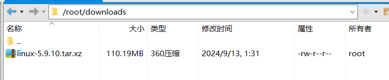
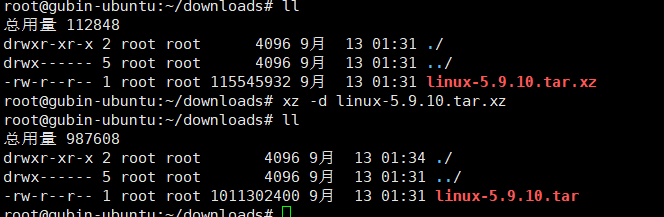
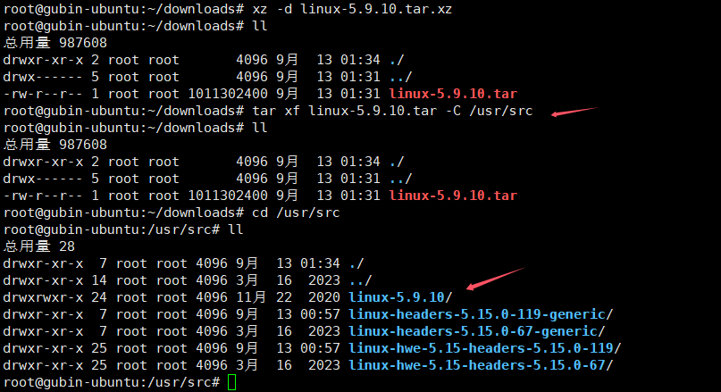

# 实验1-2 给优麒麟Linux更换心脏--更换内核

## 1.实验目的

（1）学会如何给Linux系统更新最新版本的Linux内核

（2）学习如何编译和安装Linux内核

## 2.实验详解

在编译Liunx内核之前，需要通过命令安装相关软件包

```
sudo apt update
sudo apt install -y libncurses5-dev libssl-dev libelf-dev build-essential openssl flex bison
```

下载最新稳定版本Linux内核源码

内核下载官网：https://mirrors.edge.kernel.org/pub/linux/kernel/

选择稳定版本的压缩包下载到本地，一般为`linux-x.xx.xx.tar.gz` 或 `linux-x.xx.xx.tar.xz`  
我这里选择下载的是`linux-5.9.10.tar.xz



### 3 内核压缩包解压缩

进入内核压缩包所在目录，右键选择打开终端，运行以下命令：

    xz -d linux-5.9.10.tar.xz
    sudo tar xf linux-5.9.10.tar -C /usr/src

或者

```
tar -Jxf linux-5.9.10.tar.xz
```

将内核文件解压缩至`/usr/src`目录下





### 4 配置内核

先进入内核文件目录

    cd /usr/src/linux-5.9.10


拷贝已有的配置文件

    sudo cp /boot/config-5.4.0-80-generic .config


注：具体配置文件名根据自己系统中的名字为准（可以通过`cd /boot` 然后`ls`查看系统已有配置文件）

然后通过make menuconfig进行配置

    sudo make menuconfig


弹出配置界面后，直接exit即可

然后对config文件进行修改：