# 实验1-3 使用QEMU虚拟机来运行

## 一、实验目的

通过本实验学习如何编译ARM64版本的内核映像，并且在QEMU虚拟机中运行。

（难点好像是编译ARM架构，但是我们本身及其是X86）.

## 二、实验详解

## 1.环境准备

### 1.安装所需依赖

```
sudo apt update
sudo apt install flex bison libssl-dev build-essential libncurses5-dev qemu-system-arm gcc-aarch64-linux-gnu vim 
```

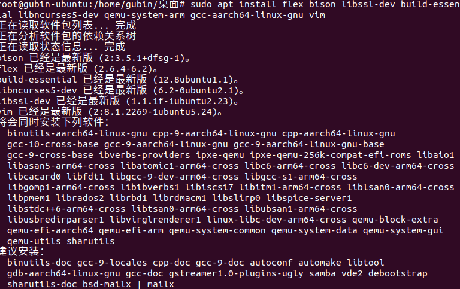

### 2、下载buildroot工具

使用 busybox 构建文件系统的时候，busybox 仅仅只是帮我们构建好了一些常用的命令和文件，像 lib 库、/etc目录下的一些文件都需要我们自己手动创建，而且 busybox构建的根文件系统默认没有用户名和密码设置。buildroot 比 busybox 更上一层楼，buildroot不仅集成了busybox，而且还集成了各种常见的第三方库和软件，需要什么就选择什么，buildroot 极大的方便了我们嵌入式Linux开发人员构建实用的根文件系统。

下载网址：https://buildroot.org/download.html  

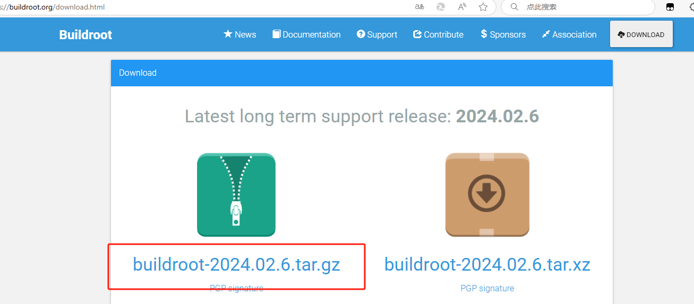


进入目录解压到/root/qemudebug

```
tar -xzvf buildroot-2024.02.6.tar.gz -C /root/qemudebug
```


### 3、下载Linux内核

下载网址：https://mirrors.edge.kernel.org/pub/linux/kernel/v5.x/

我这里选择下载的是linux-5.15.10,之前我做实验用过的

```
tar -xvf linux-5.15.10.tar -C /root/qemudebug
```


补充：解压自定义名称

```
sudo tar -xzvf buildroot-2024.02.6.tar.gz --strip-components=1 -C /root/qemudebug/buildroot_custom_name
```

重命名mv最好使用绝对路径，当你在相同目录中更改文件或文件夹的名称时，这是一个“重命名”操作。


**buildroot和Linux内核都放在里面**


## 2.编译根文件

```
cd buildroot-2021.02.4
make menuconfig
```

在弹出的配置界面中，设置：

-    Target option —> Target Architecture为AArch64 (little endian)
-    Toolchain —> Toolchain type为External toolchain
-    System configuration —> Enable root login with password开启  
     System configuration —>Root password 设置你的密码  
     System configuration —>Run a getty (login prompt) after boot —> TTY port的值为ttyAMA0
-    Target packages —> Show packages that are also provided by busybox开启  
     Target packages —> Debugging, profiling and benchmark —> strace开启
-    Filesystem images —> cpio the root filesystem开启

1.

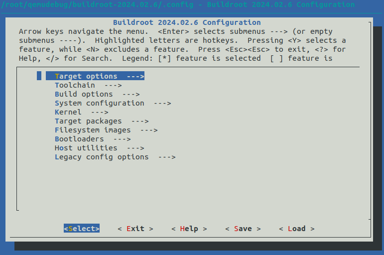


按空格Enter选择


2.


3.


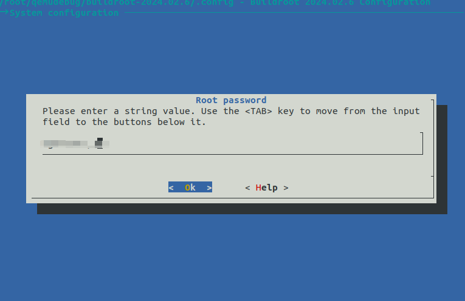


4.

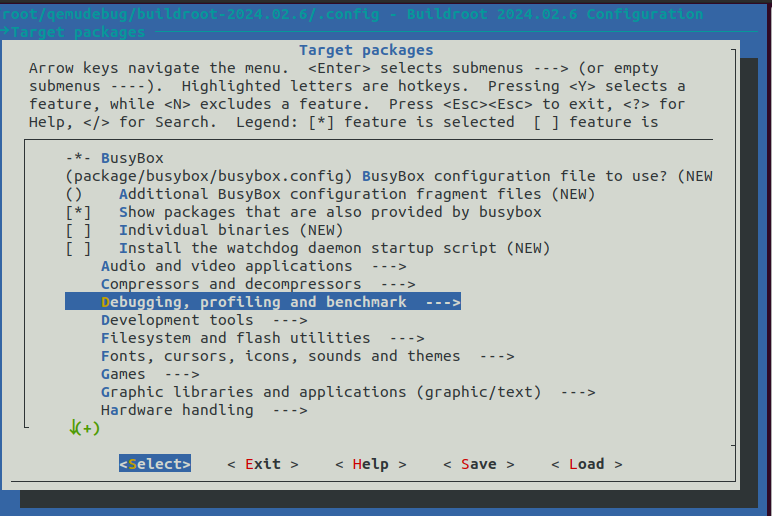


5.

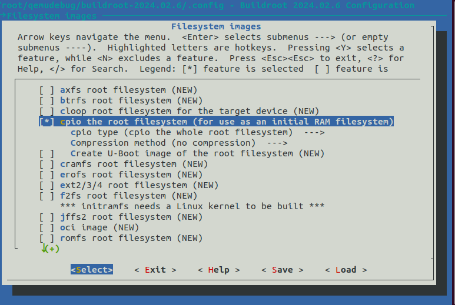

保存


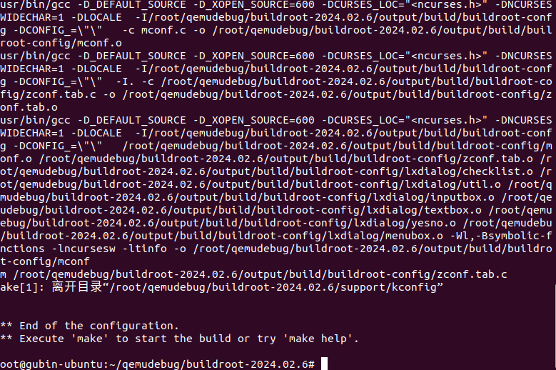

在配置完成之后，执行

    make -j4


编译成功后，目录`buildroot-2024.02.6/output/images`下面会生成`rootfs.cpio`。  


## 3\. 编译内核

回到`qemudebug`目录下，执行：

    cd linux-5.15.10
    ARCH=arm64 CROSS_COMPILE=aarch64-linux-gnu- make defconfig


```
vim .config
```

编辑选项 ：

-    CONFIG\_CMDLINE=“console=ttyAMA0”

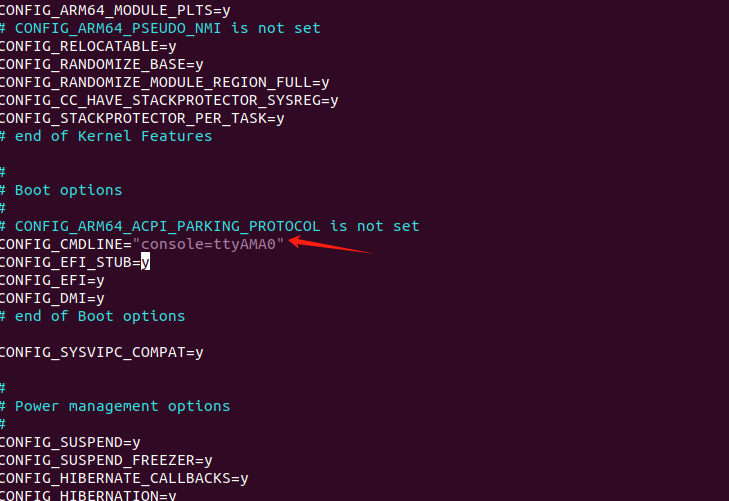

-    CONFIG\_INITRAMFS\_SOURCE=“XXX/new/buildroot-2021.02.4/output/images/rootfs.cpio”(注意这里XXX要设置为你自己的路径)

```
CONFIG\_INITRAMFS\_SOURCE="~/qemudebug/buildroot-2024.02.6/output/images/rootfs.cpio"
```


-    CONFIG\_DEBUG\_INFO=y

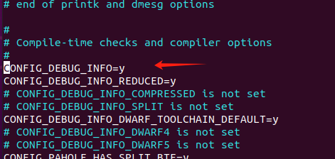

配置结束后，执行以下命令

    ARCH=arm64 CROSS_COMPILE=aarch64-linux-gnu- make -j4

按了一些回车，默认

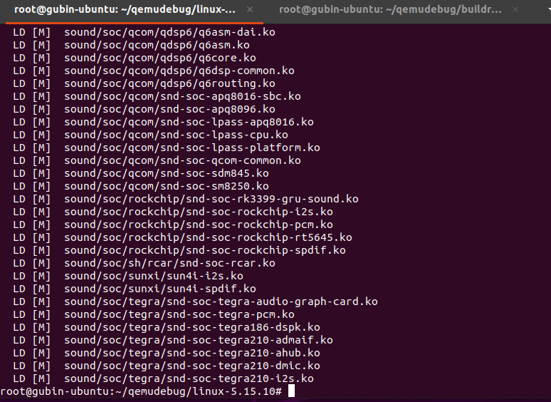


内核编译成功后，在`linux-5.0.2/`目录下会生成`vmlinux`以及在`linux-5.0.2/arch/arm64/boot/`目录下会生成`Image`。


## 4\. 创建虚拟机

在linux-5.15.10目录下，执行以下命令创建虚拟机。(创建好后，下次启动虚拟机依然使用这条命令)

    qemu-system-aarch64 -machine virt -cpu cortex-a57 -machine type=virt -nographic -smp 1  -m 2048 -kernel ./arch/arm64/boot/Image -append "console=ttyAMA0" $1 $2


然后就会提示我们登录：

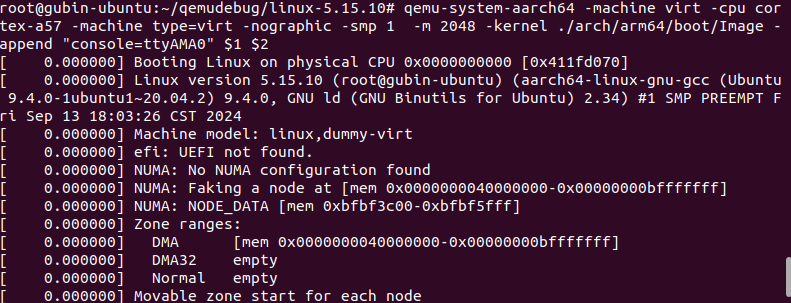


之前设置的密码BgXXXXX


```
cd /
ls -al
```


现在我们要退出qemu界面，有以下两种方法

-   #### kill命令退出
    
    1.  新建打开另外一个终端窗口，在命令行中输入`$ ps -elf | grep qemu`可以得到进程号，第一行是原终端（左边）中的qemu进程，第二行是右边QEMU这个进程，所以我们只要kill掉2403这个进程就可以了。  
        
    2.  终端命令行中输入`kill -9 2403`即可杀死进程，退出qemu。
    
-   #### 快捷键退出
    
    1.  快捷键是先按住Crtl+a，然后松开，然后按x（不能是大写的！）。
    2.  需要注意的是，在QEMU的窗口中使用快捷键只会键入一些奇怪的字符，是无效的；我们需要**回到终端中去使用快捷键**，才能正常退出。
    
    

## 5.

为了能在 QEMU 里面使用网络功能，这里使用 tap 作为后端网络设备。在主机中，创建`tap_linux`设备，命令如下：

    $ sudo ip tuntap add dev tap_linux mod tap
    $ sudo ifconfig tap_linux up
    $ sudo ifconfig tap_linux 192.168.10.10 netmask 255.255.255.0


在当前目录创建一个`shell`脚本，避免重复输入指令。其文件名为`start.sh`，其内容为

    qemu-system-aarch64 -machine virt -cpu cortex-a57 \
    	-machine type=virt -nographic -smp 1 \
    	-m 2048 \
    	-kernel ./arch/arm64/boot/Image \
    	--apend "console=ttyAMA0" \
            -netdev tap,id=mynet1,script=no,downscript=no,ifname=tap_linux \
            -device virtio-net-device,netdev=mynet1,mrg_rxbuf=off,csum=off,guest_csum=off,gso=off,guest_tso4=off,guest_tso6=off,guest_ecn=off,guest_ufo=off \
    	$1 $2


执行`./startup.sh`，这是可以用`qemu`启动`linux`内核。在进入命令行之前，需要输入`buildroot login:` 的值，其值为`root`，然后需要输入`Password:` ，这是前文构建`rootfs.cpio`的时候，配置项`System configuration ---> Root password`的值。然后就可以进入命令行执行以下常用命令了。（注意，需要先`cd /`）。使用网络功能需要先给网卡配置 ip，例如`ifconfig eth0 192.168.10.11`。

如果要退出`qemu`，可以先按`Ctrl + A`，然后按`X`。

为了在主机和`qemu`虚拟机之间共享文件，我们可以创建一个目录，其绝对路径为`SHARED_FILE_PATH`。然后执行以下命令

    cd $BUILD_ROOT_PATH
    vim .config


修改`BR2_ROOTFS_OVERLAY`配置项的值为`$SHARED_FILE_PATH`（注意，自行展开变量）。

保存后执行以下命令重新创建 `rootfs.cpio`。

    rm $BUILD_ROOT_PATH/output/images/rootfs.*
    make


然后需要重新编译内核，即

    cd $LINUX_KERNEL_PATH
    ARCH=arm64 CROSS_COMPILE=aarch64-linux-gnu- make -j16


依然通过`./start.sh`启动虚拟机跑`linux`内核，进入命令行后，执行`cd /; ls`，我们可以看到`$SHARED_FILE_PATH`目录下的文件。

重新执行`./start.sh -s -S`进入`qemu`的调试状态，然后开一个新的`shell`，输入命令

    cd $LINUX_KERNEL_PATH
    aarch64-linux-gnu-gdb ./vmlinux -ex "target remote :1234"


现在，可以像以往一样使用`gdb`进行调试了……

下面介绍如何编译一个`linux`内核模块。

    cd $SHARED_FILE_PATH
    vim hello.c


`hello.c`的内容为

    #include <linux/module.h>
    #include <linux/kernel.h>
    #include <linux/init.h>
    #include <linux/seq_file.h>
    #include <linux/proc_fs.h>
    #include <linux/sched.h>
    
    int helloinit(void)
    {
    	printk(KERN_DEBUG "hello world !!\n");
    	return 0;
    }
    
    void helloexit(void)
    {
    	printk(KERN_DEBUG "goodbye world !!\n");
    }
    
    module_init(helloinit);
    module_exit(helloexit);
    
    MODULE_LICENSE("GPL");


然后在当前目录创建`Makefile`内容如下

    ifneq (${KERNELRELEASE},)
    obj-m := hello.o
    else
    KERNEL_SOURCE := $LINUX_KERNEL_PATH # 注意自行展开变量LINUX_KERNEL_PATH
    PWD := $(shell pwd)
    
    default:
    	${MAKE} -C ${KERNEL_SOURCE} M=${PWD} modules
    
    clean:
    	${MAKE} -C ${KERNEL_SOURCE} M=${PWD} clean
    endif


然后执行交叉编译命令

    ARCH=arm64 CROSS_COMPILE=aarch64-linux-gnu- make


OK，重新编译`rootfs.cpio`和`linux`内核，然后运行`qemu`。在进入`linux`命令行后，执行以下命令

    cd /
    insmod hello.ko
    dmesg | tail      # 可以看到打印信息 hello world !!
    rmmod hello.ko
    dmesg | tail      # 可以看到打印信息 goodbye world !!


# 相关经验

## Linux Kernel

-   使用`qemu`并开启`gdb server`功能之后，在`gdb`窗口输入`b start_kernel`，进入最初的内核初始化函数。

# 平台工具

-   [buildroot](https://buildroot.org/download.html)
-   [Linux kernel](https://www.kernel.org/)

# 参考

-   [Starting Linux kernel exploration](https://www.youtube.com/watch?v=zK2Agg3U2cU)
-   [Debugging an ARM64 linux kernel using QEMU](https://www.youtube.com/watch?v=swniLhXg-3U)
-   [Writing kernel modules](https://www.youtube.com/watch?v=1kmWC6c-sMU)
-   [Debugging Kernel and Modules using GDB](https://www.kernel.org/doc/html/latest/dev-tools/gdb-kernel-debugging.html)

本文来自博客园，作者：[Legend\_Lone](https://www.cnblogs.com/sun-ye/)，转载请注明原文链接：[https://www.cnblogs.com/sun-ye/p/14992084.html](https://www.cnblogs.com/sun-ye/p/14992084.html)