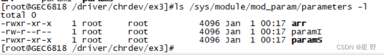
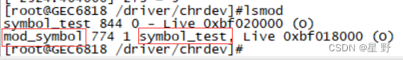

# Linux驱动内核模块参数和模块符号导出

当我们写应用程序可以使用scanf等函数来获取我们想要给某一变量设置的值，而驱动程序又不能使用应用层的库函数，我们怎么把[值传递](https://so.csdn.net/so/search?q=%E5%80%BC%E4%BC%A0%E9%80%92&spm=1001.2101.3001.7020)给驱动程序呢？  
我们就需要使用模块参数来完成。有两种方式修改变量的值。

> 1、加载模块时修改变量的值  
> 2、模块加载后修改变量的值

##### 模块参数的使用

内核中提供了宏将普通变量变成模块参数。  
**module\_param(name, type, perm);**

**module\_param\_array(name, type, &n\_para, perm);**

> name:表示数组的名字;  
> type:表示参数的类型;  
> &n\_para:表示数组中元素数量;  
> perm:表示参数的访问权限;

其中&n\_para这个变量其实无决定性作用，只要传递的数组元素个数不超过定义时的个数就行了。参数类型并不是参数直接的数据类型，列举一下常用的参数类型。

> bool：布尔类型  
> invbool：[bool类型](https://so.csdn.net/so/search?q=bool%E7%B1%BB%E5%9E%8B&spm=1001.2101.3001.7020)的值是相反的;  
> charp：（char \*）字符指针类型;  
> int：整型  
> long：(long int)长整型  
> short：(short int)短整型  
> uint：(unsigned int)无符号整型  
> ulong：(unsigned long int)无符号长整型  
> ushort：(unsigned short int)无符号短整型

访问权限的话可以直接使用数字和文件的访问权限是一个意思，也可以使用定义好的宏。由于宏非常多就不一一列举了。

> #define S\_IRWXU 00700  
> #define S\_IRUSR 00400  
> #define S\_IWUSR 00200

看一个例子。

    #include <linux/init.h>
    #include <linux/module.h>
    
    int paramI = 1;
    unsigned short paramU = 2;
    char *paramS= "welcome";
    int arr[9] = {0,1,2,3};
    
    //声明为模块参数
    module_param(paramI, int, 0644);
    module_param(paramU, ushort, 0);
    module_param(paramS, charp, 0755);
    module_param_array(arr, int, NULL, 0755);
    
    //加载函数
    int modparam_init(void)
    {
    	//打印模块参数
    	printk("paramI = %d\n",paramI);
    	printk("paramU = %hu\n",paramU);
    	printk("paramS = %s\n",paramS);
    	printk("arr = %d %d %d\n",arr[0],arr[1],arr[2]);
    
    	return 0;
    }
    
    //卸载函数
    void modparam_exit(void)
    {
    	printk("paramI = %d\n",paramI);
    	printk("paramU = %hu\n",paramU);
    	printk("paramS = %s\n",paramS);
    	printk("arr = %d %d %d\n",arr[0],arr[1],arr[2]);
    }
    
    //声明为模块的入口和出口
    module_init(modparam_init);
    module_exit(modparam_exit);
    
    MODULE_LICENSE("GPL");//GPL模块许可证
    MODULE_AUTHOR("xin");//作者
    MODULE_VERSION("1.0");//版本
    MODULE_DESCRIPTION("this is module param!");//描述信息

加载模块时通过 “模块参数名=值” 来修改模块参数的值。

  
  

前面说有两种可以修改变量的值，那加载模块之后怎么修改呢？  
当模块加载成功之后，那些 **访问权限非0** 的模块参数会在 **/sys/module/模块名/parameters** 路径下存在和模块参数名同名的文件，这些文件的权限来自于模块参数的权限。而且文件的内容就是变量的值，我们就可以通过修改文件里的值达到模块加载后再去改变模块参数的值。  
  

修改模块参数文件里的值，代码里相应的变量的值也会被修改。

  
echo -n 表示不换行。

##### 模块符号导出

模块符号导出是指将一个模块内部中的**变量**或者**函数**导出，供内核其他模块使用，感觉就像是声明函数，不声明就不给调用。  
如何导出？内核中提供了相应的宏来实现。

> EXPORT\_SYMBOL(name)  
> // 只有遵循GPL协议的模块才能使用  
> EXPORT\_SYMBOL\_GPL(name)

    #include <linux/init.h>
    #include <linux/module.h>
    #include "mod_symbol.h"
    
    int add(int a,int b)
    {
    	return a+b;
    }
    
    int mul(int a,int b)
    {
    	return a*b;
    }
    
    //将函数导出，让外部可以访问
    EXPORT_SYMBOL(add);
    //GPL方式导出，只有遵循GPL协议的模块才可以访问
    EXPORT_SYMBOL_GPL(mul);
    
    MODULE_LICENSE("GPL");//GPL模块许可证
    MODULE_AUTHOR("xin");//作者
    MODULE_VERSION("1.0");//版本
    MODULE_DESCRIPTION("this is module symbol!");//描述信息

    #ifndef _MOD_SYMBOL_H
    #define _MOD_SYMBOL_H
    
    int add(int a,int b);
    int mul(int a,int b);
    
    #endif

    #include <linux/init.h>
    #include <linux/module.h>
    #include "mod_symbol.h"
    
    //加载函数
    int symboltest_init(void)
    {
    	//使用模块导出符号
    	printk("2+3 = %d\n",add(2,3));
    
    	return 0;
    }
    
    //卸载函数
    void symboltest_exit(void)
    {
    	printk("2*3 = %d\n",mul(2,3));
    }
    
    //声明为模块的入口和出口
    module_init(symboltest_init);
    module_exit(symboltest_exit);
    
    MODULE_LICENSE("GPL");//GPL模块许可证
    MODULE_AUTHOR("xin");//作者
    MODULE_VERSION("1.0");//版本
    MODULE_DESCRIPTION("this is symbol test!");//描述信息

**模块依赖**  
如果一个模块使用了另一个模块中的**变量**或者**函数**，那么该模块就依赖于另一个模块，加载模块时必须先加载依赖的模块，卸载模块时就必须先卸载没有模块依赖的模块。还是举个例子：

> 假如模块A模块符号导出了一个函数，模块B需要使用A导出的函数，那么就是模块B依赖模块A。那加载模块时，就必须先加载模块A，不然加载模块B时会报错。卸载模块时，就是先卸载模块B，不然模块A不允许被卸载。

使用上面的例子模块symbol\_test依赖模块mod\_symbol，当先卸载mod\_symbol时就会报错。  

如果一个模块被内核使用，该模块将不允许被卸载。  
模块的依赖关系可以使用**lsmod**命令查看。  
  
好了，最后如果有什么说的不对的地方欢迎在评论区指正。

## 参考

[Linux驱动内核模块参数和模块符号导出_内核模块导出变量-CSDN博客](https://blog.csdn.net/qq_53221728/article/details/129424087?ops_request_misc=%7B%22request%5Fid%22%3A%22F0938462-1B10-421F-BE29-44BA7ADC5772%22%2C%22scm%22%3A%2220140713.130102334.pc%5Fall.%22%7D&request_id=F0938462-1B10-421F-BE29-44BA7ADC5772&biz_id=0&utm_medium=distribute.pc_search_result.none-task-blog-2~all~first_rank_ecpm_v1~rank_v31_ecpm-1-129424087-null-null.142^v100^pc_search_result_base5&utm_term=模块之间导出符号&spm=1018.2226.3001.4187)