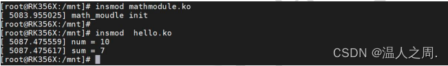

# linux内核模块符号导出

### 一、内核模块[符号导出](https://so.csdn.net/so/search?q=%E7%AC%A6%E5%8F%B7%E5%AF%BC%E5%87%BA&spm=1001.2101.3001.7020)简介

  [驱动程序](https://so.csdn.net/so/search?q=%E9%A9%B1%E5%8A%A8%E7%A8%8B%E5%BA%8F&spm=1001.2101.3001.7020)编译生成的 ko 文件是相互独立的，即模块之间变量或者函数在正常情况下无法进行互相访问。而一些复杂的驱动模块需要分层进行设计，这时候就需要用到内核模块符号导出。  
  内核符号导出指的是在内核模块中导出相应的函数和变量，在加载模块时被记录在公共内核[符号表](https://so.csdn.net/so/search?q=%E7%AC%A6%E5%8F%B7%E8%A1%A8&spm=1001.2101.3001.7020)中，以供其他模块调用。符号导出所使用的宏为 EXPORT\_SYMBOL(sym)和 EXPORT\_SYMBOL\_GPL(sym)。它们定义在 “/include/linux/export.h”文件中。

    #define EXPORT_SYMBOL(sym) \ 
    	__EXPORT_SYMBOL(sym, "")
    #define EXPORT_SYMBOL_GPL(sym) \ 
    	__EXPORT_SYMBOL(sym, "_gpl")

  EXPORT\_SYMBOL(sym)和 EXPORT\_SYMBOL\_GPL(sym)两个宏使用方法相同，而 EXPORT\_SYMBOL\_GPL(sym)导出的模块只能被 GPL 许可的模块使用，所以绝大多数的情况都使用EXPORT\_SYMBOL(sym)进行符号导出。sym 为函数的唯一参数，表示要导出的函数或变量名称。

### 二、应用实例

  总共有两个驱动程序，第一个驱动文件名为 mathmodule.c，用来定义参数 num 和函数 add(a,b)，第二个驱动文件名为 hello.c, 会引用 mathmodule.c 驱动程序中的参数 num 和数学函数 add(a,b)，并将相应的参数值和函数返回值打印到串口终端上。

#### 2.1、mathmodule.c 代码

  mathmodule.c 代码如下

    #include <linux/init.h>
    #include <linux/module.h>
    int num = 10;//定义参数num
    EXPORT_SYMBOL(num);//导出参数num
    
    int add(int a, int b)//定义数学函数add()，用来实现加法
    {
        return a + b;
    }
    EXPORT_SYMBOL(add);//导出数学函数add()
    
    static int __init math_init(void)//驱动入口函数
    {
        printk("math_moudle init\n");
        return 0;
    }
    
    static void __exit math_exit(void)//驱动出口函数
    {
        printk("math_module exit\n");
    }
    
    module_init(math_init);//注册入口函数
    module_exit(math_exit);//注册出口函数

  以上代码定义了一个 int 类型的 num 变量和 add()数学函数，并使用 EXPORT\_SYMBOL 宏进行导出。

#### 2.2、hello.c 代码

  编写完成的 hello.c 代码如下

    #include <linux/init.h>
    #include <linux/module.h>
    extern int num;//导入int类型变量num
    extern int add(int a, int b);//导入函数add
    static int __init hello_init(void)//驱动入口函数
    {
        static int sum;
        printk("num = %d\n", num);//打印num值
        sum = add(3, 4);//使用add函数进行3+4的运算                                                                                                                                                                          
        printk("sum = %d\n", sum);//打印add函数的运算值
        return 0;
    }
    
    static void __exit hello_exit(void)//驱动出口函数
    {
        printk("Goodbye hello module\n");
    }
    
    module_init(hello_init);//注册入口函数
    module_exit(hello_exit);//注册出口函数

  程序导入了 int 类型的变量 num 和 add()函数，并在驱动入口函数中打印相应了 num 的参数值并对 add()函数进行了调用。

#### 2.3、makefile文件

  在 mathmodule.c 和 hello.c 的同一目录下创建 Makefile 文件，Makefile 文件内容如下

    export ARCH=arm64#设置平台架构
    export CROSS_COMPILE=aarch64-linux-gnu-#交叉编译器前缀
    obj-m := mathmodule.o
    obj-m += hello.o
    KDIR :=/home/topeet/Linux/linux_sdk/kernel    #这里是你的内核目录                                                                                                                            
    PWD ?= $(shell pwd)
    all:
    	make -C $(KDIR) M=$(PWD) modules    #make操作
    clean:
    	make -C $(KDIR) M=$(PWD) clean    #make clean操作

  在 hello.c 代码中使用了mathmodule.c 所导出的符号，所以 mathmodule.c 要在 hello.c 之前进行编译，即第 3 行和第 4行顺序不能交换

#### 2.4、运行测试

  这里要注意的是，由于 hello.ko 依赖于 mathmodule.ko，所以 mathmodule.ko 需要先加载，  
  分别使用以下命令进行模块的加载（加载顺序不能变）

    insmod mathmodule.ko
    insmod hello.k

  
  可以看到 hello.ko 驱动加载的时候，mathmodule.ko 模块中定义的 num 参数值和调用 sum()函数的后正确的返回值都被打印了出来。

## 参考

[linux内核模块符号导出_linux 模块符号导出-CSDN博客](https://blog.csdn.net/xxxx123041/article/details/133904632?ops_request_misc=&request_id=&biz_id=102&utm_term=模块之间导出符号&utm_medium=distribute.pc_search_result.none-task-blog-2~all~sobaiduweb~default-0-133904632.142^v100^pc_search_result_base5&spm=1018.2226.3001.4187)