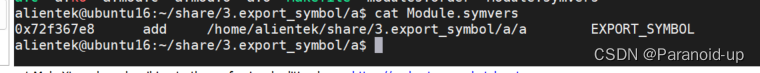
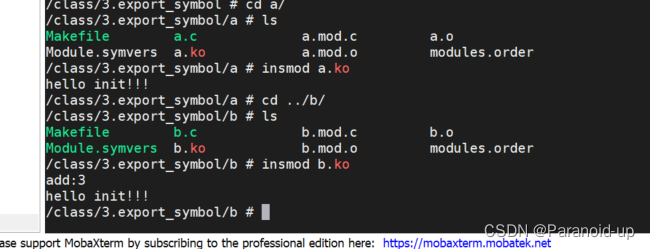

# 内核模块符号导出

## 内核模块符号导出

* * *

#### 文章目录

-   [内核模块符号导出](https://blog.csdn.net/weixin_52849254/article/details/129841609?ops_request_misc=%257B%2522request%255Fid%2522%253A%2522F0938462-1B10-421F-BE29-44BA7ADC5772%2522%252C%2522scm%2522%253A%252220140713.130102334.pc%255Fall.%2522%257D&request_id=F0938462-1B10-421F-BE29-44BA7ADC5772&biz_id=0&utm_medium=distribute.pc_search_result.none-task-blog-2~all~first_rank_ecpm_v1~rank_v31_ecpm-3-129841609-null-null.142^v100^pc_search_result_base5&utm_term=%E6%A8%A1%E5%9D%97%E4%B9%8B%E9%97%B4%E5%AF%BC%E5%87%BA%E7%AC%A6%E5%8F%B7&spm=1018.2226.3001.4187#_0)
-   [内核符号表引入](https://blog.csdn.net/weixin_52849254/article/details/129841609?ops_request_misc=%257B%2522request%255Fid%2522%253A%2522F0938462-1B10-421F-BE29-44BA7ADC5772%2522%252C%2522scm%2522%253A%252220140713.130102334.pc%255Fall.%2522%257D&request_id=F0938462-1B10-421F-BE29-44BA7ADC5772&biz_id=0&utm_medium=distribute.pc_search_result.none-task-blog-2~all~first_rank_ecpm_v1~rank_v31_ecpm-3-129841609-null-null.142^v100^pc_search_result_base5&utm_term=%E6%A8%A1%E5%9D%97%E4%B9%8B%E9%97%B4%E5%AF%BC%E5%87%BA%E7%AC%A6%E5%8F%B7&spm=1018.2226.3001.4187#_12)
-   [内核符号表导出](https://blog.csdn.net/weixin_52849254/article/details/129841609?ops_request_misc=%257B%2522request%255Fid%2522%253A%2522F0938462-1B10-421F-BE29-44BA7ADC5772%2522%252C%2522scm%2522%253A%252220140713.130102334.pc%255Fall.%2522%257D&request_id=F0938462-1B10-421F-BE29-44BA7ADC5772&biz_id=0&utm_medium=distribute.pc_search_result.none-task-blog-2~all~first_rank_ecpm_v1~rank_v31_ecpm-3-129841609-null-null.142^v100^pc_search_result_base5&utm_term=%E6%A8%A1%E5%9D%97%E4%B9%8B%E9%97%B4%E5%AF%BC%E5%87%BA%E7%AC%A6%E5%8F%B7&spm=1018.2226.3001.4187#_16)
-   [实现](https://blog.csdn.net/weixin_52849254/article/details/129841609?ops_request_misc=%257B%2522request%255Fid%2522%253A%2522F0938462-1B10-421F-BE29-44BA7ADC5772%2522%252C%2522scm%2522%253A%252220140713.130102334.pc%255Fall.%2522%257D&request_id=F0938462-1B10-421F-BE29-44BA7ADC5772&biz_id=0&utm_medium=distribute.pc_search_result.none-task-blog-2~all~first_rank_ecpm_v1~rank_v31_ecpm-3-129841609-null-null.142^v100^pc_search_result_base5&utm_term=%E6%A8%A1%E5%9D%97%E4%B9%8B%E9%97%B4%E5%AF%BC%E5%87%BA%E7%AC%A6%E5%8F%B7&spm=1018.2226.3001.4187#_27)
-   -   [a.c](https://blog.csdn.net/weixin_52849254/article/details/129841609?ops_request_misc=%257B%2522request%255Fid%2522%253A%2522F0938462-1B10-421F-BE29-44BA7ADC5772%2522%252C%2522scm%2522%253A%252220140713.130102334.pc%255Fall.%2522%257D&request_id=F0938462-1B10-421F-BE29-44BA7ADC5772&biz_id=0&utm_medium=distribute.pc_search_result.none-task-blog-2~all~first_rank_ecpm_v1~rank_v31_ecpm-3-129841609-null-null.142^v100^pc_search_result_base5&utm_term=%E6%A8%A1%E5%9D%97%E4%B9%8B%E9%97%B4%E5%AF%BC%E5%87%BA%E7%AC%A6%E5%8F%B7&spm=1018.2226.3001.4187#ac_28)
    -   [b.c](https://blog.csdn.net/weixin_52849254/article/details/129841609?ops_request_misc=%257B%2522request%255Fid%2522%253A%2522F0938462-1B10-421F-BE29-44BA7ADC5772%2522%252C%2522scm%2522%253A%252220140713.130102334.pc%255Fall.%2522%257D&request_id=F0938462-1B10-421F-BE29-44BA7ADC5772&biz_id=0&utm_medium=distribute.pc_search_result.none-task-blog-2~all~first_rank_ecpm_v1~rank_v31_ecpm-3-129841609-null-null.142^v100^pc_search_result_base5&utm_term=%E6%A8%A1%E5%9D%97%E4%B9%8B%E9%97%B4%E5%AF%BC%E5%87%BA%E7%AC%A6%E5%8F%B7&spm=1018.2226.3001.4187#bc_70)

* * *

## 内核[符号表](https://so.csdn.net/so/search?q=%E7%AC%A6%E5%8F%B7%E8%A1%A8&spm=1001.2101.3001.7020)引入

[驱动程序](https://so.csdn.net/so/search?q=%E9%A9%B1%E5%8A%A8%E7%A8%8B%E5%BA%8F&spm=1001.2101.3001.7020)可以编译成内核模块，也就是KO文件。每个KO文件是相互独立的，也就是说模块之间无法互相访问。但是在某些使用场、要互相访问，如B模块要用A模块中的函数。（B模块依赖于A模块）这时候我们要怎么做呢？  
什么是符号表？  
所谓“符号"就是内核中的函数名，全局变量名等。符号表就是用来记录这些“符号"的文件。

## 内核符号表导出

模块可以使用一下宏[EXPORT\_SYMBOL](https://so.csdn.net/so/search?q=EXPORT_SYMBOL&spm=1001.2101.3001.7020)和EXPORT\_SYMBOL\_GPL导出符号到内核符号表中。  
如：

    EXPORT_SYMBOL(符号名）；
    EXPORT_SYMBOL_GPL(符号名）；//只适用于包含GPL许可的模块。

导出去的符号可以被其他模块使用。使用前只需要声明一下即可。

## 实现

### a.c

    #include <linux/module.h>
    #include <linux/init.h>
    
    extern int add_test(int a,int b);
    
    
     int add_test(int a,int b){
    
    
        return (a+b);
    }
    EXPORT_SYMBOL(add_test);
    
    static int hello_init(void){
    
        printk("hello init!!!\n");
        return 0;
    
    }
    
    
    static void hello_exit(void){
    
        printk("hello exit!!!\n");
        
    
    }
    module_init(hello_init);
    module_exit(hello_exit);
    MODULE_AUTHOR("Paranoid");
    MODULE_VERSION("V1.0");
    MODULE_LICENSE("GPL");
    

查看符号表 

**编译被依赖的模块后，将生成的符号表文件复制到依赖模块所在文件夹，再编译另一个模块**

### b.c

    #include <linux/module.h>
    #include <linux/init.h>
    extern int add_test(int a,int b);
    
    static int hello_init(void){
        int a;
        a = add_test(1,2);
        printk("add:%d\n",a);
        printk("hello init!!!\n");
        return 0;
    
    }
    
    static void hello_exit(void){
    
        printk("hello exit!!!\n");
    
    }
    
    module_init(hello_init);
    module_exit(hello_exit);
    MODULE_AUTHOR("Paranoid");
    MODULE_VERSION("V1.0");
    MODULE_LICENSE("GPL"); 
        

结果

## 参考

[内核模块符号导出-CSDN博客](https://blog.csdn.net/weixin_52849254/article/details/129841609?ops_request_misc=%7B%22request%5Fid%22%3A%22F0938462-1B10-421F-BE29-44BA7ADC5772%22%2C%22scm%22%3A%2220140713.130102334.pc%5Fall.%22%7D&request_id=F0938462-1B10-421F-BE29-44BA7ADC5772&biz_id=0&utm_medium=distribute.pc_search_result.none-task-blog-2~all~first_rank_ecpm_v1~rank_v31_ecpm-3-129841609-null-null.142^v100^pc_search_result_base5&utm_term=模块之间导出符号&spm=1018.2226.3001.4187)