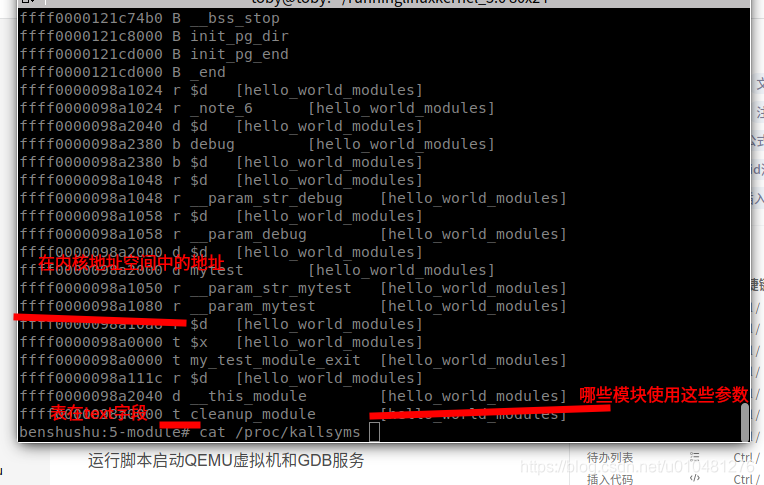
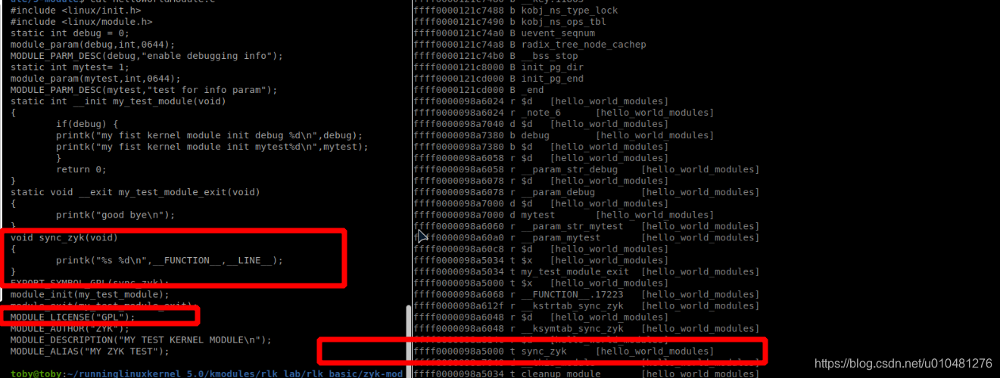
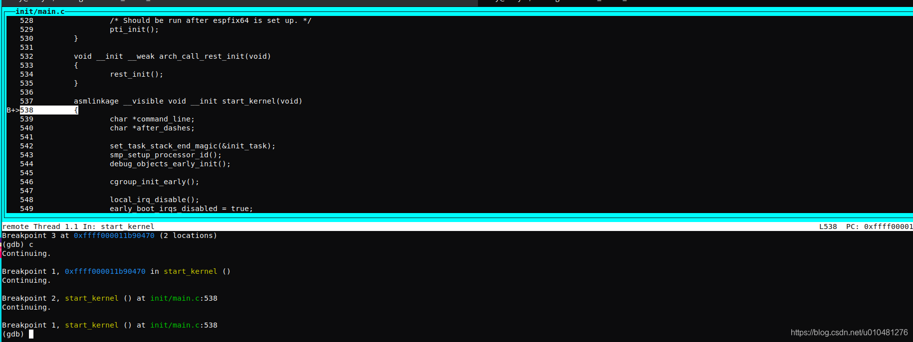
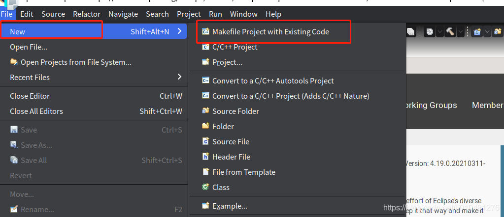
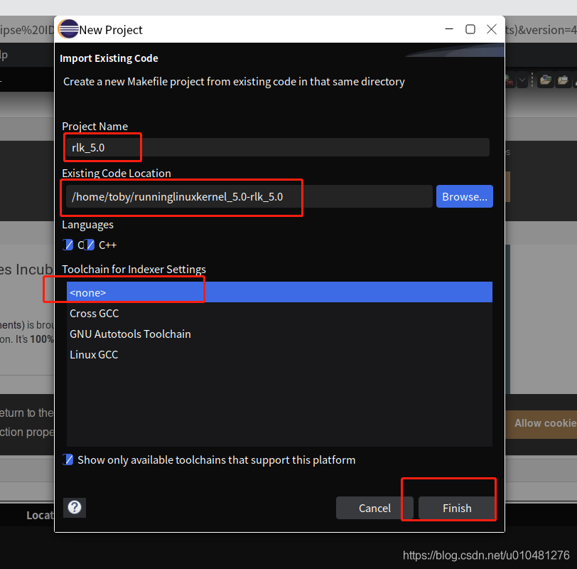
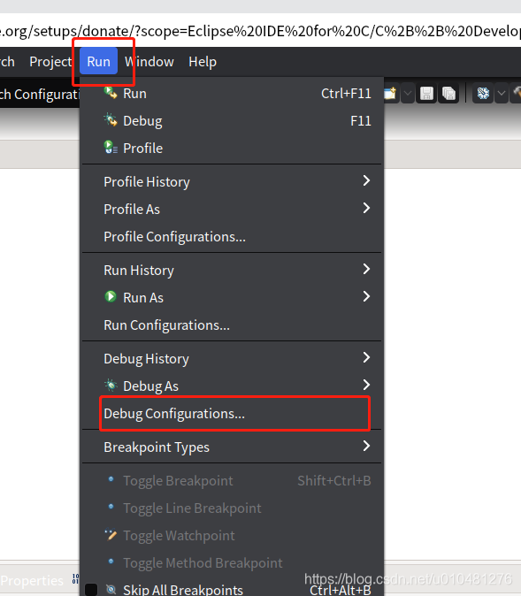
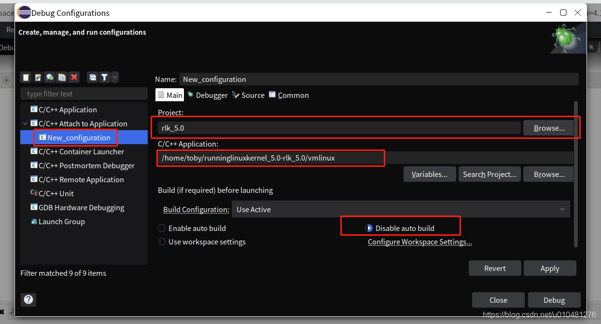
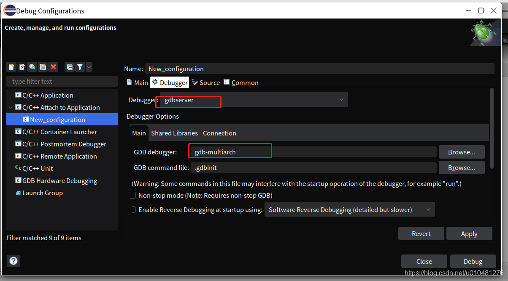
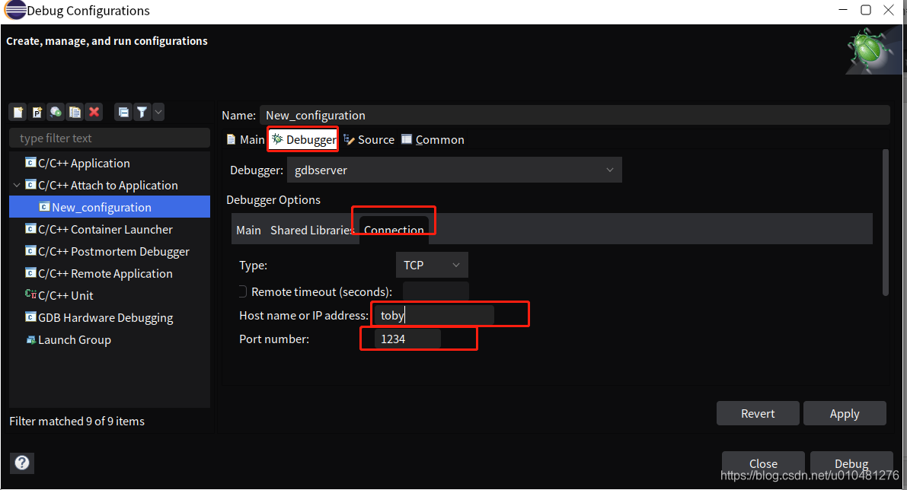
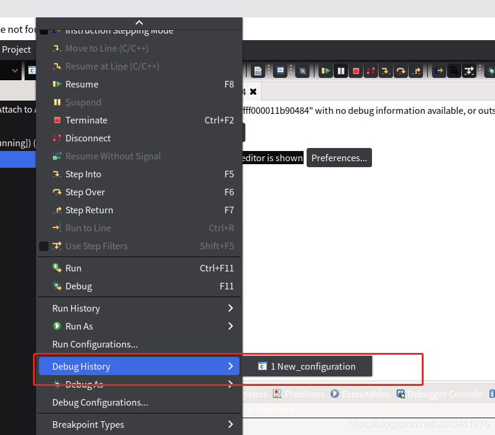

# 奔跑吧linux内核-使用qemu运行linux系统

主机硬件平台：Intel x86\_84处理器兼容主机。  
主机操作系统：[Ubuntu](https://so.csdn.net/so/search?q=Ubuntu&spm=1001.2101.3001.7020) Linux 20.04  
GCC版本：9 (aarch64-linux-gnu-gcc-9)  
[  
runninglinuxkernel\_5.0](https://github.com/Hacker90/runninglinuxkernel_5.0)

[安装linux](https://so.csdn.net/so/search?q=%E5%AE%89%E8%A3%85linux&spm=1001.2101.3001.7020)主机相关工具

    sudo apt-get install qemu-system-arm libncurses5-dev gcc-aarch64-linux-gnu build-essential git bison flex libssl-dev


上面执行后，默认安装 的[arm64](https://so.csdn.net/so/search?q=arm64&spm=1001.2101.3001.7020) gcc 版本是：并检查是否如下

    aarch64-linux-gnu-gcc -v
    Using built-in specs.
    COLLECT_GCC=aarch64-linux-gnu-gcc
    COLLECT_LTO_WRAPPER=/usr/lib/gcc-cross/aarch64-linux-gnu/9/lto-wrapper
    Target: aarch64-linux-gnu
    Configured with: ../src/configure -v --with-pkgversion='Ubuntu 9.3.0-17ubuntu1~20.04' --with-bugurl=file:///usr/share/doc/gcc-9/README.Bugs --enable-languages=c,ada,c++,go,d,fortran,objc,obj-c++,gm2 --prefix=/usr --with-gcc-major-version-only --program-suffix=-9 --enable-shared --enable-linker-build-id --libexecdir=/usr/lib --without-included-gettext --enable-threads=posix --libdir=/usr/lib --enable-nls --with-sysroot=/ --enable-clocale=gnu --enable-libstdcxx-debug --enable-libstdcxx-time=yes --with-default-libstdcxx-abi=new --enable-gnu-unique-object --disable-libquadmath --disable-libquadmath-support --enable-plugin --enable-default-pie --with-system-zlib --without-target-system-zlib --enable-libpth-m2 --enable-multiarch --enable-fix-cortex-a53-843419 --disable-werror --enable-checking=release --build=x86_64-linux-gnu --host=x86_64-linux-gnu --target=aarch64-linux-gnu --program-prefix=aarch64-linux-gnu- --includedir=/usr/aarch64-linux-gnu/include
    Thread model: posix
    gcc version 9.3.0 (Ubuntu 9.3.0-17ubuntu1~20.04) 


qemu虚拟机的版本是 并检查是否如下

    qemu-system-aarch64  --version
    QEMU emulator version 4.2.1 (Debian 1:4.2-3ubuntu6.14)
    Copyright (c) 2003-2019 Fabrice Bellard and the QEMU Project developers


​    

下载代码仓库，

    git clone https://github.com/figozhang/runninglinuxkernel_5.0.git


编译内核

    sudo ./run_debian_arm64.sh  build_kernel


编译根文件系统

    sudo ./run_debian_arm64.sh  build_rootfs


生成rootfs\_debian\_arm64.ext4的根文件系统

运行刚编译好的arm64版本的linux系统

    sudo ./run_debian_arm64.sh  run


            Starting Login Service...
    [  112.880454] virtio_net virtio1 enp0s1: renamed from eth0
    [  OK  ] Started D-Bus System Message Bus.
             Starting WPA supplicant...
             Starting LSB: Execute the …-e command to reboot system...
    [  OK  ] Started Periodic ext4 Onli…ata Check for All Filesystems.
             Starting System Logging Service...
    [  OK  ] Started Daily apt upgrade and clean activities.
    [  OK  ] Reached target Timers.
             Starting DHCP Client Daemon...
    [  OK  ] Started Raise network interfaces.
    [  OK  ] Started System Logging Service.
    [  OK  ] Started Remove Stale Onlin…ext4 Metadata Check Snapshots.
    [  OK  ] Started LSB: Execute the k…c -e command to reboot system.
             Starting LSB: Load kernel image with kexec...
             Starting Rotate log files...
             Starting Online ext4 Metad…a Check for All Filesystems...
    [  OK  ] Started Login Service.
    [  OK  ] Started WPA supplicant.
    [  OK  ] Started Avahi mDNS/DNS-SD Stack.
    [  OK  ] Started LSB: Load kernel image with kexec.
    [  OK  ] Reached target Network.
             Starting Permit User Sessions...
             Starting OpenBSD Secure Shell server...
    [  OK  ] Reached target Network is Online.
             Starting Kernel crash dump capture service...
             Starting Daily apt download activities...
    [  OK  ] Started Permit User Sessions.
    [  OK  ] Started Getty on tty1.
    [  OK  ] Started Serial Getty on ttyAMA0.
    [  OK  ] Reached target Login Prompts.
    [  OK  ] Started Online ext4 Metadata Check for All Filesystems.
    
    Debian GNU/Linux buster/sid benshushu ttyAMA0
    
    benshushu login: [  194.494138] kdump-tools[298]: Starting kdump-tools: Creating symlink /var/lib/kdump/vmlinuz.
    
    benshushu login: 
    benshushu login: root
    123
    Password: 
    Login incorrect
    benshushu login: root
    Password: 
    [  235.882897] kdump-tools[298]: kdump-tools: Generating /var/lib/kdump/initrd.img-5.0.0
    Last login: Tue Feb 18 02:06:31 UTC 2020 on ttyAMA0
    Linux benshushu 5.0.0 #1 SMP Fri Mar 26 13:01:59 CST 2021 aarch64
    
    Welcome Running Linux Kernel.
    Created by Benshushu <runninglinuxkernel@126.com>
    
    Buy linux kernel traning course:
    https://shop115683645.taobao.com/
    
    Wechat: runninglinuxkernel
    
    benshushu:~# 
    benshushu:~# 
    benshushu:~# 
    benshushu:~# 
    benshushu:~# 
    benshushu:~# 
    benshushu:~# [  292.736680] kdump-tools[298]: find: ‘/var/tmp/mkinitramfs_BaZNBB/lib/modules/5.0.0/kernel’: No such file or directory


 

系统帐户密码  
root  
123

### 在线安装软件包

qemu虚拟机通过virtIO-net技术生成虚拟的网卡，并通过网络桥接技术和主机进行网络共享，

    benshushu:~# ifconfig 
    enp0s1: flags=4163<UP,BROADCAST,RUNNING,MULTICAST>  mtu 1500
            inet 10.0.2.15  netmask 255.255.255.0  broadcast 10.0.2.255
            inet6 fec0::ce16:adb:3e70:3e71  prefixlen 64  scopeid 0x40<site>
            inet6 fe80::c86e:28c4:625b:2767  prefixlen 64  scopeid 0x20<link>
            ether 52:54:00:12:34:56  txqueuelen 1000  (Ethernet)
            RX packets 19  bytes 3799 (3.7 KiB)
            RX errors 0  dropped 0  overruns 0  frame 0
            TX packets 55  bytes 6862 (6.7 KiB)
            TX errors 0  dropped 0 overruns 0  carrier 0  collisions 0
    
    lo: flags=73<UP,LOOPBACK,RUNNING>  mtu 65536
            inet 127.0.0.1  netmask 255.0.0.0
            inet6 ::1  prefixlen 128  scopeid 0x10<host>
            loop  txqueuelen 1000  (Local Loopback)
            RX packets 2  bytes 78 (78.0 B)
            RX errors 0  dropped 0  overruns 0  frame 0
            TX packets 2  bytes 78 (78.0 B)
            TX errors 0  dropped 0 overruns 0  carrier 0  collisions 0


可以看到这生成了enp0s1的网卡，ip 等信息，这里可以通过 apt-get update命令更新debian系统的软件仓库  
如果不能更新可能是系统时间比较老，可以使用date命令来设置日期, 这里可以更新

    hushu:~# apt-get update
    Get:1 http://mirrors.ustc.edu.cn/debian unstable InRelease [154 kB]
    Get:2 http://mirrors.ustc.edu.cn/debian unstable/non-free Sources [86.7 kB]    
    Get:3 http://mirrors.ustc.edu.cn/debian unstable/main Sources [9143 kB]        
    Get:4 http://mirrors.ustc.edu.cn/debian unstable/contrib Sources [50.8 kB]     
    Get:5 http://mirrors.ustc.edu.cn/debian unstable/main arm64 Packages [8483 kB] 
    Get:6 http://mirrors.ustc.edu.cn/debian unstable/main armhf Packages [8344 kB] 
    Get:7 http://mirrors.ustc.edu.cn/debian unstable/main Translation-en [6489 kB] 
    Get:8 http://mirrors.ustc.edu.cn/debian unstable/non-free arm64 Packages [71.8 kB]
    Get:9 http://mirrors.ustc.edu.cn/debian unstable/non-free armhf Packages [61.9 kB]
    Get:10 http://mirrors.ustc.edu.cn/debian unstable/non-free Translation-en [101 kB]
    Get:11 http://mirrors.ustc.edu.cn/debian unstable/contrib armhf Packages [48.5 kB]
    Get:12 http://mirrors.ustc.edu.cn/debian unstable/contrib arm64 Packages [49.0 kB]
    Get:13 http://mirrors.ustc.edu.cn/debian unstable/contrib Translation-en [53.1 kB]
    Fetched 33.1 MB in 59s (566 kB/s)                                              
    Reading package lists... Done


​    

    date -s 2021-03-29


可以使用apt-get install 命令安装软件包，如gcc

    apt-get install gcc 


### 在主机与qemu虚拟机中共享文件

通过 NET\_9P技术，需要QEMU虚拟机中内核 与主机linux内核都使能 NET\_9P模块，本实验已支持，可测试一下  
创建一个文件

    /runninglinuxkernel_5.0-rlk_5.0/kmodules$ touch zyk


以后就可以将主机上交叉编译的内核 模块放在qemu的虚拟内核中调试，也可以直接在qemu虚拟机中编译调试

更新内核配置修改的路径

    ls arch/arm64/configs/
    busybox_defconfig         debian_default_defconfig  debian_defconfig


重新编译内核

    sudo ./run_debian_arm64.sh build_kernel


更新根文件系统

    sudo ./run_debian_arm64.sh  update_rootfs


要在run起来 的内核中编译测试代码，将代码放在

    runninglinuxkernel_5.0/kmodules

下面便是  
helloworld.c

```C
#include <linux/module.h>
#include <linux/init.h>
static int __init my_test_init(void)
{
printk("hello world, I am benshushu\n");
return 0;
}
static void __exit my_test_exit(void)
{
printk("goodbye\n");
}
module_init(my_test_init);
module_exit(my_test_exit);
MODULE_LICENSE("GPL");
MODULE_AUTHOR("rlk");
MODULE_DESCRIPTION("hello world module");
```


​    

Makefile

```makefile
BASEINCLUDE ?= /lib/modules/`uname -r`/build
hello-world-objs := helloworld.o 
obj-m := hello-world.o
all : 
	$(MAKE) -C $(BASEINCLUDE) M=${PWD} modules;
clean:
	$(MAKE) -C $(BASEINCLUDE) M=$(PWD) clean;
	rm -f *.ko;
```


​    
​    
​    

一般linux系统的内核模块都会安装到/lib/modules目录下，通过uname -r命令可以找到对应的内核版本

    benshushu:5-module# ls /lib/modules/5.0.0+/
    build		   modules.builtin.alias.bin  modules.order
    kernel		   modules.builtin.bin	      modules.softdep
    modules.alias	   modules.dep		      modules.symbols
    modules.alias.bin  modules.dep.bin	      modules.symbols.bin
    modules.builtin    modules.devname	      source


​    

    export BASEINCLUDE=/home/toby/桌面/runninglinuxkernel_5.0/
    export ARCH=arm64
    export CROSS_COMPILE=aarch64-linux-gnu-


make -C /home/toby/桌面/runninglinuxkernel\_5.0/ M=${pwd} modules

放在QEMU系统中编译并运行  
在QEMU虚拟机安装必要的软件包

    # apt install build-essential


    benshushu:helloworld# make
    make -C /lib/modules/`uname -r`/build M=/mnt/helloworld modules;
    make[1]: Entering directory '/usr/src/linux'
      CC [M]  /mnt/helloworld/helloworld.o
      LD [M]  /mnt/helloworld/hello-world.o
      Building modules, stage 2.
      MODPOST 1 modules
      CC      /mnt/helloworld/hello-world.mod.o
      LD [M]  /mnt/helloworld/hello-world.ko
    make[1]: Leaving directory '/usr/src/linux'
    benshushu:helloworld# ls
    Makefile	hello-world.mod.c  helloworld.c
    Module.symvers	hello-world.mod.o  helloworld.o
    hello-world.ko	hello-world.o	   modules.order
    benshushu:helloworld# insmod hello
    hello-world.ko     hello-world.mod.o  hello-world.o      helloworld.o
    benshushu:helloworld# insmod hello-world.ko 
    [  882.192060] hello_world: loading out-of-tree module taints kernel.
    [  882.208593] hello_world: module verification failed: signature and/or required key missing - tainting kernel
    [  882.256529] hello world, I am benshushu


​    

模块加载成功后，系统会在/sys/modules目录下新建一个目录，这里为hello\_world\_modules

    benshushu:5-module# ls /sys/module/
    8250	     crc_t10dif		  ipv6	       random	  virtio_blk
    8250_core    cryptomgr		  kernel       rcupdate   virtio_net
    acpi	     dynamic_debug	  keyboard     rcutree	  virtio_pci
    acpiphp      efi_pstore		  loop	       sbsa_gwdt  vt
    arm_ccn      efivars		  module       shpchp	  watchdog
    arm_smmu     fb			  mousedev     sit	  workqueue
    arm_smmu_v3  firmware_class	  pci_hotplug  spurious   xilinx_uartps
    blk_cgroup   hello_world_modules  pcie_aspm    srcutree   xz_dec
    block	     ip6_gre		  pciehp       suspend	  zswap
    button	     ip6_tunnel		  printk       sysrq
    cpufreq      ip_gre		  processor    tcp_cubic
    cpuidle      ipip		  pstore       thermal
    benshushu:5-module# ls /sys/module/hello_world_modules/
    coresize  holders  initsize  initstate	notes  refcnt  sections  taint	uevent
    benshushu:5-module# 


​    

模块传参数，给内核模块传参数

    static int debug = 1;
    module_param(debug,int,0644);
    MODULE_PARM_DESC(debug,"enable debugging info");
    static int mytest= 1;
    module_param(mytest,int,0644);
    MODULE_PARM_DESC(mytest,"test for info param");


    #include <linux/init.h>
    #include <linux/module.h>
    static int debug = 0;
    module_param(debug,int,0644);
    MODULE_PARM_DESC(debug,"enable debugging info");
    static int mytest= 1;
    module_param(mytest,int,0644);
    MODULE_PARM_DESC(mytest,"test for info param");
    static int __init my_test_module(void) 
    {
    	if(debug) {
    	printk("my fist kernel module init debug %d\n",debug);
    	printk("my fist kernel module init mytest%d\n",mytest);
    	}
    	return 0;
    }
    static void __exit my_test_module_exit(void)
    {
    	printk("good bye\n");
    }
    module_init(my_test_module);
    module_exit(my_test_module_exit);
    MODULE_LICENSE("GPL");
    MODULE_AUTHOR("ZYK");
    MODULE_DESCRIPTION("MY TEST KERNEL MODULE\n");
    MODULE_ALIAS("MY ZYK TEST");


​    

变量生效：

    benshushu:5-module# insmod hello-world-modules.ko debug=0 mytest=10
    benshushu:5-module# rmmod hello_world_modules 
    [  651.063703] good bye
    benshushu:5-module# insmod hello-world-modules.ko debug=2 mytest=10
    [  655.263355] my fist kernel module init debug 2
    [  655.263620] my fist kernel module init mytest10


​    

在/sys/module/hello\_world\_modules/parameters/下看到两个新增的参数

    benshushu:5-module# cat /sys/module/hello_world_modules/parameters/mytest 
    10
    benshushu:5-module# cat /sys/module/hello_world_modules/parameters/debug 
    2
    benshushu:5-module#


符号共享：

    EXPORT_SYMBOL
    EXPORT_SYMBOL_GPL ->需要模块声明为GPL   MODULE_LICENSE("GPL");


​    

    benshushu:5-module# cat /proc/kallsyms


​    
​    

新增的符号**sync\_zyk**分享，如下  


### 通过qemu虚拟机调试ARMV8的LINUX内核

安装工具环境aarch64-linux-gnu-gcc和QEMU工具包

    sudo apt-get install qemu qemu-system-arm gcc-aarch64-linux-gnu build-essential bison flex bc


安装 gdb-multiarch工具包

    sudo apt-get install  gdb-multiarch


运行脚本启动QEMU虚拟机和GDB服务

    ./run_debian_arm64.sh  run debug


    /runninglinuxkernel_5.0-rlk_5.0$ ./run_debian_arm64.sh run debug
    Enable qemu debug server
    WARNING: Image format was not specified for '/home/toby/runninglinuxkernel_5.0-rlk_5.0/rootfs_debian_arm64.ext4' and probing guessed raw.
             Automatically detecting the format is dangerous for raw images, write operations on block 0 will be restricted.
             Specify the 'raw' format explicitly to remove the restrictions.


​    

在另一个超级终端中启动GDB

    gdb-multiarch --tui vmlinux


    (gdb) set architecture  aarch64
    The target architecture is assumed to be aarch64
    (gdb) target remote toby:1234
    Remote debugging using localhost:1234
    0x0000000040000000 in ?? ()
    (gdb) b start_kernel
    Breakpoint 1 at 0xffff000011b90470 (2 locations)
    Note: breakpoint 1 also set at pc 0xffff000011b90470.
    Breakpoint 2 at 0xffff000011b90470 (2 locations)
    Note: breakpoint 2 also set at pc 0xffff000011b90478.
    Note: breakpoints 1 and 2 also set at pc 0xffff000011b90470.
    Breakpoint 3 at 0xffff000011b90470 (2 locations)
    (gdb) c


​    

如下图GDB开始接管linux内核的运行，并且在断点处暂停，这时可使用GDB命令来调试内核  
[gdb command](https://mp.weixin.qq.com/s?src=11×tamp=1618411049&ver=3008&signature=swesgPhXWfqCMHbOdpGOV6HOvsm8VoA*ZucrgKsK*QvpJ6mraniRYWjlAbfLNC0vs5MNzbxbOZ9LTGvgCfSKFJP7pfBGxxQsnYiy-XxRsz20Y807bBNQpvUO2vV2AtVZ&new=1)

    b 行号或函数 添加断点
    
    r 跑到下一个断点
    
    s 单步跟踪
    
    n 单步执行
    
    p 查看当前程序的运行数据 比如：p a 输出a变量的值 输出格式可以设置： 比如p/d a 十进制输出a变量的值
    
    p array@idx 可以查看数组 array 中 idx 处的值
    
    设置display，比如 display a 这样以后每次调试都会输出a变量的值
    
    x 查看内存地址中的值 语法：x/
    
    l 查看原程序代码，l 9 列出第9行附件的源码（l 2,8 列出2-8行之间的数据），l func 列出指定函数附件的源码
    
    p x=8 在调试过程中修改变量x的值，下面生效
    
    jump 实现跳转，可以是文件的行号，也可以是file:line，也可以是+num这种格式 jump address是代码行的内存地址
    
    signal 产生信号量
    
    return 强制返回
    
    call 强制调用
    
    until（简写u) 当在一个循环体内时，运行退出循环
    
    until +行号 运行至某行停住，不仅仅跳出循环
    
    finish 当前函数执行完，并打印函数返回时的堆栈地址和返回值及参数值等信息
    
    skip 在 step 时跳过一些不想关注的函数或者某个文件的代码，如 skip function add 表示跳过函数 add，skip file step.c 跳过文件 step.c，info skip 查看跳过的信息。
    
    c 继续执行 跳到下一个断点
    
    bt 查看堆栈
    
    where 报错时查看哪里出错，与 bt 类似
    
    info b 查看断点情况
    
    q 退出
    
    ptype 输出结构体类型
    
    info registers 显示寄存器值， info all-registers 显示所有寄存器
    
    info breakpoints 可以查看所有已设置的端点


命令进阶  
设断点

    info breakpoints 查看所有断点
    
    b 9 或者 b test.c:9 根据行号设置断点
    
    b func 根据函数名设置断点
    
    b test.c:9 if b==0 根据程序某个条件会出现问题，设置该条件断点(这样当出现问题时，会卡主，用来判断是否是该问题)
    
    rbreak print* 对所有 print 开头的函数都设断点，rbreak test.c:. 对test.c 中所有函数设断点
    
    tbreak test.c:9 设 临时断点 ，即这个断点只生效一次
    
    ignore 1 30 忽略某个断点的前面 30 次执行，从第 31 次开始生效，节约时间
    
    watch a 观察某个值或表达式，什么时候发生变化
    
    disable/enable num 禁用/启用所有/某个断点
    
    clear 清除所有断点，用于清除某个函数，某行的断点，如 clear func 、clear linenum
    
    delete 删除所有断点，包括watchpoints, catchpoints，用于删除断点号的断点，如 delete bnum


查看变量

    p 'test.c'::a 打印某个文件的变量，p 'main'::b 打印某个函数定义的变量
    
    p *p@10 打印指针指向的内容，@后面为打印的长度
    
    p *$.next 打印链表linkNode的下一个节点内容
    
    p/x c 按十六进制打印内容(x：十六进制，d：十进制，o：八进制，t：二进制，c：字符格式，f：浮点格式)
    
    x addr 查看内存地址值
    
    display e 程序断住显示某个变量的值


### 图形化调试

进入 [Eclipse 官方主页](http://www.eclipse.org/downloads/%5D)  
下载页面 找到 Eclipse IDE for C/C++ Developers

[elipse-cdt下载](https://www.eclipse.org/downloads/packages/)

需要提前安装java环境

    sudo apt-get install openjdk-13-jre




  
  


    gdb-multiarch

  
**host name**  
用命令hostname查  
toby



设置完后点**Debug**

在LINUX的主机另一终端中运行QEMU虚拟机和gdbserver

    ./run_debian_arm64.sh  run debug


    ~/runninglinuxkernel_5.0-rlk_5.0$ ./run_rlk_arm64.sh run debug
    Enable qemu debug server
    WARNING: Image format was not specified for '/home/toby/runninglinuxkernel_5.0-rlk_5.0/rootfs_debian_arm64.ext4' and probing guessed raw.
             Automatically detecting the format is dangerous for raw images, write operations on block 0 will be restricted.
             Specify the 'raw' format explicitly to remove the restrictions.


​    

在图形客户端中打开调试，或在图形中点小昆虫图标

  
在debug console选项卡中输入

    (gdb)  file vmlinux
    (gdb) set architecture  aarch64
    The target architecture is assumed to be aarch64
    (gdb) target remote toby:1234
    Remote debugging using localhost:1234
    0x0000000040000000 in ?? ()
    (gdb) b start_kernel
