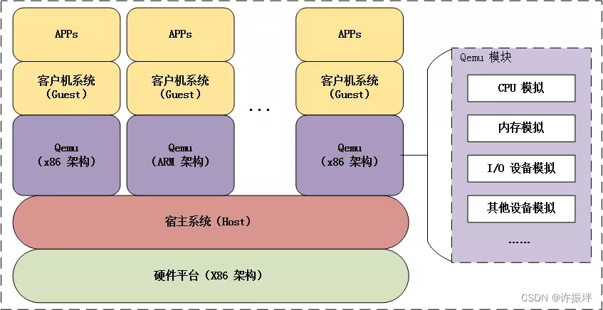

# QEMU启动x86-Linux内核

#### 目录

-   [QEMU简介](https://blog.csdn.net/benkaoya/article/details/129469116?ops_request_misc=&request_id=&biz_id=102&utm_term=qemu%E8%BF%90%E8%A1%8CLinux&utm_medium=distribute.pc_search_result.none-task-blog-2~all~sobaiduweb~default-9-129469116.142^v100^pc_search_result_base5&spm=1018.2226.3001.4187#QEMU_5)
-   [linux启动流程](https://blog.csdn.net/benkaoya/article/details/129469116?ops_request_misc=&request_id=&biz_id=102&utm_term=qemu%E8%BF%90%E8%A1%8CLinux&utm_medium=distribute.pc_search_result.none-task-blog-2~all~sobaiduweb~default-9-129469116.142^v100^pc_search_result_base5&spm=1018.2226.3001.4187#linux_18)
-   [我的环境](https://blog.csdn.net/benkaoya/article/details/129469116?ops_request_misc=&request_id=&biz_id=102&utm_term=qemu%E8%BF%90%E8%A1%8CLinux&utm_medium=distribute.pc_search_result.none-task-blog-2~all~sobaiduweb~default-9-129469116.142^v100^pc_search_result_base5&spm=1018.2226.3001.4187#_37)
-   [安装QEMU](https://blog.csdn.net/benkaoya/article/details/129469116?ops_request_misc=&request_id=&biz_id=102&utm_term=qemu%E8%BF%90%E8%A1%8CLinux&utm_medium=distribute.pc_search_result.none-task-blog-2~all~sobaiduweb~default-9-129469116.142^v100^pc_search_result_base5&spm=1018.2226.3001.4187#QEMU_44)
-   -   [软件包安装](https://blog.csdn.net/benkaoya/article/details/129469116?ops_request_misc=&request_id=&biz_id=102&utm_term=qemu%E8%BF%90%E8%A1%8CLinux&utm_medium=distribute.pc_search_result.none-task-blog-2~all~sobaiduweb~default-9-129469116.142^v100^pc_search_result_base5&spm=1018.2226.3001.4187#_48)
    -   [源码安装](https://blog.csdn.net/benkaoya/article/details/129469116?ops_request_misc=&request_id=&biz_id=102&utm_term=qemu%E8%BF%90%E8%A1%8CLinux&utm_medium=distribute.pc_search_result.none-task-blog-2~all~sobaiduweb~default-9-129469116.142^v100^pc_search_result_base5&spm=1018.2226.3001.4187#_58)
-   [编译linux内核](https://blog.csdn.net/benkaoya/article/details/129469116?ops_request_misc=&request_id=&biz_id=102&utm_term=qemu%E8%BF%90%E8%A1%8CLinux&utm_medium=distribute.pc_search_result.none-task-blog-2~all~sobaiduweb~default-9-129469116.142^v100^pc_search_result_base5&spm=1018.2226.3001.4187#linux_141)
-   [编译busybox](https://blog.csdn.net/benkaoya/article/details/129469116?ops_request_misc=&request_id=&biz_id=102&utm_term=qemu%E8%BF%90%E8%A1%8CLinux&utm_medium=distribute.pc_search_result.none-task-blog-2~all~sobaiduweb~default-9-129469116.142^v100^pc_search_result_base5&spm=1018.2226.3001.4187#busybox_203)
-   [制作initramfs](https://blog.csdn.net/benkaoya/article/details/129469116?ops_request_misc=&request_id=&biz_id=102&utm_term=qemu%E8%BF%90%E8%A1%8CLinux&utm_medium=distribute.pc_search_result.none-task-blog-2~all~sobaiduweb~default-9-129469116.142^v100^pc_search_result_base5&spm=1018.2226.3001.4187#initramfs_237)
-   [使用QEMU启动linux内核](https://blog.csdn.net/benkaoya/article/details/129469116?ops_request_misc=&request_id=&biz_id=102&utm_term=qemu%E8%BF%90%E8%A1%8CLinux&utm_medium=distribute.pc_search_result.none-task-blog-2~all~sobaiduweb~default-9-129469116.142^v100^pc_search_result_base5&spm=1018.2226.3001.4187#QEMUlinux_278)
-   [简化命令](https://blog.csdn.net/benkaoya/article/details/129469116?ops_request_misc=&request_id=&biz_id=102&utm_term=qemu%E8%BF%90%E8%A1%8CLinux&utm_medium=distribute.pc_search_result.none-task-blog-2~all~sobaiduweb~default-9-129469116.142^v100^pc_search_result_base5&spm=1018.2226.3001.4187#_317)
-   [参考](https://blog.csdn.net/benkaoya/article/details/129469116?ops_request_misc=&request_id=&biz_id=102&utm_term=qemu%E8%BF%90%E8%A1%8CLinux&utm_medium=distribute.pc_search_result.none-task-blog-2~all~sobaiduweb~default-9-129469116.142^v100^pc_search_result_base5&spm=1018.2226.3001.4187#_344)

* * *

## QEMU简介

QEMU（quick emulator）是一个通用的、开源的硬件[模拟器](https://so.csdn.net/so/search?q=%E6%A8%A1%E6%8B%9F%E5%99%A8&spm=1001.2101.3001.7020)，可以模拟不同硬件架构（如x86、ARM、ARM64、MIPS、PowerPC等），是目前比较流行的跨平台仿真软件。

QEMU主要的仿真方式包括：全系统仿真和用户模式仿真。

全系统仿真，QEMU提供了整个机器的虚拟模型（包括CPU、内存和模拟设备等外设）来运行客户操作系统。该模式下，相当于系统级虚拟机。

用户模式仿真，QEMU 允许一个应用程序执行在不同架构的CPU上，该模式下，相当于进程级虚拟机。

本文介绍如何使用QEMU模拟器启动linux内核，使用的就是QEMU的全系统仿真模式。

## linux启动流程

在开始之前，需要了解linux的开机启动流程，详细可自行查阅资料，如《鸟哥的Linux私房菜》的“[Linux 的启动流程分析](http://cn.linux.vbird.org/linux_basic/0510osloader_1.php#startup)”。简要总结就是：BIOS，MBR，启动Bootloader，加载Kernel，挂载虚拟rootfs，挂载真实rootfs，初始化用户程序（即执行init进程）。

为什么会有虚拟rootfs？这涉及到initrd（全称boot loader initialized RAM disk，初始化的内存盘），RAM disk就是将内存的一部分分配为一个分区并作为磁盘来使用，initrd就是由 boot loader 初始化的内存盘。

initrd出现的背景。

早期，linux系统用于存储rootfs的介质一般只有硬盘或者软盘，内核集成了这些磁盘驱动程序，开机时内核可以直接挂载基于磁盘的rootfs。后来，嵌入式系统可能将rootfs存储到各种介质上，包括IDE、SCSI、SATA，Flash、u-disk等等。如果将所有介质的驱动都编译进内核，内核会越来越臃肿。索性，将所有存储介质的驱动都编译成内核模块并将其ko文件保存在rootfs中，可按需加载。那么问题来了，内核要挂载rootfs就要先加载对应存储介质驱动模块，内核要加载存储介质驱动模块，就要先挂载rootfs。先有鸡还是先有蛋？

为了解决这一矛盾，出现了基于ramdisk的initrd。initrd是一个被压缩过的小型根目录，这个目录中包含了启动阶段中必须的驱动模块，可执行文件和启动脚本。在 Bootloader 配置了 initrd 的情况下，内核启动被分成了两个阶段，第一阶段先挂载基于内存盘的虚拟roofs，把系统内存的一部分作为根文件系统挂载，执行 initrd 文件系统中的启动脚本，完成加载驱动模块等任务，第二阶段才挂载真实rootfs并执行初始化用户程序init 进程。

initrd是基于内存的块设备（即ramdisk），有个缺点就是大小固定，是过时的机制。Linux 2.6开始采用initramfs替换了initrd，initramfs（init ram filesystem）是基于内存的文件系统（即ramfs），其空间大小可动态变化，本文使用的就是 initramfs。

总结起来，就是在挂载基于磁盘的真正rootfs之前，会先挂载一个基于内存的虚拟rootfs（通过initrd或者initramfs 实现），虚拟rootfs只是起个过渡的作用，它完成一些内核不容易做到的事情，比如加载必要的驱动模块，挂载真正rootfs。

使用QEMU的全系统仿真模式启动linux内核时，BIOS、MBR和Bootloader都已经在QEMU内置好了，我们只要准备linux内核镜像和initramfs即可。本文重点演示QEMU启动内核，执行到基于内存的虚拟rootfs就结束了，并没有准备真实rootfs。

linux内核镜像可通过编译内核源码获得，initramfs可以使用 busybox 来制作。

## 我的环境

宿主机硬件平台：x86\_64  
宿主机操作系统：Ubuntu 20.04 （Linux 5.4.0-139-generic）  
QEMU版本：qemu-4.2.1  
实验内核：linux-5.19  
busybox版本：busybox-1.35.0

## 安装QEMU

qemu安装方式有两种：Linux软件包安装、源码编译安装。

### 软件包安装

    $ sudo apt-get install qemu-system-x86
    
    $ qemu-system-x86_64 --version
    QEMU emulator version 4.2.1 (Debian 1:4.2-3ubuntu6.24)
    Copyright (c) 2003-2019 Fabrice Bellard and the QEMU Project developers

### 源码安装

官方Documentation有详细介绍 Building QEMU for Linux可供参考。

安装依赖项，如果不知道自己环境装了没有，也可以不急着安装，可根据编译错误提示安装对应依赖项即可：

    sudo apt-get install git libglib2.0-dev libfdt-dev libpixman-1-dev zlib1g-dev ninja-build

下载编译：

    $ mkdir ~/kvm
    $ cd ~/kvm/
    $ wget https://download.qemu.org/qemu-7.2.0.tar.xz
    $ tar -xf qemu-7.2.0.tar.xz
    $ cd qemu-7.2.0
    $ ./configure --target-list=x86_64-softmmu
    $ make -j`nproc`

说明：

1.  默认会编译所有平台（如arm、i386、x86\_64等）的QEMU，这会很慢，加上 --target-list=x86\_64-softmmu 选项只编译我环境所需的 x86\_64 版本，以加快编译速度。
2.  make加上-j选项可加快编译速度，nproc命令用于获取可用的CPU核数，一般来说，-j最大并行任务数可设为CPU数量的2倍。

编译结果在源码目录的build子目录下：

    $ ./build/qemu-system-x86_64 --version
    QEMU emulator version 7.2.0
    Copyright (c) 2003-2022 Fabrice Bellard and the QEMU Project developers

源码编译过程中我遇到的依赖问题有：

报错1：

    $ ./configure
    Using './build' as the directory for build output
     
    ERROR: Cannot find Ninja

解决1：

    $ sudo apt-get install ninja-build

报错2：

    $ ./configure 
    Using './build' as the directory for build output
    
    ERROR: glib-2.56 gthread-2.0 is required to compile QEMU

解决2：

    $ sudo apt-get install libglib2.0-dev

报错3：

    $ ./configure 
    Using './build' as the directory for build output
    
    ../meson.build:553:2: ERROR: Dependency "pixman-1" not found, tried pkgconfig
    
    ERROR: meson setup failed

解决 3：

    $ sudo apt-get install libpixman-1-dev

## 编译linux内核

    $ mkdir ~/kvm
    $ cd ~/kvm/
    $ wget https://git.kernel.org/pub/scm/linux/kernel/git/stable/linux.git/snapshot/linux-5.19.tar.gz
    $ tar -xf linux-5.19.tar.gz
    $ cd linux-5.19/
    $ make defconfig
    $ make menuconfig
    $ make -j `nproc`

看到以下日志就表示编译成功：

    Kernel: arch/x86/boot/bzImage is ready

其中bzImage文件就是编译后的内核镜像文件：

    $ file arch/x86/boot/bzImage
    arch/x86/boot/bzImage: Linux kernel x86 boot executable bzImage, version 5.19.0 (kaoya@kaoya-Inspiron-7472) #1 SMP PREEMPT_DYNAMIC Mon Feb 27 00:26:06 CST 2023, RO-rootFS, swap_dev 0xA, Normal VGA

说明：  
3\. 本次实验make menuconfig并未做任何修改，直接选择保存、退出。  
4\. make加上-j选项可加快编译速度，nproc命令用于获取可用的CPU核数，一般来说，-j最大并行任务数可设为CPU数量的2倍。  
5\. make过程可能会因为系统缺少依赖项而导致报错，根据提示安装对应依赖项即可。

我的环境在make过程中报错及其解决方法如下：  
$ sudo apt install bison  
报错1：

    $ make defconfig
    
     /bin/sh: 1: flex: not found

解决1：

    $ sudo apt install flex

报错2：

    $ make defconfig
    
    /bin/sh: 1: bison: not found

解决2：

    在这里插入代码片

## 编译busybox

    $ mkdir ~/kvm
    $ cd ~/kvm/
    $ wget https://busybox.net/downloads/busybox-1.35.0.tar.bz2
    $ tar -xf busybox-1.35.0.tar.bz2
    $ cd busybox-1.35.0/
    $ make menuconfig
    
    # 修改配置，选中如下项目，静态编译
    # Settings –> Build Options –> [*] Build static binary（no share libs）
    
    # 反选如下项目，否则后续qemu执行会提示 /bin/sh:can't access tty;job control turned off
    # Shells  --->  [ ]   Job control
    
    $ make -j `nproc`
    $ make install

装完后会 默认安装到源码目录的 \_install/ 目录下：

    $ ls _install/
    bin  linuxrc  sbin  usr

最关键的就是\_install/bin/busybox，其他都是链接文件。

    $ file _install/bin/busybox 
    _install/bin/busybox: ELF 64-bit LSB executable, x86-64, version 1 (GNU/Linux), statically linked, BuildID[sha1]=8be05d97976fc5de35a9ebf2631529223523296f, for GNU/Linux 3.2.0, stripped

## 制作initramfs

使用busybox快速制作initramfs。

创建虚拟rootfs中的inti启动脚本，并赋予可执行权限：

    $ cd ~/kvm/busybox-1.35.0/_install/
    $ mkdir proc sys dev tmp
    $ touch init
    $ chmod +x init

脚本内容：

    #!/bin/sh
    
    # 挂载一些必要的文件系统
    mount -t proc none /proc
    mount -t sysfs none /sys
    mount -t tmpfs none /tmp
    mount -t devtmpfs none /dev
    
    echo
    echo "Hello Linux"
    
    # 显示开机消耗时间
    
    echo "This boot took $(cut -d' ' -f1 /proc/uptime) seconds"
    echo
    
    # 停留在控制台
    exec /bin/sh

制作initramfs文件，它是多个文件通过cpio打包和gzip压缩的文件，是一个cpio格式的内存文件系统。

    $ find . -print0 | cpio --null -ov --format=newc | gzip -9 > ../initramfs.cpio.gz

## 使用QEMU启动linux内核

linux内核镜像和initramfs都准备好，就可以使用QEMU启动linux内核了。

以图形界面的方式启动QEMU：

    $ cd ~/kvm/
    $ qemu-system-x86_64 \
            -kernel ./linux-5.19/arch/x86/boot/bzImage \
            -initrd ./busybox-1.35.0/initramfs.cpio.gz \
            -append "init=/init"

以字符界面方式启动QEMU（不启动图形界面），同时日志输出到控制台：

    $ qemu-system-x86_64 \
            -kernel ./linux-5.19/arch/x86/boot/bzImage \
            -initrd ./busybox-1.35.0/initramfs.cpio.gz \
            -nographic \
            -append "init=/init console=ttyS0"

QEMU参数说明（更多可参考：[Standard options](https://www.qemu.org/docs/master/system/invocation.html)）：

-   \-kernel：指定启动的内核镜像；
-   \-initrd：指定启动的内存文件系统；
-   \-append：传递给内核的启动参数；启动后可使用cat /proc/cmdline命令核对。
-   \-nographic：启动字符界面（不启动图形界面），输出重定向到宿主机命令行，与参数 console=ttyS0 组合使用；

图形界面操作使用工具栏菜单即可，字符界面操作使用快捷键如下所示（更多可参考：[Keys in the character backend multiplexer](https://www.qemu.org/docs/master/system/mux-chardev.html)）：

C-a h print this help  
C-a x exit emulator  
C-a s save disk data back to file (if -snapshot)  
C-a t toggle console timestamps  
C-a b send break (magic sysrq)  
C-a c switch between console and monitor  
C-a C-a sends C-a

## 简化命令

为了简化命令输入，可以创建一个Makefile，内容如下：

    $ vim ~/kvm/Makefile
    
    initramfs:
    	cd busybox-1.35.0/_install/ && find . -print0 | cpio --null -ov --format=newc | gzip -9 > ../initramfs.cpio.gz
            
    run-win:
    	qemu-system-x86_64 \
    			-kernel ./linux-5.19/arch/x86/boot/bzImage \
    			-initrd ./busybox-1.35.0/initramfs.cpio.gz \
    			-append "init=/init"
            
    run-console:
    	qemu-system-x86_64 \
    			-kernel ./linux-5.19/arch/x86/boot/bzImage \
    			-initrd ./busybox-1.35.0/initramfs.cpio.gz \
    			-nographic \
    			-append "init=/init console=ttyS0"

-   make initramfs：制作initramfs；
-   make run-win：以图形界面的方式启动QEMU；
-   make run-console：以字符界面方式启动QEMU；

## 参考

QEMU官方文档：https://www.qemu.org/docs/master/  
QEMU维基百科：https://wiki.qemu.org/Documentation