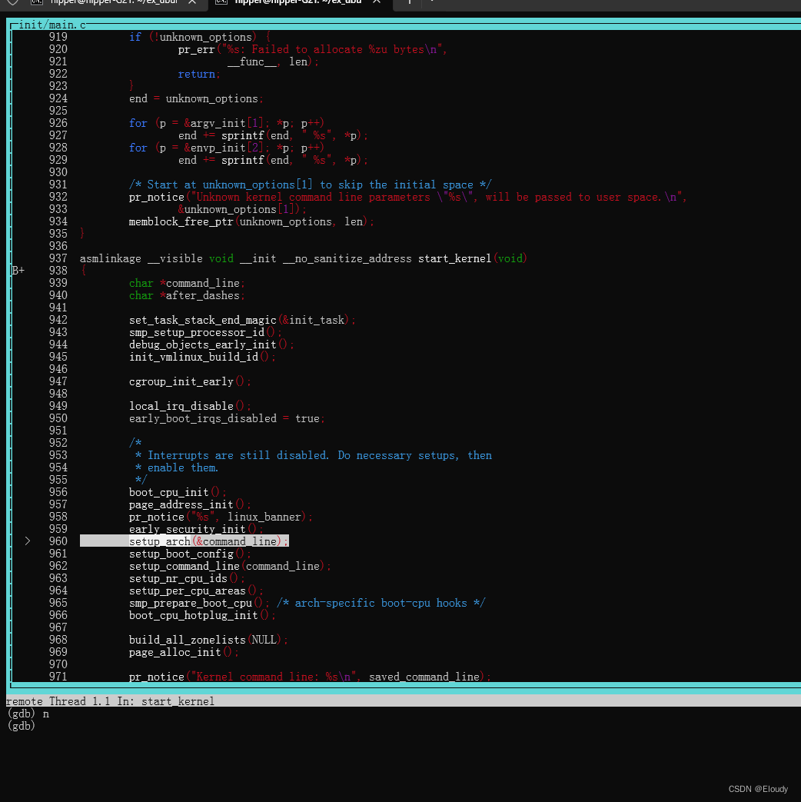

# qemu 调试 Linux kernel 基于 x86_64

本笔记是如下笔记的补充：

[qemu 安装ubuntu22.04虚拟机 -纯命令行-可ssh-带网络-编译安装 linux kernel-编译安装 kernel module_ubuntu 编译qemu-CSDN博客](https://blog.csdn.net/eloudy/article/details/139831062?spm=1001.2014.3001.5501)

## 1，配置编译qemu

配置qemu：

cd qemu/

mkdir build

cd build/

    $ ../configure --enable-slirp \
    --enable-slirp-smbd --smbd=/home/hipper/ex_ubuntu-22.4.4-live-server_qemu/smba_00 \
    --target-list="riscv32-softmmu riscv64-softmmu x86_64-softmmu"

注意，不要enable\_kvm 和 enable\_debug

编译 qemu：

make -j

## 2，安装虚拟系统

### 2.1创建磁盘文件：

    $ ./qemu/build/qemu-img create ubuntu-220404-kernel-00.qcow2 -f qcow2 150G

### 2.2 安装系统：

    sudo ./qemu/build/qemu-system-x86_64 -m 196608M -smp 12 -boot c  \
    -hda  ubuntu-220404-kernel-00.qcow2 \
    -net nic -net user,smb=/home/hipper/ex_ubuntu-22.4.4-live-server_qemu/smba_00 \
    --nographic -append console=ttyS0  \
    -cdrom  ubuntu-22.04.4-live-server-amd64.iso  \
    -kernel ./ubuntu-220404/iso_ubuntu-22.04.4-live-server-amd64/casper/vmlinuz  \
    -initrd  ./ubuntu-220404/iso_ubuntu-22.04.4-live-server-amd64/casper/initrd

不带 -c host  --enable-kvm

### 2.3 重启验证：

    sudo ./qemu/build/qemu-system-x86_64 -m 32768M -smp 6 -boot c  \
    -hda  ubuntu-220404-kernel-00.qcow2   --nographic \
    -net nic -net user,smb=/home/hipper/ex_ubuntu-22.4.4-live-server_qemu/smba_00,hostfwd=tcp::2222-:22

## 3，调试kernel：

### 3.0 编译 Linux kernel

见上篇，可以下载跟[qemu虚拟机](https://so.csdn.net/so/search?q=qemu%E8%99%9A%E6%8B%9F%E6%9C%BA&spm=1001.2101.3001.7020)中接近的 kernel 源码到宿主机，并拷贝出来 虚拟机中的/boot/configxxxx

用于编译

make oldconfig 中需要手工选择的选项越少越好。

$ make oldconfig

$ make -j

即能生成 vmlinux

可以查看debug info是否开启。

### 3.1 指定 -kernel vmlinux 启动

    sudo ./qemu/build/qemu-system-x86_64 -m 32768M -smp 6 -boot c  \
    -kernel ./debug_kernel/linux-source-5.15.0/vmlinux \
    -hda  ubuntu-220404-kernel-00.qcow2    --nographic \
    -net nic -net user,smb=/home/hipper/ex_ubuntu-22.4.4-live-server_qemu/smba_00,hostfwd=tcp::2222-:22 \
    -s -S

解释一下为什么使用 vmlinux：

在 Linux 内核开发中，uImage、vmlinux 和 bzImage 是与 Linux 内核镜像相关的不同文件格式或类型。它们之间的关系如下：

1\. vmlinux 是 Linux 内核编译生成的未压缩的可执行内核镜像文件。  
它包含了完整的内核代码、数据和符号信息，用于调试和分析内核。  
vmlinux 文件通常很大，因为它包含了未经压缩的内核代码和数据。

2.bzImage 是经过压缩的 Linux 内核镜像文件。  
它是用 objcopy 工具从 vmlinux 文件中提取内核代码和数据，并经过压缩处理后生成的。  
bzImage 是用于引导 Linux 内核的常见内核镜像格式，适用于大多数 Linux 发行版的引导过程。

3.uImage 是适用于嵌入式系统的 Linux 内核镜像文件格式。  
它通常包含了压缩的内核镜像、引导加载程序和其他引导信息。  
uImage 文件通常用于嵌入式系统中，以便在引导过程中加载和运行 Linux 内核。

objcopy是一个比较深刻的二进制工具

### 3.2 调试 kernel

host ：

$ gdb

#载入 debug 版本的 vmlinux

(gdb) file ./debug\_kernel/linux\_5.15.0/vmlinux

(gdb) target remote:1234

(gdb) b start\_kernel

(gdb) start #忘记这个要不要了

(gdb) c

效果：

断点处stop，

未完待续。。。