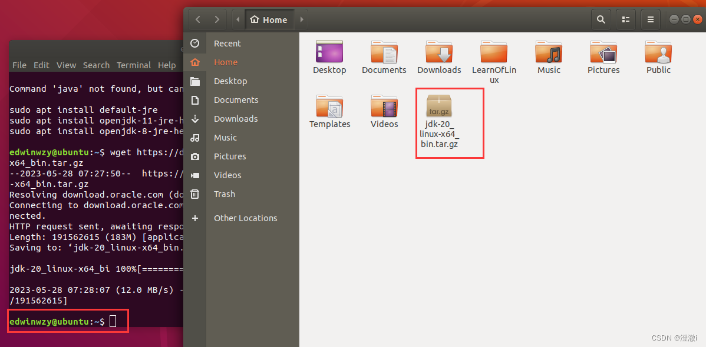
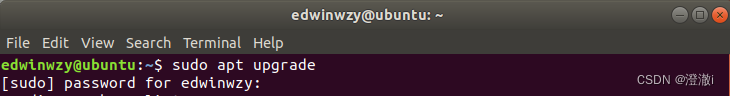

# linux下安装EclipseCDT：离线安装与在线安装

#### 文章目录

-   [前言：](https://blog.csdn.net/Edwinwzy/article/details/130917159?ops_request_misc=%257B%2522request%255Fid%2522%253A%252228487297-F286-4419-99DE-71DDB568B422%2522%252C%2522scm%2522%253A%252220140713.130102334..%2522%257D&request_id=28487297-F286-4419-99DE-71DDB568B422&biz_id=0&utm_medium=distribute.pc_search_result.none-task-blog-2~all~baidu_landing_v2~default-6-130917159-null-null.142^v100^pc_search_result_base5&utm_term=eclipse%20cdt%E5%AE%89%E8%A3%85&spm=1018.2226.3001.4187#_1)
-   [1\. 离线下载](https://blog.csdn.net/Edwinwzy/article/details/130917159?ops_request_misc=%257B%2522request%255Fid%2522%253A%252228487297-F286-4419-99DE-71DDB568B422%2522%252C%2522scm%2522%253A%252220140713.130102334..%2522%257D&request_id=28487297-F286-4419-99DE-71DDB568B422&biz_id=0&utm_medium=distribute.pc_search_result.none-task-blog-2~all~baidu_landing_v2~default-6-130917159-null-null.142^v100^pc_search_result_base5&utm_term=eclipse%20cdt%E5%AE%89%E8%A3%85&spm=1018.2226.3001.4187#1__9)
-   -   [1.1 下载EclipseCDT](https://blog.csdn.net/Edwinwzy/article/details/130917159?ops_request_misc=%257B%2522request%255Fid%2522%253A%252228487297-F286-4419-99DE-71DDB568B422%2522%252C%2522scm%2522%253A%252220140713.130102334..%2522%257D&request_id=28487297-F286-4419-99DE-71DDB568B422&biz_id=0&utm_medium=distribute.pc_search_result.none-task-blog-2~all~baidu_landing_v2~default-6-130917159-null-null.142^v100^pc_search_result_base5&utm_term=eclipse%20cdt%E5%AE%89%E8%A3%85&spm=1018.2226.3001.4187#11_EclipseCDT_11)
    -   [1.2 下载jdk](https://blog.csdn.net/Edwinwzy/article/details/130917159?ops_request_misc=%257B%2522request%255Fid%2522%253A%252228487297-F286-4419-99DE-71DDB568B422%2522%252C%2522scm%2522%253A%252220140713.130102334..%2522%257D&request_id=28487297-F286-4419-99DE-71DDB568B422&biz_id=0&utm_medium=distribute.pc_search_result.none-task-blog-2~all~baidu_landing_v2~default-6-130917159-null-null.142^v100^pc_search_result_base5&utm_term=eclipse%20cdt%E5%AE%89%E8%A3%85&spm=1018.2226.3001.4187#12_jdk_34)
    -   [1.3 安装jdk](https://blog.csdn.net/Edwinwzy/article/details/130917159?ops_request_misc=%257B%2522request%255Fid%2522%253A%252228487297-F286-4419-99DE-71DDB568B422%2522%252C%2522scm%2522%253A%252220140713.130102334..%2522%257D&request_id=28487297-F286-4419-99DE-71DDB568B422&biz_id=0&utm_medium=distribute.pc_search_result.none-task-blog-2~all~baidu_landing_v2~default-6-130917159-null-null.142^v100^pc_search_result_base5&utm_term=eclipse%20cdt%E5%AE%89%E8%A3%85&spm=1018.2226.3001.4187#13_jdk_38)
    -   [1.4 安装eclipse](https://blog.csdn.net/Edwinwzy/article/details/130917159?ops_request_misc=%257B%2522request%255Fid%2522%253A%252228487297-F286-4419-99DE-71DDB568B422%2522%252C%2522scm%2522%253A%252220140713.130102334..%2522%257D&request_id=28487297-F286-4419-99DE-71DDB568B422&biz_id=0&utm_medium=distribute.pc_search_result.none-task-blog-2~all~baidu_landing_v2~default-6-130917159-null-null.142^v100^pc_search_result_base5&utm_term=eclipse%20cdt%E5%AE%89%E8%A3%85&spm=1018.2226.3001.4187#14_eclipse_62)
-   [2\. 在线安装：](https://blog.csdn.net/Edwinwzy/article/details/130917159?ops_request_misc=%257B%2522request%255Fid%2522%253A%252228487297-F286-4419-99DE-71DDB568B422%2522%252C%2522scm%2522%253A%252220140713.130102334..%2522%257D&request_id=28487297-F286-4419-99DE-71DDB568B422&biz_id=0&utm_medium=distribute.pc_search_result.none-task-blog-2~all~baidu_landing_v2~default-6-130917159-null-null.142^v100^pc_search_result_base5&utm_term=eclipse%20cdt%E5%AE%89%E8%A3%85&spm=1018.2226.3001.4187#2__113)
-   -   [2.1 安装jdk](https://blog.csdn.net/Edwinwzy/article/details/130917159?ops_request_misc=%257B%2522request%255Fid%2522%253A%252228487297-F286-4419-99DE-71DDB568B422%2522%252C%2522scm%2522%253A%252220140713.130102334..%2522%257D&request_id=28487297-F286-4419-99DE-71DDB568B422&biz_id=0&utm_medium=distribute.pc_search_result.none-task-blog-2~all~baidu_landing_v2~default-6-130917159-null-null.142^v100^pc_search_result_base5&utm_term=eclipse%20cdt%E5%AE%89%E8%A3%85&spm=1018.2226.3001.4187#21_jdk_116)
    -   [2.2 安装EclipseCDT](https://blog.csdn.net/Edwinwzy/article/details/130917159?ops_request_misc=%257B%2522request%255Fid%2522%253A%252228487297-F286-4419-99DE-71DDB568B422%2522%252C%2522scm%2522%253A%252220140713.130102334..%2522%257D&request_id=28487297-F286-4419-99DE-71DDB568B422&biz_id=0&utm_medium=distribute.pc_search_result.none-task-blog-2~all~baidu_landing_v2~default-6-130917159-null-null.142^v100^pc_search_result_base5&utm_term=eclipse%20cdt%E5%AE%89%E8%A3%85&spm=1018.2226.3001.4187#22_EclipseCDT_131)
    -   -   [2.2.1 简单安装](https://blog.csdn.net/Edwinwzy/article/details/130917159?ops_request_misc=%257B%2522request%255Fid%2522%253A%252228487297-F286-4419-99DE-71DDB568B422%2522%252C%2522scm%2522%253A%252220140713.130102334..%2522%257D&request_id=28487297-F286-4419-99DE-71DDB568B422&biz_id=0&utm_medium=distribute.pc_search_result.none-task-blog-2~all~baidu_landing_v2~default-6-130917159-null-null.142^v100^pc_search_result_base5&utm_term=eclipse%20cdt%E5%AE%89%E8%A3%85&spm=1018.2226.3001.4187#221__132)
        -   [2.2.2 ubuntu官方推荐安装方式](https://blog.csdn.net/Edwinwzy/article/details/130917159?ops_request_misc=%257B%2522request%255Fid%2522%253A%252228487297-F286-4419-99DE-71DDB568B422%2522%252C%2522scm%2522%253A%252220140713.130102334..%2522%257D&request_id=28487297-F286-4419-99DE-71DDB568B422&biz_id=0&utm_medium=distribute.pc_search_result.none-task-blog-2~all~baidu_landing_v2~default-6-130917159-null-null.142^v100^pc_search_result_base5&utm_term=eclipse%20cdt%E5%AE%89%E8%A3%85&spm=1018.2226.3001.4187#222_ubuntu_135)
        -   [2.2.3 apt安装(报错logo)](https://blog.csdn.net/Edwinwzy/article/details/130917159?ops_request_misc=%257B%2522request%255Fid%2522%253A%252228487297-F286-4419-99DE-71DDB568B422%2522%252C%2522scm%2522%253A%252220140713.130102334..%2522%257D&request_id=28487297-F286-4419-99DE-71DDB568B422&biz_id=0&utm_medium=distribute.pc_search_result.none-task-blog-2~all~baidu_landing_v2~default-6-130917159-null-null.142^v100^pc_search_result_base5&utm_term=eclipse%20cdt%E5%AE%89%E8%A3%85&spm=1018.2226.3001.4187#223_aptlogo_150)
-   [总结：](https://blog.csdn.net/Edwinwzy/article/details/130917159?ops_request_misc=%257B%2522request%255Fid%2522%253A%252228487297-F286-4419-99DE-71DDB568B422%2522%252C%2522scm%2522%253A%252220140713.130102334..%2522%257D&request_id=28487297-F286-4419-99DE-71DDB568B422&biz_id=0&utm_medium=distribute.pc_search_result.none-task-blog-2~all~baidu_landing_v2~default-6-130917159-null-null.142^v100^pc_search_result_base5&utm_term=eclipse%20cdt%E5%AE%89%E8%A3%85&spm=1018.2226.3001.4187#_165)

## 前言：

Eclipse使用CDT插件就可实现用Eclipse开发C/C++的程序，这里介绍linux下如何安装开发环境。  
因为linux系统的主机一般使用的时候无法连接外网，用内网的情况居多，所以首先介绍离线下载的方式。  
当然，个人学习使用的时候，主机性能够强大就直接使用VMware创建一个[linux虚拟机](https://so.csdn.net/so/search?q=linux%E8%99%9A%E6%8B%9F%E6%9C%BA&spm=1001.2101.3001.7020)，用桥接的方式，只要主机能上网，虚拟机就能上网，在线下载就显得非常方便。

安装的资源我已经上传了：[获取资源](https://download.csdn.net/download/Edwinwzy/87836560?spm=1001.2014.3001.5501)

* * *

## 1\. 离线下载

### 1.1 下载EclipseCDT

正常情况下我们是windows端下载对应的各种安装包，然后用共享文件或者U盘的方式在虚拟机的linux系统里面安装。所以虽然是离线安装，但是对应的安装包还是要在线下载，下面的下载都是从可以连接网络的主机下载。

进入官网->[https://www.eclipse.org/](https://www.eclipse.org/)  
这里因为是windows端进去下载的，所以这里默认显示的下载选项其实只有你操作系统对应架构的Eclipse，并且是默认为JAVA的，并不是我们要的EclipseCDT。  
点击下面的`Download Packages`  

页面往下滚动，找到我们需要的EclipseCDT，这里我们可以看到Linux下载的有两个选项，那怎么选呢？  

我们在ubuntu的控制台下输入`uname -m`就可以看到架构，我这里是`x86_64`架构，  
所以下载的`Linux x86_64`  

  
一般外国网站还是非常卡的，所以我们这里选择镜像下载。  

下载速度能到1M，也还行。  

* * *

### 1.2 下载jdk

进入[jdk下载网址](https://www.oracle.com/cn/java/technologies/downloads/#jdk20-linux)，根据自己的系统选择，这里我ubuntu18.04是对应下图这个。

### 1.3 安装jdk

使用共享文件的方式，在`/mnt/hgfs`目录下可以看到自己的共享文件夹，把刚才下载的eclipse和jdk都放到共享文件夹内。  
把jdk解压到`/home`中新创建的jkd目录下,这里为了区分所以取名有点别扭叫`jkd`  
如果采用命令行方式则：`tar -zxvf jdk-20_linux-x64_bin.tar.gz -C /home/jkd`  
  
将`jkd-20_linux-x64_bin`拷贝到`/usr/local`目录下  
  
进入对应的目录的控制台，输入指令：`sudo cp -r jdk-20.0.1 /usr/local`，这里一定要`-r`选项  
  
输入：`sudo gedit ~/.bashrc`  
在最后加入：

    export JAVA_HOME=/usr/local/jdk-20.0.1
    export JRE_HOME=${JAVA_HOME}/jre
    export CLASSPATH=.:${JAVA_HOME}/lib:${JRE_HOME}/lib
    export PATH=${JAVA_HOME}/bin:$PATH

接着输入`source ~/.bashrc`使配置生效  
  
是否安装成功可以通过`java -version`来查看，如果出现下面情况则表示成功。  

### 1.4 安装eclipse

将共享文件夹的eclipse-cpp-2023-03-R-linux-gtk-x86\_64.tar.gz解压到自己想安装的位置，我这里放在`/home`目录下  
如果出现报错提示：没有足够空间什么什么的，大概率就是你内存给小了。只需要把压缩包复制到安装目录下，然后右键选择`Extract to Here`  
解压后进入到对应目录，双击打开这个eclipse就可以了。  
  
当然了，相比于这个，我们肯定更喜欢桌面的快捷方式。

控制台输入: `cd /usr/share/applications`  
创建eclipse.desktop：`touch eclipse.destktop`  
  

输入`sudo gedit eclipse.desktop`打开文件。  
输入以下内容：

    [Desktop Entry]
    Encoding=UTF-8
    Name=eclipse2023
    Comment=Eclipse
    Exec=/home/edwinwzy/eclipse/eclipse
    Icon=/home/edwinwzy/eclipse/icon.xpm
    Terminal=false
    StartupNotify=true
    Type=Application
    Categories=Application;Development;

Exec=指运行eclipse对应的路径  
Icon=指eclipse可执行文件路径下的icon.xpm文件路径  
  
保存后，我们可以在桌面的左下角的九宫格点开后看到我们创建的快捷方式。

  
安装成功

* * *

## 2\. 在线安装：

在线安装其实就是虚拟机联网安装，安装方式和离线安装本质上是一样的。

### 2.1 安装jdk

jdk单独安装适用于2.2.1小节。  
用`wget url`方式进行下载  
`url地址`参考上面jdk后面对应的网址。  
  
下载后的压缩包在刚才输入wget时所在的目录。  
后面就是解压安装，配置环境，和离线的方式一样，所以这里就不再赘述。  
最后结果就和下面一样就行。  

当然了，也可以通过浏览器进入官网下载对应的压缩包，ubuntu系统里面全图形化操作，和windows下差不了多少。

### 2.2 安装EclipseCDT

#### 2.2.1 简单安装

简单方法：进入eclipse的官网下载对应的EclipseCDT的压缩包，后面就和离线安装方式一样。  
结合2.1小节的jdk，亲测可以使用。

#### 2.2.2 ubuntu官方推荐安装方式

更新安装的地址  
`sudo apt upgrade`  
  
安装jdk  
输入指令：`sudo apt install default-jdk-headless`  

使用`snap install eclipse --classic`指令  
  
装完之后在左下角里面的九宫格打开会有eclipse，点开即可使用。

#### 2.2.3 apt安装(报错logo)

这个未解决，但也是一种方式，仅供参考。有兴趣的读者可以尝试解决，下方评论。  
使用`sudo apt install eclipse`就可以安装`Eclipse java版本`。  
`eclipse`安装完成后出现下图情况。  

打开的位置如下图所示  
  
  
但是这里会报错，查看了官方的说明，尝试了几个方法发现还是未解决  
1、参考eclipse官方安装指导https://wiki.eclipse.org/Eclipse/Installation

2、参考eclipse官方linux安装报错指导 https://wiki.eclipse.org/IRC\_FAQ#I\_just\_installed\_Eclipse\_on\_Linux.2C\_but\_it\_does\_not\_start.\_What\_is\_the\_problem.3F

## 总结：

本篇博客写了EclipseCDT的详细安装，只要挑一个可以用的就行了。离线安装和在线安装的第一个我亲测可以使用，后面2.2.3确实存在点问题，解决起来比较复杂，尝试了几种方法后没效果我就没弄了。2.2.2方法看网上有别的博主使用成功过，这里就做个记录，汇总一下。

## 参考

[linux下安装EclipseCDT：离线安装与在线安装_cdt安装-CSDN博客](https://blog.csdn.net/Edwinwzy/article/details/130917159?ops_request_misc=%7B%22request%5Fid%22%3A%2228487297-F286-4419-99DE-71DDB568B422%22%2C%22scm%22%3A%2220140713.130102334..%22%7D&request_id=28487297-F286-4419-99DE-71DDB568B422&biz_id=0&utm_medium=distribute.pc_search_result.none-task-blog-2~all~baidu_landing_v2~default-6-130917159-null-null.142^v100^pc_search_result_base5&utm_term=eclipse cdt安装&spm=1018.2226.3001.4187)