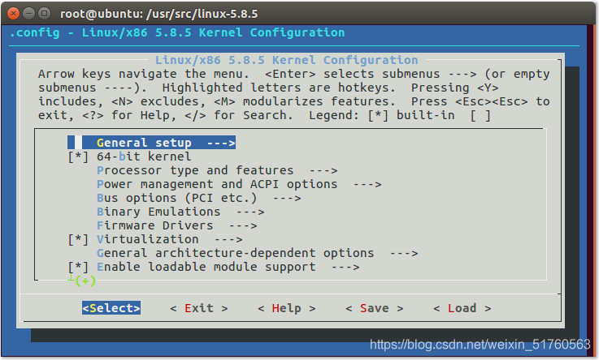

# 《Linux内核设计与实现》第二章笔记

## 第二章 从内核出发

### 2.1 获取内核源码

登录Linux内核官方网站https://kernel.org/pub/linux/kernel获取。

内核源码树由很多目录组成：

目录

描述

arch

特定体系结构的源码

block

块设备I/O层

crypto

加密api

Documentation

内核源码文档

drivers

设备驱动程序

firmware

使用某些驱动程序而需要的设备固件

fs

VFS和各种文件系统

include

内核头文件

init

内核引导和初始化

ipc

进程间通信代码

kernel

像调度程序这样的核心子系统

lib

通用内核函数

mm

内存管理子系统和VM

net

网络子系统

samples

示例，示范代码

scripts

编译内核所用的脚本

security

Linux安全模块

sound

语音子系统

usr

早期用户空间代码

tools

在Linux开发中有用的工具

virt

虚拟化基础结构

### 2.2 安装内核源码

内核源码一般安装在/usr/src/linux目录下。但请注意，不要把这个源码树用于开发，也不要以root身份对内核进行修改，而应当建立自己的目录，仅以root身份安装新内核。即使在安装内核时，/usr/src/linux目录都应当原封不动。

#### 2.2.1 配置内核

因为Linux源码随手可得，那就意味着在编译它之前可以配置和定制。可以配置的各种选项，以CONFIG\_FEATURE形式表示，其前缀为CONFIG。配置选项即可以用来决定哪些文件编译进内核，也可以通过预处理命令处理代码。

这些配置项要么是二选一要么是三选一，二选一就是yes或no。三选一就是yes、no或module。module意味着该配置项被选定了，但编译的时候这部分功能的实现代码是以模块的形式生成。在三选一的情况下，显然yes选项表示把代码编译进主内核映像中，而不是作为一个模块。驱动程序一般都用三选一的配置项。

配置选项也可以是字符串或整数，这些选项并不控制编译过程，而只是指定内核源码可以访问的值，一般以预处理宏的形式表示。

内核的图形界面配置命令:

    $make menuconfig

或

    $make gconfig

也可以使用默认配置：

    $make defconfig

这些配置项会被存放在内核代码树根目录下的 .config 文件中。可以直接找到并修改它，在你修改过配置文件过后，或者在用已有的配置文件配置新的代码树的时候，你应该执行以下命令来应用和更新配置。

    $make oldconfig

#### 2.2.3 编译内核

一旦内核配置好了，就可以使用一个简单的命令来编译它了。

    $make 

默认情况下，make只衍生一个作业。但make程序可以把编译过程拆分成多个并行的作业。其中的每个作业独立并发的运行，这有助于极大的提高处理器系统上的编译过程，也有利于改善处理器的利用率。为了以多个作业编译内核，使用以下命令：

    $make  -jn  #这里n是要衍生出来的作业数

#### 2.2.4 安装新内核

在内核编译好后，你还需要安装它。怎么安装就和体系结构以及启动引导工具息息相关，查阅启动引导工具说明，按照它的指导将内核映像拷贝到合适位置，并按照启动要求安装它。

所幸，模块的安装是自动的，也是独立于体系结构的。以root身份运行：

    #make modules_install

就可以把所有已编译的模块安装到正确的主目录 /lib/modules下。

> 模块（Module）机制：用户可以根据需要，在不需要对内核重新编译的情况下，可以将模块动态地载入或移出内核。
>
> 模块是具有独立功能的程序，它可以被单独编译，但不能独立运行，它在运行时被链接到内核，作为内核的一部分在内核空间运行。
>
> 模块通常由一组函数和数据结构组成，用来实现一种文件系统，一个驱动程序或其他内核上层的功能。
>
> 内核模块是Linux 内核向外提供的一个插口，其全称为动态可加载内核模块（Loader Kernel Module , LKM），简称为模块。

编译时也会在内核代码树的根目录下创建一个System.map文件。这是一份符号对照表，用以将内核符号和他们的起始地址对应起来。调试的时候，如果需要把内存地址翻译成容易理解的函数名以及变量名，这就会很有用。

### 2.3 内核开发的特点

1.  内核编程时既不能访问C库也不能访问标准的C头文件；
2.  内核编程时必须使用GUN C；
3.  内核编程时缺乏像用户空间那样的内存保护机制；
4.  内核编程时难以执行浮点运算；
5.  内核给每个进程只有一个很小的定长堆栈；
6.  由于内核支持异步中断，抢占和smp，因此必须时刻注意同步和并发；
7.  要考虑可移植性的重要性。

### 2.4 实例：

#### 2.4.1 在Ubuntu 16.04安装linux-5.8.5内核

在官网下载内核源码压缩文件 linux-5.8.5.tar.gz，拷贝至Dowloads目录中，使用sudo tar zxvf linux-5.8.5.tar.gz -C /usr/src/解压，解压完成。  
  
cd 进该目录，然后切换成管理员运行make menuconfig，报错：  
  
先运行apt install libncurses5-dev ，再运行make menuconfig，报错：  
  
运行apt install flex，再运行make menuconfig，报错：  
  
运行apt install bison，再运行make menuconfig，成功：  
  
这里使用默认配置，直接退出。然后运行make -j8，出现错误：  
  
解决办法：apt install libssl-dev，然后再运行make -j8指令，开始漫长的等待。  
  
编译完成，结果如下：  
  
如何查看内核是否编译成功

进入内核源码目录/usr/src/linux-5.8.5/arch/x86/boot/，查看是否有bzImage文件  
  
内核编译成功后就是开始编译内核模块：

命令：make modules编译，然后执行make modules\_install进行内核模块的安装，结果如下：  
  
可以进入/lib/modules目录下查看模块安装是否成功：  
  
开始安装内核，执行make install，执行完结果如下：  
  
重新启动系统，系统会默认从刚刚安装的新内核启动：  

#### 2.4.2 通过grub选择启动的内核版本

如果想开机进入grub界面，动态选择启动的内核版本，可以进行如下操作：

1.  在终端输入**sudo gedit /etc/default/grub** 打开配置文件。
    
2.  把**grub\_hidden\_timeout=0**给删除或者注释掉，把**grub\_cmdline\_linux\_default**修改为**text**。  
    
    
3.  修改完成后我们 **sudo update-grub**重新更新grub配置。
    
4.  重新启动，即可进入grub界面，选择进入advanced options for ubuntu即可选择内核版本启动。  
    
    

#### 2.4.3 如何卸载自己编译安装的内核

1.  手动删除所有安装的内核文件

    sudo rm -rf /lib/modules/5.8.5
    sudo rm -rf /usr/src/linux-5.8.5
    sudo rm -rf /boot/*5.8.5*
    sudo rm -rf /var/lib/initramfs-tools/5.8.5
    
2.  更新grub

    sudo update-grub
    

你也可以找它们在哪，以确定内核文件是否删除完全。用下面的命令：

    locate 5.8.5

## 参考

[《Linux内核设计与实现》第二章笔记_linux内核设计与实现 edition 2 csdn-CSDN博客](https://blog.csdn.net/weixin_51760563/article/details/117514174)