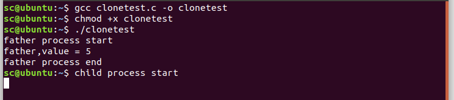

# fork和clone系统调用小实验

## 实验一：

> 使用fork()函数创建一个子进程，然后在父进程和子进程中分别使用printf语句来判断谁是父进程和子进程。

`fork()`函数被调用后会立即创建一个子进程，子进程和父进程同时独立运行互不干扰。

返回值：在父进程中返回一个大于0的数,表示创建的子进程的id；在子进程中返回 0；-1表示创建失败。

程序一：

    ***************************************forktest.c************************************************
    #include<stdio.h>
    #include<unistd.h>
    
    int main(void)
    {
    	pid_t pid = fork();
    	if(pid == 0){
    		    printf("I'm subProcess,my pid = %d,ppid = %d\n", getpid(), getppid());
                   
            }
    	else if(pid > 0){
                    
    	       	printf("I'm parentProcess, my pid = %d, ppid = %d\n", getpid(), getppid());
            }
    	else{
    	       	printf("fork error!\n");
    	}
    	return 0;
    }

结果：  
  
我们在父进程中加入sleep语句，让父进程执行稍微慢一点，再看看效果。

程序二：

    ***************************************forktest.c************************************************
    #include<stdio.h>
    #include<unistd.h>
    
    int main(void)
    {
    	pid_t pid = fork();
    	if(pid == 0){
    		    printf("I'm subProcess,my pid = %d,ppid = %d\n", getpid(), getppid());
                   
            }
    	else if(pid > 0){
                sleep(2);    
    	       	printf("I'm parentProcess, my pid = %d, ppid = %d\n", getpid(), getppid());
            }
    	else{
    	       	printf("fork error!\n");
    	}
    	return 0;
    }

结果：  
  
实验二：

> 使用clone()函数创建一个子进程。如果父进程和子进程共同访问一个全局变量，结果会如何？如果父进程比子进程先消亡，结果会如何？

程序：

    ***************************************clonetest.c***********************************************
    #define _GNU_SOURCE //注意，这个宏必须在最前面，否则编译会报错
    #include <sched.h>
    #include <unistd.h>
    #include <stdio.h>
    #include <sys/types.h>
    #include <sys/select.h>
    #include <stdlib.h>
    
    int value = 0;     //全局变量value
    
    int child_progress(void *arg)  
    {
            printf("child process start\r\n");
            value = 1;
            printf("child,value = %d\r\n",value);
            printf("child process end\r\n");	
    	return 0;
    }
    
    void main(int argc,char *argv[])
    {
    	int ret = -1;
    	char *stack = NULL;
        pid_t tid = 0;
    
        stack = malloc(4096);
    	if(NULL == stack)
    	{
    		printf("malloc fail\r\n");
    		return;
    	}
    	//父子进程共享进程地址空间|父进程在子进程结束后运行
        int mask = CLONE_VM|CLONE_VFORK;
    	
    	ret = clone(child_progress,stack+4096,mask,NULL,NULL,NULL,NULL);
    	if(ret < 0)
    	{
    		printf("clone error\r\n");
    		return;
    	}
    	else
    	{
    	    printf("father process start\r\n");
            value = 5;
            printf("father,value = %d\r\n",value);
            printf("father process end\r\n");
            return;
    	}	
    }

结果：  
  
我们修改下程序，让父进程先执行完退出

    ***************************************clonetest.c***********************************************
    #define _GNU_SOURCE //注意，这个宏必须在最前面，否则编译会报错
    #include <sched.h>
    #include <unistd.h>
    #include <stdio.h>
    #include <sys/types.h>
    #include <sys/select.h>
    #include <stdlib.h>
    
    int value = 0;     //全局变量value
    
    int child_progress(void *arg)  
    {
            sleep(10);
            printf("child process start\r\n");
            value = 1;
            printf("child,value = %d\r\n",value);
            printf("child process end\r\n");	
    	return 0;
    }
    
    void main(int argc,char *argv[])
    {
    	int ret = -1;
    	char *stack = NULL;
        pid_t tid = 0;
    
        stack = malloc(4096);
    	if(NULL == stack)
    	{
    		printf("malloc fail\r\n");
    		return;
    	}
    	//父子进程共享进程地址空间
        int mask = CLONE_VM;
    	
    	ret = clone(child_progress,stack+4096,mask,NULL,NULL,NULL,NULL);
    	if(ret < 0)
    	{
    		printf("clone error\r\n");
    		return;
    	}
    	else
    	{
    	    printf("father process start\r\n");
            value = 5;
            printf("father,value = %d\r\n",value);
            printf("father process end\r\n");
            return;
    	}	
    }

结果：  
  
可以看出子进程无法正常执行。

实验三：

> 请思考，如下代码中会打印几个"\_"？  
> int main（void）  
> {  
> int i;  
> for(i=0;i<2;i++){  
> fork()；  
> printf("\_\\n")；  
> }  
> wait(NULL)；  
> wait(NULL);  
> return 0；  
> }

答案是打印六次，我们可以更改一下程序，更直观地看出六个"\_"是由谁打印的

    #include<stdio.h>
    #include<unistd.h>
    #include<sys/wait.h>
    
    int main(void)
    {
        int i;
        for(i=0;i<2;i++){
        fork();
        printf("pid %d, ppid %d, _\n",getpid(),getppid());
    }
     wait(NULL);
     wait(NULL);
     return 0;
    }

结果：  
  
pid是当前进程号，ppid是当前进程的父进程号。

可以看到，父进程（4992）打印了两次，父进程创建了两个子进程（4993、4994），其中子进程4993打印了两次，4994打印了一次。子进程4993又创建了一个孙子进程4995，孙子进程4995打印了一次。

为什么会这样呢？

**总结一句来说就是，虽然fork创建的子进程与父进程的代码完全一致，但父子进程开始执行的代码位置不同，子进程开始执行的第一条语句是创建它的fork语句的下一条语句。**

我们将循环展开，看一下这几个进程执行的代码段，原因就很明显了：  

## 参考

[fork和clone系统调用小实验_fork clone demo-CSDN博客](https://blog.csdn.net/weixin_51760563/article/details/120391192)