# Ubuntu 20.04使用qemu搭建ARM64 Linux系统

1、安装所需依赖

    $ sudo apt-get install debian-archive-keyring gcc-aarch64-linux-gnu bison flex bc build-essential libncurses* libssl-dev
    $ sudo apt-get install qemu qemu-user-static binfmt-support debootstrap

2、使用debootstrap命令创建文件系统

使用debootstrap制作根文件系统会分成两个阶段。第一阶段是，使用debootstrap命令来下载软件包。

debootstrap命令基本格式：

    $ sudo debootstrap --arch [平台] [发行版本代号] [构建目录] [镜像地址]

> 当前debootstrap支持的发行版本可以在`/usr/share/debootstrap/scripts`查看。

在自己创建的工作目录下执行以下命令：

    $ sudo su
    $ debootstrap --arch=arm64 --foreign buster linux_rootfs http://mirrors.ustc.edu.cn/debian/

-   –arch：指定要制作文件系统的处理器体系结构，比如arm64
-   buster：：指定Debian的版本。buster是Debian 10系统。
-   linux\_rootfs：本地目录，最后制作好的文件系统会在此目录。本实验使用“linux\_rootfs”目录作为根文件系统目录。
-   –foreign：只执行引导的初始解包阶段，仅仅下载和解压
-   http://mirrors.ustc.edu.cn/debian/： 国内debian镜像源地址  
    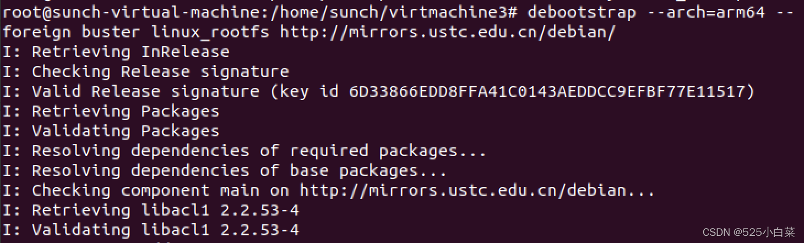  
    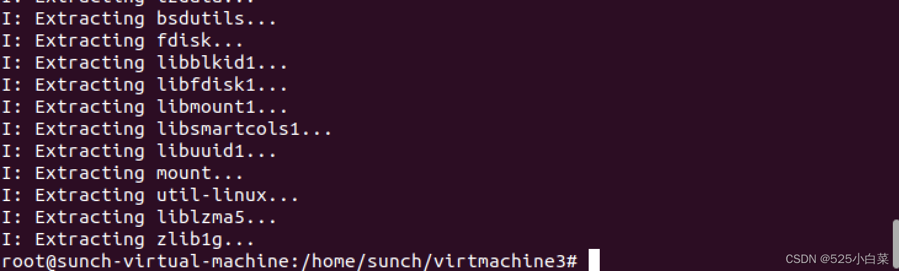

第二阶段，需要安装软件包。

因为主机跑在[x86架构](https://so.csdn.net/so/search?q=x86%E6%9E%B6%E6%9E%84&spm=1001.2101.3001.7020)上，而我们要制作的文件系统是跑在ARM64上，因此可以使用qemu-aarche64-static来模拟成arm64环境的执行环境。

    $ cp /usr/bin/qemu-aarch64-static ./linux_rootfs/usr/bin/

下面使用debootstrap命令进行软件包的安装和配置

    $ chroot linux_rootfs/ debootstrap/debootstrap --second-stage

–second-stage表示执行第二阶段的安装  
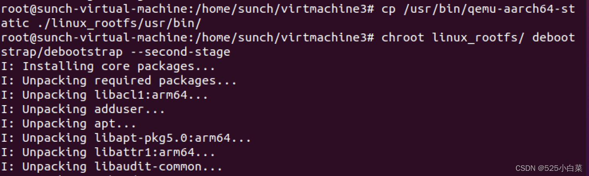  
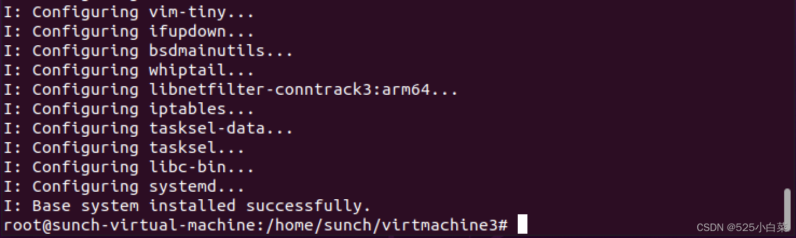

显示“I：Base system installed successfully.”说明第二阶段完成。

使用chroot命令切换到刚才制作的根文件系统

    $ chroot linux_rootfs/

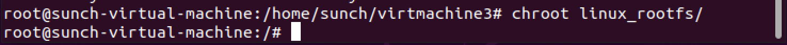

配置root用户密码

    # 先设置root用户的密码
    $ passwd root

添加用户及设置密码

    $ USER= xx  #设置你想要的用户名 
    $ useradd -G sudo -m -s /bin/bash $USER 
    $ passwd $USER

设置主机名

    $ HOST= xxxxx  #设置你想要的主机名
    $ echo $HOST > /etc/hostname

设置网络

    $ echo "auto lo" > /etc/network/interfaces
    $ echo "iface lo inet loopback" >> /etc/network/interfaces
    $ echo "allow-hotplug enp0s1" > /etc/network/interfaces
    $ echo "iface enp0s1 inet dhcp" >> /etc/network/interfaces

按照需求安装一些依赖

    $ apt update
    $ apt install net-tools 

以上全部完成后，我们的根文件系统就制作好了，输入exit退出。

    $ exit

3、制作ext4文件系统

首先使用dd命令来创建一个image文件，bs=1M表示block大小，count=2048，表示该image大小为2GB，读者可以根据主机磁盘空间，适当调整该大小，建议不小于2GB。

    $ dd if=/dev/zero of=linux_rootfs.ext4 bs=1M count=2048

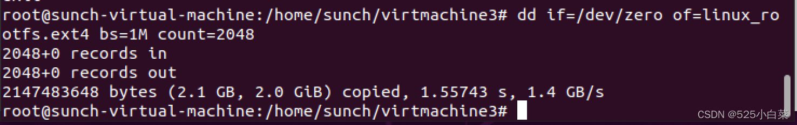  
使用mkfs.ext4命令来格式化

    $ mkfs.ext4 linux_rootfs.ext4

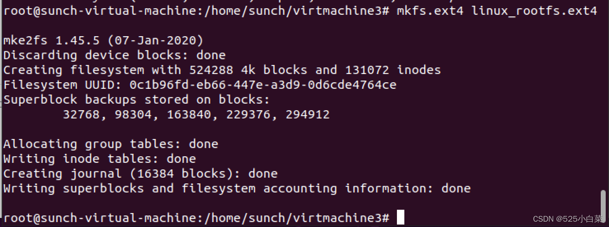  
挂载ext4文件系统并拷贝内容

    $ mkdir -p tmpfs
    $ mount -t ext4 linux_rootfs.ext4 tmpfs/ -o loop
    $ cp -af linux_rootfs/* tmpfs/
    $ umount tmpfs
    $ chmod 777 linux_rootfs.ext4

4、编译Linux内核

在官网(https://mirrors.edge.kernel.org/pub/linux/kernel/v5.x/)下载Linux内核文件，我下载的版本是5.10.87，解压后执行以下命令：

    $ cd linux-5.10.87/
    $ export ARCH=arm64
    $ export CROSS_COMPILE=aarch64-linux-gnu-
    $ make defconfig
    $ make -j4

编译成功会在`linux-5.10.87`目录下生成`vmlinux`，在`arch/arm64/boot/`目录下生成`Image`文件。

5、使用[qemu](https://so.csdn.net/so/search?q=qemu&spm=1001.2101.3001.7020)运行我们刚刚制作的Debian系统

以上步骤执行完毕，工作目录下的文件如图所示：  
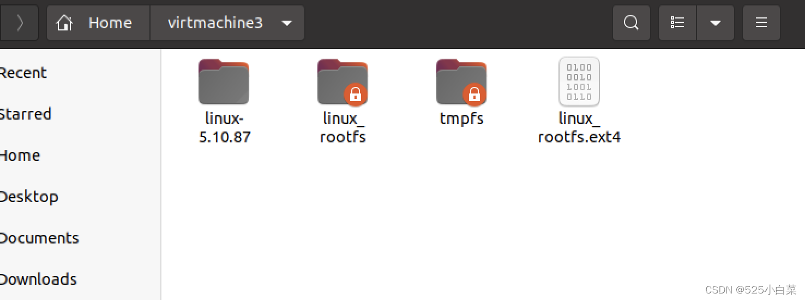

在工作目录下执行：

    $ qemu-system-aarch64 -m 1024 -cpu cortex-a57 -M virt -nographic -smp 4 -kernel linux-5.10.87/arch/arm64/boot/Image -append "noinintrd sched_debug root=/dev/vda rootfstype=ext4 rw crashkernel=256M loglevel=8" -drive if=none,file=linux_rootfs.ext4,id=hd0 -device virtio-blk-device,drive=hd0 

其中，“-drive if=none,file=myrootfs\_arm64.ext4,id=hd0 -device virtio-blk-device,drive=hd0”添加根文件系统支持。  
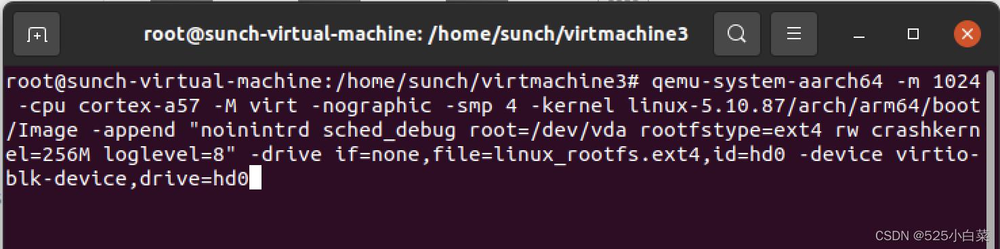

成功进入系统，我们使用root登录  
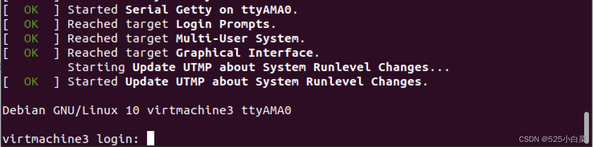  
检查网络链接，正常：  
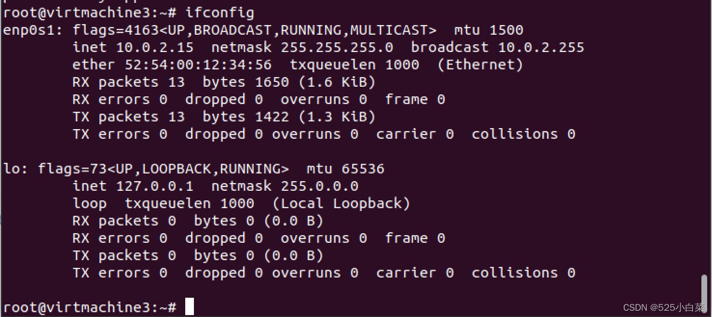  
使用apt可以正常安装一些软件：  
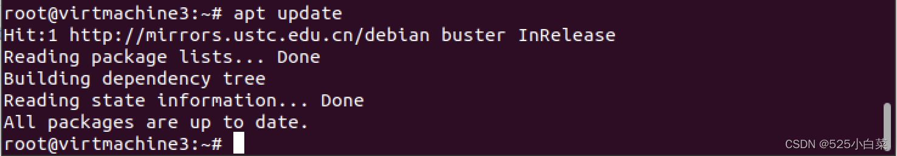  
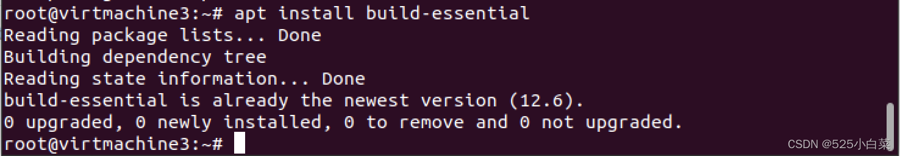

参考链接：  
1、[debootstrap 制作arm64位根文件系统](https://blog.csdn.net/qq_36956154/article/details/100606619)  
2、[debootstrap 制作根文件系统](https://www.cnblogs.com/huaibovip/p/debootstrap-fs.html)  
3、[ubuntu根文件系统构造](https://www.jianshu.com/p/9f51411ca624)  
4、实验指导手册-奔跑吧Linux内核入门篇第二版

## 参考

[Ubuntu 20.04使用qemu搭建ARM64 Linux系统_ubuntu20.04 qemu搭建开发环境arm64-CSDN博客](https://blog.csdn.net/weixin_51760563/article/details/122644569)