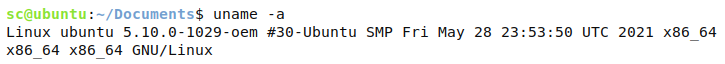

# 优麒麟 20.04 pro更换内核

### 安装环境：

> vware workstation pro 16虚拟机 安装的优麒麟20.04 pro系统  
> 系统镜像名：ubuntukylin-20.04-pro-amd64.iso  
> 内核版本：  
> 

### 1 安装软件依赖包

打开终端运行以下命令：

    sudo apt update
    sudo apt install -y libncurses5-dev libssl-dev libelf-dev build-essential openssl flex bison

### 2 下载最新稳定版本Linux内核源码

内核下载官网：https://mirrors.edge.kernel.org/pub/linux/kernel/

选择稳定版本的压缩包下载到本地，一般为`linux-x.xx.xx.tar.gz` 或 `linux-x.xx.xx.tar.xz`  
我这里选择下载的是`linux-5.9.10.tar.xz`

### 3 内核压缩包解压缩

进入内核压缩包所在目录，右键选择打开终端，运行以下命令：

    xz -d linux-5.9.10.tar.xz
    sudo tar xf linux-5.9.10.tar -C /usr/src

将内核文件解压缩至`/usr/src`目录下

### 4 配置内核

先进入内核文件目录

    cd /usr/src/linux-5.9.10

拷贝已有的配置文件

    sudo cp /boot/config-5.4.0-80-generic .config

注：具体配置文件名根据自己系统中的名字为准（可以通过`cd /boot` 然后`ls`查看系统已有配置文件）

然后通过make menuconfig进行配置

    sudo make menuconfig

弹出配置界面后，直接exit即可

然后对config文件进行修改：

    sudo chmod 777 /usr/src/linux-5.9.10/.config
    vim .config

输入`/CONFIG_SYS_TRUSTED`查找对应选项，然后回车定位  
输入`i`进入输入模式：  
将 CONFIG\_SYS\_TRUSTED\_KEYS 选项中的 debian/canonical-certs.pem 删掉  
  
然后`Esc`退出输入模式，`:wq`保存退出

### 5 开始编译内核

    sudo make -j4

注：-jn参数是表示使用多少个CPU核心来并行编译，具体根据自己的CPU核心数来指定

编译完成后可以进入`/usr/src/linux-5.9.10/arch/x86/boot`目录查看是否有编译好的`bzImage`文件，如果有就说明编译成功。

### 6 安装内核模块

在/usr/src/linux-5.9.10/目录下执行：

    sudo make modules_install

可以进入/lib/modules目录下查看模块安装是否成功

### 7 安装编译好的内核镜像

在/usr/src/linux-5.9.10/目录下执行：

    sudo make install

### 8 修改grub配置

打开grub配置文件

    sudo vim /etc/default/grub

把`GRUB_TIMEOUT_STYLE=hidden`给删除或者注释掉，把`GRUB_CMDLINE_LINUX_DEFAULT`的值修改为`text`。  
将`GRUB_TIMEOUT = 0`修改为`GRUB_TIMEOUT = 30`，保存退出

更新grub配置

    sudo update-grub

### 9 重新启动，选择新内核启动

## 参考

[优麒麟 20.04 pro更换内核_uos内核 麒麟内核 替换-CSDN博客](https://blog.csdn.net/weixin_51760563/article/details/119408113)