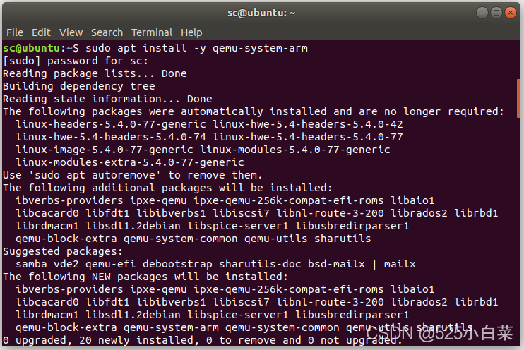
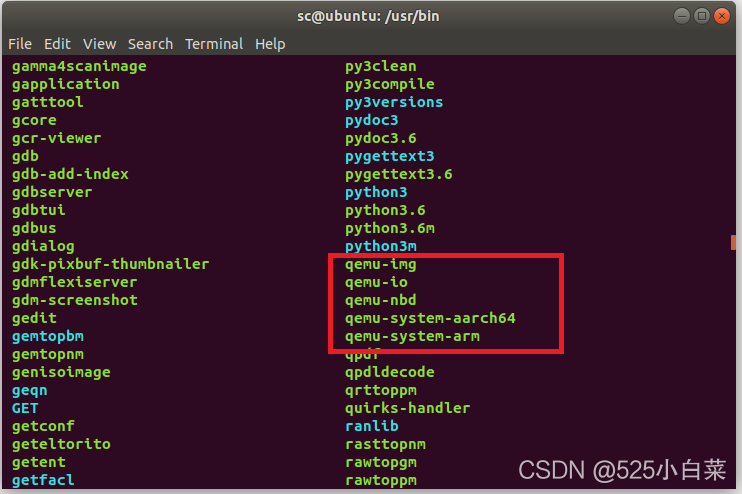
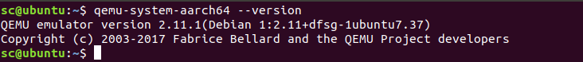
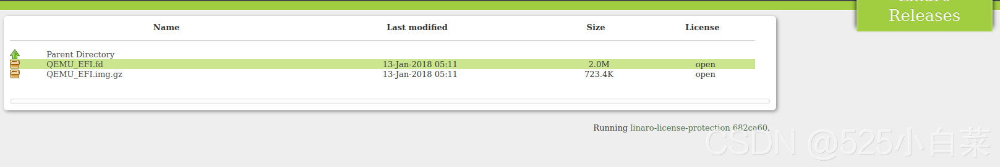
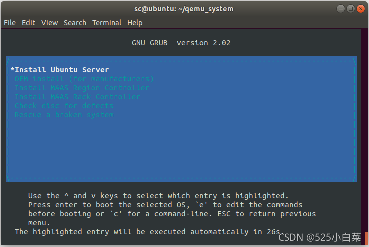
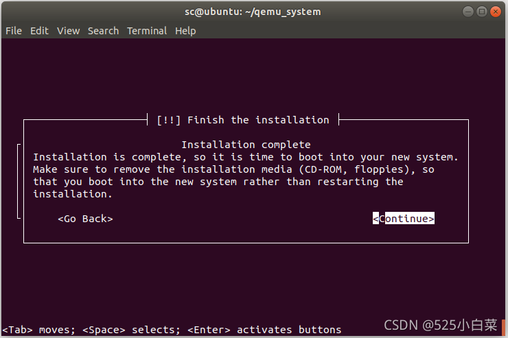
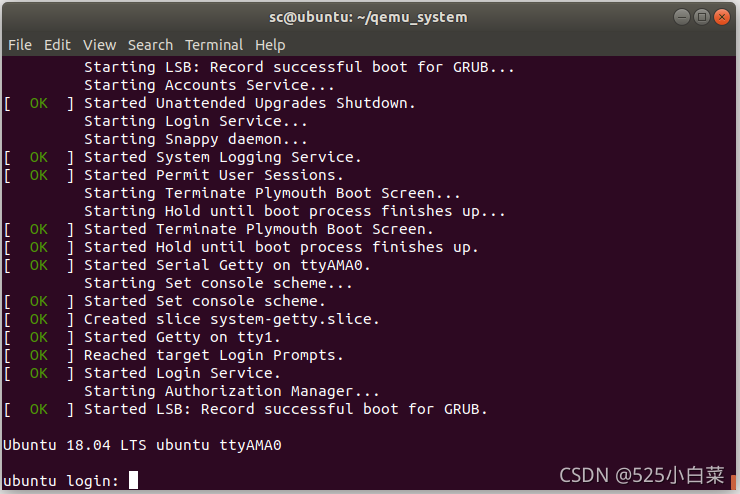
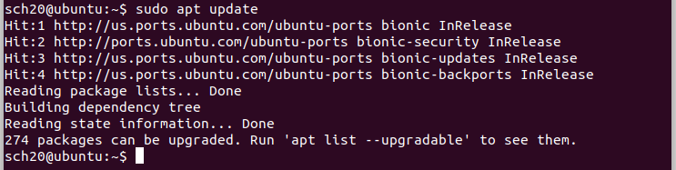
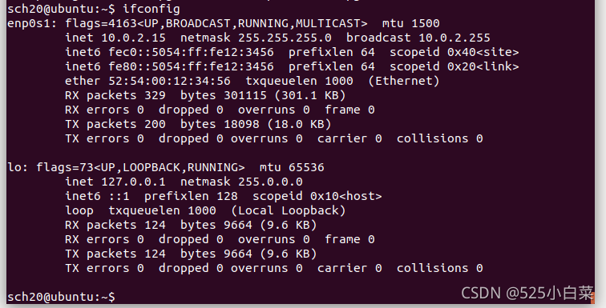
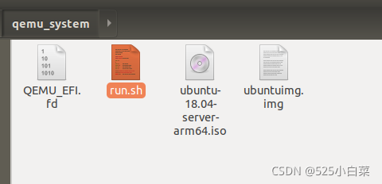

# Ubuntu18.04使用qemu搭建ARM64架构虚拟机(方法一)

> 实验环境：VMware 中安装的 Ubuntu18.04 虚拟机

### 1\. 安装qemu-system-aarch64

直接使用apt命令安装

    sudo apt install -y qemu-system-arm

  
会默认安装到`/usr/bin/`目录下  
  
我安装的qemu版本是2.11  

### 2\. 下载UEFI固件

BIOS运行在16位模式，寻址空间小，运行慢等，所以现在X86、ARM架构等架构都改采用了先进的 UEFI启动方式。因此，我们要想找到引导设备（支持UEFI模式）进一步安装aarch64架构的系统，先要下载对应架构（这里是aarch64）的UEFI固件——`QEMU_EFI.fd`。

(下载地址：http://releases.linaro.org/components/kernel/uefi-linaro/16.02/release/qemu64/QEMU\_EFI.fd)  
  
创建虚拟机工作目录，虚拟机启动所需文件都放在该目录下

    mkdir qemu_system
    cp ~/Downloads/QEMU_EFI.fd  qemu_system

### 3\. 操作系统下载

我下载的是arm64架构的[ubuntu](https://so.csdn.net/so/search?q=ubuntu&spm=1001.2101.3001.7020) 18.04 server\-arm64版：`ubuntu-18.04-server-arm64.iso`。我一开始选择的是20.04版本的Ubuntu server，但是在安装过程中会提示“generating crash report”错误，网上搜索后说是版本问题，应该换18.04的试一试。

下载地址：http://old-releases.ubuntu.com/releases/18.04.3/

下载好后，也放入刚刚创建的`qemu_system`目录下。

### 4\. 创建虚拟硬盘

利用qemu-img指令可以创建1个空的虚拟硬盘，便于后面安装的时候将系统安装到虚拟硬盘上。在`qemu_system`目录下执行如下指令。

    qemu-img create ubuntuimg.img 40G

创建40G大小的镜像，格式为img

### 5\. 虚拟机创建

在`qemu_system`目录下执行如下命令，创建虚拟机：

    qemu-system-aarch64 -m 2048 -cpu cortex-a57 -smp 2 -M virt -bios QEMU_EFI.fd -nographic -drive if=none,file=ubuntu-18.04-server-arm64.iso,id=cdrom,media=cdrom -device virtio-scsi-device -device scsi-cd,drive=cdrom -drive if=none,file=ubuntuimg.img,id=hd0 -device virtio-blk-device,drive=hd0

> \-m megs # 设定虚拟机的RAM大小，单位MB。  
> \-cpu model # 设定CPU模型，如cortex-a57、cortex-a9等。  
> \-smp n # 设定模拟的SMP架构中CPU的个数。  
> \-M machine # 指定要模拟的主机类型  
> \-bios file #设置bios启动文件  
> \-nographic #禁用图形界面支持

关于qemu创建虚拟机的命令行选项说明，详见[qemu官方文档](https://man.archlinux.org/man/qemu.1)

执行上述命令后，会出下如下界面，直接回车选择安装Ubuntu Server。  
  
安装的具体过程可以自行网上搜索，具体就是一些语言、网络、所在时区、登录名、登录密码的设置等等。安装完成后就可以看到提示登录的命令了。  
  
  
上面在创建虚拟机时，并没有设置网络，qemu虚拟机默认使用NAT方式与主机进行网络连接。登录之后，虚拟机是可以连接网络的。  
  

### 6\. 编写虚拟机启动脚本，方便下次启动虚拟机

在`qemu_system`目录下新建`run.sh`文件，编写以下脚本

    qemu-system-aarch64 -m 2048 -cpu cortex-a57 -smp 2 -M virt -bios QEMU_EFI.fd -nographic  -device virtio-scsi-device -drive if=none,file=ubuntuimg.img,format=raw,index=0,id=hd0 -device virtio-blk-device,drive=hd0

下次启动虚拟机，就可以直接运行`./run.sh`来启动创建好的虚拟机。

————————————————  
参考链接：  
1、https://blog.csdn.net/whb19881207/article/details/102456179  
2、https://blog.csdn.net/zhongbeida\_xue/article/details/117790606

### 参考

[Ubuntu18.04使用qemu搭建ARM64架构虚拟机(方法一)_generating crash report-CSDN博客](https://blog.csdn.net/weixin_51760563/article/details/119935101)