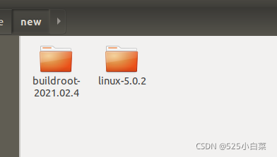

# Ubuntu18.04使用qemu搭建ARM64架构虚拟机(方法二)

> 实验环境 VMware 中安装的[Ubuntu](https://so.csdn.net/so/search?q=Ubuntu&spm=1001.2101.3001.7020) 18.04

### 1\. 安装环境准备

1、安装必要的软件包

    sudo apt update
    sudo apt install flex bison libssl-dev build-essential libncurses5-dev qemu-system-arm gcc-aarch64-linux-gnu vim 

2、下载buildroot工具

使用 busybox 构建文件系统的时候，busybox 仅仅只是帮我们构建好了一些常用的命令和文件，像 lib 库、/etc目录下的一些文件都需要我们自己手动创建，而且 busybox构建的根文件系统默认没有用户名和密码设置。buildroot 比 busybox 更上一层楼，buildroot不仅集成了busybox，而且还集成了各种常见的第三方库和软件，需要什么就选择什么，buildroot 极大的方便了我们嵌入式Linux开发人员构建实用的根文件系统。

下载网址：https://buildroot.org/download.html  
  
3、下载Linux内核

下载网址：https://mirrors.edge.kernel.org/pub/linux/kernel/v5.x/

我这里选择下载的是`linux-5.0.2.tar.gz`

4、创建一个工程目录`new`(名字随意)，将解压好的buildroot和Linux内核都放在里面。  

### 2\. 编译根文件系统

    cd buildroot-2021.02.4
    make menuconfig

在弹出的配置界面中，设置：

-    Target option —> Target Architecture为AArch64 (little endian)
-    Toolchain —> Toolchain type为External toolchain
-    System configuration —> Enable root login with password开启  
    System configuration —>Root password 设置你的密码  
    System configuration —>Run a getty (login prompt) after boot —> TTY port的值为ttyAMA0
-    Target packages —> Show packages that are also provided by busybox开启  
    Target packages —> Debugging, profiling and benchmark —> strace开启
-    Filesystem images —> cpio the root filesystem开启

在配置完成之后，执行

    make

编译成功后，目录`buildroot-2021.02.4/output/images`下面会生成`rootfs.cpio`。  

### 3\. 编译内核

回到`new`目录下，执行：

    cd linux-5.0.2
    ARCH=arm64 CROSS_COMPILE=aarch64-linux-gnu- make defconfig
    vim .config

编辑选项 ：

-    CONFIG\_CMDLINE=“console=ttyAMA0”
-    CONFIG\_INITRAMFS\_SOURCE=“XXX/new/buildroot-2021.02.4/output/images/rootfs.cpio”(注意这里XXX要设置为你自己的路径)
-    CONFIG\_DEBUG\_INFO=y

配置结束后，执行以下命令

    ARCH=arm64 CROSS_COMPILE=aarch64-linux-gnu- make -j4

内核编译成功后，在`linux-5.0.2/`目录下会生成`vmlinux`以及在`linux-5.0.2/arch/arm64/boot/`目录下会生成`Image`。

### 4\. 创建虚拟机

在linux-5.0.2目录下，执行以下命令创建虚拟机。(创建好后，下次启动虚拟机依然使用这条命令)

    qemu-system-aarch64 -machine virt -cpu cortex-a57 -machine type=virt -nographic -smp 1  -m 2048 -kernel ./arch/arm64/boot/Image -append "console=ttyAMA0" $1 $2

然后就会提示我们登录：

  
用户名为`root`  
密码就是你之前设置的密码。

——————————————  
参考链接：  
1、https://blog.csdn.net/qq\_38113006/article/details/105918961  
2、https://www.cnblogs.com/sun-ye/p/14992084.html

## 参考

[Ubuntu18.04使用qemu搭建ARM64架构虚拟机(方法二)_ubuntu qemu arm img-CSDN博客](https://blog.csdn.net/weixin_51760563/article/details/119956676)