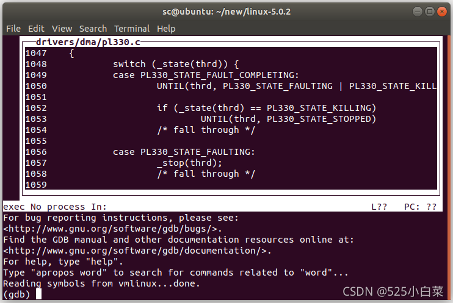

# GDB+QEMU调试Linux内核

## 1\. 使用qemu创建虚拟机

使用qemu创建ARM64架构虚拟机可以参考我的另一篇博客：[Ubuntu18.04使用qemu搭建ARM64架构虚拟机（二）](https://blog.csdn.net/weixin_51760563/article/details/119956676)

## 2\. 安装gdb-multiarch工具包

    sudo apt install gdb-multiarch

## 3\. 运行qemu虚拟机

进入[linux](https://so.csdn.net/so/search?q=linux&spm=1001.2101.3001.7020)\-5.0.2目录，运行如下命令：

    qemu-system-aarch64 -machine virt -cpu cortex-a57 -machine type=virt -nographic -smp 1  -m 2048 -kernel ./arch/arm64/boot/Image -append "console=ttyAMA0 sched_debug" $1 $2 -S -s

和直接启动qemu虚拟机的区别主要是：

-    向内核传递的参数中添加了sched\_debug
-    -S 表示QEMU虚拟机会冻结CPU，直到远程的GDB输入相应的控制命令。
-    -s 表示在1234端口接收GDB调试连接。

运行命令后，光标会停在下一行闪烁，等待我们启动GDB调试。

## 4\. 启动GDB

接下来，也是在linux-5.0.2目录下打开另一个终端，运行如下命令：

    gdb-multiarch --tui vmlinux

  
按`r`，回车。  
  
然后输入：

    (gdb) set architecture aarch64
    (gdb) target remote localhost:1234

设置AArch64架构，通过远程端口连接到QEMU虚拟机。

  
然后就可以使用 GDB 命令调试内核了。

## 5\. 开始调试内核

我们先在start\_kernel处设置一个断点，然后使用c命令开始运行。

  
此时就会在start\_kernel函数处停止，等待我们继续输入调试命令

  
按c继续执行，内核就会接着运行。我们发现在qemu虚拟机终端，虚拟机成功启动，显示登录命令。

## 参考

[GDB+QEMU调试Linux内核_gdb-multiarch-CSDN博客](https://blog.csdn.net/weixin_51760563/article/details/119974362)