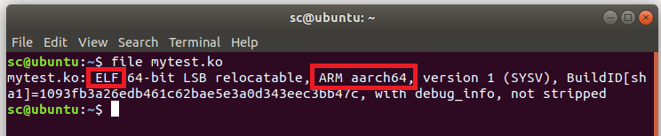
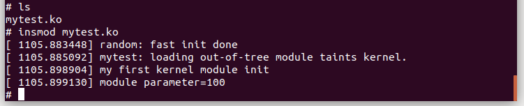

本实验在x86环境中[交叉编译](https://so.csdn.net/so/search?q=%E4%BA%A4%E5%8F%89%E7%BC%96%E8%AF%91&spm=1001.2101.3001.7020)ARM64架构模块，然后qemu启动ARM64架构虚拟机，加载该模块运行。

## 1\. 创建ARM64虚拟机

详见：[Ubuntu18.04使用qemu搭建ARM64架构虚拟机（二）](https://blog.csdn.net/weixin_51760563/article/details/119956676)

## 2\. 设置主机与qemu虚拟机共享文件

1、qemu 启动参数最后面需要添加 :

    -fsdev local,security_model=passthrough,id=fsdev0,path=./share -device virtio-9p-pci,id=fs0,fsdev=fsdev0,mount_tag=hostshare

其中 path 为主机本地的共享目录（全局路径为：`/home/XXX/new/linux-5.0.2/share`）

2、启动qemu虚拟机，在虚拟机中创建共享目录，并与主机连接

    mkdir /tmp/sharefiles

其中`/tmp/sharefiles`为qemu虚拟机中创建的共享目录，你可以自行创建你想要的目录。接下来将刚刚创建的目录与主机共享目录链接：

    mount -t 9p -o trans=virtio,version=9p2000.L hostshare /tmp/sharefiles

3、验证  
现在在主机的`/home/XXX/new/linux-5.0.2/share`目录中新建一个`test.txt`，然后查看虚拟机中的`/tmp/sharefiles`目录下是否有test.txt文件。如果有说明共享目录创建成功。

## 3\. 在x86主机上交叉编译内核模块

需要重写Makefile文件：

    KERNELPATH ?= /home/XXX/new/linux-5.0.2
    
    mytest-objs := my_test.o
    obj-m  := mytest.o
    
    all : 
          $(MAKE) -C $(KERNELPATH) M=$(PWD) modules;
    
    clean:
          $(MAKE) -C $(KERNELPATH) M=$(PWD) clean;
          rm -f *.ko;

与在本地编译本地加载的模块的Makefile的不同就是第1行的`KERNELPATH`需要指定到编译linux-5.0.2的内核目录，并且该内核目录需要提前编译完成。（`KERNELPATH`只是个变量名，你可以换成其他的）

`my_test`是你的内核模块源码文件名，`mytest`时内核模块名。注意根据实际情况替换成你自己的。

准备好Makefile和内核模块源文件（比如`my_test.c`）后，依次执行以下命令：

    export ARCH=arm64
    export CROSS_COMPILE=aarch64-linux-gnu-
    export BASEINCLUDE=/home/XXX/new/linux-5.0.2
    make

编译完成之后就看到`mytest.ko`文件。用`file`命令检查编译的结果是否为ARM64架构的格式，只要能看到变成aarch64架构的ELF文件，就说明编译成功了。

## 4\. 传递内核模块

将交叉编译好的内核模块通过上面创建的共享目录，传递给qemu虚拟机。

即将`mytest.ko`文件复制到主机`/home/XXX/new/linux-5.0.2/share`目录下。

## 5\. 启动qemu虚拟机，进入共享目录，加载模块

    cd /tmp/sharefiles
    insmod mytest.ko

  
可以看到模块加载完成，实现了模块代码中定义的打印`my first kernel module init`、`module parameter=100`信息。

————————————  
参考链接：  
1、https://zhuanlan.zhihu.com/p/359573010

## 参考

[交叉编译内核模块-CSDN博客](https://blog.csdn.net/weixin_51760563/article/details/119982781)