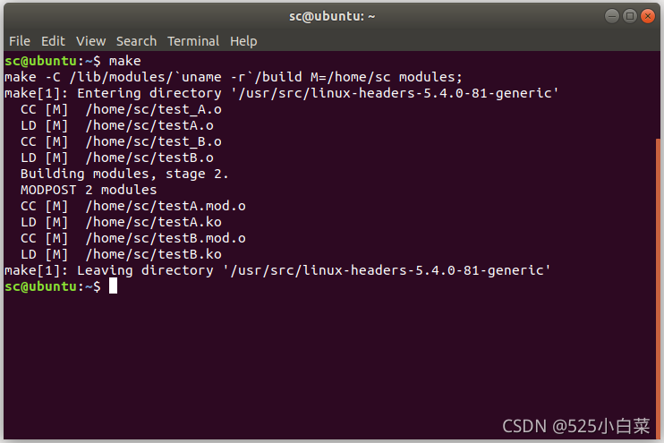
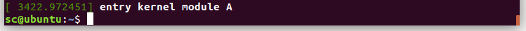
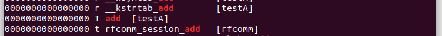
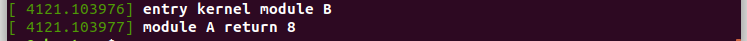
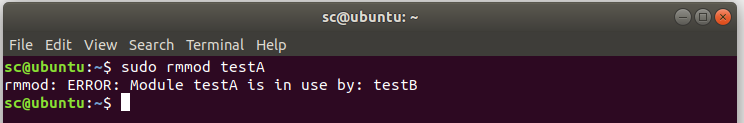
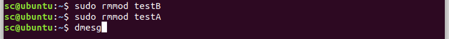
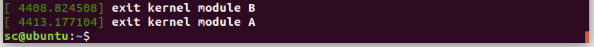

# Linux内核模块相互调用

编写一个内核模块A，通过导出模块符号的方式来实现接口函数。编写另一个内核模块B，调用内核模块A暴露出来的接口函数。

### 1\. 源文件

##### 内核模块A（test\_A.c）

    #include <linux/init.h>
    #include <linux/module.h>
     
    static int __init my_test_init(void)
    {
         printk("entry kernel module A\n");
         return 0;
    }
      
    int add(int a,int b)		//自己定义的加法函数
    {
         return a+b;
    }
    
    static void __exit my_test_exit(void)
    {
         printk("exit kernel module A\n");
    }
     
    module_init(my_test_init);
    module_exit(my_test_exit);
    
    EXPORT_SYMBOL(add);			//导出符号
    
    MODULE_LICENSE("GPL");
    MODULE_AUTHOR("rlk");
    MODULE_DESCRIPTION("my test kernel module");
    MODULE_ALIAS("mytestA");

##### 内核模块B（test\_B.c）

    #include <linux/init.h>
    #include <linux/module.h>
     
    extern int add(int a,int b);		//外部声明
    
    static int __init my_test_init(void)
    {
         int c=0;						     
         c=add(1,7);    				//调用模块A的add函数
         printk("entry kernel module B\n");
         printk("module A return %d\n",c);
         return 0;
    }
      
    static void __exit my_test_exit(void)
    {
         printk("exit kernel module B\n");
    }
     
    module_init(my_test_init);
    module_exit(my_test_exit);
    
    MODULE_LICENSE("GPL");
    MODULE_AUTHOR("rlk");
    MODULE_DESCRIPTION("my test kernel module");
    MODULE_ALIAS("mytestB");

##### Makefile文件

    BASEINCLUDE ?= /lib/modules/`uname -r`/build
    
    obj-m += testA.o
    testA-objs := test_A.o
    
    obj-m += testB.o
    testB-objs := test_B.o
    
    all : 
            $(MAKE) -C $(BASEINCLUDE) M=$(PWD) modules;
    
    clean:
            $(MAKE) -C $(BASEINCLUDE) M=$(PWD) clean;
            rm -f *.ko;                           

### 2\. 编译模块

将三个文件保存在同一目录下

  
在该目录中执行`make`指令。  
  
会在当前目录下分别生成`testA.ko`和`testB.ko`

### 3\. 加载模块A、B

执行：

    sudo insmod testA.ko

通过`dmesg`查看，模块A已成功被加载  
  
可以查看内核的符号表，是否有我们导出的`add`

    cat  /proc/kallsyms | grep add

  
接下来，添加模块B

    sudo insmod testB.ko

通过`dmesg`查看，模块B已成功被加载，且成功调用了模块A的add函数。

### 4\. 卸载模块A、B

因为模块A被模块B调用，所以直接先卸载模块A，会出现：

  
所以要先卸载模块B，再卸载模块A。  
  

## 参考

[Linux内核模块相互调用-CSDN博客](https://blog.csdn.net/weixin_51760563/article/details/119983971)