#### 步骤

-   -   [一、安装vim8](https://blog.csdn.net/weixin_45437140/article/details/112353826?ops_request_misc=%257B%2522request%255Fid%2522%253A%25226C4351F0-AB1A-4B2E-8834-F8C683CBD9C9%2522%252C%2522scm%2522%253A%252220140713.130102334.pc%255Fall.%2522%257D&request_id=6C4351F0-AB1A-4B2E-8834-F8C683CBD9C9&biz_id=0&utm_medium=distribute.pc_search_result.none-task-blog-2~all~first_rank_ecpm_v1~rank_v31_ecpm-1-112353826-null-null.142^v100^pc_search_result_base5&utm_term=%E6%8A%8Avim%E6%89%93%E9%80%A0%E6%88%90%E4%B8%80%E4%B8%AA%E5%BC%BA%E5%A4%A7&spm=1018.2226.3001.4187#vim8_5)
    -   [二、安装插件管理工具与相关插件](https://blog.csdn.net/weixin_45437140/article/details/112353826?ops_request_misc=%257B%2522request%255Fid%2522%253A%25226C4351F0-AB1A-4B2E-8834-F8C683CBD9C9%2522%252C%2522scm%2522%253A%252220140713.130102334.pc%255Fall.%2522%257D&request_id=6C4351F0-AB1A-4B2E-8834-F8C683CBD9C9&biz_id=0&utm_medium=distribute.pc_search_result.none-task-blog-2~all~first_rank_ecpm_v1~rank_v31_ecpm-1-112353826-null-null.142^v100^pc_search_result_base5&utm_term=%E6%8A%8Avim%E6%89%93%E9%80%A0%E6%88%90%E4%B8%80%E4%B8%AA%E5%BC%BA%E5%A4%A7&spm=1018.2226.3001.4187#_23)
    -   -   [1、插件管理工具 Vundle](https://blog.csdn.net/weixin_45437140/article/details/112353826?ops_request_misc=%257B%2522request%255Fid%2522%253A%25226C4351F0-AB1A-4B2E-8834-F8C683CBD9C9%2522%252C%2522scm%2522%253A%252220140713.130102334.pc%255Fall.%2522%257D&request_id=6C4351F0-AB1A-4B2E-8834-F8C683CBD9C9&biz_id=0&utm_medium=distribute.pc_search_result.none-task-blog-2~all~first_rank_ecpm_v1~rank_v31_ecpm-1-112353826-null-null.142^v100^pc_search_result_base5&utm_term=%E6%8A%8Avim%E6%89%93%E9%80%A0%E6%88%90%E4%B8%80%E4%B8%AA%E5%BC%BA%E5%A4%A7&spm=1018.2226.3001.4187#1_Vundle_25)
        -   [2、ctags 工具及辅助软件 taglist](https://blog.csdn.net/weixin_45437140/article/details/112353826?ops_request_misc=%257B%2522request%255Fid%2522%253A%25226C4351F0-AB1A-4B2E-8834-F8C683CBD9C9%2522%252C%2522scm%2522%253A%252220140713.130102334.pc%255Fall.%2522%257D&request_id=6C4351F0-AB1A-4B2E-8834-F8C683CBD9C9&biz_id=0&utm_medium=distribute.pc_search_result.none-task-blog-2~all~first_rank_ecpm_v1~rank_v31_ecpm-1-112353826-null-null.142^v100^pc_search_result_base5&utm_term=%E6%8A%8Avim%E6%89%93%E9%80%A0%E6%88%90%E4%B8%80%E4%B8%AA%E5%BC%BA%E5%A4%A7&spm=1018.2226.3001.4187#2ctags__taglist_57)
        -   -   [1）ctags 工具](https://blog.csdn.net/weixin_45437140/article/details/112353826?ops_request_misc=%257B%2522request%255Fid%2522%253A%25226C4351F0-AB1A-4B2E-8834-F8C683CBD9C9%2522%252C%2522scm%2522%253A%252220140713.130102334.pc%255Fall.%2522%257D&request_id=6C4351F0-AB1A-4B2E-8834-F8C683CBD9C9&biz_id=0&utm_medium=distribute.pc_search_result.none-task-blog-2~all~first_rank_ecpm_v1~rank_v31_ecpm-1-112353826-null-null.142^v100^pc_search_result_base5&utm_term=%E6%8A%8Avim%E6%89%93%E9%80%A0%E6%88%90%E4%B8%80%E4%B8%AA%E5%BC%BA%E5%A4%A7&spm=1018.2226.3001.4187#1ctags__60)
            -   [2）辅助软件 taglist（无需安装，后面的Tabbar 插件功能更全面）](https://blog.csdn.net/weixin_45437140/article/details/112353826?ops_request_misc=%257B%2522request%255Fid%2522%253A%25226C4351F0-AB1A-4B2E-8834-F8C683CBD9C9%2522%252C%2522scm%2522%253A%252220140713.130102334.pc%255Fall.%2522%257D&request_id=6C4351F0-AB1A-4B2E-8834-F8C683CBD9C9&biz_id=0&utm_medium=distribute.pc_search_result.none-task-blog-2~all~first_rank_ecpm_v1~rank_v31_ecpm-1-112353826-null-null.142^v100^pc_search_result_base5&utm_term=%E6%8A%8Avim%E6%89%93%E9%80%A0%E6%88%90%E4%B8%80%E4%B8%AA%E5%BC%BA%E5%A4%A7&spm=1018.2226.3001.4187#2_taglistTabbar__94)
        -   [3、cscope 工具](https://blog.csdn.net/weixin_45437140/article/details/112353826?ops_request_misc=%257B%2522request%255Fid%2522%253A%25226C4351F0-AB1A-4B2E-8834-F8C683CBD9C9%2522%252C%2522scm%2522%253A%252220140713.130102334.pc%255Fall.%2522%257D&request_id=6C4351F0-AB1A-4B2E-8834-F8C683CBD9C9&biz_id=0&utm_medium=distribute.pc_search_result.none-task-blog-2~all~first_rank_ecpm_v1~rank_v31_ecpm-1-112353826-null-null.142^v100^pc_search_result_base5&utm_term=%E6%8A%8Avim%E6%89%93%E9%80%A0%E6%88%90%E4%B8%80%E4%B8%AA%E5%BC%BA%E5%A4%A7&spm=1018.2226.3001.4187#3cscope__128)
        -   [4、Tabbar 插件](https://blog.csdn.net/weixin_45437140/article/details/112353826?ops_request_misc=%257B%2522request%255Fid%2522%253A%25226C4351F0-AB1A-4B2E-8834-F8C683CBD9C9%2522%252C%2522scm%2522%253A%252220140713.130102334.pc%255Fall.%2522%257D&request_id=6C4351F0-AB1A-4B2E-8834-F8C683CBD9C9&biz_id=0&utm_medium=distribute.pc_search_result.none-task-blog-2~all~first_rank_ecpm_v1~rank_v31_ecpm-1-112353826-null-null.142^v100^pc_search_result_base5&utm_term=%E6%8A%8Avim%E6%89%93%E9%80%A0%E6%88%90%E4%B8%80%E4%B8%AA%E5%BC%BA%E5%A4%A7&spm=1018.2226.3001.4187#4Tabbar__154)
        -   [5、文件浏览插件 NerdTree](https://blog.csdn.net/weixin_45437140/article/details/112353826?ops_request_misc=%257B%2522request%255Fid%2522%253A%25226C4351F0-AB1A-4B2E-8834-F8C683CBD9C9%2522%252C%2522scm%2522%253A%252220140713.130102334.pc%255Fall.%2522%257D&request_id=6C4351F0-AB1A-4B2E-8834-F8C683CBD9C9&biz_id=0&utm_medium=distribute.pc_search_result.none-task-blog-2~all~first_rank_ecpm_v1~rank_v31_ecpm-1-112353826-null-null.142^v100^pc_search_result_base5&utm_term=%E6%8A%8Avim%E6%89%93%E9%80%A0%E6%88%90%E4%B8%80%E4%B8%AA%E5%BC%BA%E5%A4%A7&spm=1018.2226.3001.4187#5_NerdTree_178)
        -   [6、动态语法检测工具ALE](https://blog.csdn.net/weixin_45437140/article/details/112353826?ops_request_misc=%257B%2522request%255Fid%2522%253A%25226C4351F0-AB1A-4B2E-8834-F8C683CBD9C9%2522%252C%2522scm%2522%253A%252220140713.130102334.pc%255Fall.%2522%257D&request_id=6C4351F0-AB1A-4B2E-8834-F8C683CBD9C9&biz_id=0&utm_medium=distribute.pc_search_result.none-task-blog-2~all~first_rank_ecpm_v1~rank_v31_ecpm-1-112353826-null-null.142^v100^pc_search_result_base5&utm_term=%E6%8A%8Avim%E6%89%93%E9%80%A0%E6%88%90%E4%B8%80%E4%B8%AA%E5%BC%BA%E5%A4%A7&spm=1018.2226.3001.4187#6ALE_204)
        -   [7、自动补全插件 YouCompleteMe](https://blog.csdn.net/weixin_45437140/article/details/112353826?ops_request_misc=%257B%2522request%255Fid%2522%253A%25226C4351F0-AB1A-4B2E-8834-F8C683CBD9C9%2522%252C%2522scm%2522%253A%252220140713.130102334.pc%255Fall.%2522%257D&request_id=6C4351F0-AB1A-4B2E-8834-F8C683CBD9C9&biz_id=0&utm_medium=distribute.pc_search_result.none-task-blog-2~all~first_rank_ecpm_v1~rank_v31_ecpm-1-112353826-null-null.142^v100^pc_search_result_base5&utm_term=%E6%8A%8Avim%E6%89%93%E9%80%A0%E6%88%90%E4%B8%80%E4%B8%AA%E5%BC%BA%E5%A4%A7&spm=1018.2226.3001.4187#7_YouCompleteMe_233)
        -   [8、自动索引 Vim-gutentags 插件](https://blog.csdn.net/weixin_45437140/article/details/112353826?ops_request_misc=%257B%2522request%255Fid%2522%253A%25226C4351F0-AB1A-4B2E-8834-F8C683CBD9C9%2522%252C%2522scm%2522%253A%252220140713.130102334.pc%255Fall.%2522%257D&request_id=6C4351F0-AB1A-4B2E-8834-F8C683CBD9C9&biz_id=0&utm_medium=distribute.pc_search_result.none-task-blog-2~all~first_rank_ecpm_v1~rank_v31_ecpm-1-112353826-null-null.142^v100^pc_search_result_base5&utm_term=%E6%8A%8Avim%E6%89%93%E9%80%A0%E6%88%90%E4%B8%80%E4%B8%AA%E5%BC%BA%E5%A4%A7&spm=1018.2226.3001.4187#8_Vimgutentags__278)
    -   [三、常用 vim 插件配置](https://blog.csdn.net/weixin_45437140/article/details/112353826?ops_request_misc=%257B%2522request%255Fid%2522%253A%25226C4351F0-AB1A-4B2E-8834-F8C683CBD9C9%2522%252C%2522scm%2522%253A%252220140713.130102334.pc%255Fall.%2522%257D&request_id=6C4351F0-AB1A-4B2E-8834-F8C683CBD9C9&biz_id=0&utm_medium=distribute.pc_search_result.none-task-blog-2~all~first_rank_ecpm_v1~rank_v31_ecpm-1-112353826-null-null.142^v100^pc_search_result_base5&utm_term=%E6%8A%8Avim%E6%89%93%E9%80%A0%E6%88%90%E4%B8%80%E4%B8%AA%E5%BC%BA%E5%A4%A7&spm=1018.2226.3001.4187#_vim__315)

**采用的系统硬件都得环境  
（1）操作系统：ubuntu16.04  
（2）vim版本：vim8**

### 一、安装vim8

由于后面的Vim有些插件对于Vim版本有要求，而且Vim 8.0版本拥有很多新特性，因此最好安装Vim 8版本。

    sudo add-apt-repository ppa:jonathonf/vim	#增加PPA
    sudo apt update 		#更新apt
    sudo apt install vim  	#安装vim8

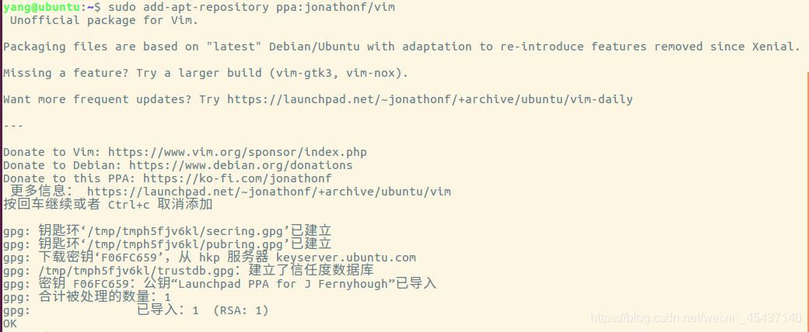  
安装完成后查看 Vim 版本：  

附录：（卸载Vim 8）

    sudo apt install ppa-purge && sudo ppa-purge ppa:jonathonf/vim

### 二、安装插件管理工具与相关插件

#### 1、插件管理工具 Vundle

Vim 支持很多插件，现在 Vim 社区有很多个插件管理工具，其中 Vundle 就是其中很出色的一个，它可以在 .vimrc 中跟踪、管理和自动更新插件等。

1、安装 Vundle 需要使用 git 工具，使用如下指令来下载 Vundle 工具：

    sudo apt-get install git	#安装 git 工具
    git clone https://github.com/VundleVim/Vundle.vim.git ~/.vim/bundle/Vundle.vim	#下载 Vundle 工具

2、接下来需要在 home 主目录下的 .vimrc 配置文件中配置 Vundle，如下操作：  
<.vimrc 文件中添加如下配置>

    " Vundle manage
    set nocompatible              " be iMproved, required
    filetype off                  " required
    
    " set the runtime path to include Vundle and initialize
    set rtp+=~/.vim/bundle/Vundle.vim
    call vundle#begin()
    
    " let Vundle manage Vundle, required
    Plugin 'VundleVim/Vundle.vim'
    
    " All of your Plugins must be added before the following line
    call vundle#end()            " required
    filetype plugin indent on    " required

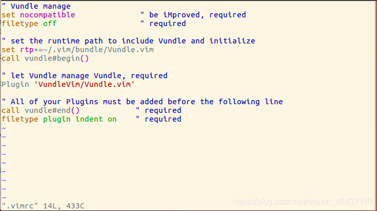  
只需要在该配置文件中添加 “`Plugin xxx`”，即安装名为 “xxx” 的插件。  
接下来就是在线安装插件，启动 Vim，然后运行命令 “`:PluginInstall`”，就会从网络上下载插件并安装，如下所示：  
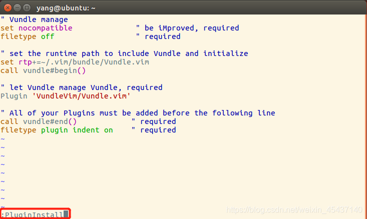  
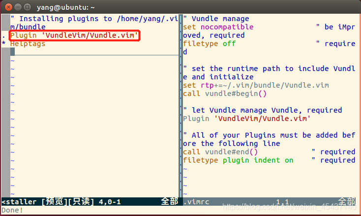

#### 2、ctags 工具及辅助软件 taglist

ctags工具全称Generate tag files for source code。扫描指定的源文件，找出其中包含的语法元素，并把找到的相关的内容记录下来，这样在代码浏览和查找时就可以利用这些记录实现查找和跳转的功能。

##### 1）ctags 工具

**1、安装 ctags 工具**

    sudo apt-get install ctags

**2、建立索引文件**  
在想要建立索引文件的文件夹目录下执行：

    sudo ctags -R *

然后会发现当前目录下生成了一个索引文件：`tags`  
  
**3、在 `.vimrc` 配置文件中添加生成的索引文件（注意路径）**

    " ctags
    set tags=/mnt/hgfs/ubuntu_share/tags

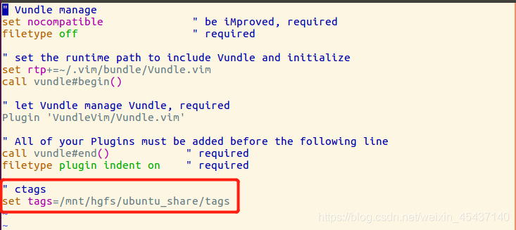  
4、ctags 常用的快捷键：

快捷键

用法

ctrl + \]

跳转至光标所在对象定义之处

ctrl +t

返回跳转前位置

注意：如果不设置索引文件位置，然后执行 ctrl+\] 则会出现错误：  
E433: 没有 tag 文件  
E426: 找不到 tag: XXXXX

##### 2）辅助软件 taglist（无需安装，后面的Tabbar 插件功能更全面）

安装taglist前，一定要安装ctags

1、taglist下载地址（[https://www.vim.org/scripts/script.php?script\_id=273](https://www.vim.org/scripts/script.php?script_id=273)）

2、下载好后直接将其放在 `.vim/` 目录下解压即可：

    unzip  taglist_46.zip

3、直接使用：

使用vim打开一个文件，然后`在命令模式下输入Tlist`，可以看到如下的界面。  
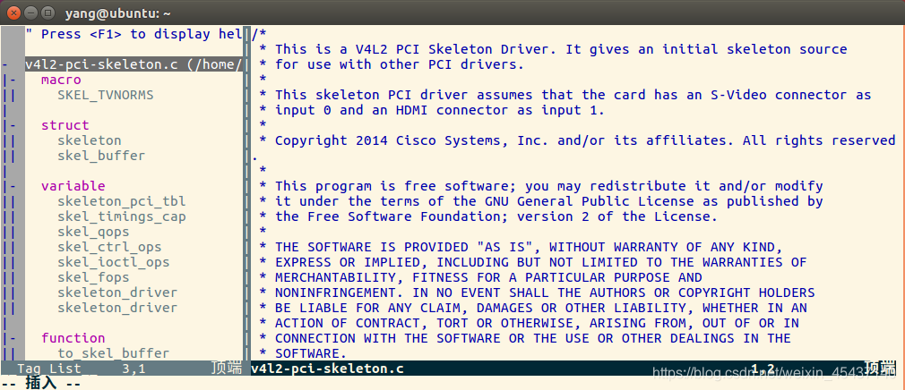  
关闭界面，同样是`在命令模式下输入Tlist`。  
`ctrl+ww` 切换左右窗口。

4、在 .vimrc 脚本下可以添加相应设置：

    " 启动vim后自动打开taglist窗口
    let Tlist_Auto_Open = 1
     
    " 不同时显示多个文件的tag，仅显示一个
    let Tlist_Show_One_File = 1
     
    " taglist窗口显示在右侧，缺省为左侧
    let Tlist_Use_Right_Window =1
    
    " 设置taglist窗口大小
    let Tlist_WinHeight = 100
    let Tlist_WinWidth = 40

#### 3、cscope 工具

cscope 是 vim 适用的工具和插件，通过 cscope 可以方便的获取某个函数的定义以及被哪些函数调用。

1、cscope 安装

    sudo apt-get install cscope

2、cscope 使用  
注：在使用 cscope 之前需要对源代码生成索引库。

1）生成 cscope 索引文件

    cscope -Rbq

上述的命令会生成3个文件：cscope.in.out ，cscope.out ，cscope.po.out。其中 cscope.out 是基本符合的索引，cscope.in.out，cscope.po.out两个文件是使用-q的选项生成的，用于加快 cscope 索引的速度。

2）加载 cscope 索引文件  
在 vim 打开代码文件之后，添加 cscope 索引，如下命令：

    :cscope add cscope.out

**注意：对于 cscope 工具的使用较为麻烦，所以可以在 **.vimrc** 配置文件下添加快捷键的配置。**

#### 4、Tabbar 插件

tagbar插件可以把源代码文件生成一个大纲，包括类，方法，变量以及函数名等，可以选中并快速跳转到目标位置。  
之前的 ctags，taglist 只能够对函数，结构体，宏进行标记，但是对类的支持不够全面，不能够查看类有什么函数以及成员变量和公私属性，而tagbar可以很好地解决这个问题。

1、安装 Tagbar 插件，在 `~/.vimrc` 文件中添加：

    Plugin 'majutsushi/tagbar'	" Tag bar	

2、然后重启 Vim，输入并运行命令 “`:PluginInstall`” 完成安装。  
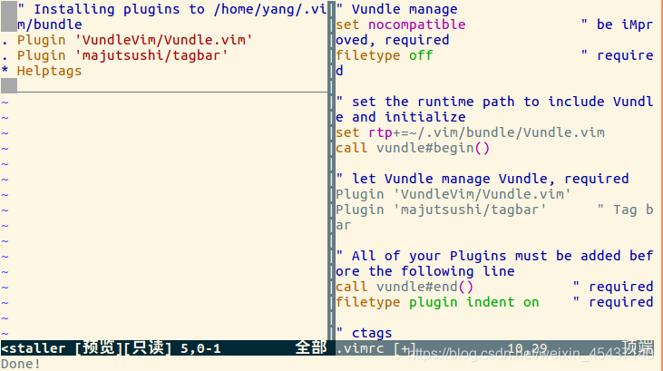  
注意：此处可能无法`':q'`退出，可以先按`'Ctrl + c'`，然后即可正常`':q'`退出。  
3、配置 Tagbar 插件，可以在 `~/.vimrc` 文件中添加如下的配置：

    "	Tagbar
    map <F3> :TagbarToggle<CR> "将Tagbar映射到F3
    let g:tagbar_width = 25
    autocmd BufReadPost *.cpp,*.c,*.h,*.cc,*.cxx call tagbar#autoopen() 

上述配置可让打开常见的源代码文件时会自动打开 Tagbar 插件。  
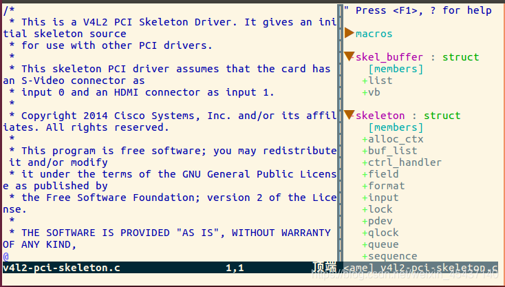  
注意：打开文件后使用`'Ctrl + w'`进行切换窗口。

#### 5、文件浏览插件 NerdTree

NerdTree 插件可以显示树形目录。  
1、安装 NerdTree 插件，在 `~/.vimrc` 文件中添加：

    Plugin 'scrooloose/nerdtree'	

2、然后重启 Vim，输入并运行命令 “`:PluginInstall`” 完成安装。  
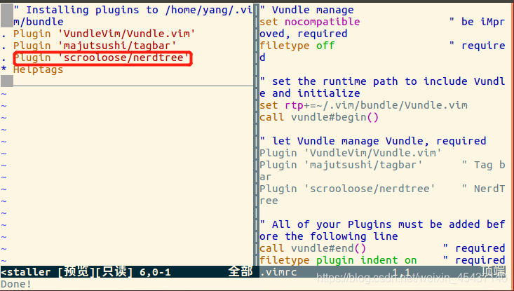

3、配置 NerdTree 插件，可以在 `~/.vimrc` 文件中添加如下的配置：

    " NetRedTree
    autocmd StdinReadPre * let s:std_in=1
    autocmd VimEnter * if argc() == 0 && !exists("s:std_in") | NERDTree | endif
    let NERDTreeWinSize=15
    let NERDTreeShowLineNumbers=1 
    let NERDTreeAutoCenter=1 
    let NERDTreeShowBookmarks=1 

4、NerdTree的使用  
在 Vim 中输入命令 `:NERDTree` ，再按回车，就可以看到安装成功了。  
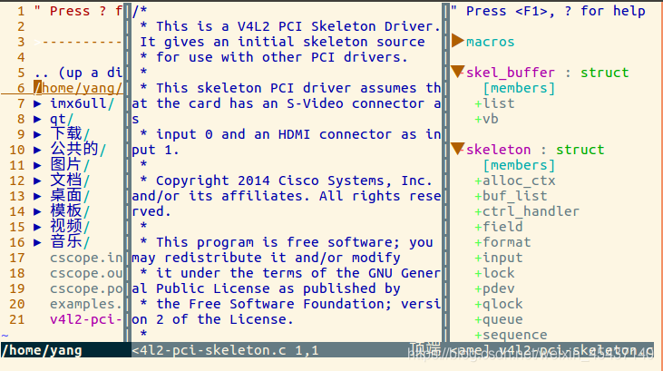

#### 6、动态语法检测工具ALE

1、安装 ALE插件，在 `~/.vimrc` 文件中添加：

    Plugin 'w0rp/ale'	

2、然后重启 Vim，输入并运行命令 “`:PluginInstall`” 完成安装。  
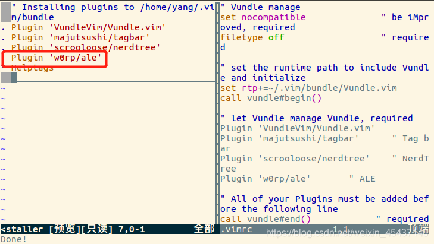

3、配置 ALE 插件，可以在 `~/.vimrc` 文件中添加如下的配置：

    " ALE
    let g:ale_sign_column_always = 1 
    let g:ale_sign_error = '✗' 
    let g:ale_sign_warning = 'w'
    let g:ale_statusline_format = ['✗ %d', 'w  %d','✔ OK']  
    let g:ale_echo_msg_format = '[%linter%] %code %%s'
    let g:ale_lint_on_text_changed = 'normal'
    let g:ale_lint_on_insert_leave = 1
    let g:ale_c_gcc_options = '-Wall -O2 -std=c99'
    let g:ale_cpp_gcc_options = '-Wall -O2 -std=c++14'
    let g:ale_c_cppcheck_options = ''
    let g:ale_cpp_cppcheck_options = ''

当我们利用 Vim 编写一个简单的C程序时，会出现如下警告错误信息提示：  
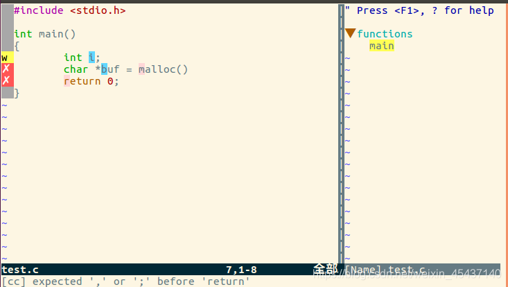

#### 7、[自动补全](https://so.csdn.net/so/search?q=%E8%87%AA%E5%8A%A8%E8%A1%A5%E5%85%A8&spm=1001.2101.3001.7020)插件 YouCompleteMe

在安装 YouCompleteMe 插件之前，需要保证 Vim 的版本必须高于 7.4.1578，并且支持 Python2 或者 Python3(前面版本已经升级为 Vim 8了)。

1、安装 YouCompleteMe 插件，在 `~/.vimrc` 文件中添加：

    Plugin 'Valloric/YouCompleteMe'		" YouCompleteMe

2、然后重启 Vim，输入并运行命令 “`:PluginInstall`” 完成安装。  
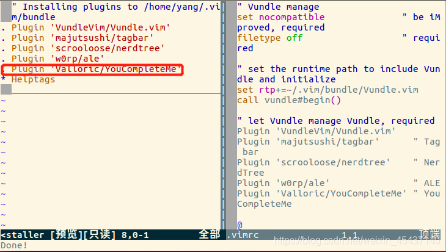  
3、插件安装完成之后，需要重新编译它，因此需要先安装cmake和相关Python头文件

YouCompleteMe的安装需要cmake和python相关头文件的支持，可在终端下通过如下命令安装：

    sudo apt-get install build-essential cmake python-dev python3-dev

接下来进入 YouCompleteMe 插件代码进行编译。  
(注意：本人的此处会发现`~/.vim/bundle/YouCompleteMe`无其他文件，请参考如下博文：[YouCompleteMe安装](https://blog.csdn.net/m0_37624499/article/details/89526701)；  
对于遇到 python3 版本过低时，安装最新 Python3，可参考如下博客：[Ubuntu上安装Python 3.6](https://blog.csdn.net/Wangdada111/article/details/73382537))

    cd ~/.vim/bundle/YouCompleteMe
    ./install.py --clang-completer

–clang-completer 表示对 C/C++ 的支持

4、YouCompleteMe 配置

1）编译完成之后，还需要进行一些配置工作。把 `~/.vim/bundle/YouCompleteMe/third_party/ycmd/examples/.ycm_extra_conf.py` 这个文件复制到 `~/.vim` 目录下面

    sudo cp ~/.vim/bundle/YouCompleteMe/third_party/ycmd/examples/.ycm_extra_conf.py ~/.vim

2）在 `~/.vimrc` 配置文件中还需添加如下配置。

    let g:ycm_server_python_interpreter = '/usr/bin/python'
    let g:ycm_global_ycm_extra_conf ='~/.vim/.ycm_extra_conf.py'

这样就完成了YouCompleteMe插件的安装和配置

5、一个简单的 YouCompleteMe 插件测试  
编辑一个 `.c` 文件时，输入 “#include ” 检查是否会出现如下提示补全：

#### 8、自动索引 Vim-gutentags 插件

在常规的使用ctags生成tag标签文件实现跳转的方式下，每次需要更新tags文件时都需要手工运行 ctags -R 生成当前项目所有源文件对应的tag标签文件。

当工程文件多、文件更新频繁时，上述生成tags文件的方法显得笨拙、低效。

得益于 Vim 8 提供的异步机制，vim插件vim-gutentags能够自动异步生成 tags 文件，当检测到同一个工程下面的文件有修改时，gutentags能自动增量更新对应工程的 tags 文件，而不用全部重新生成tags文件，是一个非常高效的tags生成工具。

1、安装 Vim-gutentags 插件，在 `~/.vimrc` 文件中添加：

    Plugin 'ludovicchabant/vim-gutentags'		" Vim-gutentags

2、然后重启 Vim，输入并运行命令 “`:PluginInstall`” 完成安装。

3、对插件进行一些简单配置，将以下内容添加到 `~/.vimrc` 文件中：

    " gutentags搜索工程目录的标志，碰到这些文件/目录名就停止向上一级目录递归 "
    let g:gutentags_project_root = ['.root', '.svn', '.git', '.hg', '.project']
     
    " 所生成的数据文件的名称 "
    " let g:gutentags_ctags_tagfile = '.tags'
     
    " 将自动生成的 tags 文件全部放入 ~/.cache/tags 目录中，避免污染工程目录 "
    " let s:vim_tags = expand('~/.cache/tags')
    " let g:gutentags_cache_dir = s:vim_tags
    " 检测 ~/.cache/tags 不存在就新建 "
    " if !isdirectory(s:vim_tags)
       " silent! call mkdir(s:vim_tags, 'p')
    " endif
     
    " 配置 ctags 的参数 "
    let g:gutentags_ctags_extra_args = ['--fields=+niazS', '--extra=+q']
    let g:gutentags_ctags_extra_args += ['--c++-kinds=+pxI']
    let g:gutentags_ctags_extra_args += ['--c-kinds=+px']

### 三、常用 vim 插件配置

**1、插件管理工具 Vundle【同上】**  
**2、Tabbar 插件【同上： 4、Tabbar 插件】**

## 参考

[将Vim打造成一个强大的IDE编辑工具_如何将vim变成一个ide-CSDN博客](https://blog.csdn.net/weixin_45437140/article/details/112353826?ops_request_misc=%7B%22request%5Fid%22%3A%226C4351F0-AB1A-4B2E-8834-F8C683CBD9C9%22%2C%22scm%22%3A%2220140713.130102334.pc%5Fall.%22%7D&request_id=6C4351F0-AB1A-4B2E-8834-F8C683CBD9C9&biz_id=0&utm_medium=distribute.pc_search_result.none-task-blog-2~all~first_rank_ecpm_v1~rank_v31_ecpm-1-112353826-null-null.142^v100^pc_search_result_base5&utm_term=把vim打造成一个强大&spm=1018.2226.3001.4187)