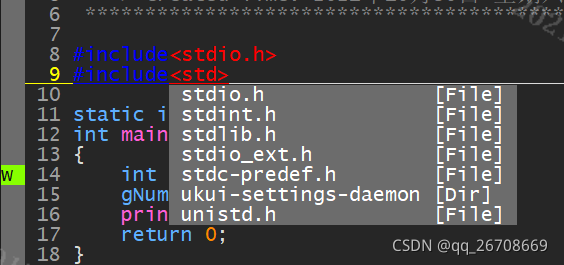
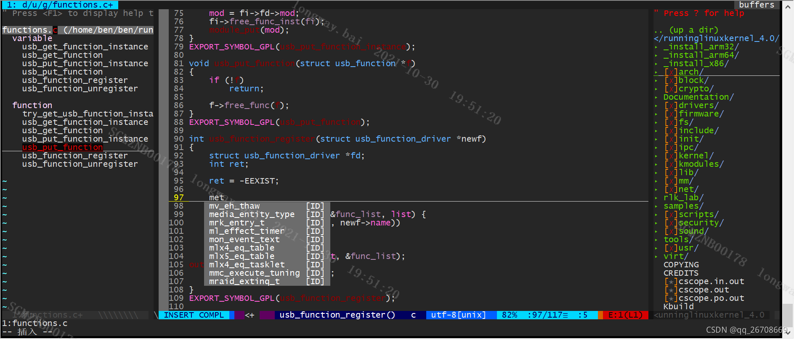

# 将vim配置成强大的IDE编辑工具 

​		经过两个周末的艰苦奋斗，终于将vim所有的配置和插件调整ok，所以特意记录下，以便以后使用，也可以方便其他人来做参考。

        目标：通过配置把vim打造成跟Source Insight媲美的代码编辑器
    
        首先我们先明确下一个优秀的编译器（Source Insight）会有哪些功能

1.  自动列出当前文件中的变量，函数名等
2.  查找当前文件或整个工程的函数调用
3.  查找函数或者变量的定义
4.  自动补全
5.  函数高亮

        以上等等
        
        其实通过适当的配置vim也可以有这些作用，那么接下来我们就言归正传，看看如何来配置一个专属于自己的编辑工具

* * *

## 1 插件管理工具Vundle

        vim支持很多插件，早期需要到每个网站上下载插件，然后复制到home目录下.vim中才能使用。现在Vim社区有很多插件管理工具，其中Vundle就是很出色的一个，他可以在.vimrc中跟踪、管理和自动更新插件等
    
        安装Vundle需要使用git

> $ git clone https://github.com/VundleVim/Vundle.vim.git ~/.vim/bundle/Vundle.vim

        接下来就要在我们的配置文件中去添加插件

<.vimrc文件中相关配置如下> 

> set rtp+=~/.vim/bundle/Vundle.vim  
> call vundle#begin()
>
> " github 仓库中的插件 "  
> Plugin 'VundleVim/Vundle.vim'  
> Plugin 'Valloric/YouCompleteMe'  
> Plugin 'scrooloose/nerdtree'  
> Plugin 'majutsushi/tagbar' " Tag bar"  
> Plugin 'Xuyuanp/nerdtree-git-plugin'  
> Plugin 'jistr/vim-nerdtree-tabs'  
> Plugin 'vim-airline/vim-airline' | Plugin 'vim-airline/vim-airline-themes' " Status line"  
> Plugin 'jiangmiao/auto-pairs'  
> Plugin 'scrooloose/nerdcommenter'
>
> ....
>
> call vundle#end()

        当然除了上面的插件还有很多很多，这里就不再一一列举了，我们等下只会说些比较使用的解释下给大家
    
        安装的方法也很简单，重启vim，然后进入命令模式，输入":PluginInstall"，这个过程需要从网络上下载代码。第一次可能会发现大部分插件都安装失败（插件前会有一个❗表示失败），重启vim重新安装，会有更多的一些安装成功，如果是在无法成功，建议自己手动下载到.vim/bundle/里面

## 2 ctags 工具

ctags工具全称Generate tag files for source code。它可以扫描指定的源文件，找出其中包含的语法元素，并且把相关信息记录下来，这样我们在浏览代码时候就可以实现查找和转跳功能。

安装ctags命令

> $ sudo apt-get install ctags

在使用ctags之前需要先生成索引文件

> $ ctags -R

上述指令会在当前目录下生成tags文件。启动vim之后需要加载这个tags文件

> : set tags = tags      //我实际使用的时候并没有这个操作，貌似也可以使用

ctags常用快捷键如下

| 快捷键   | 用法                                                         |
| -------- | ------------------------------------------------------------ |
| Ctrl+]   | 跳转到定义的所在地方，如果有多个文件有定义会全部列出来，通过数字来选择 |
| Ctrl+T/t | 跳回之前的地方                                               |

## 3 cscope工具

​		ctags可以跳转到定义的地方，但是如果我们想查找哪里调用了这个函数，ctags似乎就无能为力了。cscope工具就可以实现这个功能，这也是Source Insight强大的功能之一

> $ sudo apt-get install cscope

类似ctags，在使用cscope之前也要先生成索引库

> $ cscope -Rbq

其实除了这个方法也可以用下面的命令

> $ make ctags cscope //生成ctags，cscope等索引文件

实际测试效果两个方法没有太大的差别

cscpoe的使用方法我们这里就不再赘述了，想了解的朋友可以自己百度，方法很多也很简单，这里我们贴出.vimrc的配置，方便使用

> "--------------------------------------------------------------------------------  
> "" cscope:建立数据库：cscope -Rbq；  F5 查找c符号； F6 查找字符串；   F7  
> "" 查找函数谁调用了，  
> "--------------------------------------------------------------------------------  
> if has("cscope")  
> set csprg=/usr/bin/cscope  
> set csto=1  
> set cst  
> set nocsverb  
> " add any database in current directory  
> if filereadable("cscope.out")  
>  cs add cscope.out  
> endif  
> set csverb  
> endif  
> :set cscopequickfix=s-,c-,d-,i-,t-,e-
>
> "nmap <C-\_>s :cs find s <C-R>=expand("<cword>")<CR><CR>  
> "F5 查找c符号； F6 查找字符串；  F7 查找函数谁调用了，  
> nmap <silent> <F5> :cs find s <C-R>=expand("<cword>")<CR><CR> :botright copen<CR><CR>   
> nmap <silent> <F6> :cs find t <C-R>=expand("<cword>")<CR><CR> :botright copen<CR><CR>  
> nmap <silent> <F7> :cs find c <C-R>=expand("<cword>")<CR><CR> :botright copen<CR><CR>

如上定义，

-   F5:查找C语言符号，及查找函数名，宏，枚举等出现的地方
-   F6:查找指定的字符串
-   F7:查找调用本函数的函数

* * *

工具介绍完了，下面我们介绍下我个人觉得比较好用的插件

##  4 TlistToggle

TlistToggle类似可以生成一个大纲，包括变量，函数等，可以用来快速跳转到目标位置

安装TlistToggle插件，可以在.vimrc中添加

> Plugin 'taglist.vim'

在vim的命令命令栏输入:TlistToggle可以启动此插件，这里我们可以做对这个插件做些简单的配置使得更加好用，各个选项的解释如下，各位可以自己消化

> " ctags 配置:F3快捷键显示程序中的各种tags，包括变量和函数等。  
> map <F3> :TlistToggle<CR>  
> let Tlist\_Ctags\_Cmd='ctags'                 "基于ctags  
> let Tlist\_Use\_Left\_Window=1                 "0:窗口在右边，1:窗口在左边，也可以改成Right\_Window  
> let Tlist\_Auto\_Open = 1                     "默认打开Taglist"  
> let Tlist\_Show\_One\_File=1                   "不同时显示多个文件的tag,只显示当前文件的  
> let Tlist\_Exit\_OnlyWindow=1                 "如果只有一个buffer,kill窗口也kill掉buffer  
> let Tlist\_Compart\_Format = 1                "不显示空白行  
> let Tlist\_File\_Fold\_Auto\_Close = 1          "打开其他文件的时候自动关闭,只显示一个文件的tag  
> let Tlist\_Auto\_Update=1                     "自动更新,包含新文件时候  
> let Tlist\_Enable\_Fold\_Column = 0            "不要显示折叠树  
> let Tlist\_WinWidt=25

## 5 文件浏览插件

NerdTree插件可以显示树形目录。可以在不退出vim的情况下去打开其他的文件

插件安装以及配置

> Plugin 'The-NERD-tree'  
> "NERDTree 配置:F2快捷键显示当前目录树  
> map <F2> :NERDTreeToggle<CR>  
> let NERDTreeWinSize=25  
> " beautiful  
> let g:NERDChristmasTree=1  
> " window position  
> let g:NERDTreeWinPos='right'

## 6 语法高亮

​    	在vim中只能高亮语法语句，对于函数，变量，宏等无法高亮，对于使用习惯Source Insight的同学来说很不习惯，这个时候就需要用到taghighlight这个插件，目前我使用的缺点就是如果有加载这个插件，每次启动vim会比较慢，大概需要十几秒的样子，这点确实让人抓狂，所以如果对vim启动速度有要求的人慎用，用vim原本的语法高亮(syntax on)，或者自己写python脚本来控制也是可以的。

> "语法高亮插件  
> Plugin 'taghighlight'  
> "打开源码文件，然后  
> ":UpdateTypesFile  
> hi Comment ctermfg=28    
> hi Constant ctermfg=21   
> hi Identifier ctermfg=16   
> hi Statement ctermfg=21   
> hi PreProc ctermfg=21  
> hi Include ctermfg=21   
> hi Macro ctermfg=206   
> hi Type ctermfg=21   
> hi Special ctermfg=67    
> hi Class ctermfg=21   
> hi Function ctermfg=88   
> hi String ctermfg=196   
> hi Member ctermfg=139   
> hi EnumerationValue ctermfg=206   
> hi EnumerationName ctermfg=21   
> hi Namespace ctermfg=21   
> hi DefinedName ctermfg=206

​		上述颜色修改朋友们可以自己去定义，大概每个颜色都会有一个num来定义，可以查看相关链接[vim颜色表](https://blog.csdn.net/cp3alai/article/details/45509459 "vim颜色表")

## 7 [自动补全](https://so.csdn.net/so/search?q=%E8%87%AA%E5%8A%A8%E8%A1%A5%E5%85%A8&spm=1001.2101.3001.7020)插件YouCompleteMe

        这个插件是我认为所有插件中最难安装的插件，因为他对环境的要求真的太高了。但是这个插件对于经常码代码的同学又非常重要。
    
        代码补全功能在Vim发展历史上是一个比较弱的功能，因此一直被使用Source Insight的人诟病，早些年出现的自动补全插件如AutoComplPop，Omnicppcomplete，Nedocomplcache等在效率上低的惊人，特别是把整个Linux内核代码添加到工程时，要使用这些代码补全功能，每次都要等1~2分钟，简直让人抓狂
    
        YouCompleteMe插件是最近几年才出现的新插件，它利用clang为C/C++代码提供代码提示和补全功能。借助clang的强大功能，YouCompleteMe的补全效率和准确性极高，可以和Source Insight一比高下。因此Linux开发人员在Vim配备了YouCompleteMe插件之后完全可以抛弃Source Insight。

准备条件

        在安装YouCompleteMe之前我们需要保证vim的版本必须高于7.4.1578（实际上我在操作的时候，系统要求vim的版本必须要高于8.1.xxxx），最后我去vim的官网上下载了vim8.2才解决了此问题。注意vim的版本下载不能用apt-get，这样vim的版本会比较旧，可以用github下载源码然后自己编译即可
    
        python的版本必须大于3.6，这里大家可以去python的官网上下载，如果系统本身有其他python的版本可以将改变python的软链接，查看python的版本命令

> $ python --version

这里YouCompleteMe本身比较大，如果有Vundle来下载的话，可能会比较慢甚至会error。所以这里建议大家从github上下载

> git clone https://github.com/Valloric/YouCompleteMe.git
>
> cd YouCompleteMe  
> git submodule update --init --recursive    //这个过程很慢，网上有高速下载的方法，参考[ymc高速下载](https://blog.csdn.net/weixin_42929607/article/details/108978323?ops_request_misc=%257B%2522request%255Fid%2522%253A%2522163560581516780265410131%2522%252C%2522scm%2522%253A%252220140713.130102334.pc%255Fall.%2522%257D&request_id=163560581516780265410131&biz_id=0&utm_medium=distribute.pc_search_result.none-task-blog-2~all~first_rank_ecpm_v1~rank_v31_ecpm-2-108978323.first_rank_v2_pc_rank_v29&utm_term=YouCompleteMe%E4%B8%8B%E8%BD%BD%E5%A4%AA%E6%85%A2&spm=1018.2226.3001.4187 "ymc高速下载")

在安装过程中可能会遇到python版本或者cmake，gcc版本过低的问题，这里还是按照提示的要求去对应的官网上更新版本即可

我这里还遇到了Ycm安装成功后启动vim，会报ycm shutdown的信息，然后会告诉你查看log，根据log可以去网上查找方法（我想一定不会一番风顺的），我这里遇到的问题是/usr/lib/x86\_64-linux-gnu/libstdc++.so.6:version 'GLIBCXX\_3.4.26' not found。这里你在系统里搜libstdc++.so.6.0.\*，找到最高的版本（我这里找到的是libstdc++.so.6.0.25），然后去网上下载libstdc++.so.6.0.26，将libstdc++.so.6.0.26软连接到libstdc++.so.6，这样即可。这个时候你在去查看strings /usr/lib/x86\_64-linux-gnu/libstdc++.so.6 | grep GLIBC就能看到GLIBCXX\_3.4.26的版本了

最后可以在vim中测试下是否可以自动补全，如下图

## 8 vim的一般配置

vimrc还有一些其他的常用配置，如显示行号等。这里我直接将我的配置共享出来供大家参考，如有错误，欢迎指正。文章的最后再配上一张效果图。

    set nocompatible
    filetype on
     
    set rtp+=~/.vim/bundle/Vundle.vim
    call vundle#begin()
     
    " 这里根据自己的需要的插件来设置，以下是我的配置
    "
    " YouCompleteMe：语句补全插件
    set runtimepath+=~/.vim/bundle/YouCompleteMe
    autocmd InsertLeave * if pumvisible() == 0|pclose|endif "离开插入模式后自动关闭预览窗口"
    let g:ycm_collect_identifiers_from_tags_files = 1           " 开启 YCM基于标签引擎
    let g:ycm_collect_identifiers_from_comments_and_strings = 1 " 注释与字符串中的内容也用于补全
    let g:syntastic_ignore_files=[".*\.py$"]
    let g:ycm_seed_identifiers_with_syntax = 1                  " 语法关键字补全
    let g:ycm_complete_in_comments = 1
    let g:ycm_confirm_extra_conf = 0                            " 关闭加载.ycm_extra_conf.py提示
    let g:ycm_key_list_select_completion = ['<c-n>', '<Down>']  " 映射按键,没有这个会拦截掉tab, 导致其他插件的tab不能用.
    let g:ycm_key_list_previous_completion = ['<c-p>', '<Up>']
    let g:ycm_complete_in_comments = 1                          " 在注释输入中也能补全
    let g:ycm_complete_in_strings = 1                           " 在字符串输入中也能补全
    let g:ycm_collect_identifiers_from_comments_and_strings = 1 " 注释和字符串中的文字也会被收入补全
    let g:ycm_server_python_interpreter='/usr/bin/python'
    let g:ycm_global_ycm_extra_conf='~/.vim/.ycm_extra_conf.py'
    let g:ycm_show_diagnostics_ui = 0                           " 禁用语法检查
    inoremap <expr> <CR> pumvisible() ? "\<C-y>" : "\<CR>"             " 回车即选中当前项
    nnoremap <c-j> :YcmCompleter GoToDefinitionElseDeclaration<CR>     " 跳转到定义处
    let g:ycm_min_num_of_chars_for_completion=2                 " 从第2个键入字符就开始罗列匹配项
    "
    "
    "
    " github 仓库中的插件 "
    Plugin 'VundleVim/Vundle.vim'
    Plugin 'Valloric/YouCompleteMe'
    Plugin 'scrooloose/nerdtree'
    Plugin 'majutsushi/tagbar' " Tag bar"
    Plugin 'Xuyuanp/nerdtree-git-plugin'
    Plugin 'jistr/vim-nerdtree-tabs'
    Plugin 'scrooloose/syntastic'
    Plugin 'vim-airline/vim-airline' | Plugin 'vim-airline/vim-airline-themes' " Status line"
    Plugin 'jiangmiao/auto-pairs'
    Plugin 'mbbill/undotree'
    Plugin 'gdbmgr'
    Plugin 'scrooloose/nerdcommenter'
    Plugin 'Yggdroot/indentLine' " Indentation level"
    Plugin 'bling/vim-bufferline' " Buffer line"
    "Plugin 'kepbod/quick-scope' " Quick scope""
    "Plugin 'vim-airline/vim-airline'
    "vim-airline配置:优化vim界面"
    let g:airline#extensions#tabline#enabled = 1
    nmap <tab> :bn<cr>       "   设置tab键映射
    "显示颜色
    set t_Co=256
    set laststatus=2
    " 使用powerline打过补丁的字体
    let g:airline_powerline_fonts = 1
     
    " 开启tabline
    let g:airline#extensions#tabline#enabled = 1
    " tabline中当前buffer两端的分隔字符
    let g:airline#extensions#tabline#left_sep = ' '
    " tabline中未激活buffer两端的分隔字符
    let g:airline#extensions#tabline#left_alt_sep = ' '
    " tabline中buffer显示编号
    let g:airline#extensions#tabline#buffer_nr_show = 1
    " 映射切换buffer的键位
    nnoremap [b :bp<CR>
    nnoremap ]b :bn<CR>
    " 映射<leader>num到num buffer
    map <leader>1 :b 1<CR>
    map <leader>2 :b 2<CR>
    map <leader>3 :b 3<CR>
    map <leader>4 :b 4<CR>
    map <leader>5 :b 5<CR>
    map <leader>6 :b 6<CR>
    map <leader>7 :b 7<CR>
    map <leader>8 :b 8<CR>
    map <leader>9 :b 9<CR>

​     
​     
    " vim-scripts 中的插件 "
    Plugin 'taglist.vim'
    " ctags 配置:F3快捷键显示程序中的各种tags，包括变量和函数等。
    map <F3> :TlistToggle<CR>
    let Tlist_Ctags_Cmd='ctags'                 "基于ctags
    let Tlist_Use_Left_Window=1                 "0:窗口在右边，1:窗口在左边
    let Tlist_Auto_Open = 1                     "默认打开Taglist"
    let Tlist_Show_One_File=1                   "不同时显示多个文件的tag,只显示当前文件的
    let Tlist_Exit_OnlyWindow=1                 "如果只有一个buffer,kill窗口也kill掉buffer
    let Tlist_Compart_Format = 1                "不显示空白行
    let Tlist_File_Fold_Auto_Close = 1          "打开其他文件的时候自动关闭,只显示一个文件的tag
    let Tlist_Auto_Update=1                     "自动更新,包含新文件时候
    let Tlist_Enable_Fold_Column = 0            "不要显示折叠树
    let Tlist_WinWidt=25

​      
    Plugin 'The-NERD-tree'
    "NERDTree 配置:F2快捷键显示当前目录树
    map <F2> :NERDTreeToggle<CR>
    let NERDTreeWinSize=25
    " beautiful
    let g:NERDChristmasTree=1
    " window position
    let g:NERDTreeWinPos='right'
     
    "错误检测插件
    Plugin 'w0rp/ale'
    let g:ale_sign_column_always = 1 
    let g:ale_sign_error = '✗' 
    let g:ale_sign_warning = 'w'
    let g:ale_statusline_format = ['✗ %d', '⚡  %d','√ OK']
    let g:ale_echo_msg_format = '[%linter%] %code: %%s'
    let g:ale_lint_on_text_changed = 'normal'
    let g:ale_lint_on_insert_leave = 1
    let g:ale_c_gcc_options = '-Wall -O2 -std=c99'
    let g:ale_cpp_gcc_options = '-Wall -O2 -std=c++14'
    let g:ale_c_cppcheck_options = ''
    let g:ale_cpp_cppcheck_options = ''
     
    "语法高亮插件
    Plugin 'taghighlight'
    "打开源码文件，然后
    ":UpdateTypesFile
    hi Comment ctermfg=28  
    hi Constant ctermfg=21 
    hi Identifier ctermfg=16 
    hi Statement ctermfg=21 
    hi PreProc ctermfg=21
    hi Include ctermfg=21 
    hi Macro ctermfg=206 
    hi Type ctermfg=21 
    hi Special ctermfg=67  
    hi Class ctermfg=21 
    hi Function ctermfg=88 
    hi String ctermfg=196 
    hi Member ctermfg=139 
    hi EnumerationValue ctermfg=206 
    hi EnumerationName ctermfg=21 
    hi Namespace ctermfg=21 
    hi DefinedName ctermfg=206
     
    Plugin 'indentLine.vim'
    Plugin 'delimitMate.vim'
     
    " 非 github 仓库的插件"
    " Plugin 'git://git.wincent.com/command-t.git'
    " 本地仓库的插件 "
     
    call vundle#end()

​     
    """""""""""""""""""""""""""""""""""""""""""""""""""""""""""""""""""""""""""""""""""""""""""""""""
    """""新文件标题
    """"""""""""""""""""""""""""""""""""""""""""""""""""""""""""""""""""""""""""""""""""""""""""""""
    "新建.c,.h,.sh,.java文件，自动插入文件头 
    autocmd BufNewFile *.cpp,*.[ch],*.sh,*.java exec ":call SetTitle()" 
    ""定义函数SetTitle，自动插入文件头
    func SetTitle() 
    	"如果文件类型为.sh文件 
    	if &filetype == 'sh'
    		call setline(1, "##########################################################################") 
    		call append(line("."), "# File Name: ".expand("%")) 
    		call append(line(".")+1, "# Author: longway.bai") 
    		call append(line(".")+2, "# mail: longway.bai@sigmastar.com.cn") 
    		call append(line(".")+3, "# Created Time: ".strftime("%c")) 
    		call append(line(".")+4, "#########################################################################") 
    		call append(line(".")+5, "#!/bin/zsh")
    		call append(line(".")+6, "PATH=/home/edison/bin:/home/edison/.local/bin:/usr/local/sbin:/usr/local/bin:/usr/sbin:/usr/bin:/sbin:/bin:/usr/games:/usr/local/games:/snap/bin:/work/tools/gcc-3.4.5-glibc-2.3.6/bin")
    		call append(line(".")+7, "export PATH")
    		call append(line(".")+8, "")
    	else
    		call setline(1, "/*************************************************************************") 
    		call append(line("."), "	> File Name: ".expand("%")) 
    		call append(line(".")+1, "	> Author: longway.bai") 
    		call append(line(".")+2, "	> Mail: longway.bai@sigmastar.com.cn") 
    		call append(line(".")+3, "	> Created Time: ".strftime("%c")) 
    		call append(line(".")+4, " ************************************************************************/") 
    		call append(line(".")+5, "")
    	endif
    	if &filetype == 'cpp'
    		call append(line(".")+6, "#include<iostream>")
    		call append(line(".")+7, "using namespace std;")
    		call append(line(".")+8, "")
    	endif
    	if &filetype == 'c'
    		call append(line(".")+6, "#include<stdio.h>")
    		call append(line(".")+7, "")
    	endif
    	"	if &filetype=='java'
    	"		call append(line(".")+6,"public class ".expand("%"))
    	“		call append(line(".")+7,"")
    	"	endif
    	"新建文件后，自动定位到文件末尾
    	autocmd BufNewFile * normal G 
    endfunc
     
    """"""""""""""""""""""""""""""""""""""""""""""""""""""""""""""""""""""""""""""""""""""""""""""""""""""
    "键盘命令
    """"""""""""""""""""""""""""""""""""""""""""""""""""""""""""""""""""""""""""""""""""""""""""""""""""""

​     
    nmap <leader>w :w!<cr>
    nmap <leader>f :find<cr>
     
    " 映射全选+复制 ctrl+a
    map <C-A> ggVGY
    map! <C-A> <Esc>ggVGY
    map <F12> gg=G
    " 选中状态下 Ctrl+c 复制
    vmap <C-c> "+y
     
    "--------------------------------------------------------------------------------
    "" cscope:建立数据库：cscope -Rbq；  F5 查找c符号； F6 查找字符串；   F7
    "" 查找函数谁调用了，
    "--------------------------------------------------------------------------------
    if has("cscope")
      set csprg=/usr/bin/cscope
      set csto=1
      set cst
      set nocsverb
      " add any database in current directory
      if filereadable("cscope.out")
        cs add cscope.out
      endif
      set csverb
    endif
    :set cscopequickfix=s-,c-,d-,i-,t-,e-
     
    nmap <C-_>s :cs find s <C-R>=expand("<cword>")<CR><CR>
    nmap <C-_>g :cs find g <C-R>=expand("<cword>")<CR><CR>
    nmap <C-_>c :cs find c <C-R>=expand("<cword>")<CR><CR>
    nmap <C-_>t :cs find t <C-R>=expand("<cword>")<CR><CR>
    nmap <C-_>e :cs find e <C-R>=expand("<cword>")<CR><CR>
    nmap <C-_>f :cs find f <C-R>=expand("<cfile>")<CR><CR>
    nmap <C-_>i :cs find i <C-R>=expand("<cfile>")<CR><CR>
    nmap <C-_>d :cs find d <C-R>=expand("<cword>")<CR><CR>
     
    "nmap <C-_>s :cs find s <C-R>=expand("<cword>")<CR><CR>
    "F5 查找c符号； F6 查找字符串；  F7 查找函数谁调用了，
    nmap <silent> <F5> :cs find s <C-R>=expand("<cword>")<CR><CR> :botright copen<CR><CR> 
    nmap <silent> <F6> :cs find t <C-R>=expand("<cword>")<CR><CR> :botright copen<CR><CR>
    nmap <silent> <F7> :cs find c <C-R>=expand("<cword>")<CR><CR> :botright copen<CR><CR>
    """"""""""""""""""""""""""""""""""""""""""""""""""""""""""""""""""""""""""""""""""""""""""""""""""""""
    "实用设置
    """""""""""""""""""""""""""""""""""""""""""""""""""""""""""""""""""""""""""""""""""""""""""""""""""""
    " 设置当文件被改动时自动载入
     
    set autoread
    " quickfix模式
    autocmd FileType c,cpp map <buffer> <leader><space> :w<cr>:make<cr>
    " 代码补全 
    set completeopt=preview,menu 
    " 允许插件  
    filetype plugin on
    " 共享剪贴板  
    set clipboard=unnamed 
    " 从不备份  
    set nobackup
    "make 运行
    :set makeprg=g++\ -Wall\ \ %
    " 自动保存
    set autowrite
    set ruler                   " 打开状态栏标尺
    set cursorline              " 突出显示当前行
    set magic                   " 设置魔术
    set guioptions-=T           " 隐藏工具栏
    set guioptions-=m           " 隐藏菜单栏
    "set statusline=\ %<%F[%1*%M%*%n%R%H]%=\ %y\ %0(%{&fileformat}\%{&encoding}\ %c:%l/%L%)\
    " 设置在状态行显示的信息
    set foldcolumn=0
    set foldmethod=indent 
    set foldlevel=3 
    set foldenable              " 开始折叠
    " 不要使用vi的键盘模式，而是vim自己的
    set nocompatible
    " 语法高亮
    syntax on
    " 去掉输入错误的提示声音
    set noeb
    " 在处理未保存或只读文件的时候，弹出确认
    set confirm
    " 自动缩进
    set autoindent
    set cindent
    " Tab键的宽度
    set tabstop=4
    " 统一缩进为4
    set softtabstop=4
    set shiftwidth=4
    " 不要用空格代替制表符
    set noexpandtab
    " 在行和段开始处使用制表符
    set smarttab
    " 显示行号
    set number
    " 历史记录数
    set history=1000
    " 禁止生成临时文件
    set nobackup
    set noswapfile
    " 搜索忽略大小写
    set ignorecase
    " 搜索逐字符高亮
    set hlsearch
    set incsearch
    " 行内替换
    set gdefault
    " 编码设置
    set enc=utf-8
    set fencs=utf-8,ucs-bom,shift-jis,gb18030,gbk,gb2312,cp936
    " 语言设置
    set langmenu=zh_CN.UTF-8
    set helplang=cn
    " 我的状态行显示的内容（包括文件类型和解码）
    set statusline=%F%m%r%h%w\ [FORMAT=%{&ff}]\ [TYPE=%Y]\ [POS=%l,%v][%p%%]\%{strftime(\"%d/%m/%y\ -\ %H:%M\")}
    set statusline=[%F]%y%r%m%*%=[Line:%l/%L,Column:%c][%p%%]
    " 总是显示状态行
    set laststatus=2
    " 命令行（在状态行下）的高度，默认为1，这里是2
    set cmdheight=2
    " 侦测文件类型
    filetype on
    " 载入文件类型插件
    filetype plugin on
    " 为特定文件类型载入相关缩进文件
    filetype indent on
    " 保存全局变量
    set viminfo+=!
    " 带有如下符号的单词不要被换行分割
    set iskeyword+=_,$,@,%,#,-
    " 字符间插入的像素行数目
    set linespace=0
    " 增强模式中的命令行自动完成操作
    set wildmenu
    " 使回格键（backspace）正常处理indent, eol, start等
    set backspace=2
    " 允许backspace和光标键跨越行边界
    set whichwrap+=<,>,h,l
    " 可以在buffer的任何地方使用鼠标（类似office中在工作区双击鼠标定位）
    set mouse=a
    set selection=exclusive
    set selectmode=mouse,key
    " 通过使用: commands命令，告诉我们文件的哪一行被改变过
    set report=0
    " 在被分割的窗口间显示空白，便于阅读
    set fillchars=vert:\ ,stl:\ ,stlnc:\
    " 高亮显示匹配的括号
    set showmatch
    " 匹配括号高亮的时间（单位是十分之一秒）
    set matchtime=1
    " 光标移动到buffer的顶部和底部时保持3行距离
    set scrolloff=3
    " 设置vim背景颜色
    colorscheme 256-grayvim
    " 为C程序提供自动缩进
    set smartindent
    " 高亮显示普通txt文件（需要txt.vim脚本）
     au BufRead,BufNewFile *  setfiletype txt
    "自动补全
    :inoremap ( ()<ESC>i
    :inoremap ) <c-r>=ClosePair(')')<CR>
    ":inoremap { {<CR>}<ESC>O
    :inoremap } <c-r>=ClosePair('}')<CR>
    :inoremap [ []<ESC>i
    :inoremap ] <c-r>=ClosePair(']')<CR>
    :inoremap " ""<ESC>i
    :inoremap ' ''<ESC>i
    function! ClosePair(char)
    	if getline('.')[col('.') - 1] == a:char
    		return "\<Right>"
    	else
    		return a:char
    	endif
    endfunction
    filetype plugin indent on
     
    "打开文件类型检测, 加了这句才可以用智能补全
    set completeopt=longest,menu
     
    "vim 记录上次关闭是光标的位置
    set viminfo='10,\"100,:20,%,n~/.viminfo 
    au BufReadPost * if line("'\"") > 0|if line("'\"") <= line("$")|exe("norm '\"")|else|exe "norm $"|endif|endif
    """"""""""""""""""""""""""""""""""""""""""""""""""""""""""""""""""""

