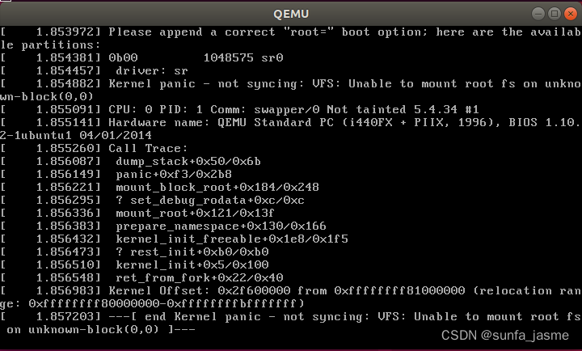

# Linux-lab3: 基于Qemu/Busybox的内核跟踪调试

## Linux内核的核心目录

init ： 其中的main.c中的start\_kernel函数是内核的起点

kernel ： 主内核代码 (内核的内核)

mm ： memory management

fs ： file system，实现了文件系统

ipc ： inter\-process communication，[进程通信](https://so.csdn.net/so/search?q=%E8%BF%9B%E7%A8%8B%E9%80%9A%E4%BF%A1&spm=1001.2101.3001.7020)

net ： 实现网络，如TCP/[IP协议](https://so.csdn.net/so/search?q=IP%E5%8D%8F%E8%AE%AE&spm=1001.2101.3001.7020)栈

drivers： 设备驱动程序

lib ： 库文件，因为内核无法使用C标准库函数

include ：建立内核代码时所需的公共的头文件，它们是各种体系结构(例如：[ARM](https://so.csdn.net/so/search?q=ARM&spm=1001.2101.3001.7020)/x86)共用的

## 调试过程

下载linux内核源代码并解压：

    sudo apt install axel
    axel -n 20 https://mirrors.edge.kernel.org/pub/linux/kernel/v5.x/linux-5.4.34.tar.xz
    xz -d linux-5.4.34.tar.xz
    tar -xvf linux-5.4.34.tar
    cd linux-5.4.34

  

下载编译工具：

    sudo apt install build-essential libncurses-dev bison flex libssl-dev libelf-dev         # 编译器大礼包
    make defconfig     # 进行默认设置。
    make -j$(nproc)    # 编译内核
    sudo apt install qemu    # install QEMU
    qemu-system-x86_64 -kernel arch/x86/boot/bzImage # 使用qemu运行内核程序
    sudo apt install libncurses5-dev bison flex libssl-dev libelf-dev 

  

在linux-5.4.34文件夹下：

make menuconfig  
在UI中设置debug选项并关闭KASLR (kernel address space layout randomize，为提高内核安全性将kernel随机的加载到不同的物理地址运行。但是这一特性将导致实验中打断点失败)

    Kernel hacking  --->                  # debug选项    
    	Compile-time checks and compiler options  --->        
    		[*] Compile the kernel with debug info        
    		[*]   Provide GDB scripts for kernel debugging    
    	[*] Kernel debugging
    Processor type and features ---->     # KASLR选项    
    	[] Randomize the address of the kernel image (KASLR)

  

 返回cmd输入以下命令：

    make -j$(nproc)
    qemu-system-x86_64 -kernel arch/x86/boot/bzImage # 测试内核能不能正常加载运行

  

内核运行结果如下，由于没有根文件系统，导致kernel panic。

 以下我们借助Busybox制作一个简易根文件系统，它能提供基本的用户态可执行程序。下载安装：

    axel -n 20 https://busybox.net/downloads/busybox-1.31.1.tar.bz2
    tar -jxvf busybox-1.31.1.tar.bz2
    cd busybox-1.31.1make menuconfig                    # 设置BusyBox
    make -j$(nproc) && make install    # 编译BusyBox

 将相关文件复制到文件夹rootfs中：

    mkdir rootfs
    cd rootfs
    cp ../busybox-1.31.1/_install/* ./ -rf
    mkdir dev proc sys home    # 建立多个文件夹
    sudo cp -a /dev/{null,console,tty,tty1,tty2,tty3,tty4} dev/

  

然后新建一个init脚本文件，内容如下：

    #!/bin/sh
    mount -t proc none /proc
    mount -t sysfs none /sys
    echo "Wellcome MengningOS!"
    echo "--------------------"
    cd home/bin/sh

  

然后给该脚本文件加可执行权限：

    chmod +x init

  

打包成内存根文件系统镜像；

测试挂载根文件系统，可以发现启动完成后执行了init脚本。

使用以下命令打开或关闭虚拟机：

    qemu-system-x86_64 -kernel linux-5.4.34/arch/x86/boot/bzImage -initrd rootfs.cpio.gz -S -s        # 新窗口启动虚拟机
    qemu-system-x86_64 -kernel linux-5.4.34/arch/x86/boot/bzImage -initrd rootfs.cpio.gz -S -s -nographic -append "console=ttyS0" # 使用纯命令行下启动虚拟机
    killall qemu-system-x86_64  # 强行关闭虚拟机

  

在linux内核文件夹下启动一个新的终端，加载内核符号表，这样就能在命令行中调试内核代码了。

 也可以在VSCode中进行断点调试，但需要额外配置调试环境。

Linux内耗启动分析(main.c)

 1、内核起点start\_kernel();

通过init\_task()创建0号进程，它同样也是idle进程(用于维持内核态的无限循环)，它能将该函数及其之前的一系列指令都划归到0号进程的进程环境中。

 2、内核初始化init\_task();

lockdep\_init()             // 内核依赖关系表和哈希表  
boot\_init\_stack\_canary():  // 栈保护，防止缓冲区攻击  
tick\_init():               // 启动时钟  
boot\_cpu\_init():           // 激活CPU  
setup\_arch():              // 设置不同CPU的参数  
trap\_init():               // 硬件中断门  
mm\_init():                 // 内存分配  
sched\_init():              // 任务调度  
init\_IRQ():                // 中断向量  
set\_intr\_gate;             // 中断门  
set\_system\_trap\_gate;      // 系统调用  
3、rest\_init()函数创建了kernel\_init()和kthreadd两个线程，后者负责对其他内核线程管理调度。

 4、当根文件系统就绪后，kernel\_init()函数通过do\_execve系统调用执行/sbin/init文件，此时OS进入用户态。

## 参考

[Linux-lab3: 基于Qemu/Busybox的内核跟踪调试_busybox axel-CSDN博客](https://blog.csdn.net/weixin_44598934/article/details/130689929?ops_request_misc=%7B%22request%5Fid%22%3A%22A80FB1B7-DE00-4EFE-8027-815E92F29CE7%22%2C%22scm%22%3A%2220140713.130102334..%22%7D&request_id=A80FB1B7-DE00-4EFE-8027-815E92F29CE7&biz_id=0&utm_medium=distribute.pc_search_result.none-task-blog-2~all~sobaiduend~default-2-130689929-null-null.142^v100^pc_search_result_base4&utm_term=linux lab&spm=1018.2226.3001.4187)