# linux-lab3：基于VS Code的Linux内核调试环境搭建及start_kernel跟踪分析

## 1 安装开发工具

    sudo apt install build-essential
    sudo apt install qemu # install QEMU
    sudo apt install libncurses5-dev bison flex libssl-dev libelf-dev

## 2 下载内核源代码

    sudo apt install axel
    axel -n 20 https://mirrors.edge.kernel.org/pub/linux/kernel/v5.x/linux-5.4.34.tar.xz
    xz -d linux-5.4.34.tar.xztar -xvf linux-5.4.34.tar
    cd linux-5.4.34

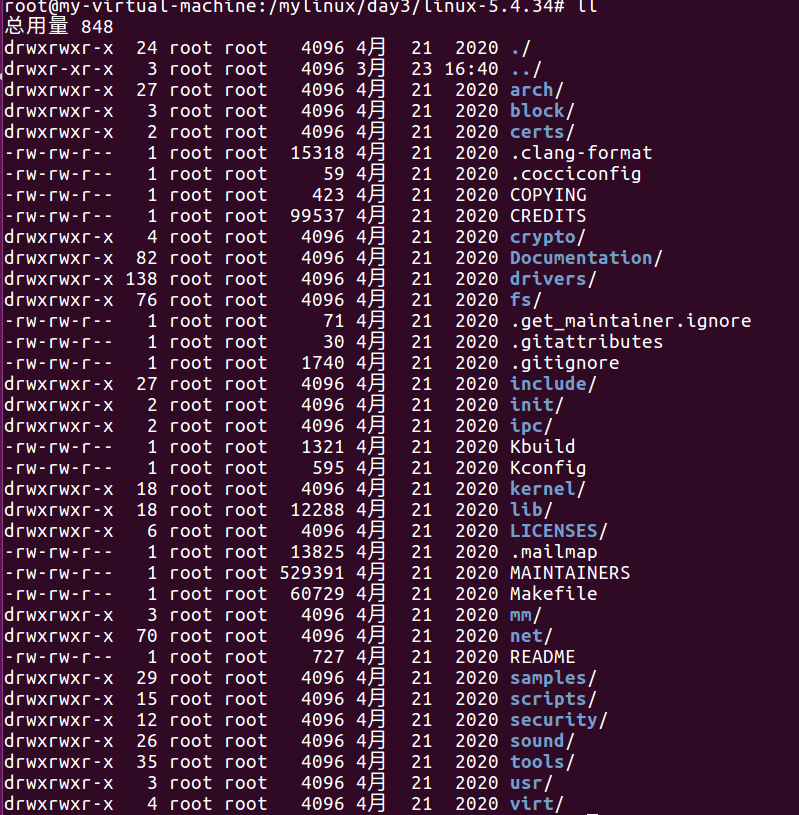

## 3 配置内核选项

    make defconfig # Default configuration is based on 'x86_64_defconfig'

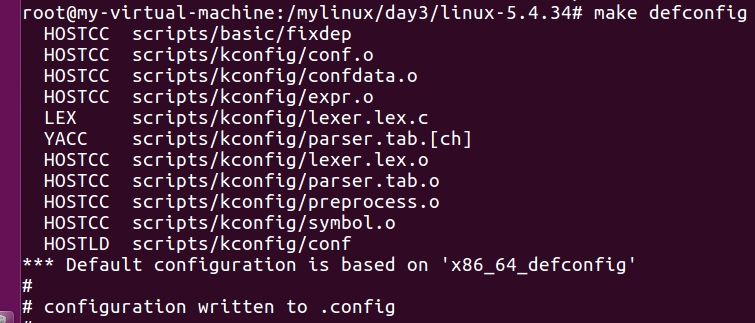

    make menuconfig打开界面后，按enter键是进入，按space键选择[]或[*] 
    Kernel hacking  --->    
    	Compile-time checks and compiler options  --->        
    		[*] Compile the kernel with debug info        
    		[*]   Provide GDB scripts for kernel debugging 
    [*] Kernel debugging
    # 关闭KASLR，否则会导致打断点失败
    Processor type and features ---->    
    	[] Randomize the address of the kernel image (KASLR)

-   Kernel hacking在最后一行
    


-   进入Kernel hacking之后，就直接会显示Kernel debugging，这里可以看到已经是\[\*\]了
    

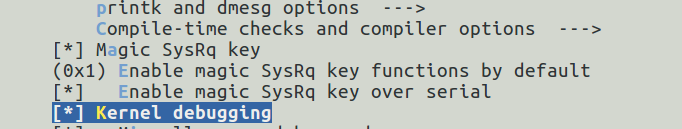

-   修改Compile-time checks and compiler options
    

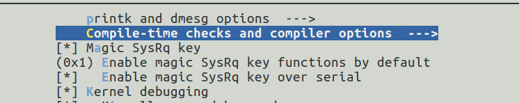

## 4 编译和运行内核

    make -j$(nproc) # nproc gives the number of CPU cores/threads available# 测试一下内核能不能正常加载运行，因为没有文件系统最终会kernel panic
    qemu-system-x86_64 -kernel arch/x86/boot/bzImage

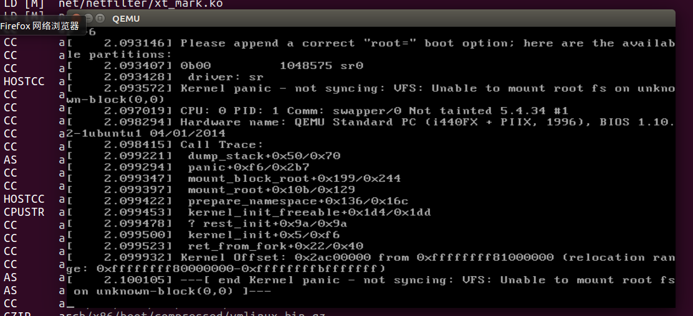

## 5 制作根文件系统

-   安装busybox
    
    ```
    axel -n 20 https://busybox.net/downloads/busybox-1.31.1.tar.bz2# 1.31.0 老是出bug这里改成了1.35.0
    tar -jxvf busybox-1.35.0.tar.bz2
    cd busybox-1.35.0
    
    
    make menuconfigSettings  --->    
    	[*] Build static binary (no shared libs)
    make -j$(nproc) && make install
    ```
    
    
    
-   然后制作内存根文件系统镜像
    
    ```
    mkdir rootfs
    cd rootfs
    cp ../busybox-1.31.1/_install/* ./ -rf
    mkdir dev proc sys home
    sudo cp -a /dev/{null,console,tty,tty1,tty2,tty3,tty4} dev/
    #准备init脚本文件放在根文件系统跟目录下（rootfs/init），添加如下内容到init文件。
    vim init
     
    ==========复制到init中============
    #!/bin/sh
    mount -t proc none /proc
    mount -t sysfs none /sys
    echo "Wellcome MengningOS!"
    echo "--------------------"
    cd home
    /bin/sh
    ==========复制到init中============
     
     
    给init脚本添加可执行权限
    chmod +x init
    #打包成内存根文件系统镜像
    find . -print0 | cpio --null -ov --format=newc | gzip -9 > ../rootfs.cpio.gz 
    #测试挂载根文件系统，看内核启动完成后是否执行init脚本
    qemu-system-x86_64 -kernel ./arch/x86/boot/bzImage -initrd rootfs.cpio.gz
    ```
    
    

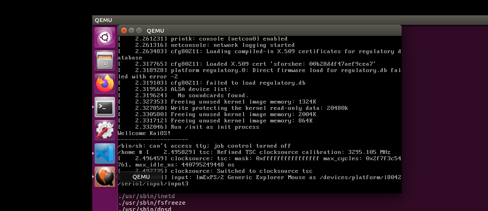

## 6 配置VS Code调试linux

-   安装vscode，到官网下载安装包
    
    ```
    sudo apt install ./code_1.76.1-1678294265_amd64.deb
    
    sudo apt install global
    ```
    
-   在[linux根目录](https://so.csdn.net/so/search?q=linux%E6%A0%B9%E7%9B%AE%E5%BD%95&spm=1001.2101.3001.7020)下创建.vscode，然后将配置文件复制过去
    

配置文件连接[https://github.com/mengning/linuxkernel/tree/master/src/kerneldebuging](https://github.com/mengning/linuxkernel/tree/master/src/kerneldebuging)

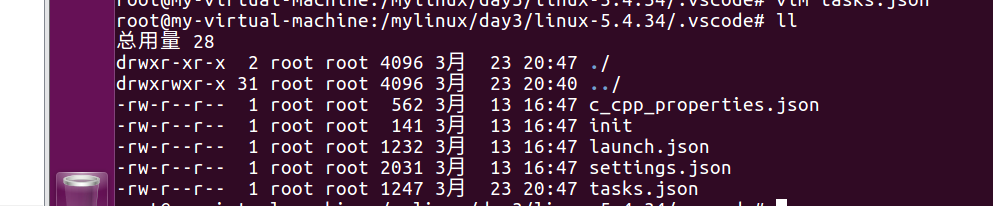

-   修改tasks.json，这里的命令对应之前的qemu-system-x86\_64 -kernel arch/x86/boot/bzImage
    

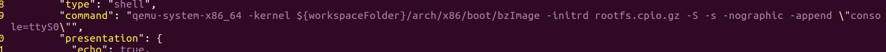

-   vscode下载插件
    

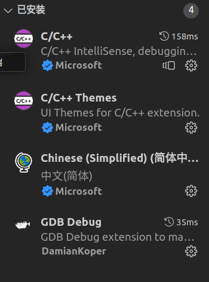

-   使用vscode打开[linux目录](https://so.csdn.net/so/search?q=linux%E7%9B%AE%E5%BD%95&spm=1001.2101.3001.7020)
    

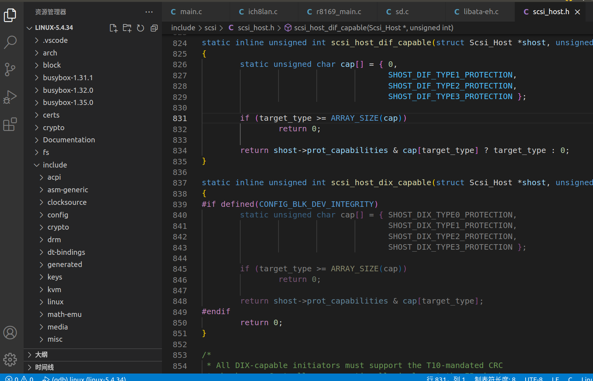

-   添加断点
    

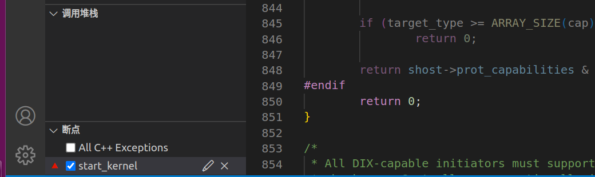

-   点击启动调试
    

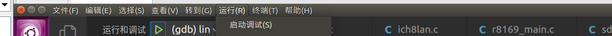

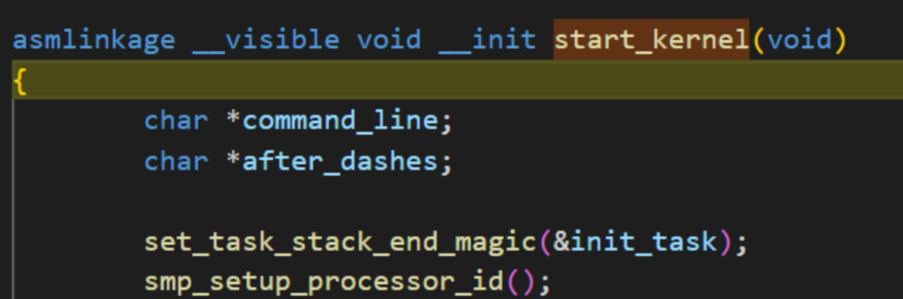

-   分析
    
-   0号进程init\_task被设置整个系统的第一个进程
    
-   start\_kernel会执行一些初始化操作，包括初始化各种重要的数据结构、驱动程序、中断处理程序等
    
-   start\_kernel的结尾arch\_call\_reset\_init()，这个点开这个函数的定义是执行了reset\_init()函数
    
-   遇到了kernel\_init，它是所有用户进程的祖先，由kernel\_thread函数创建，kernel\_thread函数创建一个新的内核线程
    
-   kernel\_thread函数是通过\_do\_fork函数来创建进程的